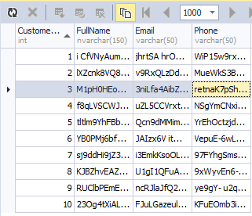
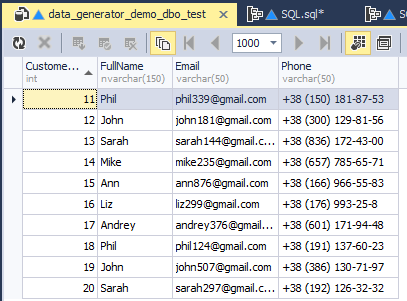

# SQL Server Test Data Generator
## License
- MIT
## Technologies
- SQL
- SQL Server
- Testing
- SQL database
## Topics
- SQL
- SQL Server
- Performance testing
- Databases
- Testing
## Updated
- 12/06/2016
## Description

<h1><strong>Building the Sample</strong></h1>

Works for SQL Server 2012 and latest.

<a title="dbForge Studio for SQL Server" href="https://www.devart.com/dbforge/sql/studio/" target="_blank">dbForge Studio for SQL Server</a>&nbsp;is used for writing and executing T-SQL code.

<h1>Description</h1>

Software testing plays an important role in the development of any software product.&nbsp;The database testing is as much important as the application code testing.&nbsp;However,without test data in the test environment, it is quite impossible to predict
 the way the database will behave after the release. The following example demonstrates, &nbsp;how to generate test data to be used in the test environment.In this example we will use the power of T-SQL syntax, to generate random test data for your database
 table. Later, we will see how to transform randomly generated data set to the meaningful one. 
First, we need to create a test databse. The database contains only one test table. The table contains the following columns: CustomerID, Fullname, Email, Phone.

Here is the T-SQL code that creates the demo database with the demo table:

SQL

Из&#1084;енение сценария|Remove

mysql

<pre class="mysql">USE&nbsp;[master]&nbsp;
GO&nbsp;
&nbsp;
IF&nbsp;DB_ID('data_generator_demo')&nbsp;IS&nbsp;NOT&nbsp;NULL&nbsp;
BEGIN&nbsp;
&nbsp;&nbsp;ALTER&nbsp;DATABASE&nbsp;[data_generator_demo]&nbsp;SET&nbsp;SINGLE_USER&nbsp;WITH&nbsp;ROLLBACK&nbsp;IMMEDIATE&nbsp;
&nbsp;&nbsp;DROP&nbsp;DATABASE&nbsp;[data_generator_demo]&nbsp;
END&nbsp;
GO&nbsp;
&nbsp;
CREATE&nbsp;DATABASE&nbsp;[data_generator_demo]&nbsp;
GO&nbsp;
&nbsp;
USE&nbsp;[data_generator_demo]&nbsp;
GO&nbsp;
&nbsp;
CREATE&nbsp;TABLE&nbsp;dbo.test&nbsp;(&nbsp;
&nbsp;&nbsp;[CustomerID]&nbsp;INT&nbsp;IDENTITY&nbsp;PRIMARY&nbsp;KEY&nbsp;
&nbsp;,[FullName]&nbsp;NVARCHAR(150)&nbsp;
&nbsp;,[Email]&nbsp;VARCHAR(50)&nbsp;NOT&nbsp;NULL&nbsp;
&nbsp;,[Phone]&nbsp;VARCHAR(50)&nbsp;
)&nbsp;
GO&nbsp;
</pre>

The following script will generate the random data set for the table:

&nbsp;

SQL

Из&#1084;енение сценария|Remove

mysql

<pre class="js">DECLARE&nbsp;@obj&nbsp;INT&nbsp;=&nbsp;OBJECT_ID('dbo.test')&nbsp;
&nbsp;&nbsp;&nbsp;&nbsp;&nbsp;&nbsp;,&nbsp;@sql&nbsp;NVARCHAR(MAX)&nbsp;
&nbsp;&nbsp;&nbsp;&nbsp;&nbsp;&nbsp;,&nbsp;@cnt&nbsp;INT&nbsp;=&nbsp;10&nbsp;
&nbsp;
;WITH&nbsp;
&nbsp;&nbsp;&nbsp;&nbsp;E1(N)&nbsp;AS&nbsp;(&nbsp;
&nbsp;&nbsp;&nbsp;&nbsp;&nbsp;&nbsp;&nbsp;&nbsp;SELECT&nbsp;*&nbsp;FROM&nbsp;(&nbsp;
&nbsp;&nbsp;&nbsp;&nbsp;&nbsp;&nbsp;&nbsp;&nbsp;&nbsp;&nbsp;&nbsp;&nbsp;VALUES&nbsp;
&nbsp;&nbsp;&nbsp;&nbsp;&nbsp;&nbsp;&nbsp;&nbsp;&nbsp;&nbsp;&nbsp;&nbsp;&nbsp;&nbsp;&nbsp;&nbsp;(1),(1),(1),(1),(1),&nbsp;
&nbsp;&nbsp;&nbsp;&nbsp;&nbsp;&nbsp;&nbsp;&nbsp;&nbsp;&nbsp;&nbsp;&nbsp;&nbsp;&nbsp;&nbsp;&nbsp;(1),(1),(1),(1),(1)&nbsp;
&nbsp;&nbsp;&nbsp;&nbsp;&nbsp;&nbsp;&nbsp;&nbsp;)&nbsp;t(N)&nbsp;
&nbsp;&nbsp;&nbsp;&nbsp;),&nbsp;
&nbsp;&nbsp;&nbsp;&nbsp;E2(N)&nbsp;AS&nbsp;(SELECT&nbsp;1&nbsp;FROM&nbsp;E1&nbsp;a,&nbsp;E1&nbsp;b),&nbsp;
&nbsp;&nbsp;&nbsp;&nbsp;E4(N)&nbsp;AS&nbsp;(SELECT&nbsp;1&nbsp;FROM&nbsp;E2&nbsp;a,&nbsp;E2&nbsp;b),&nbsp;
&nbsp;&nbsp;&nbsp;&nbsp;E8(N)&nbsp;AS&nbsp;(SELECT&nbsp;1&nbsp;FROM&nbsp;E4&nbsp;a,&nbsp;E4&nbsp;b)&nbsp;
SELECT&nbsp;@sql&nbsp;=&nbsp;'&nbsp;
DELETE&nbsp;FROM&nbsp;'&nbsp;&#43;&nbsp;QUOTENAME(OBJECT_SCHEMA_NAME(@obj))&nbsp;
&nbsp;&nbsp;&nbsp;&nbsp;&#43;&nbsp;'.'&nbsp;&#43;&nbsp;QUOTENAME(OBJECT_NAME(@obj))&nbsp;&#43;&nbsp;'&nbsp;
&nbsp;
;WITH&nbsp;
&nbsp;&nbsp;&nbsp;&nbsp;E1(N)&nbsp;AS&nbsp;(&nbsp;
&nbsp;&nbsp;&nbsp;&nbsp;&nbsp;&nbsp;&nbsp;&nbsp;SELECT&nbsp;*&nbsp;FROM&nbsp;(&nbsp;
&nbsp;&nbsp;&nbsp;&nbsp;&nbsp;&nbsp;&nbsp;&nbsp;&nbsp;&nbsp;&nbsp;&nbsp;VALUES&nbsp;
&nbsp;&nbsp;&nbsp;&nbsp;&nbsp;&nbsp;&nbsp;&nbsp;&nbsp;&nbsp;&nbsp;&nbsp;&nbsp;&nbsp;&nbsp;&nbsp;(1),(1),(1),(1),(1),&nbsp;
&nbsp;&nbsp;&nbsp;&nbsp;&nbsp;&nbsp;&nbsp;&nbsp;&nbsp;&nbsp;&nbsp;&nbsp;&nbsp;&nbsp;&nbsp;&nbsp;(1),(1),(1),(1),(1)&nbsp;
&nbsp;&nbsp;&nbsp;&nbsp;&nbsp;&nbsp;&nbsp;&nbsp;)&nbsp;t(N)&nbsp;
&nbsp;&nbsp;&nbsp;&nbsp;),&nbsp;
&nbsp;&nbsp;&nbsp;&nbsp;E2(N)&nbsp;AS&nbsp;(SELECT&nbsp;1&nbsp;FROM&nbsp;E1&nbsp;a,&nbsp;E1&nbsp;b),&nbsp;
&nbsp;&nbsp;&nbsp;&nbsp;E4(N)&nbsp;AS&nbsp;(SELECT&nbsp;1&nbsp;FROM&nbsp;E2&nbsp;a,&nbsp;E2&nbsp;b),&nbsp;
&nbsp;&nbsp;&nbsp;&nbsp;E8(N)&nbsp;AS&nbsp;(SELECT&nbsp;1&nbsp;FROM&nbsp;E4&nbsp;a,&nbsp;E4&nbsp;b)&nbsp;
INSERT&nbsp;INTO&nbsp;'&nbsp;&#43;&nbsp;QUOTENAME(OBJECT_SCHEMA_NAME(@obj))&nbsp;
&nbsp;&nbsp;&nbsp;&nbsp;&#43;&nbsp;'.'&nbsp;&#43;&nbsp;QUOTENAME(OBJECT_NAME(@obj))&nbsp;&#43;&nbsp;'('&nbsp;&#43;&nbsp;
&nbsp;&nbsp;&nbsp;&nbsp;STUFF((&nbsp;
&nbsp;&nbsp;&nbsp;&nbsp;&nbsp;&nbsp;&nbsp;&nbsp;SELECT&nbsp;',&nbsp;'&nbsp;&#43;&nbsp;QUOTENAME(name)&nbsp;
&nbsp;&nbsp;&nbsp;&nbsp;&nbsp;&nbsp;&nbsp;&nbsp;FROM&nbsp;sys.columns&nbsp;c&nbsp;
&nbsp;&nbsp;&nbsp;&nbsp;&nbsp;&nbsp;&nbsp;&nbsp;WHERE&nbsp;c.[object_id]&nbsp;=&nbsp;@obj&nbsp;
&nbsp;&nbsp;&nbsp;&nbsp;&nbsp;&nbsp;&nbsp;&nbsp;&nbsp;&nbsp;&nbsp;&nbsp;AND&nbsp;c.is_identity&nbsp;=&nbsp;0&nbsp;
&nbsp;&nbsp;&nbsp;&nbsp;&nbsp;&nbsp;&nbsp;&nbsp;&nbsp;&nbsp;&nbsp;&nbsp;AND&nbsp;c.is_computed&nbsp;=&nbsp;0&nbsp;
&nbsp;&nbsp;&nbsp;&nbsp;&nbsp;&nbsp;&nbsp;&nbsp;FOR&nbsp;XML&nbsp;PATH(''),&nbsp;TYPE).value('.',&nbsp;'NVARCHAR(MAX)'),&nbsp;1,&nbsp;2,&nbsp;'')&nbsp;
&#43;&nbsp;')&nbsp;
SELECT&nbsp;TOP('&nbsp;&#43;&nbsp;CAST(@cnt&nbsp;AS&nbsp;VARCHAR(10))&nbsp;&#43;&nbsp;')&nbsp;'&nbsp;&#43;&nbsp;
STUFF((&nbsp;
&nbsp;&nbsp;&nbsp;&nbsp;SELECT&nbsp;'&nbsp;
&nbsp;&nbsp;&nbsp;&nbsp;,&nbsp;'&nbsp;&#43;&nbsp;QUOTENAME(name)&nbsp;&#43;&nbsp;'&nbsp;=&nbsp;'&nbsp;&#43;&nbsp;
&nbsp;&nbsp;&nbsp;&nbsp;&nbsp;&nbsp;&nbsp;&nbsp;CASE&nbsp;&nbsp;
&nbsp;&nbsp;&nbsp;&nbsp;&nbsp;&nbsp;&nbsp;&nbsp;&nbsp;&nbsp;&nbsp;&nbsp;WHEN&nbsp;TYPE_NAME(c.system_type_id)&nbsp;IN&nbsp;(&nbsp;
&nbsp;&nbsp;&nbsp;&nbsp;&nbsp;&nbsp;&nbsp;&nbsp;&nbsp;&nbsp;&nbsp;&nbsp;&nbsp;&nbsp;&nbsp;&nbsp;&nbsp;&nbsp;&nbsp;&nbsp;&nbsp;&nbsp;&nbsp;&nbsp;'varchar',&nbsp;'char',&nbsp;'nvarchar',&nbsp;
&nbsp;&nbsp;&nbsp;&nbsp;&nbsp;&nbsp;&nbsp;&nbsp;&nbsp;&nbsp;&nbsp;&nbsp;&nbsp;&nbsp;&nbsp;&nbsp;&nbsp;&nbsp;&nbsp;&nbsp;&nbsp;&nbsp;&nbsp;&nbsp;'nchar',&nbsp;'ntext',&nbsp;'text'&nbsp;
&nbsp;&nbsp;&nbsp;&nbsp;&nbsp;&nbsp;&nbsp;&nbsp;&nbsp;&nbsp;&nbsp;&nbsp;&nbsp;&nbsp;&nbsp;&nbsp;)&nbsp;
&nbsp;&nbsp;&nbsp;&nbsp;&nbsp;&nbsp;&nbsp;&nbsp;&nbsp;&nbsp;&nbsp;&nbsp;&nbsp;&nbsp;&nbsp;&nbsp;THEN&nbsp;(&nbsp;
&nbsp;&nbsp;&nbsp;&nbsp;&nbsp;&nbsp;&nbsp;&nbsp;&nbsp;&nbsp;&nbsp;&nbsp;&nbsp;&nbsp;&nbsp;&nbsp;&nbsp;&nbsp;&nbsp;&nbsp;STUFF((&nbsp;
&nbsp;&nbsp;&nbsp;&nbsp;&nbsp;&nbsp;&nbsp;&nbsp;&nbsp;&nbsp;&nbsp;&nbsp;&nbsp;&nbsp;&nbsp;&nbsp;&nbsp;&nbsp;&nbsp;&nbsp;&nbsp;&nbsp;&nbsp;&nbsp;SELECT&nbsp;TOP(&nbsp;
&nbsp;&nbsp;&nbsp;&nbsp;&nbsp;&nbsp;&nbsp;&nbsp;&nbsp;&nbsp;&nbsp;&nbsp;&nbsp;&nbsp;&nbsp;&nbsp;&nbsp;&nbsp;&nbsp;&nbsp;&nbsp;&nbsp;&nbsp;&nbsp;&nbsp;&nbsp;&nbsp;&nbsp;&nbsp;&nbsp;&nbsp;&nbsp;CASE&nbsp;WHEN&nbsp;max_length&nbsp;=&nbsp;-1&nbsp;
&nbsp;&nbsp;&nbsp;&nbsp;&nbsp;&nbsp;&nbsp;&nbsp;&nbsp;&nbsp;&nbsp;&nbsp;&nbsp;&nbsp;&nbsp;&nbsp;&nbsp;&nbsp;&nbsp;&nbsp;&nbsp;&nbsp;&nbsp;&nbsp;&nbsp;&nbsp;&nbsp;&nbsp;&nbsp;&nbsp;&nbsp;&nbsp;&nbsp;&nbsp;&nbsp;&nbsp;THEN&nbsp;CAST(RAND()&nbsp;*&nbsp;10000&nbsp;AS&nbsp;INT)&nbsp;
&nbsp;&nbsp;&nbsp;&nbsp;&nbsp;&nbsp;&nbsp;&nbsp;&nbsp;&nbsp;&nbsp;&nbsp;&nbsp;&nbsp;&nbsp;&nbsp;&nbsp;&nbsp;&nbsp;&nbsp;&nbsp;&nbsp;&nbsp;&nbsp;&nbsp;&nbsp;&nbsp;&nbsp;&nbsp;&nbsp;&nbsp;&nbsp;&nbsp;&nbsp;&nbsp;&nbsp;ELSE&nbsp;max_length&nbsp;
&nbsp;&nbsp;&nbsp;&nbsp;&nbsp;&nbsp;&nbsp;&nbsp;&nbsp;&nbsp;&nbsp;&nbsp;&nbsp;&nbsp;&nbsp;&nbsp;&nbsp;&nbsp;&nbsp;&nbsp;&nbsp;&nbsp;&nbsp;&nbsp;&nbsp;&nbsp;&nbsp;&nbsp;&nbsp;&nbsp;&nbsp;&nbsp;END&nbsp;
&nbsp;&nbsp;&nbsp;&nbsp;&nbsp;&nbsp;&nbsp;&nbsp;&nbsp;&nbsp;&nbsp;&nbsp;&nbsp;&nbsp;&nbsp;&nbsp;&nbsp;&nbsp;&nbsp;&nbsp;&nbsp;&nbsp;&nbsp;&nbsp;&nbsp;&nbsp;&nbsp;&nbsp;/&nbsp;
&nbsp;&nbsp;&nbsp;&nbsp;&nbsp;&nbsp;&nbsp;&nbsp;&nbsp;&nbsp;&nbsp;&nbsp;&nbsp;&nbsp;&nbsp;&nbsp;&nbsp;&nbsp;&nbsp;&nbsp;&nbsp;&nbsp;&nbsp;&nbsp;&nbsp;&nbsp;&nbsp;&nbsp;&nbsp;&nbsp;&nbsp;&nbsp;CASE&nbsp;WHEN&nbsp;TYPE_NAME(c.system_type_id)&nbsp;IN&nbsp;('nvarchar',&nbsp;'nchar',&nbsp;'ntext')&nbsp;
&nbsp;&nbsp;&nbsp;&nbsp;&nbsp;&nbsp;&nbsp;&nbsp;&nbsp;&nbsp;&nbsp;&nbsp;&nbsp;&nbsp;&nbsp;&nbsp;&nbsp;&nbsp;&nbsp;&nbsp;&nbsp;&nbsp;&nbsp;&nbsp;&nbsp;&nbsp;&nbsp;&nbsp;&nbsp;&nbsp;&nbsp;&nbsp;&nbsp;&nbsp;&nbsp;&nbsp;THEN&nbsp;2&nbsp;
&nbsp;&nbsp;&nbsp;&nbsp;&nbsp;&nbsp;&nbsp;&nbsp;&nbsp;&nbsp;&nbsp;&nbsp;&nbsp;&nbsp;&nbsp;&nbsp;&nbsp;&nbsp;&nbsp;&nbsp;&nbsp;&nbsp;&nbsp;&nbsp;&nbsp;&nbsp;&nbsp;&nbsp;&nbsp;&nbsp;&nbsp;&nbsp;&nbsp;&nbsp;&nbsp;&nbsp;ELSE&nbsp;1&nbsp;
&nbsp;&nbsp;&nbsp;&nbsp;&nbsp;&nbsp;&nbsp;&nbsp;&nbsp;&nbsp;&nbsp;&nbsp;&nbsp;&nbsp;&nbsp;&nbsp;&nbsp;&nbsp;&nbsp;&nbsp;&nbsp;&nbsp;&nbsp;&nbsp;&nbsp;&nbsp;&nbsp;&nbsp;&nbsp;&nbsp;&nbsp;&nbsp;END&nbsp;
&nbsp;&nbsp;&nbsp;&nbsp;&nbsp;&nbsp;&nbsp;&nbsp;&nbsp;&nbsp;&nbsp;&nbsp;&nbsp;&nbsp;&nbsp;&nbsp;&nbsp;&nbsp;&nbsp;&nbsp;&nbsp;&nbsp;&nbsp;&nbsp;)&nbsp;'&#43;SUBSTRING(x,&nbsp;(ABS(CHECKSUM(NEWID()))&nbsp;%&nbsp;80)&nbsp;&#43;&nbsp;1,&nbsp;1)'&nbsp;
&nbsp;&nbsp;&nbsp;&nbsp;&nbsp;&nbsp;&nbsp;&nbsp;&nbsp;&nbsp;&nbsp;&nbsp;&nbsp;&nbsp;&nbsp;&nbsp;&nbsp;&nbsp;&nbsp;&nbsp;&nbsp;&nbsp;&nbsp;&nbsp;FROM&nbsp;E8&nbsp;
&nbsp;&nbsp;&nbsp;&nbsp;&nbsp;&nbsp;&nbsp;&nbsp;&nbsp;&nbsp;&nbsp;&nbsp;&nbsp;&nbsp;&nbsp;&nbsp;&nbsp;&nbsp;&nbsp;&nbsp;&nbsp;&nbsp;&nbsp;&nbsp;FOR&nbsp;XML&nbsp;PATH(''),&nbsp;TYPE).value('.',&nbsp;'NVARCHAR(MAX)'),&nbsp;1,&nbsp;1,&nbsp;'')&nbsp;
&nbsp;&nbsp;&nbsp;&nbsp;&nbsp;&nbsp;&nbsp;&nbsp;&nbsp;&nbsp;&nbsp;&nbsp;&nbsp;&nbsp;&nbsp;&nbsp;)&nbsp;
&nbsp;&nbsp;&nbsp;&nbsp;&nbsp;&nbsp;&nbsp;&nbsp;&nbsp;&nbsp;&nbsp;&nbsp;WHEN&nbsp;TYPE_NAME(c.system_type_id)&nbsp;=&nbsp;'tinyint'&nbsp;
&nbsp;&nbsp;&nbsp;&nbsp;&nbsp;&nbsp;&nbsp;&nbsp;&nbsp;&nbsp;&nbsp;&nbsp;&nbsp;&nbsp;&nbsp;&nbsp;THEN&nbsp;'50&nbsp;&#43;&nbsp;CRYPT_GEN_RANDOM(10)&nbsp;%&nbsp;50'&nbsp;
&nbsp;&nbsp;&nbsp;&nbsp;&nbsp;&nbsp;&nbsp;&nbsp;&nbsp;&nbsp;&nbsp;&nbsp;WHEN&nbsp;TYPE_NAME(c.system_type_id)&nbsp;IN&nbsp;('int',&nbsp;'bigint',&nbsp;'smallint')&nbsp;
&nbsp;&nbsp;&nbsp;&nbsp;&nbsp;&nbsp;&nbsp;&nbsp;&nbsp;&nbsp;&nbsp;&nbsp;&nbsp;&nbsp;&nbsp;&nbsp;THEN&nbsp;'CRYPT_GEN_RANDOM(10)&nbsp;%&nbsp;25000'&nbsp;
&nbsp;&nbsp;&nbsp;&nbsp;&nbsp;&nbsp;&nbsp;&nbsp;&nbsp;&nbsp;&nbsp;&nbsp;WHEN&nbsp;TYPE_NAME(c.system_type_id)&nbsp;=&nbsp;'uniqueidentifier'&nbsp;
&nbsp;&nbsp;&nbsp;&nbsp;&nbsp;&nbsp;&nbsp;&nbsp;&nbsp;&nbsp;&nbsp;&nbsp;&nbsp;&nbsp;&nbsp;&nbsp;THEN&nbsp;'NEWID()'&nbsp;
&nbsp;&nbsp;&nbsp;&nbsp;&nbsp;&nbsp;&nbsp;&nbsp;&nbsp;&nbsp;&nbsp;&nbsp;WHEN&nbsp;TYPE_NAME(c.system_type_id)&nbsp;IN&nbsp;('decimal',&nbsp;'float',&nbsp;'money',&nbsp;'smallmoney')&nbsp;
&nbsp;&nbsp;&nbsp;&nbsp;&nbsp;&nbsp;&nbsp;&nbsp;&nbsp;&nbsp;&nbsp;&nbsp;&nbsp;&nbsp;&nbsp;&nbsp;THEN&nbsp;'ABS(CAST(NEWID()&nbsp;AS&nbsp;BINARY(6))&nbsp;%&nbsp;1000)&nbsp;*&nbsp;RAND()'&nbsp;
&nbsp;&nbsp;&nbsp;&nbsp;&nbsp;&nbsp;&nbsp;&nbsp;&nbsp;&nbsp;&nbsp;&nbsp;WHEN&nbsp;TYPE_NAME(c.system_type_id)&nbsp;IN&nbsp;('datetime',&nbsp;'smalldatetime',&nbsp;'datetime2')&nbsp;
&nbsp;&nbsp;&nbsp;&nbsp;&nbsp;&nbsp;&nbsp;&nbsp;&nbsp;&nbsp;&nbsp;&nbsp;&nbsp;&nbsp;&nbsp;&nbsp;THEN&nbsp;'DATEADD(MINUTE,&nbsp;RAND(CHECKSUM(NEWID()))&nbsp;
&nbsp;&nbsp;&nbsp;&nbsp;&nbsp;&nbsp;&nbsp;&nbsp;&nbsp;&nbsp;&nbsp;&nbsp;&nbsp;&nbsp;&nbsp;&nbsp;&nbsp;&nbsp;&nbsp;&nbsp;&nbsp;&nbsp;*&nbsp;
&nbsp;&nbsp;&nbsp;&nbsp;&nbsp;&nbsp;&nbsp;&nbsp;&nbsp;&nbsp;&nbsp;&nbsp;&nbsp;&nbsp;&nbsp;&nbsp;&nbsp;&nbsp;&nbsp;&nbsp;&nbsp;&nbsp;(1&nbsp;&#43;&nbsp;DATEDIFF(MINUTE,&nbsp;''20000101'',&nbsp;GETDATE())),&nbsp;''20000101'')'&nbsp;
&nbsp;&nbsp;&nbsp;&nbsp;&nbsp;&nbsp;&nbsp;&nbsp;&nbsp;&nbsp;&nbsp;&nbsp;WHEN&nbsp;TYPE_NAME(c.system_type_id)&nbsp;=&nbsp;'bit'&nbsp;
&nbsp;&nbsp;&nbsp;&nbsp;&nbsp;&nbsp;&nbsp;&nbsp;&nbsp;&nbsp;&nbsp;&nbsp;&nbsp;&nbsp;&nbsp;&nbsp;THEN&nbsp;'ABS(CHECKSUM(NEWID()))&nbsp;%&nbsp;2'&nbsp;
&nbsp;&nbsp;&nbsp;&nbsp;&nbsp;&nbsp;&nbsp;&nbsp;&nbsp;&nbsp;&nbsp;&nbsp;WHEN&nbsp;TYPE_NAME(c.system_type_id)&nbsp;IN&nbsp;('varbinary',&nbsp;'image',&nbsp;'binary')&nbsp;
&nbsp;&nbsp;&nbsp;&nbsp;&nbsp;&nbsp;&nbsp;&nbsp;&nbsp;&nbsp;&nbsp;&nbsp;&nbsp;&nbsp;&nbsp;&nbsp;THEN&nbsp;'CRYPT_GEN_RANDOM(5)'&nbsp;
&nbsp;&nbsp;&nbsp;&nbsp;&nbsp;&nbsp;&nbsp;&nbsp;&nbsp;&nbsp;&nbsp;&nbsp;ELSE&nbsp;'NULL'&nbsp;
&nbsp;&nbsp;&nbsp;&nbsp;&nbsp;&nbsp;&nbsp;&nbsp;END&nbsp;
&nbsp;&nbsp;&nbsp;&nbsp;FROM&nbsp;sys.columns&nbsp;c&nbsp;
&nbsp;&nbsp;&nbsp;&nbsp;WHERE&nbsp;c.[object_id]&nbsp;=&nbsp;@obj&nbsp;
&nbsp;&nbsp;&nbsp;&nbsp;&nbsp;&nbsp;&nbsp;&nbsp;AND&nbsp;c.is_identity&nbsp;=&nbsp;0&nbsp;
&nbsp;&nbsp;&nbsp;&nbsp;&nbsp;&nbsp;&nbsp;&nbsp;AND&nbsp;c.is_computed&nbsp;=&nbsp;0&nbsp;
&nbsp;&nbsp;&nbsp;&nbsp;FOR&nbsp;XML&nbsp;PATH(''),&nbsp;TYPE).value('.',&nbsp;'NVARCHAR(MAX)'),&nbsp;1,&nbsp;8,&nbsp;'&nbsp;
&nbsp;&nbsp;&nbsp;&nbsp;&nbsp;&nbsp;')&nbsp;
&nbsp;&#43;&nbsp;'&nbsp;
FROM&nbsp;E8&nbsp;
CROSS&nbsp;APPLY&nbsp;(&nbsp;
&nbsp;&nbsp;&nbsp;&nbsp;SELECT&nbsp;x&nbsp;=&nbsp;''0123456789-ABCDEFGHIJKLMNOPQRSTUVWXYZ&nbsp;abcdefghijklmnopqrstuvwxyz''&nbsp;
)&nbsp;t'&nbsp;
&nbsp;
EXEC&nbsp;sys.sp_executesql&nbsp;@sql&nbsp;&nbsp;
</pre>

&nbsp;Here is the result:

As you can see, it doesn't look like real data. To fix the problem, we can use the following code:

SQL

Из&#1084;енение сценария|Remove

mysql

<pre class="js">DECLARE&nbsp;@cnt&nbsp;INT&nbsp;=&nbsp;10&nbsp;
&nbsp;
DELETE&nbsp;FROM&nbsp;dbo.test&nbsp;
&nbsp;
;WITH&nbsp;
&nbsp;&nbsp;&nbsp;&nbsp;E1(N)&nbsp;AS&nbsp;(&nbsp;
&nbsp;&nbsp;&nbsp;&nbsp;&nbsp;&nbsp;&nbsp;&nbsp;SELECT&nbsp;*&nbsp;FROM&nbsp;(&nbsp;
&nbsp;&nbsp;&nbsp;&nbsp;&nbsp;&nbsp;&nbsp;&nbsp;&nbsp;&nbsp;&nbsp;&nbsp;VALUES&nbsp;
&nbsp;&nbsp;&nbsp;&nbsp;&nbsp;&nbsp;&nbsp;&nbsp;&nbsp;&nbsp;&nbsp;&nbsp;&nbsp;&nbsp;&nbsp;&nbsp;(1),(1),(1),(1),(1),&nbsp;
&nbsp;&nbsp;&nbsp;&nbsp;&nbsp;&nbsp;&nbsp;&nbsp;&nbsp;&nbsp;&nbsp;&nbsp;&nbsp;&nbsp;&nbsp;&nbsp;(1),(1),(1),(1),(1)&nbsp;
&nbsp;&nbsp;&nbsp;&nbsp;&nbsp;&nbsp;&nbsp;&nbsp;)&nbsp;t(N)&nbsp;
&nbsp;&nbsp;&nbsp;&nbsp;),&nbsp;
&nbsp;&nbsp;&nbsp;&nbsp;E2(N)&nbsp;AS&nbsp;(SELECT&nbsp;1&nbsp;FROM&nbsp;E1&nbsp;a,&nbsp;E1&nbsp;b),&nbsp;
&nbsp;&nbsp;&nbsp;&nbsp;E4(N)&nbsp;AS&nbsp;(SELECT&nbsp;1&nbsp;FROM&nbsp;E2&nbsp;a,&nbsp;E2&nbsp;b),&nbsp;
&nbsp;&nbsp;&nbsp;&nbsp;E8(N)&nbsp;AS&nbsp;(SELECT&nbsp;1&nbsp;FROM&nbsp;E4&nbsp;a,&nbsp;E4&nbsp;b)&nbsp;
INSERT&nbsp;INTO&nbsp;dbo.test&nbsp;(FullName,&nbsp;Email,&nbsp;Phone)&nbsp;
SELECT&nbsp;TOP(@cnt)&nbsp;
&nbsp;&nbsp;&nbsp;&nbsp;&nbsp;&nbsp;[FullName]&nbsp;=&nbsp;txt&nbsp;
&nbsp;&nbsp;&nbsp;&nbsp;,&nbsp;[Email]&nbsp;=&nbsp;LOWER(txt)&nbsp;&#43;&nbsp;LEFT(ABS(CHECKSUM(NEWID())),&nbsp;3)&nbsp;&#43;&nbsp;'@gmail.com'&nbsp;
&nbsp;&nbsp;&nbsp;&nbsp;,&nbsp;[Phone]&nbsp;=&nbsp;
&nbsp;&nbsp;&nbsp;&nbsp;&nbsp;&nbsp;&nbsp;&nbsp;'&#43;38&nbsp;('&nbsp;&#43;&nbsp;LEFT(ABS(CHECKSUM(NEWID())),&nbsp;3)&nbsp;&#43;&nbsp;')&nbsp;'&nbsp;&#43;&nbsp;
&nbsp;&nbsp;&nbsp;&nbsp;&nbsp;&nbsp;&nbsp;&nbsp;&nbsp;&nbsp;&nbsp;&nbsp;STUFF(STUFF(LEFT(ABS(CHECKSUM(NEWID())),&nbsp;9)&nbsp;
&nbsp;&nbsp;&nbsp;&nbsp;&nbsp;&nbsp;&nbsp;&nbsp;&nbsp;&nbsp;&nbsp;&nbsp;&nbsp;&nbsp;&nbsp;&nbsp;,&nbsp;4,&nbsp;1,&nbsp;'-')&nbsp;
&nbsp;&nbsp;&nbsp;&nbsp;&nbsp;&nbsp;&nbsp;&nbsp;&nbsp;&nbsp;&nbsp;&nbsp;&nbsp;&nbsp;&nbsp;&nbsp;&nbsp;&nbsp;&nbsp;&nbsp;,&nbsp;7,&nbsp;1,&nbsp;'-')&nbsp;
FROM&nbsp;E8&nbsp;
CROSS&nbsp;APPLY&nbsp;(&nbsp;
&nbsp;&nbsp;&nbsp;&nbsp;SELECT&nbsp;TOP(CAST(RAND(N)&nbsp;*&nbsp;10&nbsp;AS&nbsp;INT))&nbsp;txt&nbsp;
&nbsp;&nbsp;&nbsp;&nbsp;FROM&nbsp;(&nbsp;
&nbsp;&nbsp;&nbsp;&nbsp;&nbsp;&nbsp;&nbsp;&nbsp;VALUES&nbsp;
&nbsp;&nbsp;&nbsp;&nbsp;&nbsp;&nbsp;&nbsp;&nbsp;&nbsp;&nbsp;&nbsp;&nbsp;(N'Boris_the_Blade'),&nbsp;
&nbsp;&nbsp;&nbsp;&nbsp;&nbsp;&nbsp;&nbsp;&nbsp;&nbsp;&nbsp;&nbsp;&nbsp;(N'John'),&nbsp;(N'Steve'),&nbsp;
&nbsp;&nbsp;&nbsp;&nbsp;&nbsp;&nbsp;&nbsp;&nbsp;&nbsp;&nbsp;&nbsp;&nbsp;(N'Mike'),&nbsp;(N'Phil'),&nbsp;
&nbsp;&nbsp;&nbsp;&nbsp;&nbsp;&nbsp;&nbsp;&nbsp;&nbsp;&nbsp;&nbsp;&nbsp;(N'Sarah'),&nbsp;(N'Ann'),&nbsp;
&nbsp;&nbsp;&nbsp;&nbsp;&nbsp;&nbsp;&nbsp;&nbsp;&nbsp;&nbsp;&nbsp;&nbsp;(N'Andrey'),&nbsp;(N'Liz'),&nbsp;
&nbsp;&nbsp;&nbsp;&nbsp;&nbsp;&nbsp;&nbsp;&nbsp;&nbsp;&nbsp;&nbsp;&nbsp;(N'Stephanie')&nbsp;
&nbsp;&nbsp;&nbsp;&nbsp;)&nbsp;t(txt)&nbsp;
&nbsp;&nbsp;&nbsp;&nbsp;ORDER&nbsp;BY&nbsp;NEWID()&nbsp;
)&nbsp;t&nbsp;
</pre>

And now the result looks much better:

&nbsp;

This example demonstrates a simple approach of test data generation in SQL Server databases.

