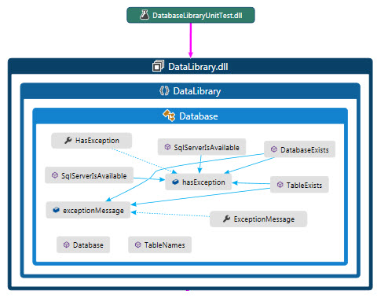

# SQL-Server check if server and database and table exists C#
## Requires
- Visual Studio 2015
## License
- MIT
## Technologies
- C#
- SQL Server
## Topics
- C#
- Asynchronous Programming
- SQL Server available
- SQL Server database exists
- SQL Server table exists
- SQL Server table names
## Updated
- 11/05/2017
## Description

<h1>Description</h1>

This code samples provides several methods for checking to see if a SQL-Server instance is available, if a SQL-Server database exists and if a table exists within a database.

To be flexible, I created two methods for checking if a SQL-Server is available, one simple checks to see if a server is running regardless of its name while the second check checks by server name. Both methods can take time
 to run so they are asynchronous which means the calling code needs to await both methods.

Next in the chain is determining if a database exists on a specific server. Here I use a SqlConnection and SqlCommand using a SELECT statement to find the database in sysdatabases. The test is simple, use a SqlDataReader to
 execute the SELECT and if there are rows true is returned since the database exists while if no records (via HasRows) false is returned.&nbsp;

This is followed by a method to determine if a table exists on a specific server in a specific database. To compliment this method there is also a method to return all table names.&nbsp;

With all of the above, let&rsquo;s say you want to know if a table exists in a database on a specific server. If the server, database and table are unknown then you would first check to see if the server is available, the database
 exists prior to checking if a table exists using the methods provided to check server and database.

All of the above methods are housed in a class project along with a unit test project.

<h1>IMPORTANT</h1>

Make sure to read all comments for each test as the test are geared towards my SQL-Server. For instance my server name is KARENS-PC, you would change that to your server name, same goes for database and table names.

&nbsp;

&nbsp;

