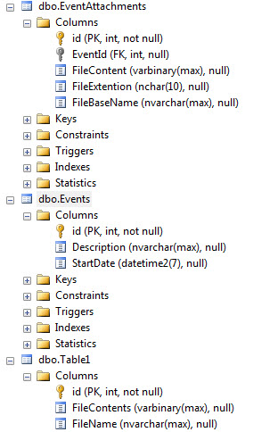

# SQL-Server insert binary files
## Requires
- Visual Studio 2015
## License
- MIT
## Technologies
- Data Access
- Data Platform
## Topics
- SQL
- SQL Server
- Windows Forms
- Entity Framework
- access data from SQL server
## Updated
- 05/29/2019
## Description

<h1>Description</h1>

This code sample shows how to write physical files from disk to SQL-Server database. Most of the code was created using SqlClient data provider as many developers are using this provider to interface with SQL-Server databases
 but have included the basics for writing physical files using Microsoft Entity Framework 6. Now before continuing I would like to mention there are some examples on the web but are partial examples used to provide less than what I'm presenting here. What I'm
 presenting are more than enough for you as a developer to learn how to write to a database, read and write back to disk.

The first example using the following simple table. We have id as our primary key, FileContents field stores the byte array for our file and FileName for the original file name.

FileName may or may not be needed but we do need the first two fields, id and FileContents. You will see id used in the sample code to get a specific file and write back to disk.

The second example will work with two tables, one table for events e.g. Events table holds names of courses while EventAttachments files associated with the courses.

Data

&nbsp;

SQL

Edit|Remove

mysql
<pre class="hidden">SELECT  EventAttachments.id ,
        Events.Description ,
        EventAttachments.FileBaseName &#43; 
		EventAttachments.FileExtention AS FileName ,
        convert(varchar(20),Events.StartDate,0) AS Start ,
        EventAttachments.FileContent
FROM    EventAttachments
        INNER JOIN Events ON EventAttachments.EventId = Events.id;
</pre>

<pre class="mysql">SELECT&nbsp;&nbsp;EventAttachments.id&nbsp;,&nbsp;
&nbsp;&nbsp;&nbsp;&nbsp;&nbsp;&nbsp;&nbsp;&nbsp;Events.Description&nbsp;,&nbsp;
&nbsp;&nbsp;&nbsp;&nbsp;&nbsp;&nbsp;&nbsp;&nbsp;EventAttachments.FileBaseName&nbsp;&#43;&nbsp;&nbsp;
&nbsp;&nbsp;&nbsp;&nbsp;&nbsp;&nbsp;&nbsp;&nbsp;EventAttachments.FileExtention&nbsp;AS&nbsp;FileName&nbsp;,&nbsp;
&nbsp;&nbsp;&nbsp;&nbsp;&nbsp;&nbsp;&nbsp;&nbsp;convert(varchar(20),Events.StartDate,0)&nbsp;AS&nbsp;Start&nbsp;,&nbsp;
&nbsp;&nbsp;&nbsp;&nbsp;&nbsp;&nbsp;&nbsp;&nbsp;EventAttachments.FileContent&nbsp;
FROM&nbsp;&nbsp;&nbsp;&nbsp;EventAttachments&nbsp;
&nbsp;&nbsp;&nbsp;&nbsp;&nbsp;&nbsp;&nbsp;&nbsp;INNER&nbsp;JOIN&nbsp;Events&nbsp;ON&nbsp;EventAttachments.EventId&nbsp;=&nbsp;Events.id;&nbsp;
</pre>

Hopefully that paints a picture for our data.

About the code, everything for working with the data is within a class. The first method gets a HTML file from the app folder, converts it to a byte array followed by using SqlClient connection and command objects to insert
 the file.&nbsp;

The following code from our first method is responsible for obtaining bytes to represent our file in the database.

&nbsp;

C#

Edit|Remove

csharp
<pre class="hidden">byte[] fileByes;

using (var stream = new FileStream(FilePath, FileMode.Open, FileAccess.Read))
{
    using (var reader = new BinaryReader(stream))
    {
        fileByes = reader.ReadBytes((int)stream.Length);
    }
}</pre>

<pre class="js">byte[]&nbsp;fileByes;&nbsp;
&nbsp;
using&nbsp;(var&nbsp;stream&nbsp;=&nbsp;new&nbsp;FileStream(FilePath,&nbsp;FileMode.Open,&nbsp;FileAccess.Read))&nbsp;
{&nbsp;
&nbsp;&nbsp;&nbsp;&nbsp;using&nbsp;(var&nbsp;reader&nbsp;=&nbsp;new&nbsp;BinaryReader(stream))&nbsp;
&nbsp;&nbsp;&nbsp;&nbsp;{&nbsp;
&nbsp;&nbsp;&nbsp;&nbsp;&nbsp;&nbsp;&nbsp;&nbsp;fileByes&nbsp;=&nbsp;reader.ReadBytes((int)stream.Length);&nbsp;
&nbsp;&nbsp;&nbsp;&nbsp;}&nbsp;
}</pre>

The next point is the SQL INSERT statement, the first part does the insert while the last part gets us the new primary key while in the Entity Framework example this is done for us.

SQL

Edit|Remove

mysql
<pre class="hidden">INSERT INTO Table1 (FileContents,FileName) VALUES (@FileContents,@FileName);SELECT CAST(scope_identity() AS int);</pre>

<pre class="js">INSERT&nbsp;INTO&nbsp;Table1&nbsp;(FileContents,FileName)&nbsp;VALUES&nbsp;(@FileContents,@FileName);SELECT&nbsp;CAST(scope_identity()&nbsp;AS&nbsp;int);</pre>

&nbsp;

The method used returns the a bool indicating if the insert was successfull, if not I wrapped the code in a try/catch and push the exception message to a property ExceptionMessage back to the caller
 while if successful we can use the new key passed in by ref.

C#

Edit|Remove

csharp
<pre class="hidden">var ops = new DataOperations();
var Identifier = 0;
var fileName = System.IO.Path.Combine(AppDomain.CurrentDomain.BaseDirectory, &quot;Dogma1.html&quot;);

if (ops.FilePutSimple(fileName, ref Identifier, &quot;Dogma1.html&quot;))
{
    MessageBox.Show($&quot;Id is {Identifier}&quot;);
}
else
{
    MessageBox.Show($&quot;Failed: {ops.ExceptionMessage}&quot;);
}</pre>

<pre class="js">var&nbsp;ops&nbsp;=&nbsp;new&nbsp;DataOperations();&nbsp;
var&nbsp;Identifier&nbsp;=&nbsp;0;&nbsp;
var&nbsp;fileName&nbsp;=&nbsp;System.IO.Path.Combine(AppDomain.CurrentDomain.BaseDirectory,&nbsp;&quot;Dogma1.html&quot;);&nbsp;
&nbsp;
if&nbsp;(ops.FilePutSimple(fileName,&nbsp;ref&nbsp;Identifier,&nbsp;&quot;Dogma1.html&quot;))&nbsp;
{&nbsp;
&nbsp;&nbsp;&nbsp;&nbsp;MessageBox.Show($&quot;Id&nbsp;is&nbsp;{Identifier}&quot;);&nbsp;
}&nbsp;
else&nbsp;
{&nbsp;
&nbsp;&nbsp;&nbsp;&nbsp;MessageBox.Show($&quot;Failed:&nbsp;{ops.ExceptionMessage}&quot;);&nbsp;
}</pre>

Screen shot for the above

&nbsp;

 

Screen shot for Entity Framework example

&nbsp;

I did much less in Entity Framework as most Windows Desktop developers are more into SqlClient but that should not hold you back once you see the code it's easy to add in the write back to disk if you
 follow the pattern used in the first example,

 

<strong>IMPORTANT</strong>

 

I did not include the database but did include a script to create the database, tables and relational schema. Lines 11 and 13 may need to be altered, they are used to create the database in the default
 install folder for SQL-Server professional, if you have Express edition then more likely than not the path will need to change.

If you have SQL-Server Management Studio, run the script there, if not simple open the script, attach to your server and run the script.

 

 

 

&nbsp;

&nbsp;

<em><em>.</em></em>

Script to create database with data

<em><em><a href="https://1drv.ms/u/s!AtGAgKKpqdWjjTKecmCgkCL2nk6Z">https://1drv.ms/u/s!AtGAgKKpqdWjjTKecmCgkCL2nk6Z</a> 
</em></em>

<h1>More Information</h1>

Some of my other code samples on working with databases and note they all (like this code sample) use parameters when interacting with database tables and one shows working with Stored Procedures.

<a href="https://code.msdn.microsoft.com/DataGridView-add-update-7eda9f61?redir=0">DataGridView add, update, delete via SqlClient data provider C#</a>.

<a href="https://code.msdn.microsoft.com/Adding-new-records-into-bff5eaaf?redir=0">Adding new records into SQL-Server table and update a DataGridView in real time</a>.

<a href="https://code.msdn.microsoft.com/Adding-new-records-into-53ce3eb1?redir=0">Adding new records into Microsoft Access tables and display in a DataGridView</a>.

<a href="https://code.msdn.microsoft.com/Reading-and-writing-to-MS-945a0615?redir=0">Reading and writing images to MS-Access 2007 and higher databases</a>.

<a href="https://code.msdn.microsoft.com/SQL-stored-procedures-1384f04c?redir=0">SQL stored procedures primer</a>.

<a href="https://code.msdn.microsoft.com/Reveal-parameter-values-28725e53?redir=0">Reveal parameter values from a Command object</a>.

<a href="https://code.msdn.microsoft.com/Entity-Framework-in-764fa5ba?redir=0">Entity Framework in Windows forms part 4</a>.

<a href="https://code.msdn.microsoft.com/INSERT-Image-into-SQL-29dfc8ee?redir=0">INSERT Image into SQL-Server using stored procedures</a>.

&nbsp;

&nbsp;

&nbsp;

 

