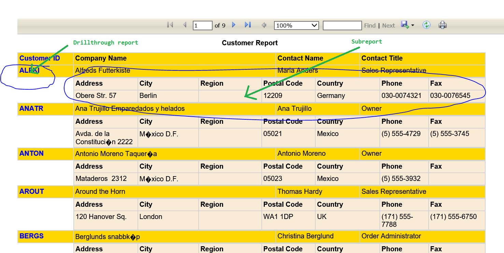
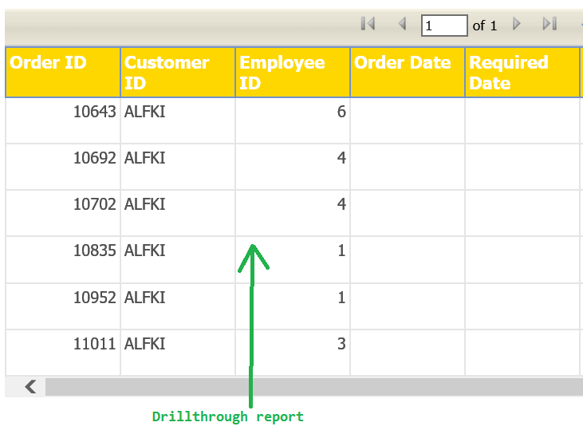

# SSRS RDLC report How To: Report, Processing Subreport, Drillthrough report.
## Requires
- Visual Studio 2015
## License
- MIT
## Technologies
- SSRS
- RDLC
- System.Data.Common
- SQLiteFactory
- DbProviderFactories
- Processing Subreport
- Drillthrough report
## Topics
- System.Data.Common
- SQLiteFactory
- Processing Subreport
- Drillthrough report
- SSRS RDLC
## Updated
- 01/14/2017
## Description

<h1>Introduction</h1>

<strong>Working template (you will not find here detail instruction how to build rdlc file).</strong>

SSRS RDLC reports How To: Report, Processing Subreport, Drillthrough report.

How to<strong> open rdlc</strong> report with - report viewer.

How to manage <strong>multiple </strong>subreports (see code)

How to <strong>processing subrepor</strong>t.

How to drill<strong> through report</strong>.&nbsp;&nbsp;

How&nbsp;to&nbsp;manage <strong>multiple </strong><strong>drillthrough report</strong>&nbsp; (see code)

How to&nbsp;<strong><a class="libraryLink" href="https://msdn.microsoft.com/en-US/library/System.Data.Common.aspx" target="_blank" title="Auto generated link to System.Data.Common">System.Data.Common</a></strong>

Completely working web application - please see&nbsp;<strong>More Information</strong><strong>&nbsp;</strong>on the bottom<strong>&nbsp;(In order to use the SQLiteFactory and have the SQLite data provider enumerated in the DbProviderFactories methods)</strong>

Description

RDLC - design view&nbsp;

<strong>Report on web page</strong>

&nbsp;

<strong>Drillthrough repor</strong>

&nbsp;

&nbsp;

C#

Edit|Remove

csharp

<pre class="csharp">Imports&nbsp;Microsoft.Reporting.WebForms&nbsp;
Imports&nbsp;System.Data.Common&nbsp;
&nbsp;
Public&nbsp;Class&nbsp;Report&nbsp;
&nbsp;&nbsp;&nbsp;&nbsp;Inherits&nbsp;System.Web.UI.Page&nbsp;
&nbsp;
&nbsp;
&nbsp;
&nbsp;&nbsp;&nbsp;&nbsp;Private&nbsp;Const&nbsp;strCustomerID&nbsp;As&nbsp;String&nbsp;=&nbsp;&quot;SELECT&nbsp;&quot;&quot;CustomerID&quot;&quot;,&nbsp;&quot;&quot;CompanyName&quot;&quot;,&nbsp;&quot;&quot;ContactName&quot;&quot;,&nbsp;&quot;&quot;ContactTitle&quot;&quot;&nbsp;FROM&nbsp;&nbsp;`Customers`&nbsp;&quot;&nbsp;
&nbsp;&nbsp;&nbsp;&nbsp;Private&nbsp;Const&nbsp;strCustomerAddress&nbsp;As&nbsp;String&nbsp;=&nbsp;&quot;SELECT&nbsp;&quot;&quot;Address&quot;&quot;,&nbsp;&quot;&quot;City&quot;&quot;,&nbsp;&quot;&quot;Region&quot;&quot;,&nbsp;&quot;&quot;PostalCode&quot;&quot;,&nbsp;&quot;&quot;Country&quot;&quot;,&nbsp;&quot;&quot;Phone&quot;&quot;,&nbsp;&quot;&quot;Fax&quot;&quot;&nbsp;FROM&nbsp;&nbsp;`Customers`&nbsp;&quot;&nbsp;
&nbsp;
&nbsp;
&nbsp;&nbsp;&nbsp;&nbsp;Private&nbsp;Const&nbsp;strOrderID&nbsp;As&nbsp;String&nbsp;=&nbsp;&quot;SELECT&nbsp;&quot;&quot;OrderID&quot;&quot;,&nbsp;&quot;&quot;CustomerID&quot;&quot;,&nbsp;&quot;&quot;EmployeeID&quot;&quot;,&nbsp;Date(&quot;&quot;OrderDate&quot;&quot;)&nbsp;AS&nbsp;&quot;&quot;OrderDate&quot;&quot;,Date(&quot;&quot;RequiredDate&quot;&quot;)&nbsp;AS&nbsp;&quot;&quot;RequiredDate&quot;&quot;&nbsp;,&nbsp;DATE(&quot;&quot;ShippedDate&quot;&quot;)&nbsp;AS&nbsp;&quot;&quot;ShippedDate&quot;&quot;,&nbsp;&quot;&quot;ShipVia&quot;&quot;,&nbsp;&quot;&quot;Freight&quot;&quot;,&nbsp;&quot;&quot;ShipName&quot;&quot;,&nbsp;&quot;&quot;ShipAddress&quot;&quot;,&nbsp;&quot;&quot;ShipCity&quot;&quot;,&nbsp;&quot;&quot;ShipRegion&quot;&quot;,&nbsp;&quot;&quot;ShipPostalCode&quot;&quot;,&nbsp;&quot;&quot;ShipCountry&quot;&quot;&nbsp;FROM&nbsp;`Orders`&nbsp;&nbsp;&quot;&nbsp;
&nbsp;
&nbsp;&nbsp;&nbsp;&nbsp;Private&nbsp;strConnection&nbsp;=&nbsp;&quot;Data&nbsp;Source=&quot;&nbsp;&#43;&nbsp;AppDomain.CurrentDomain.BaseDirectory.ToString()&nbsp;&#43;&nbsp;&quot;Northwind.sl3&quot;&nbsp;
&nbsp;
&nbsp;&nbsp;&nbsp;&nbsp;Private&nbsp;strError&nbsp;As&nbsp;String&nbsp;=&nbsp;&quot;&quot;&nbsp;
&nbsp;&nbsp;&nbsp;&nbsp;Private&nbsp;dc&nbsp;As&nbsp;New&nbsp;DataCommon&nbsp;
&nbsp;&nbsp;&nbsp;&nbsp;Private&nbsp;cmd&nbsp;As&nbsp;DbCommand&nbsp;
&nbsp;
&nbsp;
&nbsp;&nbsp;&nbsp;&nbsp;Protected&nbsp;Sub&nbsp;Page_Load(ByVal&nbsp;sender&nbsp;As&nbsp;Object,&nbsp;ByVal&nbsp;e&nbsp;As&nbsp;<a class="libraryLink" href="https://msdn.microsoft.com/en-US/library/System.EventArgs.aspx" target="_blank" title="Auto generated link to System.EventArgs">System.EventArgs</a>)&nbsp;Handles&nbsp;Me.Load&nbsp;
&nbsp;
&nbsp;&nbsp;&nbsp;&nbsp;&nbsp;&nbsp;&nbsp;&nbsp;If&nbsp;Not&nbsp;Page.IsPostBack&nbsp;Then&nbsp;
&nbsp;&nbsp;&nbsp;&nbsp;&nbsp;&nbsp;&nbsp;&nbsp;&nbsp;&nbsp;&nbsp;&nbsp;If&nbsp;InitDataBase()&nbsp;Then&nbsp;
&nbsp;&nbsp;&nbsp;&nbsp;&nbsp;&nbsp;&nbsp;&nbsp;&nbsp;&nbsp;&nbsp;&nbsp;&nbsp;&nbsp;&nbsp;&nbsp;LoadReport()&nbsp;
&nbsp;&nbsp;&nbsp;&nbsp;&nbsp;&nbsp;&nbsp;&nbsp;&nbsp;&nbsp;&nbsp;&nbsp;Else&nbsp;
&nbsp;&nbsp;&nbsp;&nbsp;&nbsp;&nbsp;&nbsp;&nbsp;&nbsp;&nbsp;&nbsp;&nbsp;&nbsp;&nbsp;&nbsp;&nbsp;Alert(&quot;Data&nbsp;Base&nbsp;does&nbsp;not&nbsp;Exist.&nbsp;\nPlease&nbsp;verify&nbsp;Name/location!&nbsp;\nOr&nbsp;install&nbsp;SQLite&nbsp;provider!&nbsp;&quot;)&nbsp;
&nbsp;&nbsp;&nbsp;&nbsp;&nbsp;&nbsp;&nbsp;&nbsp;&nbsp;&nbsp;&nbsp;&nbsp;End&nbsp;If&nbsp;
&nbsp;
&nbsp;&nbsp;&nbsp;&nbsp;&nbsp;&nbsp;&nbsp;&nbsp;End&nbsp;If&nbsp;
&nbsp;
&nbsp;&nbsp;&nbsp;&nbsp;End&nbsp;Sub&nbsp;
&nbsp;
&nbsp;&nbsp;&nbsp;&nbsp;'Private&nbsp;Const&nbsp;strMaster&nbsp;=&nbsp;&quot;SELECT&nbsp;*&nbsp;FROM&nbsp;sqlite_master&quot;&nbsp;
&nbsp;&nbsp;&nbsp;&nbsp;'For&nbsp;Debug&nbsp;purpose&nbsp;added&nbsp;SHEMA&nbsp;-&nbsp;please&nbsp;make&nbsp;sure&nbsp;that&nbsp;you&nbsp;use&nbsp;existed&nbsp;database&nbsp;....&nbsp;
&nbsp;&nbsp;&nbsp;&nbsp;'Dim&nbsp;dtMaster&nbsp;As&nbsp;DataTable&nbsp;=&nbsp;db.FindDataSet(New&nbsp;StringBuilder(strMaster),&nbsp;strConnection).Tables(0)&nbsp;
&nbsp;&nbsp;&nbsp;&nbsp;Protected&nbsp;Function&nbsp;InitDataBase()&nbsp;As&nbsp;Boolean&nbsp;
&nbsp;&nbsp;&nbsp;&nbsp;&nbsp;&nbsp;&nbsp;&nbsp;Try&nbsp;
&nbsp;&nbsp;&nbsp;&nbsp;&nbsp;&nbsp;&nbsp;&nbsp;&nbsp;&nbsp;&nbsp;&nbsp;dc&nbsp;=&nbsp;New&nbsp;DataCommon&nbsp;
&nbsp;&nbsp;&nbsp;&nbsp;&nbsp;&nbsp;&nbsp;&nbsp;&nbsp;&nbsp;&nbsp;&nbsp;dc.connectionString&nbsp;=&nbsp;strConnection&nbsp;
&nbsp;&nbsp;&nbsp;&nbsp;&nbsp;&nbsp;&nbsp;&nbsp;&nbsp;&nbsp;&nbsp;&nbsp;cmd&nbsp;=&nbsp;dc.commandDB&nbsp;
&nbsp;&nbsp;&nbsp;&nbsp;&nbsp;&nbsp;&nbsp;&nbsp;&nbsp;&nbsp;&nbsp;&nbsp;Return&nbsp;True&nbsp;
&nbsp;&nbsp;&nbsp;&nbsp;&nbsp;&nbsp;&nbsp;&nbsp;Catch&nbsp;ex&nbsp;As&nbsp;Exception&nbsp;
&nbsp;&nbsp;&nbsp;&nbsp;&nbsp;&nbsp;&nbsp;&nbsp;&nbsp;&nbsp;&nbsp;&nbsp;Return&nbsp;False&nbsp;
&nbsp;&nbsp;&nbsp;&nbsp;&nbsp;&nbsp;&nbsp;&nbsp;End&nbsp;Try&nbsp;
&nbsp;&nbsp;&nbsp;&nbsp;End&nbsp;Function&nbsp;
&nbsp;
&nbsp;&nbsp;&nbsp;&nbsp;'How&nbsp;To&nbsp;Report&nbsp;itself&nbsp;-&nbsp;http://rohit-developer.blogspot.com/2015/02/sub-report-in-rdlc-report-viewer.html&nbsp;
&nbsp;
&nbsp;&nbsp;&nbsp;&nbsp;'http://stackoverflow.com/questions/456982/microsoft-reporting-setting-subreport-parameters-in-code&nbsp;
&nbsp;&nbsp;&nbsp;&nbsp;'https://blogs.msdn.microsoft.com/sqlforum/2011/01/02/walkthrough-add-a-subreport-in-local-report-in-reportviewer/&nbsp;
&nbsp;
&nbsp;&nbsp;&nbsp;&nbsp;'How&nbsp;to&nbsp;Run&nbsp;Subreport&nbsp;
&nbsp;&nbsp;&nbsp;&nbsp;'https://msdn.microsoft.com/en-us/library/microsoft.reporting.webforms.localreport.subreportprocessing.aspx?cs-save-lang=1&amp;cs-lang=vb#code-snippet-1&nbsp;
&nbsp;
&nbsp;&nbsp;&nbsp;&nbsp;Private&nbsp;Sub&nbsp;LoadReport()&nbsp;
&nbsp;
&nbsp;&nbsp;&nbsp;&nbsp;&nbsp;&nbsp;&nbsp;&nbsp;InitDataBase()&nbsp;
&nbsp;
&nbsp;&nbsp;&nbsp;&nbsp;&nbsp;&nbsp;&nbsp;&nbsp;cmd.CommandText&nbsp;=&nbsp;strCustomerID&nbsp;
&nbsp;&nbsp;&nbsp;&nbsp;&nbsp;&nbsp;&nbsp;&nbsp;Dim&nbsp;dtCustomer&nbsp;As&nbsp;DataTable&nbsp;=&nbsp;dc.GetDataSet(cmd).Tables(0)&nbsp;
&nbsp;
&nbsp;&nbsp;&nbsp;&nbsp;&nbsp;&nbsp;&nbsp;&nbsp;Dim&nbsp;warnings&nbsp;As&nbsp;<a class="libraryLink" href="https://msdn.microsoft.com/en-US/library/Microsoft.Reporting.WebForms.Warning.aspx" target="_blank" title="Auto generated link to Microsoft.Reporting.WebForms.Warning">Microsoft.Reporting.WebForms.Warning</a>()&nbsp;=&nbsp;Nothing&nbsp;
&nbsp;&nbsp;&nbsp;&nbsp;&nbsp;&nbsp;&nbsp;&nbsp;Dim&nbsp;streamIds&nbsp;As&nbsp;String()&nbsp;=&nbsp;Nothing&nbsp;
&nbsp;&nbsp;&nbsp;&nbsp;&nbsp;&nbsp;&nbsp;&nbsp;Dim&nbsp;mimeType&nbsp;As&nbsp;String&nbsp;=&nbsp;String.Empty&nbsp;
&nbsp;&nbsp;&nbsp;&nbsp;&nbsp;&nbsp;&nbsp;&nbsp;Dim&nbsp;encoding&nbsp;As&nbsp;String&nbsp;=&nbsp;String.Empty&nbsp;
&nbsp;&nbsp;&nbsp;&nbsp;&nbsp;&nbsp;&nbsp;&nbsp;Dim&nbsp;extension&nbsp;As&nbsp;String&nbsp;=&nbsp;String.Empty&nbsp;
&nbsp;
&nbsp;&nbsp;&nbsp;&nbsp;&nbsp;&nbsp;&nbsp;&nbsp;'&nbsp;ActivityCodeDescriptions.rdlc&nbsp;
&nbsp;&nbsp;&nbsp;&nbsp;&nbsp;&nbsp;&nbsp;&nbsp;Dim&nbsp;reportPath&nbsp;As&nbsp;String&nbsp;=&nbsp;AppDomain.CurrentDomain.BaseDirectory.ToString()&nbsp;&#43;&nbsp;&quot;Rdls\ReportCustomers.rdlc&quot;&nbsp;
&nbsp;
&nbsp;&nbsp;&nbsp;&nbsp;&nbsp;&nbsp;&nbsp;&nbsp;'//Create&nbsp;MS&nbsp;Report&nbsp;object&nbsp;
&nbsp;&nbsp;&nbsp;&nbsp;&nbsp;&nbsp;&nbsp;&nbsp;rv.Reset()&nbsp;
&nbsp;&nbsp;&nbsp;&nbsp;&nbsp;&nbsp;&nbsp;&nbsp;rv.LocalReport.ReportPath&nbsp;=&nbsp;reportPath&nbsp;
&nbsp;&nbsp;&nbsp;&nbsp;&nbsp;&nbsp;&nbsp;&nbsp;rv.ProcessingMode&nbsp;=&nbsp;ProcessingMode.Local&nbsp;
&nbsp;&nbsp;&nbsp;&nbsp;&nbsp;&nbsp;&nbsp;&nbsp;rv.LocalReport.SetBasePermissionsForSandboxAppDomain(New&nbsp;<a class="libraryLink" href="https://msdn.microsoft.com/en-US/library/System.Security.PermissionSet.aspx" target="_blank" title="Auto generated link to System.Security.PermissionSet">System.Security.PermissionSet</a>(System.Security.Permissions.PermissionState.Unrestricted))&nbsp;
&nbsp;
&nbsp;&nbsp;&nbsp;&nbsp;&nbsp;&nbsp;&nbsp;&nbsp;rv.LocalReport.DataSources.Clear()&nbsp;&nbsp;&nbsp;'&nbsp;MUST&nbsp;CLEAR&nbsp;DATA&nbsp;&nbsp;
&nbsp;
&nbsp;&nbsp;&nbsp;&nbsp;&nbsp;&nbsp;&nbsp;&nbsp;rv.LocalReport.DataSources.Add(New&nbsp;ReportDataSource(&quot;dtCustomer&quot;,&nbsp;dtCustomer))&nbsp;
&nbsp;
&nbsp;&nbsp;&nbsp;&nbsp;&nbsp;&nbsp;&nbsp;&nbsp;Dim&nbsp;param&nbsp;As&nbsp;List(Of&nbsp;ReportParameter)&nbsp;=&nbsp;New&nbsp;List(Of&nbsp;ReportParameter)&nbsp;
&nbsp;&nbsp;&nbsp;&nbsp;&nbsp;&nbsp;&nbsp;&nbsp;param.Add(New&nbsp;ReportParameter(&quot;pNameReport&quot;,&nbsp;&quot;Customer&nbsp;Report&quot;))&nbsp;
&nbsp;&nbsp;&nbsp;&nbsp;&nbsp;&nbsp;&nbsp;&nbsp;rv.LocalReport.SetParameters(param)&nbsp;
&nbsp;
&nbsp;&nbsp;&nbsp;&nbsp;&nbsp;&nbsp;&nbsp;&nbsp;rv.AsyncRendering&nbsp;=&nbsp;True&nbsp;
&nbsp;&nbsp;&nbsp;&nbsp;&nbsp;&nbsp;&nbsp;&nbsp;rv.DataBind()&nbsp;
&nbsp;
&nbsp;&nbsp;&nbsp;&nbsp;&nbsp;&nbsp;&nbsp;&nbsp;'Process&nbsp;subreport(s)&nbsp;which&nbsp;you&nbsp;include&nbsp;in&nbsp;main&nbsp;report&nbsp;(from&nbsp;ToolBox)&nbsp;
&nbsp;&nbsp;&nbsp;&nbsp;&nbsp;&nbsp;&nbsp;&nbsp;AddHandler&nbsp;rv.LocalReport.SubreportProcessing,&nbsp;AddressOf&nbsp;SubreportProcessingEventHandler&nbsp;
&nbsp;
&nbsp;&nbsp;&nbsp;&nbsp;&nbsp;&nbsp;&nbsp;&nbsp;rv.LocalReport.Refresh()&nbsp;
&nbsp;&nbsp;&nbsp;&nbsp;&nbsp;&nbsp;&nbsp;&nbsp;rv.Visible&nbsp;=&nbsp;True&nbsp;
&nbsp;
&nbsp;&nbsp;&nbsp;&nbsp;End&nbsp;Sub&nbsp;
&nbsp;
&nbsp;&nbsp;&nbsp;&nbsp;'Process&nbsp;subreport(s)&nbsp;which&nbsp;you&nbsp;include&nbsp;in&nbsp;main&nbsp;report&nbsp;(from&nbsp;ToolBox)&nbsp;
&nbsp;&nbsp;&nbsp;&nbsp;Public&nbsp;Sub&nbsp;SubreportProcessingEventHandler(ByVal&nbsp;sender&nbsp;As&nbsp;Object,&nbsp;ByVal&nbsp;e&nbsp;As&nbsp;SubreportProcessingEventArgs)&nbsp;
&nbsp;
&nbsp;&nbsp;&nbsp;&nbsp;&nbsp;&nbsp;&nbsp;&nbsp;Dim&nbsp;infoParam&nbsp;As&nbsp;ReportParameterInfoCollection&nbsp;=&nbsp;e.Parameters()&nbsp;
&nbsp;&nbsp;&nbsp;&nbsp;&nbsp;&nbsp;&nbsp;&nbsp;Dim&nbsp;strCaseId&nbsp;As&nbsp;String&nbsp;=&nbsp;infoParam.First.Values(0).ToString()&nbsp;
&nbsp;
&nbsp;
&nbsp;&nbsp;&nbsp;&nbsp;&nbsp;&nbsp;&nbsp;&nbsp;Select&nbsp;Case&nbsp;e.ReportPath&nbsp;
&nbsp;&nbsp;&nbsp;&nbsp;&nbsp;&nbsp;&nbsp;&nbsp;&nbsp;&nbsp;&nbsp;&nbsp;Case&nbsp;&quot;subreport1&quot;&nbsp;&nbsp;&nbsp;&nbsp;'&nbsp;&nbsp;just&nbsp;example&nbsp;-&nbsp;how&nbsp;to&nbsp;manage&nbsp;multiply&nbsp;subreports&nbsp;...&nbsp;
&nbsp;
&nbsp;&nbsp;&nbsp;&nbsp;&nbsp;&nbsp;&nbsp;&nbsp;&nbsp;&nbsp;&nbsp;&nbsp;Case&nbsp;&quot;ReportCustomersAddress&quot;&nbsp;
&nbsp;&nbsp;&nbsp;&nbsp;&nbsp;&nbsp;&nbsp;&nbsp;&nbsp;&nbsp;&nbsp;&nbsp;&nbsp;&nbsp;&nbsp;&nbsp;cmd.CommandText&nbsp;=&nbsp;strCustomerAddress&nbsp;&#43;&nbsp;&quot;&nbsp;where&nbsp;&quot;&quot;CustomerID&quot;&quot;&nbsp;=&nbsp;'&quot;&nbsp;&#43;&nbsp;strCaseId&nbsp;&#43;&nbsp;&quot;'&quot;&nbsp;
&nbsp;&nbsp;&nbsp;&nbsp;&nbsp;&nbsp;&nbsp;&nbsp;&nbsp;&nbsp;&nbsp;&nbsp;&nbsp;&nbsp;&nbsp;&nbsp;Dim&nbsp;dtCustomersAddress&nbsp;As&nbsp;DataTable&nbsp;=&nbsp;dc.GetDataSet(cmd).Tables(0)&nbsp;
&nbsp;&nbsp;&nbsp;&nbsp;&nbsp;&nbsp;&nbsp;&nbsp;&nbsp;&nbsp;&nbsp;&nbsp;&nbsp;&nbsp;&nbsp;&nbsp;e.DataSources.Add(New&nbsp;ReportDataSource(&quot;dtCustomersAddress&quot;,&nbsp;dtCustomersAddress))&nbsp;
&nbsp;
&nbsp;&nbsp;&nbsp;&nbsp;&nbsp;&nbsp;&nbsp;&nbsp;&nbsp;&nbsp;&nbsp;&nbsp;Case&nbsp;&quot;subreport3&quot;&nbsp;
&nbsp;&nbsp;&nbsp;&nbsp;&nbsp;&nbsp;&nbsp;&nbsp;End&nbsp;Select&nbsp;
&nbsp;
&nbsp;&nbsp;&nbsp;&nbsp;End&nbsp;Sub&nbsp;
&nbsp;
&nbsp;
&nbsp;
&nbsp;
&nbsp;
&nbsp;&nbsp;&nbsp;&nbsp;Protected&nbsp;Sub&nbsp;Alert(ByVal&nbsp;message&nbsp;As&nbsp;String)&nbsp;
&nbsp;
&nbsp;&nbsp;&nbsp;&nbsp;&nbsp;&nbsp;&nbsp;&nbsp;Dim&nbsp;sb&nbsp;As&nbsp;New&nbsp;<a class="libraryLink" href="https://msdn.microsoft.com/en-US/library/System.Text.StringBuilder.aspx" target="_blank" title="Auto generated link to System.Text.StringBuilder">System.Text.StringBuilder</a>()&nbsp;
&nbsp;&nbsp;&nbsp;&nbsp;&nbsp;&nbsp;&nbsp;&nbsp;sb.Append(&quot;&lt;script&nbsp;type&nbsp;=&nbsp;'text/javascript'&gt;&quot;)&nbsp;
&nbsp;&nbsp;&nbsp;&nbsp;&nbsp;&nbsp;&nbsp;&nbsp;sb.Append(&quot;window.onload=function(){&quot;)&nbsp;
&nbsp;&nbsp;&nbsp;&nbsp;&nbsp;&nbsp;&nbsp;&nbsp;sb.Append(&quot;alert('&quot;)&nbsp;
&nbsp;&nbsp;&nbsp;&nbsp;&nbsp;&nbsp;&nbsp;&nbsp;sb.Append(message)&nbsp;
&nbsp;&nbsp;&nbsp;&nbsp;&nbsp;&nbsp;&nbsp;&nbsp;sb.Append(&quot;')};&quot;)&nbsp;
&nbsp;&nbsp;&nbsp;&nbsp;&nbsp;&nbsp;&nbsp;&nbsp;sb.Append(&quot;&lt;/script&gt;&quot;)&nbsp;
&nbsp;
&nbsp;&nbsp;&nbsp;&nbsp;&nbsp;&nbsp;&nbsp;&nbsp;ClientScript.RegisterClientScriptBlock(Me.GetType(),&nbsp;&quot;alert&quot;,&nbsp;sb.ToString())&nbsp;
&nbsp;&nbsp;&nbsp;&nbsp;End&nbsp;Sub&nbsp;
&nbsp;
&nbsp;&nbsp;&nbsp;&nbsp;'https://msdn.microsoft.com/en-us/library/dn154769.aspx&nbsp;
&nbsp;&nbsp;&nbsp;&nbsp;Protected&nbsp;Sub&nbsp;rv_Drillthrough(sender&nbsp;As&nbsp;Object,&nbsp;e&nbsp;As&nbsp;DrillthroughEventArgs)&nbsp;Handles&nbsp;rv.Drillthrough&nbsp;
&nbsp;&nbsp;&nbsp;&nbsp;&nbsp;&nbsp;&nbsp;&nbsp;'Get&nbsp;the&nbsp;instance&nbsp;of&nbsp;the&nbsp;Target&nbsp;report.&nbsp;
&nbsp;
&nbsp;
&nbsp;&nbsp;&nbsp;&nbsp;&nbsp;&nbsp;&nbsp;&nbsp;Select&nbsp;Case&nbsp;e.ReportPath&nbsp;
&nbsp;&nbsp;&nbsp;&nbsp;&nbsp;&nbsp;&nbsp;&nbsp;&nbsp;&nbsp;&nbsp;&nbsp;Case&nbsp;&quot;subreport1&quot;&nbsp;&nbsp;&nbsp;&nbsp;'&nbsp;&nbsp;just&nbsp;example&nbsp;-&nbsp;how&nbsp;to&nbsp;manage&nbsp;multiply&nbsp;subreports&nbsp;...&nbsp;
&nbsp;
&nbsp;&nbsp;&nbsp;&nbsp;&nbsp;&nbsp;&nbsp;&nbsp;&nbsp;&nbsp;&nbsp;&nbsp;Case&nbsp;&quot;ReportOrder&quot;&nbsp;
&nbsp;&nbsp;&nbsp;&nbsp;&nbsp;&nbsp;&nbsp;&nbsp;&nbsp;&nbsp;&nbsp;&nbsp;&nbsp;&nbsp;&nbsp;&nbsp;Dim&nbsp;report&nbsp;As&nbsp;LocalReport&nbsp;=&nbsp;e.Report&nbsp;
&nbsp;&nbsp;&nbsp;&nbsp;&nbsp;&nbsp;&nbsp;&nbsp;&nbsp;&nbsp;&nbsp;&nbsp;&nbsp;&nbsp;&nbsp;&nbsp;Dim&nbsp;list&nbsp;As&nbsp;IList(Of&nbsp;ReportParameter)&nbsp;=&nbsp;report.OriginalParametersToDrillthrough&nbsp;
&nbsp;&nbsp;&nbsp;&nbsp;&nbsp;&nbsp;&nbsp;&nbsp;&nbsp;&nbsp;&nbsp;&nbsp;&nbsp;&nbsp;&nbsp;&nbsp;Dim&nbsp;strCaseId&nbsp;As&nbsp;String&nbsp;=&nbsp;list.Item(0).Values(0).ToString&nbsp;
&nbsp;&nbsp;&nbsp;&nbsp;&nbsp;&nbsp;&nbsp;&nbsp;&nbsp;&nbsp;&nbsp;&nbsp;&nbsp;&nbsp;&nbsp;&nbsp;InitDataBase()&nbsp;
&nbsp;&nbsp;&nbsp;&nbsp;&nbsp;&nbsp;&nbsp;&nbsp;&nbsp;&nbsp;&nbsp;&nbsp;&nbsp;&nbsp;&nbsp;&nbsp;cmd.CommandText&nbsp;=&nbsp;strOrderID&nbsp;&#43;&nbsp;&quot;&nbsp;where&nbsp;&quot;&quot;CustomerID&quot;&quot;&nbsp;=&nbsp;'&quot;&nbsp;&#43;&nbsp;strCaseId&nbsp;&#43;&nbsp;&quot;'&quot;&nbsp;
&nbsp;&nbsp;&nbsp;&nbsp;&nbsp;&nbsp;&nbsp;&nbsp;&nbsp;&nbsp;&nbsp;&nbsp;&nbsp;&nbsp;&nbsp;&nbsp;Dim&nbsp;dtOrders&nbsp;As&nbsp;DataTable&nbsp;=&nbsp;dc.GetDataSet(cmd).Tables(0)&nbsp;
&nbsp;&nbsp;&nbsp;&nbsp;&nbsp;&nbsp;&nbsp;&nbsp;&nbsp;&nbsp;&nbsp;&nbsp;&nbsp;&nbsp;&nbsp;&nbsp;report.DataSources.Add(New&nbsp;ReportDataSource(&quot;dtOrders&quot;,&nbsp;dtOrders))&nbsp;
&nbsp;
&nbsp;&nbsp;&nbsp;&nbsp;&nbsp;&nbsp;&nbsp;&nbsp;&nbsp;&nbsp;&nbsp;&nbsp;Case&nbsp;&quot;subreport3&quot;&nbsp;
&nbsp;&nbsp;&nbsp;&nbsp;&nbsp;&nbsp;&nbsp;&nbsp;End&nbsp;Select&nbsp;
&nbsp;
&nbsp;
&nbsp;&nbsp;&nbsp;&nbsp;End&nbsp;Sub&nbsp;
&nbsp;
&nbsp;&nbsp;&nbsp;&nbsp;Protected&nbsp;Sub&nbsp;btnMainReport_Click(sender&nbsp;As&nbsp;Object,&nbsp;e&nbsp;As&nbsp;EventArgs)&nbsp;Handles&nbsp;btnMainReport.Click&nbsp;
&nbsp;&nbsp;&nbsp;&nbsp;&nbsp;&nbsp;&nbsp;&nbsp;LoadReport()&nbsp;
&nbsp;&nbsp;&nbsp;&nbsp;End&nbsp;Sub&nbsp;
End&nbsp;Class</pre>

<ul>
</ul>
<h1>More Information</h1>

This example uses SQLite database &ldquo;Northwind.sl3&rdquo;

So for work this sample please install on your PC SQLite provider <a href="https://system.data.sqlite.org/index.html/doc/trunk/www/downloads.wiki">
https://system.data.sqlite.org/index.html/doc/trunk/www/downloads.wiki</a>

(Use setup file it install System.Data.SQLite to assembly)

I recommend install x86 and x64 version &ndash; just choose right Net Framework for you.

&nbsp;

&nbsp;

In order to use the SQLiteFactory and have the SQLite data provider enumerated in the DbProviderFactories methods, you must add the following segment into your application's app.config file:

&lt;configuration&gt;

&nbsp;&nbsp;&nbsp; &lt;system.data&gt;

&nbsp;&nbsp;&nbsp;&nbsp;&nbsp;&nbsp;&nbsp; &lt;DbProviderFactories&gt;

&nbsp;&nbsp;&nbsp;&nbsp;&nbsp;&nbsp;&nbsp;&nbsp;&nbsp;&nbsp;&nbsp; &lt;remove invariant=&quot;System.Data.SQLite&quot; /&gt;

&nbsp;&nbsp;&nbsp;&nbsp;&nbsp;&nbsp;&nbsp;&nbsp;&nbsp;&nbsp;&nbsp; &lt;add name=&quot;SQLite Data Provider&quot; invariant=&quot;System.Data.SQLite&quot; description=&quot;.NET Framework Data Provider for SQLite&quot;

&nbsp;&nbsp;&nbsp;&nbsp;&nbsp;&nbsp;&nbsp;&nbsp;&nbsp;&nbsp;&nbsp;&nbsp;&nbsp;&nbsp;&nbsp;&nbsp; type=&quot;System.Data.SQLite.SQLiteFactory, System.Data.SQLite, Version=1.0.104.0, Culture=neutral, PublicKeyToken=db937bc2d44ff139&quot; /&gt;

&nbsp;&nbsp;&nbsp;&nbsp;&nbsp;&nbsp;&nbsp; &lt;/DbProviderFactories&gt;

&nbsp;&nbsp;&nbsp; &lt;/system.data&gt;

&lt;/configuration&gt;

See the help documentation for further details on implementing both version-specific (GAC enabled) and version independent DBProviderFactories support.&nbsp;

