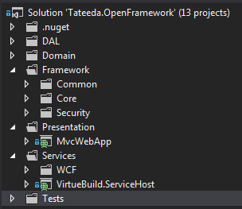

# Sample MVC4/WCF and EF Code First .NET 4.5. Domain design
## Requires
- Visual Studio 2012
## License
- Apache License, Version 2.0
## Technologies
- C#
- WCF
- Visual Studio 2010
- jQuery
- Entity Framework
- .NET Framework 4.0
- C# Language
- HTML5
- ASP.NET MVC 4
- Visual Studio 2012
- .NET 4.5
## Topics
- C#
- WCF
- ASP.NET
- Architecture and Design
- ASP.NET MVC
- jQuery
- Web Services
- Javascript
- Entity Framework
- Image manipulation
- Getting Started
- .NET 4
- Imaging
- Generic C# resuable code
- Image Optimization
- Software Architecture
- Web Architecture
## Updated
- 06/13/2013
## Description

<h1>Introduction</h1>

<em>This sample provides basic infrastructure for MVC application with WCF and EF Code first support. All communications in this application are done through the WCF services without service references. There are no
 ties to the EF in MVC at all. Application has an example of storing and displaying images in database with replication on file system for better performance. Common design patterns are used:
Repository, Unit Of Work, MVC, Service Locator</em>

<em><strong>In this scenario I didn&rsquo;t want my WEB client to know anything about Entity Framework. Please not that there is not Membership
 provider as well.&nbsp;</strong></em>Authentication is done in similar way, but without dependency on Membership Provider.
 You may change this if you want to have use regular MS Membership provider. Domain objects will support that structure.

<h1>Building the Sample</h1>

<strong>Important! Please download all required NuGet packages.
</strong>

The sample requires Visual Studio 2010/2012, .net 4.5 and SQL Server.&nbsp;To build and seed the database run integration unit test method
CreateAndSeedDatabaseTest 

<ul>
<li>Login: <strong>sysadmin </strong></li><li>Password: <strong>Virtue2013!</strong>
</li></ul>

Description

<em>Main advantages:</em>

<ul>
<li>Basic Application layout </li><li>Loosely coupled components </li><li>Service calls without service references </li><li>EF Code First </li><li>Remove Circular references in Entities for WCF serialization </li><li>Use of common design patterns </li><li>No knowledge of EF in MVC </li><li>Use of Areas </li><li>Dynamic Ajax calls with partial views  
<em></em></li></ul>

<em>Basic layout for distributed application.</em>

<em>&nbsp;&nbsp;</em>

Client MVC application has knowledge of service interfaces and domain objects. 
Domain objects are used by web client and server (EF).&nbsp; Web client only knows is how to call services, it has no idea where is the data coming from. A Service host responsibility is to specify database connection and provide centralized configurations
 for WCF services. 
WCF services implementation is also separated into different projects and loosely coupled with the service host. 
DAL &ndash; Data Access Layer is divided into two logical groups: Context and Infrastructure 
Context project is responsible for creating and managing Entities and databases. Database migration should be added here for future updates. 
Infrastructure project is implementation of Unit of work and repositories. 
A WCF Services implementation project knows how to create UOW or call repositories. 
Domain objects and Core project are shared between layers. Interface based implementation provides nice decoupling and separations<em> 
</em>

<em>Sample&nbsp;WCF service invocation through interface call.</em>

&nbsp;

C#

Edit|Remove

csharp

<pre class="csharp">public&nbsp;ActionResult&nbsp;GetHomeTypes()&nbsp;
&nbsp;&nbsp;&nbsp;&nbsp;&nbsp;&nbsp;&nbsp;&nbsp;{&nbsp;
&nbsp;&nbsp;&nbsp;&nbsp;&nbsp;&nbsp;&nbsp;&nbsp;&nbsp;&nbsp;&nbsp;&nbsp;var&nbsp;model&nbsp;=&nbsp;
&nbsp;&nbsp;&nbsp;&nbsp;&nbsp;&nbsp;&nbsp;&nbsp;&nbsp;&nbsp;&nbsp;&nbsp;&nbsp;&nbsp;&nbsp;&nbsp;_wcfService.InvokeService&lt;IVirtueContextService,&nbsp;ICollection&lt;HomeType&gt;&gt;((svc)&nbsp;=&gt;&nbsp;svc.GetHomeTypes(true));&nbsp;
&nbsp;
&nbsp;&nbsp;&nbsp;&nbsp;&nbsp;&nbsp;&nbsp;&nbsp;&nbsp;&nbsp;&nbsp;&nbsp;return&nbsp;PartialView(&quot;_HomeTypes&quot;,&nbsp;model.OrderBy(i&nbsp;=&gt;&nbsp;i.SortOrder));&nbsp;
&nbsp;&nbsp;&nbsp;&nbsp;&nbsp;&nbsp;&nbsp;&nbsp;}</pre>

<h1>Source Code Files</h1>
<ul>
<li><em><strong>ManagementController</strong>.cs &ndash; This controller is an example of displaying, creating and editing application types. 
Only HomeTypes are implemented. You should be able to create a new HomeType and attach the image to it. Thumbnail is generated up on image upload. 
</em></li></ul>
<h1>More Information</h1>

<em>This solution is designed as a starting point with all basic components in place and provides complete wiring for application</em>

<em>Please post any question, I will be more than happy to answer them.</em>

