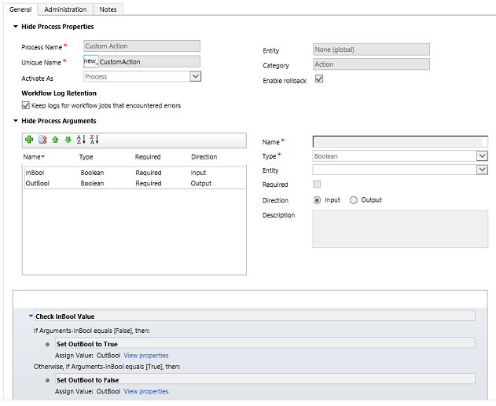

# Sdk.Soap.js Action Message Generator
## Requires
- Visual Studio 2012
## License
- MS-LPL
## Technologies
- CRM Online
- Javascript
- Microsoft CRM SDK
- Microsoft Dynamics CRM 2013
## Topics
- CRM Extensibility
- Microsoft Dynamics CRM SDK
- SOAP Web Service
- Microsoft Dynamics CRM Modern app SOAP endpoint
- Microsoft Dynamics CRM Web Resources
- Microsoft Dynamics CRM Actions
- Use Microsoft CRM SOAP web service with JavaScript
## Updated
- 04/27/2014
## Description

<ul>
<li><a href="#intro">Introduction</a> </li><li><a href="#install">Install NuGet packages</a> </li><li><a href="#generate">Generate Request and Response classes for messages</a> </li><li><a href="#example">Example: Sdk.new_CustomAction.vsdoc.js</a> </li><li><a href="#use">Use Request and Response classes for actions</a> </li></ul>
<h1 id="intro">Introduction</h1>

This project depends on the Sdk.Soap.js library included in the <a title="Sdk.Soap.js" href="http://code.msdn.microsoft.com/SdkSoapjs-9b51b99a" target="_blank">
Sdk.Soap.js</a> project.

Use actions to define business processes that you can call through code. See <a href="http://technet.microsoft.com/en-us/library/dn531060(v=crm.6).aspx" target="_blank">
Actions</a> for more information. JavaScript is one of the ways that actions can be called through code.

Define actions using the workflow designer in the web application. Use this Sdk.Soap Action Message Generator to generate request and response classes you can use in your code to call the action.

Before you can use this solution, you must install required NuGet packages.

<h1 id="install">Install NuGet packages</h1>

Use the following steps to install the required assemblies for the Sdk.Soap Action Message Generator:

<ol>
<li>Download the Sdk.Soap Action Message Generator solution files. </li><li>Open the Sdk.Soap Action Message Generator.sln solution file using Visual Studio 2013.
</li><li>In Visual Studio 2013, right-click the Sdk.Soap Action Message Generator project and choose
<strong>Manage NuGet Packages</strong>. </li><li>

In the search window, search for &ldquo;Microsoft Dynamics CRM 2013 core assemblies&rdquo;. Locate the NuGet package described in Microsoft Dynamics CRM 2013 SDK core assemblies.

</li><li>Click <strong>Install</strong>. You&rsquo;ll need to accept the license terms to complete installing this package.
</li><li>In the search window, search for &ldquo;AjaxMin&rdquo; and locate the package described in
<a href="https://www.nuget.org/packages/AjaxMin/" target="_blank">Microsoft Ajax Minifier</a>.
</li><li>Click <strong>Install</strong> to install the package and then close the window.
</li></ol>
<h1 id="generate">Generate Request and Response classes for messages</h1>

You define actions in your organization, using the workflow designer, before you can generate classes for them. After you have defined the actions, use the following steps to generate a JavaScript library for each class.

<ol>
<li>In Visual Studio, with the Sdk.Soap Action Message Generator solution open and the necessary NuGet packages installed, press F5.
</li><li>

If you have not previously run one of the Microsoft Dynamics CRM managed code samples before, you&rsquo;ll need to enter information to run the code, otherwise enter the number for one of the CRM servers you have previously set up.

<table>
<thead>
<tr>
<th>Prompt</th>
<th>Description</th>
</tr>
</thead>
<tbody>
<tr>
<td>Enter a CRM server name and port [crm.dynamics.com]</td>
<td>

Type the name of your Microsoft Dynamics CRM server. The default is Microsoft Dynamics CRM Online (crm.dynamics.com) in North America.

Example: myservername

Example: myprefix.myservername:5500

Example: crm5.dynamics.com

Don&rsquo;t include the name of your organization or Internet protocol (http or https). You&rsquo;ll be prompted for that later.

</td>
</tr>
<tr>
<td>Is this server configured for Secure Sockets Layer (https) (y/n) [n]</td>
<td>Type <strong>y</strong> if the URL you use to access Microsoft Dynamics CRM 2013 begins with https://, otherwise type
<strong>n</strong>. Microsoft Dynamics CRM Online users won&rsquo;t see this prompt.</td>
</tr>
<tr>
<td>Is this organization provisioned in Microsoft online services (y/n) [n]</td>
<td>

Type <strong>y</strong> if this is a Microsoft online services provisioned organization. Otherwise, type
<strong>n</strong>.

Only CRM Online users see this prompt.

</td>
</tr>
<tr>
<td>Enter domain\username</td>
<td>

For Microsoft Dynamics CRM 2013, type your network domain and user name separated by a backslash (\). For CRM Online, enter your Microsoft account.

On-premises/IFD example: mydomain\tadams

Online example: terryadams@somedomain.onmicrosoft.com

If you just press &lt;Enter&gt; for the user name, the program will look for and use saved credentials. If there are no saved credentials, the program will fail.

</td>
</tr>
<tr>
<td>Enter password</td>
<td>Type your password. The characters will show as &ldquo;*&rdquo; in the window. Your password is securely saved in the Microsoft Credential Manager for later reuse.</td>
</tr>
<tr>
<td>Specify an organization number (1-n) [1]</td>
<td>From the list of organizations shown that you belong to, type the corresponding number. The default is 1, indicating the first organization in the list.</td>
</tr>
</tbody>
</table>
</li><li>For each custom action found in your organization, a pair of corresponding JavaScript libraries will be saved in the \bin\Debug\Messages folder.
 
One version will be in the <strong>vsdoc</strong> folder and a second will be in the
<strong>min</strong> folder. Use the minified version in your production code and the *vsdoc.js version at design time to get IntelliSense support in Visual Studio.
</li><li><strong>Optional</strong>: You can edit the code comments in the *.vsdoc.js file to provide descriptions for the request and response properties so that other developers using the class can view the information with Visual Studio IntelliSense while using
 the class in their projects. </li></ol>
<h1 id="example">Example: Sdk.new_CustomAction.vsdoc.js</h1>

The following example is a simple custom action named &ldquo;Custom Action&rdquo; where the default organization solution publisher is &ldquo;new&rdquo;.

The following sample shows the Sdk.new_CustomAction.vsdoc.js file generated for the custom action named &ldquo;Custom Action&rdquo;.

<pre>

JavaScript

Edit|Remove
js<pre class="hidden">  &quot;use strict&quot;;
(function () {
this.new_CustomActionRequest = function (
inBool
)
{
///&lt;summary&gt;
/// This is a sample action
///&lt;/summary&gt;
///&lt;param name=&quot;inBool&quot;  type=&quot;Boolean&quot;&gt;
/// [Add Description]
///&lt;/param&gt;
if (!(this instanceof Sdk.new_CustomActionRequest)) {
return new Sdk.new_CustomActionRequest(inBool);
}
Sdk.OrganizationRequest.call(this);

  // Internal properties
var _InBool = null;

// internal validation functions

function _setValidInBool(value) {
 if (typeof value == &quot;boolean&quot;) {
  _InBool = value;
 }
 else {
  throw new Error(&quot;Sdk.new_CustomActionRequest InBool property is required and must be a Boolean.&quot;)
 }
}

//Set internal properties from constructor parameters
  if (typeof inBool != &quot;undefined&quot;) {
   _setValidInBool(inBool);
  }

  function getRequestXml() {
return [&quot;&lt;d:request&gt;&quot;,
        &quot;&lt;a:Parameters&gt;&quot;,

          &quot;&lt;a:KeyValuePairOfstringanyType&gt;&quot;,
            &quot;&lt;b:key&gt;InBool&lt;/b:key&gt;&quot;,
           (_InBool == null) ? &quot;&lt;b:value i:nil=\&quot;true\&quot; /&gt;&quot; :
           [&quot;&lt;b:value i:type=\&quot;c:boolean\&quot;&gt;&quot;, _InBool, &quot;&lt;/b:value&gt;&quot;].join(&quot;&quot;),
          &quot;&lt;/a:KeyValuePairOfstringanyType&gt;&quot;,

        &quot;&lt;/a:Parameters&gt;&quot;,
        &quot;&lt;a:RequestId i:nil=\&quot;true\&quot; /&gt;&quot;,
        &quot;&lt;a:RequestName&gt;new_CustomAction&lt;/a:RequestName&gt;&quot;,
      &quot;&lt;/d:request&gt;&quot;].join(&quot;&quot;);
  }

  this.setResponseType(Sdk.new_CustomActionResponse);
  this.setRequestXml(getRequestXml());

  // Public methods to set properties
  this.setInBool = function (value) {
  ///&lt;summary&gt;
  /// [Add Description]
  ///&lt;/summary&gt;
  ///&lt;param name=&quot;value&quot; type=&quot;Boolean&quot;&gt;
  /// [Add Description]
  ///&lt;/param&gt;
   _setValidInBool(value);
   this.setRequestXml(getRequestXml());
  }

 }
 this.new_CustomActionRequest.__class = true;

this.new_CustomActionResponse = function (responseXml) {
  ///&lt;summary&gt;
  /// Response to new_CustomActionRequest
  ///&lt;/summary&gt;
  if (!(this instanceof Sdk.new_CustomActionResponse)) {
   return new Sdk.new_CustomActionResponse(responseXml);
  }
  Sdk.OrganizationResponse.call(this)

  // Internal properties
  var _outBool = null;

  // Internal property setter functions

  function _setOutBool(xml) {
   var valueNode = Sdk.Xml.selectSingleNode(xml, &quot;//a:KeyValuePairOfstringanyType[b:key='OutBool']/b:value&quot;);
   if (!Sdk.Xml.isNodeNull(valueNode)) {
    _outBool = (Sdk.Xml.getNodeText(valueNode) == &quot;true&quot;) ? true : false;
   }
  }
  //Public Methods to retrieve properties
  this.getOutBool = function () {
  ///&lt;summary&gt;
  /// [Add Description]
  ///&lt;/summary&gt;
  ///&lt;returns type=&quot;Boolean&quot;&gt;
  /// [Add Description]
  ///&lt;/returns&gt;
   return _outBool;
  }

  //Set property values from responseXml constructor parameter
  _setOutBool(responseXml);
 }
 this.new_CustomActionResponse.__class = true;
}).call(Sdk)

Sdk.new_CustomActionRequest.prototype = new Sdk.OrganizationRequest();
Sdk.new_CustomActionResponse.prototype = new Sdk.OrganizationResponse();</pre>

<pre class="js">&nbsp;&nbsp;&quot;use&nbsp;strict&quot;;&nbsp;
(function&nbsp;()&nbsp;{&nbsp;
this.new_CustomActionRequest&nbsp;=&nbsp;function&nbsp;(&nbsp;
inBool&nbsp;
)&nbsp;
{&nbsp;
///&lt;summary&gt;&nbsp;
///&nbsp;This&nbsp;is&nbsp;a&nbsp;sample&nbsp;action&nbsp;
///&lt;/summary&gt;&nbsp;
///&lt;param&nbsp;name=&quot;inBool&quot;&nbsp;&nbsp;type=&quot;Boolean&quot;&gt;&nbsp;
///&nbsp;[Add&nbsp;Description]&nbsp;
///&lt;/param&gt;&nbsp;
if&nbsp;(!(this&nbsp;instanceof&nbsp;Sdk.new_CustomActionRequest))&nbsp;{&nbsp;
return&nbsp;new&nbsp;Sdk.new_CustomActionRequest(inBool);&nbsp;
}&nbsp;
Sdk.OrganizationRequest.call(this);&nbsp;
&nbsp;
&nbsp;&nbsp;//&nbsp;Internal&nbsp;properties&nbsp;
var&nbsp;_InBool&nbsp;=&nbsp;null;&nbsp;
&nbsp;
//&nbsp;internal&nbsp;validation&nbsp;functions&nbsp;
&nbsp;
function&nbsp;_setValidInBool(value)&nbsp;{&nbsp;
&nbsp;if&nbsp;(typeof&nbsp;value&nbsp;==&nbsp;&quot;boolean&quot;)&nbsp;{&nbsp;
&nbsp;&nbsp;_InBool&nbsp;=&nbsp;value;&nbsp;
&nbsp;}&nbsp;
&nbsp;else&nbsp;{&nbsp;
&nbsp;&nbsp;throw&nbsp;new&nbsp;Error(&quot;Sdk.new_CustomActionRequest&nbsp;InBool&nbsp;property&nbsp;is&nbsp;required&nbsp;and&nbsp;must&nbsp;be&nbsp;a&nbsp;Boolean.&quot;)&nbsp;
&nbsp;}&nbsp;
}&nbsp;
&nbsp;
//Set&nbsp;internal&nbsp;properties&nbsp;from&nbsp;constructor&nbsp;parameters&nbsp;
&nbsp;&nbsp;if&nbsp;(typeof&nbsp;inBool&nbsp;!=&nbsp;&quot;undefined&quot;)&nbsp;{&nbsp;
&nbsp;&nbsp;&nbsp;_setValidInBool(inBool);&nbsp;
&nbsp;&nbsp;}&nbsp;
&nbsp;
&nbsp;&nbsp;function&nbsp;getRequestXml()&nbsp;{&nbsp;
return&nbsp;[&quot;&lt;d:request&gt;&quot;,&nbsp;
&nbsp;&nbsp;&nbsp;&nbsp;&nbsp;&nbsp;&nbsp;&nbsp;&quot;&lt;a:Parameters&gt;&quot;,&nbsp;
&nbsp;
&nbsp;&nbsp;&nbsp;&nbsp;&nbsp;&nbsp;&nbsp;&nbsp;&nbsp;&nbsp;&quot;&lt;a:KeyValuePairOfstringanyType&gt;&quot;,&nbsp;
&nbsp;&nbsp;&nbsp;&nbsp;&nbsp;&nbsp;&nbsp;&nbsp;&nbsp;&nbsp;&nbsp;&nbsp;&quot;&lt;b:key&gt;InBool&lt;/b:key&gt;&quot;,&nbsp;
&nbsp;&nbsp;&nbsp;&nbsp;&nbsp;&nbsp;&nbsp;&nbsp;&nbsp;&nbsp;&nbsp;(_InBool&nbsp;==&nbsp;null)&nbsp;?&nbsp;&quot;&lt;b:value&nbsp;i:nil=\&quot;true\&quot;&nbsp;/&gt;&quot;&nbsp;:&nbsp;
&nbsp;&nbsp;&nbsp;&nbsp;&nbsp;&nbsp;&nbsp;&nbsp;&nbsp;&nbsp;&nbsp;[&quot;&lt;b:value&nbsp;i:type=\&quot;c:boolean\&quot;&gt;&quot;,&nbsp;_InBool,&nbsp;&quot;&lt;/b:value&gt;&quot;].join(&quot;&quot;),&nbsp;
&nbsp;&nbsp;&nbsp;&nbsp;&nbsp;&nbsp;&nbsp;&nbsp;&nbsp;&nbsp;&quot;&lt;/a:KeyValuePairOfstringanyType&gt;&quot;,&nbsp;
&nbsp;
&nbsp;&nbsp;&nbsp;&nbsp;&nbsp;&nbsp;&nbsp;&nbsp;&quot;&lt;/a:Parameters&gt;&quot;,&nbsp;
&nbsp;&nbsp;&nbsp;&nbsp;&nbsp;&nbsp;&nbsp;&nbsp;&quot;&lt;a:RequestId&nbsp;i:nil=\&quot;true\&quot;&nbsp;/&gt;&quot;,&nbsp;
&nbsp;&nbsp;&nbsp;&nbsp;&nbsp;&nbsp;&nbsp;&nbsp;&quot;&lt;a:RequestName&gt;new_CustomAction&lt;/a:RequestName&gt;&quot;,&nbsp;
&nbsp;&nbsp;&nbsp;&nbsp;&nbsp;&nbsp;&quot;&lt;/d:request&gt;&quot;].join(&quot;&quot;);&nbsp;
&nbsp;&nbsp;}&nbsp;
&nbsp;
&nbsp;&nbsp;this.setResponseType(Sdk.new_CustomActionResponse);&nbsp;
&nbsp;&nbsp;this.setRequestXml(getRequestXml());&nbsp;
&nbsp;
&nbsp;&nbsp;//&nbsp;Public&nbsp;methods&nbsp;to&nbsp;set&nbsp;properties&nbsp;
&nbsp;&nbsp;this.setInBool&nbsp;=&nbsp;function&nbsp;(value)&nbsp;{&nbsp;
&nbsp;&nbsp;///&lt;summary&gt;&nbsp;
&nbsp;&nbsp;///&nbsp;[Add&nbsp;Description]&nbsp;
&nbsp;&nbsp;///&lt;/summary&gt;&nbsp;
&nbsp;&nbsp;///&lt;param&nbsp;name=&quot;value&quot;&nbsp;type=&quot;Boolean&quot;&gt;&nbsp;
&nbsp;&nbsp;///&nbsp;[Add&nbsp;Description]&nbsp;
&nbsp;&nbsp;///&lt;/param&gt;&nbsp;
&nbsp;&nbsp;&nbsp;_setValidInBool(value);&nbsp;
&nbsp;&nbsp;&nbsp;this.setRequestXml(getRequestXml());&nbsp;
&nbsp;&nbsp;}&nbsp;
&nbsp;
&nbsp;}&nbsp;
&nbsp;this.new_CustomActionRequest.__class&nbsp;=&nbsp;true;&nbsp;
&nbsp;
this.new_CustomActionResponse&nbsp;=&nbsp;function&nbsp;(responseXml)&nbsp;{&nbsp;
&nbsp;&nbsp;///&lt;summary&gt;&nbsp;
&nbsp;&nbsp;///&nbsp;Response&nbsp;to&nbsp;new_CustomActionRequest&nbsp;
&nbsp;&nbsp;///&lt;/summary&gt;&nbsp;
&nbsp;&nbsp;if&nbsp;(!(this&nbsp;instanceof&nbsp;Sdk.new_CustomActionResponse))&nbsp;{&nbsp;
&nbsp;&nbsp;&nbsp;return&nbsp;new&nbsp;Sdk.new_CustomActionResponse(responseXml);&nbsp;
&nbsp;&nbsp;}&nbsp;
&nbsp;&nbsp;Sdk.OrganizationResponse.call(this)&nbsp;
&nbsp;
&nbsp;&nbsp;//&nbsp;Internal&nbsp;properties&nbsp;
&nbsp;&nbsp;var&nbsp;_outBool&nbsp;=&nbsp;null;&nbsp;
&nbsp;
&nbsp;&nbsp;//&nbsp;Internal&nbsp;property&nbsp;setter&nbsp;functions&nbsp;
&nbsp;
&nbsp;&nbsp;function&nbsp;_setOutBool(xml)&nbsp;{&nbsp;
&nbsp;&nbsp;&nbsp;var&nbsp;valueNode&nbsp;=&nbsp;Sdk.Xml.selectSingleNode(xml,&nbsp;&quot;//a:KeyValuePairOfstringanyType[b:key='OutBool']/b:value&quot;);&nbsp;
&nbsp;&nbsp;&nbsp;if&nbsp;(!Sdk.Xml.isNodeNull(valueNode))&nbsp;{&nbsp;
&nbsp;&nbsp;&nbsp;&nbsp;_outBool&nbsp;=&nbsp;(Sdk.Xml.getNodeText(valueNode)&nbsp;==&nbsp;&quot;true&quot;)&nbsp;?&nbsp;true&nbsp;:&nbsp;false;&nbsp;
&nbsp;&nbsp;&nbsp;}&nbsp;
&nbsp;&nbsp;}&nbsp;
&nbsp;&nbsp;//Public&nbsp;Methods&nbsp;to&nbsp;retrieve&nbsp;properties&nbsp;
&nbsp;&nbsp;this.getOutBool&nbsp;=&nbsp;function&nbsp;()&nbsp;{&nbsp;
&nbsp;&nbsp;///&lt;summary&gt;&nbsp;
&nbsp;&nbsp;///&nbsp;[Add&nbsp;Description]&nbsp;
&nbsp;&nbsp;///&lt;/summary&gt;&nbsp;
&nbsp;&nbsp;///&lt;returns&nbsp;type=&quot;Boolean&quot;&gt;&nbsp;
&nbsp;&nbsp;///&nbsp;[Add&nbsp;Description]&nbsp;
&nbsp;&nbsp;///&lt;/returns&gt;&nbsp;
&nbsp;&nbsp;&nbsp;return&nbsp;_outBool;&nbsp;
&nbsp;&nbsp;}&nbsp;
&nbsp;
&nbsp;&nbsp;//Set&nbsp;property&nbsp;values&nbsp;from&nbsp;responseXml&nbsp;constructor&nbsp;parameter&nbsp;
&nbsp;&nbsp;_setOutBool(responseXml);&nbsp;
&nbsp;}&nbsp;
&nbsp;this.new_CustomActionResponse.__class&nbsp;=&nbsp;true;&nbsp;
}).call(Sdk)&nbsp;
&nbsp;
Sdk.new_CustomActionRequest.prototype&nbsp;=&nbsp;new&nbsp;Sdk.OrganizationRequest();&nbsp;
Sdk.new_CustomActionResponse.prototype&nbsp;=&nbsp;new&nbsp;Sdk.OrganizationResponse();</pre>

</pre>
<h1 id="use">Use Request and Response classes for actions</h1>

The following conditions must be true before you can use request and response classes for actions:

<ol>
<li><strong>The custom action must be available in the organization.</strong> 
If you&rsquo;re not running the custom action in the same organization in which it was defined, you must export the custom action as part of a solution and install it in the organization where you want to use it.
</li><li><strong>The custom action must be activated.</strong> 
While you can use the Sdk.Soap Action Message generator to generate class files for actions that aren&rsquo;t yet activated, you can&rsquo;t use the action until it&rsquo;s activated.
</li><li><strong>The custom action signature cannot change.</strong> 
You can deactivate a custom action and change some of the parameters of a custom action. However, if you do this, you must regenerate the action classes to reflect these changes.
</li></ol>

When these conditions are true, you can use the JavaScript library classes for your custom actions in the same way you use the
<strong>execute</strong> method with the system message classes provided in the <strong>
Sdk.Soap.js</strong> project. See that project for more information about calling messages in your code.

