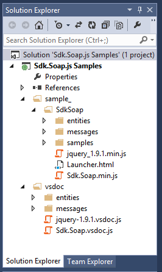
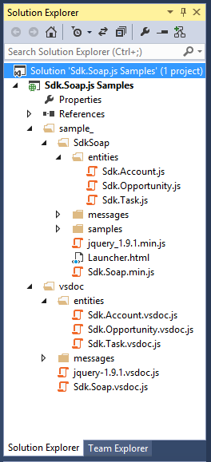
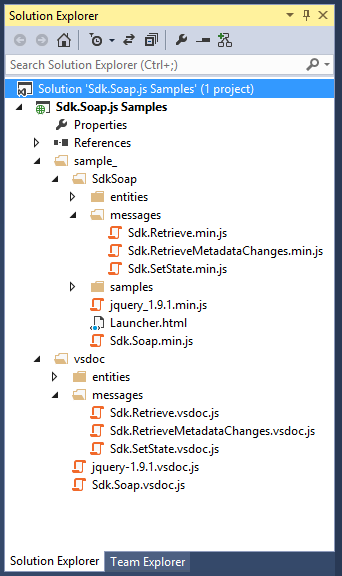

# Sdk.Soap.js Samples
## Requires
- Visual Studio 2012
## License
- MS-LPL
## Technologies
- CRM Online
- Javascript
- Microsoft CRM SDK
- Microsoft Dynamics CRM 2013
## Topics
- CRM Extensibility
- Microsoft Dynamics CRM SDK
- SOAP Web Service
- Use Microsoft CRM SOAP web service with JavaScript
## Updated
- 12/13/2014
## Description

<ul>
<li><a href="#intro">Introduction</a> </li><li><a href="#solution">Sdk.Soap.js Samples solution</a> </li><li><a href="#organization">Organization of files</a> </li><li><a href="#helpers">SampleHelperMethods.js</a> </li><li><a href="#asyncearly">AsyncEarlyBindingCRUD.js</a> </li><li><a href="#asynclate">AsyncLateBindingCRUD.js</a> </li><li><a href="#jquery">jQuerySample.js</a> </li><li><a href="#q">QSample.js</a> </li><li><a href="#metadata">RetrieveMetadataChangesSample.js</a> </li><li><a href="#fetch">Sdk.Query.FetchExpressionSample.js</a> </li><li><a href="#query">Sdk.Query.QueryExpressionSample.js</a> </li><li><a href="#sync">SyncSample.js</a> </li></ul>

<h1 id="intro">Introduction</h1>

This project contains samples using the <a href="http://code.msdn.microsoft.com/SdkSoapjs-9b51b99a" target="_blank">
Sdk.Soap.js </a>library. Refer to that project for documentation about using the Sdk.Soap.js library.

This project describes the samples as well as recommended coding practices when using this library in Microsoft Dynamics CRM web resources.

<h1 id="solution">Sdk.Soap.js Samples solution</h1>

Included in this project is a Microsoft Dynamics CRM managed solution made using the files in this project. To verify that the samples work and to observe the intended behavior, install the
<strong><a title="SdkSoapjsSamples_managed.zip" href="http://download.microsoft.com/download/6/E/6/6E693FD1-1F03-453C-B2BC-43AE7D7C6D53/SdkSoapjsSamples_managed.zip">SdkSoapjsSamples_managed.zip</a>
</strong>solution by uploading it to your Microsoft Dynamics CRM 2013 organization.
<a href="http://technet.microsoft.com/en-us/library/dn531198(v=crm.6).aspx#BKMK_ImportSolutions">
Find out how to import solutions</a>.

After you install the solution, go to the solution configuration page to view the
<strong>Launcher.html</strong> page included in this project. Use the links in that page to view the sample pages.

Each sample includes one or two buttons to execute the code in the sample.

Each of the samples is an HTML web resource that is linked to other files in the sample using relative paths.

<strong>Note</strong>:The <strong>sample_/SdkSoap/samples/QSample.html</strong> doesn&rsquo;t function because the
<strong>q.min.js</strong> libraries referenced by the files isn&rsquo;t included with this sample project or in the sample solution. To verify that the sample works you would need to create a JavaScript web resource named
<strong>sample_\SdkSoap\q.min.js</strong> containing the Q library. <a href="http://documentup.com/kriskowal/q/">
Find out more about the Q library</a>.

<h1 id="organization">Organization of files</h1>

The organization of files in this sample isn&rsquo;t intended to represent any best practice except for the way that the vsdoc and minimized libraries are separated.

The reason for this separation is that you&rsquo;ll probably develop the functionality for your web resources in a manner that they can be uploaded rather than creating them manually. If you&rsquo;re doing substantial web resource development, you&rsquo;ll
 probably want to automate the creation of web resources. The Microsoft Dynamics CRM 2013 SDK contains a
<a href="http://msdn.microsoft.com/en-us/library/gg328133(v=crm.6).aspx">sample web resource utility</a> that does this. Other solutions available from third parties provide similar functionality.

Since the <strong>vsdoc</strong> files are included in the solution only to provide design-time IntelliSense support, you don&rsquo;t want to create web resources using these files. This project separates the vsdoc files by placing them all in the
<strong>vsdoc</strong> folder while the files intended to be web resources are all under the
<strong>samples_ </strong>folder.

 

The <strong>sample_</strong> folder represents the solution publisher&rsquo;s customization prefix that is prepended to the name of any web resources created in the context of a solution where the solution publisher&rsquo;s customization prefix is &ldquo;sample&rdquo;.
 When uploading files as web resources, you can import all the files in this folder using the path from this folder as the web resource name. This way all the web resources in the project will have unique names and the relative paths used to link them will
 continue to work.

Beneath the <strong>samples_</strong> folder, the <strong>SdkSoap</strong> folder provides a unique name to differentiate any other web resources from this publisher that might include different versions of the same file. Within
<strong>SdkSoap</strong> are the <strong>entities</strong>, <strong>messages</strong> and
<strong>samples</strong> folders as well as the minimized <strong>jquery_1.9.1.min.js</strong>, and
<strong>Sdk.Soap.min.js</strong> files and the <strong>Launcher.html</strong> page that serves as the configuration page for the Sdk.Soap.js Samples solution.

Note that the default name for the minimized <strong>jquery_1.9.1.min.js</strong> file was changed to replace the hyphen with an underscore character. A hyphen is not allowed in a name for a web resource.

<h2>Entity files</h2>

In both the <strong>SdkSoap</strong> and <strong>vsdoc</strong> folders, the <strong>
entities</strong> folder contains files that were generated using the<a href="http://code.msdn.microsoft.com/SdkSoapjs-Entity-Class-14ca830f"> Sdk.Soap.js Entity Class Generator</a> project to support the early-bound development style. See the
<a href="http://code.msdn.microsoft.com/SdkSoapjs-9b51b99a">Sdk.Soap.js</a> project for more information about early and late binding styles and
<strong>Sdk.Soap.js Entity Class Generator </strong>for more information about how to generate these files.

 

In both folders you&rsquo;ll find classes for the Account, Opportunity, and Task entities. In
<strong>vsdoc\entities</strong>, the <strong>*.vsdoc.js</strong> files for these entities provide the larger files that contain descriptions for all the attributes in the entity. These files can be relatively large.
<strong>Sdk.Account.vsdoc.js</strong> is 167kb. Although the files are fully functional, you don&rsquo;t want to use them in solutions.

Within <strong>SdkSoap\entities</strong> the files are structured differently so that you can choose which attributes you want to include in your code. By default, all the attributes and relationship references are commented out; you must uncomment any of
 the attributes or relationships you want to use. These files are relatively smaller because they don&rsquo;t include the comments to support IntelliSense.
<strong>Sdk.Account.js</strong> is just 15kb. But these files could be even smaller. If you minimize the
<strong>Sdk.Account.js</strong> file used in this sample it would be only 3kb.

<h2>Message Files</h2>

This project uses the <strong>Retrieve</strong>, <strong>RetrieveMetadataChanges</strong>, and
<strong>SetState</strong> messages. The libraries to support these messages are in
<strong>SdkSoap\messages</strong> and <strong>vsdoc\messages</strong> folder. These message files were originally taken from the
<strong>Sdk.Soap.js</strong> project but they have been changed.

 

The files in the <strong>vsdoc\messages</strong> folder have been renamed to include
<strong>*.vsdoc.js</strong> so that it&rsquo;s easier to distinguish them as the files to support design-time IntelliSense.

Those files in the <strong>SdkSoap\messages</strong> folder have been minimized and renamed to include
<strong>*.min.js</strong> so that it&rsquo;s easier to distinguish them as the minimized files.

You should minimize the message files you use in your solutions. As you can see, there is a substantial change in file size, especially for larger files:

<table>
<thead>
<tr>
<th>Message library</th>
<th>Original size</th>
<th>Minimized size</th>
</tr>
</thead>
<tbody>
<tr>
<td>Sdk.Retrieve.js</td>
<td>8 KB</td>
<td>4 KB</td>
</tr>
<tr>
<td>Sdk.RetrieveMetadataChanges.js</td>
<td>129 KB</td>
<td>58 KB</td>
</tr>
<tr>
<td>Sdk.SetState.js</td>
<td>5 KB</td>
<td>3 KB</td>
</tr>
</tbody>
</table>
<h2>Sample files</h2>

The <strong>SdkSoap\samples </strong>folder contains the samples included in this project. There are 11 samples with 8 HTML pages to launch them. Each HTML page contains the necessary references and one or two buttons to execute the sample code. For each
 HTML page there is a corresponding &ldquo;code-behind&rdquo; *.js page containing the functions that run in the sample.

 

Several of the samples include the same operations but use different styles to achieve the same result. This was done to highlight some of the differences introduced within the following matrix of namespace and development styles.

<table>
<thead>
<tr>
<td>&nbsp;</td>
<th>Early-bound</th>
<th>Late-bound</th>
</tr>
</thead>
<tbody>
<tr>
<td><strong>Sdk.Async</strong></td>
<td>AsyncEarlyBindingCRUD.js : 
earlyBindingCRUDSample</td>
<td>AsyncLateBindingCRUD.js : 
lateBindingCRUDSample</td>
</tr>
<tr>
<td><strong>Sdk.jQ</strong></td>
<td>jQuerySample.js : 
earlyBindingCRUDSample</td>
<td>jQuerySample.js : 
lateBindingCRUDSample</td>
</tr>
<tr>
<td><strong>Sdk.Q</strong></td>
<td>QSample.js : 
earlyBindingCRUDSample</td>
<td>QSample.js : 
lateBindingCRUDSample</td>
</tr>
<tr>
<td><strong>Sdk.Sync</strong></td>
<td>SyncSample.js : 
earlyBindingCRUDSample</td>
<td>SyncSample.js : 
lateBindingCRUDSample</td>
</tr>
</tbody>
</table>

The two query samples also execute the same operations, but one uses <strong>Sdk.Query.FetchExpression
</strong>and the other uses <strong>Sdk.Query.QueryExpression</strong>. This simply highlights the different development styles afforded by each class.

Each of the samples use a common set of shared functions included in <strong>SampleHelperMethods.js</strong> and styles defined in
<strong>SampleStyles.css</strong>.

<h1 id="helpers">SampleHelperMethods.js</h1>

Before looking at the code in each sample it may be valuable to review the functions included in SampleHelperMethods.js. Some of these functions represent helpers that may be re-used or revised for use in your code.

<h2 id="initializeEntity">initializeEntity function</h2>

This simple function is a recommended best practice when using the late-binding style.

JavaScript

Edit|Remove

js

<pre class="js">function&nbsp;initializeEntity(entity,&nbsp;columns)&nbsp;
{&nbsp;
&nbsp;///&lt;summary&gt;&nbsp;
&nbsp;///&nbsp;Initializes&nbsp;an&nbsp;Sdk.Entity&nbsp;with&nbsp;attributes&nbsp;defined&nbsp;in&nbsp;a&nbsp;
&nbsp;///&nbsp;dictionary&nbsp;object.&nbsp;
&nbsp;///&lt;/summary&gt;&nbsp;
&nbsp;///&lt;param&nbsp;name=&quot;entity&quot;&nbsp;type=&quot;Sdk.Entity&quot;&nbsp;optional='false'&gt;&nbsp;
&nbsp;///&nbsp;An&nbsp;Sdk.Entity&nbsp;
&nbsp;///&lt;/param&gt;&nbsp;
&nbsp;///&lt;param&nbsp;name=&quot;columns&quot;&nbsp;type=&quot;Object&quot;&nbsp;optional='false'&gt;&nbsp;
&nbsp;///&nbsp;A&nbsp;dictionary&nbsp;object&nbsp;containing&nbsp;the&nbsp;names&nbsp;of&nbsp;each&nbsp;attribute&nbsp;
&nbsp;///&nbsp;and&nbsp;the&nbsp;type.&nbsp;
&nbsp;///&lt;/param&gt;&nbsp;
&nbsp;&nbsp;for&nbsp;(var&nbsp;i&nbsp;in&nbsp;columns)&nbsp;
&nbsp;&nbsp;{&nbsp;
&nbsp;&nbsp;&nbsp;entity.addAttribute(new&nbsp;columns[i](i));&nbsp;
&nbsp;&nbsp;}&nbsp;
}&nbsp;</pre>

Without entity class files to provide IntelliSense, you need to define the type of attribute when you add it to the
<strong>Sdk.Entity</strong>. This function, combined with a dictionary of attributes and types allows you to use the simpler
<strong>setValue</strong> method for the attributes that are already added.

JavaScript

Edit|Remove

js

<pre class="js">//This&nbsp;dictionary&nbsp;of&nbsp;columns&nbsp;is&nbsp;used&nbsp;by&nbsp;&nbsp;
&nbsp;//&nbsp;the&nbsp;initializeEntity&nbsp;and&nbsp;getColumnSet&nbsp;functions&nbsp;
&nbsp;//&nbsp;with&nbsp;the&nbsp;&ldquo;late-binding&rdquo;&nbsp;style.&nbsp;
&nbsp;var&nbsp;accountColumns&nbsp;=&nbsp;{&nbsp;
&nbsp;&nbsp;&quot;accountcategorycode&quot;:&nbsp;Sdk.OptionSet,&nbsp;
&nbsp;&nbsp;&quot;accountid&quot;:&nbsp;Sdk.Guid,&nbsp;
&nbsp;&nbsp;&quot;accountnumber&quot;:&nbsp;Sdk.String,&nbsp;
&nbsp;&nbsp;&quot;address1_addressid&quot;:&nbsp;Sdk.Guid,&nbsp;
&nbsp;&nbsp;&quot;address1_city&quot;:&nbsp;Sdk.String,&nbsp;
&nbsp;&nbsp;&quot;address1_latitude&quot;:&nbsp;Sdk.Double,&nbsp;
&nbsp;&nbsp;&quot;address1_longitude&quot;:&nbsp;Sdk.Double,&nbsp;
&nbsp;&nbsp;&quot;createdby&quot;:&nbsp;Sdk.Lookup,&nbsp;
&nbsp;&nbsp;&quot;createdon&quot;:&nbsp;Sdk.DateTime,&nbsp;
&nbsp;&nbsp;&quot;creditlimit&quot;:&nbsp;Sdk.Money,&nbsp;
&nbsp;&nbsp;&quot;creditonhold&quot;:&nbsp;Sdk.Boolean,&nbsp;
&nbsp;&nbsp;&quot;description&quot;:&nbsp;Sdk.String,&nbsp;
&nbsp;&nbsp;&quot;donotbulkemail&quot;:&nbsp;Sdk.Boolean,&nbsp;
&nbsp;&nbsp;&quot;exchangerate&quot;:&nbsp;Sdk.Decimal,&nbsp;
&nbsp;&nbsp;&quot;industrycode&quot;:&nbsp;Sdk.OptionSet,&nbsp;
&nbsp;&nbsp;&quot;name&quot;:&nbsp;Sdk.String,&nbsp;
&nbsp;&nbsp;&quot;numberofemployees&quot;:&nbsp;Sdk.Int,&nbsp;
&nbsp;&nbsp;&quot;ownerid&quot;:&nbsp;Sdk.Lookup,&nbsp;
&nbsp;&nbsp;&quot;owninguser&quot;:&nbsp;Sdk.Lookup,&nbsp;
&nbsp;&nbsp;&quot;revenue&quot;:&nbsp;Sdk.Money,&nbsp;
&nbsp;&nbsp;&quot;sharesoutstanding&quot;:&nbsp;Sdk.Int,&nbsp;
&nbsp;&nbsp;&quot;statecode&quot;:&nbsp;Sdk.OptionSet,&nbsp;
&nbsp;&nbsp;&quot;statuscode&quot;:&nbsp;Sdk.OptionSet,&nbsp;
&nbsp;&nbsp;&quot;versionnumber&quot;:&nbsp;Sdk.Long&nbsp;
&nbsp;};&nbsp;
&nbsp;
&nbsp;var&nbsp;account&nbsp;=&nbsp;new&nbsp;Sdk.Entity(&quot;account&quot;);&nbsp;
&nbsp;//When&nbsp;using&nbsp;&ldquo;late-binding,&rdquo;&nbsp;a&nbsp;helper&nbsp;function&nbsp;like&nbsp;initializeEntity&nbsp;helps&nbsp;simplify&nbsp;syntax&nbsp;to&nbsp;set&nbsp;values.&nbsp;
&nbsp;//You&rsquo;ll&nbsp;want&nbsp;to&nbsp;use&nbsp;this&nbsp;every&nbsp;time&nbsp;you&nbsp;retrieve&nbsp;a&nbsp;record,&nbsp;too.&nbsp;
&nbsp;initializeEntity(account,&nbsp;accountColumns);&nbsp;
&nbsp;account.setValue(&quot;name&quot;,&nbsp;&quot;Sample&nbsp;Account&nbsp;001&quot;);&nbsp;
&nbsp;account.setValue(&quot;creditonhold&quot;,&nbsp;false);&nbsp;
&nbsp;account.setValue(&quot;address1_latitude&quot;,&nbsp;47.638197);&nbsp;
&nbsp;account.setValue(&quot;address1_longitude&quot;,&nbsp;-122.131378);&nbsp;
&nbsp;account.setValue(&quot;numberofemployees&quot;,&nbsp;100000);&nbsp;
&nbsp;account.setValue(&quot;description&quot;,&nbsp;&quot;This&nbsp;is&nbsp;a&nbsp;description.&quot;);&nbsp;
&nbsp;account.setValue(&quot;creditlimit&quot;,&nbsp;2000000.00);&nbsp;
&nbsp;account.setValue(&quot;accountcategorycode&quot;,&nbsp;1);&nbsp;//Preferred&nbsp;Customer&nbsp;
&nbsp;
&nbsp;//Without&nbsp;initializeEntity:&nbsp;
&nbsp;account.addAttribute(new&nbsp;Sdk.String(&quot;name&quot;,&nbsp;name));&nbsp;
&nbsp;account.addAttribute(new&nbsp;Sdk.Boolean(&quot;creditonhold&quot;,&nbsp;false));&nbsp;
&nbsp;account.addAttribute(new&nbsp;Sdk.Double(&quot;address1_latitude&quot;,&nbsp;47.638197));&nbsp;
&nbsp;account.addAttribute(new&nbsp;Sdk.Double(&quot;address1_longitude&quot;,&nbsp;-122.131378));&nbsp;
&nbsp;account.addAttribute(new&nbsp;Sdk.Int(&quot;numberofemployees&quot;,&nbsp;100000));&nbsp;
&nbsp;account.addAttribute(new&nbsp;Sdk.String(&quot;description&quot;,&nbsp;&quot;This&nbsp;is&nbsp;a&nbsp;description.&quot;));&nbsp;
&nbsp;account.addAttribute(new&nbsp;Sdk.Money(&quot;creditlimit&quot;,&nbsp;2000000));&nbsp;
&nbsp;account.addAttribute(new&nbsp;Sdk.OptionSet(&quot;accountcategorycode&quot;,&nbsp;1));&nbsp;//Preferred&nbsp;Customer&nbsp;</pre>

<strong>Sdk.Entity.addAttribute</strong> must be used if the attribute hasn&rsquo;t previously been added to the entity. The
<strong>addAttribute</strong> method requires that the first parameter be one of the classes that inherit from
<strong>Sdk.AttributeBase</strong> and each of these classes require a string representing the attribute name as the first constructor parameter. The second constructor parameter to set the value is optional.

You can use <strong>addAttribute</strong> on an entity that already has the attribute added. If the attribute you add doesn&rsquo;t have a value set, the value of the attribute already in the entity won&rsquo;t be overwritten.

<h2 id="getColumnSet">getColumnSet function</h2>

This function uses the same dictionary of entity columns used by the <a href="#initializeEntity">
initializeEntity function</a> to generate an Sdk.ColumnSet object needed for queries.

JavaScript

Edit|Remove

js

<pre class="js">function&nbsp;getColumnSet(entityColumns)&nbsp;
{&nbsp;
&nbsp;///&lt;summary&gt;&nbsp;
&nbsp;///&nbsp;Initializes&nbsp;an&nbsp;Sdk.ColumnSet&nbsp;
&nbsp;///&nbsp;dictionary&nbsp;object.&nbsp;
&nbsp;///&lt;/summary&gt;&nbsp;
&nbsp;///&lt;param&nbsp;name=&quot;entityColumns&quot;&nbsp;type=&quot;Object&quot;&nbsp;optional='false'&gt;&nbsp;
&nbsp;///&nbsp;A&nbsp;dictionary&nbsp;object&nbsp;containing&nbsp;the&nbsp;names&nbsp;of&nbsp;each&nbsp;attribute&nbsp;
&nbsp;///&nbsp;and&nbsp;the&nbsp;type.&nbsp;
&nbsp;///&lt;/param&gt;&nbsp;
&nbsp;var&nbsp;attributeNames&nbsp;=&nbsp;[];&nbsp;
&nbsp;for&nbsp;(var&nbsp;i&nbsp;in&nbsp;entityColumns)&nbsp;
&nbsp;{&nbsp;
&nbsp;&nbsp;attributeNames.push(i);&nbsp;
&nbsp;}&nbsp;
&nbsp;//Sdk.ColumnSet&nbsp;accepts&nbsp;an&nbsp;array&nbsp;of&nbsp;strings&nbsp;as&nbsp;the&nbsp;parameter.&nbsp;
&nbsp;return&nbsp;new&nbsp;Sdk.ColumnSet(attributeNames);&nbsp;
}&nbsp;</pre>

Together, <strong>initializeEntity</strong> and <strong>getColumnSet</strong> can be used to define a limited set of attributes to use for an entity when using the late-binding style.

<h2 id="showEntityAttributeValues">showEntityAttributeValues function</h2>

This function uses the <a href="#writetopage">writeToPage</a> function to render a table showing the values of a record in the sample. This function shows how to access formatted values in an entity using the
<strong>entity.getFormattedValues </strong>method.

<h3>C# Equivalent Code:</h3>

The following code is the C# equivalent.

C#

Edit|Remove

csharp

<pre class="csharp">public&nbsp;void&nbsp;ShowEntityAttributeValues(Entity&nbsp;entity)&nbsp;{&nbsp;
&nbsp;&nbsp;&nbsp;Console.WriteLine(&quot;====================================&quot;);&nbsp;
&nbsp;&nbsp;&nbsp;foreach&nbsp;(var&nbsp;a&nbsp;in&nbsp;entity.Attributes)&nbsp;
&nbsp;&nbsp;&nbsp;{&nbsp;
&nbsp;&nbsp;&nbsp;&nbsp;String&nbsp;name&nbsp;=&nbsp;a.Key;&nbsp;
&nbsp;&nbsp;&nbsp;&nbsp;Object&nbsp;value&nbsp;=&nbsp;a.Value;&nbsp;
&nbsp;&nbsp;&nbsp;&nbsp;String&nbsp;formattedValue&nbsp;=&nbsp;null;&nbsp;
&nbsp;&nbsp;&nbsp;&nbsp;Boolean&nbsp;IsFormattedValue&nbsp;=&nbsp;entity.FormattedValues.TryGetValue(name,&nbsp;out&nbsp;formattedValue);&nbsp;
&nbsp;&nbsp;&nbsp;&nbsp;if&nbsp;(value&nbsp;is&nbsp;<a class="libraryLink" href="https://msdn.microsoft.com/en-US/library/Microsoft.Xrm.Sdk.EntityReference.aspx" target="_blank" title="Auto generated link to Microsoft.Xrm.Sdk.EntityReference">Microsoft.Xrm.Sdk.EntityReference</a>)&nbsp;{&nbsp;
&nbsp;&nbsp;&nbsp;&nbsp;&nbsp;value&nbsp;=&nbsp;((EntityReference)value).Name;&nbsp;
&nbsp;&nbsp;&nbsp;&nbsp;}&nbsp;
&nbsp;&nbsp;&nbsp;&nbsp;Console.WriteLine(&quot;{0}&nbsp;:&nbsp;{1}&quot;,&nbsp;name,&nbsp;(IsFormattedValue)?&nbsp;formattedValue&nbsp;:&nbsp;(value&nbsp;==&nbsp;null)?&nbsp;&quot;null&quot;:&nbsp;value);&nbsp;
&nbsp;&nbsp;&nbsp;}&nbsp;
&nbsp;&nbsp;&nbsp;Console.WriteLine(&quot;====================================&quot;);&nbsp;
&nbsp;&nbsp;}&nbsp;</pre>

<h2 id="errorhandler">ErrorHandler class</h2>

When defining an error handler for asynchronous requests you must set a function to the
<strong>errorCallback</strong> parameter exposed for each operation. This function represents a simple class that stores a context string that will be prepended to the error message returned from the platform.

JavaScript

Edit|Remove

js

<pre class="js">function&nbsp;ErrorHandler(errorContext)&nbsp;
{&nbsp;
&nbsp;///&lt;summary&gt;&nbsp;
&nbsp;///&nbsp;A&nbsp;class&nbsp;that&nbsp;stores&nbsp;an&nbsp;error&nbsp;context&nbsp;string&nbsp;and&nbsp;provides&nbsp;a&nbsp;function&nbsp;&nbsp;
&nbsp;///&nbsp;to&nbsp;call&nbsp;in&nbsp;an&nbsp;asynchronous&nbsp;event&nbsp;handler.&nbsp;
&nbsp;///&lt;/summary&gt;&nbsp;
&nbsp;///&lt;param&nbsp;name=&quot;errorContext&quot;&nbsp;type=&quot;String&quot;&nbsp;optional='false'&gt;&nbsp;
&nbsp;///&nbsp;A&nbsp;string&nbsp;that&nbsp;provides&nbsp;some&nbsp;context&nbsp;for&nbsp;where&nbsp;the&nbsp;error&nbsp;occurred.&nbsp;
&nbsp;///&lt;/param&gt;&nbsp;
&nbsp;var&nbsp;_ec&nbsp;=&nbsp;errorContext;&nbsp;
&nbsp;this.getError&nbsp;=&nbsp;function&nbsp;(error)&nbsp;
&nbsp;{&nbsp;
&nbsp;&nbsp;writeToPage(_ec&nbsp;&#43;&nbsp;&quot;&nbsp;Error:&nbsp;&quot;&nbsp;&#43;&nbsp;error.message);&nbsp;
&nbsp;};&nbsp;
}&nbsp;</pre>

Be sure to use the new keyword when setting the <strong>errorCallback</strong> function, and don&rsquo;t actually call the function, as shown here.

JavaScript

Edit|Remove

js

<pre class="js">Sdk.Async.create(&nbsp;
&nbsp;account,&nbsp;
&nbsp;function&nbsp;(id)&nbsp;
&nbsp;{&nbsp;
&nbsp;&nbsp;//successCallback&nbsp;
&nbsp;},&nbsp;
&nbsp;new&nbsp;ErrorHandler(&quot;create&nbsp;account&quot;).getError);&nbsp;&nbsp;</pre>

If there is an error that occurs for this operation, the error message will include the description provided as the
<strong>errorContext</strong> parameter. This particular error handler uses the <a href="#writetopage">
writeToPage function</a> to make the error visible.

<h2 id="jqerrorhandler">jQErrorHandler class</h2>

When using the methods in the Sdk.jQ namespace, the <a href="#errorhandler">
ErrorHandler class</a> doesn&rsquo;t work as expected. The returned error doesn&rsquo;t stop the chain unless a jQuery.Deferred.promise is returned. In addition to using the
<a href="#writetopage">writeToPage function</a>, this error handler also returns a
<strong>jQuery.Deferred.promise</strong>. Otherwise, it is the same as the <strong>
ErrorHandler</strong> class.

<h2 id="writetopage">writeToPage function</h2>

This utility function simply appends a new list element or a DOM object (such as a table) to the sample page.

<h1 id="asyncearly">AsyncEarlyBindingCRUD.js</h1>

This sample uses the methods in the <strong>Sdk.Async </strong>namespace to perform the following actions in an early-bound style using the function
<strong>earlyBindingCRUDSample</strong>.

<h2 id="csharpearlybinding">C# Equivalent Early Binding CRUD Code:</h2>

The following code is the C# equivalent.

C#

Edit|Remove

csharp

<pre class="csharp">public&nbsp;void&nbsp;earlyBindingCRUDSample()&nbsp;
&nbsp;&nbsp;{&nbsp;
&nbsp;&nbsp;&nbsp;//Capture&nbsp;the&nbsp;ID&nbsp;of&nbsp;created&nbsp;records&nbsp;to&nbsp;clean&nbsp;up&nbsp;afterwards&nbsp;by&nbsp;deleting&nbsp;them.&nbsp;
&nbsp;&nbsp;&nbsp;Guid&nbsp;CreatedAccountId;&nbsp;
&nbsp;&nbsp;&nbsp;Guid&nbsp;CreatedOpportunityId;&nbsp;
&nbsp;&nbsp;&nbsp;Guid&nbsp;CreatedTaskId;&nbsp;
&nbsp;
&nbsp;&nbsp;&nbsp;Account&nbsp;account&nbsp;=&nbsp;new&nbsp;Account();&nbsp;
&nbsp;&nbsp;&nbsp;account.Name&nbsp;=&nbsp;&quot;Sample&nbsp;Account&nbsp;001&quot;;&nbsp;
&nbsp;&nbsp;&nbsp;account.CreditOnHold&nbsp;=&nbsp;false;&nbsp;
&nbsp;&nbsp;&nbsp;account.Address1_Latitude&nbsp;=&nbsp;47.638197;&nbsp;
&nbsp;&nbsp;&nbsp;account.Address1_Longitude&nbsp;=&nbsp;-122.131378;&nbsp;
&nbsp;&nbsp;&nbsp;account.Description&nbsp;=&nbsp;&quot;This&nbsp;is&nbsp;a&nbsp;description.&nbsp;\n&nbsp;It&nbsp;has&nbsp;several&nbsp;lines.&nbsp;\n&nbsp;This&nbsp;is&nbsp;the&nbsp;third&nbsp;line.&quot;;&nbsp;
&nbsp;&nbsp;&nbsp;account.CreditLimit&nbsp;=&nbsp;new&nbsp;Money(new&nbsp;Decimal(200000.00));&nbsp;
&nbsp;&nbsp;&nbsp;account.AccountCategoryCode&nbsp;=&nbsp;new&nbsp;OptionSetValue(1);&nbsp;
&nbsp;&nbsp;&nbsp;//Create&nbsp;the&nbsp;account.&nbsp;
&nbsp;&nbsp;&nbsp;//Capture&nbsp;the&nbsp;ID&nbsp;of&nbsp;created&nbsp;records&nbsp;to&nbsp;clean&nbsp;up&nbsp;afterwards&nbsp;by&nbsp;deleting&nbsp;them.&nbsp;
&nbsp;&nbsp;&nbsp;CreatedAccountId&nbsp;=&nbsp;_serviceProxy.Create(account);&nbsp;
&nbsp;
&nbsp;&nbsp;&nbsp;//Define&nbsp;the&nbsp;account&nbsp;columns&nbsp;to&nbsp;work&nbsp;with&nbsp;&nbsp;
&nbsp;&nbsp;&nbsp;//&nbsp;when&nbsp;retrieving&nbsp;columns&nbsp;for&nbsp;this&nbsp;sample.&nbsp;
&nbsp;&nbsp;&nbsp;ColumnSet&nbsp;accountColumnSet&nbsp;=&nbsp;new&nbsp;ColumnSet(&nbsp;
&nbsp;&nbsp;&nbsp;&nbsp;new&nbsp;string[]{&nbsp;
&nbsp;&nbsp;&nbsp;&nbsp;&nbsp;&nbsp;&quot;accountcategorycode&quot;,&nbsp;
&nbsp;&nbsp;&nbsp;&nbsp;&nbsp;&nbsp;&quot;accountid&quot;,&nbsp;
&nbsp;&nbsp;&nbsp;&nbsp;&nbsp;&nbsp;&quot;accountnumber&quot;,&nbsp;
&nbsp;&nbsp;&nbsp;&nbsp;&nbsp;&nbsp;&quot;address1_addressid&quot;,&nbsp;
&nbsp;&nbsp;&nbsp;&nbsp;&nbsp;&nbsp;&quot;address1_city&quot;,&nbsp;
&nbsp;&nbsp;&nbsp;&nbsp;&nbsp;&nbsp;&quot;address1_latitude&quot;,&nbsp;
&nbsp;&nbsp;&nbsp;&nbsp;&nbsp;&nbsp;&quot;address1_longitude&quot;,&nbsp;
&nbsp;&nbsp;&nbsp;&nbsp;&nbsp;&nbsp;&quot;createdby&quot;,&nbsp;
&nbsp;&nbsp;&nbsp;&nbsp;&nbsp;&nbsp;&quot;createdon&quot;,&nbsp;
&nbsp;&nbsp;&nbsp;&nbsp;&nbsp;&nbsp;&quot;creditlimit&quot;,&nbsp;
&nbsp;&nbsp;&nbsp;&nbsp;&nbsp;&nbsp;&quot;creditonhold&quot;,&nbsp;
&nbsp;&nbsp;&nbsp;&nbsp;&nbsp;&nbsp;&quot;description&quot;,&nbsp;
&nbsp;&nbsp;&nbsp;&nbsp;&nbsp;&nbsp;&quot;donotbulkemail&quot;,&nbsp;
&nbsp;&nbsp;&nbsp;&nbsp;&nbsp;&nbsp;&quot;exchangerate&quot;,&nbsp;
&nbsp;&nbsp;&nbsp;&nbsp;&nbsp;&nbsp;&quot;industrycode&quot;,&nbsp;
&nbsp;&nbsp;&nbsp;&nbsp;&nbsp;&nbsp;&quot;name&quot;,&nbsp;
&nbsp;&nbsp;&nbsp;&nbsp;&nbsp;&nbsp;&quot;numberofemployees&quot;,&nbsp;
&nbsp;&nbsp;&nbsp;&nbsp;&nbsp;&nbsp;&quot;ownerid&quot;,&nbsp;
&nbsp;&nbsp;&nbsp;&nbsp;&nbsp;&nbsp;&quot;owninguser&quot;,&nbsp;
&nbsp;&nbsp;&nbsp;&nbsp;&nbsp;&nbsp;&quot;revenue&quot;,&nbsp;
&nbsp;&nbsp;&nbsp;&nbsp;&nbsp;&nbsp;&quot;sharesoutstanding&quot;,&nbsp;
&nbsp;&nbsp;&nbsp;&nbsp;&nbsp;&nbsp;&quot;statecode&quot;,&nbsp;
&nbsp;&nbsp;&nbsp;&nbsp;&nbsp;&nbsp;&quot;statuscode&quot;,&nbsp;
&nbsp;&nbsp;&nbsp;&nbsp;&nbsp;&nbsp;&quot;versionnumber&quot;}&nbsp;
&nbsp;&nbsp;&nbsp;&nbsp;);&nbsp;
&nbsp;&nbsp;&nbsp;//Retrieve&nbsp;the&nbsp;created&nbsp;account.&nbsp;
&nbsp;&nbsp;&nbsp;//Retrieve&nbsp;returns&nbsp;an&nbsp;Entity&nbsp;object&nbsp;so&nbsp;you&nbsp;have&nbsp;to&nbsp;cast&nbsp;it&nbsp;into&nbsp;an&nbsp;Account.&nbsp;
&nbsp;&nbsp;&nbsp;account&nbsp;=&nbsp;(Account)_serviceProxy.Retrieve(&quot;account&quot;,&nbsp;CreatedAccountId,&nbsp;accountColumnSet);&nbsp;
&nbsp;&nbsp;&nbsp;Console.WriteLine(&quot;Retrieved&nbsp;account&nbsp;named:&nbsp;&quot;&nbsp;&#43;&nbsp;account.Name);&nbsp;
&nbsp;
&nbsp;&nbsp;&nbsp;account.SharesOutstanding&nbsp;=&nbsp;200;&nbsp;
&nbsp;&nbsp;&nbsp;account.Revenue&nbsp;=&nbsp;new&nbsp;Money(new&nbsp;Decimal(3000000.00));&nbsp;
&nbsp;&nbsp;&nbsp;account.IndustryCode&nbsp;=&nbsp;new&nbsp;OptionSetValue(6);&nbsp;//Business&nbsp;Services&nbsp;
&nbsp;&nbsp;&nbsp;account.AccountNumber&nbsp;=&nbsp;&quot;ABC123&quot;;&nbsp;
&nbsp;
&nbsp;&nbsp;&nbsp;_serviceProxy.Update(account);&nbsp;
&nbsp;&nbsp;&nbsp;Console.WriteLine(&quot;Updated&nbsp;account&quot;);&nbsp;
&nbsp;&nbsp;&nbsp;//Call&nbsp;retrieve&nbsp;again&nbsp;to&nbsp;refresh&nbsp;formatted&nbsp;values:&nbsp;
&nbsp;&nbsp;&nbsp;account&nbsp;=&nbsp;(Account)_serviceProxy.Retrieve(&quot;account&quot;,&nbsp;account.Id,&nbsp;accountColumnSet);&nbsp;
&nbsp;&nbsp;&nbsp;Console.WriteLine(&quot;Retrieved&nbsp;account&nbsp;after&nbsp;updating&nbsp;to&nbsp;get&nbsp;any&nbsp;new&nbsp;formatted&nbsp;values&quot;);&nbsp;
&nbsp;&nbsp;&nbsp;Console.WriteLine(&quot;These&nbsp;are&nbsp;the&nbsp;current&nbsp;values&nbsp;for&nbsp;the&nbsp;account:&quot;);&nbsp;
&nbsp;&nbsp;&nbsp;ShowEntityAttributeValues(account);&nbsp;
&nbsp;&nbsp;&nbsp;//Create&nbsp;Opportunity&nbsp;with&nbsp;Task:&nbsp;
&nbsp;&nbsp;&nbsp;Opportunity&nbsp;opportunity&nbsp;=&nbsp;new&nbsp;Opportunity();&nbsp;
&nbsp;&nbsp;&nbsp;opportunity.Name&nbsp;=&nbsp;&quot;Sample&nbsp;Opportunity&nbsp;001&quot;;&nbsp;
&nbsp;&nbsp;&nbsp;opportunity.CustomerId&nbsp;=&nbsp;account.ToEntityReference();&nbsp;
&nbsp;
&nbsp;&nbsp;&nbsp;Task&nbsp;task&nbsp;=&nbsp;new&nbsp;Task();&nbsp;
&nbsp;&nbsp;&nbsp;task.Subject&nbsp;=&nbsp;&quot;Sample&nbsp;Task&nbsp;001&quot;;&nbsp;
&nbsp;&nbsp;&nbsp;DateTime&nbsp;dueDate&nbsp;=&nbsp;DateTime.Now;&nbsp;
&nbsp;&nbsp;&nbsp;dueDate&nbsp;=&nbsp;dueDate.AddDays(10);&nbsp;
&nbsp;&nbsp;&nbsp;task.ScheduledEnd&nbsp;=&nbsp;dueDate;&nbsp;
&nbsp;&nbsp;&nbsp;//Adding&nbsp;the&nbsp;task&nbsp;to&nbsp;the&nbsp;related&nbsp;Opportunity_Tasks&nbsp;before&nbsp;create&nbsp;
&nbsp;&nbsp;&nbsp;//&nbsp;will&nbsp;associate&nbsp;the&nbsp;task&nbsp;with&nbsp;the&nbsp;opportunity&nbsp;when&nbsp;they&nbsp;are&nbsp;both&nbsp;created.&nbsp;
&nbsp;&nbsp;&nbsp;EntityCollection&nbsp;relatedTasks&nbsp;=&nbsp;new&nbsp;EntityCollection();&nbsp;
&nbsp;&nbsp;&nbsp;relatedTasks.Entities.Add(task);&nbsp;
&nbsp;&nbsp;&nbsp;opportunity.RelatedEntities.Add(&nbsp;new&nbsp;Relationship(&quot;Opportunity_Tasks&quot;),&nbsp;relatedTasks);&nbsp;
&nbsp;&nbsp;&nbsp;//Create&nbsp;the&nbsp;opportunity&nbsp;with&nbsp;related&nbsp;task:&nbsp;
&nbsp;&nbsp;&nbsp;CreatedOpportunityId&nbsp;=&nbsp;_serviceProxy.Create(opportunity);&nbsp;//cache&nbsp;for&nbsp;deletion&nbsp;later.&nbsp;
&nbsp;&nbsp;&nbsp;Console.WriteLine(&quot;Created&nbsp;new&nbsp;Opportunity&nbsp;with&nbsp;id:&quot;&nbsp;&#43;&nbsp;CreatedOpportunityId);&nbsp;
&nbsp;
&nbsp;&nbsp;&nbsp;//&nbsp;Use&nbsp;QueryByAttribute&nbsp;to&nbsp;retrieve&nbsp;tasks&nbsp;associated&nbsp;with&nbsp;the&nbsp;opportunity.&nbsp;
&nbsp;&nbsp;&nbsp;QueryByAttribute&nbsp;retrieveTaskQuery&nbsp;=&nbsp;new&nbsp;QueryByAttribute(&quot;task&quot;);&nbsp;
&nbsp;&nbsp;&nbsp;retrieveTaskQuery.ColumnSet&nbsp;=&nbsp;new&nbsp;ColumnSet(new&nbsp;String[]&nbsp;{&nbsp;&quot;subject&quot;,&nbsp;&quot;scheduledend&quot;,&nbsp;&quot;regardingobjectid&quot;&nbsp;});&nbsp;
&nbsp;&nbsp;&nbsp;retrieveTaskQuery.AddAttributeValue(&quot;regardingobjectid&quot;,&nbsp;CreatedOpportunityId);&nbsp;
&nbsp;&nbsp;&nbsp;EntityCollection&nbsp;taskCollection&nbsp;=&nbsp;_serviceProxy.RetrieveMultiple(retrieveTaskQuery);&nbsp;
&nbsp;&nbsp;&nbsp;Console.WriteLine(&quot;Retrieved&nbsp;&quot;&nbsp;&#43;&nbsp;taskCollection.Entities.Count&nbsp;&#43;&nbsp;&quot;&nbsp;task&quot;);&nbsp;
&nbsp;&nbsp;&nbsp;Console.WriteLine(&quot;These&nbsp;are&nbsp;the&nbsp;properties&nbsp;of&nbsp;the&nbsp;task&nbsp;retrieved:&quot;);&nbsp;
&nbsp;&nbsp;&nbsp;task&nbsp;=&nbsp;(Task)taskCollection.Entities[0];&nbsp;
&nbsp;&nbsp;&nbsp;CreatedTaskId&nbsp;=&nbsp;task.Id;&nbsp;//cache&nbsp;for&nbsp;deletion&nbsp;later&nbsp;
&nbsp;&nbsp;&nbsp;ShowEntityAttributeValues(task);&nbsp;
&nbsp;&nbsp;&nbsp;//Set&nbsp;the&nbsp;task&nbsp;as&nbsp;completed&nbsp;using&nbsp;SetStateRequest.&nbsp;
&nbsp;&nbsp;&nbsp;SetStateRequest&nbsp;setStateRequest&nbsp;=&nbsp;new&nbsp;SetStateRequest()&nbsp;
&nbsp;&nbsp;&nbsp;{&nbsp;
&nbsp;&nbsp;&nbsp;&nbsp;EntityMoniker&nbsp;=&nbsp;task.ToEntityReference(),&nbsp;
&nbsp;&nbsp;&nbsp;&nbsp;State&nbsp;=&nbsp;new&nbsp;OptionSetValue(1),&nbsp;
&nbsp;&nbsp;&nbsp;&nbsp;Status&nbsp;=&nbsp;new&nbsp;OptionSetValue(5)&nbsp;
&nbsp;&nbsp;&nbsp;};&nbsp;
&nbsp;&nbsp;&nbsp;_serviceProxy.Execute(setStateRequest);&nbsp;
&nbsp;&nbsp;&nbsp;Console.WriteLine(&quot;Task&nbsp;set&nbsp;to&nbsp;Completed.&quot;);&nbsp;
&nbsp;&nbsp;&nbsp;//Delete&nbsp;created&nbsp;records:&nbsp;
&nbsp;&nbsp;&nbsp;_serviceProxy.Delete(&quot;task&quot;,&nbsp;CreatedTaskId);&nbsp;
&nbsp;&nbsp;&nbsp;_serviceProxy.Delete(&quot;opportunity&quot;,&nbsp;CreatedOpportunityId);&nbsp;
&nbsp;&nbsp;&nbsp;_serviceProxy.Delete(&quot;account&quot;,&nbsp;CreatedAccountId);&nbsp;
&nbsp;&nbsp;&nbsp;Console.WriteLine(&quot;Ending&nbsp;sample&nbsp;by&nbsp;deleting&nbsp;account.&quot;);&nbsp;
&nbsp;
&nbsp;
&nbsp;&nbsp;}&nbsp;</pre>

<h1 id="asynclate">AsyncLateBindingCRUD.js</h1>

This sample uses the methods in the <strong>Sdk.Async </strong>namespace to perform the following actions in a late-bound style using the function
<strong>lateBindingCRUDSample</strong>.

<h2 id="csharplatebinding">C# Equivalent Late Binding CRUD Code:</h2>

The following code is the C# equivalent.

C#

Edit|Remove

csharp

<pre class="csharp">public&nbsp;void&nbsp;lateBindingCRUDSample()&nbsp;{&nbsp;
&nbsp;&nbsp;&nbsp;//Capture&nbsp;the&nbsp;ID&nbsp;of&nbsp;created&nbsp;records&nbsp;to&nbsp;clean&nbsp;up&nbsp;afterwards&nbsp;by&nbsp;deleting&nbsp;them.&nbsp;
&nbsp;&nbsp;&nbsp;Guid&nbsp;CreatedAccountId;&nbsp;
&nbsp;&nbsp;&nbsp;Guid&nbsp;CreatedOpportunityId;&nbsp;
&nbsp;&nbsp;&nbsp;Guid&nbsp;CreatedTaskId;&nbsp;
&nbsp;
&nbsp;
&nbsp;&nbsp;&nbsp;Entity&nbsp;account&nbsp;=&nbsp;new&nbsp;Entity(&quot;account&quot;);&nbsp;
&nbsp;&nbsp;&nbsp;account[&quot;name&quot;]&nbsp;=&nbsp;&quot;Sample&nbsp;Account&nbsp;001&quot;;&nbsp;
&nbsp;&nbsp;&nbsp;account[&quot;creditonhold&quot;]&nbsp;=&nbsp;false;&nbsp;
&nbsp;&nbsp;&nbsp;account[&quot;address1_latitude&quot;]&nbsp;=&nbsp;47.638197;&nbsp;
&nbsp;&nbsp;&nbsp;account[&quot;address1_longitude&quot;]&nbsp;=&nbsp;-122.131378;&nbsp;
&nbsp;&nbsp;&nbsp;account[&quot;description&quot;]&nbsp;=&nbsp;&quot;This&nbsp;is&nbsp;a&nbsp;description.&nbsp;\n&nbsp;It&nbsp;has&nbsp;several&nbsp;lines.&nbsp;\n&nbsp;This&nbsp;is&nbsp;the&nbsp;third&nbsp;line.&quot;;&nbsp;
&nbsp;&nbsp;&nbsp;account[&quot;creditlimit&quot;]&nbsp;=&nbsp;new&nbsp;Money(new&nbsp;Decimal(200000.00));&nbsp;
&nbsp;&nbsp;&nbsp;account[&quot;accountcategorycode&quot;]&nbsp;=&nbsp;new&nbsp;OptionSetValue(1);&nbsp;//Preferred&nbsp;Customer&nbsp;
&nbsp;&nbsp;&nbsp;&nbsp;
&nbsp;&nbsp;&nbsp;//Create&nbsp;the&nbsp;account.&nbsp;
&nbsp;&nbsp;&nbsp;//Capture&nbsp;the&nbsp;ID&nbsp;of&nbsp;created&nbsp;records&nbsp;to&nbsp;clean&nbsp;up&nbsp;afterwards&nbsp;by&nbsp;deleting&nbsp;them.&nbsp;
&nbsp;&nbsp;&nbsp;CreatedAccountId&nbsp;=&nbsp;_serviceProxy.Create(account);&nbsp;
&nbsp;
&nbsp;&nbsp;&nbsp;//Define&nbsp;the&nbsp;account&nbsp;columns&nbsp;to&nbsp;work&nbsp;with&nbsp;&nbsp;
&nbsp;&nbsp;&nbsp;//&nbsp;when&nbsp;retrieving&nbsp;columns&nbsp;for&nbsp;this&nbsp;sample.&nbsp;
&nbsp;&nbsp;&nbsp;ColumnSet&nbsp;accountColumnSet&nbsp;=&nbsp;new&nbsp;ColumnSet(&nbsp;
&nbsp;&nbsp;&nbsp;&nbsp;new&nbsp;string[]{&nbsp;
&nbsp;&nbsp;&nbsp;&nbsp;&nbsp;&nbsp;&quot;accountcategorycode&quot;,&nbsp;
&nbsp;&nbsp;&nbsp;&nbsp;&nbsp;&nbsp;&quot;accountid&quot;,&nbsp;
&nbsp;&nbsp;&nbsp;&nbsp;&nbsp;&nbsp;&quot;accountnumber&quot;,&nbsp;
&nbsp;&nbsp;&nbsp;&nbsp;&nbsp;&nbsp;&quot;address1_addressid&quot;,&nbsp;
&nbsp;&nbsp;&nbsp;&nbsp;&nbsp;&nbsp;&quot;address1_city&quot;,&nbsp;
&nbsp;&nbsp;&nbsp;&nbsp;&nbsp;&nbsp;&quot;address1_latitude&quot;,&nbsp;
&nbsp;&nbsp;&nbsp;&nbsp;&nbsp;&nbsp;&quot;address1_longitude&quot;,&nbsp;
&nbsp;&nbsp;&nbsp;&nbsp;&nbsp;&nbsp;&quot;createdby&quot;,&nbsp;
&nbsp;&nbsp;&nbsp;&nbsp;&nbsp;&nbsp;&quot;createdon&quot;,&nbsp;
&nbsp;&nbsp;&nbsp;&nbsp;&nbsp;&nbsp;&quot;creditlimit&quot;,&nbsp;
&nbsp;&nbsp;&nbsp;&nbsp;&nbsp;&nbsp;&quot;creditonhold&quot;,&nbsp;
&nbsp;&nbsp;&nbsp;&nbsp;&nbsp;&nbsp;&quot;description&quot;,&nbsp;
&nbsp;&nbsp;&nbsp;&nbsp;&nbsp;&nbsp;&quot;donotbulkemail&quot;,&nbsp;
&nbsp;&nbsp;&nbsp;&nbsp;&nbsp;&nbsp;&quot;exchangerate&quot;,&nbsp;
&nbsp;&nbsp;&nbsp;&nbsp;&nbsp;&nbsp;&quot;industrycode&quot;,&nbsp;
&nbsp;&nbsp;&nbsp;&nbsp;&nbsp;&nbsp;&quot;name&quot;,&nbsp;
&nbsp;&nbsp;&nbsp;&nbsp;&nbsp;&nbsp;&quot;numberofemployees&quot;,&nbsp;
&nbsp;&nbsp;&nbsp;&nbsp;&nbsp;&nbsp;&quot;ownerid&quot;,&nbsp;
&nbsp;&nbsp;&nbsp;&nbsp;&nbsp;&nbsp;&quot;owninguser&quot;,&nbsp;
&nbsp;&nbsp;&nbsp;&nbsp;&nbsp;&nbsp;&quot;revenue&quot;,&nbsp;
&nbsp;&nbsp;&nbsp;&nbsp;&nbsp;&nbsp;&quot;sharesoutstanding&quot;,&nbsp;
&nbsp;&nbsp;&nbsp;&nbsp;&nbsp;&nbsp;&quot;statecode&quot;,&nbsp;
&nbsp;&nbsp;&nbsp;&nbsp;&nbsp;&nbsp;&quot;statuscode&quot;,&nbsp;
&nbsp;&nbsp;&nbsp;&nbsp;&nbsp;&nbsp;&quot;versionnumber&quot;}&nbsp;
&nbsp;&nbsp;&nbsp;&nbsp;);&nbsp;
&nbsp;&nbsp;&nbsp;//Retrieve&nbsp;the&nbsp;created&nbsp;account.&nbsp;
&nbsp;&nbsp;&nbsp;//Retrieve&nbsp;returns&nbsp;an&nbsp;Entity&nbsp;object&nbsp;so&nbsp;you&nbsp;have&nbsp;to&nbsp;cast&nbsp;it&nbsp;into&nbsp;an&nbsp;Account.&nbsp;
&nbsp;&nbsp;&nbsp;account&nbsp;=&nbsp;_serviceProxy.Retrieve(&quot;account&quot;,&nbsp;CreatedAccountId,&nbsp;accountColumnSet);&nbsp;
&nbsp;&nbsp;&nbsp;Console.WriteLine(&quot;Retrieved&nbsp;account&nbsp;named:&nbsp;&quot;&nbsp;&#43;&nbsp;account[&quot;name&quot;]);&nbsp;
&nbsp;
&nbsp;&nbsp;&nbsp;account[&quot;sharesoutstanding&quot;]&nbsp;=&nbsp;200;&nbsp;
&nbsp;&nbsp;&nbsp;account[&quot;revenue&quot;]&nbsp;=&nbsp;new&nbsp;Money(new&nbsp;Decimal(3000000.00));&nbsp;
&nbsp;&nbsp;&nbsp;account[&quot;industrycode&quot;]&nbsp;=&nbsp;new&nbsp;OptionSetValue(6);&nbsp;//Business&nbsp;Services&nbsp;
&nbsp;&nbsp;&nbsp;account[&quot;accountnumber&quot;]&nbsp;=&nbsp;&quot;ABC123&quot;;&nbsp;
&nbsp;
&nbsp;&nbsp;&nbsp;_serviceProxy.Update(account);&nbsp;
&nbsp;&nbsp;&nbsp;Console.WriteLine(&quot;Updated&nbsp;account&quot;);&nbsp;
&nbsp;&nbsp;&nbsp;//Call&nbsp;retrieve&nbsp;again&nbsp;to&nbsp;refresh&nbsp;formatted&nbsp;values:&nbsp;
&nbsp;&nbsp;&nbsp;account&nbsp;=&nbsp;_serviceProxy.Retrieve(&quot;account&quot;,&nbsp;account.Id,&nbsp;accountColumnSet);&nbsp;
&nbsp;&nbsp;&nbsp;Console.WriteLine(&quot;Retrieved&nbsp;account&nbsp;after&nbsp;updating&nbsp;to&nbsp;get&nbsp;any&nbsp;new&nbsp;formatted&nbsp;values&quot;);&nbsp;
&nbsp;&nbsp;&nbsp;Console.WriteLine(&quot;These&nbsp;are&nbsp;the&nbsp;current&nbsp;values&nbsp;for&nbsp;the&nbsp;account:&quot;);&nbsp;
&nbsp;&nbsp;&nbsp;ShowEntityAttributeValues(account);&nbsp;
&nbsp;&nbsp;&nbsp;//Create&nbsp;Opportunity&nbsp;with&nbsp;Task:&nbsp;
&nbsp;&nbsp;&nbsp;Entity&nbsp;opportunity&nbsp;=&nbsp;new&nbsp;Entity(&quot;opportunity&quot;);&nbsp;
&nbsp;&nbsp;&nbsp;opportunity[&quot;name&quot;]&nbsp;=&nbsp;&quot;Sample&nbsp;Opportunity&nbsp;001&quot;;&nbsp;
&nbsp;&nbsp;&nbsp;opportunity[&quot;customerid&quot;]&nbsp;=&nbsp;account.ToEntityReference();&nbsp;
&nbsp;
&nbsp;&nbsp;&nbsp;Entity&nbsp;task&nbsp;=&nbsp;new&nbsp;Entity(&quot;task&quot;);&nbsp;
&nbsp;&nbsp;&nbsp;task[&quot;subject&quot;]&nbsp;=&nbsp;&quot;Sample&nbsp;Task&nbsp;001&quot;;&nbsp;
&nbsp;&nbsp;&nbsp;DateTime&nbsp;dueDate&nbsp;=&nbsp;DateTime.Now;&nbsp;
&nbsp;&nbsp;&nbsp;dueDate&nbsp;=&nbsp;dueDate.AddDays(10);&nbsp;
&nbsp;&nbsp;&nbsp;task[&quot;scheduledend&quot;]&nbsp;=&nbsp;dueDate;&nbsp;
&nbsp;&nbsp;&nbsp;//Adding&nbsp;the&nbsp;task&nbsp;to&nbsp;the&nbsp;related&nbsp;Opportunity_Tasks&nbsp;before&nbsp;create&nbsp;
&nbsp;&nbsp;&nbsp;//&nbsp;will&nbsp;associate&nbsp;the&nbsp;task&nbsp;with&nbsp;the&nbsp;opportunity&nbsp;when&nbsp;they&nbsp;are&nbsp;both&nbsp;created.&nbsp;
&nbsp;&nbsp;&nbsp;EntityCollection&nbsp;relatedTasks&nbsp;=&nbsp;new&nbsp;EntityCollection();&nbsp;
&nbsp;&nbsp;&nbsp;relatedTasks.Entities.Add(task);&nbsp;
&nbsp;&nbsp;&nbsp;opportunity.RelatedEntities.Add(new&nbsp;Relationship(&quot;Opportunity_Tasks&quot;),&nbsp;relatedTasks);&nbsp;
&nbsp;&nbsp;&nbsp;//Create&nbsp;the&nbsp;opportunity&nbsp;with&nbsp;related&nbsp;task:&nbsp;
&nbsp;&nbsp;&nbsp;CreatedOpportunityId&nbsp;=&nbsp;_serviceProxy.Create(opportunity);&nbsp;//cache&nbsp;for&nbsp;deletion&nbsp;later.&nbsp;
&nbsp;&nbsp;&nbsp;Console.WriteLine(&quot;Created&nbsp;new&nbsp;Opportunity&nbsp;with&nbsp;id:&quot;&nbsp;&#43;&nbsp;CreatedOpportunityId);&nbsp;
&nbsp;
&nbsp;&nbsp;&nbsp;//&nbsp;Use&nbsp;QueryByAttribute&nbsp;to&nbsp;retrieve&nbsp;tasks&nbsp;associated&nbsp;with&nbsp;the&nbsp;opportunity.&nbsp;
&nbsp;&nbsp;&nbsp;QueryByAttribute&nbsp;retrieveTaskQuery&nbsp;=&nbsp;new&nbsp;QueryByAttribute(&quot;task&quot;);&nbsp;
&nbsp;&nbsp;&nbsp;retrieveTaskQuery.ColumnSet&nbsp;=&nbsp;new&nbsp;ColumnSet(new&nbsp;String[]&nbsp;{&nbsp;&quot;subject&quot;,&nbsp;&quot;scheduledend&quot;,&nbsp;&quot;regardingobjectid&quot;&nbsp;});&nbsp;
&nbsp;&nbsp;&nbsp;retrieveTaskQuery.AddAttributeValue(&quot;regardingobjectid&quot;,&nbsp;CreatedOpportunityId);&nbsp;
&nbsp;&nbsp;&nbsp;EntityCollection&nbsp;taskCollection&nbsp;=&nbsp;_serviceProxy.RetrieveMultiple(retrieveTaskQuery);&nbsp;
&nbsp;&nbsp;&nbsp;Console.WriteLine(&quot;Retrieved&nbsp;&quot;&nbsp;&#43;&nbsp;taskCollection.Entities.Count&nbsp;&#43;&nbsp;&quot;&nbsp;task&quot;);&nbsp;
&nbsp;&nbsp;&nbsp;Console.WriteLine(&quot;These&nbsp;are&nbsp;the&nbsp;properties&nbsp;of&nbsp;the&nbsp;task&nbsp;retrieved:&quot;);&nbsp;
&nbsp;&nbsp;&nbsp;task&nbsp;=&nbsp;taskCollection.Entities[0];&nbsp;
&nbsp;&nbsp;&nbsp;CreatedTaskId&nbsp;=&nbsp;task.Id;&nbsp;//cache&nbsp;for&nbsp;deletion&nbsp;later&nbsp;
&nbsp;&nbsp;&nbsp;ShowEntityAttributeValues(task);&nbsp;
&nbsp;&nbsp;&nbsp;//Set&nbsp;the&nbsp;task&nbsp;as&nbsp;completed&nbsp;using&nbsp;SetStateRequest.&nbsp;
&nbsp;&nbsp;&nbsp;SetStateRequest&nbsp;setStateRequest&nbsp;=&nbsp;new&nbsp;SetStateRequest()&nbsp;
&nbsp;&nbsp;&nbsp;{&nbsp;
&nbsp;&nbsp;&nbsp;&nbsp;EntityMoniker&nbsp;=&nbsp;task.ToEntityReference(),&nbsp;
&nbsp;&nbsp;&nbsp;&nbsp;State&nbsp;=&nbsp;new&nbsp;OptionSetValue(1),&nbsp;
&nbsp;&nbsp;&nbsp;&nbsp;Status&nbsp;=&nbsp;new&nbsp;OptionSetValue(5)&nbsp;
&nbsp;&nbsp;&nbsp;};&nbsp;
&nbsp;&nbsp;&nbsp;_serviceProxy.Execute(setStateRequest);&nbsp;
&nbsp;&nbsp;&nbsp;Console.WriteLine(&quot;Task&nbsp;set&nbsp;to&nbsp;Completed.&quot;);&nbsp;
&nbsp;&nbsp;&nbsp;//Delete&nbsp;created&nbsp;records:&nbsp;
&nbsp;&nbsp;&nbsp;_serviceProxy.Delete(&quot;task&quot;,&nbsp;CreatedTaskId);&nbsp;
&nbsp;&nbsp;&nbsp;_serviceProxy.Delete(&quot;opportunity&quot;,&nbsp;CreatedOpportunityId);&nbsp;
&nbsp;&nbsp;&nbsp;_serviceProxy.Delete(&quot;account&quot;,&nbsp;CreatedAccountId);&nbsp;
&nbsp;&nbsp;&nbsp;Console.WriteLine(&quot;Ending&nbsp;sample&nbsp;by&nbsp;deleting&nbsp;account.&quot;);&nbsp;
&nbsp;&nbsp;}&nbsp;</pre>

<h1 id="jquery">jQuerySample.js</h1>

This sample contains two functions, <strong>earlyBindingCRUDSample</strong> and
<strong>lateBindingCRUDSample</strong>, which perform exactly the same operations describe in AsyncEarlyBindingCRUD.js and AsyncLateBindingCRUD.js respectively, except using the methods in the Sdk.jQ namespace. These methods use jQuery.Deferred objects, which
 are an implementation of promises. This enables a different style of using asynchronous requests.

Note: There are two important differences in this sample:

<ol>
<li>This sample uses Sdk.jQ.setJQueryVariable($) to explicitly set $ as the jQuery variable.
</li><li>This sample uses the jQErrorHandler class rather than the ErrorHandler class due to the difference in behavior noted with jQuery.
</li></ol>

For C# equivalent code, see:

<ul>
<li><a href="#csharpearlybinding">C# Equivalent Early Binding CRUD Code</a> </li><li><a href="#csharplatebinding">C# Equivalent Late Binding CRUD Code</a> </li></ul>

<h1 id="q">QSample.js</h1>

This sample contains two functions, earlyBindingCRUDSample and lateBindingCRUDSample, which perform exactly the same operations describe in
<a href="#asyncearly">AsyncEarlyBindingCRUD.js</a> and <a href="#asynclate">AsyncLateBindingCRUD.js</a> respectively, except using the methods in the
<strong>Sdk.Q</strong> namespace. These methods use the <a href="http://wiki.commonjs.org/wiki/Promises/A" target="_blank">
Promises/A</a> proposal for promises.

<strong>Note</strong>: This project doesn&rsquo;t include the <a href="https://github.com/kriskowal/q">
Q.js library</a>. To run this sample, you need to create a JavaScript web resource named
<strong>sample_/SdkSoap/samples/q.min.js</strong> containing the content of that library.

For C# equivalent code, see:

<ul>
<li><a href="#csharpearlybinding">C# Equivalent Early Binding CRUD Code</a> </li><li><a href="#csharplatebinding">C# Equivalent Late Binding CRUD Code</a> </li></ul>

<h1 id="metadata">RetrieveMetadataChangesSample.js</h1>

This sample shows the use of the objects in the <strong>Sdk.Mdq</strong> namespace to construct a query using the
<strong>Sdk.RetrieveMetadataChangesRequest</strong> and <strong>Sdk.RetrieveMetadataChangesResponse
</strong>classes found in the <strong>Sdk.RetrieveMetadataChanges.js</strong> library.

The <strong>Sdk.RetrieveMetadataChanges.js </strong>library is one of two message files that contain the definitions of objects that are only used for that message. The other is
<strong>Sdk.Search.js</strong>.

The objects defined in this message library implement the objects found in the
<a href="http://msdn.microsoft.com/en-us/library/microsoft.xrm.sdk.metadata.query(v=crm.6).aspx" target="_blank">
<a class="libraryLink" href="https://msdn.microsoft.com/en-US/library/Microsoft.Xrm.Sdk.Metadata.Query.aspx" target="_blank" title="Auto generated link to Microsoft.Xrm.Sdk.Metadata.Query">Microsoft.Xrm.Sdk.Metadata.Query</a> Namespace</a> and documented in the CRM SDK topic
<a href="http://msdn.microsoft.com/en-us/library/jj863599(v=crm.6).aspx" target="_blank">
Retrieve and detect changes to metadata.</a> An earlier JavaScript implementation for this message with Microsoft Dynamics CRM 2011 was described in the technical article:
<a href="http://msdn.microsoft.com/en-us/library/jj919080.aspx" target="_blank">Query Metadata Using JavaScript</a>. While the implementation details are different (including the namespace used) the core use cases are the same.

Although this sample does not demonstrate it, this message also supports tracking changes to metadata so that only differences from a previous query are returned.

<h2>C# Equivalent Retrieve Metadata Changes Code</h2>

C#

Edit|Remove

csharp

<pre class="csharp">public&nbsp;void&nbsp;retrieveMetadataChangesSample()&nbsp;{&nbsp;
&nbsp;
&nbsp;&nbsp;&nbsp;//Set&nbsp;entity&nbsp;filter&nbsp;to&nbsp;return&nbsp;only&nbsp;the&nbsp;account&nbsp;entity.&nbsp;
&nbsp;&nbsp;&nbsp;MetadataFilterExpression&nbsp;entityFilter&nbsp;=&nbsp;new&nbsp;MetadataFilterExpression(LogicalOperator.And);&nbsp;
&nbsp;&nbsp;&nbsp;entityFilter.Conditions.Add(new&nbsp;MetadataConditionExpression(&quot;SchemaName&quot;,&nbsp;MetadataConditionOperator.Equals,&nbsp;&quot;Account&quot;));&nbsp;
&nbsp;&nbsp;&nbsp;&nbsp;&nbsp;
&nbsp;&nbsp;&nbsp;//Set&nbsp;entity&nbsp;properties&nbsp;to&nbsp;only&nbsp;return&nbsp;attributes&nbsp;and&nbsp;the&nbsp;PrimaryIdAttribute.&nbsp;
&nbsp;&nbsp;&nbsp;MetadataPropertiesExpression&nbsp;entityProperties&nbsp;=&nbsp;new&nbsp;MetadataPropertiesExpression(new&nbsp;String[]&nbsp;{&nbsp;&quot;Attributes&quot;,&nbsp;&quot;PrimaryIdAttribute&quot;&nbsp;});&nbsp;
&nbsp;&nbsp;&nbsp;
&nbsp;&nbsp;&nbsp;//Set&nbsp;attribute&nbsp;filter&nbsp;to&nbsp;not&nbsp;include&nbsp;virtual&nbsp;attributes.&nbsp;
&nbsp;&nbsp;&nbsp;MetadataFilterExpression&nbsp;attributeFilter&nbsp;=&nbsp;new&nbsp;MetadataFilterExpression(LogicalOperator.And);&nbsp;
&nbsp;&nbsp;&nbsp;attributeFilter.Conditions.Add(new&nbsp;MetadataConditionExpression(&quot;AttributeType&quot;,&nbsp;MetadataConditionOperator.NotEquals,&nbsp;AttributeTypeCode.Virtual));&nbsp;
&nbsp;&nbsp;&nbsp;&nbsp;
&nbsp;&nbsp;&nbsp;//Set&nbsp;attribute&nbsp;properties&nbsp;to&nbsp;only&nbsp;include&nbsp;the&nbsp;attribute&nbsp;type&nbsp;and&nbsp;schema&nbsp;name.&nbsp;
&nbsp;&nbsp;&nbsp;MetadataPropertiesExpression&nbsp;attributeProperties&nbsp;=&nbsp;new&nbsp;MetadataPropertiesExpression(new&nbsp;String[]{&quot;AttributeType&quot;,&quot;SchemaName&quot;});&nbsp;
&nbsp;&nbsp;&nbsp;&nbsp;
&nbsp;&nbsp;&nbsp;//Instantiate&nbsp;the&nbsp;entity&nbsp;query.&nbsp;
&nbsp;&nbsp;&nbsp;EntityQueryExpression&nbsp;query&nbsp;=&nbsp;new&nbsp;EntityQueryExpression(){&nbsp;
&nbsp;&nbsp;&nbsp;&nbsp;Criteria&nbsp;=&nbsp;entityFilter,&nbsp;
&nbsp;&nbsp;&nbsp;&nbsp;Properties&nbsp;=&nbsp;entityProperties,&nbsp;
&nbsp;&nbsp;&nbsp;&nbsp;&nbsp;AttributeQuery&nbsp;=&nbsp;new&nbsp;AttributeQueryExpression(){&nbsp;
&nbsp;&nbsp;&nbsp;&nbsp;&nbsp;Criteria&nbsp;=&nbsp;attributeFilter,&nbsp;
&nbsp;&nbsp;&nbsp;&nbsp;&nbsp;Properties&nbsp;=&nbsp;attributeProperties&nbsp;
&nbsp;&nbsp;&nbsp;&nbsp;&nbsp;}&nbsp;
&nbsp;&nbsp;&nbsp;};&nbsp;
&nbsp;&nbsp;&nbsp;&nbsp;
&nbsp;&nbsp;&nbsp;//Execute&nbsp;the&nbsp;request.&nbsp;
&nbsp;&nbsp;&nbsp;RetrieveMetadataChangesResponse&nbsp;response&nbsp;=&nbsp;(RetrieveMetadataChangesResponse)_serviceProxy.Execute(new&nbsp;RetrieveMetadataChangesRequest(){&nbsp;Query&nbsp;=&nbsp;query});&nbsp;
&nbsp;
&nbsp;&nbsp;&nbsp;List&lt;AttributeMetadata&gt;&nbsp;attributeList&nbsp;=&nbsp;new&nbsp;List&lt;AttributeMetadata&gt;();&nbsp;
&nbsp;
&nbsp;&nbsp;&nbsp;foreach&nbsp;(AttributeMetadata&nbsp;att&nbsp;in&nbsp;response.EntityMetadata[0].Attributes)&nbsp;
&nbsp;&nbsp;&nbsp;{&nbsp;
&nbsp;&nbsp;&nbsp;&nbsp;attributeList.Add(att);&nbsp;
&nbsp;&nbsp;&nbsp;}&nbsp;
&nbsp;&nbsp;&nbsp;//Sort&nbsp;the&nbsp;attributes.&nbsp;
&nbsp;&nbsp;&nbsp;attributeList.Sort((x,&nbsp;y)&nbsp;=&gt;&nbsp;String.Compare(x.SchemaName,&nbsp;y.SchemaName));&nbsp;
&nbsp;
&nbsp;&nbsp;&nbsp;//Display&nbsp;the&nbsp;attributes.&nbsp;
&nbsp;&nbsp;&nbsp;foreach&nbsp;(AttributeMetadata&nbsp;att&nbsp;in&nbsp;attributeList)&nbsp;
&nbsp;&nbsp;&nbsp;{&nbsp;
&nbsp;&nbsp;&nbsp;&nbsp;Console.WriteLine(&quot;{0}&nbsp;:&nbsp;{1}&quot;,&nbsp;att.SchemaName,att.AttributeType);&nbsp;
&nbsp;&nbsp;&nbsp;}&nbsp;
&nbsp;&nbsp;}&nbsp;</pre>

<h1 id="fetch">Sdk.Query.FetchExpressionSample.js</h1>

The <strong>fetchExpressionSample</strong> function in this sample performs the following actions:

<ol>
<li>Creates an account with three related tasks </li><li>Uses <strong>Sdk.Query.FetchExpression</strong> with <strong>Sdk.jQ.retrieveMultiple</strong> to retrieve the account and related tasks
</li><li>Uses <strong>Sdk.Query.FetchExpression </strong>to include a related entities query to also return related tasks as part of an
<strong>Sdk.RetrieveRequest</strong> that retrieves the account. </li></ol>
<h2>C# Equivalent Code:</h2>

C#

Edit|Remove

csharp

<pre class="csharp">public&nbsp;void&nbsp;fetchExpressionSample()&nbsp;
&nbsp;&nbsp;{&nbsp;
&nbsp;
&nbsp;&nbsp;&nbsp;Guid&nbsp;CreatedAccountId;&nbsp;
&nbsp;&nbsp;&nbsp;//Create&nbsp;an&nbsp;account&nbsp;with&nbsp;three&nbsp;associated&nbsp;tasks&nbsp;in&nbsp;the&nbsp;late-bound&nbsp;style.&nbsp;
&nbsp;&nbsp;&nbsp;Entity&nbsp;account&nbsp;=&nbsp;new&nbsp;Entity(&quot;account&quot;);&nbsp;
&nbsp;&nbsp;&nbsp;account[&quot;name&quot;]&nbsp;=&nbsp;&quot;Sample&nbsp;Account&nbsp;001&quot;;&nbsp;
&nbsp;&nbsp;&nbsp;account[&quot;creditonhold&quot;]&nbsp;=&nbsp;false;&nbsp;
&nbsp;&nbsp;&nbsp;account[&quot;address1_latitude&quot;]&nbsp;=&nbsp;47.638197;&nbsp;
&nbsp;&nbsp;&nbsp;account[&quot;address1_longitude&quot;]&nbsp;=&nbsp;-122.131378;&nbsp;
&nbsp;&nbsp;&nbsp;account[&quot;description&quot;]&nbsp;=&nbsp;&quot;This&nbsp;is&nbsp;a&nbsp;description.&nbsp;\n&nbsp;It&nbsp;has&nbsp;several&nbsp;lines.&nbsp;\n&nbsp;This&nbsp;is&nbsp;the&nbsp;third&nbsp;line.&quot;;&nbsp;
&nbsp;&nbsp;&nbsp;account[&quot;creditlimit&quot;]&nbsp;=&nbsp;new&nbsp;Money(new&nbsp;Decimal(200000.00));&nbsp;
&nbsp;&nbsp;&nbsp;account[&quot;accountcategorycode&quot;]&nbsp;=&nbsp;new&nbsp;OptionSetValue(1);&nbsp;//Preferred&nbsp;Customer&nbsp;
&nbsp;&nbsp;&nbsp;account[&quot;sharesoutstanding&quot;]&nbsp;=&nbsp;200;&nbsp;
&nbsp;&nbsp;&nbsp;account[&quot;revenue&quot;]&nbsp;=&nbsp;new&nbsp;Money(new&nbsp;Decimal(3000000.00));&nbsp;
&nbsp;&nbsp;&nbsp;account[&quot;industrycode&quot;]&nbsp;=&nbsp;new&nbsp;OptionSetValue(6);&nbsp;//Business&nbsp;Services&nbsp;
&nbsp;&nbsp;&nbsp;account[&quot;accountnumber&quot;]&nbsp;=&nbsp;&quot;ABC123&quot;;&nbsp;
&nbsp;&nbsp;&nbsp;account[&quot;address1_city&quot;]&nbsp;=&nbsp;&quot;Redmond&quot;;&nbsp;
&nbsp;
&nbsp;&nbsp;&nbsp;EntityCollection&nbsp;relatedTasks&nbsp;=&nbsp;new&nbsp;EntityCollection();&nbsp;
&nbsp;
&nbsp;
&nbsp;&nbsp;&nbsp;Entity&nbsp;task1&nbsp;=&nbsp;new&nbsp;Entity(&quot;task&quot;);&nbsp;
&nbsp;&nbsp;&nbsp;task1[&quot;subject&quot;]&nbsp;=&nbsp;&quot;Task&nbsp;1&quot;;&nbsp;
&nbsp;&nbsp;&nbsp;task1[&quot;prioritycode&quot;]&nbsp;=&nbsp;new&nbsp;OptionSetValue(0);&nbsp;//Low&nbsp;
&nbsp;&nbsp;&nbsp;relatedTasks.Entities.Add(task1);&nbsp;
&nbsp;
&nbsp;&nbsp;&nbsp;Entity&nbsp;task2&nbsp;=&nbsp;new&nbsp;Entity(&quot;task&quot;);&nbsp;
&nbsp;&nbsp;&nbsp;task2[&quot;subject&quot;]&nbsp;=&nbsp;&quot;Task&nbsp;2&quot;;&nbsp;
&nbsp;&nbsp;&nbsp;task2[&quot;prioritycode&quot;]&nbsp;=&nbsp;new&nbsp;OptionSetValue(1);&nbsp;//Normal&nbsp;
&nbsp;&nbsp;&nbsp;relatedTasks.Entities.Add(task2);&nbsp;
&nbsp;
&nbsp;&nbsp;&nbsp;Entity&nbsp;task3&nbsp;=&nbsp;new&nbsp;Entity(&quot;task&quot;);&nbsp;
&nbsp;&nbsp;&nbsp;task3[&quot;subject&quot;]&nbsp;=&nbsp;&quot;Task&nbsp;3&quot;;&nbsp;
&nbsp;&nbsp;&nbsp;task3[&quot;prioritycode&quot;]&nbsp;=&nbsp;new&nbsp;OptionSetValue(2);&nbsp;//High&nbsp;
&nbsp;&nbsp;&nbsp;relatedTasks.Entities.Add(task3);&nbsp;
&nbsp;
&nbsp;&nbsp;&nbsp;account.RelatedEntities.Add(new&nbsp;Relationship(&quot;Account_Tasks&quot;),&nbsp;relatedTasks);&nbsp;
&nbsp;
&nbsp;&nbsp;&nbsp;CreatedAccountId&nbsp;=&nbsp;_serviceProxy.Create(account);&nbsp;
&nbsp;&nbsp;&nbsp;Console.WriteLine(&quot;Created&nbsp;account&nbsp;with&nbsp;id:&nbsp;&quot;&nbsp;&#43;&nbsp;CreatedAccountId&nbsp;&#43;&nbsp;&quot;&nbsp;and&nbsp;three&nbsp;associated&nbsp;tasks.&quot;);&nbsp;
&nbsp;
&nbsp;&nbsp;&nbsp;//Compose&nbsp;the&nbsp;FetchXML&nbsp;to&nbsp;return&nbsp;task&nbsp;data&nbsp;linked&nbsp;from&nbsp;the&nbsp;account&nbsp;
&nbsp;&nbsp;&nbsp;//&nbsp;based&nbsp;on&nbsp;the&nbsp;task&nbsp;regardingobjectid&nbsp;value&nbsp;linking&nbsp;to&nbsp;the&nbsp;accountid.&nbsp;
&nbsp;
&nbsp;&nbsp;&nbsp;String&nbsp;taskFetchXml&nbsp;=&nbsp;@&quot;&lt;fetch&nbsp;version='1.0'&nbsp;output-format='xml-platform'&nbsp;mapping='logical'&nbsp;distinct='false'&gt;&nbsp;
&nbsp;&nbsp;&lt;entity&nbsp;name='task'&gt;&nbsp;
&nbsp;&nbsp;&nbsp;&nbsp;&nbsp;&lt;attribute&nbsp;name='subject'&nbsp;/&gt;&nbsp;
&nbsp;&nbsp;&nbsp;&nbsp;&nbsp;&lt;attribute&nbsp;name='prioritycode'&nbsp;/&gt;&nbsp;
&nbsp;&nbsp;&nbsp;&nbsp;&nbsp;&lt;attribute&nbsp;name='activityid'&nbsp;/&gt;&nbsp;
&nbsp;&nbsp;&nbsp;&nbsp;&nbsp;&lt;attribute&nbsp;name='createdon'&nbsp;/&gt;&nbsp;
&nbsp;&nbsp;&nbsp;&nbsp;&nbsp;&lt;filter&nbsp;type='and'&gt;&nbsp;
&nbsp;&nbsp;&nbsp;&nbsp;&nbsp;&nbsp;&nbsp;&lt;condition&nbsp;attribute='regardingobjectid'&nbsp;operator='eq'&nbsp;uitype='account'&nbsp;value='{&quot;&nbsp;&#43;&nbsp;CreatedAccountId&nbsp;&#43;&nbsp;@&quot;}'&nbsp;/&gt;&nbsp;
&nbsp;&nbsp;&nbsp;&nbsp;&nbsp;&lt;/filter&gt;&nbsp;
&nbsp;&nbsp;&nbsp;&nbsp;&nbsp;&lt;link-entity&nbsp;name='account'&nbsp;from='accountid'&nbsp;to='regardingobjectid'&nbsp;visible='false'&nbsp;link-type='outer'&nbsp;alias='acct'&gt;&nbsp;
&nbsp;&nbsp;&nbsp;&nbsp;&nbsp;&nbsp;&nbsp;&lt;attribute&nbsp;name='name'&nbsp;/&gt;&nbsp;
&nbsp;&nbsp;&nbsp;&nbsp;&nbsp;&nbsp;&nbsp;&lt;attribute&nbsp;name='createdon'&nbsp;/&gt;&nbsp;
&nbsp;&nbsp;&nbsp;&nbsp;&nbsp;&nbsp;&nbsp;&lt;attribute&nbsp;name='accountcategorycode'&nbsp;/&gt;&nbsp;
&nbsp;&nbsp;&nbsp;&nbsp;&nbsp;&lt;/link-entity&gt;&nbsp;
&nbsp;&nbsp;&nbsp;&lt;/entity&gt;&nbsp;
&nbsp;&lt;/fetch&gt;&quot;;&nbsp;
&nbsp;
&nbsp;&nbsp;&nbsp;//&nbsp;Use&nbsp;a&nbsp;FetchExpression&nbsp;with&nbsp;RetrieveMultiple&nbsp;to&nbsp;return&nbsp;the&nbsp;three&nbsp;tasks.&nbsp;&nbsp;
&nbsp;&nbsp;&nbsp;FetchExpression&nbsp;taskQuery&nbsp;=&nbsp;new&nbsp;FetchExpression(taskFetchXml);&nbsp;
&nbsp;
&nbsp;&nbsp;&nbsp;EntityCollection&nbsp;taskCollection&nbsp;=&nbsp;_serviceProxy.RetrieveMultiple(taskQuery);&nbsp;
&nbsp;&nbsp;&nbsp;Console.WriteLine(&quot;These&nbsp;are&nbsp;the&nbsp;tasks&nbsp;retrieved&nbsp;using&nbsp;RetrieveMultiple&nbsp;with&nbsp;a&nbsp;FetchExpression:&quot;);&nbsp;
&nbsp;&nbsp;&nbsp;//Use&nbsp;ShowEntityCollectionValues1&nbsp;to&nbsp;display&nbsp;the&nbsp;results&nbsp;of&nbsp;the&nbsp;EntityCollection&nbsp;returned.&nbsp;
&nbsp;&nbsp;&nbsp;ShowEntityCollectionValues1(taskCollection);&nbsp;
&nbsp;
&nbsp;&nbsp;&nbsp;//Retrieve&nbsp;related&nbsp;records&nbsp;with&nbsp;RetrieveRequest.&nbsp;
&nbsp;
&nbsp;&nbsp;&nbsp;String&nbsp;relatedTasksFetchXml&nbsp;=&nbsp;@&quot;&lt;fetch&nbsp;version='1.0'&nbsp;output-format='xml-platform'&nbsp;mapping='logical'&nbsp;distinct='false'&gt;&nbsp;
&nbsp;&nbsp;&nbsp;&nbsp;&nbsp;&nbsp;&lt;entity&nbsp;name='task'&gt;&nbsp;
&nbsp;&nbsp;&nbsp;&nbsp;&nbsp;&nbsp;&nbsp;&lt;attribute&nbsp;name='subject'&nbsp;/&gt;&nbsp;
&nbsp;&nbsp;&nbsp;&nbsp;&nbsp;&nbsp;&nbsp;&lt;attribute&nbsp;name='prioritycode'&nbsp;/&gt;&nbsp;
&nbsp;&nbsp;&nbsp;&nbsp;&nbsp;&nbsp;&nbsp;&lt;attribute&nbsp;name='activityid'&nbsp;/&gt;&nbsp;
&nbsp;&nbsp;&nbsp;&nbsp;&nbsp;&nbsp;&nbsp;&lt;attribute&nbsp;name='createdon'&nbsp;/&gt;&nbsp;
&nbsp;&nbsp;&nbsp;&nbsp;&nbsp;&nbsp;&lt;/entity&gt;&nbsp;
&nbsp;&nbsp;&nbsp;&nbsp;&nbsp;&lt;/fetch&gt;&quot;;&nbsp;
&nbsp;&nbsp;&nbsp;//&nbsp;Instantiate&nbsp;a&nbsp;FetchExpression&nbsp;with&nbsp;FetchXml&nbsp;that&nbsp;defines&nbsp;attributes&nbsp;for&nbsp;the&nbsp;task&nbsp;entity.&nbsp;
&nbsp;&nbsp;&nbsp;FetchExpression&nbsp;relatedTasksQuery&nbsp;=&nbsp;new&nbsp;FetchExpression(relatedTasksFetchXml);&nbsp;
&nbsp;
&nbsp;&nbsp;&nbsp;//Instantiates&nbsp;a&nbsp;RelationshipQueryCollection&nbsp;for&nbsp;the&nbsp;Account_Tasks&nbsp;relationship&nbsp;and&nbsp;the&nbsp;FetchExpression.&nbsp;
&nbsp;&nbsp;&nbsp;KeyValuePair&lt;Relationship,&nbsp;QueryBase&gt;&nbsp;rtq&nbsp;=&nbsp;new&nbsp;KeyValuePair&lt;Relationship,&nbsp;QueryBase&gt;(new&nbsp;Relationship(&quot;Account_Tasks&quot;),&nbsp;relatedTasksQuery);&nbsp;
&nbsp;
&nbsp;&nbsp;&nbsp;RelationshipQueryCollection&nbsp;rqc&nbsp;=&nbsp;new&nbsp;RelationshipQueryCollection();&nbsp;
&nbsp;&nbsp;&nbsp;rqc.Add(rtq);&nbsp;
&nbsp;&nbsp;&nbsp;//&nbsp;&nbsp;&nbsp;&nbsp;Instantiates&nbsp;a&nbsp;new&nbsp;RetrieveRequest&nbsp;with&nbsp;a&nbsp;reference&nbsp;to&nbsp;the&nbsp;created&nbsp;account&nbsp;as&nbsp;the&nbsp;target&nbsp;parameter,&nbsp;&nbsp;
&nbsp;&nbsp;&nbsp;//&nbsp;a&nbsp;ColumnSet&nbsp;specifying&nbsp;that&nbsp;the&nbsp;name&nbsp;of&nbsp;the&nbsp;account&nbsp;should&nbsp;be&nbsp;returned&nbsp;as&nbsp;the&nbsp;columnSet&nbsp;parameter,&nbsp;&nbsp;
&nbsp;&nbsp;&nbsp;//&nbsp;and&nbsp;the&nbsp;RelationshipQueryCollection&nbsp;as&nbsp;the&nbsp;RelatedEntitiesQuery&nbsp;parameter.&nbsp;
&nbsp;&nbsp;&nbsp;RetrieveRequest&nbsp;req&nbsp;=&nbsp;new&nbsp;RetrieveRequest()&nbsp;
&nbsp;&nbsp;&nbsp;{&nbsp;
&nbsp;&nbsp;&nbsp;&nbsp;Target&nbsp;=&nbsp;new&nbsp;EntityReference(&quot;account&quot;,&nbsp;CreatedAccountId),&nbsp;
&nbsp;&nbsp;&nbsp;&nbsp;ColumnSet&nbsp;=&nbsp;new&nbsp;ColumnSet(&quot;name&quot;),&nbsp;
&nbsp;&nbsp;&nbsp;&nbsp;RelatedEntitiesQuery&nbsp;=&nbsp;rqc&nbsp;
&nbsp;&nbsp;&nbsp;};&nbsp;
&nbsp;&nbsp;&nbsp;//Retrieve&nbsp;the&nbsp;account&nbsp;
&nbsp;&nbsp;&nbsp;RetrieveResponse&nbsp;resp&nbsp;=&nbsp;(RetrieveResponse)_serviceProxy.Execute(req);&nbsp;
&nbsp;&nbsp;&nbsp;Entity&nbsp;RetrievedAccount&nbsp;=&nbsp;resp.Entity;&nbsp;
&nbsp;&nbsp;&nbsp;EntityCollection&nbsp;RetrievedTaskCollection;&nbsp;
&nbsp;&nbsp;&nbsp;//The&nbsp;tasks&nbsp;returned&nbsp;with&nbsp;the&nbsp;account&nbsp;retrieved&nbsp;are&nbsp;set&nbsp;to&nbsp;the&nbsp;RetrievedTaskCollection&nbsp;using:&nbsp;&nbsp;
&nbsp;&nbsp;&nbsp;RetrievedAccount.RelatedEntities.TryGetValue(new&nbsp;Relationship(&quot;Account_Tasks&quot;),&nbsp;out&nbsp;RetrievedTaskCollection);&nbsp;
&nbsp;&nbsp;&nbsp;//Use&nbsp;ShowEntityCollectionValues2&nbsp;to&nbsp;display&nbsp;the&nbsp;values&nbsp;returned.&nbsp;
&nbsp;&nbsp;&nbsp;ShowEntityCollectionValues2(RetrievedTaskCollection);&nbsp;
&nbsp;&nbsp;&nbsp;//Deletes&nbsp;the&nbsp;account&nbsp;created&nbsp;and&nbsp;therefore&nbsp;also&nbsp;the&nbsp;related&nbsp;tasks.&nbsp;
&nbsp;&nbsp;&nbsp;_serviceProxy.Delete(&quot;account&quot;,&nbsp;CreatedAccountId);&nbsp;
&nbsp;&nbsp;&nbsp;&nbsp;
&nbsp;&nbsp;}&nbsp;
&nbsp;
&nbsp;&nbsp;public&nbsp;void&nbsp;ShowEntityCollectionValues1(EntityCollection&nbsp;ec)&nbsp;
&nbsp;&nbsp;{&nbsp;
&nbsp;&nbsp;&nbsp;//For&nbsp;best&nbsp;results&nbsp;set&nbsp;the&nbsp;width&nbsp;of&nbsp;your&nbsp;Console&nbsp;window&nbsp;to&nbsp;150&nbsp;or&nbsp;higher.&nbsp;
&nbsp;&nbsp;&nbsp;Console.WriteLine(&quot;====================================&quot;);&nbsp;
&nbsp;&nbsp;&nbsp;String&nbsp;formatString&nbsp;=&nbsp;&quot;{0,-8}{1,-13}{2,-37}{3,-20}{4,-17}{5,-20}{6,-20}&quot;;&nbsp;
&nbsp;&nbsp;&nbsp;Console.WriteLine(formatString,&nbsp;
&nbsp;&nbsp;&nbsp;&nbsp;&quot;subject&quot;,&nbsp;
&nbsp;&nbsp;&nbsp;&nbsp;&quot;prioritycode&quot;,&nbsp;
&nbsp;&nbsp;&nbsp;&nbsp;&quot;activityid&quot;,&nbsp;
&nbsp;&nbsp;&nbsp;&nbsp;&quot;createdon&quot;,&nbsp;
&nbsp;&nbsp;&nbsp;&nbsp;&quot;acct.name&quot;,&nbsp;
&nbsp;&nbsp;&nbsp;&nbsp;&quot;acct.createdon&quot;,&nbsp;
&nbsp;&nbsp;&nbsp;&nbsp;&quot;acct.accountcategorycode&quot;);&nbsp;
&nbsp;&nbsp;&nbsp;foreach&nbsp;(Entity&nbsp;e&nbsp;in&nbsp;ec.Entities)&nbsp;
&nbsp;&nbsp;&nbsp;{&nbsp;
&nbsp;&nbsp;&nbsp;&nbsp;String&nbsp;subject&nbsp;=&nbsp;(String)e[&quot;subject&quot;];&nbsp;
&nbsp;&nbsp;&nbsp;&nbsp;String&nbsp;priorityCode&nbsp;=&nbsp;((OptionSetValue)e[&quot;prioritycode&quot;]).Value.ToString();&nbsp;
&nbsp;&nbsp;&nbsp;&nbsp;e.FormattedValues.TryGetValue(&quot;prioritycode&quot;,&nbsp;out&nbsp;priorityCode);&nbsp;
&nbsp;&nbsp;&nbsp;&nbsp;String&nbsp;activityId&nbsp;=&nbsp;((Guid)e[&quot;activityid&quot;]).ToString();&nbsp;
&nbsp;&nbsp;&nbsp;&nbsp;String&nbsp;createdOn&nbsp;=&nbsp;((DateTime)e[&quot;createdon&quot;]).ToShortDateString();&nbsp;
&nbsp;&nbsp;&nbsp;&nbsp;e.FormattedValues.TryGetValue(&quot;createdon&quot;,&nbsp;out&nbsp;createdOn);&nbsp;
&nbsp;&nbsp;&nbsp;&nbsp;String&nbsp;accountName&nbsp;=&nbsp;(String)((AliasedValue)e[&quot;acct.name&quot;]).Value;&nbsp;
&nbsp;&nbsp;&nbsp;&nbsp;String&nbsp;accountCreatedOn&nbsp;=&nbsp;((DateTime)((AliasedValue)e[&quot;acct.createdon&quot;]).Value).ToShortDateString();&nbsp;
&nbsp;&nbsp;&nbsp;&nbsp;e.FormattedValues.TryGetValue(&quot;acct.createdon&quot;,&nbsp;out&nbsp;accountCreatedOn);&nbsp;
&nbsp;&nbsp;&nbsp;&nbsp;String&nbsp;accountCategorycode&nbsp;=&nbsp;((AliasedValue)e[&quot;acct.accountcategorycode&quot;]).Value.ToString();&nbsp;
&nbsp;&nbsp;&nbsp;&nbsp;e.FormattedValues.TryGetValue(&quot;acct.accountcategorycode&quot;,&nbsp;out&nbsp;accountCategorycode);&nbsp;
&nbsp;
&nbsp;
&nbsp;&nbsp;&nbsp;&nbsp;Console.WriteLine(formatString,&nbsp;
&nbsp;&nbsp;&nbsp;&nbsp;&nbsp;subject,&nbsp;
&nbsp;&nbsp;&nbsp;&nbsp;&nbsp;priorityCode,&nbsp;
&nbsp;&nbsp;&nbsp;&nbsp;&nbsp;activityId,&nbsp;
&nbsp;&nbsp;&nbsp;&nbsp;&nbsp;createdOn,&nbsp;
&nbsp;&nbsp;&nbsp;&nbsp;&nbsp;accountName,&nbsp;
&nbsp;&nbsp;&nbsp;&nbsp;&nbsp;accountCreatedOn,&nbsp;
&nbsp;&nbsp;&nbsp;&nbsp;&nbsp;accountCategorycode&nbsp;
&nbsp;&nbsp;&nbsp;&nbsp;&nbsp;);&nbsp;
&nbsp;
&nbsp;&nbsp;&nbsp;}&nbsp;
&nbsp;
&nbsp;&nbsp;&nbsp;Console.WriteLine(&quot;====================================&quot;);&nbsp;
&nbsp;
&nbsp;&nbsp;}&nbsp;
&nbsp;
&nbsp;&nbsp;public&nbsp;void&nbsp;ShowEntityCollectionValues2(EntityCollection&nbsp;ec)&nbsp;
&nbsp;&nbsp;{&nbsp;
&nbsp;&nbsp;&nbsp;//For&nbsp;best&nbsp;results&nbsp;set&nbsp;the&nbsp;width&nbsp;of&nbsp;your&nbsp;Console&nbsp;window&nbsp;to&nbsp;150&nbsp;or&nbsp;higher.&nbsp;
&nbsp;&nbsp;&nbsp;Console.WriteLine(&quot;====================================&quot;);&nbsp;
&nbsp;&nbsp;&nbsp;String&nbsp;formatString&nbsp;=&nbsp;&quot;{0,-8}{1,-13}{2,-37}{3,-20}&quot;;&nbsp;
&nbsp;&nbsp;&nbsp;Console.WriteLine(formatString,&nbsp;
&nbsp;&nbsp;&nbsp;&nbsp;&quot;subject&quot;,&nbsp;
&nbsp;&nbsp;&nbsp;&nbsp;&quot;prioritycode&quot;,&nbsp;
&nbsp;&nbsp;&nbsp;&nbsp;&quot;activityid&quot;,&nbsp;
&nbsp;&nbsp;&nbsp;&nbsp;&quot;createdon&quot;);&nbsp;
&nbsp;&nbsp;&nbsp;foreach&nbsp;(Entity&nbsp;e&nbsp;in&nbsp;ec.Entities)&nbsp;
&nbsp;&nbsp;&nbsp;{&nbsp;
&nbsp;&nbsp;&nbsp;&nbsp;String&nbsp;subject&nbsp;=&nbsp;(String)e[&quot;subject&quot;];&nbsp;
&nbsp;&nbsp;&nbsp;&nbsp;String&nbsp;priorityCode&nbsp;=&nbsp;((OptionSetValue)e[&quot;prioritycode&quot;]).Value.ToString();&nbsp;
&nbsp;&nbsp;&nbsp;&nbsp;e.FormattedValues.TryGetValue(&quot;prioritycode&quot;,&nbsp;out&nbsp;priorityCode);&nbsp;
&nbsp;&nbsp;&nbsp;&nbsp;String&nbsp;activityId&nbsp;=&nbsp;((Guid)e[&quot;activityid&quot;]).ToString();&nbsp;
&nbsp;&nbsp;&nbsp;&nbsp;String&nbsp;createdOn&nbsp;=&nbsp;((DateTime)e[&quot;createdon&quot;]).ToShortDateString();&nbsp;
&nbsp;&nbsp;&nbsp;&nbsp;e.FormattedValues.TryGetValue(&quot;createdon&quot;,&nbsp;out&nbsp;createdOn);&nbsp;
&nbsp;&nbsp;&nbsp;
&nbsp;&nbsp;&nbsp;&nbsp;Console.WriteLine(formatString,&nbsp;
&nbsp;&nbsp;&nbsp;&nbsp;&nbsp;subject,&nbsp;
&nbsp;&nbsp;&nbsp;&nbsp;&nbsp;priorityCode,&nbsp;
&nbsp;&nbsp;&nbsp;&nbsp;&nbsp;activityId,&nbsp;
&nbsp;&nbsp;&nbsp;&nbsp;&nbsp;createdOn&nbsp;
&nbsp;&nbsp;&nbsp;&nbsp;&nbsp;);&nbsp;
&nbsp;
&nbsp;&nbsp;&nbsp;}&nbsp;
&nbsp;
&nbsp;&nbsp;&nbsp;Console.WriteLine(&quot;====================================&quot;);&nbsp;
&nbsp;
&nbsp;&nbsp;}&nbsp;</pre>

<h1 id="query">Sdk.Query.QueryExpressionSample.js</h1>

The queryExpressionSample function in this sample performs the following actions:

<ol>
<li>Creates an account with three related tasks </li><li>Uses <strong>Sdk.Query.QueryExpression</strong> with <strong>Sdk.jQ.retrieveMultiple
</strong>to retrieve the account and related tasks </li><li>Uses <strong>Sdk.Query.QueryExpression </strong>to include a related entities query to also return related tasks as part of an
<strong>Sdk.RetrieveRequest </strong>that retrieves the account. </li></ol>
<h2>C# Equivalent Code:</h2>

C#

Edit|Remove

csharp

<pre class="csharp">public&nbsp;void&nbsp;queryExpressionSample()&nbsp;{&nbsp;
&nbsp;
&nbsp;&nbsp;&nbsp;Guid&nbsp;CreatedAccountId;&nbsp;
&nbsp;&nbsp;&nbsp;//Create&nbsp;an&nbsp;account&nbsp;with&nbsp;three&nbsp;associated&nbsp;tasks&nbsp;in&nbsp;the&nbsp;late-bound&nbsp;style.&nbsp;
&nbsp;&nbsp;&nbsp;Entity&nbsp;account&nbsp;=&nbsp;new&nbsp;Entity(&quot;account&quot;);&nbsp;
&nbsp;&nbsp;&nbsp;account[&quot;name&quot;]&nbsp;=&nbsp;&quot;Sample&nbsp;Account&nbsp;001&quot;;&nbsp;
&nbsp;&nbsp;&nbsp;account[&quot;creditonhold&quot;]&nbsp;=&nbsp;false;&nbsp;
&nbsp;&nbsp;&nbsp;account[&quot;address1_latitude&quot;]&nbsp;=&nbsp;47.638197;&nbsp;
&nbsp;&nbsp;&nbsp;account[&quot;address1_longitude&quot;]&nbsp;=&nbsp;-122.131378;&nbsp;
&nbsp;&nbsp;&nbsp;account[&quot;description&quot;]&nbsp;=&nbsp;&quot;This&nbsp;is&nbsp;a&nbsp;description.&nbsp;\n&nbsp;It&nbsp;has&nbsp;several&nbsp;lines.&nbsp;\n&nbsp;This&nbsp;is&nbsp;the&nbsp;third&nbsp;line.&quot;;&nbsp;
&nbsp;&nbsp;&nbsp;account[&quot;creditlimit&quot;]&nbsp;=&nbsp;new&nbsp;Money(new&nbsp;Decimal(200000.00));&nbsp;
&nbsp;&nbsp;&nbsp;account[&quot;accountcategorycode&quot;]&nbsp;=&nbsp;new&nbsp;OptionSetValue(1);&nbsp;//Preferred&nbsp;Customer&nbsp;
&nbsp;&nbsp;&nbsp;account[&quot;sharesoutstanding&quot;]&nbsp;=&nbsp;200;&nbsp;
&nbsp;&nbsp;&nbsp;account[&quot;revenue&quot;]&nbsp;=&nbsp;new&nbsp;Money(new&nbsp;Decimal(3000000.00));&nbsp;
&nbsp;&nbsp;&nbsp;account[&quot;industrycode&quot;]&nbsp;=&nbsp;new&nbsp;OptionSetValue(6);&nbsp;//Business&nbsp;Services&nbsp;
&nbsp;&nbsp;&nbsp;account[&quot;accountnumber&quot;]&nbsp;=&nbsp;&quot;ABC123&quot;;&nbsp;
&nbsp;&nbsp;&nbsp;account[&quot;address1_city&quot;]&nbsp;=&nbsp;&quot;Redmond&quot;;&nbsp;
&nbsp;
&nbsp;&nbsp;&nbsp;EntityCollection&nbsp;relatedTasks&nbsp;=&nbsp;new&nbsp;EntityCollection();&nbsp;
&nbsp;
&nbsp;
&nbsp;&nbsp;&nbsp;Entity&nbsp;task1&nbsp;=&nbsp;new&nbsp;Entity(&quot;task&quot;);&nbsp;
&nbsp;&nbsp;&nbsp;task1[&quot;subject&quot;]&nbsp;=&nbsp;&quot;Task&nbsp;1&quot;;&nbsp;
&nbsp;&nbsp;&nbsp;task1[&quot;prioritycode&quot;]&nbsp;=&nbsp;new&nbsp;OptionSetValue(0);&nbsp;//Low&nbsp;
&nbsp;&nbsp;&nbsp;relatedTasks.Entities.Add(task1);&nbsp;
&nbsp;
&nbsp;&nbsp;&nbsp;Entity&nbsp;task2&nbsp;=&nbsp;new&nbsp;Entity(&quot;task&quot;);&nbsp;
&nbsp;&nbsp;&nbsp;task2[&quot;subject&quot;]&nbsp;=&nbsp;&quot;Task&nbsp;2&quot;;&nbsp;
&nbsp;&nbsp;&nbsp;task2[&quot;prioritycode&quot;]&nbsp;=&nbsp;new&nbsp;OptionSetValue(1);&nbsp;//Normal&nbsp;
&nbsp;&nbsp;&nbsp;relatedTasks.Entities.Add(task2);&nbsp;
&nbsp;
&nbsp;&nbsp;&nbsp;Entity&nbsp;task3&nbsp;=&nbsp;new&nbsp;Entity(&quot;task&quot;);&nbsp;
&nbsp;&nbsp;&nbsp;task3[&quot;subject&quot;]&nbsp;=&nbsp;&quot;Task&nbsp;3&quot;;&nbsp;
&nbsp;&nbsp;&nbsp;task3[&quot;prioritycode&quot;]&nbsp;=&nbsp;new&nbsp;OptionSetValue(2);&nbsp;//High&nbsp;
&nbsp;&nbsp;&nbsp;relatedTasks.Entities.Add(task3);&nbsp;
&nbsp;
&nbsp;&nbsp;&nbsp;account.RelatedEntities.Add(new&nbsp;Relationship(&quot;Account_Tasks&quot;),&nbsp;relatedTasks);&nbsp;
&nbsp;
&nbsp;&nbsp;&nbsp;CreatedAccountId&nbsp;=&nbsp;_serviceProxy.Create(account);&nbsp;
&nbsp;&nbsp;&nbsp;Console.WriteLine(&quot;Created&nbsp;account&nbsp;with&nbsp;id:&nbsp;&quot;&nbsp;&#43;&nbsp;CreatedAccountId&nbsp;&#43;&nbsp;&quot;&nbsp;and&nbsp;three&nbsp;associated&nbsp;tasks.&quot;);&nbsp;
&nbsp;
&nbsp;
&nbsp;&nbsp;&nbsp;QueryExpression&nbsp;taskQuery&nbsp;=&nbsp;new&nbsp;QueryExpression(&quot;task&quot;);&nbsp;
&nbsp;&nbsp;&nbsp;taskQuery.ColumnSet.AddColumn(&quot;subject&quot;);&nbsp;
&nbsp;&nbsp;&nbsp;taskQuery.ColumnSet.AddColumn(&quot;prioritycode&quot;);&nbsp;
&nbsp;&nbsp;&nbsp;taskQuery.ColumnSet.AddColumn(&quot;activityid&quot;);&nbsp;
&nbsp;&nbsp;&nbsp;taskQuery.ColumnSet.AddColumn(&quot;createdon&quot;);&nbsp;
&nbsp;
&nbsp;&nbsp;&nbsp;taskQuery.Criteria.AddCondition(new&nbsp;ConditionExpression(&quot;task&quot;,&nbsp;&quot;regardingobjectid&quot;,&nbsp;ConditionOperator.Equal,&nbsp;new&nbsp;object[]&nbsp;{&nbsp;CreatedAccountId&nbsp;}));&nbsp;
&nbsp;
&nbsp;&nbsp;&nbsp;LinkEntity&nbsp;linkToAccount&nbsp;=&nbsp;new&nbsp;LinkEntity(&quot;task&quot;,&quot;account&quot;,&quot;regardingobjectid&quot;,&nbsp;&quot;accountid&quot;,&nbsp;JoinOperator.Inner);&nbsp;
&nbsp;&nbsp;&nbsp;linkToAccount.EntityAlias&nbsp;=&nbsp;&quot;acct&quot;;&nbsp;
&nbsp;&nbsp;&nbsp;linkToAccount.Columns.AddColumns(new&nbsp;String[]&nbsp;{&nbsp;&quot;name&quot;,&nbsp;&quot;createdon&quot;,&nbsp;&quot;accountcategorycode&quot;&nbsp;});&nbsp;
&nbsp;
&nbsp;&nbsp;&nbsp;taskQuery.LinkEntities.Add(linkToAccount);&nbsp;
&nbsp;
&nbsp;&nbsp;&nbsp;EntityCollection&nbsp;taskCollection&nbsp;=&nbsp;_serviceProxy.RetrieveMultiple(taskQuery);&nbsp;
&nbsp;&nbsp;&nbsp;Console.WriteLine(&quot;These&nbsp;are&nbsp;the&nbsp;tasks&nbsp;retrieved&nbsp;using&nbsp;RetrieveMultiple&nbsp;with&nbsp;a&nbsp;QueryExpression:&quot;);&nbsp;
&nbsp;&nbsp;&nbsp;//Use&nbsp;ShowEntityCollectionValues1&nbsp;to&nbsp;display&nbsp;the&nbsp;results&nbsp;of&nbsp;the&nbsp;EntityCollection&nbsp;returned.&nbsp;
&nbsp;&nbsp;&nbsp;ShowEntityCollectionValues1(taskCollection);&nbsp;
&nbsp;
&nbsp;&nbsp;&nbsp;//Retrieve&nbsp;related&nbsp;records&nbsp;with&nbsp;RetrieveRequest.&nbsp;
&nbsp;
&nbsp;&nbsp;&nbsp;QueryExpression&nbsp;relatedTasksQuery&nbsp;=&nbsp;new&nbsp;QueryExpression(&quot;task&quot;);&nbsp;
&nbsp;&nbsp;&nbsp;relatedTasksQuery.ColumnSet.AddColumn(&quot;subject&quot;);&nbsp;
&nbsp;&nbsp;&nbsp;relatedTasksQuery.ColumnSet.AddColumn(&quot;prioritycode&quot;);&nbsp;
&nbsp;&nbsp;&nbsp;relatedTasksQuery.ColumnSet.AddColumn(&quot;activityid&quot;);&nbsp;
&nbsp;&nbsp;&nbsp;relatedTasksQuery.ColumnSet.AddColumn(&quot;createdon&quot;);&nbsp;
&nbsp;
&nbsp;&nbsp;&nbsp;//Instantiates&nbsp;an&nbsp;RelationshipQueryCollection&nbsp;for&nbsp;the&nbsp;Account_Tasks&nbsp;relationship&nbsp;and&nbsp;the&nbsp;FetchExpression.&nbsp;
&nbsp;&nbsp;&nbsp;KeyValuePair&lt;Relationship,&nbsp;QueryBase&gt;&nbsp;rtq&nbsp;=&nbsp;new&nbsp;KeyValuePair&lt;Relationship,&nbsp;QueryBase&gt;(new&nbsp;Relationship(&quot;Account_Tasks&quot;),&nbsp;relatedTasksQuery);&nbsp;
&nbsp;
&nbsp;&nbsp;&nbsp;RelationshipQueryCollection&nbsp;rqc&nbsp;=&nbsp;new&nbsp;RelationshipQueryCollection();&nbsp;
&nbsp;&nbsp;&nbsp;rqc.Add(rtq);&nbsp;
&nbsp;&nbsp;&nbsp;//Instantiates&nbsp;a&nbsp;new&nbsp;RetrieveRequest&nbsp;with&nbsp;a&nbsp;reference&nbsp;to&nbsp;the&nbsp;created&nbsp;account&nbsp;as&nbsp;the&nbsp;target&nbsp;parameter,&nbsp;&nbsp;
&nbsp;&nbsp;&nbsp;//&nbsp;a&nbsp;ColumnSet&nbsp;specifying&nbsp;that&nbsp;the&nbsp;name&nbsp;of&nbsp;the&nbsp;account&nbsp;should&nbsp;be&nbsp;returned&nbsp;as&nbsp;the&nbsp;ColumnSet&nbsp;parameter,&nbsp;&nbsp;
&nbsp;&nbsp;&nbsp;//&nbsp;and&nbsp;the&nbsp;RelationshipQueryCollection&nbsp;as&nbsp;the&nbsp;RelatedEntitiesQuery&nbsp;parameter.&nbsp;
&nbsp;&nbsp;&nbsp;RetrieveRequest&nbsp;req&nbsp;=&nbsp;new&nbsp;RetrieveRequest()&nbsp;
&nbsp;&nbsp;&nbsp;{&nbsp;
&nbsp;&nbsp;&nbsp;&nbsp;Target&nbsp;=&nbsp;new&nbsp;EntityReference(&quot;account&quot;,&nbsp;CreatedAccountId),&nbsp;
&nbsp;&nbsp;&nbsp;&nbsp;ColumnSet&nbsp;=&nbsp;new&nbsp;ColumnSet(&quot;name&quot;),&nbsp;
&nbsp;&nbsp;&nbsp;&nbsp;RelatedEntitiesQuery&nbsp;=&nbsp;rqc&nbsp;
&nbsp;&nbsp;&nbsp;};&nbsp;
&nbsp;&nbsp;&nbsp;//Retrieve&nbsp;the&nbsp;account&nbsp;
&nbsp;&nbsp;&nbsp;RetrieveResponse&nbsp;resp&nbsp;=&nbsp;(RetrieveResponse)_serviceProxy.Execute(req);&nbsp;
&nbsp;&nbsp;&nbsp;Entity&nbsp;RetrievedAccount&nbsp;=&nbsp;resp.Entity;&nbsp;
&nbsp;&nbsp;&nbsp;EntityCollection&nbsp;RetrievedTaskCollection;&nbsp;
&nbsp;&nbsp;&nbsp;//The&nbsp;tasks&nbsp;returned&nbsp;with&nbsp;the&nbsp;account&nbsp;retrieved&nbsp;are&nbsp;set&nbsp;to&nbsp;the&nbsp;RetrievedTaskCollection&nbsp;using:&nbsp;&nbsp;
&nbsp;&nbsp;&nbsp;RetrievedAccount.RelatedEntities.TryGetValue(new&nbsp;Relationship(&quot;Account_Tasks&quot;),&nbsp;out&nbsp;RetrievedTaskCollection);&nbsp;
&nbsp;&nbsp;&nbsp;//Use&nbsp;ShowEntityCollectionValues2&nbsp;to&nbsp;display&nbsp;the&nbsp;values&nbsp;returned.&nbsp;
&nbsp;&nbsp;&nbsp;ShowEntityCollectionValues2(RetrievedTaskCollection);&nbsp;
&nbsp;&nbsp;&nbsp;//Deletes&nbsp;the&nbsp;account&nbsp;created&nbsp;and&nbsp;therefore&nbsp;also&nbsp;the&nbsp;related&nbsp;tasks.&nbsp;
&nbsp;&nbsp;&nbsp;_serviceProxy.Delete(&quot;account&quot;,&nbsp;CreatedAccountId);&nbsp;
&nbsp;&nbsp;&nbsp;
&nbsp;&nbsp;}&nbsp;</pre>

<h1 id="sync">SyncSample.js</h1>

This sample contains two functions, <strong>earlyBindingCRUDSample</strong> and
<strong>lateBindingCRUDSample</strong>, which perform exactly the same operations describe in
<a href="#asyncearly">AsyncEarlyBindingCRUD.js </a>and <a href="#asynclate">AsyncLateBindingCRUD.js</a> respectively, except using the methods in the
<strong>Sdk.Sync</strong> namespace.

<strong>Note</strong>: Synchronous requests are strongly discouraged because they block the single thread of the browser until the response returns. Under ideal conditions, when operations occur quickly and Internet speeds are fast you may not see any difference.
 Under other conditions, a synchronous request can cause the browser to stop responding.

Compare the UI button&rsquo;s behavior of this sample to the other samples. You&rsquo;ll see that the button does not complete the
<strong>mouseup</strong> event until the page is updated.

For C# equivalent code, see:

<ul>
<li><a href="#csharpearlybinding">C# Equivalent Early Binding CRUD Code</a> </li><li><a href="#csharplatebinding">C# Equivalent Late Binding CRUD Code</a> </li></ul>

