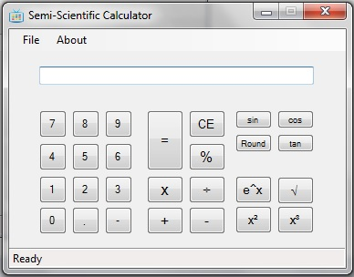

# Semi-Scientific Calculator
## Requires
- Visual Studio 2010
## License
- Apache License, Version 2.0
## Technologies
- Windows Form
## Topics
- Calculator Application
- semi-scientific
- C# calculator
## Updated
- 06/05/2014
## Description

RECOMMENDED FOR BEGINNERS in C#

&nbsp;

this program is the BASIC CALCULATOR plus with some function available on scientific Calculator (sin,cos,tan,x2,x3,sqrt,exp)

&nbsp;

this program can receive input of numeric 0-9, the dot operator (.) for decimal values, and negative sign (-); either from the button programmed inside&nbsp;the program itself, or via keyboard. Any invalid input (eg; A-Z) will
 not shown on the display, and &quot;throw&quot; an error statement in the status bar below.

&nbsp;

&nbsp;

THIS WEBSITE ASK FOR 1000 characters. While I am SPEECHLESS. because of that, i had to this BELOW. 
DONT WORRY. DOWNLOAD THE PROPER &quot;READABLE&quot; VERSION ABOVE.

&nbsp;

DONT FORGET TO RATE!!

&nbsp;

using System;using System.Collections.Generic;using System.ComponentModel;using System.Data;using System.Drawing;using System.Linq;using
 System.Text;using System.Windows.Forms;using Microsoft.WindowsAPICodePack.Shell; 
namespace SemiScientificCalc{&nbsp; &nbsp; public partial class SemiScientificCalc : Form &nbsp;//GlassForm&nbsp; &nbsp; {&nbsp; &nbsp; &nbsp; &nbsp; string sign;&nbsp; &nbsp; &nbsp;
 &nbsp; double num1, num2;&nbsp; &nbsp; &nbsp; &nbsp;&nbsp;&nbsp; &nbsp; &nbsp; &nbsp; public SemiScientificCalc()&nbsp; &nbsp; &nbsp; &nbsp; {&nbsp; &nbsp; &nbsp; &nbsp; &nbsp; &nbsp; InitializeComponent();&nbsp; &nbsp; &nbsp; &nbsp; // &nbsp; &nbsp;AeroGlassCompositionChanged
 &#43;= (source, args) =&gt; ExcludeControlFromAeroGlass(BackPanel);&nbsp; &nbsp; &nbsp; &nbsp; } 
&nbsp; &nbsp; &nbsp; &nbsp; private void returnReadyStatus()&nbsp; &nbsp; &nbsp; &nbsp; {&nbsp; &nbsp; &nbsp; &nbsp; &nbsp; &nbsp; StatusLabel.Text = &quot;Ready&quot;;&nbsp; &nbsp; &nbsp; &nbsp;
 } 
&nbsp; &nbsp; &nbsp; &nbsp; private void FileMenu_MouseHover(object sender, EventArgs e)&nbsp; &nbsp; &nbsp; &nbsp; {&nbsp; &nbsp; &nbsp; &nbsp; &nbsp; &nbsp; StatusLabel.Text = &quot;Select
 an action&quot;;&nbsp; &nbsp; &nbsp; &nbsp; } 
&nbsp; &nbsp; &nbsp; &nbsp; private void FileMenu_MouseLeave(object sender, EventArgs e)&nbsp; &nbsp; &nbsp; &nbsp; {&nbsp; &nbsp; &nbsp; &nbsp; &nbsp; &nbsp; returnReadyStatus();&nbsp;
 &nbsp; &nbsp; &nbsp; } 
&nbsp; &nbsp; &nbsp; &nbsp; private void FileExitMenu_MouseHover(object sender, EventArgs e)&nbsp; &nbsp; &nbsp; &nbsp; {&nbsp; &nbsp; &nbsp; &nbsp; &nbsp; &nbsp; StatusLabel.Text = &quot;Exit
 the program&quot;;&nbsp; &nbsp; &nbsp; &nbsp; } 
&nbsp; &nbsp; &nbsp; &nbsp; private void FileExitMenu_MouseLeave(object sender, EventArgs e)&nbsp; &nbsp; &nbsp; &nbsp; {&nbsp; &nbsp; &nbsp; &nbsp; &nbsp; &nbsp; returnReadyStatus();&nbsp;
 &nbsp; &nbsp; &nbsp; } 
&nbsp; &nbsp; &nbsp; &nbsp; private void AboutMenu_MouseHover(object sender, EventArgs e)&nbsp; &nbsp; &nbsp; &nbsp; {&nbsp; &nbsp; &nbsp; &nbsp; &nbsp; &nbsp; StatusLabel.Text = &quot;Select
 an action&quot;;&nbsp; &nbsp; &nbsp; &nbsp; } 
&nbsp; &nbsp; &nbsp; &nbsp; private void AboutMenu_MouseLeave(object sender, EventArgs e)&nbsp; &nbsp; &nbsp; &nbsp; {&nbsp; &nbsp; &nbsp; &nbsp; &nbsp; &nbsp; returnReadyStatus();&nbsp;
 &nbsp; &nbsp; &nbsp; } 
&nbsp; &nbsp; &nbsp; &nbsp; private void AboutCalcMenu_MouseHover(object sender, EventArgs e)&nbsp; &nbsp; &nbsp; &nbsp; {&nbsp; &nbsp; &nbsp; &nbsp; &nbsp; &nbsp; StatusLabel.Text =
 &quot;About the program&quot;;&nbsp; &nbsp; &nbsp; &nbsp; } 
&nbsp; &nbsp; &nbsp; &nbsp; private void AboutCalcMenu_MouseLeave(object sender, EventArgs e)&nbsp; &nbsp; &nbsp; &nbsp; {&nbsp; &nbsp; &nbsp; &nbsp; &nbsp; &nbsp; returnReadyStatus();&nbsp;
 &nbsp; &nbsp; &nbsp; } 
&nbsp; &nbsp; &nbsp; &nbsp; private void ClearCalc_MouseHover(object sender, EventArgs e)&nbsp; &nbsp; &nbsp; &nbsp; {&nbsp; &nbsp; &nbsp; &nbsp; &nbsp; &nbsp; StatusLabel.Text = &quot;Clear
 all calculation&quot;;&nbsp; &nbsp; &nbsp; &nbsp; } 
&nbsp; &nbsp; &nbsp; &nbsp; private void ClearCalc_MouseLeave(object sender, EventArgs e)&nbsp; &nbsp; &nbsp; &nbsp; {&nbsp; &nbsp; &nbsp; &nbsp; &nbsp; &nbsp; returnReadyStatus();&nbsp;
 &nbsp; &nbsp; &nbsp; } 
&nbsp; &nbsp; &nbsp; &nbsp; private void EqualCalc_MouseHover(object sender, EventArgs e)&nbsp; &nbsp; &nbsp; &nbsp; {&nbsp; &nbsp; &nbsp; &nbsp; &nbsp; &nbsp; StatusLabel.Text = &quot;Calculate&quot;;&nbsp;
 &nbsp; &nbsp; &nbsp; } 
&nbsp; &nbsp; &nbsp; &nbsp; private void EqualCalc_MouseLeave(object sender, EventArgs e)&nbsp; &nbsp; &nbsp; &nbsp; {&nbsp; &nbsp; &nbsp; &nbsp; &nbsp; &nbsp; returnReadyStatus();&nbsp;
 &nbsp; &nbsp; &nbsp; } 
&nbsp; &nbsp; &nbsp; &nbsp; private void AboutCalcMenu_Click(object sender, EventArgs e)&nbsp; &nbsp; &nbsp; &nbsp; {&nbsp; &nbsp; &nbsp; &nbsp; &nbsp; &nbsp; MessageBox.Show(&quot;Semi-Scientific
 Calculator v1.2\n(formerly known as Basic Calculator v1.1)\nby SQUILLACIUKM\n\n\t\t2014 AllWorldWeb&quot;);&nbsp; &nbsp; &nbsp; &nbsp; } 
&nbsp; &nbsp; &nbsp; &nbsp; private void FileExitMenu_Click(object sender, EventArgs e)&nbsp; &nbsp; &nbsp; &nbsp; {&nbsp; &nbsp; &nbsp; &nbsp; &nbsp; &nbsp; Application.Exit();&nbsp;
 &nbsp; &nbsp; &nbsp; } 
&nbsp; &nbsp; &nbsp; &nbsp; private void Form1_Load(object sender, EventArgs e)&nbsp; &nbsp; &nbsp; &nbsp; {&nbsp; &nbsp; &nbsp; &nbsp; &nbsp; &nbsp; no0.Click &#43;= new EventHandler(button_Click);&nbsp;
 &nbsp; &nbsp; &nbsp; &nbsp; &nbsp; no1.Click &#43;= new EventHandler(button_Click);&nbsp; &nbsp; &nbsp; &nbsp; &nbsp; &nbsp; no2.Click &#43;= new EventHandler(button_Click);&nbsp; &nbsp; &nbsp; &nbsp; &nbsp; &nbsp; no3.Click &#43;= new EventHandler(button_Click);&nbsp;
 &nbsp; &nbsp; &nbsp; &nbsp; &nbsp; no4.Click &#43;= new EventHandler(button_Click);&nbsp; &nbsp; &nbsp; &nbsp; &nbsp; &nbsp; no5.Click &#43;= new EventHandler(button_Click);&nbsp; &nbsp; &nbsp; &nbsp; &nbsp; &nbsp; no6.Click &#43;= new EventHandler(button_Click);&nbsp;
 &nbsp; &nbsp; &nbsp; &nbsp; &nbsp; no7.Click &#43;= new EventHandler(button_Click);&nbsp; &nbsp; &nbsp; &nbsp; &nbsp; &nbsp; no8.Click &#43;= new EventHandler(button_Click);&nbsp; &nbsp; &nbsp; &nbsp; &nbsp; &nbsp; no9.Click &#43;= new EventHandler(button_Click);&nbsp;
 &nbsp; &nbsp; &nbsp; &nbsp; &nbsp; DotOperator.Click &#43;= new EventHandler(button_Click);&nbsp; &nbsp; &nbsp; &nbsp; &nbsp; &nbsp; NegativeSign.Click &#43;= new EventHandler(button_Click);&nbsp; &nbsp; &nbsp; &nbsp; } 
&nbsp; &nbsp; &nbsp; &nbsp; private void button_Click(object sender, EventArgs e)&nbsp; &nbsp; &nbsp; &nbsp; {&nbsp; &nbsp; &nbsp; &nbsp; &nbsp; &nbsp; Button btn = (sender as Button);&nbsp;
 &nbsp; &nbsp; &nbsp; &nbsp; &nbsp; try&nbsp; &nbsp; &nbsp; &nbsp; &nbsp; &nbsp; {&nbsp; &nbsp; &nbsp; &nbsp; &nbsp; &nbsp; &nbsp; &nbsp; switch (btn.Text)&nbsp; &nbsp; &nbsp; &nbsp; &nbsp; &nbsp; &nbsp; &nbsp; {&nbsp; &nbsp; &nbsp; &nbsp; &nbsp; &nbsp; &nbsp;
 &nbsp; &nbsp; &nbsp; case &quot;0&quot;: DispBox.Text &#43;= &quot;0&quot;; break;&nbsp; &nbsp; &nbsp; &nbsp; &nbsp; &nbsp; &nbsp; &nbsp; &nbsp; &nbsp; case &quot;1&quot;: DispBox.Text &#43;= &quot;1&quot;; break;&nbsp; &nbsp; &nbsp; &nbsp; &nbsp; &nbsp; &nbsp; &nbsp; &nbsp; &nbsp; case &quot;2&quot;: DispBox.Text
 &#43;= &quot;2&quot;; break;&nbsp; &nbsp; &nbsp; &nbsp; &nbsp; &nbsp; &nbsp; &nbsp; &nbsp; &nbsp; case &quot;3&quot;: DispBox.Text &#43;= &quot;3&quot;; break;&nbsp; &nbsp; &nbsp; &nbsp; &nbsp; &nbsp; &nbsp; &nbsp; &nbsp; &nbsp; case &quot;4&quot;: DispBox.Text &#43;= &quot;4&quot;; break;&nbsp; &nbsp; &nbsp; &nbsp;
 &nbsp; &nbsp; &nbsp; &nbsp; &nbsp; &nbsp; case &quot;5&quot;: DispBox.Text &#43;= &quot;5&quot;; break;&nbsp; &nbsp; &nbsp; &nbsp; &nbsp; &nbsp; &nbsp; &nbsp; &nbsp; &nbsp; case &quot;6&quot;: DispBox.Text &#43;= &quot;6&quot;; break;&nbsp; &nbsp; &nbsp; &nbsp; &nbsp; &nbsp; &nbsp; &nbsp; &nbsp; &nbsp;
 case &quot;7&quot;: DispBox.Text &#43;= &quot;7&quot;; break;&nbsp; &nbsp; &nbsp; &nbsp; &nbsp; &nbsp; &nbsp; &nbsp; &nbsp; &nbsp; case &quot;8&quot;: DispBox.Text &#43;= &quot;8&quot;; break;&nbsp; &nbsp; &nbsp; &nbsp; &nbsp; &nbsp; &nbsp; &nbsp; &nbsp; &nbsp; case &quot;9&quot;: DispBox.Text &#43;= &quot;9&quot;; break;&nbsp;
 &nbsp; &nbsp; &nbsp; &nbsp; &nbsp; &nbsp; &nbsp; &nbsp; &nbsp; case &quot;.&quot;:&nbsp; &nbsp; &nbsp; &nbsp; &nbsp; &nbsp; &nbsp; &nbsp; &nbsp; &nbsp; &nbsp; &nbsp; if (!(DispBox.Text.Contains('.') || DispBox.Text.Contains(&quot;.&quot;)))&nbsp; &nbsp; &nbsp; &nbsp; &nbsp; &nbsp;
 &nbsp; &nbsp; &nbsp; &nbsp; &nbsp; &nbsp; { DispBox.Text &#43;= &quot;.&quot;; } break;&nbsp; &nbsp; &nbsp; &nbsp; &nbsp; &nbsp; &nbsp; &nbsp; &nbsp; &nbsp; case &quot;-&quot;:&nbsp; &nbsp; &nbsp; &nbsp; &nbsp; &nbsp; &nbsp; &nbsp; &nbsp; &nbsp; &nbsp; &nbsp; if (!(DispBox.Text.Contains('-')
 || DispBox.Text.Contains(&quot;-&quot;)))&nbsp; &nbsp; &nbsp; &nbsp; &nbsp; &nbsp; &nbsp; &nbsp; &nbsp; &nbsp; &nbsp; &nbsp; { DispBox.Text &#43;= &quot;-&quot;; } break;&nbsp; &nbsp; &nbsp; &nbsp; &nbsp; &nbsp; &nbsp; &nbsp; }&nbsp; &nbsp; &nbsp; &nbsp; &nbsp; &nbsp; }&nbsp; &nbsp;
 &nbsp; &nbsp; &nbsp; &nbsp; catch (Exception)&nbsp; &nbsp; &nbsp; &nbsp; &nbsp; &nbsp; { MessageBox.Show(&quot;Unexpected error occurs&quot;); }&nbsp; &nbsp; &nbsp; &nbsp; }&nbsp; &nbsp; &nbsp; &nbsp;&nbsp;&nbsp; &nbsp; &nbsp; &nbsp; private void DispBox_KeyPress(object
 sender, KeyPressEventArgs e)&nbsp; &nbsp; &nbsp; &nbsp; {&nbsp; &nbsp; &nbsp; &nbsp; &nbsp; &nbsp; switch (e.KeyChar)&nbsp; &nbsp; &nbsp; &nbsp; &nbsp; &nbsp; {&nbsp; &nbsp; &nbsp; &nbsp; &nbsp; &nbsp; &nbsp; &nbsp; case '1':&nbsp; &nbsp; &nbsp; &nbsp; &nbsp;
 &nbsp; &nbsp; &nbsp; case '2':&nbsp; &nbsp; &nbsp; &nbsp; &nbsp; &nbsp; &nbsp; &nbsp; case '3':&nbsp; &nbsp; &nbsp; &nbsp; &nbsp; &nbsp; &nbsp; &nbsp; case '4':&nbsp; &nbsp; &nbsp; &nbsp; &nbsp; &nbsp; &nbsp; &nbsp; case '5':&nbsp; &nbsp; &nbsp; &nbsp; &nbsp;
 &nbsp; &nbsp; &nbsp; case '6':&nbsp; &nbsp; &nbsp; &nbsp; &nbsp; &nbsp; &nbsp; &nbsp; case '7':&nbsp; &nbsp; &nbsp; &nbsp; &nbsp; &nbsp; &nbsp; &nbsp; case '8':&nbsp; &nbsp; &nbsp; &nbsp; &nbsp; &nbsp; &nbsp; &nbsp; case '9': break;&nbsp; &nbsp; &nbsp; &nbsp;
 &nbsp; &nbsp; &nbsp; &nbsp; case '-':&nbsp; &nbsp; &nbsp; &nbsp; &nbsp; &nbsp; &nbsp; &nbsp; &nbsp; &nbsp; &nbsp; &nbsp; if (DispBox.Text.Contains('-') || DispBox.Text.Contains(&quot;-&quot;))&nbsp; &nbsp; &nbsp; &nbsp; &nbsp; &nbsp; &nbsp; &nbsp; &nbsp; &nbsp; &nbsp;
 &nbsp; {&nbsp; &nbsp; &nbsp; &nbsp; &nbsp; &nbsp; &nbsp; &nbsp; &nbsp; &nbsp; &nbsp; &nbsp; &nbsp; &nbsp; e.Handled = true;&nbsp; &nbsp; &nbsp; &nbsp; &nbsp; &nbsp; &nbsp; &nbsp; &nbsp; &nbsp; &nbsp; &nbsp; &nbsp; &nbsp; StatusLabel.Text = &quot;a number cannot
 have more than one negative sign&quot;;&nbsp; &nbsp; &nbsp; &nbsp; &nbsp; &nbsp; &nbsp; &nbsp; &nbsp; &nbsp; &nbsp; &nbsp; }&nbsp; &nbsp; &nbsp; &nbsp; &nbsp; &nbsp; &nbsp; &nbsp; &nbsp; &nbsp; &nbsp; &nbsp; break;&nbsp; &nbsp; &nbsp; &nbsp; &nbsp; &nbsp; &nbsp;
 &nbsp; case '.':&nbsp; &nbsp; &nbsp; &nbsp; &nbsp; &nbsp; &nbsp; &nbsp; &nbsp; &nbsp; &nbsp; &nbsp; if (DispBox.Text.Contains('.') || DispBox.Text.Contains(&quot;.&quot;))&nbsp; &nbsp; &nbsp; &nbsp; &nbsp; &nbsp; &nbsp; &nbsp; &nbsp; &nbsp; &nbsp; &nbsp; {&nbsp;&nbsp;
 &nbsp; &nbsp; &nbsp; &nbsp; &nbsp; &nbsp; &nbsp; &nbsp; &nbsp; &nbsp; &nbsp; &nbsp; &nbsp; e.Handled = true;&nbsp; &nbsp; &nbsp; &nbsp; &nbsp; &nbsp; &nbsp; &nbsp; &nbsp; &nbsp; &nbsp; &nbsp; &nbsp; &nbsp; StatusLabel.Text = &quot;a number cannot have more than
 one dot operator&quot;;&nbsp; &nbsp; &nbsp; &nbsp; &nbsp; &nbsp; &nbsp; &nbsp; &nbsp; &nbsp; &nbsp; &nbsp; }&nbsp; &nbsp; &nbsp; &nbsp; &nbsp; &nbsp; &nbsp; &nbsp; &nbsp; &nbsp; &nbsp; &nbsp; break;&nbsp; &nbsp; &nbsp; &nbsp; &nbsp; &nbsp; &nbsp; &nbsp; default
 :&nbsp; &nbsp; &nbsp; &nbsp; &nbsp; &nbsp; &nbsp; &nbsp; &nbsp; &nbsp; &nbsp; &nbsp; {&nbsp; &nbsp; &nbsp; &nbsp; &nbsp; &nbsp; &nbsp; &nbsp; &nbsp; &nbsp; &nbsp; &nbsp; &nbsp; &nbsp; e.Handled = true;&nbsp; &nbsp; &nbsp; &nbsp; &nbsp; &nbsp; &nbsp; &nbsp;
 &nbsp; &nbsp; &nbsp; &nbsp; &nbsp; &nbsp; StatusLabel.Text = string.Format(&quot;input {0} is invalid&quot;, e.KeyChar);&nbsp; &nbsp; &nbsp; &nbsp; &nbsp; &nbsp; &nbsp; &nbsp; &nbsp; &nbsp; &nbsp; &nbsp; }&nbsp; &nbsp; &nbsp; &nbsp; &nbsp; &nbsp; &nbsp; &nbsp; &nbsp;
 &nbsp; &nbsp; &nbsp; break;&nbsp; &nbsp; &nbsp; &nbsp; &nbsp; &nbsp; }&nbsp; &nbsp; &nbsp; &nbsp; } 
&nbsp; &nbsp; &nbsp; &nbsp; private void parseNum1andEmptyDispBox()&nbsp; &nbsp; &nbsp; &nbsp; {&nbsp; &nbsp; &nbsp; &nbsp; &nbsp; &nbsp; num1 = double.Parse(DispBox.Text);&nbsp; &nbsp;
 &nbsp; &nbsp; &nbsp; &nbsp; DispBox.Text = string.Empty;&nbsp; &nbsp; &nbsp; &nbsp; } 
&nbsp; &nbsp; &nbsp; &nbsp; private void Adds_Click(object sender, EventArgs e)&nbsp; &nbsp; &nbsp; &nbsp; {&nbsp; &nbsp; &nbsp; &nbsp; &nbsp; &nbsp; parseNum1andEmptyDispBox();&nbsp;
 &nbsp; &nbsp; &nbsp; &nbsp; &nbsp; sign = &quot;&#43;&quot;;&nbsp; &nbsp; &nbsp; &nbsp; } 
&nbsp; &nbsp; &nbsp; &nbsp; private void Subs_Click(object sender, EventArgs e)&nbsp; &nbsp; &nbsp; &nbsp; {&nbsp; &nbsp; &nbsp; &nbsp; &nbsp; &nbsp; parseNum1andEmptyDispBox();&nbsp;
 &nbsp; &nbsp; &nbsp; &nbsp; &nbsp; sign = &quot;-&quot;;&nbsp; &nbsp; &nbsp; &nbsp; } 
&nbsp; &nbsp; &nbsp; &nbsp; private void Multiples_Click(object sender, EventArgs e)&nbsp; &nbsp; &nbsp; &nbsp; {&nbsp; &nbsp; &nbsp; &nbsp; &nbsp; &nbsp; parseNum1andEmptyDispBox();&nbsp;
 &nbsp; &nbsp; &nbsp; &nbsp; &nbsp; sign = &quot;*&quot;;&nbsp; &nbsp; &nbsp; &nbsp; } 
&nbsp; &nbsp; &nbsp; &nbsp; private void Divs_Click(object sender, EventArgs e)&nbsp; &nbsp; &nbsp; &nbsp; {&nbsp; &nbsp; &nbsp; &nbsp; &nbsp; &nbsp; parseNum1andEmptyDispBox();&nbsp;
 &nbsp; &nbsp; &nbsp; &nbsp; &nbsp; sign = &quot;/&quot;;&nbsp; &nbsp; &nbsp; &nbsp; } 
&nbsp; &nbsp; &nbsp; &nbsp; private void dispResult()&nbsp; &nbsp; &nbsp; &nbsp; {&nbsp; &nbsp; &nbsp; &nbsp; &nbsp; &nbsp; string num1Result = num1.ToString();&nbsp; &nbsp; &nbsp; &nbsp;
 &nbsp; &nbsp; if (num1Result.Contains('.') || num1Result.Contains(&quot;.&quot;))&nbsp; &nbsp; &nbsp; &nbsp; &nbsp; &nbsp; { DispBox.Text = string.Format(&quot;{0:N3}&quot;, num1); }&nbsp; &nbsp; &nbsp; &nbsp; &nbsp; &nbsp; else&nbsp; &nbsp; &nbsp; &nbsp; &nbsp; &nbsp; { DispBox.Text
 = string.Format(&quot;{0:N0}&quot;, num1); }&nbsp; &nbsp; &nbsp; &nbsp; } 
&nbsp; &nbsp; &nbsp; &nbsp; private void EqualCalc_Click(object sender, EventArgs e)&nbsp; &nbsp; &nbsp; &nbsp; {&nbsp; &nbsp; &nbsp; &nbsp; &nbsp; &nbsp; num2 = double.Parse(DispBox.Text); 
&nbsp; &nbsp; &nbsp; &nbsp; &nbsp; &nbsp; switch (sign)&nbsp; &nbsp; &nbsp; &nbsp; &nbsp; &nbsp; {&nbsp; &nbsp; &nbsp; &nbsp; &nbsp; &nbsp; &nbsp; &nbsp; case &quot;&#43;&quot;: num1 &#43;= num2; dispResult();
 break;&nbsp; &nbsp; &nbsp; &nbsp; &nbsp; &nbsp; &nbsp; &nbsp; case &quot;-&quot;: num1 -= num2; dispResult(); break;&nbsp; &nbsp; &nbsp; &nbsp; &nbsp; &nbsp; &nbsp; &nbsp; case &quot;*&quot;: num1 *= num2; dispResult(); break;&nbsp; &nbsp; &nbsp; &nbsp; &nbsp; &nbsp; &nbsp; &nbsp;
 case &quot;/&quot;:&nbsp; &nbsp; &nbsp; &nbsp; &nbsp; &nbsp; &nbsp; &nbsp; &nbsp; &nbsp; &nbsp; &nbsp; &nbsp; &nbsp; if (num2 != 0)&nbsp; &nbsp; &nbsp; &nbsp; &nbsp; &nbsp; &nbsp; &nbsp; &nbsp; &nbsp; &nbsp; &nbsp; &nbsp; &nbsp; { num1 /= num2; dispResult(); }&nbsp;
 &nbsp; &nbsp; &nbsp; &nbsp; &nbsp; &nbsp; &nbsp; &nbsp; &nbsp; &nbsp; &nbsp; &nbsp; &nbsp; else&nbsp; &nbsp; &nbsp; &nbsp; &nbsp; &nbsp; &nbsp; &nbsp; &nbsp; &nbsp; &nbsp; &nbsp; &nbsp; &nbsp; { MessageBox.Show(&quot;Math error&quot;); }&nbsp; &nbsp; &nbsp; &nbsp; &nbsp;
 &nbsp; &nbsp; &nbsp; &nbsp; &nbsp; &nbsp; &nbsp; &nbsp; &nbsp; break;&nbsp; &nbsp; &nbsp; &nbsp; &nbsp; &nbsp; }&nbsp; &nbsp; &nbsp; &nbsp; } 
&nbsp; &nbsp; &nbsp; &nbsp;&nbsp; 
&nbsp; &nbsp; &nbsp; &nbsp; private void ClearCalc_Click(object sender, EventArgs e)&nbsp; &nbsp; &nbsp; &nbsp; {&nbsp; &nbsp; &nbsp; &nbsp; &nbsp; &nbsp; num1 = 0;&nbsp; &nbsp; &nbsp;
 &nbsp; &nbsp; &nbsp; num2 = 0;&nbsp; &nbsp; &nbsp; &nbsp; &nbsp; &nbsp; sign = string.Empty;&nbsp; &nbsp; &nbsp; &nbsp; &nbsp; &nbsp; DispBox.Text = string.Empty;&nbsp; &nbsp; &nbsp; &nbsp; &nbsp; &nbsp; MessageBox.Show(&quot;Cleared&quot;);&nbsp; &nbsp; &nbsp; &nbsp;
 } 
&nbsp; &nbsp; &nbsp; &nbsp; private void Percentages_Click(object sender, EventArgs e)&nbsp; &nbsp; &nbsp; &nbsp; {&nbsp; &nbsp; &nbsp; &nbsp; &nbsp; &nbsp; if (DispBox.Text.Contains('.')
 || DispBox.Text.Contains(&quot;.&quot;))&nbsp; &nbsp; &nbsp; &nbsp; &nbsp; &nbsp; { DispBox.Text = string.Format(&quot;{0:N3}%&quot;, num1 * 100); }&nbsp; &nbsp; &nbsp; &nbsp; &nbsp; &nbsp; else&nbsp; &nbsp; &nbsp; &nbsp; &nbsp; &nbsp; { DispBox.Text = string.Format(&quot;{0:N0}%&quot;,
 num1 * 100); }&nbsp; &nbsp; &nbsp; &nbsp; } 
&nbsp; &nbsp; &nbsp; &nbsp; private void SquareValue_Click(object sender, EventArgs e)&nbsp; &nbsp; &nbsp; &nbsp; {&nbsp; &nbsp; &nbsp; &nbsp; &nbsp; &nbsp; num1 *= num1;&nbsp; &nbsp;
 &nbsp; &nbsp; &nbsp; &nbsp; dispResult();&nbsp; &nbsp; &nbsp; &nbsp; } 
&nbsp; &nbsp; &nbsp; &nbsp; private void CubeValue_Click(object sender, EventArgs e)&nbsp; &nbsp; &nbsp; &nbsp; {&nbsp; &nbsp; &nbsp; &nbsp; &nbsp; &nbsp; num1 = (num1 * num1 * num1);&nbsp;
 &nbsp; &nbsp; &nbsp; &nbsp; &nbsp; dispResult();&nbsp; &nbsp; &nbsp; &nbsp; } 
&nbsp; &nbsp; &nbsp; &nbsp; private void SquareRoot_Click(object sender, EventArgs e)&nbsp; &nbsp; &nbsp; &nbsp; {&nbsp; &nbsp; &nbsp; &nbsp; &nbsp; &nbsp; num1 = Math.Sqrt(num1);&nbsp;
 &nbsp; &nbsp; &nbsp; &nbsp; &nbsp; dispResult();&nbsp; &nbsp; &nbsp; &nbsp; } 
&nbsp; &nbsp; &nbsp; &nbsp; private void SinValue_Click(object sender, EventArgs e)&nbsp; &nbsp; &nbsp; &nbsp; {&nbsp; &nbsp; &nbsp; &nbsp; &nbsp; &nbsp; num1 = Math.Sin(num1);&nbsp;
 &nbsp; &nbsp; &nbsp; &nbsp; &nbsp; dispResult();&nbsp; &nbsp; &nbsp; &nbsp; } 
&nbsp; &nbsp; &nbsp; &nbsp; private void CosValue_Click(object sender, EventArgs e)&nbsp; &nbsp; &nbsp; &nbsp; {&nbsp; &nbsp; &nbsp; &nbsp; &nbsp; &nbsp; num1 = Math.Cos(num1);&nbsp;
 &nbsp; &nbsp; &nbsp; &nbsp; &nbsp; dispResult();&nbsp; &nbsp; &nbsp; &nbsp; } 
&nbsp; &nbsp; &nbsp; &nbsp; private void TanValue_Click(object sender, EventArgs e)&nbsp; &nbsp; &nbsp; &nbsp; {&nbsp; &nbsp; &nbsp; &nbsp; &nbsp; &nbsp; num1 = Math.Tan(num1);&nbsp;
 &nbsp; &nbsp; &nbsp; &nbsp; &nbsp; dispResult();&nbsp; &nbsp; &nbsp; &nbsp; } 
&nbsp; &nbsp; &nbsp; &nbsp; private void Exponentials_Click(object sender, EventArgs e)&nbsp; &nbsp; &nbsp; &nbsp; {&nbsp; &nbsp; &nbsp; &nbsp; &nbsp; &nbsp; num1 = Math.Exp(num1);&nbsp;
 &nbsp; &nbsp; &nbsp; &nbsp; &nbsp; dispResult();&nbsp; &nbsp; &nbsp; &nbsp; } 
&nbsp; &nbsp; &nbsp; &nbsp; private void RoundingValue_Click(object sender, EventArgs e)&nbsp; &nbsp; &nbsp; &nbsp; {&nbsp; &nbsp; &nbsp; &nbsp; &nbsp; &nbsp; num1 = Math.Round(num1);&nbsp;
 &nbsp; &nbsp; &nbsp; &nbsp; &nbsp; dispResult();&nbsp; &nbsp; &nbsp; &nbsp; } 
 
&nbsp; &nbsp; }} 

