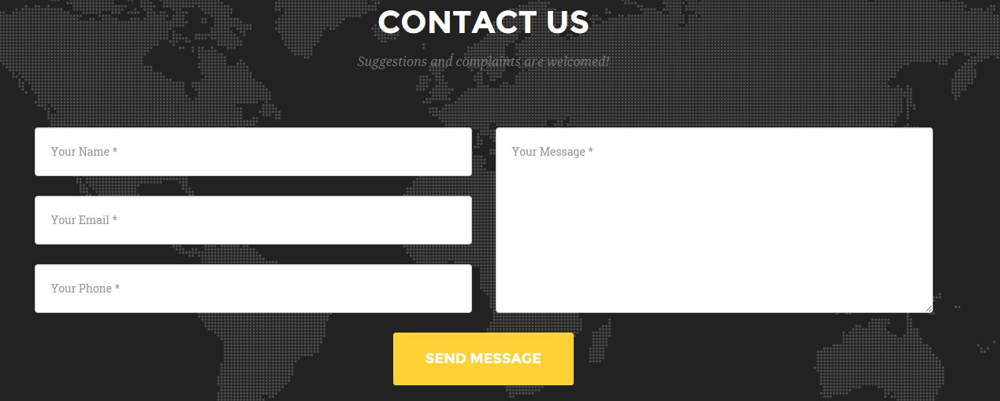

# Send an email using asp.net c# code
## Requires
- 
## License
- MIT
## Technologies
- C#
- ASP.NET
- ASP.NET MVC 4
- Visual Studio 2013
## Topics
- Send Email
- ASP.NET MVC
## Updated
- 10/30/2015
## Description

<h1>Introduction</h1>

<em>Most of the times we have seen suggestion/complaint form in the footer of many websites but what if you want the same thing in your project?</em>

Then i am here to guide you. As far as i know there are two methods to implement this:

<ol>
<li>Make a database and save the form details in that so when the site admin logins, he/she can see them.
</li><li>Generate an email from the code so you can get an email and can retrieve that on the go.
</li></ol>

I will explain the second method here. This method will simply guide you how to send an email and then you can use this in any way you like.

<h1>Building the Sample</h1>

First of all i created a form in html view of a mvc project which looks like this:

 

&nbsp;

HTML for this form is:

HTML

Edit|Remove

html
<pre class="hidden">@using (Html.BeginForm(&quot;email&quot;, &quot;Home&quot;, FormMethod.Post))
                            {
        &lt;div class=&quot;row&quot;&gt;
            &lt;div class=&quot;col-lg-12&quot;&gt;
                &lt;form name=&quot;sentMessage&quot; id=&quot;contactForm&quot; novalidate&gt;
                    &lt;div class=&quot;row&quot;&gt;
                        &lt;div class=&quot;col-md-6&quot;&gt;
                            &lt;div class=&quot;form-group&quot;&gt;
                                &lt;input type=&quot;text&quot; name=&quot;sname&quot; class=&quot;form-control&quot; placeholder=&quot;Your Name *&quot; id=&quot;name&quot; required data-validation-required-message=&quot;Please enter your name.&quot;&gt;
                                &lt;p class=&quot;help-block text-danger&quot;&gt;&lt;/p&gt;
                            &lt;/div&gt;
                            &lt;div class=&quot;form-group&quot;&gt;
                                &lt;input type=&quot;email&quot; name=&quot;semail&quot;class=&quot;form-control&quot; placeholder=&quot;Your Email *&quot; id=&quot;email&quot; required data-validation-required-message=&quot;Please enter your email address.&quot;&gt;
                                &lt;p class=&quot;help-block text-danger&quot;&gt;&lt;/p&gt;
                            &lt;/div&gt;
                            &lt;div class=&quot;form-group&quot;&gt;
                                &lt;input type=&quot;tel&quot; name=&quot;sphone&quot;class=&quot;form-control&quot; placeholder=&quot;Your Phone *&quot; id=&quot;phone&quot; required data-validation-required-message=&quot;Please enter your phone number.&quot;&gt;
                                &lt;p class=&quot;help-block text-danger&quot;&gt;&lt;/p&gt;
                            &lt;/div&gt;
                        &lt;/div&gt;
                        &lt;div class=&quot;col-md-6&quot;&gt;
                            &lt;div class=&quot;form-group&quot;&gt;
                                &lt;textarea class=&quot;form-control&quot; name=&quot;smessage&quot; placeholder=&quot;Your Message *&quot; id=&quot;message&quot; required data-validation-required-message=&quot;Please enter a message.&quot;&gt;&lt;/textarea&gt;
                                &lt;p class=&quot;help-block text-danger&quot;&gt;&lt;/p&gt;
                            &lt;/div&gt;
                        &lt;/div&gt;
                        &lt;div class=&quot;clearfix&quot;&gt;&lt;/div&gt;
                        &lt;div class=&quot;col-lg-12 text-center&quot;&gt;
                            &lt;div id=&quot;success&quot;&gt;&lt;/div&gt;
                           
                            &lt;button type=&quot;submit&quot; class=&quot;btn btn-xl&quot; onclick=&quot;this.form.submit();&quot;&gt;Send Message&lt;/button&gt;
                            
                        &lt;/div&gt;
                    &lt;/div&gt;
                &lt;/form&gt;
            &lt;/div&gt;
        &lt;/div&gt;
}</pre>

<pre class="html">@using&nbsp;(Html.BeginForm(&quot;email&quot;,&nbsp;&quot;Home&quot;,&nbsp;FormMethod.Post))&nbsp;
&nbsp;&nbsp;&nbsp;&nbsp;&nbsp;&nbsp;&nbsp;&nbsp;&nbsp;&nbsp;&nbsp;&nbsp;&nbsp;&nbsp;&nbsp;&nbsp;&nbsp;&nbsp;&nbsp;&nbsp;&nbsp;&nbsp;&nbsp;&nbsp;&nbsp;&nbsp;&nbsp;&nbsp;{&nbsp;
&nbsp;&nbsp;&nbsp;&nbsp;&nbsp;&nbsp;&nbsp;&nbsp;&lt;div&nbsp;class=&quot;row&quot;&gt;&nbsp;
&nbsp;&nbsp;&nbsp;&nbsp;&nbsp;&nbsp;&nbsp;&nbsp;&nbsp;&nbsp;&nbsp;&nbsp;&lt;div&nbsp;class=&quot;col-lg-12&quot;&gt;&nbsp;
&nbsp;&nbsp;&nbsp;&nbsp;&nbsp;&nbsp;&nbsp;&nbsp;&nbsp;&nbsp;&nbsp;&nbsp;&nbsp;&nbsp;&nbsp;&nbsp;&lt;form&nbsp;name=&quot;sentMessage&quot;&nbsp;id=&quot;contactForm&quot;&nbsp;novalidate&gt;&nbsp;
&nbsp;&nbsp;&nbsp;&nbsp;&nbsp;&nbsp;&nbsp;&nbsp;&nbsp;&nbsp;&nbsp;&nbsp;&nbsp;&nbsp;&nbsp;&nbsp;&nbsp;&nbsp;&nbsp;&nbsp;&lt;div&nbsp;class=&quot;row&quot;&gt;&nbsp;
&nbsp;&nbsp;&nbsp;&nbsp;&nbsp;&nbsp;&nbsp;&nbsp;&nbsp;&nbsp;&nbsp;&nbsp;&nbsp;&nbsp;&nbsp;&nbsp;&nbsp;&nbsp;&nbsp;&nbsp;&nbsp;&nbsp;&nbsp;&nbsp;&lt;div&nbsp;class=&quot;col-md-6&quot;&gt;&nbsp;
&nbsp;&nbsp;&nbsp;&nbsp;&nbsp;&nbsp;&nbsp;&nbsp;&nbsp;&nbsp;&nbsp;&nbsp;&nbsp;&nbsp;&nbsp;&nbsp;&nbsp;&nbsp;&nbsp;&nbsp;&nbsp;&nbsp;&nbsp;&nbsp;&nbsp;&nbsp;&nbsp;&nbsp;&lt;div&nbsp;class=&quot;form-group&quot;&gt;&nbsp;
&nbsp;&nbsp;&nbsp;&nbsp;&nbsp;&nbsp;&nbsp;&nbsp;&nbsp;&nbsp;&nbsp;&nbsp;&nbsp;&nbsp;&nbsp;&nbsp;&nbsp;&nbsp;&nbsp;&nbsp;&nbsp;&nbsp;&nbsp;&nbsp;&nbsp;&nbsp;&nbsp;&nbsp;&nbsp;&nbsp;&nbsp;&nbsp;&lt;input&nbsp;type=&quot;text&quot;&nbsp;name=&quot;sname&quot;&nbsp;class=&quot;form-control&quot;&nbsp;placeholder=&quot;Your&nbsp;Name&nbsp;*&quot;&nbsp;id=&quot;name&quot;&nbsp;required&nbsp;data-validation-required-message=&quot;Please&nbsp;enter&nbsp;your&nbsp;name.&quot;&gt;&nbsp;
&nbsp;&nbsp;&nbsp;&nbsp;&nbsp;&nbsp;&nbsp;&nbsp;&nbsp;&nbsp;&nbsp;&nbsp;&nbsp;&nbsp;&nbsp;&nbsp;&nbsp;&nbsp;&nbsp;&nbsp;&nbsp;&nbsp;&nbsp;&nbsp;&nbsp;&nbsp;&nbsp;&nbsp;&nbsp;&nbsp;&nbsp;&nbsp;&lt;p&nbsp;class=&quot;help-block&nbsp;text-danger&quot;&gt;&lt;/p&gt;&nbsp;
&nbsp;&nbsp;&nbsp;&nbsp;&nbsp;&nbsp;&nbsp;&nbsp;&nbsp;&nbsp;&nbsp;&nbsp;&nbsp;&nbsp;&nbsp;&nbsp;&nbsp;&nbsp;&nbsp;&nbsp;&nbsp;&nbsp;&nbsp;&nbsp;&nbsp;&nbsp;&nbsp;&nbsp;&lt;/div&gt;&nbsp;
&nbsp;&nbsp;&nbsp;&nbsp;&nbsp;&nbsp;&nbsp;&nbsp;&nbsp;&nbsp;&nbsp;&nbsp;&nbsp;&nbsp;&nbsp;&nbsp;&nbsp;&nbsp;&nbsp;&nbsp;&nbsp;&nbsp;&nbsp;&nbsp;&nbsp;&nbsp;&nbsp;&nbsp;&lt;div&nbsp;class=&quot;form-group&quot;&gt;&nbsp;
&nbsp;&nbsp;&nbsp;&nbsp;&nbsp;&nbsp;&nbsp;&nbsp;&nbsp;&nbsp;&nbsp;&nbsp;&nbsp;&nbsp;&nbsp;&nbsp;&nbsp;&nbsp;&nbsp;&nbsp;&nbsp;&nbsp;&nbsp;&nbsp;&nbsp;&nbsp;&nbsp;&nbsp;&nbsp;&nbsp;&nbsp;&nbsp;&lt;input&nbsp;type=&quot;email&quot;&nbsp;name=&quot;semail&quot;class=&quot;form-control&quot;&nbsp;placeholder=&quot;Your&nbsp;Email&nbsp;*&quot;&nbsp;id=&quot;email&quot;&nbsp;required&nbsp;data-validation-required-message=&quot;Please&nbsp;enter&nbsp;your&nbsp;email&nbsp;address.&quot;&gt;&nbsp;
&nbsp;&nbsp;&nbsp;&nbsp;&nbsp;&nbsp;&nbsp;&nbsp;&nbsp;&nbsp;&nbsp;&nbsp;&nbsp;&nbsp;&nbsp;&nbsp;&nbsp;&nbsp;&nbsp;&nbsp;&nbsp;&nbsp;&nbsp;&nbsp;&nbsp;&nbsp;&nbsp;&nbsp;&nbsp;&nbsp;&nbsp;&nbsp;&lt;p&nbsp;class=&quot;help-block&nbsp;text-danger&quot;&gt;&lt;/p&gt;&nbsp;
&nbsp;&nbsp;&nbsp;&nbsp;&nbsp;&nbsp;&nbsp;&nbsp;&nbsp;&nbsp;&nbsp;&nbsp;&nbsp;&nbsp;&nbsp;&nbsp;&nbsp;&nbsp;&nbsp;&nbsp;&nbsp;&nbsp;&nbsp;&nbsp;&nbsp;&nbsp;&nbsp;&nbsp;&lt;/div&gt;&nbsp;
&nbsp;&nbsp;&nbsp;&nbsp;&nbsp;&nbsp;&nbsp;&nbsp;&nbsp;&nbsp;&nbsp;&nbsp;&nbsp;&nbsp;&nbsp;&nbsp;&nbsp;&nbsp;&nbsp;&nbsp;&nbsp;&nbsp;&nbsp;&nbsp;&nbsp;&nbsp;&nbsp;&nbsp;&lt;div&nbsp;class=&quot;form-group&quot;&gt;&nbsp;
&nbsp;&nbsp;&nbsp;&nbsp;&nbsp;&nbsp;&nbsp;&nbsp;&nbsp;&nbsp;&nbsp;&nbsp;&nbsp;&nbsp;&nbsp;&nbsp;&nbsp;&nbsp;&nbsp;&nbsp;&nbsp;&nbsp;&nbsp;&nbsp;&nbsp;&nbsp;&nbsp;&nbsp;&nbsp;&nbsp;&nbsp;&nbsp;&lt;input&nbsp;type=&quot;tel&quot;&nbsp;name=&quot;sphone&quot;class=&quot;form-control&quot;&nbsp;placeholder=&quot;Your&nbsp;Phone&nbsp;*&quot;&nbsp;id=&quot;phone&quot;&nbsp;required&nbsp;data-validation-required-message=&quot;Please&nbsp;enter&nbsp;your&nbsp;phone&nbsp;number.&quot;&gt;&nbsp;
&nbsp;&nbsp;&nbsp;&nbsp;&nbsp;&nbsp;&nbsp;&nbsp;&nbsp;&nbsp;&nbsp;&nbsp;&nbsp;&nbsp;&nbsp;&nbsp;&nbsp;&nbsp;&nbsp;&nbsp;&nbsp;&nbsp;&nbsp;&nbsp;&nbsp;&nbsp;&nbsp;&nbsp;&nbsp;&nbsp;&nbsp;&nbsp;&lt;p&nbsp;class=&quot;help-block&nbsp;text-danger&quot;&gt;&lt;/p&gt;&nbsp;
&nbsp;&nbsp;&nbsp;&nbsp;&nbsp;&nbsp;&nbsp;&nbsp;&nbsp;&nbsp;&nbsp;&nbsp;&nbsp;&nbsp;&nbsp;&nbsp;&nbsp;&nbsp;&nbsp;&nbsp;&nbsp;&nbsp;&nbsp;&nbsp;&nbsp;&nbsp;&nbsp;&nbsp;&lt;/div&gt;&nbsp;
&nbsp;&nbsp;&nbsp;&nbsp;&nbsp;&nbsp;&nbsp;&nbsp;&nbsp;&nbsp;&nbsp;&nbsp;&nbsp;&nbsp;&nbsp;&nbsp;&nbsp;&nbsp;&nbsp;&nbsp;&nbsp;&nbsp;&nbsp;&nbsp;&lt;/div&gt;&nbsp;
&nbsp;&nbsp;&nbsp;&nbsp;&nbsp;&nbsp;&nbsp;&nbsp;&nbsp;&nbsp;&nbsp;&nbsp;&nbsp;&nbsp;&nbsp;&nbsp;&nbsp;&nbsp;&nbsp;&nbsp;&nbsp;&nbsp;&nbsp;&nbsp;&lt;div&nbsp;class=&quot;col-md-6&quot;&gt;&nbsp;
&nbsp;&nbsp;&nbsp;&nbsp;&nbsp;&nbsp;&nbsp;&nbsp;&nbsp;&nbsp;&nbsp;&nbsp;&nbsp;&nbsp;&nbsp;&nbsp;&nbsp;&nbsp;&nbsp;&nbsp;&nbsp;&nbsp;&nbsp;&nbsp;&nbsp;&nbsp;&nbsp;&nbsp;&lt;div&nbsp;class=&quot;form-group&quot;&gt;&nbsp;
&nbsp;&nbsp;&nbsp;&nbsp;&nbsp;&nbsp;&nbsp;&nbsp;&nbsp;&nbsp;&nbsp;&nbsp;&nbsp;&nbsp;&nbsp;&nbsp;&nbsp;&nbsp;&nbsp;&nbsp;&nbsp;&nbsp;&nbsp;&nbsp;&nbsp;&nbsp;&nbsp;&nbsp;&nbsp;&nbsp;&nbsp;&nbsp;&lt;textarea&nbsp;class=&quot;form-control&quot;&nbsp;name=&quot;smessage&quot;&nbsp;placeholder=&quot;Your&nbsp;Message&nbsp;*&quot;&nbsp;id=&quot;message&quot;&nbsp;required&nbsp;data-validation-required-message=&quot;Please&nbsp;enter&nbsp;a&nbsp;message.&quot;&gt;&lt;/textarea&gt;&nbsp;
&nbsp;&nbsp;&nbsp;&nbsp;&nbsp;&nbsp;&nbsp;&nbsp;&nbsp;&nbsp;&nbsp;&nbsp;&nbsp;&nbsp;&nbsp;&nbsp;&nbsp;&nbsp;&nbsp;&nbsp;&nbsp;&nbsp;&nbsp;&nbsp;&nbsp;&nbsp;&nbsp;&nbsp;&nbsp;&nbsp;&nbsp;&nbsp;&lt;p&nbsp;class=&quot;help-block&nbsp;text-danger&quot;&gt;&lt;/p&gt;&nbsp;
&nbsp;&nbsp;&nbsp;&nbsp;&nbsp;&nbsp;&nbsp;&nbsp;&nbsp;&nbsp;&nbsp;&nbsp;&nbsp;&nbsp;&nbsp;&nbsp;&nbsp;&nbsp;&nbsp;&nbsp;&nbsp;&nbsp;&nbsp;&nbsp;&nbsp;&nbsp;&nbsp;&nbsp;&lt;/div&gt;&nbsp;
&nbsp;&nbsp;&nbsp;&nbsp;&nbsp;&nbsp;&nbsp;&nbsp;&nbsp;&nbsp;&nbsp;&nbsp;&nbsp;&nbsp;&nbsp;&nbsp;&nbsp;&nbsp;&nbsp;&nbsp;&nbsp;&nbsp;&nbsp;&nbsp;&lt;/div&gt;&nbsp;
&nbsp;&nbsp;&nbsp;&nbsp;&nbsp;&nbsp;&nbsp;&nbsp;&nbsp;&nbsp;&nbsp;&nbsp;&nbsp;&nbsp;&nbsp;&nbsp;&nbsp;&nbsp;&nbsp;&nbsp;&nbsp;&nbsp;&nbsp;&nbsp;&lt;div&nbsp;class=&quot;clearfix&quot;&gt;&lt;/div&gt;&nbsp;
&nbsp;&nbsp;&nbsp;&nbsp;&nbsp;&nbsp;&nbsp;&nbsp;&nbsp;&nbsp;&nbsp;&nbsp;&nbsp;&nbsp;&nbsp;&nbsp;&nbsp;&nbsp;&nbsp;&nbsp;&nbsp;&nbsp;&nbsp;&nbsp;&lt;div&nbsp;class=&quot;col-lg-12&nbsp;text-center&quot;&gt;&nbsp;
&nbsp;&nbsp;&nbsp;&nbsp;&nbsp;&nbsp;&nbsp;&nbsp;&nbsp;&nbsp;&nbsp;&nbsp;&nbsp;&nbsp;&nbsp;&nbsp;&nbsp;&nbsp;&nbsp;&nbsp;&nbsp;&nbsp;&nbsp;&nbsp;&nbsp;&nbsp;&nbsp;&nbsp;&lt;div&nbsp;id=&quot;success&quot;&gt;&lt;/div&gt;&nbsp;
&nbsp;&nbsp;&nbsp;&nbsp;&nbsp;&nbsp;&nbsp;&nbsp;&nbsp;&nbsp;&nbsp;&nbsp;&nbsp;&nbsp;&nbsp;&nbsp;&nbsp;&nbsp;&nbsp;&nbsp;&nbsp;&nbsp;&nbsp;&nbsp;&nbsp;&nbsp;&nbsp;&nbsp;
&nbsp;&nbsp;&nbsp;&nbsp;&nbsp;&nbsp;&nbsp;&nbsp;&nbsp;&nbsp;&nbsp;&nbsp;&nbsp;&nbsp;&nbsp;&nbsp;&nbsp;&nbsp;&nbsp;&nbsp;&nbsp;&nbsp;&nbsp;&nbsp;&nbsp;&nbsp;&nbsp;&nbsp;&lt;button&nbsp;type=&quot;submit&quot;&nbsp;class=&quot;btn&nbsp;btn-xl&quot;&nbsp;onclick=&quot;this.form.submit();&quot;&gt;Send&nbsp;Message&lt;/button&gt;&nbsp;
&nbsp;&nbsp;&nbsp;&nbsp;&nbsp;&nbsp;&nbsp;&nbsp;&nbsp;&nbsp;&nbsp;&nbsp;&nbsp;&nbsp;&nbsp;&nbsp;&nbsp;&nbsp;&nbsp;&nbsp;&nbsp;&nbsp;&nbsp;&nbsp;&nbsp;&nbsp;&nbsp;&nbsp;&nbsp;
&nbsp;&nbsp;&nbsp;&nbsp;&nbsp;&nbsp;&nbsp;&nbsp;&nbsp;&nbsp;&nbsp;&nbsp;&nbsp;&nbsp;&nbsp;&nbsp;&nbsp;&nbsp;&nbsp;&nbsp;&nbsp;&nbsp;&nbsp;&nbsp;&lt;/div&gt;&nbsp;
&nbsp;&nbsp;&nbsp;&nbsp;&nbsp;&nbsp;&nbsp;&nbsp;&nbsp;&nbsp;&nbsp;&nbsp;&nbsp;&nbsp;&nbsp;&nbsp;&nbsp;&nbsp;&nbsp;&nbsp;&lt;/div&gt;&nbsp;
&nbsp;&nbsp;&nbsp;&nbsp;&nbsp;&nbsp;&nbsp;&nbsp;&nbsp;&nbsp;&nbsp;&nbsp;&nbsp;&nbsp;&nbsp;&nbsp;&lt;/form&gt;&nbsp;
&nbsp;&nbsp;&nbsp;&nbsp;&nbsp;&nbsp;&nbsp;&nbsp;&nbsp;&nbsp;&nbsp;&nbsp;&lt;/div&gt;&nbsp;
&nbsp;&nbsp;&nbsp;&nbsp;&nbsp;&nbsp;&nbsp;&nbsp;&lt;/div&gt;&nbsp;
}</pre>

If you copy and paste this html it wont work as desired due to the css. So dont get confused with the code this is just to guide you a bit, you can make any kind of form you like. 
If you observe the start of HTML I have used

&nbsp;

C#

Edit|Remove

csharp
<pre class="hidden">@using (Html.BeginForm(&quot;email&quot;, &quot;Home&quot;, FormMethod.Post))</pre>

<pre class="csharp">@using&nbsp;(Html.BeginForm(&quot;email&quot;,&nbsp;&quot;Home&quot;,&nbsp;FormMethod.Post))</pre>

this is used to call the controller actionresult method when the user submits this form. &quot;email&quot; is the name of actionresult method and &quot;Home&quot; is the controller. That is the main thing where the whole stuff happens. 
 
In controller there is a method and an actionmethod that calls that method.

C#

Edit|Remove

csharp
<pre class="hidden"> public async Task&lt;ActionResult&gt; email(FormCollection form)
        {
            var name = form[&quot;sname&quot;];
            var email = form[&quot;semail&quot;];
            var messages = form[&quot;smessage&quot;];
            var phone = form[&quot;sphone&quot;];
            var x = await SendEmail(name,email,messages,phone);
            if (x == &quot;sent&quot;)
                ViewData[&quot;esent&quot;]= &quot;Your Message Has Been Sent&quot;;
            return RedirectToAction(&quot;Index&quot;);
        }
        private async Task&lt;string&gt; SendEmail(string name, string email, string messages, string phone)
        {
            var message = new MailMessage();
            message.To.Add(new MailAddress(&quot;abc@xyz.com&quot;));  // replace with receiver's email id 
            message.From = new MailAddress(&quot;xyz@abc.com&quot;);  // replace with sender's email id
            message.Subject = &quot;Message From&quot; &#43; email;
            message.Body = &quot;Name: &quot; &#43; name &#43; &quot;\nFrom: &quot; &#43; email &#43; &quot;\nPhone: &quot; &#43; phone &#43; &quot;\n&quot; &#43; messages;
            message.IsBodyHtml = true;
            using (var smtp = new SmtpClient())
            {
                var credential = new NetworkCredential
                {
                    UserName = &quot;xyz@abc.com&quot;,  // replace with sender's email id
                    Password = &quot;*****&quot;  // replace with password
                };
                smtp.Credentials = credential;
                smtp.Host = &quot;smtp-mail.outlook.com&quot;;
                smtp.Port = 587;
                smtp.EnableSsl = true;
                await smtp.SendMailAsync(message);
                return &quot;sent&quot;;
            }
        }</pre>

<pre class="csharp">&nbsp;public&nbsp;async&nbsp;Task&lt;ActionResult&gt;&nbsp;email(FormCollection&nbsp;form)&nbsp;
&nbsp;&nbsp;&nbsp;&nbsp;&nbsp;&nbsp;&nbsp;&nbsp;{&nbsp;
&nbsp;&nbsp;&nbsp;&nbsp;&nbsp;&nbsp;&nbsp;&nbsp;&nbsp;&nbsp;&nbsp;&nbsp;var&nbsp;name&nbsp;=&nbsp;form[&quot;sname&quot;];&nbsp;
&nbsp;&nbsp;&nbsp;&nbsp;&nbsp;&nbsp;&nbsp;&nbsp;&nbsp;&nbsp;&nbsp;&nbsp;var&nbsp;email&nbsp;=&nbsp;form[&quot;semail&quot;];&nbsp;
&nbsp;&nbsp;&nbsp;&nbsp;&nbsp;&nbsp;&nbsp;&nbsp;&nbsp;&nbsp;&nbsp;&nbsp;var&nbsp;messages&nbsp;=&nbsp;form[&quot;smessage&quot;];&nbsp;
&nbsp;&nbsp;&nbsp;&nbsp;&nbsp;&nbsp;&nbsp;&nbsp;&nbsp;&nbsp;&nbsp;&nbsp;var&nbsp;phone&nbsp;=&nbsp;form[&quot;sphone&quot;];&nbsp;
&nbsp;&nbsp;&nbsp;&nbsp;&nbsp;&nbsp;&nbsp;&nbsp;&nbsp;&nbsp;&nbsp;&nbsp;var&nbsp;x&nbsp;=&nbsp;await&nbsp;SendEmail(name,email,messages,phone);&nbsp;
&nbsp;&nbsp;&nbsp;&nbsp;&nbsp;&nbsp;&nbsp;&nbsp;&nbsp;&nbsp;&nbsp;&nbsp;if&nbsp;(x&nbsp;==&nbsp;&quot;sent&quot;)&nbsp;
&nbsp;&nbsp;&nbsp;&nbsp;&nbsp;&nbsp;&nbsp;&nbsp;&nbsp;&nbsp;&nbsp;&nbsp;&nbsp;&nbsp;&nbsp;&nbsp;ViewData[&quot;esent&quot;]=&nbsp;&quot;Your&nbsp;Message&nbsp;Has&nbsp;Been&nbsp;Sent&quot;;&nbsp;
&nbsp;&nbsp;&nbsp;&nbsp;&nbsp;&nbsp;&nbsp;&nbsp;&nbsp;&nbsp;&nbsp;&nbsp;return&nbsp;RedirectToAction(&quot;Index&quot;);&nbsp;
&nbsp;&nbsp;&nbsp;&nbsp;&nbsp;&nbsp;&nbsp;&nbsp;}&nbsp;
&nbsp;&nbsp;&nbsp;&nbsp;&nbsp;&nbsp;&nbsp;&nbsp;private&nbsp;async&nbsp;Task&lt;string&gt;&nbsp;SendEmail(string&nbsp;name,&nbsp;string&nbsp;email,&nbsp;string&nbsp;messages,&nbsp;string&nbsp;phone)&nbsp;
&nbsp;&nbsp;&nbsp;&nbsp;&nbsp;&nbsp;&nbsp;&nbsp;{&nbsp;
&nbsp;&nbsp;&nbsp;&nbsp;&nbsp;&nbsp;&nbsp;&nbsp;&nbsp;&nbsp;&nbsp;&nbsp;var&nbsp;message&nbsp;=&nbsp;new&nbsp;MailMessage();&nbsp;
&nbsp;&nbsp;&nbsp;&nbsp;&nbsp;&nbsp;&nbsp;&nbsp;&nbsp;&nbsp;&nbsp;&nbsp;message.To.Add(new&nbsp;MailAddress(&quot;abc@xyz.com&quot;));&nbsp;&nbsp;//&nbsp;replace&nbsp;with&nbsp;receiver's&nbsp;email&nbsp;id&nbsp;&nbsp;
&nbsp;&nbsp;&nbsp;&nbsp;&nbsp;&nbsp;&nbsp;&nbsp;&nbsp;&nbsp;&nbsp;&nbsp;message.From&nbsp;=&nbsp;new&nbsp;MailAddress(&quot;xyz@abc.com&quot;);&nbsp;&nbsp;//&nbsp;replace&nbsp;with&nbsp;sender's&nbsp;email&nbsp;id&nbsp;
&nbsp;&nbsp;&nbsp;&nbsp;&nbsp;&nbsp;&nbsp;&nbsp;&nbsp;&nbsp;&nbsp;&nbsp;message.Subject&nbsp;=&nbsp;&quot;Message&nbsp;From&quot;&nbsp;&#43;&nbsp;email;&nbsp;
&nbsp;&nbsp;&nbsp;&nbsp;&nbsp;&nbsp;&nbsp;&nbsp;&nbsp;&nbsp;&nbsp;&nbsp;message.Body&nbsp;=&nbsp;&quot;Name:&nbsp;&quot;&nbsp;&#43;&nbsp;name&nbsp;&#43;&nbsp;&quot;\nFrom:&nbsp;&quot;&nbsp;&#43;&nbsp;email&nbsp;&#43;&nbsp;&quot;\nPhone:&nbsp;&quot;&nbsp;&#43;&nbsp;phone&nbsp;&#43;&nbsp;&quot;\n&quot;&nbsp;&#43;&nbsp;messages;&nbsp;
&nbsp;&nbsp;&nbsp;&nbsp;&nbsp;&nbsp;&nbsp;&nbsp;&nbsp;&nbsp;&nbsp;&nbsp;message.IsBodyHtml&nbsp;=&nbsp;true;&nbsp;
&nbsp;&nbsp;&nbsp;&nbsp;&nbsp;&nbsp;&nbsp;&nbsp;&nbsp;&nbsp;&nbsp;&nbsp;using&nbsp;(var&nbsp;smtp&nbsp;=&nbsp;new&nbsp;SmtpClient())&nbsp;
&nbsp;&nbsp;&nbsp;&nbsp;&nbsp;&nbsp;&nbsp;&nbsp;&nbsp;&nbsp;&nbsp;&nbsp;{&nbsp;
&nbsp;&nbsp;&nbsp;&nbsp;&nbsp;&nbsp;&nbsp;&nbsp;&nbsp;&nbsp;&nbsp;&nbsp;&nbsp;&nbsp;&nbsp;&nbsp;var&nbsp;credential&nbsp;=&nbsp;new&nbsp;NetworkCredential&nbsp;
&nbsp;&nbsp;&nbsp;&nbsp;&nbsp;&nbsp;&nbsp;&nbsp;&nbsp;&nbsp;&nbsp;&nbsp;&nbsp;&nbsp;&nbsp;&nbsp;{&nbsp;
&nbsp;&nbsp;&nbsp;&nbsp;&nbsp;&nbsp;&nbsp;&nbsp;&nbsp;&nbsp;&nbsp;&nbsp;&nbsp;&nbsp;&nbsp;&nbsp;&nbsp;&nbsp;&nbsp;&nbsp;UserName&nbsp;=&nbsp;&quot;xyz@abc.com&quot;,&nbsp;&nbsp;//&nbsp;replace&nbsp;with&nbsp;sender's&nbsp;email&nbsp;id&nbsp;
&nbsp;&nbsp;&nbsp;&nbsp;&nbsp;&nbsp;&nbsp;&nbsp;&nbsp;&nbsp;&nbsp;&nbsp;&nbsp;&nbsp;&nbsp;&nbsp;&nbsp;&nbsp;&nbsp;&nbsp;Password&nbsp;=&nbsp;&quot;*****&quot;&nbsp;&nbsp;//&nbsp;replace&nbsp;with&nbsp;password&nbsp;
&nbsp;&nbsp;&nbsp;&nbsp;&nbsp;&nbsp;&nbsp;&nbsp;&nbsp;&nbsp;&nbsp;&nbsp;&nbsp;&nbsp;&nbsp;&nbsp;};&nbsp;
&nbsp;&nbsp;&nbsp;&nbsp;&nbsp;&nbsp;&nbsp;&nbsp;&nbsp;&nbsp;&nbsp;&nbsp;&nbsp;&nbsp;&nbsp;&nbsp;smtp.Credentials&nbsp;=&nbsp;credential;&nbsp;
&nbsp;&nbsp;&nbsp;&nbsp;&nbsp;&nbsp;&nbsp;&nbsp;&nbsp;&nbsp;&nbsp;&nbsp;&nbsp;&nbsp;&nbsp;&nbsp;smtp.Host&nbsp;=&nbsp;&quot;smtp-mail.outlook.com&quot;;&nbsp;
&nbsp;&nbsp;&nbsp;&nbsp;&nbsp;&nbsp;&nbsp;&nbsp;&nbsp;&nbsp;&nbsp;&nbsp;&nbsp;&nbsp;&nbsp;&nbsp;smtp.Port&nbsp;=&nbsp;587;&nbsp;
&nbsp;&nbsp;&nbsp;&nbsp;&nbsp;&nbsp;&nbsp;&nbsp;&nbsp;&nbsp;&nbsp;&nbsp;&nbsp;&nbsp;&nbsp;&nbsp;smtp.EnableSsl&nbsp;=&nbsp;true;&nbsp;
&nbsp;&nbsp;&nbsp;&nbsp;&nbsp;&nbsp;&nbsp;&nbsp;&nbsp;&nbsp;&nbsp;&nbsp;&nbsp;&nbsp;&nbsp;&nbsp;await&nbsp;smtp.SendMailAsync(message);&nbsp;
&nbsp;&nbsp;&nbsp;&nbsp;&nbsp;&nbsp;&nbsp;&nbsp;&nbsp;&nbsp;&nbsp;&nbsp;&nbsp;&nbsp;&nbsp;&nbsp;return&nbsp;&quot;sent&quot;;&nbsp;
&nbsp;&nbsp;&nbsp;&nbsp;&nbsp;&nbsp;&nbsp;&nbsp;&nbsp;&nbsp;&nbsp;&nbsp;}&nbsp;
&nbsp;&nbsp;&nbsp;&nbsp;&nbsp;&nbsp;&nbsp;&nbsp;}</pre>

So whats happening here is that i have created an async task of actionresult type which is called when user clicks the submit button and values from the form are passed into it.

C#

Edit|Remove

csharp
<pre class="hidden">public async Task&lt;ActionResult&gt; email(FormCollection form)
</pre>

<pre class="csharp">public&nbsp;async&nbsp;Task&lt;ActionResult&gt;&nbsp;email(FormCollection&nbsp;form)&nbsp;
</pre>

Async is used when you have to wait for an action to complete before moving ahead. as this process requires some time so we need to use async type and this allows us to use await keyword in it.

C#

Edit|Remove

csharp
<pre class="hidden">private async Task&lt;string&gt; SendEmail(string name, string email, string messages, string phone)</pre>

<pre class="csharp">private&nbsp;async&nbsp;Task&lt;string&gt;&nbsp;SendEmail(string&nbsp;name,&nbsp;string&nbsp;email,&nbsp;string&nbsp;messages,&nbsp;string&nbsp;phone)</pre>

This is a method which returns a string to tell the status. I have passed all the form values which i need in my email.

C#

Edit|Remove

csharp
<pre class="hidden"> message.To.Add(new MailAddress(&quot;abc@xyz.com&quot;));  // replace with receiver's email id</pre>

<pre class="csharp">&nbsp;message.To.Add(new&nbsp;MailAddress(&quot;abc@xyz.com&quot;));&nbsp;&nbsp;//&nbsp;replace&nbsp;with&nbsp;receiver's&nbsp;email&nbsp;id</pre>

&nbsp;here we have to write the email id on which we want to recieve the email

C#

Edit|Remove

csharp
<pre class="hidden">message.From = new MailAddress(&quot;xyz@abc.com&quot;);  // replace with sender's email id</pre>

<pre class="csharp">message.From&nbsp;=&nbsp;new&nbsp;MailAddress(&quot;xyz@abc.com&quot;);&nbsp;&nbsp;//&nbsp;replace&nbsp;with&nbsp;sender's&nbsp;email&nbsp;id</pre>

&nbsp;here goes the senders email id, i have used my id in both so i am sending an email from my one id to another which contains the users query/suggestion, contact, name and email so i can respond he later if i want to

 

C#

Edit|Remove

csharp
<pre class="hidden">message.Subject = &quot;Message From&quot; &#43; email;</pre>

<pre class="csharp">message.Subject&nbsp;=&nbsp;&quot;Message&nbsp;From&quot;&nbsp;&#43;&nbsp;email;&nbsp;</pre>

here goes the subject, i have write the user's email in the subject, you can write anything you like 

C#

Edit|Remove

csharp
<pre class="hidden">message.Body = &quot;Name: &quot; &#43; name &#43; &quot;\nFrom: &quot; &#43; email &#43; &quot;\nPhone: &quot; &#43; phone &#43; &quot;\n&quot; &#43; messages;</pre>

<pre class="js">message.Body&nbsp;=&nbsp;&quot;Name:&nbsp;&quot;&nbsp;&#43;&nbsp;name&nbsp;&#43;&nbsp;&quot;\nFrom:&nbsp;&quot;&nbsp;&#43;&nbsp;email&nbsp;&#43;&nbsp;&quot;\nPhone:&nbsp;&quot;&nbsp;&#43;&nbsp;phone&nbsp;&#43;&nbsp;&quot;\n&quot;&nbsp;&#43;&nbsp;messages;</pre>

&nbsp;here goes the body, i have write users name, email, phone and message in the body. You can get the desired things according to your requirements and form fields.

C#

Edit|Remove

csharp
<pre class="hidden"> var credential = new NetworkCredential
                {
                    UserName = &quot;xyz@abc.com&quot;,  // replace with sender's email id
                    Password = &quot;*****&quot;  // replace with password
                };</pre>

<pre class="js">&nbsp;var&nbsp;credential&nbsp;=&nbsp;new&nbsp;NetworkCredential&nbsp;
&nbsp;&nbsp;&nbsp;&nbsp;&nbsp;&nbsp;&nbsp;&nbsp;&nbsp;&nbsp;&nbsp;&nbsp;&nbsp;&nbsp;&nbsp;&nbsp;{&nbsp;
&nbsp;&nbsp;&nbsp;&nbsp;&nbsp;&nbsp;&nbsp;&nbsp;&nbsp;&nbsp;&nbsp;&nbsp;&nbsp;&nbsp;&nbsp;&nbsp;&nbsp;&nbsp;&nbsp;&nbsp;UserName&nbsp;=&nbsp;&quot;xyz@abc.com&quot;,&nbsp;&nbsp;//&nbsp;replace&nbsp;with&nbsp;sender's&nbsp;email&nbsp;id&nbsp;
&nbsp;&nbsp;&nbsp;&nbsp;&nbsp;&nbsp;&nbsp;&nbsp;&nbsp;&nbsp;&nbsp;&nbsp;&nbsp;&nbsp;&nbsp;&nbsp;&nbsp;&nbsp;&nbsp;&nbsp;Password&nbsp;=&nbsp;&quot;*****&quot;&nbsp;&nbsp;//&nbsp;replace&nbsp;with&nbsp;password&nbsp;
&nbsp;&nbsp;&nbsp;&nbsp;&nbsp;&nbsp;&nbsp;&nbsp;&nbsp;&nbsp;&nbsp;&nbsp;&nbsp;&nbsp;&nbsp;&nbsp;};</pre>

&nbsp;here you have to give your email id and password of that id which you are using to send email. so our code can login using these credentials.

C#

Edit|Remove

csharp
<pre class="hidden">  smtp.Credentials = credential;
                smtp.Host = &quot;smtp-mail.outlook.com&quot;;
                smtp.Port = 587;
                smtp.EnableSsl = true;</pre>

<pre class="js">&nbsp;&nbsp;smtp.Credentials&nbsp;=&nbsp;credential;&nbsp;
&nbsp;&nbsp;&nbsp;&nbsp;&nbsp;&nbsp;&nbsp;&nbsp;&nbsp;&nbsp;&nbsp;&nbsp;&nbsp;&nbsp;&nbsp;&nbsp;smtp.Host&nbsp;=&nbsp;&quot;smtp-mail.outlook.com&quot;;&nbsp;
&nbsp;&nbsp;&nbsp;&nbsp;&nbsp;&nbsp;&nbsp;&nbsp;&nbsp;&nbsp;&nbsp;&nbsp;&nbsp;&nbsp;&nbsp;&nbsp;smtp.Port&nbsp;=&nbsp;587;&nbsp;
&nbsp;&nbsp;&nbsp;&nbsp;&nbsp;&nbsp;&nbsp;&nbsp;&nbsp;&nbsp;&nbsp;&nbsp;&nbsp;&nbsp;&nbsp;&nbsp;smtp.EnableSsl&nbsp;=&nbsp;true;</pre>

&nbsp;these are the setting of hotmail/outlook. I was using my hotmail id as a sender so these work for that. If you are using live/outlook/hotmail you can use these ones but for other clients you can search Host and Port
 and replace these with those and it will work like a charm.

<ul>
</ul>
<h1>More Information</h1>

That's all folks, this is very easy to implement and i have tried my best to explain you step by step.

For more info, queries or to contact me kindly visit my blog: 
http://csdebugger.blogspot.com/&nbsp;

