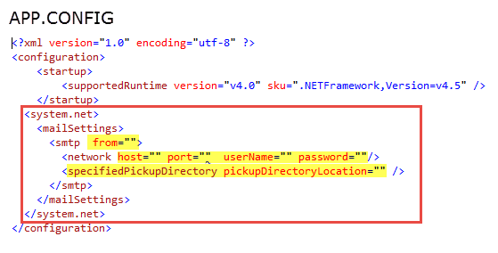

# Sending SMTP email using project configuration file special section for settings
## Requires
- Visual Studio 2015
## License
- MIT
## Technologies
- C#
- SMTP
## Topics
- SMTP
- Configuration
## Updated
- 02/19/2016
## Description

<h1>Description</h1>

This code sample demonstrates how to store elements that an application would need to send SMTP email messages in a fashion that allows changes without the need to compile the project each time one wants to test a different
 port or host for instance. &nbsp;Also shown is how to test your code without actually sending email messages and instead send these messages to a file which can be examined in notepad or when Microsoft Outlook is installed the file when double clicked will
 be opened in Microsoft Outlook.

 
Sticking with how elements are read in the methods below, alternates would be to read elements from a comma-delimited text file, an xml file or perhaps from a table in a database. &nbsp;What the alternate methods can&rsquo;t do
 is redirect messages to a file. You could store elements in the alternate file types coupled with setting up for sending messages to a file for development/debug proposes. 
 
I first used the methods below first in a Visual Studio unit test calling code in a class project then used these methods within a web api solution calling the same class project used in the unit test. The difference was that in
 the web api solution the elements were stored in web.config (debug section) while for the unit project stored in the app.config file. 
 
We start by opening (in this case) app.config for a project and added in the mail settings section group as shown in the red rectangle. Next add in the pieces you want to have available at runtime. In the image below we want to
 be able to change from (whom the message is from), host (the host server responsible for sending messages), port (port used to send messages) user name and password (used when credentials are needed by the host server to send messages). There are other parts
 such as enableSsl which is not being used in the code example.&nbsp;&nbsp;

Before continuing the code shown below reads the setting above but you can also write settings back to the configuration file using save method of the ConfigurationManager used to read the settings. 
 
In the project there is a class named MailConfiguration.cs which in the constructor reads settings from the app.config (or web.config) file. Please note there is assertion to handle general exceptions such as there is a element for port but it&rsquo;s not set.
 When ConfigurationManager reads Port in the case there is no Port an exception is thrown. To keep this example simple I only show read operations, no write operations.

<h2>Special notes</h2>

The app.config file has no values for any of the elements, you need to populate them before running the sample project. Suggestions, for &lsquo;From&rsquo; use your own email address (do the same for the to email address in
 form1), for host, if using Comcast the host would be smtp.comcast.net, keeping with Comcast the port (at this time) would be 587. userName and password are the same as what you use to login to your email account.

If you want to write to the specifiedPickupDirectory path the path into this element. What I did for the unit test project was to write a post build event that created a folder named EmailDump then wrote code to set the PickupDirectoryLocation
 with the following which points to the bin\Debug\EmailDump folder.

C#

Edit|Remove

csharp

<pre class="csharp">string&nbsp;folderName&nbsp;=&nbsp;<a class="libraryLink" href="https://msdn.microsoft.com/en-US/library/System.IO.Path.Combine.aspx" target="_blank" title="Auto generated link to System.IO.Path.Combine">System.IO.Path.Combine</a>(AppDomain.CurrentDomain.BaseDirectory,&nbsp;&quot;EmailDump&quot;);</pre>

The reason for dynamically creating the folder is that there is a potential for up to eight developers running this test and six testers that may run the test. We currently have 100&#43; unit test that each developer runs each day
 before beginning to code. For a single developer that is not needed. 
 
Without actually sending a message it would be difficult to see how reading the elements from the configuration file works. 
 
The main form in the project has two buttons that permit sending a plain text or html body message with no frills. In regards to no frills, we could setup from, to, cc and bcc to use friendly names so that instead of simply showing
 email addresses we have the capability to show actual names. The third button will empty all files in the EmailDump folder so if you are doing many test we don&rsquo;t fill up the pickup folder. 
 
There is a checkbox, by default it is not checked which instructs emails to be actually sent while checking the check box will redirect messages to the pickup folder (EMailDump). 
 
Messages are sent asynchronously and the code makes use of a delegate which will indicate if the message was sent, if not what was the error. In regards to errors, if there is an error you may need to examine the inner exception
 for details. 
 
When sending a message that code is wrapped in a try-catch and looks for smtp specific exceptions first then if none drops down to general exception. The most likely reason for an error is bad port or host then of course bad email
 addressed. Here console.writeline is used but for a production application writing to a log would be in order.&nbsp;

&nbsp;

<strong>Update 
2/19/2016</strong>

<ul>
<li>Added a class library for reading settings using a slightly different method to obtain information and a unit test then decided to add a vb.net version but not a unit test.
</li><li>Moved from VS2013 to VS2015 </li></ul>

Visual BasicC#

Edit|Remove

vbcsharp

<pre class="js">Imports&nbsp;System.Configuration&nbsp;
Imports&nbsp;System.Net.Configuration&nbsp;
'''&nbsp;&lt;summary&gt;&nbsp;
'''&nbsp;Responsible&nbsp;for&nbsp;retrieving&nbsp;settings&nbsp;for&nbsp;use&nbsp;when&nbsp;sending&nbsp;Smtp&nbsp;email&nbsp;messages&nbsp;in&nbsp;the&nbsp;app&nbsp;
'''&nbsp;and&nbsp;also&nbsp;in&nbsp;unit&nbsp;test.&nbsp;
'''&nbsp;&lt;/summary&gt;&nbsp;
'''&nbsp;&lt;remarks&gt;&nbsp;
'''&nbsp;-&nbsp;variable&nbsp;smtpSection&nbsp;provides&nbsp;the&nbsp;ability&nbsp;to&nbsp;read&nbsp;elements&nbsp;from&nbsp;app.config&nbsp;or&nbsp;web.config&nbsp;
'''&nbsp;-&nbsp;MailConfigurationTest&nbsp;provides&nbsp;a&nbsp;unit&nbsp;test&nbsp;for&nbsp;testing&nbsp;this&nbsp;class.&nbsp;
'''&nbsp;&lt;/remarks&gt;&nbsp;
Public&nbsp;Class&nbsp;MailConfiguration&nbsp;
&nbsp;&nbsp;&nbsp;&nbsp;Private&nbsp;smtpSection&nbsp;As&nbsp;SmtpSection&nbsp;=&nbsp;(TryCast(ConfigurationManager.GetSection(&quot;system.net/mailSettings/smtp&quot;),&nbsp;SmtpSection))&nbsp;
&nbsp;&nbsp;&nbsp;&nbsp;'''&nbsp;&lt;summary&gt;&nbsp;
&nbsp;&nbsp;&nbsp;&nbsp;'''&nbsp;Location&nbsp;of&nbsp;configuration&nbsp;file&nbsp;
&nbsp;&nbsp;&nbsp;&nbsp;'''&nbsp;&lt;/summary&gt;&nbsp;
&nbsp;&nbsp;&nbsp;&nbsp;Public&nbsp;ReadOnly&nbsp;Property&nbsp;ConfigurationFileName()&nbsp;As&nbsp;String&nbsp;
&nbsp;&nbsp;&nbsp;&nbsp;&nbsp;&nbsp;&nbsp;&nbsp;Get&nbsp;
&nbsp;&nbsp;&nbsp;&nbsp;&nbsp;&nbsp;&nbsp;&nbsp;&nbsp;&nbsp;&nbsp;&nbsp;Try&nbsp;
&nbsp;&nbsp;&nbsp;&nbsp;&nbsp;&nbsp;&nbsp;&nbsp;&nbsp;&nbsp;&nbsp;&nbsp;&nbsp;&nbsp;&nbsp;&nbsp;Return&nbsp;smtpSection.ElementInformation.Source&nbsp;
&nbsp;&nbsp;&nbsp;&nbsp;&nbsp;&nbsp;&nbsp;&nbsp;&nbsp;&nbsp;&nbsp;&nbsp;Catch&nbsp;e1&nbsp;As&nbsp;Exception&nbsp;
&nbsp;
&nbsp;&nbsp;&nbsp;&nbsp;&nbsp;&nbsp;&nbsp;&nbsp;&nbsp;&nbsp;&nbsp;&nbsp;&nbsp;&nbsp;&nbsp;&nbsp;Return&nbsp;&quot;&quot;&nbsp;
&nbsp;&nbsp;&nbsp;&nbsp;&nbsp;&nbsp;&nbsp;&nbsp;&nbsp;&nbsp;&nbsp;&nbsp;End&nbsp;Try&nbsp;
&nbsp;&nbsp;&nbsp;&nbsp;&nbsp;&nbsp;&nbsp;&nbsp;End&nbsp;Get&nbsp;
&nbsp;&nbsp;&nbsp;&nbsp;End&nbsp;Property&nbsp;
&nbsp;&nbsp;&nbsp;&nbsp;'''&nbsp;&lt;summary&gt;&nbsp;
&nbsp;&nbsp;&nbsp;&nbsp;'''&nbsp;Email&nbsp;address&nbsp;for&nbsp;the&nbsp;system&nbsp;
&nbsp;&nbsp;&nbsp;&nbsp;'''&nbsp;&lt;/summary&gt;&nbsp;
&nbsp;&nbsp;&nbsp;&nbsp;Public&nbsp;ReadOnly&nbsp;Property&nbsp;FromAddress()&nbsp;As&nbsp;String&nbsp;
&nbsp;&nbsp;&nbsp;&nbsp;&nbsp;&nbsp;&nbsp;&nbsp;Get&nbsp;
&nbsp;&nbsp;&nbsp;&nbsp;&nbsp;&nbsp;&nbsp;&nbsp;&nbsp;&nbsp;&nbsp;&nbsp;Return&nbsp;smtpSection.From&nbsp;
&nbsp;&nbsp;&nbsp;&nbsp;&nbsp;&nbsp;&nbsp;&nbsp;End&nbsp;Get&nbsp;
&nbsp;&nbsp;&nbsp;&nbsp;End&nbsp;Property&nbsp;
&nbsp;&nbsp;&nbsp;&nbsp;'''&nbsp;&lt;summary&gt;&nbsp;
&nbsp;&nbsp;&nbsp;&nbsp;'''&nbsp;Gets&nbsp;the&nbsp;name&nbsp;or&nbsp;IP&nbsp;address&nbsp;of&nbsp;the&nbsp;host&nbsp;used&nbsp;for&nbsp;SMTP&nbsp;transactions.&nbsp;
&nbsp;&nbsp;&nbsp;&nbsp;'''&nbsp;&lt;/summary&gt;&nbsp;
&nbsp;&nbsp;&nbsp;&nbsp;Public&nbsp;ReadOnly&nbsp;Property&nbsp;Host()&nbsp;As&nbsp;String&nbsp;
&nbsp;&nbsp;&nbsp;&nbsp;&nbsp;&nbsp;&nbsp;&nbsp;Get&nbsp;
&nbsp;&nbsp;&nbsp;&nbsp;&nbsp;&nbsp;&nbsp;&nbsp;&nbsp;&nbsp;&nbsp;&nbsp;Return&nbsp;smtpSection.Network.Host&nbsp;
&nbsp;&nbsp;&nbsp;&nbsp;&nbsp;&nbsp;&nbsp;&nbsp;End&nbsp;Get&nbsp;
&nbsp;&nbsp;&nbsp;&nbsp;End&nbsp;Property&nbsp;
&nbsp;&nbsp;&nbsp;&nbsp;'''&nbsp;&lt;summary&gt;&nbsp;
&nbsp;&nbsp;&nbsp;&nbsp;'''&nbsp;Gets&nbsp;the&nbsp;port&nbsp;used&nbsp;for&nbsp;SMTP&nbsp;transactions&nbsp;
&nbsp;&nbsp;&nbsp;&nbsp;'''&nbsp;&lt;/summary&gt;&nbsp;
&nbsp;&nbsp;&nbsp;&nbsp;'''&nbsp;&lt;remarks&gt;default&nbsp;host&nbsp;is&nbsp;25&lt;/remarks&gt;&nbsp;
&nbsp;&nbsp;&nbsp;&nbsp;Public&nbsp;ReadOnly&nbsp;Property&nbsp;Port()&nbsp;As&nbsp;Integer&nbsp;
&nbsp;&nbsp;&nbsp;&nbsp;&nbsp;&nbsp;&nbsp;&nbsp;Get&nbsp;
&nbsp;&nbsp;&nbsp;&nbsp;&nbsp;&nbsp;&nbsp;&nbsp;&nbsp;&nbsp;&nbsp;&nbsp;Return&nbsp;smtpSection.Network.Port&nbsp;
&nbsp;&nbsp;&nbsp;&nbsp;&nbsp;&nbsp;&nbsp;&nbsp;End&nbsp;Get&nbsp;
&nbsp;&nbsp;&nbsp;&nbsp;End&nbsp;Property&nbsp;
&nbsp;&nbsp;&nbsp;&nbsp;'''&nbsp;&lt;summary&gt;&nbsp;
&nbsp;&nbsp;&nbsp;&nbsp;'''&nbsp;Gets&nbsp;a&nbsp;value&nbsp;that&nbsp;specifies&nbsp;the&nbsp;amount&nbsp;of&nbsp;time&nbsp;after&nbsp;&nbsp;
&nbsp;&nbsp;&nbsp;&nbsp;'''&nbsp;which&nbsp;a&nbsp;synchronous&nbsp;Send&nbsp;call&nbsp;times&nbsp;out.&nbsp;
&nbsp;&nbsp;&nbsp;&nbsp;'''&nbsp;&lt;/summary&gt;&nbsp;
&nbsp;&nbsp;&nbsp;&nbsp;Public&nbsp;ReadOnly&nbsp;Property&nbsp;TimeOut()&nbsp;As&nbsp;Integer&nbsp;
&nbsp;&nbsp;&nbsp;&nbsp;&nbsp;&nbsp;&nbsp;&nbsp;Get&nbsp;
&nbsp;&nbsp;&nbsp;&nbsp;&nbsp;&nbsp;&nbsp;&nbsp;&nbsp;&nbsp;&nbsp;&nbsp;Return&nbsp;2000&nbsp;
&nbsp;&nbsp;&nbsp;&nbsp;&nbsp;&nbsp;&nbsp;&nbsp;End&nbsp;Get&nbsp;
&nbsp;&nbsp;&nbsp;&nbsp;End&nbsp;Property&nbsp;
&nbsp;&nbsp;&nbsp;&nbsp;Public&nbsp;Overrides&nbsp;Function&nbsp;ToString()&nbsp;As&nbsp;String&nbsp;
&nbsp;&nbsp;&nbsp;&nbsp;&nbsp;&nbsp;&nbsp;&nbsp;Return&nbsp;&quot;From:&nbsp;[&quot;&nbsp;&amp;&nbsp;FromAddress&nbsp;&amp;&nbsp;&quot;]&nbsp;Host:&nbsp;[&quot;&nbsp;&amp;&nbsp;Host&nbsp;&amp;&nbsp;&quot;]&nbsp;Port:&nbsp;[&quot;&nbsp;&amp;&nbsp;Port&nbsp;&amp;&nbsp;&quot;]&quot;&nbsp;
&nbsp;&nbsp;&nbsp;&nbsp;End&nbsp;Function&nbsp;
End&nbsp;Class&nbsp;
</pre>

&nbsp;

 

 

 

<ul>
</ul>
<h1>More Information</h1>

See also, <a href="https://msdn.microsoft.com/en-us/library/system.net.configuration.mailsettingssectiongroup(v=vs.110).aspx" target="_blank">
MailSettingsSectionGroup class</a>.

