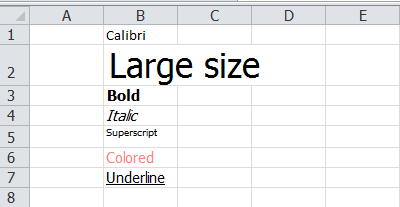

# Set Excel Font Style in C#
## Requires
- Visual Studio 2010
## License
- MS-LPL
## Technologies
- C#
- Silverlight
- WPF
- c# control
## Topics
- Excel Automation
- Set Excel font
- Excel font style
## Updated
- 11/09/2014
## Description

<h1>Introduction</h1>

In order to show a good-looking Excel file or emphasize one part of Excel, different font styles for cells, which include characters, are needed. This sample aims to provide a C# solution to set Excel font style using free Spire.XLS. 

Description

<strong>Tools we need:</strong> 

- Free Spire.XLS (This dll is available in the package attached.) 
- Visual Studio

<strong>Prepare the environment</strong> 

This solution is based on a free .NET Excel component - free Spire.XLS, download the package and unzip it, you&rsquo;ll
 get dll file and sample demo at the same time. Create or open a .NET class application in Visual Studio 2005 or above versions, add Spire.Xls.dll as a reference to your .NET project assemblies, set &ldquo;Target framework&rdquo; to &ldquo;.NET Framework 4&rdquo;.

<strong>Namespaces to be used</strong>

using Spire.Xls; 
using <a class="libraryLink" href="https://msdn.microsoft.com/en-US/library/System.Drawing.aspx" target="_blank" title="Auto generated link to System.Drawing">System.Drawing</a>;

<strong>Code Snippet</strong>

<strong>&nbsp;</strong>

<strong>

C#

Edit|Remove

csharp

<pre class="js">&nbsp;&nbsp;&nbsp;&nbsp;&nbsp;&nbsp;&nbsp;&nbsp;&nbsp;&nbsp;&nbsp;&nbsp;//Create&nbsp;Workbook&nbsp;and&nbsp;Worksheet&nbsp;
&nbsp;&nbsp;&nbsp;&nbsp;&nbsp;&nbsp;&nbsp;&nbsp;&nbsp;&nbsp;&nbsp;&nbsp;Workbook&nbsp;workbook&nbsp;=&nbsp;new&nbsp;Workbook();&nbsp;
&nbsp;&nbsp;&nbsp;&nbsp;&nbsp;&nbsp;&nbsp;&nbsp;&nbsp;&nbsp;&nbsp;&nbsp;Worksheet&nbsp;sheet&nbsp;=&nbsp;workbook.Worksheets[0];&nbsp;
&nbsp;
&nbsp;&nbsp;&nbsp;&nbsp;&nbsp;&nbsp;&nbsp;&nbsp;&nbsp;&nbsp;&nbsp;&nbsp;//Set&nbsp;Font&nbsp;Type&nbsp;as&nbsp;Calibri&nbsp;
&nbsp;&nbsp;&nbsp;&nbsp;&nbsp;&nbsp;&nbsp;&nbsp;&nbsp;&nbsp;&nbsp;&nbsp;sheet.Range[&quot;B1&quot;].Text&nbsp;=&nbsp;&quot;Calibri&quot;;&nbsp;
&nbsp;&nbsp;&nbsp;&nbsp;&nbsp;&nbsp;&nbsp;&nbsp;&nbsp;&nbsp;&nbsp;&nbsp;sheet.Range[&quot;B1&quot;].Style.Font.FontName&nbsp;=&nbsp;&quot;Calibri&quot;;&nbsp;
&nbsp;
&nbsp;&nbsp;&nbsp;&nbsp;&nbsp;&nbsp;&nbsp;&nbsp;&nbsp;&nbsp;&nbsp;&nbsp;//Set&nbsp;Font&nbsp;Size&nbsp;as&nbsp;22&nbsp;
&nbsp;&nbsp;&nbsp;&nbsp;&nbsp;&nbsp;&nbsp;&nbsp;&nbsp;&nbsp;&nbsp;&nbsp;sheet.Range[&quot;B2&quot;].Text&nbsp;=&nbsp;&quot;Large&nbsp;size&quot;;&nbsp;
&nbsp;&nbsp;&nbsp;&nbsp;&nbsp;&nbsp;&nbsp;&nbsp;&nbsp;&nbsp;&nbsp;&nbsp;sheet.Range[&quot;B2&quot;].Style.Font.Size&nbsp;=&nbsp;22;&nbsp;
&nbsp;
&nbsp;&nbsp;&nbsp;&nbsp;&nbsp;&nbsp;&nbsp;&nbsp;&nbsp;&nbsp;&nbsp;&nbsp;//Set&nbsp;Font&nbsp;as&nbsp;Bold&nbsp;
&nbsp;&nbsp;&nbsp;&nbsp;&nbsp;&nbsp;&nbsp;&nbsp;&nbsp;&nbsp;&nbsp;&nbsp;sheet.Range[&quot;B3&quot;].Text&nbsp;=&nbsp;&quot;Bold&quot;;&nbsp;
&nbsp;&nbsp;&nbsp;&nbsp;&nbsp;&nbsp;&nbsp;&nbsp;&nbsp;&nbsp;&nbsp;&nbsp;sheet.Range[&quot;B3&quot;].Style.Font.IsBold&nbsp;=&nbsp;true;&nbsp;
&nbsp;
&nbsp;&nbsp;&nbsp;&nbsp;&nbsp;&nbsp;&nbsp;&nbsp;&nbsp;&nbsp;&nbsp;&nbsp;//Set&nbsp;Font&nbsp;as&nbsp;Italic&nbsp;
&nbsp;&nbsp;&nbsp;&nbsp;&nbsp;&nbsp;&nbsp;&nbsp;&nbsp;&nbsp;&nbsp;&nbsp;sheet.Range[&quot;B4&quot;].Text&nbsp;=&nbsp;&quot;Italic&quot;;&nbsp;
&nbsp;&nbsp;&nbsp;&nbsp;&nbsp;&nbsp;&nbsp;&nbsp;&nbsp;&nbsp;&nbsp;&nbsp;sheet.Range[&quot;B4&quot;].Style.Font.IsItalic&nbsp;=&nbsp;true;&nbsp;
&nbsp;
&nbsp;&nbsp;&nbsp;&nbsp;&nbsp;&nbsp;&nbsp;&nbsp;&nbsp;&nbsp;&nbsp;&nbsp;//Set&nbsp;Font&nbsp;as&nbsp;Superscript&nbsp;
&nbsp;&nbsp;&nbsp;&nbsp;&nbsp;&nbsp;&nbsp;&nbsp;&nbsp;&nbsp;&nbsp;&nbsp;sheet.Range[&quot;B5&quot;].Text&nbsp;=&nbsp;&quot;Superscript&quot;;&nbsp;
&nbsp;&nbsp;&nbsp;&nbsp;&nbsp;&nbsp;&nbsp;&nbsp;&nbsp;&nbsp;&nbsp;&nbsp;sheet.Range[&quot;B5&quot;].Style.Font.IsSuperscript&nbsp;=&nbsp;true;&nbsp;
&nbsp;
&nbsp;&nbsp;&nbsp;&nbsp;&nbsp;&nbsp;&nbsp;&nbsp;&nbsp;&nbsp;&nbsp;&nbsp;//Set&nbsp;Font&nbsp;as&nbsp;Colored&nbsp;
&nbsp;&nbsp;&nbsp;&nbsp;&nbsp;&nbsp;&nbsp;&nbsp;&nbsp;&nbsp;&nbsp;&nbsp;sheet.Range[&quot;B6&quot;].Text&nbsp;=&nbsp;&quot;Colored&quot;;&nbsp;
&nbsp;&nbsp;&nbsp;&nbsp;&nbsp;&nbsp;&nbsp;&nbsp;&nbsp;&nbsp;&nbsp;&nbsp;sheet.Range[&quot;B6&quot;].Style.Font.Color&nbsp;=&nbsp;Color.FromArgb(255,&nbsp;125,&nbsp;125);&nbsp;
&nbsp;
&nbsp;&nbsp;&nbsp;&nbsp;&nbsp;&nbsp;&nbsp;&nbsp;&nbsp;&nbsp;&nbsp;&nbsp;//Set&nbsp;Font&nbsp;as&nbsp;Underlined&nbsp;
&nbsp;&nbsp;&nbsp;&nbsp;&nbsp;&nbsp;&nbsp;&nbsp;&nbsp;&nbsp;&nbsp;&nbsp;sheet.Range[&quot;B7&quot;].Text&nbsp;=&nbsp;&quot;Underline&quot;;&nbsp;
&nbsp;&nbsp;&nbsp;&nbsp;&nbsp;&nbsp;&nbsp;&nbsp;&nbsp;&nbsp;&nbsp;&nbsp;sheet.Range[&quot;B7&quot;].Style.Font.Underline&nbsp;=&nbsp;FontUnderlineType.Single;&nbsp;
&nbsp;
&nbsp;&nbsp;&nbsp;&nbsp;&nbsp;&nbsp;&nbsp;&nbsp;&nbsp;&nbsp;&nbsp;&nbsp;//Save&nbsp;File&nbsp;
&nbsp;&nbsp;&nbsp;&nbsp;&nbsp;&nbsp;&nbsp;&nbsp;&nbsp;&nbsp;&nbsp;&nbsp;workbook.SaveToFile(&quot;FontStyle.xls&quot;);&nbsp;
&nbsp;
&nbsp;&nbsp;&nbsp;&nbsp;&nbsp;&nbsp;&nbsp;&nbsp;&nbsp;&nbsp;&nbsp;&nbsp;//Launch&nbsp;File&nbsp;
&nbsp;&nbsp;&nbsp;&nbsp;&nbsp;&nbsp;&nbsp;&nbsp;&nbsp;&nbsp;&nbsp;&nbsp;<a class="libraryLink" href="https://msdn.microsoft.com/en-US/library/System.Diagnostics.Process.Start.aspx" target="_blank" title="Auto generated link to System.Diagnostics.Process.Start">System.Diagnostics.Process.Start</a>(&quot;FontStyle.xls&quot;);</pre>

&nbsp;Output

 
</strong>

&nbsp;

<h1 style="text-align:left">More Information</h1>

Free Spire.XLS for .NET is a Community Edition of the Spire.XLS for .NET, which is a totally free Excel component for commercial and personal use. As a standalone C#/VB.NET component, Free Spire.XLS
 for .NET enables developers to create, manage and manipulate Excel files on any .NET applications.

&nbsp;

<strong>Related Links:</strong>

Website: <a href="http://www.e-iceblue.com">www.e-iceblue.com</a> 
Product Home: <a href="http://www.e-iceblue.com/Introduce/free-xls-component.html">
Free Spire.XLS for .NET</a> 
Download: <a href="http://www.e-iceblue.com/Download/download-excel-for-net-now.html">
Spire.XLS for. NET</a> 
Forum: <a href="http://www.e-iceblue.com/forum/viewforum.php?f=4">
Spire.XLS forum</a>

