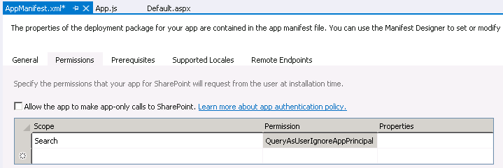

# SharePoint 2013: Querying Search with the JavaScript Client Object Model
## Requires
- Visual Studio 2012
## License
- Apache License, Version 2.0
## Technologies
- SharePoint Server 2013
- apps for SharePoint
## Topics
- Search
- apps for SharePoint
## Updated
- 04/19/2013
## Description

<strong>Provided by:</strong> <a href="http://www.dotnetmafia.com">Corey Roth</a>,
<a href="http://www.sp2apps.com">SP2 Apps</a>

<h1>Introduction</h1>

This code&nbsp;sample shows you how to query search in SharePoint 2013 using the JavaScript Client Object Model (CSOM).

<h1>Building the Sample</h1>

The sample provided is a SharePoint-hosted App. &nbsp;Apps must be configured on your SharePoint environment in order to run the sample. &nbsp;This sample is build with the RTM version of the Office Developer Tools which need to be installed prior to running.

Description

This example demonstrates how to use the SharePoint 2013 JavaScript Client Object Model. &nbsp;In this sample we are going to create a page with a search box that displays results in a grid. &nbsp;To get started, create a new SharePoint-hosted app. &nbsp;Then,
 you must grant permissions to the App to use search. &nbsp;To do this, open <strong>
AppManifest.xml</strong>&nbsp;and click on the <em>Permissions</em>&nbsp;tab. &nbsp;Under
<em>Scope</em>, choose a value of <em>Search</em>&nbsp;and then select <em>QueryAsUserIgnoreAppPrincipal</em>. &nbsp;If you forget this step, you will be unable to retieve any search results from SharePoint.

Now, edit <strong>Default.aspx</strong>&nbsp;to add the HTML for our search box and button as well as a div tag to hold the results.

HTML

Edit|Remove

html

<pre class="html">&lt;div&gt;&nbsp;
&nbsp;&nbsp;&nbsp;&nbsp;&nbsp;&nbsp;&nbsp;&nbsp;&lt;label&nbsp;for=&quot;searchTextBox&quot;&gt;Search:&nbsp;&lt;/label&gt;&nbsp;
&nbsp;&nbsp;&nbsp;&nbsp;&nbsp;&nbsp;&nbsp;&nbsp;&lt;input&nbsp;id=&quot;searchTextBox&quot;&nbsp;type=&quot;text&quot;&nbsp;/&gt;&nbsp;
&nbsp;&nbsp;&nbsp;&nbsp;&nbsp;&nbsp;&nbsp;&nbsp;&lt;input&nbsp;id=&quot;searchButton&quot;&nbsp;type=&quot;button&quot;&nbsp;value=&quot;Search&quot;&nbsp;/&gt;&nbsp;
&lt;/div&gt;&nbsp;
&nbsp;
&lt;div&nbsp;id=&quot;resultsDiv&quot;&gt;&nbsp;
&lt;/div&gt;</pre>

Next, edit <strong>App.js</strong>&nbsp;to include your script to query search and display the results. &nbsp;Add a click event handle to your document ready function. &nbsp;We'll put our code to query search here.

JavaScript

Edit|Remove

js

<pre class="js">$(&quot;#searchButton&quot;).click(function&nbsp;()&nbsp;{&nbsp;&nbsp;&nbsp;&nbsp;&nbsp;&nbsp;&nbsp;&nbsp;
});</pre>

The following code is similar to the technique used for
<a href="http://code.msdn.microsoft.com/Query-Search-with-the-649f1bc1">querying using Managed CSOM</a>. &nbsp;Next, you need to create a
<strong>KeywordQuery</strong> class.

JavaScript

Edit|Remove

js

<pre class="js">var&nbsp;keywordQuery&nbsp;=&nbsp;new&nbsp;<a class="libraryLink" href="http://msdn.microsoft.com/en-US/library/Microsoft.SharePoint.Client.Search.Query.KeywordQuery.aspx" target="_blank" title="Auto generated link to Microsoft.SharePoint.Client.Search.Query.KeywordQuery">Microsoft.SharePoint.Client.Search.Query.KeywordQuery</a>(context);</pre>

Then we will use the value of our textbox with the <strong>
set_queryText() </strong>method.

JavaScript

Edit|Remove

js

<pre class="js">keywordQuery.set_queryText($(&quot;#searchTextBox&quot;).val());</pre>

Now, create a SearchExecutor object and execute the query.&nbsp; I am assigning the results of the query back to a global variable called
<em>results</em>.&nbsp; Since apps by default have &lsquo;use strict&rsquo; enabled, be sure and declare this first.

JavaScript

Edit|Remove

js

<pre class="js">var&nbsp;searchExecutor&nbsp;=&nbsp;new&nbsp;<a class="libraryLink" href="http://msdn.microsoft.com/en-US/library/Microsoft.SharePoint.Client.Search.Query.SearchExecutor.aspx" target="_blank" title="Auto generated link to Microsoft.SharePoint.Client.Search.Query.SearchExecutor">Microsoft.SharePoint.Client.Search.Query.SearchExecutor</a>(context);&nbsp;
&nbsp;
results&nbsp;=&nbsp;searchExecutor.executeQuery(keywordQuery);&nbsp;</pre>

To execute the query, use <strong>executeQyeryAsync</strong>&nbsp;and pass it methods for both success and failure.

JavaScript

Edit|Remove

js

<pre class="js">context.executeQueryAsync(onQuerySuccess,&nbsp;onQueryError);</pre>

Each individual result can be found in <strong>results.m_value.ResultTables[0].ResultRows</strong>.&nbsp; The managed properties of each row are typed directly on the object so that it means you can access them directly if you know
 the name (i.e.: Author, Write, etc). Iterating the values is simple using $.each. &nbsp;

JavaScript

Edit|Remove

js

<pre class="js">function&nbsp;onQuerySuccess()&nbsp;{&nbsp;
&nbsp;&nbsp;&nbsp;&nbsp;$(&quot;#resultsDiv&quot;).append('&lt;table&gt;');&nbsp;
&nbsp;
&nbsp;&nbsp;&nbsp;&nbsp;$.each(results.m_value.ResultTables[0].ResultRows,&nbsp;function&nbsp;()&nbsp;{&nbsp;
&nbsp;&nbsp;&nbsp;&nbsp;&nbsp;&nbsp;&nbsp;&nbsp;$(&quot;#resultsDiv&quot;).append('&lt;tr&gt;');&nbsp;
&nbsp;&nbsp;&nbsp;&nbsp;&nbsp;&nbsp;&nbsp;&nbsp;$(&quot;#resultsDiv&quot;).append('&lt;td&gt;'&nbsp;&#43;&nbsp;this.Title&nbsp;&#43;&nbsp;'&lt;/td&gt;');&nbsp;
&nbsp;&nbsp;&nbsp;&nbsp;&nbsp;&nbsp;&nbsp;&nbsp;$(&quot;#resultsDiv&quot;).append('&lt;td&gt;'&nbsp;&#43;&nbsp;this.Author&nbsp;&#43;&nbsp;'&lt;/td&gt;');&nbsp;
&nbsp;&nbsp;&nbsp;&nbsp;&nbsp;&nbsp;&nbsp;&nbsp;$(&quot;#resultsDiv&quot;).append('&lt;td&gt;'&nbsp;&#43;&nbsp;this.Write&nbsp;&#43;&nbsp;'&lt;/td&gt;');&nbsp;
&nbsp;&nbsp;&nbsp;&nbsp;&nbsp;&nbsp;&nbsp;&nbsp;$(&quot;#resultsDiv&quot;).append('&lt;td&gt;'&nbsp;&#43;&nbsp;this.Path&nbsp;&#43;&nbsp;'&lt;/td&gt;');&nbsp;
&nbsp;&nbsp;&nbsp;&nbsp;&nbsp;&nbsp;&nbsp;&nbsp;$(&quot;#resultsDiv&quot;).append('&lt;/tr&gt;');&nbsp;
&nbsp;&nbsp;&nbsp;&nbsp;});&nbsp;
&nbsp;
&nbsp;&nbsp;&nbsp;&nbsp;$(&quot;#resultsDiv&quot;).append('&lt;/table&gt;');&nbsp;
}&nbsp;
</pre>

Review the attached code for complete details.

<h1>Source Code Files</h1>
<ul>
<li>Default.aspx - HTML for the solution </li><li>App.js - JavaScript to query search </li></ul>
<h1>More Information</h1>

For more infromation, see the related blog entry at <a href="http://www.dotnetmafia.com/blogs/dotnettipoftheday/archive/2013/04/18/how-to-query-search-with-the-sharepoint-2013-javascript-client-object-model.aspx">
DotNetMafia.com</a>. &nbsp;Follow me on twitter: <a href="http://twitter.com/coreyroth">
@coreyroth</a>.

