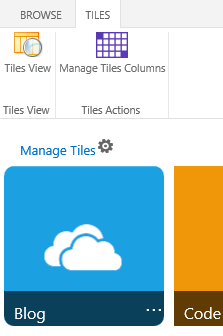

# SharePoint 2013: Simple Custom UI Style Tiles with Drag and Drop
## Requires
- Visual Studio 2012
## License
- Apache License, Version 2.0
## Technologies
- SharePoint
- Javascript
- Sharepoint Online
- Visual Studio 2012
- SharePoint Server 2013
- SharePoint Foundation 2013
- apps for Office
- apps for SharePoint
- SharePoint  2013
- SharePoint 2013
- SharePoint Apps
- Client Object Model SharePoint 2013
## Topics
- SharePoint
- EcmaScript
- SharePoint client object model (CSOM)
- apps for Office
- apps for SharePoint
- SharePoint 2013
- SharePoint Apps
## Updated
- 03/24/2014
## Description

<h1>Introduction</h1>

This&nbsp;simple App shows how we can use&nbsp; jQuery/Client Object Model&nbsp;supported by a Custom List to create a custom Tiles solution where is possible to manage and reorganize the position of the Tiles .

This solution is based on the SharePoint-hosted app template provided by Visual Studio 2012.

for more info about this simple app solution&nbsp;can view the following <a href="http://aaclage.blogspot.ch/2013/09/example-custom-ui-metro-style-tiles.html" target="_blank">
link&nbsp;</a>

<h1>Building the Sample</h1>

<em>&nbsp;</em>

This sample requires the following:

<ul>
<li>Visual Studio 2012 </li><li>Office Developer Tools for Visual Studio 2012 </li></ul>

Either of the following:

<ul>
<li>Access to an Office 365 Enterprise site that has been configured to host apps (recommended).
</li><li>SharePoint Server 2013 configured to host apps, and with a Developer Site Collection already created.
</li></ul>
<h2>Installation</h2>
<ul>
<li>Open AppTiles.sln with Visual Studio 2012 </li><li>Include SharePoint Site URL in CustomLinks Project. </li><li>Click F5 to Deploy the app&nbsp;in your SharePoint Site. </li><li>Access to your SharePoint 2013 Site or Office 365 SharePoint Site and click </li></ul>
<h2>Manage&nbsp;Tiles Page</h2>
<ul>
<li>Tiles are display </li><li>Tiles can be edit </li></ul>
<h2>Manage List Tiles</h2>
<ul>
<li>

The Tiles List is able to add new, Edit and Delete Item.

</li><li>

The List is able to manage the number of columns&nbsp;where the Tiles are display&nbsp;in the option&nbsp;&quot;Tiles &gt; List Ribbon &gt; Manage Tiles Columns&quot;.&nbsp;

</li></ul>
<h2>Description</h2>

This solution creates a Custom Tiles Page View supported by a Custom List.

The following code shows the jquery methods used to create the efects &quot;Jquery-UI&quot;

JavaScript

Edit|Remove

js
<pre class="hidden">function TileShadow() {
    $('.Tile-Description').parent().mouseenter(function () {
        $(this).children('.Tile-Description').css('top', '125px');
        $(this).children('.Tile-Description').animate({ top: '-=125' }, 500);
    }).mouseleave(function () {
        $(this).children('.Tile-Description').css('top', '0px');
        $(this).children('.Tile-Description').animate({ top: '&#43;=125' }, 500);
    });

    $(function () {
        $(&quot;.column&quot;).sortable({
            connectWith: &quot;.column&quot;,
            stop: function (event, ui) {
                
                $(function () {
                    var count = 1;
                    $('.tile').each(function (i, v) {
                        var $this = $(this);
                        var Order = count &#43; &quot;;#&quot; &#43; $(this).parent().attr('id');
                        SP.SOD.executeFunc('sp.js', 'SP.ClientContext', updateListItem($(this).attr('id'), Order));
                        count = count &#43; 1;
                        if ($(this).width() === 320)
                        {
                            $(this).parent().width(340);
                        }
                        $(this).children().css('top', '125px');
                    });
                })
                SP.SOD.executeFunc('sp.js', 'SP.ClientContext', function () { SP.UI.Notify.addNotification('The Tiles are updated!', false); });
                // alert(ui.item.attr('id'));
            }
        });
    });
}</pre>

<pre class="js">function&nbsp;TileShadow()&nbsp;{&nbsp;
&nbsp;&nbsp;&nbsp;&nbsp;$('.Tile-Description').parent().mouseenter(function&nbsp;()&nbsp;{&nbsp;
&nbsp;&nbsp;&nbsp;&nbsp;&nbsp;&nbsp;&nbsp;&nbsp;$(this).children('.Tile-Description').css('top',&nbsp;'125px');&nbsp;
&nbsp;&nbsp;&nbsp;&nbsp;&nbsp;&nbsp;&nbsp;&nbsp;$(this).children('.Tile-Description').animate({&nbsp;top:&nbsp;'-=125'&nbsp;},&nbsp;500);&nbsp;
&nbsp;&nbsp;&nbsp;&nbsp;}).mouseleave(function&nbsp;()&nbsp;{&nbsp;
&nbsp;&nbsp;&nbsp;&nbsp;&nbsp;&nbsp;&nbsp;&nbsp;$(this).children('.Tile-Description').css('top',&nbsp;'0px');&nbsp;
&nbsp;&nbsp;&nbsp;&nbsp;&nbsp;&nbsp;&nbsp;&nbsp;$(this).children('.Tile-Description').animate({&nbsp;top:&nbsp;'&#43;=125'&nbsp;},&nbsp;500);&nbsp;
&nbsp;&nbsp;&nbsp;&nbsp;});&nbsp;
&nbsp;
&nbsp;&nbsp;&nbsp;&nbsp;$(function&nbsp;()&nbsp;{&nbsp;
&nbsp;&nbsp;&nbsp;&nbsp;&nbsp;&nbsp;&nbsp;&nbsp;$(&quot;.column&quot;).sortable({&nbsp;
&nbsp;&nbsp;&nbsp;&nbsp;&nbsp;&nbsp;&nbsp;&nbsp;&nbsp;&nbsp;&nbsp;&nbsp;connectWith:&nbsp;&quot;.column&quot;,&nbsp;
&nbsp;&nbsp;&nbsp;&nbsp;&nbsp;&nbsp;&nbsp;&nbsp;&nbsp;&nbsp;&nbsp;&nbsp;stop:&nbsp;function&nbsp;(event,&nbsp;ui)&nbsp;{&nbsp;
&nbsp;&nbsp;&nbsp;&nbsp;&nbsp;&nbsp;&nbsp;&nbsp;&nbsp;&nbsp;&nbsp;&nbsp;&nbsp;&nbsp;&nbsp;&nbsp;&nbsp;
&nbsp;&nbsp;&nbsp;&nbsp;&nbsp;&nbsp;&nbsp;&nbsp;&nbsp;&nbsp;&nbsp;&nbsp;&nbsp;&nbsp;&nbsp;&nbsp;$(function&nbsp;()&nbsp;{&nbsp;
&nbsp;&nbsp;&nbsp;&nbsp;&nbsp;&nbsp;&nbsp;&nbsp;&nbsp;&nbsp;&nbsp;&nbsp;&nbsp;&nbsp;&nbsp;&nbsp;&nbsp;&nbsp;&nbsp;&nbsp;var&nbsp;count&nbsp;=&nbsp;1;&nbsp;
&nbsp;&nbsp;&nbsp;&nbsp;&nbsp;&nbsp;&nbsp;&nbsp;&nbsp;&nbsp;&nbsp;&nbsp;&nbsp;&nbsp;&nbsp;&nbsp;&nbsp;&nbsp;&nbsp;&nbsp;$('.tile').each(function&nbsp;(i,&nbsp;v)&nbsp;{&nbsp;
&nbsp;&nbsp;&nbsp;&nbsp;&nbsp;&nbsp;&nbsp;&nbsp;&nbsp;&nbsp;&nbsp;&nbsp;&nbsp;&nbsp;&nbsp;&nbsp;&nbsp;&nbsp;&nbsp;&nbsp;&nbsp;&nbsp;&nbsp;&nbsp;var&nbsp;$this&nbsp;=&nbsp;$(this);&nbsp;
&nbsp;&nbsp;&nbsp;&nbsp;&nbsp;&nbsp;&nbsp;&nbsp;&nbsp;&nbsp;&nbsp;&nbsp;&nbsp;&nbsp;&nbsp;&nbsp;&nbsp;&nbsp;&nbsp;&nbsp;&nbsp;&nbsp;&nbsp;&nbsp;var&nbsp;Order&nbsp;=&nbsp;count&nbsp;&#43;&nbsp;&quot;;#&quot;&nbsp;&#43;&nbsp;$(this).parent().attr('id');&nbsp;
&nbsp;&nbsp;&nbsp;&nbsp;&nbsp;&nbsp;&nbsp;&nbsp;&nbsp;&nbsp;&nbsp;&nbsp;&nbsp;&nbsp;&nbsp;&nbsp;&nbsp;&nbsp;&nbsp;&nbsp;&nbsp;&nbsp;&nbsp;&nbsp;SP.SOD.executeFunc('sp.js',&nbsp;'SP.ClientContext',&nbsp;updateListItem($(this).attr('id'),&nbsp;Order));&nbsp;
&nbsp;&nbsp;&nbsp;&nbsp;&nbsp;&nbsp;&nbsp;&nbsp;&nbsp;&nbsp;&nbsp;&nbsp;&nbsp;&nbsp;&nbsp;&nbsp;&nbsp;&nbsp;&nbsp;&nbsp;&nbsp;&nbsp;&nbsp;&nbsp;count&nbsp;=&nbsp;count&nbsp;&#43;&nbsp;1;&nbsp;
&nbsp;&nbsp;&nbsp;&nbsp;&nbsp;&nbsp;&nbsp;&nbsp;&nbsp;&nbsp;&nbsp;&nbsp;&nbsp;&nbsp;&nbsp;&nbsp;&nbsp;&nbsp;&nbsp;&nbsp;&nbsp;&nbsp;&nbsp;&nbsp;if&nbsp;($(this).width()&nbsp;===&nbsp;320)&nbsp;
&nbsp;&nbsp;&nbsp;&nbsp;&nbsp;&nbsp;&nbsp;&nbsp;&nbsp;&nbsp;&nbsp;&nbsp;&nbsp;&nbsp;&nbsp;&nbsp;&nbsp;&nbsp;&nbsp;&nbsp;&nbsp;&nbsp;&nbsp;&nbsp;{&nbsp;
&nbsp;&nbsp;&nbsp;&nbsp;&nbsp;&nbsp;&nbsp;&nbsp;&nbsp;&nbsp;&nbsp;&nbsp;&nbsp;&nbsp;&nbsp;&nbsp;&nbsp;&nbsp;&nbsp;&nbsp;&nbsp;&nbsp;&nbsp;&nbsp;&nbsp;&nbsp;&nbsp;&nbsp;$(this).parent().width(340);&nbsp;
&nbsp;&nbsp;&nbsp;&nbsp;&nbsp;&nbsp;&nbsp;&nbsp;&nbsp;&nbsp;&nbsp;&nbsp;&nbsp;&nbsp;&nbsp;&nbsp;&nbsp;&nbsp;&nbsp;&nbsp;&nbsp;&nbsp;&nbsp;&nbsp;}&nbsp;
&nbsp;&nbsp;&nbsp;&nbsp;&nbsp;&nbsp;&nbsp;&nbsp;&nbsp;&nbsp;&nbsp;&nbsp;&nbsp;&nbsp;&nbsp;&nbsp;&nbsp;&nbsp;&nbsp;&nbsp;&nbsp;&nbsp;&nbsp;&nbsp;$(this).children().css('top',&nbsp;'125px');&nbsp;
&nbsp;&nbsp;&nbsp;&nbsp;&nbsp;&nbsp;&nbsp;&nbsp;&nbsp;&nbsp;&nbsp;&nbsp;&nbsp;&nbsp;&nbsp;&nbsp;&nbsp;&nbsp;&nbsp;&nbsp;});&nbsp;
&nbsp;&nbsp;&nbsp;&nbsp;&nbsp;&nbsp;&nbsp;&nbsp;&nbsp;&nbsp;&nbsp;&nbsp;&nbsp;&nbsp;&nbsp;&nbsp;})&nbsp;
&nbsp;&nbsp;&nbsp;&nbsp;&nbsp;&nbsp;&nbsp;&nbsp;&nbsp;&nbsp;&nbsp;&nbsp;&nbsp;&nbsp;&nbsp;&nbsp;SP.SOD.executeFunc('sp.js',&nbsp;'SP.ClientContext',&nbsp;function&nbsp;()&nbsp;{&nbsp;SP.UI.Notify.addNotification('The&nbsp;Tiles&nbsp;are&nbsp;updated!',&nbsp;false);&nbsp;});&nbsp;
&nbsp;&nbsp;&nbsp;&nbsp;&nbsp;&nbsp;&nbsp;&nbsp;&nbsp;&nbsp;&nbsp;&nbsp;&nbsp;&nbsp;&nbsp;&nbsp;//&nbsp;alert(ui.item.attr('id'));&nbsp;
&nbsp;&nbsp;&nbsp;&nbsp;&nbsp;&nbsp;&nbsp;&nbsp;&nbsp;&nbsp;&nbsp;&nbsp;}&nbsp;
&nbsp;&nbsp;&nbsp;&nbsp;&nbsp;&nbsp;&nbsp;&nbsp;});&nbsp;
&nbsp;&nbsp;&nbsp;&nbsp;});&nbsp;
}</pre>

<h2 class="endscriptcode">&nbsp;Source Code files</h2>

Pages

<ul style="margin-bottom:0pt; margin-top:0pt">
<li dir="ltr" style="list-style-type:disc; font-size:15px; font-family:Arial; font-variant:normal; vertical-align:baseline; font-weight:normal; color:black; font-style:normal; text-decoration:none; background-color:transparent">

Default.aspx

</li><li dir="ltr" style="list-style-type:disc; font-size:15px; font-family:Arial; font-variant:normal; vertical-align:baseline; font-weight:normal; color:black; font-style:normal; text-decoration:none; background-color:transparent">

TilesColumns.aspx

</li></ul>

Content

<ul style="margin-bottom:0pt; margin-top:0pt">
<li dir="ltr" style="list-style-type:disc; font-size:15px; font-family:Arial; font-variant:normal; vertical-align:baseline; font-weight:normal; color:black; font-style:normal; text-decoration:none; background-color:transparent">

App.css

</li><li dir="ltr" style="list-style-type:disc; font-size:15px; font-family:Arial; font-variant:normal; vertical-align:baseline; font-weight:normal; color:black; font-style:normal; text-decoration:none; background-color:transparent">

jquery-ui.css

</li></ul>

Scripts

<ul style="margin-bottom:0pt; margin-top:0pt">
<li dir="ltr" style="list-style-type:disc; font-size:15px; font-family:Arial; font-variant:normal; vertical-align:baseline; font-weight:normal; color:black; font-style:normal; text-decoration:none; background-color:transparent">

app.js

</li><li dir="ltr" style="list-style-type:disc; font-size:15px; font-family:Arial; font-variant:normal; vertical-align:baseline; font-weight:normal; color:black; font-style:normal; text-decoration:none; background-color:transparent">

jquery-ui.js

</li></ul>

Images

<ul style="margin-bottom:0pt; margin-top:0pt">
<li dir="ltr" style="list-style-type:disc; font-size:15px; font-family:Arial; font-variant:normal; vertical-align:baseline; font-weight:normal; color:black; font-style:normal; text-decoration:none; background-color:transparent">

*.png

</li></ul>

List
 Item Template

<ul style="margin-bottom:0pt; margin-top:0pt">
<li dir="ltr" style="list-style-type:disc; font-size:15px; font-family:Arial; font-variant:normal; vertical-align:baseline; font-weight:normal; color:black; font-style:normal; text-decoration:none; background-color:transparent">

Tiles

<ul style="margin-bottom:0pt; margin-top:0pt">
<li dir="ltr" style="list-style-type:circle; font-size:15px; font-family:Arial; font-variant:normal; vertical-align:baseline; font-weight:normal; color:black; font-style:normal; text-decoration:none; background-color:transparent">

Ribbon
 &ldquo;TilesColumns&rdquo;

</li></ul>
</li></ul>
<h2 class="endscriptcode">&nbsp;Updates</h2>
<ul>
<li>Performance to SP.Objects was improved </li><li>Removed extra files </li><li>New Color options </li><li>New Ribbon Tile&nbsp;option in Page </li><li>Rounded Tiles (Round Option) </li></ul>

