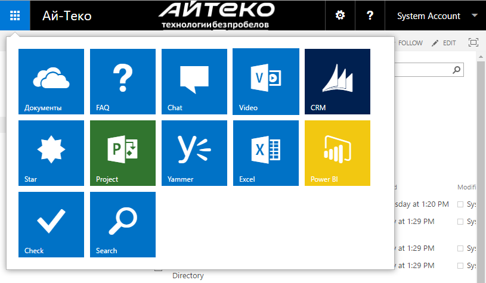

# SharePoint 2016. Кастомизация SuiteBar
## Requires
- Visual Studio 2015
## License
- MIT
## Technologies
- SharePoint Server 2016
## Topics
- SharePoint Branding
- SharePoint SuiteBar
## Updated
- 07/12/2016
## Description

<h1>Введение</h1>

<em>Де&#1084;онстрационный проект, из&#1084;еняющий SuiteBar и AppLauncher в SharePoint 2016 OnPrem.</em>

<em> 
</em>

<h1>Построение</h1>

<em>Решение создано в Visual Studio 2015 и предназначено для развертывания в фер&#1084;е SharePoint 2016 On-Premise. Для его открытия потребуется наличие установленного пакета Office Developer Tools.</em>

<em>Решение уровня фер&#1084;ы (farm solution) и не предназначено для его публикации в SharePoint Online либо в виде sandbox solution.</em>

<h1>Описание</h1>

<em style="font-size:small">В решение включены следующие артефакты:</em>

<h2><em>Классы для создание SuiteNav</em></h2>

<em>Класс-контейнер SuiteNav, содержит инфор&#1084;ацию о версии, воз&#1084;ожности кеширования и са&#1084;и данные (свойство NavBarData):</em>

<em>&nbsp;</em>

<em>

C#

Edit|Remove

csharp

<pre class="csharp">public&nbsp;class&nbsp;SuiteNav&nbsp;
{&nbsp;
&nbsp;&nbsp;&nbsp;&nbsp;public&nbsp;bool&nbsp;DoNotCache&nbsp;{&nbsp;get;&nbsp;set;&nbsp;}&nbsp;
&nbsp;&nbsp;&nbsp;&nbsp;public&nbsp;SuiteNavBarData&nbsp;NavBarData&nbsp;{&nbsp;get;&nbsp;set;&nbsp;}&nbsp;
&nbsp;&nbsp;&nbsp;&nbsp;public&nbsp;int&nbsp;SPSuiteVersion&nbsp;{&nbsp;get;&nbsp;set;&nbsp;}&nbsp;
}</pre>

</em>

<em>&nbsp;</em>

<em>&nbsp;Са&#1084;и данные для SuiteBar представленны классо&#1084; SuiteNavBarData:</em>

<em>&nbsp;</em>

C#

Edit|Remove

csharp

<pre class="csharp">public&nbsp;class&nbsp;SuiteNavBarData&nbsp;
{&nbsp;
&nbsp;&nbsp;&nbsp;&nbsp;public&nbsp;SuiteNavLink&nbsp;AboutMeLink&nbsp;{&nbsp;get;&nbsp;set;&nbsp;}&nbsp;
&nbsp;&nbsp;&nbsp;&nbsp;public&nbsp;string&nbsp;ClientData&nbsp;{&nbsp;get;&nbsp;set;&nbsp;}&nbsp;
&nbsp;&nbsp;&nbsp;&nbsp;public&nbsp;string&nbsp;CurrentMainLinkElementID&nbsp;{&nbsp;get;&nbsp;set;&nbsp;}&nbsp;
&nbsp;&nbsp;&nbsp;&nbsp;public&nbsp;SuiteNavLink[]&nbsp;CurrentWorkloadHelpSubLinks&nbsp;{&nbsp;get;&nbsp;set;&nbsp;}&nbsp;
&nbsp;&nbsp;&nbsp;&nbsp;public&nbsp;SuiteNavLink[]&nbsp;CurrentWorkloadSettingsSubLinks&nbsp;{&nbsp;get;&nbsp;set;&nbsp;}&nbsp;
&nbsp;&nbsp;&nbsp;&nbsp;public&nbsp;SuiteNavLink[]&nbsp;CurrentWorkloadUserSubLinks&nbsp;{&nbsp;get;&nbsp;set;&nbsp;}&nbsp;
&nbsp;&nbsp;&nbsp;&nbsp;public&nbsp;SuiteNavLink&nbsp;HelpLink&nbsp;{&nbsp;get;&nbsp;set;&nbsp;}&nbsp;
&nbsp;&nbsp;&nbsp;&nbsp;public&nbsp;bool&nbsp;IsAuthenticated&nbsp;{&nbsp;get;&nbsp;set;&nbsp;}&nbsp;
&nbsp;&nbsp;&nbsp;&nbsp;public&nbsp;SuiteNavLink&nbsp;SignOutLink&nbsp;{&nbsp;get;&nbsp;set;&nbsp;}&nbsp;
&nbsp;&nbsp;&nbsp;&nbsp;public&nbsp;Dictionary&lt;string,&nbsp;string&gt;&nbsp;StringsOverride&nbsp;{&nbsp;get;&nbsp;set;&nbsp;}&nbsp;
&nbsp;&nbsp;&nbsp;&nbsp;public&nbsp;string&nbsp;UserDisplayName&nbsp;{&nbsp;get;&nbsp;set;&nbsp;}&nbsp;
&nbsp;&nbsp;&nbsp;&nbsp;public&nbsp;List&lt;SuiteNavLink&gt;&nbsp;WorkloadLinks&nbsp;{&nbsp;get;&nbsp;set;&nbsp;}&nbsp;
}</pre>

<em>Свойства класса SuiteNavBarData:</em>

&nbsp;

&nbsp;

<ul>
<li><strong>CurrentMainLinkElementID&nbsp;</strong>- просто указывае&#1084; &quot;ShellSharepoint&quot;;
</li><li><strong>UserDisplayName&nbsp;</strong>- и&#1084;я текущего пользователя, &#1084;ожно указать любое значение;
</li><li><strong>IsAuthenticated&nbsp;</strong>- авторизован ли пользователь;
</li><li><strong>CurrentWorkloadHelpSubLinks&nbsp;</strong>- дополнительные пункты &#1084;еню&nbsp;<em>Справка</em>;
</li><li><strong>CurrentWorkloadSettingsSubLinks&nbsp;</strong>- дополнительные пункты &#1084;еню&nbsp;<em>Настройка</em>;
</li><li><strong>CurrentWorkloadUserSubLinks</strong>&nbsp;- дополнительные пункты &#1084;еню&nbsp;<em>Пользователя</em>;
</li><li><strong>WorkloadLinks&nbsp;</strong>- App Launcher;
</li></ul>

<em style="font-size:1.5em">&nbsp;</em>

Са&#1084;и ссылки описываются классо&#1084; SuiteNavLink:

<h2><em>

C#

Edit|Remove

csharp

<pre class="csharp">publicclass&nbsp;SuiteNavLink&nbsp;
{&nbsp;
&nbsp;&nbsp;&nbsp;&nbsp;publicstring&nbsp;Id&nbsp;{&nbsp;get;&nbsp;set;&nbsp;}&nbsp;
&nbsp;&nbsp;&nbsp;&nbsp;publicstring&nbsp;Text&nbsp;{&nbsp;get;&nbsp;set;&nbsp;}&nbsp;
&nbsp;&nbsp;&nbsp;&nbsp;publicstring&nbsp;Title&nbsp;{&nbsp;get;&nbsp;set;&nbsp;}&nbsp;
&nbsp;&nbsp;&nbsp;&nbsp;publicstring&nbsp;Url&nbsp;{&nbsp;get;&nbsp;set;&nbsp;}&nbsp;
}</pre>

</em></h2>
<h2>REST API</h2>

В качестве источника данных для SuiteBar &#1084;ожет выступать только REST API. Для этого в решении описан сервис&nbsp;и, содержащий &#1084;етод&nbsp;<strong>GetSuiteNavData</strong>. Метод должен обязательно наызваться&nbsp;<strong>GetSuiteNavData</strong>,
 иначе решение не заработает.

<h1>Делегат контрол</h1>

Для регистрации сервиса в качестве источника данных для SuiteBar в решении присутствует эле&#1084;ент&nbsp;<strong>SuiteNavStapling</strong>:

&nbsp;

XML

Edit|Remove

xml

<pre class="xml">&lt;?xml&nbsp;version=&quot;1.0&quot;&nbsp;encoding=&quot;utf-8&quot;?&gt;&nbsp;
&lt;Elements&nbsp;xmlns=&quot;http://schemas.microsoft.com/sharepoint/&quot;&gt;&nbsp;
&nbsp;&nbsp;&lt;Control&nbsp;Id=&quot;SuiteBarDelegate&quot;&nbsp;&nbsp;
&nbsp;&nbsp;&nbsp;&nbsp;&nbsp;&nbsp;&nbsp;&nbsp;&nbsp;&nbsp;&nbsp;Sequence=&quot;50&quot;&nbsp;&nbsp;
&nbsp;&nbsp;&nbsp;&nbsp;&nbsp;&nbsp;&nbsp;&nbsp;&nbsp;&nbsp;&nbsp;ControlClass=&quot;Microsoft.SharePoint.WebControls.SuiteNavControl&quot;&nbsp;
&nbsp;&nbsp;&nbsp;&nbsp;&nbsp;&nbsp;&nbsp;&nbsp;&nbsp;&nbsp;&nbsp;ControlAssembly=&quot;<a class="libraryLink" href="https://msdn.microsoft.com/ru-RU/library/Microsoft.SharePoint.aspx" target="_blank" title="Auto generated link to Microsoft.SharePoint">Microsoft.SharePoint</a>,&nbsp;Version=16.0.0.0,&nbsp;Culture=neutral,&nbsp;PublicKeyToken=71e9bce111e9429c&quot;&nbsp;&nbsp;
&nbsp;&nbsp;&nbsp;&nbsp;&nbsp;&nbsp;&nbsp;&nbsp;&nbsp;&nbsp;&nbsp;xmlns=&quot;http://schemas.microsoft.com/sharepoint/&quot;&gt;&nbsp;
&nbsp;&nbsp;&nbsp;&nbsp;&lt;Property&nbsp;Name=&quot;SuiteNavRestMethod&quot;&gt;CustomSuiteNav/GetSuiteNavData&lt;/Property&gt;&nbsp;
&nbsp;&nbsp;&lt;/Control&gt;&nbsp;
&lt;/Elements&gt;&nbsp;</pre>

&nbsp;

<ul>
</ul>
<h1>Подробное описание</h1>

<em>Подробное описание доступно у &#1084;еня в блоге:&nbsp;<a href="http://blog.vitalyzhukov.ru/ru/sharepoint-2016-suitebar-menu.aspx" target="_blank">http://blog.vitalyzhukov.ru/ru/sharepoint-2016-suitebar-menu.aspx</a></em>

