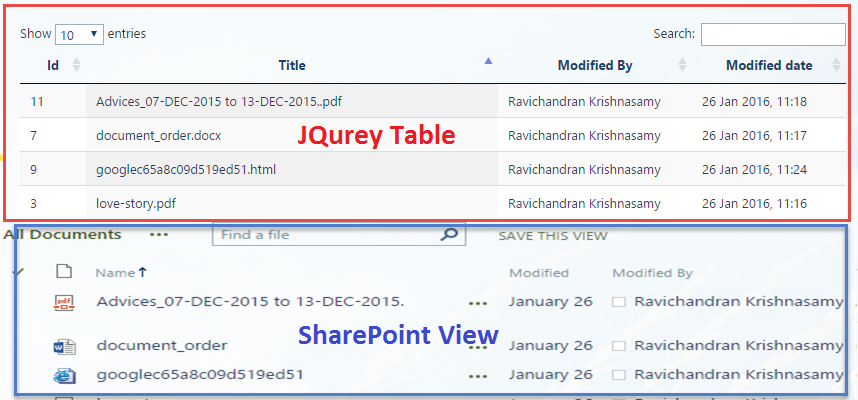
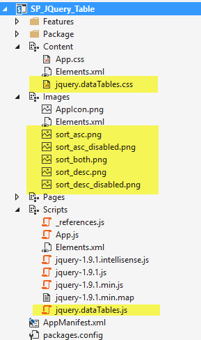

# SharePoint List to JQuery Table
## Requires
- Visual Studio 2015
## License
- MIT
## Technologies
- jQuery
- Javascript
- HTML
- Sharepoint Online
- jQuery UI
- SharePoint Server 2013
- apps for SharePoint
- SharePoint Add-ins
## Topics
- jQuery
- Javascript
- Sharepoint Online
- SharePoint 2013
- SharePoint Apps
- Jquery Table
## Updated
- 02/25/2016
## Description

<h1>Introduction</h1>

We have lot of benefits using JQuery Table in SharePoint such as quick&nbsp;search, selecting of number of items in view, shorting and footer navigation. In this SharePoint Add-in, I&rsquo;m retrieving SharePoint list data and building HTML table, then the
 HTML table mapped with JQuery Table script. Read further for detailed step by step instruction to develop this SharePoint Add-In.

<h1><em style="font-size:10px">&nbsp;&nbsp;</em></h1>

<strong>Solution compatibility</strong>

This sample is tested with SharePoint Online

This sample also compatible with SharePoint 2013 and SharePoint 2016

 
<strong>To Modify and deploy this solution</strong>

Open visual studio 2015

On the file menu select Open -&gt; Project (Ctrl &#43; Shift &#43; o)

In the Open Project window navigate the directory and select solution file (.sln)

Open solution explorer windows and select project solution and click (F4) to open project propertiesChange the site URL property on the property window&nbsp;

Edit the code if required and click play button or (F5) in visual studio&nbsp;

&nbsp;

<strong>To add new resource file (.js or .css or Images) into project</strong>

Select a folder from solution explorer based on your file type (Images or Scripts or Content for CSS)

Right click and select &ldquo;Open Folder in File Explorer&rdquo; option

Now paste your files into the folderAgain in the solution explorer window at the top, click &ldquo;Show All Files&rdquo; icon

Now you can find the file without active icon, right click and select &ldquo;Include in Project&rdquo; Option

HTMLJavaScript

Edit|Remove

htmljs

<pre class="html">&lt;%--&nbsp;The&nbsp;following&nbsp;4&nbsp;lines&nbsp;are&nbsp;ASP.NET&nbsp;directives&nbsp;needed&nbsp;when&nbsp;using&nbsp;SharePoint&nbsp;components&nbsp;--%&gt;&nbsp;
&nbsp;
&lt;%@&nbsp;Page&nbsp;Inherits=&quot;<a class="libraryLink" href="https://msdn.microsoft.com/en-US/library/Microsoft.SharePoint.WebPartPages.WebPartPage.aspx" target="_blank" title="Auto generated link to Microsoft.SharePoint.WebPartPages.WebPartPage">Microsoft.SharePoint.WebPartPages.WebPartPage</a>,&nbsp;<a class="libraryLink" href="https://msdn.microsoft.com/en-US/library/Microsoft.SharePoint.aspx" target="_blank" title="Auto generated link to Microsoft.SharePoint">Microsoft.SharePoint</a>,&nbsp;Version=15.0.0.0,&nbsp;Culture=neutral,&nbsp;PublicKeyToken=71e9bce111e9429c&quot;&nbsp;MasterPageFile=&quot;~masterurl/default.master&quot;&nbsp;Language=&quot;C#&quot;&nbsp;%&gt;&nbsp;
&nbsp;
&lt;%@&nbsp;Register&nbsp;TagPrefix=&quot;Utilities&quot;&nbsp;Namespace=&quot;Microsoft.SharePoint.Utilities&quot;&nbsp;Assembly=&quot;<a class="libraryLink" href="https://msdn.microsoft.com/en-US/library/Microsoft.SharePoint.aspx" target="_blank" title="Auto generated link to Microsoft.SharePoint">Microsoft.SharePoint</a>,&nbsp;Version=15.0.0.0,&nbsp;Culture=neutral,&nbsp;PublicKeyToken=71e9bce111e9429c&quot;&nbsp;%&gt;&nbsp;
&lt;%@&nbsp;Register&nbsp;TagPrefix=&quot;WebPartPages&quot;&nbsp;Namespace=&quot;Microsoft.SharePoint.WebPartPages&quot;&nbsp;Assembly=&quot;<a class="libraryLink" href="https://msdn.microsoft.com/en-US/library/Microsoft.SharePoint.aspx" target="_blank" title="Auto generated link to Microsoft.SharePoint">Microsoft.SharePoint</a>,&nbsp;Version=15.0.0.0,&nbsp;Culture=neutral,&nbsp;PublicKeyToken=71e9bce111e9429c&quot;&nbsp;%&gt;&nbsp;
&lt;%@&nbsp;Register&nbsp;TagPrefix=&quot;SharePoint&quot;&nbsp;Namespace=&quot;Microsoft.SharePoint.WebControls&quot;&nbsp;Assembly=&quot;<a class="libraryLink" href="https://msdn.microsoft.com/en-US/library/Microsoft.SharePoint.aspx" target="_blank" title="Auto generated link to Microsoft.SharePoint">Microsoft.SharePoint</a>,&nbsp;Version=15.0.0.0,&nbsp;Culture=neutral,&nbsp;PublicKeyToken=71e9bce111e9429c&quot;&nbsp;%&gt;&nbsp;
&nbsp;
&lt;%--&nbsp;The&nbsp;markup&nbsp;and&nbsp;script&nbsp;in&nbsp;the&nbsp;following&nbsp;Content&nbsp;element&nbsp;will&nbsp;be&nbsp;placed&nbsp;in&nbsp;the&nbsp;&lt;head&gt;&nbsp;of&nbsp;the&nbsp;page&nbsp;--%&gt;&nbsp;
&lt;asp:Content&nbsp;ContentPlaceHolderID=&quot;PlaceHolderAdditionalPageHead&quot;&nbsp;runat=&quot;server&quot;&gt;&nbsp;
&nbsp;&nbsp;&nbsp;&nbsp;&lt;script&nbsp;type=&quot;text/javascript&quot;&nbsp;src=&quot;../Scripts/jquery-1.9.1.min.js&quot;&gt;&lt;/script&gt;&nbsp;
&nbsp;&nbsp;&nbsp;&nbsp;&lt;SharePoint:ScriptLink&nbsp;name=&quot;sp.js&quot;&nbsp;runat=&quot;server&quot;&nbsp;OnDemand=&quot;true&quot;&nbsp;LoadAfterUI=&quot;true&quot;&nbsp;Localizable=&quot;false&quot;&nbsp;/&gt;&nbsp;
&nbsp;&nbsp;&nbsp;&nbsp;&lt;meta&nbsp;name=&quot;WebPartPageExpansion&quot;&nbsp;content=&quot;full&quot;&nbsp;/&gt;&nbsp;
&nbsp;
&nbsp;&nbsp;&nbsp;&nbsp;&lt;!--&nbsp;Add&nbsp;your&nbsp;CSS&nbsp;styles&nbsp;to&nbsp;the&nbsp;following&nbsp;file&nbsp;--&gt;&nbsp;
&nbsp;&nbsp;&nbsp;&nbsp;&lt;link&nbsp;rel=&quot;Stylesheet&quot;&nbsp;type=&quot;text/css&quot;&nbsp;href=&quot;../Content/App.css&quot;&nbsp;/&gt;&nbsp;
&nbsp;&nbsp;&nbsp;&nbsp;&lt;link&nbsp;href=&quot;../Content/jquery.dataTables.css&quot;&nbsp;rel=&quot;stylesheet&quot;&nbsp;/&gt;&nbsp;
&nbsp;&nbsp;&nbsp;&nbsp;&lt;!--&nbsp;Add&nbsp;your&nbsp;JavaScript&nbsp;to&nbsp;the&nbsp;following&nbsp;file&nbsp;--&gt;&nbsp;
&nbsp;&nbsp;&nbsp;&nbsp;&lt;script&nbsp;type=&quot;text/javascript&quot;&nbsp;src=&quot;../Scripts/App.js&quot;&gt;&lt;/script&gt;&nbsp;
&nbsp;&nbsp;&nbsp;&nbsp;&lt;script&nbsp;type=&quot;text/javascript&quot;&nbsp;src=&quot;../Scripts/jquery.dataTables.js&quot;&gt;&lt;/script&gt;&nbsp;
&lt;/asp:Content&gt;&nbsp;
&nbsp;
&lt;%--&nbsp;The&nbsp;markup&nbsp;in&nbsp;the&nbsp;following&nbsp;Content&nbsp;element&nbsp;will&nbsp;be&nbsp;placed&nbsp;in&nbsp;the&nbsp;TitleArea&nbsp;of&nbsp;the&nbsp;page&nbsp;--%&gt;&nbsp;
&lt;asp:Content&nbsp;ContentPlaceHolderID=&quot;PlaceHolderPageTitleInTitleArea&quot;&nbsp;runat=&quot;server&quot;&gt;&nbsp;
&nbsp;&nbsp;&nbsp;&nbsp;SharePoint&nbsp;List&nbsp;to&nbsp;JQuery&nbsp;Table&nbsp;
&lt;/asp:Content&gt;&nbsp;
&nbsp;
&lt;%--&nbsp;The&nbsp;markup&nbsp;and&nbsp;script&nbsp;in&nbsp;the&nbsp;following&nbsp;Content&nbsp;element&nbsp;will&nbsp;be&nbsp;placed&nbsp;in&nbsp;the&nbsp;&lt;body&gt;&nbsp;of&nbsp;the&nbsp;page&nbsp;--%&gt;&nbsp;
&lt;asp:Content&nbsp;ContentPlaceHolderID=&quot;PlaceHolderMain&quot;&nbsp;runat=&quot;server&quot;&gt;&nbsp;
&nbsp;
&nbsp;&nbsp;&nbsp;&nbsp;&lt;div&nbsp;id=&quot;DivSPGrid&quot;&gt;&nbsp;
&nbsp;&nbsp;&nbsp;&nbsp;&nbsp;&nbsp;&nbsp;&nbsp;
&nbsp;&nbsp;&nbsp;&nbsp;&lt;/div&gt;&nbsp;
&nbsp;
&lt;/asp:Content&gt;&nbsp;</pre>

*****************************************************************************************************

Hope you find this sample helpful, check out my other samples too.

Give five stars if you wish to appreciate my work.

Facebook page URL:&nbsp;<a title="https://www.facebook.com/sptechnet2016/" href="https://www.facebook.com/sptechnet2016/" target="_blank">https://www.facebook.com/sptechnet2016/</a>

Blog URL:&nbsp;<a title="https://sptechnet.wordpress.com/" href="https://sptechnet.wordpress.com/" target="_blank">https://sptechnet.wordpress.com/</a>

*****************************************************************************************************

<em> 
</em>

<em> 
</em>

