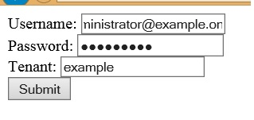

# SharePoint Online Authentication via JavaScript
## License
- MS-LPL
## Technologies
- jQuery
- Javascript
- Sharepoint Online
- SharePoint Server 2013
- Jquery Ajax
## Topics
- jQuery
- Sharepoint Online
## Updated
- 09/28/2017
## Description

<h1>Introduction</h1>

SP Online gives developers the flexibility to interact with SP using a number of mechanisms. There has been a significant investment from the SharePoint product group in the middle tier service layers exposing SharePoint functionality via services which
 adhere to protocols such as <a href="http://msdn.microsoft.com/en-us/library/office/apps/fp142380.aspx">
REST </a>and <a href="http://msdn.microsoft.com/en-us/library/office/apps/fp142385.aspx">
OData</a>. Technologies such as JavaScript over the past decade have become ever so extensible allowing developers to create richer dynamic user interfaces.

This sample shows how developers can authenticate remotely with SharePoint Online using JavaScript, enabling us to interact with the
<a href="http://msdn.microsoft.com/en-us/library/office/apps/jj860569.aspx">SharePoint service layer</a>. A compelling scenario where this can be used is within &lsquo;Apps for Office&rsquo; where an App running within Word or Excel can authenticate against
 SPOnline and use the functionality to update/retrieve information from SharePoint. Note that the STS that is used in this sample may subjectively change in the future release.

The code sample comprises of the following functionality:

<h2>The Form</h2>

The form is a simple HTML form capturing data such as the Username, this would be in the format of
<a href="mailto:xyz@tenant.onmicrosoft.com">xyz@tenant.onmicrosoft.com</a>. The password which is used to authenticate against SPOnline and the name of the tenant, this would be the first part of the tenant name such as
<strong>zyx</strong>.sharepoint.com.

&nbsp;

<h2>SPAuth.js</h2>

The JavaScript file defines methods which allow us to authenticate against SPOnline and subsequently call the SharePoint RESTful web services to retrieve information from the SharePoint server.

The <a href="https://login.microsoftonline.com/extSTS.srf">https://login.microsoftonline.com/extSTS.srf</a> is the url of the STS server to which we pass through the SOAP envelope containing the username and password as captured in the form. The STS returns
 back a binary token. Once we successfully receive the token we POST the binary token to the SharePoint url /_forms/default.aspx, this page returns back the FedAuth cookie. We can now use this cookie to make further calls to the SharePoint web services.

As an example, I have retrieved some values from the SP Web property bag but you can utlise this approach to perform CRUD operations exposed by the RESTful interfaces&nbsp;

