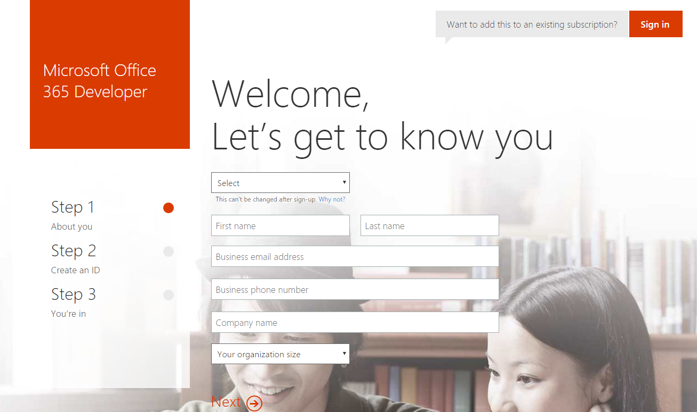
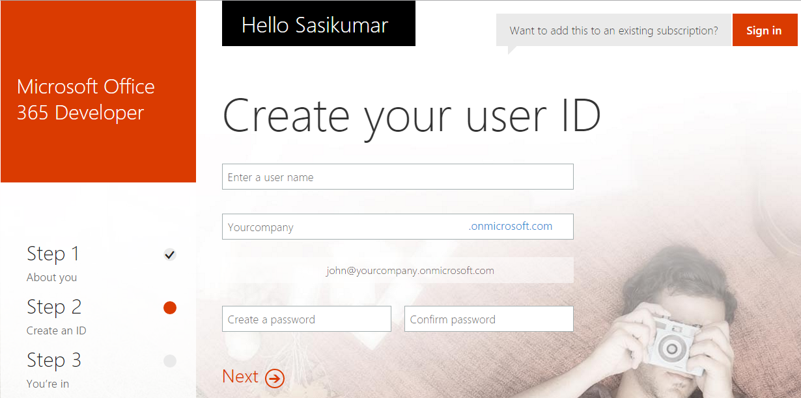
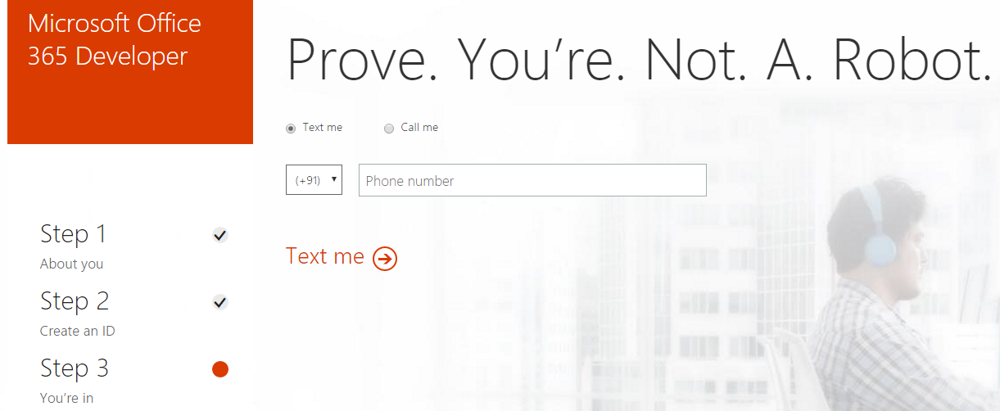
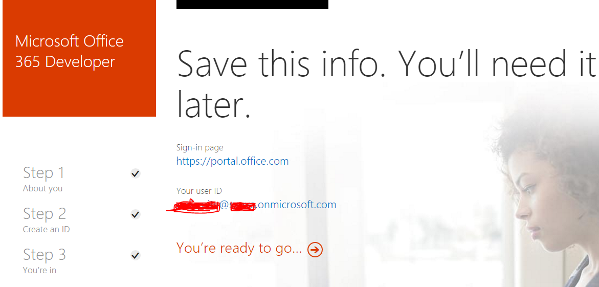
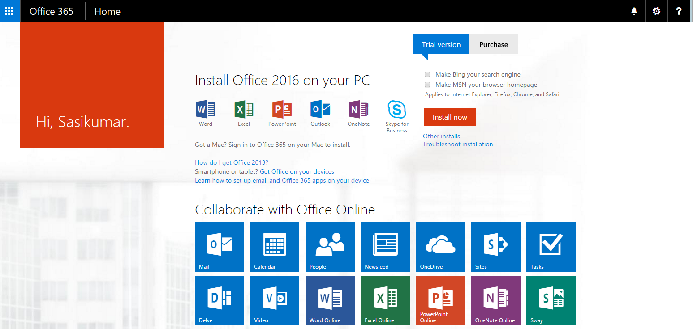
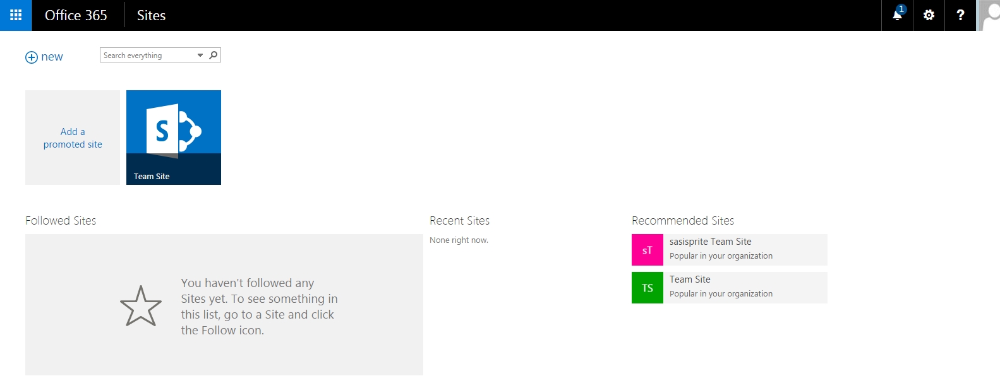

# SharePoint Online Subscription
## License
- MIT
## Technologies
- Office 365
- Sharepoint Online
- Cloud
## Topics
- SharePoint
- Office 365
- Sharepoint Online
## Updated
- 05/13/2016
## Description

<h1 class="Publishwithline">SharePoint Online subscription for trial</h1>

&nbsp;

Hey SharePoint Techies,

Nowadays everybody is working in a cloud and why don't you ?

Get the free the O365 trial subscription and learn the new features of SharePoint and other tools of Microsoft and make your work easier.

Here are the steps to get the O365 subscription.

&nbsp;

&nbsp;

<h2><strong>Step: 1</strong></h2>
<h3><a href="https://portal.office.com/Signup/Signup.aspx?OfferId=6881A1CB-F4EB-4db3-9F18-388898DAF510&DL=DEVELOPERPACK&ali=1#0">Click here</a> to register for Microsoft Office 365 Developer subscription</h3>

&nbsp;

&nbsp;

<h2><strong>Step 2:</strong></h2>
<h3>Create your user ID and your own domain</h3>

&nbsp;

<h2><strong>Step 3: </strong></h2>
<h3>Verify your identity</h3>

&nbsp;

&nbsp;

&nbsp;

<h2><strong>Step 4:</strong></h2>
<h3>Enter your verification code</h3>

&nbsp;

&nbsp;

<h2><strong>Step 5:</strong></h2>
<h3>That&rsquo;s it!! Now your cloud is ready to create your own site. Click &rdquo;Ready to go&rdquo;</h3>

&nbsp;

&nbsp;

&nbsp;

<h3>Your &ldquo;One Drive&rdquo; will be ready in few seconds and you will get all the O365 tools. &nbsp;Mail , Calendar, people will be configured immediately once you finish you the sign up process. &nbsp;</h3>
<h3>Refer the snapshot below.</h3>

&nbsp;

&nbsp;

&nbsp;

&nbsp;

<h1><strong>Step 6: </strong></h1>
<h3>Click the &ldquo;Sites&rdquo; icon to open the SharePoint portal.</h3>
<h3>There you go!! You will find the SharePoint Online site management screen. You can create a new site and subsites as well.</h3>

&nbsp;

&nbsp;

&nbsp;

Note:&nbsp;

<h3>You can subscibe with any or your email ID's. You dont need to have the Microsoft email id to get this subscription.&nbsp;</h3>
<h3><a href="http://portal.office.com/">http://portal.office.com</a> will be your sign in / home page always.</h3>
<h3>Create site. Upload files. Share with anyone across the globe.</h3>
<h3>Enjoy SharePoint Online!!</h3>
<h2><strong>For More details ping me in <a href="http://www.linkedin.com/in/sasisprite">
LinkedIn</a> <a href="mailto:syuva@sasisprite.onmicrosoft.com">O365</a> </strong>
</h2>

&nbsp;

&nbsp;

&nbsp;

&nbsp;

