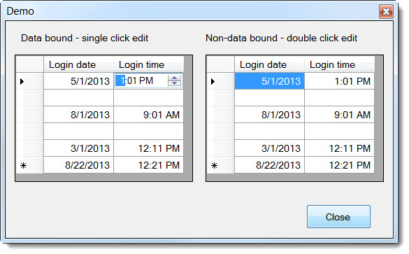

# Show and edit date only and time only in a DataGridView
## Requires
- Visual Studio 2015
## License
- Apache License, Version 2.0
## Technologies
- Windows Forms
- VB.Net
## Topics
- Controls
- Data Binding
- Data Access
## Updated
- 04/18/2017
## Description

Description

This article is for those who would like to have the ability to edit date and time values in a DataGridView using two special DataGridViewColumns where the base class was done as an example by Microsoft to show how to create
 special columns. In the original Microsoft demo column for using a DateTimePicker for in place editing they did not provide any assertion for dealing with NULL values which is really easy for anyone who is a seasoned .NET developer yet far from easy for newcomers
 to the .NET family.

Besides showing how to deal with NULL values the attached project has another class in short for showing only time values. There are two language extensions that permit a developer to give their user's the ability to single
 click a cell to enter into edit mode.

Even though there is no database used to populate either DataGridView this will still work from loading data from a database as what matters is we are dealing with a DataTable in regards to data from databases. In the second
 DataGridView I populate rows from the data in the first DataGridView but since we are adding rows and not setting the DataSource this DataGridView is un-bound.

<strong>Update: 4/2017</strong> have added a C# project to demo the columns. The C# project uses SQL-Server while the VB.NET uses MS-Access. Why different databases? From what I've seen on the forums that C# developers are more
 likely to use SQL-Server while VB.NET developers lean towards MS-Access. Either way the only real difference is the data provider e.g. either OleDb or SqlClient, queries are the same and the container (DataTable) are the same.

Original Microsoft example

<a href="http://msdn.microsoft.com/en-us/library/7tas5c80.aspx">How to: Host Controls in Windows Forms DataGridView cells</a>

See also&nbsp;

<a href="http://code.msdn.microsoft.com/Custom-calendar-column-for-0c8c8c96">Custom calendar column for a DataGridView</a>.

&nbsp;

<strong>Build instructions</strong>

Simply build the project and play with both DataGridView controls

&nbsp;

Updated to VS2015 April 2017

&nbsp;

&nbsp;

<em>. &nbsp;&nbsp;</em>

