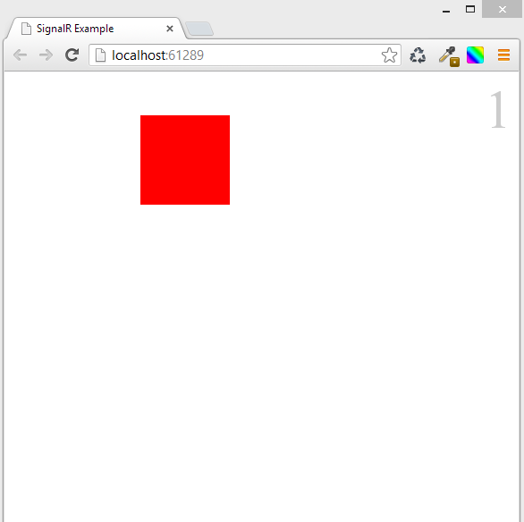

# SignalR, very simple example
## Requires
- Visual Studio 2012
## License
- MS-LPL
## Technologies
- C#
- SignalR
- ASP.NET SignalR
## Topics
- SignalR
- ASP.NET SignalR
## Updated
- 08/26/2013
## Description

<h1>Introduction</h1>

<em>This is a very simple example of how we can use SignalR, based on the microsoft virtual academy cource
<a href="http://www.microsoftvirtualacademy.com/Content/ViewContent.aspx?et=2507&m=2505&ct=15703#fbid=0iBWJyz1tez">
&quot;Building apps with ASP.NET 4.5&quot;</a>,&nbsp; , it can be used like a gide to build a more complex web app.
</em><em>This solution requires NuGet packages to be downloaded. Visual Studio will download the necessary packages automatically.&nbsp;This solution is designed for Visual Studio 2012</em>

&nbsp;

Description

<em>This&nbsp;application displays a div shape that the users can drag. The position of the shape&nbsp;in all other browsers&nbsp;will then be updated to match the position of the dragged shape.</em>

 
<em>As the server component </em><em>this web page contains a C# implementation of the SignalR Hub class , and
</em><em>as the client component</em><em> an HTML page using JQuery .</em>

<em>This concepts are associated with applications in real-time gaming and other simulation applications.</em>

Index.html

HTML

Edit|Remove

html
<pre class="hidden">&lt;!DOCTYPE html&gt;
&lt;html xmlns=&quot;http://www.w3.org/1999/xhtml&quot;&gt;
&lt;head&gt;
    &lt;title&gt;SignalR Example&lt;/title&gt;
     
&lt;/head&gt;
&lt;body&gt;
 
    &lt;div id=&quot;count&quot;&gt;0&lt;/div&gt;
    &lt;div id=&quot;shape&quot;&gt;&lt;/div&gt;

    &lt;script src=&quot;Scripts/jquery-1.6.4.js&quot;&gt;&lt;/script&gt;
    &lt;script src=&quot;Scripts/jquery-ui-1.10.3.js&quot;&gt;&lt;/script&gt;
    &lt;script src=&quot;Scripts/jquery.signalR-1.1.3.js&quot;&gt;&lt;/script&gt;
    &lt;script src=&quot;/signalr/hubs&quot;&gt;&lt;/script&gt; &lt;!--this is for automatically 
generate a javascript proxy class for our server class--&gt;
    &lt;script&gt;

        $(function () {

            var hub = $.connection.moveShape, //set hub with the server side class
               $shape = $(&quot;#shape&quot;);

            hub.client.usersConnected = function (numUsers) { //this instanciate the 
usersConnected function receiving the numUsers parameter which is the number of users connected
               $(&quot;#count&quot;).text(numUsers); //show the number of users connected inside a div
            };

           

            hub.client.shapeMoved = function (x, y) { //this instanciate the shapeMoved function 
receiving x, y 
                $shape.css({ left: x, top: y }); //this moves the shape in the clients to 
the coords x, y 
            };

            $.connection.hub.start().done(function () {//when the connection is ready, 
we going to make the shape draggable
                $shape.draggable({
                    drag: function () { //when the user drag the shape, we going to 
send to the server the x, y values
                        hub.server.moveShape(this.offsetLeft, this.offsetTop || 0);
                    }
                });
            });
        });

    &lt;/script&gt;
&lt;/body&gt;
&lt;/html&gt;
</pre>

<pre class="html">&lt;!DOCTYPE&nbsp;html&gt;&nbsp;
&lt;html&nbsp;xmlns=&quot;http://www.w3.org/1999/xhtml&quot;&gt;&nbsp;
&lt;head&gt;&nbsp;
&nbsp;&nbsp;&nbsp;&nbsp;&lt;title&gt;SignalR&nbsp;Example&lt;/title&gt;&nbsp;
&nbsp;&nbsp;&nbsp;&nbsp;&nbsp;&lt;style&gt;&nbsp;
&nbsp;&nbsp;&nbsp;&nbsp;&nbsp;&nbsp;&nbsp;&nbsp;#shape&nbsp;{&nbsp;
&nbsp;&nbsp;&nbsp;&nbsp;&nbsp;&nbsp;&nbsp;&nbsp;&nbsp;&nbsp;&nbsp;&nbsp;width:&nbsp;100px;&nbsp;
&nbsp;&nbsp;&nbsp;&nbsp;&nbsp;&nbsp;&nbsp;&nbsp;&nbsp;&nbsp;&nbsp;&nbsp;height:&nbsp;100px;&nbsp;
&nbsp;&nbsp;&nbsp;&nbsp;&nbsp;&nbsp;&nbsp;&nbsp;&nbsp;&nbsp;&nbsp;&nbsp;background-color:&nbsp;#FF0000;&nbsp;
&nbsp;&nbsp;&nbsp;&nbsp;&nbsp;&nbsp;&nbsp;&nbsp;&nbsp;&nbsp;&nbsp;&nbsp;cursor:move;&nbsp;
&nbsp;&nbsp;&nbsp;&nbsp;&nbsp;&nbsp;&nbsp;&nbsp;}&nbsp;
&nbsp;
&nbsp;&nbsp;&nbsp;&nbsp;&nbsp;&nbsp;&nbsp;&nbsp;&nbsp;#count&nbsp;{&nbsp;
&nbsp;&nbsp;&nbsp;&nbsp;&nbsp;&nbsp;&nbsp;&nbsp;&nbsp;&nbsp;&nbsp;&nbsp;&nbsp;font-size:60px;&nbsp;
&nbsp;&nbsp;&nbsp;&nbsp;&nbsp;&nbsp;&nbsp;&nbsp;&nbsp;&nbsp;&nbsp;&nbsp;&nbsp;color:#cccccc;&nbsp;
&nbsp;&nbsp;&nbsp;&nbsp;&nbsp;&nbsp;&nbsp;&nbsp;&nbsp;&nbsp;&nbsp;&nbsp;&nbsp;float:right;&nbsp;
&nbsp;&nbsp;&nbsp;&nbsp;&nbsp;&nbsp;&nbsp;&nbsp;&nbsp;}&nbsp;
&nbsp;&nbsp;&nbsp;&nbsp;&lt;/style&gt;&nbsp;
&lt;/head&gt;&nbsp;
&lt;body&gt;&nbsp;
&nbsp;&nbsp;
&nbsp;&nbsp;&nbsp;&nbsp;&lt;div&nbsp;id=&quot;count&quot;&gt;0&lt;/div&gt;&nbsp;
&nbsp;&nbsp;&nbsp;&nbsp;&lt;div&nbsp;id=&quot;shape&quot;&gt;&lt;/div&gt;&nbsp;
&nbsp;
&nbsp;&nbsp;&nbsp;&nbsp;&lt;script&nbsp;src=&quot;Scripts/jquery-1.6.4.js&quot;&gt;&lt;/script&gt;&nbsp;
&nbsp;&nbsp;&nbsp;&nbsp;&lt;script&nbsp;src=&quot;Scripts/jquery-ui-1.10.3.js&quot;&gt;&lt;/script&gt;&nbsp;
&nbsp;&nbsp;&nbsp;&nbsp;&lt;script&nbsp;src=&quot;Scripts/jquery.signalR-1.1.3.js&quot;&gt;&lt;/script&gt;&nbsp;
&nbsp;&nbsp;&nbsp;&nbsp;&lt;script&nbsp;src=&quot;/signalr/hubs&quot;&gt;&lt;/script&gt;&nbsp;&lt;!--this&nbsp;is&nbsp;for&nbsp;automatically&nbsp;&nbsp;
generate&nbsp;a&nbsp;javascript&nbsp;proxy&nbsp;class&nbsp;for&nbsp;our&nbsp;server&nbsp;class--&gt;&nbsp;
&nbsp;&nbsp;&nbsp;&nbsp;&lt;script&gt;&nbsp;
&nbsp;
&nbsp;&nbsp;&nbsp;&nbsp;&nbsp;&nbsp;&nbsp;&nbsp;$(function&nbsp;()&nbsp;{&nbsp;
&nbsp;
&nbsp;&nbsp;&nbsp;&nbsp;&nbsp;&nbsp;&nbsp;&nbsp;&nbsp;&nbsp;&nbsp;&nbsp;var&nbsp;hub&nbsp;=&nbsp;$.connection.moveShape,&nbsp;//set&nbsp;hub&nbsp;with&nbsp;the&nbsp;server&nbsp;side&nbsp;class&nbsp;
&nbsp;&nbsp;&nbsp;&nbsp;&nbsp;&nbsp;&nbsp;&nbsp;&nbsp;&nbsp;&nbsp;&nbsp;&nbsp;&nbsp;&nbsp;$shape&nbsp;=&nbsp;$(&quot;#shape&quot;);&nbsp;
&nbsp;
&nbsp;
&nbsp;
&nbsp;&nbsp;&nbsp;&nbsp;&nbsp;&nbsp;&nbsp;&nbsp;&nbsp;&nbsp;&nbsp;&nbsp;hub.client.usersConnected&nbsp;=&nbsp;function&nbsp;(numUsers)&nbsp;{&nbsp;//this&nbsp;instanciate&nbsp;the&nbsp;&nbsp;
usersConnected&nbsp;function&nbsp;receiving&nbsp;the&nbsp;numUsers&nbsp;parameter&nbsp;which&nbsp;is&nbsp;the&nbsp;number&nbsp;of&nbsp;users&nbsp;connected&nbsp;
&nbsp;&nbsp;&nbsp;&nbsp;&nbsp;&nbsp;&nbsp;&nbsp;&nbsp;&nbsp;&nbsp;&nbsp;&nbsp;&nbsp;&nbsp;$(&quot;#count&quot;).text(numUsers);&nbsp;//show&nbsp;the&nbsp;number&nbsp;of&nbsp;users&nbsp;connected&nbsp;inside&nbsp;a&nbsp;div&nbsp;
&nbsp;&nbsp;&nbsp;&nbsp;&nbsp;&nbsp;&nbsp;&nbsp;&nbsp;&nbsp;&nbsp;&nbsp;};&nbsp;
&nbsp;
&nbsp;
&nbsp;&nbsp;&nbsp;&nbsp;&nbsp;&nbsp;&nbsp;&nbsp;&nbsp;&nbsp;&nbsp;&nbsp;
&nbsp;
&nbsp;&nbsp;&nbsp;&nbsp;&nbsp;&nbsp;&nbsp;&nbsp;&nbsp;&nbsp;&nbsp;&nbsp;hub.client.shapeMoved&nbsp;=&nbsp;function&nbsp;(x,&nbsp;y)&nbsp;{&nbsp;//this&nbsp;instanciate&nbsp;the&nbsp;shapeMoved&nbsp;function&nbsp;&nbsp;
receiving&nbsp;x,&nbsp;y&nbsp;&nbsp;
&nbsp;&nbsp;&nbsp;&nbsp;&nbsp;&nbsp;&nbsp;&nbsp;&nbsp;&nbsp;&nbsp;&nbsp;&nbsp;&nbsp;&nbsp;&nbsp;$shape.css({&nbsp;left:&nbsp;x,&nbsp;top:&nbsp;y&nbsp;});&nbsp;//this&nbsp;moves&nbsp;the&nbsp;shape&nbsp;in&nbsp;the&nbsp;clients&nbsp;to&nbsp;&nbsp;
the&nbsp;coords&nbsp;x,&nbsp;y&nbsp;&nbsp;
&nbsp;&nbsp;&nbsp;&nbsp;&nbsp;&nbsp;&nbsp;&nbsp;&nbsp;&nbsp;&nbsp;&nbsp;};&nbsp;
&nbsp;
&nbsp;&nbsp;&nbsp;&nbsp;&nbsp;&nbsp;&nbsp;&nbsp;&nbsp;&nbsp;&nbsp;&nbsp;$.connection.hub.start().done(function&nbsp;()&nbsp;{//when&nbsp;the&nbsp;connection&nbsp;is&nbsp;ready,&nbsp;&nbsp;
we&nbsp;going&nbsp;to&nbsp;make&nbsp;the&nbsp;shape&nbsp;draggable&nbsp;
&nbsp;&nbsp;&nbsp;&nbsp;&nbsp;&nbsp;&nbsp;&nbsp;&nbsp;&nbsp;&nbsp;&nbsp;&nbsp;&nbsp;&nbsp;&nbsp;$shape.draggable({&nbsp;
&nbsp;&nbsp;&nbsp;&nbsp;&nbsp;&nbsp;&nbsp;&nbsp;&nbsp;&nbsp;&nbsp;&nbsp;&nbsp;&nbsp;&nbsp;&nbsp;&nbsp;&nbsp;&nbsp;&nbsp;drag:&nbsp;function&nbsp;()&nbsp;{&nbsp;//when&nbsp;the&nbsp;user&nbsp;drag&nbsp;the&nbsp;shape,&nbsp;we&nbsp;going&nbsp;to&nbsp;&nbsp;
send&nbsp;to&nbsp;the&nbsp;server&nbsp;the&nbsp;x,&nbsp;y&nbsp;values&nbsp;
&nbsp;&nbsp;&nbsp;&nbsp;&nbsp;&nbsp;&nbsp;&nbsp;&nbsp;&nbsp;&nbsp;&nbsp;&nbsp;&nbsp;&nbsp;&nbsp;&nbsp;&nbsp;&nbsp;&nbsp;&nbsp;&nbsp;&nbsp;&nbsp;hub.server.moveShape(this.offsetLeft,&nbsp;this.offsetTop&nbsp;||&nbsp;0);&nbsp;
&nbsp;&nbsp;&nbsp;&nbsp;&nbsp;&nbsp;&nbsp;&nbsp;&nbsp;&nbsp;&nbsp;&nbsp;&nbsp;&nbsp;&nbsp;&nbsp;&nbsp;&nbsp;&nbsp;&nbsp;}&nbsp;
&nbsp;&nbsp;&nbsp;&nbsp;&nbsp;&nbsp;&nbsp;&nbsp;&nbsp;&nbsp;&nbsp;&nbsp;&nbsp;&nbsp;&nbsp;&nbsp;});&nbsp;
&nbsp;&nbsp;&nbsp;&nbsp;&nbsp;&nbsp;&nbsp;&nbsp;&nbsp;&nbsp;&nbsp;&nbsp;});&nbsp;
&nbsp;&nbsp;&nbsp;&nbsp;&nbsp;&nbsp;&nbsp;&nbsp;});&nbsp;
&nbsp;
&nbsp;&nbsp;&nbsp;&nbsp;&lt;/script&gt;&nbsp;
&lt;/body&gt;&nbsp;
&lt;/html&gt;&nbsp;
</pre>

&nbsp;

MoveShapeHub.cs

&nbsp;

C#

Edit|Remove

csharp
<pre class="hidden">using Microsoft.AspNet.SignalR;
using Microsoft.AspNet.SignalR.Hubs;
using System;
using System.Collections.Generic;
using System.Linq;
using System.Threading.Tasks;
using System.Web;

namespace SignalR.MoveShape
{
    
    public static class UserHandler //this static class is to store the number of 
users conected at the same time
    {
        public static HashSet&lt;string&gt; ConnectedIds = new HashSet&lt;string&gt;();
    }

    [HubName(&quot;moveShape&quot;)]   //this is for use a name to use in the client
    public class MoveShapeHub : Hub
    {
        public void moveShape(int x, int y) // this method will be called from 
the client, when the user drag/move the shape
        {
            
            Clients.Others.shapeMoved(x, y); // this method will send the coord x, y 
to the other users but the user draging the shape
          
        }

        public override Task OnConnected() //override OnConnect, OnReconnected and OnDisconnected 
to know if a user is connected or disconnected
        {
            UserHandler.ConnectedIds.Add(Context.ConnectionId); //add a connection id to the list
            Clients.All.usersConnected(UserHandler.ConnectedIds.Count()); //this will send to ALL the clients 
the number of users connected
            return base.OnConnected();
        }

        public override Task OnReconnected()
        {
            UserHandler.ConnectedIds.Add(Context.ConnectionId);
            Clients.All.usersConnected(UserHandler.ConnectedIds.Count());
            return base.OnConnected();
        }

        public override Task OnDisconnected()
        {
            UserHandler.ConnectedIds.Remove(Context.ConnectionId);
            Clients.All.usersConnected(UserHandler.ConnectedIds.Count());
            return base.OnDisconnected();
        }

        
    }
}</pre>

<pre class="csharp">using&nbsp;Microsoft.AspNet.SignalR;&nbsp;
using&nbsp;Microsoft.AspNet.SignalR.Hubs;&nbsp;
using&nbsp;System;&nbsp;
using&nbsp;System.Collections.Generic;&nbsp;
using&nbsp;System.Linq;&nbsp;
using&nbsp;System.Threading.Tasks;&nbsp;
using&nbsp;System.Web;&nbsp;
&nbsp;
namespace&nbsp;SignalR.MoveShape&nbsp;
{&nbsp;
&nbsp;&nbsp;&nbsp;&nbsp;&nbsp;
&nbsp;&nbsp;&nbsp;&nbsp;public&nbsp;static&nbsp;class&nbsp;UserHandler&nbsp;//this&nbsp;static&nbsp;class&nbsp;is&nbsp;to&nbsp;store&nbsp;the&nbsp;number&nbsp;of&nbsp;&nbsp;
users&nbsp;conected&nbsp;at&nbsp;the&nbsp;same&nbsp;time&nbsp;
&nbsp;&nbsp;&nbsp;&nbsp;{&nbsp;
&nbsp;&nbsp;&nbsp;&nbsp;&nbsp;&nbsp;&nbsp;&nbsp;public&nbsp;static&nbsp;HashSet&lt;string&gt;&nbsp;ConnectedIds&nbsp;=&nbsp;new&nbsp;HashSet&lt;string&gt;();&nbsp;
&nbsp;&nbsp;&nbsp;&nbsp;}&nbsp;
&nbsp;
&nbsp;&nbsp;&nbsp;&nbsp;[HubName(&quot;moveShape&quot;)]&nbsp;&nbsp;&nbsp;//this&nbsp;is&nbsp;for&nbsp;use&nbsp;a&nbsp;name&nbsp;to&nbsp;use&nbsp;in&nbsp;the&nbsp;client&nbsp;
&nbsp;&nbsp;&nbsp;&nbsp;public&nbsp;class&nbsp;MoveShapeHub&nbsp;:&nbsp;Hub&nbsp;
&nbsp;&nbsp;&nbsp;&nbsp;{&nbsp;
&nbsp;&nbsp;&nbsp;&nbsp;&nbsp;&nbsp;&nbsp;&nbsp;public&nbsp;void&nbsp;moveShape(int&nbsp;x,&nbsp;int&nbsp;y)&nbsp;//&nbsp;this&nbsp;method&nbsp;will&nbsp;be&nbsp;called&nbsp;from&nbsp;&nbsp;
the&nbsp;client,&nbsp;when&nbsp;the&nbsp;user&nbsp;drag/move&nbsp;the&nbsp;shape&nbsp;
&nbsp;&nbsp;&nbsp;&nbsp;&nbsp;&nbsp;&nbsp;&nbsp;{&nbsp;
&nbsp;&nbsp;&nbsp;&nbsp;&nbsp;&nbsp;&nbsp;&nbsp;&nbsp;&nbsp;&nbsp;&nbsp;&nbsp;
&nbsp;&nbsp;&nbsp;&nbsp;&nbsp;&nbsp;&nbsp;&nbsp;&nbsp;&nbsp;&nbsp;&nbsp;Clients.Others.shapeMoved(x,&nbsp;y);&nbsp;//&nbsp;this&nbsp;method&nbsp;will&nbsp;send&nbsp;the&nbsp;coord&nbsp;x,&nbsp;y&nbsp;&nbsp;
to&nbsp;the&nbsp;other&nbsp;users&nbsp;but&nbsp;the&nbsp;user&nbsp;draging&nbsp;the&nbsp;shape&nbsp;
&nbsp;&nbsp;&nbsp;&nbsp;&nbsp;&nbsp;&nbsp;&nbsp;&nbsp;&nbsp;&nbsp;
&nbsp;&nbsp;&nbsp;&nbsp;&nbsp;&nbsp;&nbsp;&nbsp;}&nbsp;
&nbsp;
&nbsp;&nbsp;&nbsp;&nbsp;&nbsp;&nbsp;&nbsp;&nbsp;public&nbsp;override&nbsp;Task&nbsp;OnConnected()&nbsp;//override&nbsp;OnConnect,&nbsp;OnReconnected&nbsp;and&nbsp;OnDisconnected&nbsp;&nbsp;
to&nbsp;know&nbsp;if&nbsp;a&nbsp;user&nbsp;is&nbsp;connected&nbsp;or&nbsp;disconnected&nbsp;
&nbsp;&nbsp;&nbsp;&nbsp;&nbsp;&nbsp;&nbsp;&nbsp;{&nbsp;
&nbsp;&nbsp;&nbsp;&nbsp;&nbsp;&nbsp;&nbsp;&nbsp;&nbsp;&nbsp;&nbsp;&nbsp;UserHandler.ConnectedIds.Add(Context.ConnectionId);&nbsp;//add&nbsp;a&nbsp;connection&nbsp;id&nbsp;to&nbsp;the&nbsp;list&nbsp;
&nbsp;&nbsp;&nbsp;&nbsp;&nbsp;&nbsp;&nbsp;&nbsp;&nbsp;&nbsp;&nbsp;&nbsp;Clients.All.usersConnected(UserHandler.ConnectedIds.Count());&nbsp;//this&nbsp;will&nbsp;send&nbsp;to&nbsp;ALL&nbsp;the&nbsp;clients&nbsp;&nbsp;
the&nbsp;number&nbsp;of&nbsp;users&nbsp;connected&nbsp;
&nbsp;&nbsp;&nbsp;&nbsp;&nbsp;&nbsp;&nbsp;&nbsp;&nbsp;&nbsp;&nbsp;&nbsp;return&nbsp;base.OnConnected();&nbsp;
&nbsp;&nbsp;&nbsp;&nbsp;&nbsp;&nbsp;&nbsp;&nbsp;}&nbsp;
&nbsp;
&nbsp;&nbsp;&nbsp;&nbsp;&nbsp;&nbsp;&nbsp;&nbsp;public&nbsp;override&nbsp;Task&nbsp;OnReconnected()&nbsp;
&nbsp;&nbsp;&nbsp;&nbsp;&nbsp;&nbsp;&nbsp;&nbsp;{&nbsp;
&nbsp;&nbsp;&nbsp;&nbsp;&nbsp;&nbsp;&nbsp;&nbsp;&nbsp;&nbsp;&nbsp;&nbsp;UserHandler.ConnectedIds.Add(Context.ConnectionId);&nbsp;
&nbsp;&nbsp;&nbsp;&nbsp;&nbsp;&nbsp;&nbsp;&nbsp;&nbsp;&nbsp;&nbsp;&nbsp;Clients.All.usersConnected(UserHandler.ConnectedIds.Count());&nbsp;
&nbsp;&nbsp;&nbsp;&nbsp;&nbsp;&nbsp;&nbsp;&nbsp;&nbsp;&nbsp;&nbsp;&nbsp;return&nbsp;base.OnConnected();&nbsp;
&nbsp;&nbsp;&nbsp;&nbsp;&nbsp;&nbsp;&nbsp;&nbsp;}&nbsp;
&nbsp;
&nbsp;&nbsp;&nbsp;&nbsp;&nbsp;&nbsp;&nbsp;&nbsp;public&nbsp;override&nbsp;Task&nbsp;OnDisconnected()&nbsp;
&nbsp;&nbsp;&nbsp;&nbsp;&nbsp;&nbsp;&nbsp;&nbsp;{&nbsp;
&nbsp;&nbsp;&nbsp;&nbsp;&nbsp;&nbsp;&nbsp;&nbsp;&nbsp;&nbsp;&nbsp;&nbsp;UserHandler.ConnectedIds.Remove(Context.ConnectionId);&nbsp;
&nbsp;&nbsp;&nbsp;&nbsp;&nbsp;&nbsp;&nbsp;&nbsp;&nbsp;&nbsp;&nbsp;&nbsp;Clients.All.usersConnected(UserHandler.ConnectedIds.Count());&nbsp;
&nbsp;&nbsp;&nbsp;&nbsp;&nbsp;&nbsp;&nbsp;&nbsp;&nbsp;&nbsp;&nbsp;&nbsp;return&nbsp;base.OnDisconnected();&nbsp;
&nbsp;&nbsp;&nbsp;&nbsp;&nbsp;&nbsp;&nbsp;&nbsp;}&nbsp;
&nbsp;
&nbsp;
&nbsp;&nbsp;&nbsp;&nbsp;&nbsp;&nbsp;&nbsp;&nbsp;&nbsp;
&nbsp;&nbsp;&nbsp;&nbsp;}&nbsp;
}</pre>

&nbsp;

&nbsp;

Globa.asax.cs

&nbsp;

C#

Edit|Remove

csharp
<pre class="hidden">using System;
using System.Collections.Generic;
using System.Linq;
using System.Web;
using System.Web.Routing;
using System.Web.Security;
using System.Web.SessionState;

namespace SignalR
{
    public class Global : System.Web.HttpApplication
    {

        public void Application_Start()
        {
            // Register the default hubs route: ~/signalr
            RouteTable.Routes.MapHubs();
        }

        protected void Session_Start(object sender, EventArgs e)
        {

        }

        protected void Application_BeginRequest(object sender, EventArgs e)
        {

        }

        protected void Application_AuthenticateRequest(object sender, EventArgs e)
        {

        }

        protected void Application_Error(object sender, EventArgs e)
        {

        }

        protected void Session_End(object sender, EventArgs e)
        {

        }

        protected void Application_End(object sender, EventArgs e)
        {

        }
    }
}</pre>

<pre class="csharp">using&nbsp;System;&nbsp;
using&nbsp;System.Collections.Generic;&nbsp;
using&nbsp;System.Linq;&nbsp;
using&nbsp;System.Web;&nbsp;
using&nbsp;System.Web.Routing;&nbsp;
using&nbsp;System.Web.Security;&nbsp;
using&nbsp;System.Web.SessionState;&nbsp;
&nbsp;
namespace&nbsp;SignalR&nbsp;
{&nbsp;
&nbsp;&nbsp;&nbsp;&nbsp;public&nbsp;class&nbsp;Global&nbsp;:&nbsp;System.Web.HttpApplication&nbsp;
&nbsp;&nbsp;&nbsp;&nbsp;{&nbsp;
&nbsp;
&nbsp;&nbsp;&nbsp;&nbsp;&nbsp;&nbsp;&nbsp;&nbsp;public&nbsp;void&nbsp;Application_Start()&nbsp;
&nbsp;&nbsp;&nbsp;&nbsp;&nbsp;&nbsp;&nbsp;&nbsp;{&nbsp;
&nbsp;&nbsp;&nbsp;&nbsp;&nbsp;&nbsp;&nbsp;&nbsp;&nbsp;&nbsp;&nbsp;&nbsp;//&nbsp;Register&nbsp;the&nbsp;default&nbsp;hubs&nbsp;route:&nbsp;~/signalr&nbsp;
&nbsp;&nbsp;&nbsp;&nbsp;&nbsp;&nbsp;&nbsp;&nbsp;&nbsp;&nbsp;&nbsp;&nbsp;RouteTable.Routes.MapHubs();&nbsp;
&nbsp;&nbsp;&nbsp;&nbsp;&nbsp;&nbsp;&nbsp;&nbsp;}&nbsp;
&nbsp;
&nbsp;&nbsp;&nbsp;&nbsp;&nbsp;&nbsp;&nbsp;&nbsp;protected&nbsp;void&nbsp;Session_Start(object&nbsp;sender,&nbsp;EventArgs&nbsp;e)&nbsp;
&nbsp;&nbsp;&nbsp;&nbsp;&nbsp;&nbsp;&nbsp;&nbsp;{&nbsp;
&nbsp;
&nbsp;&nbsp;&nbsp;&nbsp;&nbsp;&nbsp;&nbsp;&nbsp;}&nbsp;
&nbsp;
&nbsp;&nbsp;&nbsp;&nbsp;&nbsp;&nbsp;&nbsp;&nbsp;protected&nbsp;void&nbsp;Application_BeginRequest(object&nbsp;sender,&nbsp;EventArgs&nbsp;e)&nbsp;
&nbsp;&nbsp;&nbsp;&nbsp;&nbsp;&nbsp;&nbsp;&nbsp;{&nbsp;
&nbsp;
&nbsp;&nbsp;&nbsp;&nbsp;&nbsp;&nbsp;&nbsp;&nbsp;}&nbsp;
&nbsp;
&nbsp;&nbsp;&nbsp;&nbsp;&nbsp;&nbsp;&nbsp;&nbsp;protected&nbsp;void&nbsp;Application_AuthenticateRequest(object&nbsp;sender,&nbsp;EventArgs&nbsp;e)&nbsp;
&nbsp;&nbsp;&nbsp;&nbsp;&nbsp;&nbsp;&nbsp;&nbsp;{&nbsp;
&nbsp;
&nbsp;&nbsp;&nbsp;&nbsp;&nbsp;&nbsp;&nbsp;&nbsp;}&nbsp;
&nbsp;
&nbsp;&nbsp;&nbsp;&nbsp;&nbsp;&nbsp;&nbsp;&nbsp;protected&nbsp;void&nbsp;Application_Error(object&nbsp;sender,&nbsp;EventArgs&nbsp;e)&nbsp;
&nbsp;&nbsp;&nbsp;&nbsp;&nbsp;&nbsp;&nbsp;&nbsp;{&nbsp;
&nbsp;
&nbsp;&nbsp;&nbsp;&nbsp;&nbsp;&nbsp;&nbsp;&nbsp;}&nbsp;
&nbsp;
&nbsp;&nbsp;&nbsp;&nbsp;&nbsp;&nbsp;&nbsp;&nbsp;protected&nbsp;void&nbsp;Session_End(object&nbsp;sender,&nbsp;EventArgs&nbsp;e)&nbsp;
&nbsp;&nbsp;&nbsp;&nbsp;&nbsp;&nbsp;&nbsp;&nbsp;{&nbsp;
&nbsp;
&nbsp;&nbsp;&nbsp;&nbsp;&nbsp;&nbsp;&nbsp;&nbsp;}&nbsp;
&nbsp;
&nbsp;&nbsp;&nbsp;&nbsp;&nbsp;&nbsp;&nbsp;&nbsp;protected&nbsp;void&nbsp;Application_End(object&nbsp;sender,&nbsp;EventArgs&nbsp;e)&nbsp;
&nbsp;&nbsp;&nbsp;&nbsp;&nbsp;&nbsp;&nbsp;&nbsp;{&nbsp;
&nbsp;
&nbsp;&nbsp;&nbsp;&nbsp;&nbsp;&nbsp;&nbsp;&nbsp;}&nbsp;
&nbsp;&nbsp;&nbsp;&nbsp;}&nbsp;
}</pre>

&nbsp;

&nbsp;

&nbsp;

&nbsp;

&nbsp;

<h1>Source Code Files</h1>
<ul>
<li><em>Global.asax&nbsp;- The global application class, used to register the route to the autogenerated hubs proxy.</em>
</li><li><em><em>index.html - The client application, written using JavaScript and the JQuery library.</em></em>
</li><li><em>MoveShapeHub.cs&nbsp;- The server application, written as an implementation of a SignalR hub.</em>
</li></ul>
<h1>More Information</h1>

<a href="http://www.asp.net/signalr">http://www.asp.net/signalr</a>

<a href="http://www.microsoftvirtualacademy.com/Content/ViewContent.aspx?et=2507&m=2505&ct=15703#fbid=0iBWJyz1tez">http://www.microsoftvirtualacademy.com/Content/ViewContent.aspx?et=2507&amp;m=2505&amp;ct=15703#fbid=0iBWJyz1tez</a>

