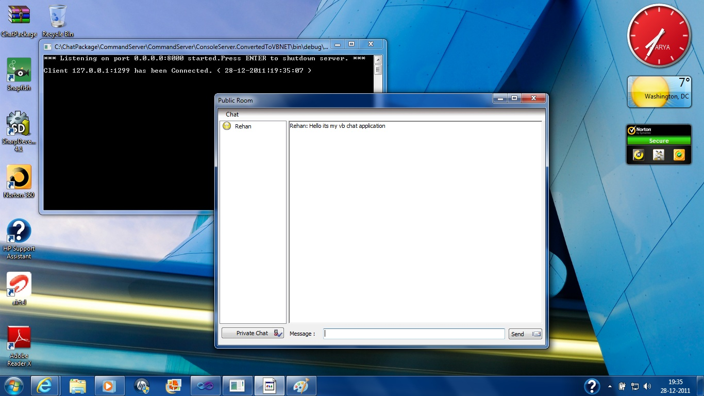

# Simple Chat Application Using VB.NET With Private Chat Option
## Requires
- Visual Studio 2010
## License
- Apache License, Version 2.0
## Technologies
- Interop
- Sockets
- VB.NET Language Features
- TCP/IP
## Topics
- threading
- Chat Application
- Socket Programming
- API Programming
- Simple TCP/IP Chat Application
- Chat Application With Private Option
## Updated
- 12/29/2011
## Description

<h1>Introduction</h1>

<em>The power of network programming in .NET platform cannot be denied. Socket&nbsp; programming is the core of network programming in Windows and Linux, and today&nbsp; the .NET platform implements it in a powerful way. To be
 precise, I have created a command&nbsp; client and a command server, to communicate between a remote server and up to&nbsp; 200 clients and send the specified commands to them. As a sample application, I&nbsp; have created a chat client application that uses
 this command client/server to&nbsp; implement chat functions.</em>

<h1>Building the Sample</h1>

<em>Open the ChatPackage.sln file. There is a special sequence to build this project. First Rightclick the CommandServer project and say Build. Then second Rightclick on the ConsoleServer project and say build, then third one Rightclick
 on the CommandClient project and say build and lastly Rightclick on the ChatClient project and say build. All the projects are build now. Run the project pressing F5. You will be able to see the screen as shown below :
</em>

<em>Click on Chat Menu --&gt; Login --&gt; Type the Username --&gt; Enter</em>

<em>The user is shown logged on and the black screen which is the ServerConsole shows the ip address and port number to which the user is connected for chat. Type message in the Message textbox and click on Send button, it will
 appear with the username : Message in the application of chat as shown below :</em>

<em></em>

<em>To enter into a private chat with the user just click on the user name --&gt; Private Chat Box Appears --&gt; Type your message --&gt; Send</em>

<em>So you are now in private conversation with your friend...!!</em>

<em>There is a slight glitch in the application as it has been converted from the CSharp application for my VB users on their demand, when you close your Chat application (Not the black screen) an unhandled exception will popup
 just click on continue to continue exiting the application smoothly and click the exit button on the ConsoleServer(Black Screen). There is no error in running the direct ChatClient.exe file from the Desktop File Explorer the above error only flashes when run
 through VS IDE.</em>

<em>Through this example I have tried my best to demonstrate the power of socket programming and network addressing in visual basic using version 2010 to the best of my possible efforts. The entire explanation of the application
 is out of scope of this paper/article and so its a self understanding matter.</em><em>&nbsp;&nbsp;&nbsp;</em>

