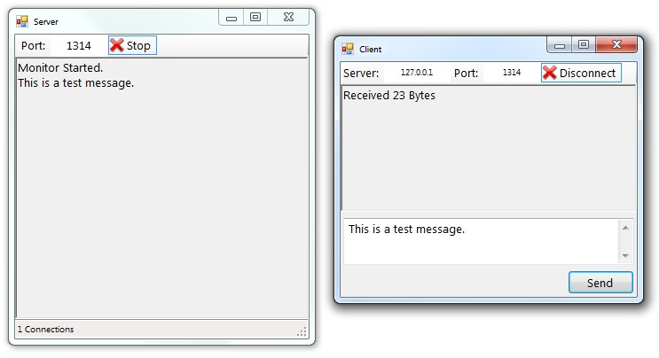

# Simple Multi-User TCP/IP Client/Server Example (Depreciated!)
## Requires
- Visual Studio 2010
## License
- Apache License, Version 2.0
## Technologies
- Obsolete
## Topics
- TCP/IP Client/Server
## Updated
- 03/22/2015
## Description

<h1>Update 3/22/2015</h1>
<h1>This sample is now <strong>obsolete</strong>. &nbsp;</h1>

For the current client/server sample, please see this link:

<a href="https://code.msdn.microsoft.com/Simple-Multi-User-TCPIP-1ff0da41">https://code.msdn.microsoft.com/Simple-Multi-User-TCPIP-1ff0da41</a>

For a detailed explaination of the solution's code, please see the Technet Wiki article:

<a href="http://social.technet.microsoft.com/wiki/contents/articles/30394.simple-multi-user-tcpip-client-server-using-tap.aspx" target="_blank">Simple Multi-User TCP/IP Client &amp; Server using TAP</a>

<h4>Update 10/25/2013</h4>

The sample has been updated to use a concurrent queue within the server.&nbsp; The previous example lacked thread synchronization when emptying the data queue and this could cause problems in some scenarios.

<h1>Introduction</h1>

This sample provides an example of a simple pair of client and server programs which communicate with each other over TCP/IP.&nbsp; The example uses
<strong>Async </strong>methods to connect and read data, and a <strong>Task </strong>
object to monitor client connections on the server.

While the sample does not attempt to implement any kind of data transmission protocol, it does include comments to indicate places where the code might be changed substantially in support of a custom protocol.

<h1>Building the Sample</h1>

The sample solution is configured to run one instance each of the client and server projects when clicking the Run button in Visual Studio.&nbsp; Once debugging has begun, you can return to the
<em>Solution Explorer</em>, right click the <strong>ClientExample </strong>project, and select
<em>Debug -&gt; Start New Instance</em> in order to start additional client instances and test multiple users.

Description

This example shows a simple communication stream between a client and a server over TCP/IP.&nbsp; The server program also demonstrates a simple multi-threaded&nbsp;connection monitoring routine.

The example programs do not attempt to implement a data transmission protocol.&nbsp; All messages are read in 64 byte chunks and the server does not attempt to relate multi-part messages from clients.&nbsp; However, comments in the code indicate the places
 where changes would be made to accomodate multi-part messages and/or alternate message frame size schemes.

A client/server application is a two-part problem: first you must define the raw data transmission methodology for the programs, and second you must then implement a data transmission protocol to control the flow of the raw data and make it meaningful to
 the applications.&nbsp; This sample only attempts to deal with the first part of the problem; transmitting the raw data.

&nbsp;

<h1>Source Code Files</h1>
<ul>
<li><em>ServerForm.vb&nbsp;- contains the ServerForm class, MonitorInfo class, and ConnectionInfo class</em>
</li><li><em><em>ClientForm.vb&nbsp;- contains the ClientForm class and ConnectionInfo class</em></em>
</li></ul>
<h1>More Information</h1>

<em>This sample was the result of a discussion on the MSDN Forums at: 
<a href="http://social.msdn.microsoft.com/Forums/en-US/vbgeneral/thread/602d926e-a09c-4c95-9af4-61833a1afcab">http://social.msdn.microsoft.com/Forums/en-US/vbgeneral/thread/602d926e-a09c-4c95-9af4-61833a1afcab</a></em>

