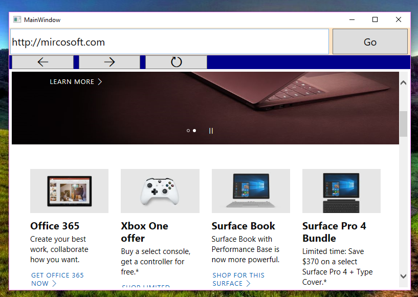

# Simple WebBrowser
## Requires
- Visual Studio 2015
## License
- MIT
## Technologies
- C#
- Web Browser
## Topics
- Web Browser Control
- Web Browser
- Internet Browser
## Updated
- 06/21/2017
## Description

<h1>Introduction</h1>

<em>T</em><em>his sample demostrates how to build a simple web browser that is able to load websites, and do some basic stuff. &nbsp;</em>

<h1>Building the Sample</h1>
<ul>
<li><em>donwload this sample ,</em><em>unzip it</em>
</li><li><em>open solution&nbsp;</em> </li><li><em>build and run</em> </li></ul>

Description

&nbsp;

<h1>this web browser application was created in WPF , this is simplest one web browser able to do basic stuff, like loading webistes, navigating backward and forrward, refreshing page</h1>
<h1>you can explore and modify it , or add new features in it.</h1>
<h1></h1>
<h1>I have used following controls in this application:</h1>
<ul>
<li>
<h1>buttons</h1>
</li><li>
<h1>textBox</h1>
</li><li>
<h1>webBrowser&nbsp;</h1>
</li></ul>
<h1></h1>
<h1>webBrowser control was named as &quot;webBrowser1&quot;</h1>

<strong> 
 
 
</strong>

to open websites we first check URL, and make sure that url is complete&nbsp;

&nbsp;

for proper URL validation and opening URL here is the function:

&nbsp;

&nbsp;

<em>&nbsp;private void openLink(string url)</em> 
<em>&nbsp;&nbsp;&nbsp;&nbsp;&nbsp;&nbsp;&nbsp; {&nbsp;</em>

<em>&nbsp;&nbsp;&nbsp;&nbsp;&nbsp;&nbsp;&nbsp;&nbsp;&nbsp;&nbsp;&nbsp; if(!url.StartsWith(&quot;http://&quot;) &amp;&amp; !url.StartsWith(&quot;https://&quot;))</em> 
<em>&nbsp;&nbsp;&nbsp;&nbsp;&nbsp;&nbsp;&nbsp;&nbsp;&nbsp;&nbsp;&nbsp; {</em> 
<em>&nbsp;&nbsp;&nbsp;&nbsp;&nbsp;&nbsp;&nbsp;&nbsp;&nbsp;&nbsp;&nbsp;&nbsp;&nbsp;&nbsp;&nbsp; url = &quot;http:\\&quot; &#43; url;</em> 
<em>&nbsp;&nbsp;&nbsp;&nbsp;&nbsp;&nbsp;&nbsp;&nbsp;&nbsp;&nbsp;&nbsp; }</em> 
<em>&nbsp;&nbsp;&nbsp;&nbsp;&nbsp;&nbsp;&nbsp;&nbsp;&nbsp;&nbsp;&nbsp; try</em> 
<em>&nbsp;&nbsp;&nbsp;&nbsp;&nbsp;&nbsp;&nbsp;&nbsp;&nbsp;&nbsp;&nbsp; {</em> 
<em>&nbsp;&nbsp;&nbsp;&nbsp;&nbsp;&nbsp;&nbsp;&nbsp;&nbsp;&nbsp;&nbsp;&nbsp;&nbsp;&nbsp;&nbsp; webBrowser1.Navigate(new Uri(url));</em> 
<em>&nbsp;&nbsp;&nbsp;&nbsp;&nbsp;&nbsp;&nbsp;&nbsp;&nbsp;&nbsp;&nbsp; }</em> 
<em>&nbsp;&nbsp;&nbsp;&nbsp;&nbsp;&nbsp;&nbsp;&nbsp;&nbsp;&nbsp;&nbsp; catch(<a class="libraryLink" href="https://msdn.microsoft.com/en-US/library/System.UriFormatException.aspx" target="_blank" title="Auto generated link to System.UriFormatException">System.UriFormatException</a>)</em> 
<em>&nbsp;&nbsp;&nbsp;&nbsp;&nbsp;&nbsp;&nbsp;&nbsp;&nbsp;&nbsp;&nbsp; {</em> 
<em>&nbsp;&nbsp;&nbsp;&nbsp;&nbsp;&nbsp;&nbsp;&nbsp;&nbsp;&nbsp;&nbsp;&nbsp;&nbsp;&nbsp;&nbsp; return;</em> 
<em>&nbsp;&nbsp;&nbsp;&nbsp;&nbsp;&nbsp;&nbsp;&nbsp;&nbsp;&nbsp;&nbsp; }</em> 
&nbsp;&nbsp;&nbsp;&nbsp;&nbsp;&nbsp;&nbsp;&nbsp;&nbsp;&nbsp;&nbsp;  
<em>&nbsp; &nbsp; &nbsp; }</em>

<strong>and function for navigating forward is:</strong>

&nbsp;&nbsp; <em>private void btnForward_Click(object sender, RoutedEventArgs e)</em> 
<em>&nbsp;&nbsp;&nbsp;&nbsp;&nbsp;&nbsp;&nbsp; {</em> 
<em>&nbsp;&nbsp;&nbsp;&nbsp;&nbsp;&nbsp;&nbsp;&nbsp;&nbsp;&nbsp;&nbsp; if (webBrowser1.CanGoForward)</em> 
<em>&nbsp;&nbsp;&nbsp;&nbsp;&nbsp;&nbsp;&nbsp;&nbsp;&nbsp;&nbsp;&nbsp; {</em> 
<em>&nbsp;&nbsp;&nbsp;&nbsp;&nbsp;&nbsp;&nbsp;&nbsp;&nbsp;&nbsp;&nbsp;&nbsp;&nbsp;&nbsp;&nbsp; webBrowser1.GoForward();</em> 
<em>&nbsp;&nbsp;&nbsp;&nbsp;&nbsp;&nbsp;&nbsp;&nbsp;&nbsp;&nbsp;&nbsp; }</em> 
<em>&nbsp;&nbsp;&nbsp;&nbsp;&nbsp;&nbsp;&nbsp; }</em>

<strong>function for navigating backward is :</strong>

<em>&nbsp;private void btnBackward_Click(object sender, RoutedEventArgs e)</em> 
<em>&nbsp;&nbsp;&nbsp;&nbsp;&nbsp;&nbsp;&nbsp; {</em> 
<em>&nbsp;&nbsp;&nbsp;&nbsp;&nbsp;&nbsp;&nbsp;&nbsp;&nbsp;&nbsp;&nbsp; if (webBrowser1.CanGoBack)</em> 
<em>&nbsp;&nbsp;&nbsp;&nbsp;&nbsp;&nbsp;&nbsp;&nbsp;&nbsp;&nbsp;&nbsp; {</em> 
<em>&nbsp;&nbsp;&nbsp;&nbsp;&nbsp;&nbsp;&nbsp;&nbsp;&nbsp;&nbsp;&nbsp;&nbsp;&nbsp;&nbsp;&nbsp; webBrowser1.GoBack();</em> 
<em>&nbsp;&nbsp;&nbsp;&nbsp;&nbsp;&nbsp;&nbsp;&nbsp;&nbsp;&nbsp;&nbsp; }</em> 
<em>&nbsp;&nbsp;&nbsp;&nbsp;&nbsp;&nbsp;&nbsp; }</em>

<strong>function for refreshing page is :</strong>

<em>&nbsp;private void btnRefresh_Click(object sender, RoutedEventArgs e)</em> 
<em>&nbsp;&nbsp;&nbsp;&nbsp;&nbsp;&nbsp;&nbsp; {</em> 
<em>&nbsp;&nbsp;&nbsp;&nbsp;&nbsp;&nbsp;&nbsp;&nbsp;&nbsp;&nbsp;&nbsp; webBrowser1.Refresh();</em> 
<em>&nbsp;&nbsp;&nbsp;&nbsp;&nbsp;&nbsp;&nbsp; }&nbsp;</em>

&nbsp;

&nbsp;

feel free to give feedback at :

<strong>umairnadeem20@hotmail.com</strong>

