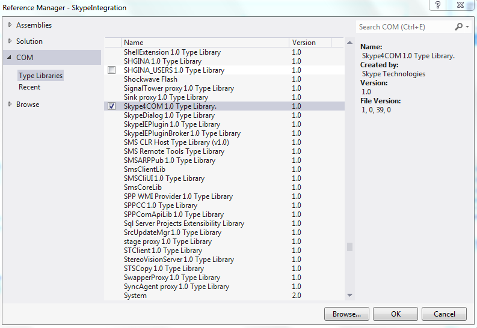

# Skype Integration in WPF Applications
## Requires
- Visual Studio 2012
## License
- Apache License, Version 2.0
## Technologies
- COM
- C#
- WPF
- ViewModel pattern (MVVM)
- XAML
- MVVM
## Topics
- Interop
- COM Interop
- WPF Data Binding
## Updated
- 04/07/2014
## Description

<strong>Introduction:</strong>

Skype has become one of the prominent application for video calling, messaging etc. Intefacing skype with other application has become a necessary feature these days for application that involves the capability to chat, call
 etc. Skype has a good support to integrate it with web applications. But when it comes to windows application the support is very minimal. This sample is developed to integrate skype with WPF application using a COM interface.

 

<strong style="font-size:medium">How to Run the Application:</strong>

1.)&nbsp;&nbsp;&nbsp; Install Skype. You can Download Skype from the following url:

<a href="http://www.skype.com/en/download-skype/skype-for-computer/">http://www.skype.com/en/download-skype/skype-for-computer/</a>

2.)&nbsp;&nbsp;&nbsp; After installing the Skype Application. Locate the COM Component
<strong>Skype4Com</strong> in your machine. If you have Skype installed in C drive. It will be located in
<em>&ldquo;<strong>C:\Program Files (x86)\Common Files\Skype&rdquo; </strong></em>

3.)&nbsp;&nbsp;&nbsp; After Register the Component to Windows Machine using the following steps<strong><em>&nbsp;</em></strong>

For 32-bits OS:

<ol>
<li>copy&nbsp;<strong>Skype4COM.dll to your&nbsp;c:\windows\system32&nbsp;folder</strong>
</li><li>Open an Elevated CMD.exe (right click cmd.exe and choose 'Run as Administrator')
</li><li>Set current Path to&nbsp;<strong>C:\Windows\System32</strong>
</li><li>execute&nbsp;<strong>regsvr32.exe Skype4COM.dll</strong>
</li></ol>

For 64-bits OS:

<ol>
<li>Copy<strong> &nbsp;Skype4COM.dll to your&nbsp;c:\windows\SysWOW64&nbsp;folder</strong>
</li><li>Open an Elevated CMD.exe (right click cmd.exe and choose 'Run as Administrator')
</li><li>Set current Path to&nbsp;<strong>C:\Windows\SysWOW64</strong>
</li><li>execute&nbsp;<strong>regsvr32.exe Skype4COM.dll</strong>
</li></ol>

<strong><em>&nbsp;</em></strong>

4.)&nbsp;&nbsp;&nbsp; Now open the <strong>&ldquo;SkypeIntegration.sln&rdquo;</strong> in visual studio 2012. In the References section you will see the SKYPE4COMLib Missing. Now Right click &ldquo;<strong><em>References -&gt;
 Add Reference&rdquo;</em></strong>

5.)&nbsp;&nbsp;&nbsp; In the <strong><em>Reference Manager</em></strong> Dialog. Under
<strong><em>&ldquo;COM -&gt; Type Libraries&rdquo;</em></strong> Section you can see Skype component registered. Select the
<strong><em>&ldquo;Skype4Com 1.0 Type Library&rdquo; </em></strong>and Click <strong>
<em>OK</em></strong>.

&nbsp;

 

6.)&nbsp;&nbsp;&nbsp; Now Run the Application.

&nbsp;

<strong>Screenshot:</strong>

<strong></strong>

<strong>You can read the related wiki article here</strong>

<a href="http://social.technet.microsoft.com/wiki/contents/articles/21733.skype-integration-in-wpf-applications.aspx">http://social.technet.microsoft.com/wiki/contents/articles/21733.skype-integration-in-wpf-applications.aspx</a><strong> 
</strong>

