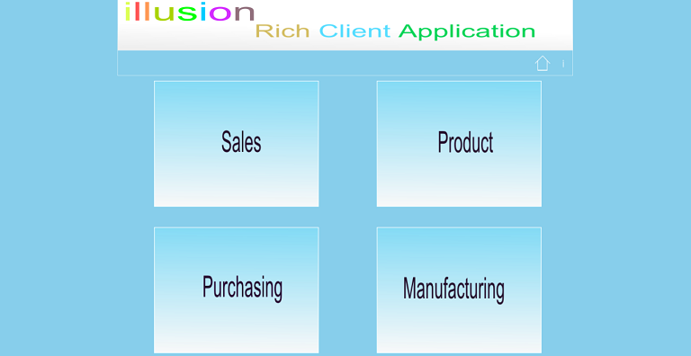

# Solution Architecture with WPF  MVVM  PRISM Unity  Entity Framework
## Requires
- Visual Studio 2010
## License
- Apache License, Version 2.0
## Technologies
- WPF MVVM0 PRISM Unity Entity Framework
## Topics
- Development
## Updated
- 09/01/2013
## Description

<h1>Introduction</h1>

<em>This Project is for beginnerswho looking to learn prism wpf , mvvm unity and Entity framework.</em>

<em>&nbsp;this project is designed for the beginners, easy to understand and implement wpf application using the mvvm, prisn, unity and entity framework.</em>

<em>Its consist Dal interface, dal and dal edmx layer , businness interface and bussiner layer and module with simple code&nbsp;</em>

<em>to understand the application and developing for startup.</em>

<h1>Building the Sample</h1>

<em>Are there special requirements or instructions for building the sample?</em>

<em>This project contains a datbase folder with database files and back up files you need to add the database to your db server and change the app.config connect string with your serve name&nbsp;</em>

<em>Ex : Repalce HAMBEERE-PC with your db server name. then run the application.</em>

<em>Requriements. Visual studio 2010 and sql server 2008 or R2.</em>

Description

<em>Are there special requirements or instructions for building the sample?</em>

<em>This project contains a datbase folder with database files and back up files you need to add the database to your db server and change the app.config connect string with your serve name&nbsp;</em>

<em>Ex : Repalce HAMBEERE-PC with your db server name. then run the application.</em>

<em>Requriements. Visual studio 2010 and sql server 2008 or R2.</em>

<em>You can include <em><strong>code snippets,&nbsp;</strong></em><strong>images</strong>,
<strong>videos</strong>. &nbsp;&nbsp;</em>

&nbsp;

C#

Edit|Remove

csharp
<pre class="hidden">namespace Illusion.Sales.ViewModel
{
    using System;
    using System.Collections.ObjectModel;
    using System.ComponentModel;
    using System.Windows;
    using System.Windows.Input;
    using System.Windows.Threading;
    using Illusion.Common;
    using Illusion.Sales.Services;
    using Illusion.UI.Entities;

    /// &lt;summary&gt;
    /// class ContactViewModel
    /// &lt;/summary&gt;
    public sealed class ContactViewModel : ViewModelBase
    {
        #region Private Properties

        /// &lt;summary&gt;
        /// The contact collection
        /// &lt;/summary&gt;
        private ObservableCollection&lt;ContactEntity&gt; contactCollection = new ObservableCollection&lt;ContactEntity&gt;();

        #endregion

        #region Public Properties

        /// &lt;summary&gt;
        /// Gets or sets the contact collection.
        /// &lt;/summary&gt;
        /// &lt;value&gt;
        /// The contact collection.
        /// &lt;/value&gt;
        public ObservableCollection&lt;ContactEntity&gt; ContactCollection
        {
            get
            {
                return this.contactCollection;
            }
            set
            {
                this.contactCollection = value;
            }
        }

        #endregion

        #region Constructor

        /// &lt;summary&gt;
        /// Initializes a new instance of the &lt;see cref=&quot;ContactViewModel&quot;/&gt; class.
        /// &lt;/summary&gt;
        /// &lt;param name=&quot;container&quot;&gt;The container.&lt;/param&gt;
        public ContactViewModel()
            : base()
        {
            LoadContactsBackground();
        }
        #endregion

        #region BackgroundWorker 

        /// &lt;summary&gt;
        /// Loads the contacts background.
        /// &lt;/summary&gt;
        private void LoadContactsBackground()
        {
            Mouse.OverrideCursor = Cursors.Wait;
           
            //run time-consuming operations on a background thread
            BackgroundWorker worker = new BackgroundWorker();

            //Set the WorkerReportsProgress property to true if you want the BackgroundWorker to support progress updates.
            //When this property is true, user code can call the ReportProgress method to raise the ProgressChanged event.
            worker.WorkerReportsProgress = true;

            //This event is raised when you call the RunWorkerAsync method. This is where you start the time-consuming operation.
            worker.DoWork &#43;= new DoWorkEventHandler(this.LoadContactsBackground);

            // This event is raised when you call the ReportProgress method.
            worker.ProgressChanged &#43;= new ProgressChangedEventHandler(this.LoadContactsBackgroundProgress);

            //The RunWorkerCompleted event is raised when the background worker has completed. 
            //Depending on whether the background operation completed successfully, encountered an error,
            //or was canceled, update the user interface accordingly
            worker.RunWorkerCompleted &#43;= new RunWorkerCompletedEventHandler(this.LoadContactsBackgroundComplete);

            //Starts running a background operation
            worker.RunWorkerAsync();
        }

        /// &lt;summary&gt;
        /// Occurs when RunWorkerAsync is called.
        /// &lt;/summary&gt;
        /// &lt;param name=&quot;sender&quot;&gt;The sender.&lt;/param&gt;
        /// &lt;param name=&quot;e&quot;&gt;The &lt;see cref=&quot;DoWorkEventArgs&quot;/&gt; instance containing the event data.&lt;/param&gt;
        private void LoadContactsBackground(object sender, DoWorkEventArgs e)
        {
            IContactRepository contactRepository = new ContactRepository();

            BackgroundWorker source = (BackgroundWorker)sender;

            var results = contactRepository.GetAllContacts();
            int index = 0;
            foreach (var item in results)
            {
               
                Application.Current.Dispatcher.Invoke(DispatcherPriority.Background, new Action(delegate { }));
                source.ReportProgress(&#43;&#43;index, item);
            }
        }

        /// &lt;summary&gt;
        ///  Occurs when System.ComponentModel.BackgroundWorker.ReportProgress(System.Int32) is called.
        /// &lt;/summary&gt;
        /// &lt;param name=&quot;sender&quot;&gt;The sender.&lt;/param&gt;
        /// &lt;param name=&quot;e&quot;&gt;The &lt;see cref=&quot;ProgressChangedEventArgs&quot;/&gt; instance containing the event data.&lt;/param&gt;
        private void LoadContactsBackgroundProgress(object sender, ProgressChangedEventArgs e)
        {
            this.ContactCollection.Add((ContactEntity)e.UserState);
        }

        /// &lt;summary&gt;
        ///  Occurs when the background operation has completed, has been canceled, or has raised an exception.
        /// &lt;/summary&gt;
        /// &lt;param name=&quot;sender&quot;&gt;The sender.&lt;/param&gt;
        /// &lt;param name=&quot;e&quot;&gt;The &lt;see cref=&quot;RunWorkerCompletedEventArgs&quot;/&gt; instance containing the event data.&lt;/param&gt;
        private void LoadContactsBackgroundComplete(object sender, RunWorkerCompletedEventArgs e)
        {
           
            Mouse.OverrideCursor = null;
            this.OnPropertyChanged(&quot;ContactCollection&quot;);
        }

        #endregion 
    }
}
</pre>

<pre class="csharp">namespace&nbsp;Illusion.Sales.ViewModel&nbsp;
{&nbsp;
&nbsp;&nbsp;&nbsp;&nbsp;using&nbsp;System;&nbsp;
&nbsp;&nbsp;&nbsp;&nbsp;using&nbsp;System.Collections.ObjectModel;&nbsp;
&nbsp;&nbsp;&nbsp;&nbsp;using&nbsp;System.ComponentModel;&nbsp;
&nbsp;&nbsp;&nbsp;&nbsp;using&nbsp;System.Windows;&nbsp;
&nbsp;&nbsp;&nbsp;&nbsp;using&nbsp;System.Windows.Input;&nbsp;
&nbsp;&nbsp;&nbsp;&nbsp;using&nbsp;System.Windows.Threading;&nbsp;
&nbsp;&nbsp;&nbsp;&nbsp;using&nbsp;Illusion.Common;&nbsp;
&nbsp;&nbsp;&nbsp;&nbsp;using&nbsp;Illusion.Sales.Services;&nbsp;
&nbsp;&nbsp;&nbsp;&nbsp;using&nbsp;Illusion.UI.Entities;&nbsp;
&nbsp;
&nbsp;&nbsp;&nbsp;&nbsp;///&nbsp;&lt;summary&gt;&nbsp;
&nbsp;&nbsp;&nbsp;&nbsp;///&nbsp;class&nbsp;ContactViewModel&nbsp;
&nbsp;&nbsp;&nbsp;&nbsp;///&nbsp;&lt;/summary&gt;&nbsp;
&nbsp;&nbsp;&nbsp;&nbsp;public&nbsp;sealed&nbsp;class&nbsp;ContactViewModel&nbsp;:&nbsp;ViewModelBase&nbsp;
&nbsp;&nbsp;&nbsp;&nbsp;{&nbsp;
&nbsp;&nbsp;&nbsp;&nbsp;&nbsp;&nbsp;&nbsp;&nbsp;#region&nbsp;Private&nbsp;Properties&nbsp;
&nbsp;
&nbsp;&nbsp;&nbsp;&nbsp;&nbsp;&nbsp;&nbsp;&nbsp;///&nbsp;&lt;summary&gt;&nbsp;
&nbsp;&nbsp;&nbsp;&nbsp;&nbsp;&nbsp;&nbsp;&nbsp;///&nbsp;The&nbsp;contact&nbsp;collection&nbsp;
&nbsp;&nbsp;&nbsp;&nbsp;&nbsp;&nbsp;&nbsp;&nbsp;///&nbsp;&lt;/summary&gt;&nbsp;
&nbsp;&nbsp;&nbsp;&nbsp;&nbsp;&nbsp;&nbsp;&nbsp;private&nbsp;ObservableCollection&lt;ContactEntity&gt;&nbsp;contactCollection&nbsp;=&nbsp;new&nbsp;ObservableCollection&lt;ContactEntity&gt;();&nbsp;
&nbsp;
&nbsp;&nbsp;&nbsp;&nbsp;&nbsp;&nbsp;&nbsp;&nbsp;#endregion&nbsp;
&nbsp;
&nbsp;&nbsp;&nbsp;&nbsp;&nbsp;&nbsp;&nbsp;&nbsp;#region&nbsp;Public&nbsp;Properties&nbsp;
&nbsp;
&nbsp;&nbsp;&nbsp;&nbsp;&nbsp;&nbsp;&nbsp;&nbsp;///&nbsp;&lt;summary&gt;&nbsp;
&nbsp;&nbsp;&nbsp;&nbsp;&nbsp;&nbsp;&nbsp;&nbsp;///&nbsp;Gets&nbsp;or&nbsp;sets&nbsp;the&nbsp;contact&nbsp;collection.&nbsp;
&nbsp;&nbsp;&nbsp;&nbsp;&nbsp;&nbsp;&nbsp;&nbsp;///&nbsp;&lt;/summary&gt;&nbsp;
&nbsp;&nbsp;&nbsp;&nbsp;&nbsp;&nbsp;&nbsp;&nbsp;///&nbsp;&lt;value&gt;&nbsp;
&nbsp;&nbsp;&nbsp;&nbsp;&nbsp;&nbsp;&nbsp;&nbsp;///&nbsp;The&nbsp;contact&nbsp;collection.&nbsp;
&nbsp;&nbsp;&nbsp;&nbsp;&nbsp;&nbsp;&nbsp;&nbsp;///&nbsp;&lt;/value&gt;&nbsp;
&nbsp;&nbsp;&nbsp;&nbsp;&nbsp;&nbsp;&nbsp;&nbsp;public&nbsp;ObservableCollection&lt;ContactEntity&gt;&nbsp;ContactCollection&nbsp;
&nbsp;&nbsp;&nbsp;&nbsp;&nbsp;&nbsp;&nbsp;&nbsp;{&nbsp;
&nbsp;&nbsp;&nbsp;&nbsp;&nbsp;&nbsp;&nbsp;&nbsp;&nbsp;&nbsp;&nbsp;&nbsp;get&nbsp;
&nbsp;&nbsp;&nbsp;&nbsp;&nbsp;&nbsp;&nbsp;&nbsp;&nbsp;&nbsp;&nbsp;&nbsp;{&nbsp;
&nbsp;&nbsp;&nbsp;&nbsp;&nbsp;&nbsp;&nbsp;&nbsp;&nbsp;&nbsp;&nbsp;&nbsp;&nbsp;&nbsp;&nbsp;&nbsp;return&nbsp;this.contactCollection;&nbsp;
&nbsp;&nbsp;&nbsp;&nbsp;&nbsp;&nbsp;&nbsp;&nbsp;&nbsp;&nbsp;&nbsp;&nbsp;}&nbsp;
&nbsp;&nbsp;&nbsp;&nbsp;&nbsp;&nbsp;&nbsp;&nbsp;&nbsp;&nbsp;&nbsp;&nbsp;set&nbsp;
&nbsp;&nbsp;&nbsp;&nbsp;&nbsp;&nbsp;&nbsp;&nbsp;&nbsp;&nbsp;&nbsp;&nbsp;{&nbsp;
&nbsp;&nbsp;&nbsp;&nbsp;&nbsp;&nbsp;&nbsp;&nbsp;&nbsp;&nbsp;&nbsp;&nbsp;&nbsp;&nbsp;&nbsp;&nbsp;this.contactCollection&nbsp;=&nbsp;value;&nbsp;
&nbsp;&nbsp;&nbsp;&nbsp;&nbsp;&nbsp;&nbsp;&nbsp;&nbsp;&nbsp;&nbsp;&nbsp;}&nbsp;
&nbsp;&nbsp;&nbsp;&nbsp;&nbsp;&nbsp;&nbsp;&nbsp;}&nbsp;
&nbsp;
&nbsp;&nbsp;&nbsp;&nbsp;&nbsp;&nbsp;&nbsp;&nbsp;#endregion&nbsp;
&nbsp;
&nbsp;&nbsp;&nbsp;&nbsp;&nbsp;&nbsp;&nbsp;&nbsp;#region&nbsp;Constructor&nbsp;
&nbsp;
&nbsp;&nbsp;&nbsp;&nbsp;&nbsp;&nbsp;&nbsp;&nbsp;///&nbsp;&lt;summary&gt;&nbsp;
&nbsp;&nbsp;&nbsp;&nbsp;&nbsp;&nbsp;&nbsp;&nbsp;///&nbsp;Initializes&nbsp;a&nbsp;new&nbsp;instance&nbsp;of&nbsp;the&nbsp;&lt;see&nbsp;cref=&quot;ContactViewModel&quot;/&gt;&nbsp;class.&nbsp;
&nbsp;&nbsp;&nbsp;&nbsp;&nbsp;&nbsp;&nbsp;&nbsp;///&nbsp;&lt;/summary&gt;&nbsp;
&nbsp;&nbsp;&nbsp;&nbsp;&nbsp;&nbsp;&nbsp;&nbsp;///&nbsp;&lt;param&nbsp;name=&quot;container&quot;&gt;The&nbsp;container.&lt;/param&gt;&nbsp;
&nbsp;&nbsp;&nbsp;&nbsp;&nbsp;&nbsp;&nbsp;&nbsp;public&nbsp;ContactViewModel()&nbsp;
&nbsp;&nbsp;&nbsp;&nbsp;&nbsp;&nbsp;&nbsp;&nbsp;&nbsp;&nbsp;&nbsp;&nbsp;:&nbsp;base()&nbsp;
&nbsp;&nbsp;&nbsp;&nbsp;&nbsp;&nbsp;&nbsp;&nbsp;{&nbsp;
&nbsp;&nbsp;&nbsp;&nbsp;&nbsp;&nbsp;&nbsp;&nbsp;&nbsp;&nbsp;&nbsp;&nbsp;LoadContactsBackground();&nbsp;
&nbsp;&nbsp;&nbsp;&nbsp;&nbsp;&nbsp;&nbsp;&nbsp;}&nbsp;
&nbsp;&nbsp;&nbsp;&nbsp;&nbsp;&nbsp;&nbsp;&nbsp;#endregion&nbsp;
&nbsp;
&nbsp;&nbsp;&nbsp;&nbsp;&nbsp;&nbsp;&nbsp;&nbsp;#region&nbsp;BackgroundWorker&nbsp;&nbsp;
&nbsp;
&nbsp;&nbsp;&nbsp;&nbsp;&nbsp;&nbsp;&nbsp;&nbsp;///&nbsp;&lt;summary&gt;&nbsp;
&nbsp;&nbsp;&nbsp;&nbsp;&nbsp;&nbsp;&nbsp;&nbsp;///&nbsp;Loads&nbsp;the&nbsp;contacts&nbsp;background.&nbsp;
&nbsp;&nbsp;&nbsp;&nbsp;&nbsp;&nbsp;&nbsp;&nbsp;///&nbsp;&lt;/summary&gt;&nbsp;
&nbsp;&nbsp;&nbsp;&nbsp;&nbsp;&nbsp;&nbsp;&nbsp;private&nbsp;void&nbsp;LoadContactsBackground()&nbsp;
&nbsp;&nbsp;&nbsp;&nbsp;&nbsp;&nbsp;&nbsp;&nbsp;{&nbsp;
&nbsp;&nbsp;&nbsp;&nbsp;&nbsp;&nbsp;&nbsp;&nbsp;&nbsp;&nbsp;&nbsp;&nbsp;Mouse.OverrideCursor&nbsp;=&nbsp;Cursors.Wait;&nbsp;
&nbsp;&nbsp;&nbsp;&nbsp;&nbsp;&nbsp;&nbsp;&nbsp;&nbsp;&nbsp;&nbsp;&nbsp;
&nbsp;&nbsp;&nbsp;&nbsp;&nbsp;&nbsp;&nbsp;&nbsp;&nbsp;&nbsp;&nbsp;&nbsp;//run&nbsp;time-consuming&nbsp;operations&nbsp;on&nbsp;a&nbsp;background&nbsp;thread&nbsp;
&nbsp;&nbsp;&nbsp;&nbsp;&nbsp;&nbsp;&nbsp;&nbsp;&nbsp;&nbsp;&nbsp;&nbsp;BackgroundWorker&nbsp;worker&nbsp;=&nbsp;new&nbsp;BackgroundWorker();&nbsp;
&nbsp;
&nbsp;&nbsp;&nbsp;&nbsp;&nbsp;&nbsp;&nbsp;&nbsp;&nbsp;&nbsp;&nbsp;&nbsp;//Set&nbsp;the&nbsp;WorkerReportsProgress&nbsp;property&nbsp;to&nbsp;true&nbsp;if&nbsp;you&nbsp;want&nbsp;the&nbsp;BackgroundWorker&nbsp;to&nbsp;support&nbsp;progress&nbsp;updates.&nbsp;
&nbsp;&nbsp;&nbsp;&nbsp;&nbsp;&nbsp;&nbsp;&nbsp;&nbsp;&nbsp;&nbsp;&nbsp;//When&nbsp;this&nbsp;property&nbsp;is&nbsp;true,&nbsp;user&nbsp;code&nbsp;can&nbsp;call&nbsp;the&nbsp;ReportProgress&nbsp;method&nbsp;to&nbsp;raise&nbsp;the&nbsp;ProgressChanged&nbsp;event.&nbsp;
&nbsp;&nbsp;&nbsp;&nbsp;&nbsp;&nbsp;&nbsp;&nbsp;&nbsp;&nbsp;&nbsp;&nbsp;worker.WorkerReportsProgress&nbsp;=&nbsp;true;&nbsp;
&nbsp;
&nbsp;&nbsp;&nbsp;&nbsp;&nbsp;&nbsp;&nbsp;&nbsp;&nbsp;&nbsp;&nbsp;&nbsp;//This&nbsp;event&nbsp;is&nbsp;raised&nbsp;when&nbsp;you&nbsp;call&nbsp;the&nbsp;RunWorkerAsync&nbsp;method.&nbsp;This&nbsp;is&nbsp;where&nbsp;you&nbsp;start&nbsp;the&nbsp;time-consuming&nbsp;operation.&nbsp;
&nbsp;&nbsp;&nbsp;&nbsp;&nbsp;&nbsp;&nbsp;&nbsp;&nbsp;&nbsp;&nbsp;&nbsp;worker.DoWork&nbsp;&#43;=&nbsp;new&nbsp;DoWorkEventHandler(this.LoadContactsBackground);&nbsp;
&nbsp;
&nbsp;&nbsp;&nbsp;&nbsp;&nbsp;&nbsp;&nbsp;&nbsp;&nbsp;&nbsp;&nbsp;&nbsp;//&nbsp;This&nbsp;event&nbsp;is&nbsp;raised&nbsp;when&nbsp;you&nbsp;call&nbsp;the&nbsp;ReportProgress&nbsp;method.&nbsp;
&nbsp;&nbsp;&nbsp;&nbsp;&nbsp;&nbsp;&nbsp;&nbsp;&nbsp;&nbsp;&nbsp;&nbsp;worker.ProgressChanged&nbsp;&#43;=&nbsp;new&nbsp;ProgressChangedEventHandler(this.LoadContactsBackgroundProgress);&nbsp;
&nbsp;
&nbsp;&nbsp;&nbsp;&nbsp;&nbsp;&nbsp;&nbsp;&nbsp;&nbsp;&nbsp;&nbsp;&nbsp;//The&nbsp;RunWorkerCompleted&nbsp;event&nbsp;is&nbsp;raised&nbsp;when&nbsp;the&nbsp;background&nbsp;worker&nbsp;has&nbsp;completed.&nbsp;&nbsp;
&nbsp;&nbsp;&nbsp;&nbsp;&nbsp;&nbsp;&nbsp;&nbsp;&nbsp;&nbsp;&nbsp;&nbsp;//Depending&nbsp;on&nbsp;whether&nbsp;the&nbsp;background&nbsp;operation&nbsp;completed&nbsp;successfully,&nbsp;encountered&nbsp;an&nbsp;error,&nbsp;
&nbsp;&nbsp;&nbsp;&nbsp;&nbsp;&nbsp;&nbsp;&nbsp;&nbsp;&nbsp;&nbsp;&nbsp;//or&nbsp;was&nbsp;canceled,&nbsp;update&nbsp;the&nbsp;user&nbsp;interface&nbsp;accordingly&nbsp;
&nbsp;&nbsp;&nbsp;&nbsp;&nbsp;&nbsp;&nbsp;&nbsp;&nbsp;&nbsp;&nbsp;&nbsp;worker.RunWorkerCompleted&nbsp;&#43;=&nbsp;new&nbsp;RunWorkerCompletedEventHandler(this.LoadContactsBackgroundComplete);&nbsp;
&nbsp;
&nbsp;&nbsp;&nbsp;&nbsp;&nbsp;&nbsp;&nbsp;&nbsp;&nbsp;&nbsp;&nbsp;&nbsp;//Starts&nbsp;running&nbsp;a&nbsp;background&nbsp;operation&nbsp;
&nbsp;&nbsp;&nbsp;&nbsp;&nbsp;&nbsp;&nbsp;&nbsp;&nbsp;&nbsp;&nbsp;&nbsp;worker.RunWorkerAsync();&nbsp;
&nbsp;&nbsp;&nbsp;&nbsp;&nbsp;&nbsp;&nbsp;&nbsp;}&nbsp;
&nbsp;
&nbsp;&nbsp;&nbsp;&nbsp;&nbsp;&nbsp;&nbsp;&nbsp;///&nbsp;&lt;summary&gt;&nbsp;
&nbsp;&nbsp;&nbsp;&nbsp;&nbsp;&nbsp;&nbsp;&nbsp;///&nbsp;Occurs&nbsp;when&nbsp;RunWorkerAsync&nbsp;is&nbsp;called.&nbsp;
&nbsp;&nbsp;&nbsp;&nbsp;&nbsp;&nbsp;&nbsp;&nbsp;///&nbsp;&lt;/summary&gt;&nbsp;
&nbsp;&nbsp;&nbsp;&nbsp;&nbsp;&nbsp;&nbsp;&nbsp;///&nbsp;&lt;param&nbsp;name=&quot;sender&quot;&gt;The&nbsp;sender.&lt;/param&gt;&nbsp;
&nbsp;&nbsp;&nbsp;&nbsp;&nbsp;&nbsp;&nbsp;&nbsp;///&nbsp;&lt;param&nbsp;name=&quot;e&quot;&gt;The&nbsp;&lt;see&nbsp;cref=&quot;DoWorkEventArgs&quot;/&gt;&nbsp;instance&nbsp;containing&nbsp;the&nbsp;event&nbsp;data.&lt;/param&gt;&nbsp;
&nbsp;&nbsp;&nbsp;&nbsp;&nbsp;&nbsp;&nbsp;&nbsp;private&nbsp;void&nbsp;LoadContactsBackground(object&nbsp;sender,&nbsp;DoWorkEventArgs&nbsp;e)&nbsp;
&nbsp;&nbsp;&nbsp;&nbsp;&nbsp;&nbsp;&nbsp;&nbsp;{&nbsp;
&nbsp;&nbsp;&nbsp;&nbsp;&nbsp;&nbsp;&nbsp;&nbsp;&nbsp;&nbsp;&nbsp;&nbsp;IContactRepository&nbsp;contactRepository&nbsp;=&nbsp;new&nbsp;ContactRepository();&nbsp;
&nbsp;
&nbsp;&nbsp;&nbsp;&nbsp;&nbsp;&nbsp;&nbsp;&nbsp;&nbsp;&nbsp;&nbsp;&nbsp;BackgroundWorker&nbsp;source&nbsp;=&nbsp;(BackgroundWorker)sender;&nbsp;
&nbsp;
&nbsp;&nbsp;&nbsp;&nbsp;&nbsp;&nbsp;&nbsp;&nbsp;&nbsp;&nbsp;&nbsp;&nbsp;var&nbsp;results&nbsp;=&nbsp;contactRepository.GetAllContacts();&nbsp;
&nbsp;&nbsp;&nbsp;&nbsp;&nbsp;&nbsp;&nbsp;&nbsp;&nbsp;&nbsp;&nbsp;&nbsp;int&nbsp;index&nbsp;=&nbsp;0;&nbsp;
&nbsp;&nbsp;&nbsp;&nbsp;&nbsp;&nbsp;&nbsp;&nbsp;&nbsp;&nbsp;&nbsp;&nbsp;foreach&nbsp;(var&nbsp;item&nbsp;in&nbsp;results)&nbsp;
&nbsp;&nbsp;&nbsp;&nbsp;&nbsp;&nbsp;&nbsp;&nbsp;&nbsp;&nbsp;&nbsp;&nbsp;{&nbsp;
&nbsp;&nbsp;&nbsp;&nbsp;&nbsp;&nbsp;&nbsp;&nbsp;&nbsp;&nbsp;&nbsp;&nbsp;&nbsp;&nbsp;&nbsp;&nbsp;
&nbsp;&nbsp;&nbsp;&nbsp;&nbsp;&nbsp;&nbsp;&nbsp;&nbsp;&nbsp;&nbsp;&nbsp;&nbsp;&nbsp;&nbsp;&nbsp;Application.Current.Dispatcher.Invoke(DispatcherPriority.Background,&nbsp;new&nbsp;Action(delegate&nbsp;{&nbsp;}));&nbsp;
&nbsp;&nbsp;&nbsp;&nbsp;&nbsp;&nbsp;&nbsp;&nbsp;&nbsp;&nbsp;&nbsp;&nbsp;&nbsp;&nbsp;&nbsp;&nbsp;source.ReportProgress(&#43;&#43;index,&nbsp;item);&nbsp;
&nbsp;&nbsp;&nbsp;&nbsp;&nbsp;&nbsp;&nbsp;&nbsp;&nbsp;&nbsp;&nbsp;&nbsp;}&nbsp;
&nbsp;&nbsp;&nbsp;&nbsp;&nbsp;&nbsp;&nbsp;&nbsp;}&nbsp;
&nbsp;
&nbsp;&nbsp;&nbsp;&nbsp;&nbsp;&nbsp;&nbsp;&nbsp;///&nbsp;&lt;summary&gt;&nbsp;
&nbsp;&nbsp;&nbsp;&nbsp;&nbsp;&nbsp;&nbsp;&nbsp;///&nbsp;&nbsp;Occurs&nbsp;when&nbsp;System.ComponentModel.BackgroundWorker.ReportProgress(System.Int32)&nbsp;is&nbsp;called.&nbsp;
&nbsp;&nbsp;&nbsp;&nbsp;&nbsp;&nbsp;&nbsp;&nbsp;///&nbsp;&lt;/summary&gt;&nbsp;
&nbsp;&nbsp;&nbsp;&nbsp;&nbsp;&nbsp;&nbsp;&nbsp;///&nbsp;&lt;param&nbsp;name=&quot;sender&quot;&gt;The&nbsp;sender.&lt;/param&gt;&nbsp;
&nbsp;&nbsp;&nbsp;&nbsp;&nbsp;&nbsp;&nbsp;&nbsp;///&nbsp;&lt;param&nbsp;name=&quot;e&quot;&gt;The&nbsp;&lt;see&nbsp;cref=&quot;ProgressChangedEventArgs&quot;/&gt;&nbsp;instance&nbsp;containing&nbsp;the&nbsp;event&nbsp;data.&lt;/param&gt;&nbsp;
&nbsp;&nbsp;&nbsp;&nbsp;&nbsp;&nbsp;&nbsp;&nbsp;private&nbsp;void&nbsp;LoadContactsBackgroundProgress(object&nbsp;sender,&nbsp;ProgressChangedEventArgs&nbsp;e)&nbsp;
&nbsp;&nbsp;&nbsp;&nbsp;&nbsp;&nbsp;&nbsp;&nbsp;{&nbsp;
&nbsp;&nbsp;&nbsp;&nbsp;&nbsp;&nbsp;&nbsp;&nbsp;&nbsp;&nbsp;&nbsp;&nbsp;this.ContactCollection.Add((ContactEntity)e.UserState);&nbsp;
&nbsp;&nbsp;&nbsp;&nbsp;&nbsp;&nbsp;&nbsp;&nbsp;}&nbsp;
&nbsp;
&nbsp;&nbsp;&nbsp;&nbsp;&nbsp;&nbsp;&nbsp;&nbsp;///&nbsp;&lt;summary&gt;&nbsp;
&nbsp;&nbsp;&nbsp;&nbsp;&nbsp;&nbsp;&nbsp;&nbsp;///&nbsp;&nbsp;Occurs&nbsp;when&nbsp;the&nbsp;background&nbsp;operation&nbsp;has&nbsp;completed,&nbsp;has&nbsp;been&nbsp;canceled,&nbsp;or&nbsp;has&nbsp;raised&nbsp;an&nbsp;exception.&nbsp;
&nbsp;&nbsp;&nbsp;&nbsp;&nbsp;&nbsp;&nbsp;&nbsp;///&nbsp;&lt;/summary&gt;&nbsp;
&nbsp;&nbsp;&nbsp;&nbsp;&nbsp;&nbsp;&nbsp;&nbsp;///&nbsp;&lt;param&nbsp;name=&quot;sender&quot;&gt;The&nbsp;sender.&lt;/param&gt;&nbsp;
&nbsp;&nbsp;&nbsp;&nbsp;&nbsp;&nbsp;&nbsp;&nbsp;///&nbsp;&lt;param&nbsp;name=&quot;e&quot;&gt;The&nbsp;&lt;see&nbsp;cref=&quot;RunWorkerCompletedEventArgs&quot;/&gt;&nbsp;instance&nbsp;containing&nbsp;the&nbsp;event&nbsp;data.&lt;/param&gt;&nbsp;
&nbsp;&nbsp;&nbsp;&nbsp;&nbsp;&nbsp;&nbsp;&nbsp;private&nbsp;void&nbsp;LoadContactsBackgroundComplete(object&nbsp;sender,&nbsp;RunWorkerCompletedEventArgs&nbsp;e)&nbsp;
&nbsp;&nbsp;&nbsp;&nbsp;&nbsp;&nbsp;&nbsp;&nbsp;{&nbsp;
&nbsp;&nbsp;&nbsp;&nbsp;&nbsp;&nbsp;&nbsp;&nbsp;&nbsp;&nbsp;&nbsp;&nbsp;
&nbsp;&nbsp;&nbsp;&nbsp;&nbsp;&nbsp;&nbsp;&nbsp;&nbsp;&nbsp;&nbsp;&nbsp;Mouse.OverrideCursor&nbsp;=&nbsp;null;&nbsp;
&nbsp;&nbsp;&nbsp;&nbsp;&nbsp;&nbsp;&nbsp;&nbsp;&nbsp;&nbsp;&nbsp;&nbsp;this.OnPropertyChanged(&quot;ContactCollection&quot;);&nbsp;
&nbsp;&nbsp;&nbsp;&nbsp;&nbsp;&nbsp;&nbsp;&nbsp;}&nbsp;
&nbsp;
&nbsp;&nbsp;&nbsp;&nbsp;&nbsp;&nbsp;&nbsp;&nbsp;#endregion&nbsp;&nbsp;
&nbsp;&nbsp;&nbsp;&nbsp;}&nbsp;
}&nbsp;
</pre>

<h1>Source Code Files</h1>
<ul>
<li><em>source code file name #1 - summary for this source code file.</em> </li><li><em><em>source code file name #2 - summary for this source code file.</em></em>
</li></ul>
<h1>More Information</h1>

<em>For more information on X, see ...?</em>

