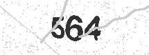
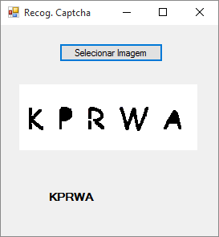
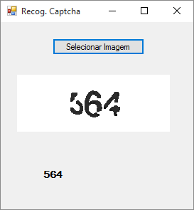
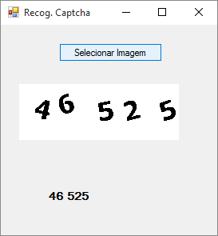

# Solving Captchas with C#, AForge.NET and Tesseract
## Requires
- Visual Studio 2015
## License
- Apache License, Version 2.0
## Technologies
- C#
- WinForms
- Image Processing
- Tesseract
- AForge.NET
## Topics
- Image manipulation
- CAPTCHA
- Image Filters
## Updated
- 08/05/2016
## Description

 

<h1>Introduction</h1>

A Visual Studio 2015 project which shows how to use the C# integrated with AForge.NET and Tesseract to solve captchas

This technique aims to use the AForge.NET for the pretreatment of images in order to eliminate all factors that are not part of the verification characters. This pre-processing allows the Tesseract OCR has a more effective recognition and greater probability
 of success.

Article
detailed the creation of this project,
you find on this link: <a title="andresecco.com.br/2015/09/reconhecimento-de-captcha-com-aforge-net-e-tesseract/" href="andresecco.com.br/2015/09/reconhecimento-de-captcha-com-aforge-net-e-tesseract/" target="_blank">
andresecco.com.br/2015/09/reconhecimento-de-captcha-com-aforge-net-e-tesseract/ 
</a>

 

<h1>Getting Started</h1>

To build and run this sample as-is, you must have Visual Studio 2015

In most cases you can run the application by following these steps:

<ol>
<li>Download and extract the .zip file. </li><li>Open the solution file in Visual Studio. </li><li>Customize AForge.NET filters according to the image of your captcha. </li><li>Build the solution, which automatically installs the missing NuGet packages. </li><li>Run the application. </li><li>Test with your captcha. </li></ol>

Got questions?
See this article. Enter <a title="andresecco.com.br/2015/09/reconhecimento-de-captcha-com-aforge-net-e-tesseract/" href="andresecco.com.br/2015/09/reconhecimento-de-captcha-com-aforge-net-e-tesseract/" target="_blank">here</a>

 

Test Results

Results of
tests performed with some images

<strong>Original Images</strong>

<strong></strong>

<strong></strong>

<strong></strong>

&nbsp;

<strong>Results</strong>

<strong></strong>

<strong></strong>

<strong> 
</strong>

<strong> 
</strong>

<h1>Documentation</h1>

AForge.NET Documentation 
<a title="http://www.aforgenet.com/framework/docs" href="http://www.aforgenet.com/framework/docs" target="_blank">http://www.aforgenet.com/framework/docs</a>

Tesseract Documentation 
<a title="https://code.google.com/p/tesseract-ocr/wiki/Documentation" href="https://code.google.com/p/tesseract-ocr/wiki/Documentation" target="_blank">https://code.google.com/p/tesseract-ocr/wiki/Documentation</a>

&nbsp;

<h1>More Information</h1>

This project is 
maintained and updated on GitHub. Enter
<a title="https://github.com/andreluizsecco/RecogCaptcha" href="https://github.com/andreluizsecco/RecogCaptcha" target="_blank">here.</a>

Author: Andr&eacute; Luiz Secco

Twitter: <a title="https://twitter.com/andre_secco" href="https://twitter.com/andre_secco" target="_blank">
@andre_secco</a>

GitHub: <a title="https://github.com/andreluizsecco" href="https://github.com/andreluizsecco" target="_blank">
andreluizsecco</a>

