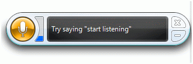

# Speech Recognition
## Requires
- Visual Studio 2012
## License
- Apache License, Version 2.0
## Technologies
- C#
- WPF
- XAML
- .NET Framework
- System.Speech Namespace
- Speech
## Topics
- Speech recognition
- Speech Synthesis
- Speech
- speech synthesizer
## Updated
- 12/14/2013
## Description

<h1>Introduction</h1>

Speech Recognition is a reverse process of Speech Synthesis that converts speech to text. There are two major applications for speech recognition. The first application is people who are for some reason unable to type but can speak to the system and
 system will type text for them. For example, in endoscopic applications a surgeon can evaluate the patient and speak to the system. While surgeon is doing the evaluation, his hands are buys but he can speak. The second application is speech command enabled
 applications where instead of using mouse, we can use voice to run and execute an application commands. 
 
Windows Vista and Window 7 comes with built-in Speech Recognition controls that allow you to setup speech related options such as voice settings, microphone, and other voice recognition settings. Let's take a quick look at what Control Panel has to offer
 related to Speech Recognition.

<h1>Before Running the Application configure the Speech Recognition:</h1>

Go to Control Panel and open Speech Recognition Options. You will see a dialog looks like Figure 1.

 

As you can see from Figure 1, there are options to start speech recognition, setup your microphone, take speech tutorial, train your computer, and open reference card. You may want to click on these options one by one to understand Speech Recognition
 better. 
 
If you click on first link Start Speech Recognition, it will activate speech recognition on the system and system will start listening sounds around your computer. 
 
Next option is Set up Microphone. This option allows you to tell system what microphone to use if you have more than one. Otherwise system will use default microphone. 
 
Next option Take Speech Tutorial is a step by step tutorial that teaches you how to use various system controls. 
 
Next option, Train your computer to better understand is very important. Before you want build and test your application, I recommend you use this option and follow step by steps of the wizard. This wizard will understand your voice and ensures the accuracy
 of commands you sends to the system. If you do not train your computer for your voice, computer may not understand your command properly. 
 
The component that is responsible for controlling and managing speech recognition is called Windows Desktop Speech Technology Recognition Engine (SR Engine). 
 
When you build a Speech Recognition application and you do not setup microphone and voice settings, system will launch wizards and it will ask you to setup these settings. On Windows Vista machine, when first time you will use its and some Speech Recognition
 controls, you will notice a Windows application like figure 2.

That tells me that SR Engine is ready. We just need to enable this by saying first command start listening.&nbsp; 
 
If you right click on Speech Recognition control, you will see various options that allow you to turn speech recognition on, off and put it in sleep mode as you see in Figure 3.

