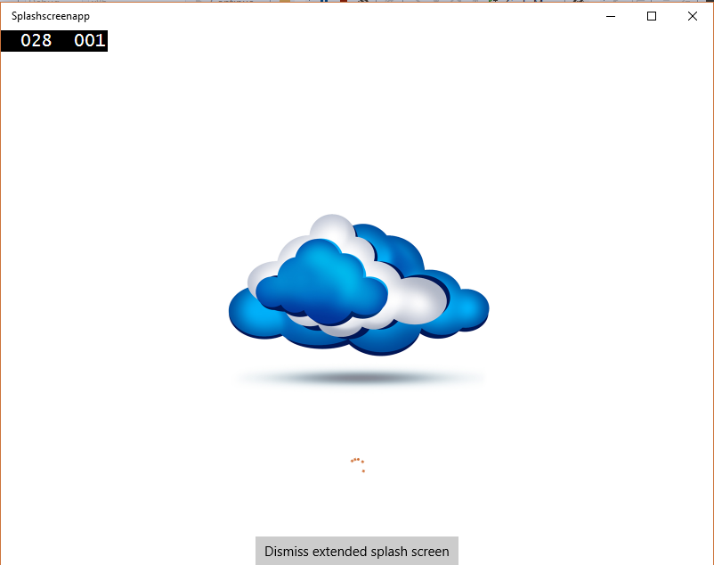

# Splash Screen in Universal Windows 10 application (UWP)
## Requires
- Visual Studio 2015
## License
- MIT
## Technologies
- C#
- XAML
- universal windows app
- Windows 10
- UWP
- windows phone 10
## Topics
- C#
- XAML
- Windows Phone
- universal app
- Windows 10
- UWP
## Updated
- 01/05/2016
## Description

<h1>Introduction</h1>

This sample includes the app code example developed using one of the universal app templates available in Visual Studio. The solution of the universal app code example showing the splashscreen is structured
 so the code example can run on both Windows 10 and Windows Phone 10.

<h1>Building the Sample</h1>

<em>Are there special requirements or instructions for building the sample?</em>

Description

Display a splash screen for more time by creating an extended splash screen for your app. This extended screen is the same splash screen shown when your app is launched, but can be
 customized. When you want to show real-time loading information or give your app more time to prepare its initial UI, an extended splash screen lets you define the launch experience.

Make sure your extended splash screen accurately imitates the default splash screen by following these recommendations:

<ul>
<li style="text-align:justify">Your extended splash screen page should use a 620 x 300 pixel image that is consistent with the image specified for your splash screen in your app manifest. In Microsoft Visual Studio&nbsp;2015, splash screen settings are stored
 in the&nbsp;<strong>Splash Screen</strong>&nbsp;section of the&nbsp;<strong>Visual Assets</strong>&nbsp;tab in your app manifest (Package.appxmanifest file).
</li></ul>

<ul>
<li style="text-align:justify">The background color used by your extended splash screen should&nbsp;consistent with the background color specified for your splash screen in your app manifest (your app's splash screen background).
</li></ul>

<em>This sample covers the basics of implementing a splashscreen for your application .</em>

XAML

Edit|Remove

xaml

<pre class="xaml">&lt;Grid&nbsp;&gt;&nbsp;
&nbsp;&nbsp;&nbsp;&nbsp;&nbsp;&nbsp;&nbsp;&nbsp;&lt;Canvas&gt;&nbsp;
&nbsp;&nbsp;&nbsp;&nbsp;&nbsp;&nbsp;&nbsp;&nbsp;&nbsp;&nbsp;&nbsp;&nbsp;&lt;Image&nbsp;x:Name=&quot;extendedSplashImage&quot;&nbsp;Source=&quot;Assets/SplashScreen.png&quot;/&gt;&nbsp;
&nbsp;&nbsp;&nbsp;&nbsp;&nbsp;&nbsp;&nbsp;&nbsp;&nbsp;&nbsp;&nbsp;&nbsp;&lt;ProgressRing&nbsp;Name=&quot;splashProgressRing&quot;&nbsp;IsActive=&quot;True&quot;&nbsp;Width=&quot;40&quot;&nbsp;HorizontalAlignment=&quot;Center&quot;&nbsp;/&gt;&nbsp;
&nbsp;&nbsp;&nbsp;&nbsp;&nbsp;&nbsp;&nbsp;&nbsp;&lt;/Canvas&gt;&nbsp;
&nbsp;&nbsp;&nbsp;&nbsp;&nbsp;&nbsp;&nbsp;&nbsp;&lt;StackPanel&nbsp;HorizontalAlignment=&quot;Center&quot;&nbsp;VerticalAlignment=&quot;Bottom&quot;&gt;&nbsp;
&nbsp;&nbsp;&nbsp;&nbsp;&nbsp;&nbsp;&nbsp;&nbsp;&nbsp;&nbsp;&nbsp;&nbsp;&lt;Button&nbsp;x:Name=&quot;DismissSplash&quot;&nbsp;Content=&quot;Dismiss&nbsp;extended&nbsp;splash&nbsp;screen&quot;&nbsp;HorizontalAlignment=&quot;Center&quot;&nbsp;Click=&quot;DismissSplashButton_Click&quot;&nbsp;/&gt;&nbsp;
&nbsp;&nbsp;&nbsp;&nbsp;&nbsp;&nbsp;&nbsp;&nbsp;&lt;/StackPanel&gt;&nbsp;
&nbsp;&nbsp;&nbsp;&nbsp;&lt;/Grid&gt;</pre>

<h1></h1>
<h1>Source Code Files</h1>
<ul>
<li><em>ExtendedSplash.xaml&nbsp;</em> </li></ul>
<h1>More Information</h1>

UWP apps take advantage of Azure services. You can also use many UWP concepts such as live tiles, that makes&nbsp;an amazing&nbsp;apps. You can take a look on y other
<a href="https://code.msdn.microsoft.com/site/search?f%5B0%5D.Type=User&f%5B0%5D.Value=Chourouk%20Hjaiej">
samples</a>, they can help you and don`t forget to rate them ;)&nbsp;

<em><em>Feel free to contact me on Twitter @CHJ_GeekGirl&nbsp;for any question about this and visit my blog for more code sample :&nbsp;http://hjaiejchourouk.com/</em></em>

