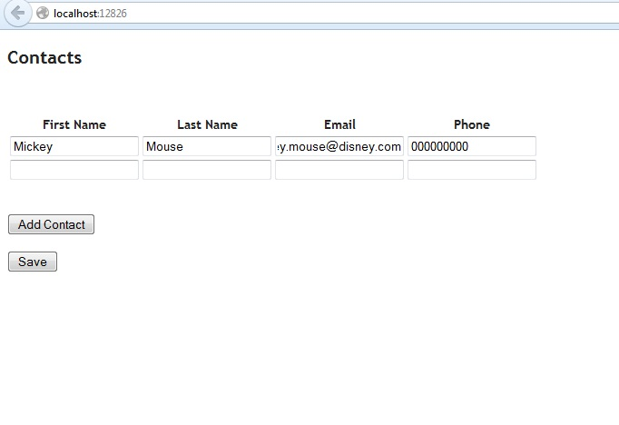

# Stored Procedure with Table-Valued Parameter in EF and ASP.NET MVC
## Requires
- Visual Studio 2012
## License
- Apache License, Version 2.0
## Technologies
- C#
- SQL Server
- ASP.NET
- .NET Framework
- Entity Framework
## Topics
- Data Access
- Entity Framework
- Stored Procedures
## Updated
- 03/03/2013
## Description

<h1>Introduction</h1>

<em>This sample shows how to call stored procedure with table-value parameter while using Entity Framework. Something like this might be needed for example when user can add multiple rows at once to insert to database like in small ASP.NET MVC site included
 in sample. 
</em>

<h1>Building the Sample</h1>
<ul>
<li><em>Extract the files</em> </li><li><em>Create database from database.sql script included in sample.</em> </li><li>Modify connection string. Sample by default uses the local SQL Express. </li><li>Build with Visual Studio 2012 and ASP.NET MVC 3. </li></ul>

Description

<em>This sample solves the problem of calling stored procedure with table-value parameter when using Entity Framework by creating few extension methods that makes calling procedure easier. It demonstrates usage of procedure in case where used can create
 multiple contacts with ASP.NET MVC site and then insert them all at once with stored procedure.</em>

This all is build around using few extension methods. First one shown below is the one that converts object instances to DataTable to make it simplier to create value for the table valued parameter.

&nbsp;

C#

Edit|Remove

csharp
<pre class="hidden">/// &lt;summary&gt;
/// Creates data table from source data.
/// &lt;/summary&gt;
public static DataTable ToDataTable&lt;T&gt;(this IEnumerable&lt;T&gt; source)
{
    DataTable table = new DataTable();

    //// get properties of T
    var binding = BindingFlags.Public | BindingFlags.Instance | BindingFlags.GetProperty;
    var options = PropertyReflectionOptions.IgnoreEnumerable | PropertyReflectionOptions.IgnoreIndexer;

    var properties = ReflectionExtensions.GetProperties&lt;T&gt;(binding, options).ToList();

    //// create table schema based on properties
    foreach (var property in properties)
    {
        table.Columns.Add(property.Name, property.PropertyType);
    }

    //// create table data from T instances
    object[] values = new object[properties.Count];

    foreach (T item in source)
    {
        for (int i = 0; i &lt; properties.Count; i&#43;&#43;)
        {
            values[i] = properties[i].GetValue(item, null);
        }

        table.Rows.Add(values);
    }

    return table;
}</pre>

<pre class="js">///&nbsp;&lt;summary&gt;&nbsp;
///&nbsp;Creates&nbsp;data&nbsp;table&nbsp;from&nbsp;source&nbsp;data.&nbsp;
///&nbsp;&lt;/summary&gt;&nbsp;
public&nbsp;static&nbsp;DataTable&nbsp;ToDataTable&lt;T&gt;(this&nbsp;IEnumerable&lt;T&gt;&nbsp;source)&nbsp;
{&nbsp;
&nbsp;&nbsp;&nbsp;&nbsp;DataTable&nbsp;table&nbsp;=&nbsp;new&nbsp;DataTable();&nbsp;
&nbsp;
&nbsp;&nbsp;&nbsp;&nbsp;////&nbsp;get&nbsp;properties&nbsp;of&nbsp;T&nbsp;
&nbsp;&nbsp;&nbsp;&nbsp;var&nbsp;binding&nbsp;=&nbsp;BindingFlags.Public&nbsp;|&nbsp;BindingFlags.Instance&nbsp;|&nbsp;BindingFlags.GetProperty;&nbsp;
&nbsp;&nbsp;&nbsp;&nbsp;var&nbsp;options&nbsp;=&nbsp;PropertyReflectionOptions.IgnoreEnumerable&nbsp;|&nbsp;PropertyReflectionOptions.IgnoreIndexer;&nbsp;
&nbsp;
&nbsp;&nbsp;&nbsp;&nbsp;var&nbsp;properties&nbsp;=&nbsp;ReflectionExtensions.GetProperties&lt;T&gt;(binding,&nbsp;options).ToList();&nbsp;
&nbsp;
&nbsp;&nbsp;&nbsp;&nbsp;////&nbsp;create&nbsp;table&nbsp;schema&nbsp;based&nbsp;on&nbsp;properties&nbsp;
&nbsp;&nbsp;&nbsp;&nbsp;foreach&nbsp;(var&nbsp;property&nbsp;in&nbsp;properties)&nbsp;
&nbsp;&nbsp;&nbsp;&nbsp;{&nbsp;
&nbsp;&nbsp;&nbsp;&nbsp;&nbsp;&nbsp;&nbsp;&nbsp;table.Columns.Add(property.Name,&nbsp;property.PropertyType);&nbsp;
&nbsp;&nbsp;&nbsp;&nbsp;}&nbsp;
&nbsp;
&nbsp;&nbsp;&nbsp;&nbsp;////&nbsp;create&nbsp;table&nbsp;data&nbsp;from&nbsp;T&nbsp;instances&nbsp;
&nbsp;&nbsp;&nbsp;&nbsp;object[]&nbsp;values&nbsp;=&nbsp;new&nbsp;object[properties.Count];&nbsp;
&nbsp;
&nbsp;&nbsp;&nbsp;&nbsp;foreach&nbsp;(T&nbsp;item&nbsp;in&nbsp;source)&nbsp;
&nbsp;&nbsp;&nbsp;&nbsp;{&nbsp;
&nbsp;&nbsp;&nbsp;&nbsp;&nbsp;&nbsp;&nbsp;&nbsp;for&nbsp;(int&nbsp;i&nbsp;=&nbsp;0;&nbsp;i&nbsp;&lt;&nbsp;properties.Count;&nbsp;i&#43;&#43;)&nbsp;
&nbsp;&nbsp;&nbsp;&nbsp;&nbsp;&nbsp;&nbsp;&nbsp;{&nbsp;
&nbsp;&nbsp;&nbsp;&nbsp;&nbsp;&nbsp;&nbsp;&nbsp;&nbsp;&nbsp;&nbsp;&nbsp;values[i]&nbsp;=&nbsp;properties[i].GetValue(item,&nbsp;null);&nbsp;
&nbsp;&nbsp;&nbsp;&nbsp;&nbsp;&nbsp;&nbsp;&nbsp;}&nbsp;
&nbsp;
&nbsp;&nbsp;&nbsp;&nbsp;&nbsp;&nbsp;&nbsp;&nbsp;table.Rows.Add(values);&nbsp;
&nbsp;&nbsp;&nbsp;&nbsp;}&nbsp;
&nbsp;
&nbsp;&nbsp;&nbsp;&nbsp;return&nbsp;table;&nbsp;
}</pre>

&nbsp;

&nbsp;

The second one is the one that actually uses the DataTable created above and calls the provided stored procedure using DbContext. So it extends DbContext to call stored procedure with table value the one in the sample is the overload that calls procedure
 with only single one table value parameter shown below.

&nbsp;

C#

Edit|Remove

csharp
<pre class="hidden">/// &lt;summary&gt;
/// Execute stored procedure with single table value parameter.
/// &lt;/summary&gt;
/// &lt;typeparam name=&quot;T&quot;&gt;Type of object to store.&lt;/typeparam&gt;
/// &lt;param name=&quot;context&quot;&gt;DbContext instance.&lt;/param&gt;
/// &lt;param name=&quot;data&quot;&gt;Data to store&lt;/param&gt;
/// &lt;param name=&quot;procedureName&quot;&gt;Procedure name&lt;/param&gt;
/// &lt;param name=&quot;paramName&quot;&gt;Parameter name&lt;/param&gt;
/// &lt;param name=&quot;typeName&quot;&gt;User table type name&lt;/param&gt;
public static void ExecuteTableValueProcedure&lt;T&gt;(this DbContext context, IEnumerable&lt;T&gt; data, string procedureName, string paramName, string typeName)
{
    //// convert source data to DataTable
    DataTable table = data.ToDataTable();

    //// create parameter
    SqlParameter parameter = new SqlParameter(paramName, table);
    parameter.SqlDbType = SqlDbType.Structured;
    parameter.TypeName = typeName;

    //// execute sp sql
    string sql = String.Format(&quot;EXEC {0} {1};&quot;, procedureName, paramName);

    //// execute sql
    context.Database.ExecuteSqlCommand(sql, parameter);
}</pre>

<pre class="js">///&nbsp;&lt;summary&gt;&nbsp;
///&nbsp;Execute&nbsp;stored&nbsp;procedure&nbsp;with&nbsp;single&nbsp;table&nbsp;value&nbsp;parameter.&nbsp;
///&nbsp;&lt;/summary&gt;&nbsp;
///&nbsp;&lt;typeparam&nbsp;name=&quot;T&quot;&gt;Type&nbsp;of&nbsp;object&nbsp;to&nbsp;store.&lt;/typeparam&gt;&nbsp;
///&nbsp;&lt;param&nbsp;name=&quot;context&quot;&gt;DbContext&nbsp;instance.&lt;/param&gt;&nbsp;
///&nbsp;&lt;param&nbsp;name=&quot;data&quot;&gt;Data&nbsp;to&nbsp;store&lt;/param&gt;&nbsp;
///&nbsp;&lt;param&nbsp;name=&quot;procedureName&quot;&gt;Procedure&nbsp;name&lt;/param&gt;&nbsp;
///&nbsp;&lt;param&nbsp;name=&quot;paramName&quot;&gt;Parameter&nbsp;name&lt;/param&gt;&nbsp;
///&nbsp;&lt;param&nbsp;name=&quot;typeName&quot;&gt;User&nbsp;table&nbsp;type&nbsp;name&lt;/param&gt;&nbsp;
public&nbsp;static&nbsp;void&nbsp;ExecuteTableValueProcedure&lt;T&gt;(this&nbsp;DbContext&nbsp;context,&nbsp;IEnumerable&lt;T&gt;&nbsp;data,&nbsp;string&nbsp;procedureName,&nbsp;string&nbsp;paramName,&nbsp;string&nbsp;typeName)&nbsp;
{&nbsp;
&nbsp;&nbsp;&nbsp;&nbsp;////&nbsp;convert&nbsp;source&nbsp;data&nbsp;to&nbsp;DataTable&nbsp;
&nbsp;&nbsp;&nbsp;&nbsp;DataTable&nbsp;table&nbsp;=&nbsp;data.ToDataTable();&nbsp;
&nbsp;
&nbsp;&nbsp;&nbsp;&nbsp;////&nbsp;create&nbsp;parameter&nbsp;
&nbsp;&nbsp;&nbsp;&nbsp;SqlParameter&nbsp;parameter&nbsp;=&nbsp;new&nbsp;SqlParameter(paramName,&nbsp;table);&nbsp;
&nbsp;&nbsp;&nbsp;&nbsp;parameter.SqlDbType&nbsp;=&nbsp;SqlDbType.Structured;&nbsp;
&nbsp;&nbsp;&nbsp;&nbsp;parameter.TypeName&nbsp;=&nbsp;typeName;&nbsp;
&nbsp;
&nbsp;&nbsp;&nbsp;&nbsp;////&nbsp;execute&nbsp;sp&nbsp;sql&nbsp;
&nbsp;&nbsp;&nbsp;&nbsp;string&nbsp;sql&nbsp;=&nbsp;String.Format(&quot;EXEC&nbsp;{0}&nbsp;{1};&quot;,&nbsp;procedureName,&nbsp;paramName);&nbsp;
&nbsp;
&nbsp;&nbsp;&nbsp;&nbsp;////&nbsp;execute&nbsp;sql&nbsp;
&nbsp;&nbsp;&nbsp;&nbsp;context.Database.ExecuteSqlCommand(sql,&nbsp;parameter);&nbsp;
}</pre>

&nbsp;

&nbsp;

The sample ASP.NET MVC uses the one above in its action to insert user created contact in database.

&nbsp;

C#

Edit|Remove

csharp
<pre class="hidden">public class HomeController : Controller
{
    //
    // GET: /Home/

    public ActionResult Index()
    {
        return View(new ContactModel[0]);
    }

    [HttpPost]
    public ActionResult Index(ContactModel[] contacts)
    {
        //// create unique ids
        foreach (var contact in contacts)
        {
            contact.ContactID = Guid.NewGuid();
        }

        //// save using procedure with table value parameter
        using (var context = new ContactingContext())
        {
            context.ExecuteTableValueProcedure&lt;ContactModel&gt;(contacts, &quot;InsertContacts&quot;, &quot;@contacts&quot;, &quot;ContactStruct&quot;);
        }

        TempData[&quot;saved&quot;] = &quot;Contacts saved.&quot;;

        return View(contacts);
    }
}</pre>

<pre class="js">public&nbsp;class&nbsp;HomeController&nbsp;:&nbsp;Controller&nbsp;
{&nbsp;
&nbsp;&nbsp;&nbsp;&nbsp;//&nbsp;
&nbsp;&nbsp;&nbsp;&nbsp;//&nbsp;GET:&nbsp;/Home/&nbsp;
&nbsp;
&nbsp;&nbsp;&nbsp;&nbsp;public&nbsp;ActionResult&nbsp;Index()&nbsp;
&nbsp;&nbsp;&nbsp;&nbsp;{&nbsp;
&nbsp;&nbsp;&nbsp;&nbsp;&nbsp;&nbsp;&nbsp;&nbsp;return&nbsp;View(new&nbsp;ContactModel[0]);&nbsp;
&nbsp;&nbsp;&nbsp;&nbsp;}&nbsp;
&nbsp;
&nbsp;&nbsp;&nbsp;&nbsp;[HttpPost]&nbsp;
&nbsp;&nbsp;&nbsp;&nbsp;public&nbsp;ActionResult&nbsp;Index(ContactModel[]&nbsp;contacts)&nbsp;
&nbsp;&nbsp;&nbsp;&nbsp;{&nbsp;
&nbsp;&nbsp;&nbsp;&nbsp;&nbsp;&nbsp;&nbsp;&nbsp;////&nbsp;create&nbsp;unique&nbsp;ids&nbsp;
&nbsp;&nbsp;&nbsp;&nbsp;&nbsp;&nbsp;&nbsp;&nbsp;foreach&nbsp;(var&nbsp;contact&nbsp;in&nbsp;contacts)&nbsp;
&nbsp;&nbsp;&nbsp;&nbsp;&nbsp;&nbsp;&nbsp;&nbsp;{&nbsp;
&nbsp;&nbsp;&nbsp;&nbsp;&nbsp;&nbsp;&nbsp;&nbsp;&nbsp;&nbsp;&nbsp;&nbsp;contact.ContactID&nbsp;=&nbsp;Guid.NewGuid();&nbsp;
&nbsp;&nbsp;&nbsp;&nbsp;&nbsp;&nbsp;&nbsp;&nbsp;}&nbsp;
&nbsp;
&nbsp;&nbsp;&nbsp;&nbsp;&nbsp;&nbsp;&nbsp;&nbsp;////&nbsp;save&nbsp;using&nbsp;procedure&nbsp;with&nbsp;table&nbsp;value&nbsp;parameter&nbsp;
&nbsp;&nbsp;&nbsp;&nbsp;&nbsp;&nbsp;&nbsp;&nbsp;using&nbsp;(var&nbsp;context&nbsp;=&nbsp;new&nbsp;ContactingContext())&nbsp;
&nbsp;&nbsp;&nbsp;&nbsp;&nbsp;&nbsp;&nbsp;&nbsp;{&nbsp;
&nbsp;&nbsp;&nbsp;&nbsp;&nbsp;&nbsp;&nbsp;&nbsp;&nbsp;&nbsp;&nbsp;&nbsp;context.ExecuteTableValueProcedure&lt;ContactModel&gt;(contacts,&nbsp;&quot;InsertContacts&quot;,&nbsp;&quot;@contacts&quot;,&nbsp;&quot;ContactStruct&quot;);&nbsp;
&nbsp;&nbsp;&nbsp;&nbsp;&nbsp;&nbsp;&nbsp;&nbsp;}&nbsp;
&nbsp;
&nbsp;&nbsp;&nbsp;&nbsp;&nbsp;&nbsp;&nbsp;&nbsp;TempData[&quot;saved&quot;]&nbsp;=&nbsp;&quot;Contacts&nbsp;saved.&quot;;&nbsp;
&nbsp;
&nbsp;&nbsp;&nbsp;&nbsp;&nbsp;&nbsp;&nbsp;&nbsp;return&nbsp;View(contacts);&nbsp;
&nbsp;&nbsp;&nbsp;&nbsp;}&nbsp;
}</pre>

Included very simple ASP.NET MVC site demonstrates one possible use case where something like this would be needed.

&nbsp;

&nbsp;

<h1>Source Code Files</h1>
<ul>
<li><em>DataTableExtensions.cs - to create DataTable from object instances 
</em></li><li><em><em>DbContextExtensions.cs - to call procedure with table-value parameter with DbContext.</em></em>
</li><li><em>ReflectionExtensions.cs - to get properties of object instance.</em> </li><li><em>HomeController.cs - ASP.NET MVC controller to demonstrate usage.</em> </li></ul>
