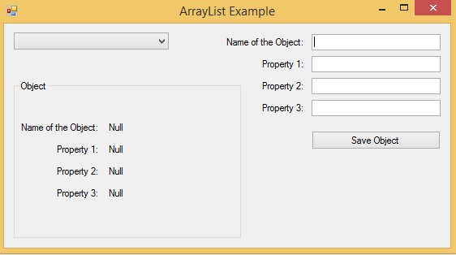
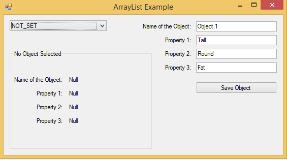
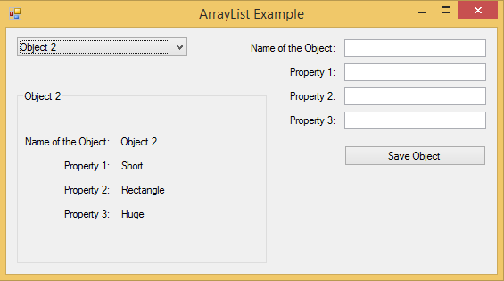

# Storing and Fetching Objects from an ArrayList (C#)
## Requires
- Visual Studio 2013
## License
- MS-LPL
## Technologies
- C#
- Data Access
- C# Language
- Visual Studio 2013
## Topics
- Arraylist
- C# Language Features
- Storing and Fetching Objects
## Updated
- 10/28/2014
## Description

<h1>Introduction</h1>

<em>If you are working in the financial/banking sector as a Software Developer then it might be possible that you have to build a software where you may need to save objects (with different properties) in ArrayList. Many modern developers will resent this
 practise and would recommend that it is better to save the object of a class as a List of its own such as List&lt;Class&gt;. But sometimes, you might not be sure how the actual class may be defined or what properties the class might have. Since, ArrayList
 can store any type of Objects in it (warning: ArrayList is not type safe, but using List&lt;T&gt; is) and sometimes in commercial software development ArrayLists are used quite often.</em>

<em>If you are a graduate software developer and need to develp this kind of software then this example gives you a walkthrough of how to appraoch this issue. Using this example you would understand the basics of storing the Object with different properties
 in the ArrayList and then retrieve the value of those properties of each object saved in the ArrayList and provide those as output.</em>

<em>Note: Although in this example the banking/financial software is of primary focus but this technqiue can be implemented in any software applications wherever and whenever required.</em>

<h1>Building the Sample</h1>

<em>The sample was built and debugged using Visual Studio Professional 2013. So just download and run.</em>

<em>(Should work on other versions of Visual Studio as well.)</em>

Description

<em>Sometimes storing and fetching an Object from the ArrayList is tricky, but not impossible. :P</em>

<em>This is actually achieved by by 2 stages:</em>

<em>1) Storing:</em>

<em>&nbsp;Storing the Object is easy. After the properties of the Object are saved are provided by the user, you just need to add them to the arraylist.&nbsp;</em>

<em>2) Fetching:</em>

<em>&nbsp;To fetch the Object with its properties you need to type cast the ArrayList to that Object and then fetch the properties of the object required (so that you can provide that as output).</em>

If we consider this example, which is a Windows Form Application, then the form application takes input of the properties of the object along with its name from the user, stores it in a combobox, and then when the user want to select the object he/she wishes
 to get details reagrding the properties of that object, from the combobox and see it. Fig.1 below shows the basic windows form application, which is more or less similar to the framework of few basic banking software form applications, which utilises storing
 and retrieving data (objects).

Fig.2 below shows the user's inputin the textboxes of the application. After the user presses the 'Save Object' button, the object with its properties are saved in the ArrayList, which is invisible from the user's eyes. But the properties of the Object can
 be fetched from the ArrayList by selecting the Object's name from the Combobox.

Fig.3 below shows how the properties of the selected Object is shown as output to the user by selecting the Object's name from the combobox dropdown list.

To store the main code snippet is:

&nbsp;

C#

Edit|Remove

csharp

<pre class="csharp">arraylist.Add((object)objectify);&nbsp;//Objectify&nbsp;is&nbsp;the&nbsp;Object&nbsp;saved&nbsp;and&nbsp;arraylist&nbsp;is&nbsp;the&nbsp;ArrayList&nbsp;where&nbsp;the&nbsp;object&nbsp;is&nbsp;added&nbsp;to</pre>

To fetch, first you need to type cast the object onto the ArrayList as mentioned before and as shown in the example code snippet:

C#

Edit|Remove

csharp

<pre class="js">Objectify&nbsp;Ob&nbsp;=&nbsp;(Objectify)arraylist[i];</pre>

For more information regarding how to use them properly, refer to the code snippet provided below or download the code provided.

&nbsp;

The complete code snippet for the example:

&nbsp;

C#

Edit|Remove

csharp

<pre class="csharp">using&nbsp;<a class="libraryLink" href="https://msdn.microsoft.com/en-US/library/System.Collections.aspx" target="_blank" title="Auto generated link to System.Collections">System.Collections</a>;&nbsp;//important&nbsp;to&nbsp;use&nbsp;this&nbsp;class&nbsp;to&nbsp;access&nbsp;the&nbsp;ArrayList&nbsp;
&nbsp;
//&lt;summary&gt;&nbsp;
//This&nbsp;Example&nbsp;shows&nbsp;you&nbsp;how&nbsp;to&nbsp;use&nbsp;ArrayList&nbsp;to&nbsp;store&nbsp;many&nbsp;Objects&nbsp;with&nbsp;different&nbsp;properties&nbsp;
//And&nbsp;then&nbsp;fetch&nbsp;the&nbsp;properties&nbsp;of&nbsp;each&nbsp;Object&nbsp;stored&nbsp;in&nbsp;the&nbsp;ArrayList&nbsp;&nbsp;
//when&nbsp;required&nbsp;for&nbsp;further&nbsp;computational&nbsp;purposes.&nbsp;
//&lt;/summary&gt;&nbsp;
&nbsp;
namespace&nbsp;WindowsFormsApplication1&nbsp;
{&nbsp;
&nbsp;&nbsp;&nbsp;&nbsp;public&nbsp;partial&nbsp;class&nbsp;Form1&nbsp;:&nbsp;Form&nbsp;
&nbsp;&nbsp;&nbsp;&nbsp;{&nbsp;
&nbsp;&nbsp;&nbsp;&nbsp;&nbsp;&nbsp;&nbsp;&nbsp;//Declarng&nbsp;the&nbsp;ArrayList&nbsp;in&nbsp;the&nbsp;beginning&nbsp;(globally)&nbsp;
&nbsp;&nbsp;&nbsp;&nbsp;&nbsp;&nbsp;&nbsp;&nbsp;//so&nbsp;that&nbsp;it&nbsp;can&nbsp;be&nbsp;accessed&nbsp;by&nbsp;anything&nbsp;in&nbsp;the&nbsp;Form1&nbsp;class&nbsp;
&nbsp;&nbsp;&nbsp;&nbsp;&nbsp;&nbsp;&nbsp;&nbsp;public&nbsp;ArrayList&nbsp;arraylist&nbsp;=&nbsp;new&nbsp;ArrayList();&nbsp;
&nbsp;&nbsp;&nbsp;&nbsp;&nbsp;&nbsp;&nbsp;&nbsp;
&nbsp;&nbsp;&nbsp;&nbsp;&nbsp;&nbsp;&nbsp;&nbsp;public&nbsp;Form1()&nbsp;
&nbsp;&nbsp;&nbsp;&nbsp;&nbsp;&nbsp;&nbsp;&nbsp;{&nbsp;
&nbsp;&nbsp;&nbsp;&nbsp;&nbsp;&nbsp;&nbsp;&nbsp;&nbsp;&nbsp;&nbsp;&nbsp;InitializeComponent();&nbsp;
&nbsp;&nbsp;&nbsp;&nbsp;&nbsp;&nbsp;&nbsp;&nbsp;&nbsp;&nbsp;&nbsp;&nbsp;comboBox1.Items.Add(&quot;NOT_SET&quot;);&nbsp;//set&nbsp;for&nbsp;default&nbsp;value&nbsp;in&nbsp;ComboBox&nbsp;
&nbsp;&nbsp;&nbsp;&nbsp;&nbsp;&nbsp;&nbsp;&nbsp;}&nbsp;
&nbsp;
&nbsp;&nbsp;&nbsp;&nbsp;&nbsp;&nbsp;&nbsp;&nbsp;private&nbsp;void&nbsp;comboBox1_SelectedIndexChanged(object&nbsp;sender,&nbsp;EventArgs&nbsp;e)&nbsp;
&nbsp;&nbsp;&nbsp;&nbsp;&nbsp;&nbsp;&nbsp;&nbsp;{&nbsp;
&nbsp;&nbsp;&nbsp;&nbsp;&nbsp;&nbsp;&nbsp;&nbsp;&nbsp;&nbsp;&nbsp;//NOT_SET&nbsp;is&nbsp;default&nbsp;
&nbsp;&nbsp;&nbsp;&nbsp;&nbsp;&nbsp;&nbsp;&nbsp;&nbsp;&nbsp;&nbsp;&nbsp;if(comboBox1.SelectedItem==&quot;NOT_SET&quot;)&nbsp;
&nbsp;&nbsp;&nbsp;&nbsp;&nbsp;&nbsp;&nbsp;&nbsp;&nbsp;&nbsp;&nbsp;&nbsp;{&nbsp;
&nbsp;&nbsp;&nbsp;&nbsp;&nbsp;&nbsp;&nbsp;&nbsp;&nbsp;&nbsp;&nbsp;&nbsp;&nbsp;&nbsp;&nbsp;&nbsp;groupBox1.Text&nbsp;=&nbsp;&quot;No&nbsp;Object&nbsp;Selected&quot;;&nbsp;
&nbsp;&nbsp;&nbsp;&nbsp;&nbsp;&nbsp;&nbsp;&nbsp;&nbsp;&nbsp;&nbsp;&nbsp;&nbsp;&nbsp;&nbsp;&nbsp;label9.Text&nbsp;=&nbsp;&quot;Null&quot;;&nbsp;
&nbsp;&nbsp;&nbsp;&nbsp;&nbsp;&nbsp;&nbsp;&nbsp;&nbsp;&nbsp;&nbsp;&nbsp;&nbsp;&nbsp;&nbsp;&nbsp;label10.Text&nbsp;=&nbsp;&quot;Null&quot;;&nbsp;
&nbsp;&nbsp;&nbsp;&nbsp;&nbsp;&nbsp;&nbsp;&nbsp;&nbsp;&nbsp;&nbsp;&nbsp;&nbsp;&nbsp;&nbsp;&nbsp;label11.Text&nbsp;=&nbsp;&quot;Null&quot;;&nbsp;
&nbsp;&nbsp;&nbsp;&nbsp;&nbsp;&nbsp;&nbsp;&nbsp;&nbsp;&nbsp;&nbsp;&nbsp;&nbsp;&nbsp;&nbsp;&nbsp;label12.Text&nbsp;=&nbsp;&quot;Null&quot;;&nbsp;
&nbsp;&nbsp;&nbsp;&nbsp;&nbsp;&nbsp;&nbsp;&nbsp;&nbsp;&nbsp;&nbsp;&nbsp;}&nbsp;
&nbsp;
&nbsp;&nbsp;&nbsp;&nbsp;&nbsp;&nbsp;&nbsp;&nbsp;&nbsp;&nbsp;&nbsp;&nbsp;//&lt;summary&gt;&nbsp;
&nbsp;&nbsp;&nbsp;&nbsp;&nbsp;&nbsp;&nbsp;&nbsp;&nbsp;&nbsp;&nbsp;&nbsp;//this&nbsp;for&nbsp;loop&nbsp;checks&nbsp;every&nbsp;Objects&nbsp;saved&nbsp;in&nbsp;the&nbsp;ArrayList&nbsp;
&nbsp;&nbsp;&nbsp;&nbsp;&nbsp;&nbsp;&nbsp;&nbsp;&nbsp;&nbsp;&nbsp;&nbsp;//and&nbsp;the&nbsp;fetches&nbsp;the&nbsp;properties&nbsp;of&nbsp;each&nbsp;Object&nbsp;from&nbsp;that&nbsp;ArrayList.&nbsp;
&nbsp;&nbsp;&nbsp;&nbsp;&nbsp;&nbsp;&nbsp;&nbsp;&nbsp;&nbsp;&nbsp;&nbsp;//In&nbsp;order&nbsp;to&nbsp;print&nbsp;out&nbsp;the&nbsp;properties&nbsp;of&nbsp;the&nbsp;Object,&nbsp;which&nbsp;is&nbsp;the&nbsp;selected&nbsp;item&nbsp;from&nbsp;the&nbsp;ComboBox,&nbsp;
&nbsp;&nbsp;&nbsp;&nbsp;&nbsp;&nbsp;&nbsp;&nbsp;&nbsp;&nbsp;&nbsp;&nbsp;//&nbsp;it&nbsp;first&nbsp;compares&nbsp;the&nbsp;name&nbsp;of&nbsp;the&nbsp;Object&nbsp;saved&nbsp;in&nbsp;the&nbsp;ArrayList&nbsp;and&nbsp;the&nbsp;ComboBox&nbsp;selected&nbsp;item,&nbsp;&nbsp;
&nbsp;&nbsp;&nbsp;&nbsp;&nbsp;&nbsp;&nbsp;&nbsp;&nbsp;&nbsp;&nbsp;&nbsp;//and&nbsp;if&nbsp;the&nbsp;names&nbsp;are&nbsp;same&nbsp;then&nbsp;only&nbsp;prints&nbsp;that&nbsp;out&nbsp;to&nbsp;the&nbsp;user&nbsp;as&nbsp;the&nbsp;output&nbsp;
&nbsp;&nbsp;&nbsp;&nbsp;&nbsp;&nbsp;&nbsp;&nbsp;&nbsp;&nbsp;&nbsp;&nbsp;//&lt;/summary&gt;&nbsp;
&nbsp;&nbsp;&nbsp;&nbsp;&nbsp;&nbsp;&nbsp;&nbsp;&nbsp;&nbsp;&nbsp;&nbsp;for&nbsp;(int&nbsp;i&nbsp;=&nbsp;0;&nbsp;i&nbsp;&lt;&nbsp;arraylist.Count;&nbsp;i&#43;&#43;)&nbsp;
&nbsp;&nbsp;&nbsp;&nbsp;&nbsp;&nbsp;&nbsp;&nbsp;&nbsp;&nbsp;&nbsp;&nbsp;{&nbsp;
&nbsp;&nbsp;&nbsp;&nbsp;&nbsp;&nbsp;&nbsp;&nbsp;&nbsp;&nbsp;&nbsp;&nbsp;&nbsp;&nbsp;&nbsp;&nbsp;Objectify&nbsp;Ob&nbsp;=&nbsp;(Objectify)arraylist[i];&nbsp;
&nbsp;&nbsp;&nbsp;&nbsp;&nbsp;&nbsp;&nbsp;&nbsp;&nbsp;&nbsp;&nbsp;&nbsp;&nbsp;&nbsp;&nbsp;&nbsp;if(string.Compare(comboBox1.SelectedItem.ToString(),&nbsp;Ob.name,&nbsp;true)==0)&nbsp;{&nbsp;
&nbsp;&nbsp;&nbsp;&nbsp;&nbsp;&nbsp;&nbsp;&nbsp;&nbsp;&nbsp;&nbsp;&nbsp;&nbsp;&nbsp;&nbsp;&nbsp;&nbsp;&nbsp;&nbsp;&nbsp;groupBox1.Text&nbsp;=&nbsp;Ob.name;&nbsp;
&nbsp;&nbsp;&nbsp;&nbsp;&nbsp;&nbsp;&nbsp;&nbsp;&nbsp;&nbsp;&nbsp;&nbsp;&nbsp;&nbsp;&nbsp;&nbsp;&nbsp;&nbsp;&nbsp;&nbsp;label9.Text&nbsp;=&nbsp;Ob.name;&nbsp;
&nbsp;&nbsp;&nbsp;&nbsp;&nbsp;&nbsp;&nbsp;&nbsp;&nbsp;&nbsp;&nbsp;&nbsp;&nbsp;&nbsp;&nbsp;&nbsp;&nbsp;&nbsp;&nbsp;&nbsp;label10.Text&nbsp;=&nbsp;Ob.property1;&nbsp;
&nbsp;&nbsp;&nbsp;&nbsp;&nbsp;&nbsp;&nbsp;&nbsp;&nbsp;&nbsp;&nbsp;&nbsp;&nbsp;&nbsp;&nbsp;&nbsp;&nbsp;&nbsp;&nbsp;&nbsp;label11.Text&nbsp;=&nbsp;Ob.property2;&nbsp;
&nbsp;&nbsp;&nbsp;&nbsp;&nbsp;&nbsp;&nbsp;&nbsp;&nbsp;&nbsp;&nbsp;&nbsp;&nbsp;&nbsp;&nbsp;&nbsp;&nbsp;&nbsp;&nbsp;&nbsp;label12.Text&nbsp;=&nbsp;Ob.property3;&nbsp;
&nbsp;&nbsp;&nbsp;&nbsp;&nbsp;&nbsp;&nbsp;&nbsp;&nbsp;&nbsp;&nbsp;&nbsp;&nbsp;&nbsp;&nbsp;&nbsp;}&nbsp;
&nbsp;&nbsp;&nbsp;&nbsp;&nbsp;&nbsp;&nbsp;&nbsp;&nbsp;&nbsp;&nbsp;&nbsp;}&nbsp;
&nbsp;&nbsp;&nbsp;&nbsp;&nbsp;&nbsp;&nbsp;&nbsp;}&nbsp;
&nbsp;
&nbsp;&nbsp;&nbsp;&nbsp;&nbsp;&nbsp;&nbsp;&nbsp;//creating&nbsp;a&nbsp;Class,&nbsp;of&nbsp;which&nbsp;the&nbsp;Object&nbsp;belongs&nbsp;to....&nbsp;
&nbsp;&nbsp;&nbsp;&nbsp;&nbsp;&nbsp;&nbsp;&nbsp;//The&nbsp;class&nbsp;has&nbsp;3&nbsp;property's&nbsp;fields&nbsp;and&nbsp;a&nbsp;name&nbsp;for&nbsp;identification&nbsp;
&nbsp;&nbsp;&nbsp;&nbsp;&nbsp;&nbsp;&nbsp;&nbsp;public&nbsp;class&nbsp;Objectify&nbsp;
&nbsp;&nbsp;&nbsp;&nbsp;&nbsp;&nbsp;&nbsp;&nbsp;{&nbsp;
&nbsp;&nbsp;&nbsp;&nbsp;&nbsp;&nbsp;&nbsp;&nbsp;&nbsp;&nbsp;&nbsp;&nbsp;public&nbsp;string&nbsp;name;&nbsp;
&nbsp;&nbsp;&nbsp;&nbsp;&nbsp;&nbsp;&nbsp;&nbsp;&nbsp;&nbsp;&nbsp;&nbsp;public&nbsp;string&nbsp;property1;&nbsp;
&nbsp;&nbsp;&nbsp;&nbsp;&nbsp;&nbsp;&nbsp;&nbsp;&nbsp;&nbsp;&nbsp;&nbsp;public&nbsp;string&nbsp;property2;&nbsp;
&nbsp;&nbsp;&nbsp;&nbsp;&nbsp;&nbsp;&nbsp;&nbsp;&nbsp;&nbsp;&nbsp;&nbsp;public&nbsp;string&nbsp;property3;&nbsp;
&nbsp;&nbsp;&nbsp;&nbsp;&nbsp;&nbsp;&nbsp;&nbsp;}&nbsp;
&nbsp;
&nbsp;&nbsp;&nbsp;&nbsp;&nbsp;&nbsp;&nbsp;&nbsp;//method&nbsp;to&nbsp;add&nbsp;the&nbsp;Object&nbsp;to&nbsp;the&nbsp;ArrayLst&nbsp;with&nbsp;its&nbsp;property's&nbsp;value,&nbsp;
&nbsp;&nbsp;&nbsp;&nbsp;&nbsp;&nbsp;&nbsp;&nbsp;//which&nbsp;are&nbsp;provided&nbsp;by&nbsp;the&nbsp;user&nbsp;
&nbsp;&nbsp;&nbsp;&nbsp;&nbsp;&nbsp;&nbsp;&nbsp;public&nbsp;void&nbsp;AddObject()&nbsp;{&nbsp;
&nbsp;&nbsp;&nbsp;&nbsp;&nbsp;&nbsp;&nbsp;&nbsp;&nbsp;&nbsp;&nbsp;&nbsp;//to&nbsp;check&nbsp;whether&nbsp;&nbsp;
&nbsp;&nbsp;&nbsp;&nbsp;&nbsp;&nbsp;&nbsp;&nbsp;&nbsp;&nbsp;&nbsp;&nbsp;if&nbsp;(textBox1.Text&nbsp;==&nbsp;&quot;&quot;)&nbsp;
&nbsp;&nbsp;&nbsp;&nbsp;&nbsp;&nbsp;&nbsp;&nbsp;&nbsp;&nbsp;&nbsp;&nbsp;{&nbsp;
&nbsp;&nbsp;&nbsp;&nbsp;&nbsp;&nbsp;&nbsp;&nbsp;&nbsp;&nbsp;&nbsp;&nbsp;&nbsp;&nbsp;&nbsp;&nbsp;MessageBox.Show(&quot;Can&nbsp;not&nbsp;create&nbsp;Objects&nbsp;with&nbsp;no&nbsp;name!&quot;);&nbsp;
&nbsp;&nbsp;&nbsp;&nbsp;&nbsp;&nbsp;&nbsp;&nbsp;&nbsp;&nbsp;&nbsp;&nbsp;&nbsp;&nbsp;&nbsp;&nbsp;return;&nbsp;
&nbsp;&nbsp;&nbsp;&nbsp;&nbsp;&nbsp;&nbsp;&nbsp;&nbsp;&nbsp;&nbsp;&nbsp;}&nbsp;
&nbsp;&nbsp;&nbsp;&nbsp;&nbsp;&nbsp;&nbsp;&nbsp;&nbsp;&nbsp;&nbsp;&nbsp;else&nbsp;if&nbsp;((textBox2.Text&nbsp;==&nbsp;&quot;&quot;)&nbsp;&amp;&amp;&nbsp;(textBox3.Text&nbsp;==&nbsp;&quot;&quot;)&nbsp;&amp;&amp;&nbsp;(textBox4.Text&nbsp;==&nbsp;&quot;&quot;))&nbsp;
&nbsp;&nbsp;&nbsp;&nbsp;&nbsp;&nbsp;&nbsp;&nbsp;&nbsp;&nbsp;&nbsp;&nbsp;{&nbsp;
&nbsp;&nbsp;&nbsp;&nbsp;&nbsp;&nbsp;&nbsp;&nbsp;&nbsp;&nbsp;&nbsp;&nbsp;&nbsp;&nbsp;&nbsp;&nbsp;MessageBox.Show(&quot;Can&nbsp;not&nbsp;create&nbsp;Objects&nbsp;with&nbsp;no&nbsp;properties&nbsp;at&nbsp;all&quot;);&nbsp;
&nbsp;&nbsp;&nbsp;&nbsp;&nbsp;&nbsp;&nbsp;&nbsp;&nbsp;&nbsp;&nbsp;&nbsp;&nbsp;&nbsp;&nbsp;&nbsp;return;&nbsp;
&nbsp;&nbsp;&nbsp;&nbsp;&nbsp;&nbsp;&nbsp;&nbsp;&nbsp;&nbsp;&nbsp;&nbsp;}&nbsp;
&nbsp;
&nbsp;&nbsp;&nbsp;&nbsp;&nbsp;&nbsp;&nbsp;&nbsp;&nbsp;&nbsp;&nbsp;&nbsp;//Creating&nbsp;Object&nbsp;of&nbsp;class&nbsp;Objectify&nbsp;and&nbsp;storing&nbsp;all&nbsp;properties&nbsp;of&nbsp;it&nbsp;&nbsp;
&nbsp;&nbsp;&nbsp;&nbsp;&nbsp;&nbsp;&nbsp;&nbsp;&nbsp;&nbsp;&nbsp;&nbsp;//from&nbsp;user&nbsp;input&nbsp;textboxes&nbsp;
&nbsp;&nbsp;&nbsp;&nbsp;&nbsp;&nbsp;&nbsp;&nbsp;&nbsp;&nbsp;&nbsp;&nbsp;Objectify&nbsp;objectify&nbsp;=&nbsp;new&nbsp;Objectify();&nbsp;
&nbsp;&nbsp;&nbsp;&nbsp;&nbsp;&nbsp;&nbsp;&nbsp;&nbsp;&nbsp;&nbsp;&nbsp;objectify.name&nbsp;=&nbsp;textBox1.Text;&nbsp;
&nbsp;&nbsp;&nbsp;&nbsp;&nbsp;&nbsp;&nbsp;&nbsp;&nbsp;&nbsp;&nbsp;&nbsp;objectify.property1&nbsp;=&nbsp;textBox2.Text;&nbsp;
&nbsp;&nbsp;&nbsp;&nbsp;&nbsp;&nbsp;&nbsp;&nbsp;&nbsp;&nbsp;&nbsp;&nbsp;objectify.property2&nbsp;=&nbsp;textBox3.Text;&nbsp;
&nbsp;&nbsp;&nbsp;&nbsp;&nbsp;&nbsp;&nbsp;&nbsp;&nbsp;&nbsp;&nbsp;&nbsp;objectify.property3&nbsp;=&nbsp;textBox4.Text;&nbsp;
&nbsp;
&nbsp;&nbsp;&nbsp;&nbsp;&nbsp;&nbsp;&nbsp;&nbsp;&nbsp;&nbsp;&nbsp;&nbsp;//adding&nbsp;the&nbsp;Object&nbsp;with&nbsp;its&nbsp;properties&nbsp;in&nbsp;the&nbsp;ArrayList&nbsp;
&nbsp;&nbsp;&nbsp;&nbsp;&nbsp;&nbsp;&nbsp;&nbsp;&nbsp;&nbsp;&nbsp;&nbsp;arraylist.Add((object)objectify);&nbsp;
&nbsp;
&nbsp;&nbsp;&nbsp;&nbsp;&nbsp;&nbsp;&nbsp;&nbsp;&nbsp;&nbsp;&nbsp;&nbsp;//adding&nbsp;this&nbsp;Object&nbsp;Name&nbsp;to&nbsp;the&nbsp;ComboBox&nbsp;so&nbsp;that&nbsp;
&nbsp;&nbsp;&nbsp;&nbsp;&nbsp;&nbsp;&nbsp;&nbsp;&nbsp;&nbsp;&nbsp;&nbsp;//it&nbsp;can&nbsp;be&nbsp;accessed/referred&nbsp;easily&nbsp;from&nbsp;the&nbsp;
&nbsp;&nbsp;&nbsp;&nbsp;&nbsp;&nbsp;&nbsp;&nbsp;&nbsp;&nbsp;&nbsp;&nbsp;//dropdown&nbsp;list&nbsp;
&nbsp;&nbsp;&nbsp;&nbsp;&nbsp;&nbsp;&nbsp;&nbsp;&nbsp;&nbsp;&nbsp;&nbsp;comboBox1.Items.Add(objectify.name);&nbsp;
&nbsp;&nbsp;&nbsp;&nbsp;&nbsp;&nbsp;&nbsp;&nbsp;}&nbsp;
&nbsp;
&nbsp;&nbsp;&nbsp;&nbsp;&nbsp;&nbsp;&nbsp;&nbsp;//method&nbsp;for&nbsp;Button&nbsp;Action&nbsp;when&nbsp;clicked&nbsp;
&nbsp;&nbsp;&nbsp;&nbsp;&nbsp;&nbsp;&nbsp;&nbsp;private&nbsp;void&nbsp;button1_Click(object&nbsp;sender,&nbsp;EventArgs&nbsp;e)&nbsp;
&nbsp;&nbsp;&nbsp;&nbsp;&nbsp;&nbsp;&nbsp;&nbsp;{&nbsp;
&nbsp;&nbsp;&nbsp;&nbsp;&nbsp;&nbsp;&nbsp;&nbsp;&nbsp;&nbsp;&nbsp;&nbsp;//first&nbsp;adding&nbsp;the&nbsp;Object&nbsp;to&nbsp;the&nbsp;ArrayList&nbsp;
&nbsp;&nbsp;&nbsp;&nbsp;&nbsp;&nbsp;&nbsp;&nbsp;&nbsp;&nbsp;&nbsp;&nbsp;AddObject();&nbsp;
&nbsp;
&nbsp;&nbsp;&nbsp;&nbsp;&nbsp;&nbsp;&nbsp;&nbsp;&nbsp;&nbsp;&nbsp;&nbsp;//After&nbsp;that&nbsp;clearing&nbsp;the&nbsp;input&nbsp;text&nbsp;fields&nbsp;
&nbsp;&nbsp;&nbsp;&nbsp;&nbsp;&nbsp;&nbsp;&nbsp;&nbsp;&nbsp;&nbsp;&nbsp;textBox1.Text&nbsp;=&nbsp;&quot;&quot;;&nbsp;
&nbsp;&nbsp;&nbsp;&nbsp;&nbsp;&nbsp;&nbsp;&nbsp;&nbsp;&nbsp;&nbsp;&nbsp;textBox2.Text&nbsp;=&nbsp;&quot;&quot;;&nbsp;
&nbsp;&nbsp;&nbsp;&nbsp;&nbsp;&nbsp;&nbsp;&nbsp;&nbsp;&nbsp;&nbsp;&nbsp;textBox3.Text&nbsp;=&nbsp;&quot;&quot;;&nbsp;
&nbsp;&nbsp;&nbsp;&nbsp;&nbsp;&nbsp;&nbsp;&nbsp;&nbsp;&nbsp;&nbsp;&nbsp;textBox4.Text&nbsp;=&nbsp;&quot;&quot;;&nbsp;
&nbsp;&nbsp;&nbsp;&nbsp;&nbsp;&nbsp;&nbsp;&nbsp;}&nbsp;
&nbsp;&nbsp;&nbsp;&nbsp;}&nbsp;
}</pre>

<h1>Source Code Files</h1>
<ul>
<li><em>source code file Form1.cs - main implemntation to the issue of ArrayList is provided here</em>
</li><li><em><em>source code file Form1.Designer.cs - Windows Form Desginer code file</em></em>
</li><li><em>source code file Program.cs - main program file with various main application initialisations</em>
</li></ul>
<h1>More Information</h1>
<h3><strong>Written by Somdip Dey, Software Engineer, Steanne Solutions Ltd., UK</strong></h3>
