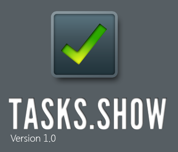

# Tasks.Show
## Requires
- Visual Studio 2010
## License
- Apache License, Version 2.0
## Technologies
- WPF
## Topics
- Windows
## Updated
- 02/22/2011
## Description

Are you still using yellow sticky notes to remember tasks on your to-do list. Did you ever need an easy, light and quick way to manage your to-do list? Well we got a solution for you. Tasks.Show is a simple Windows application
 that lets you manage your to-do list in an easy and intuitive meaner. Simply create new task, assign it to a project and give it a deadline, and you are set.
 
Tasks.Show is a developer resource application, where you get to full source code of complete and fully functional application that is using Windows 7 unique features like Windows Touch and the Windows Taskbar.

<strong>Installing</strong> 
You can use the <a href="http://archive.msdn.microsoft.com/Project/Download/FileDownload.aspx?ProjectName=Tasks&DownloadId=12872">
MSI installer</a>, to install Tasks.Show no your PC. You'll need to install&nbsp;Tasks.Show before you try run it from Visual Studio

<strong>Working with Visual Studio</strong>

<a href="http://code.msdn.microsoft.com//TasksShow-1bf01c8d/file/18647/1/Tasks.Show.Source.zip">Download</a> Tasks.Show source code for Visual Studio 2010. Before you can run the application from Visual Studio, make sure you
 install Tasks.Show. This way the installer sets up all the registry setting to allows your application to work with Windows 7
Taskbar. 

 
To compile and run this application you&rsquo;ll need

<ul>
<li>Windows 7 </li><li>Visual Studio 2010 </li></ul>
