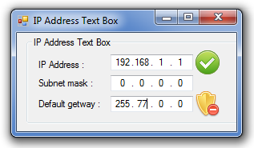

# Text field for IP Address valid using  IPAddressBox  For Visual Studio 2010 C#
## Requires
- Visual Studio 2010
## License
- MIT
## Technologies
- Windows Forms
- TCP/IP
- MaskedTextBox
## Topics
- IP Address
## Updated
- 09/24/2015
## Description

<h1>Introduction</h1>

<em>MaskedTextBox For IP Address, an additional toolbox for IP Address filed. For programmers who need a Windows form that has filed vaidasi sangant IP Address toolbox to be used.</em>

<h1>Building the Sample</h1>

<em>private void button1_Click(object sender, EventArgs e) 
&nbsp;&nbsp;&nbsp;&nbsp;&nbsp;&nbsp;&nbsp; { 
&nbsp;&nbsp;&nbsp;&nbsp;&nbsp;&nbsp;&nbsp;&nbsp;&nbsp;&nbsp;&nbsp; label4.Text = ipAddressControl1.IPAddress.ToString(); 
&nbsp;&nbsp;&nbsp;&nbsp;&nbsp;&nbsp;&nbsp; }</em>

Description

nstallation Method:

<ol>
<li>Inport MaskedTextBox IP Address into the Toolbox, </li><li>Select the tab Firemework .Net Components, </li><li>Inport IPAddressControl.dll (Click Browse .. get IPAddressControl.dll file) </li><li>.Net Framework ComponentsPada search tool toolbox IPAddressControl use this tool as the IP Address field.
</li></ol>

<em>&nbsp;
 
</em>

&nbsp;

C#

Edit|Remove

csharp
<pre class="hidden">private void button1_Click(object sender, EventArgs e) 
  {            
     label4.Text = IpAddressControl1.IPAddress.ToString();        
  }</pre>

<pre class="csharp">private&nbsp;void&nbsp;button1_Click(object&nbsp;sender,&nbsp;EventArgs&nbsp;e)&nbsp;&nbsp;
&nbsp;&nbsp;{&nbsp;&nbsp;&nbsp;&nbsp;&nbsp;&nbsp;&nbsp;&nbsp;&nbsp;&nbsp;&nbsp;&nbsp;&nbsp;
&nbsp;&nbsp;&nbsp;&nbsp;&nbsp;label4.Text&nbsp;=&nbsp;IpAddressControl1.IPAddress.ToString();&nbsp;&nbsp;&nbsp;&nbsp;&nbsp;&nbsp;&nbsp;&nbsp;&nbsp;
&nbsp;&nbsp;}</pre>

<h1>Source Code Files</h1>
<ul>
</ul>

&nbsp;[StructLayout(LayoutKind.Sequential)] 
&nbsp;&nbsp;&nbsp; public struct Nmhdr 
&nbsp;&nbsp;&nbsp; { 
&nbsp;&nbsp;&nbsp;&nbsp;&nbsp;&nbsp;&nbsp; public IntPtr HWndFrom; 
&nbsp;&nbsp;&nbsp;&nbsp;&nbsp;&nbsp;&nbsp; public UIntPtr IdFrom; 
&nbsp;&nbsp;&nbsp;&nbsp;&nbsp;&nbsp;&nbsp; public int Code; 
&nbsp;&nbsp;&nbsp; } 
 
&nbsp;&nbsp;&nbsp; [StructLayout(LayoutKind.Sequential)] 
&nbsp;&nbsp;&nbsp; public struct NmIPAddress 
&nbsp;&nbsp;&nbsp; { 
&nbsp;&nbsp;&nbsp;&nbsp;&nbsp;&nbsp;&nbsp; public Nmhdr Hdr; 
&nbsp;&nbsp;&nbsp;&nbsp;&nbsp;&nbsp;&nbsp; public int Field; 
&nbsp;&nbsp;&nbsp;&nbsp;&nbsp;&nbsp;&nbsp; public int Value; 
&nbsp;&nbsp;&nbsp; } 
 
&nbsp;&nbsp;&nbsp; [StructLayout(LayoutKind.Sequential)] 
&nbsp;&nbsp;&nbsp; public struct InitCommonControlsEX 
&nbsp;&nbsp;&nbsp; { 
&nbsp;&nbsp;&nbsp;&nbsp;&nbsp;&nbsp;&nbsp; public int Size; 
&nbsp;&nbsp;&nbsp;&nbsp;&nbsp;&nbsp;&nbsp; public int Icc; 
&nbsp;&nbsp;&nbsp; } 
 
&nbsp;&nbsp;&nbsp; public enum IPField 
&nbsp;&nbsp;&nbsp; { 
&nbsp;&nbsp;&nbsp;&nbsp;&nbsp;&nbsp;&nbsp; OctetOne = 0, 
&nbsp;&nbsp;&nbsp;&nbsp;&nbsp;&nbsp;&nbsp; OctetTwo = 1, 
&nbsp;&nbsp;&nbsp;&nbsp;&nbsp;&nbsp;&nbsp; OctetThree = 2, 
&nbsp;&nbsp;&nbsp;&nbsp;&nbsp;&nbsp;&nbsp; OctetFour = 3 
&nbsp;&nbsp;&nbsp; }

<ul>
</ul>
<h1>More Information</h1>

<em><em>MaskedTextBox For IP Address, an additional toolbox for IP Address filed. For programmers who need a Windows form that has filed vaidasi sangant IP Address toolbox to be used.</em></em>

