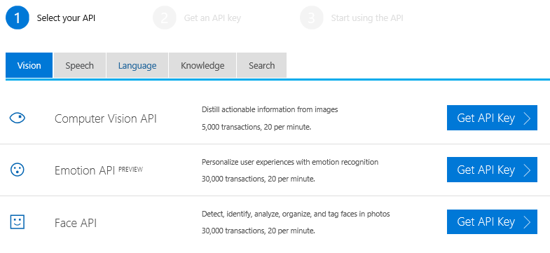
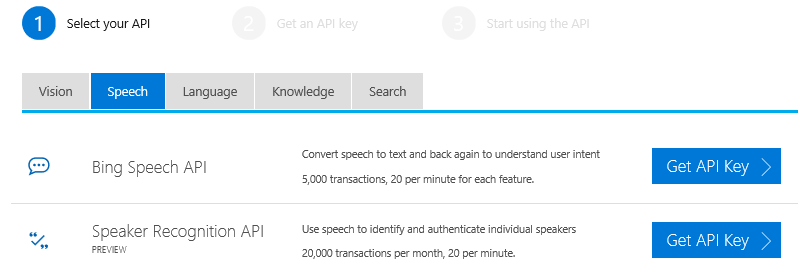
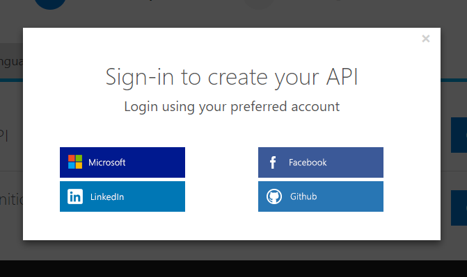
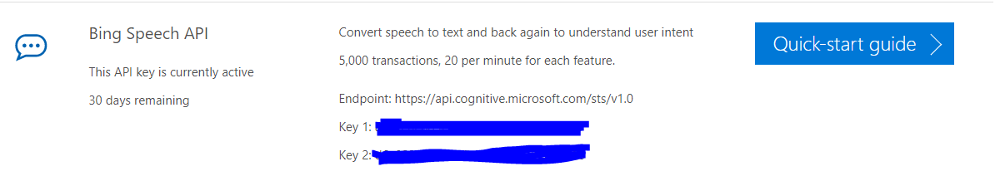
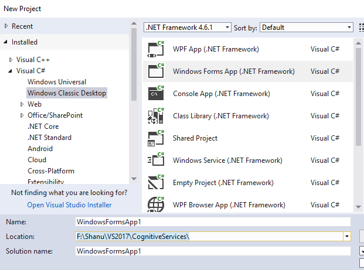
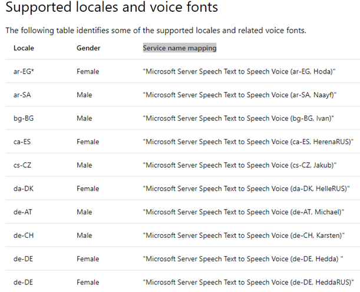
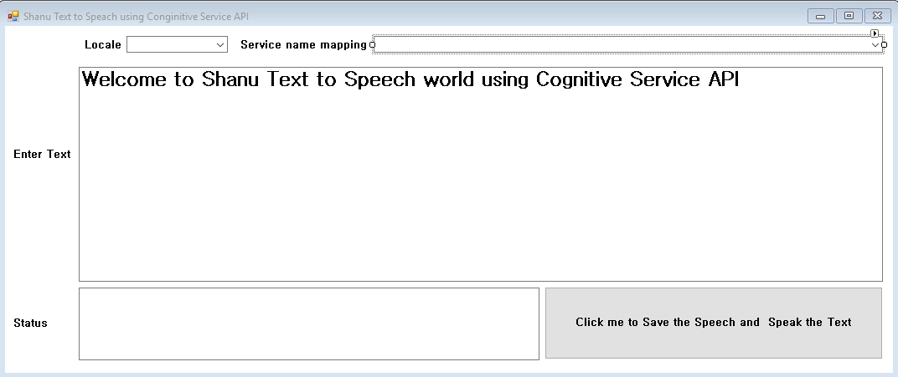
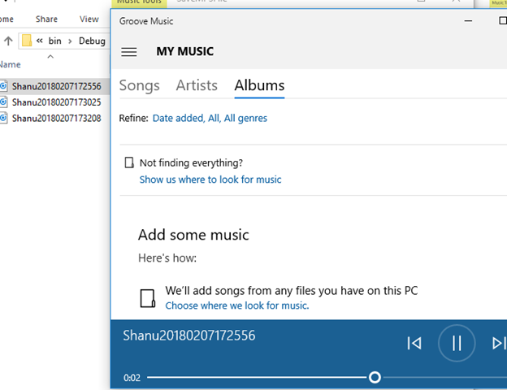

# Text to Speech using Cognitive Service Speech API C#
## Requires
- Visual Studio 2017
## License
- MIT
## Technologies
- C#
- Windows Forms
- .NET Framework
- Cognitive Services
## Topics
- C#
- Windows Forms
- .NET Framework
- Cognitive Services
## Updated
- 02/07/2018
## Description

<h1>Introduction</h1>

In this article we will see in detail about how to create our own Text to Speech Application using Cognitive Services. Cognitive Services are nothing but a set of machine learning algorithm to build a rich Artificial Intelligence application. Hope you all
 aware about Artificial Intelligence, we can say IPhone Siri, windows 10 Cortana and an automatic robotic car which run by its own as an example for Artificial Intelligence.

Microsoft Cognitive Services (formerly Project Oxford) are a set of APIs, SDKs and services available to developers to make their applications more intelligent, engaging and discoverable. Microsoft Cognitive Services expands on Microsoft&rsquo;s evolving
 portfolio of machine learning APIs and enables developers to easily add intelligent features &ndash; such as emotion and video detection, facial, speech and vision recognition, speech and language understanding into our applications.<a href="https://docs.microsoft.com/en-us/azure/cognitive-services/welcome" target="_blank">Ref
 link:&nbsp;&nbsp;</a>

We will be using Cognitive Service API in develop about Artificial Intelligence application. Cognitive Service API has 5 Main Category as

<ol>
<li>Vision </li><li>Speech </li><li>Language </li><li>Knowledge </li><li>Search </li></ol>
<h2><strong>Vision API&rsquo;s:</strong></h2>

In Vision API we have Computer Vision API for Distill actionable information from images, Face API to Detect, identify, analyze, organize, and tag faces in photos, Content Moderator to Automated image, text, and video moderation, Emotion API PREVIEW to personalize
 user experiences with emotion recognition and Custom Vision Service PREVIEW for easily customize your own state-of-the-art computer vision models for your unique use case.

<h2><strong>Speech API&rsquo;s:</strong></h2>

In Speech API we have Translator Speech API to easily conduct real-time speech translation with a simple REST API call, Speaker Recognition API PREVIEW for use speech to identify and authenticate individual speakers, Bing Speech API for Converting speech
 to text and back again to understand user intent, Custom Speech Service PREVIEW to overcome speech recognition barriers like speaking style, background noise, and vocabulary

<h2><strong>Language API&rsquo;s:</strong></h2>

In Language API we have Language Understanding (LUIS) to teach your apps to understand commands from your users, Text Analytics API for easily evaluate sentiment and topics to understand what users want, Bing Spell Check API to detect and correct spelling
 mistakes in your app, Translator Text API to easily conduct machine translation with a simple REST API call, Web Language Model API PREVIEW to use the power of predictive language models trained on web-scale data, Linguistic Analysis API PREVIEW for simplify
 complex language concepts and parse text with the Linguistic Analysis API

<h2><strong>Knowledge API&rsquo;s:</strong></h2>

In Knowledge API we have Recommendations API PREVIEW to predict and recommend items your customers want, Academic Knowledge API PREVIEW to tap into the wealth of academic content in the Microsoft Academic Graph, Knowledge Exploration Service PREVIEW enable
 interactive search experiences over structured data via natural language inputs, QnA Maker API PREVIEW distill information into conversational, easy-to-navigate answers, Entity Linking Intelligence Service API PREVIEW will power your app's data links with
 named entity recognition and disambiguation, Custom Decision Service&nbsp; PREVIEW is a cloud-based, contextual decision-making API that sharpens with experience

<h2><strong>Search API&rsquo;s:</strong></h2>

In Search API we have Bing Autosuggest API&nbsp; give your app intelligent autosuggest options for searches, Bing Image Search API is to search for images and get comprehensive results, Bing News Search API is to Search for news and get comprehensive results,
 Bing Video Search API&nbsp; is to search for videos and get comprehensive results, Bing Web Search API&nbsp; is to get enhanced search details from billions of web documents, Bing Custom Search API&nbsp; is an easy-to-use, ad-free, commercial-grade search
 tool that lets , Bing Entity Search API&nbsp; PREVIEW to enrich your experiences by identifying and augmenting entity information from the web you deliver the results you want.<a href="https://azure.microsoft.com/en-us/services/cognitive-services/directory/vision/    " target="_blank">Ref
 link:</a> &nbsp;&nbsp;

&nbsp;In this article we will be see in detail about how to use the Bing Speech API for to read from text in multiple language and also save the audio file for later use using the Bing Speech API Cognitive Services.

<h1>Building the Sample</h1>
<h1><strong>Prerequisites:</strong></h1>
<ol>
<li>Download and install Visual Studio 2017 from this&nbsp;<a href="https://www.visualstudio.com/" target="_blank">link</a>.
</li><li>Register yourself for getting the Cognitive Service API keys.<a href=" https://azure.microsoft.com/en-gb/services/cognitive-services/" target="_blank">Link</a>
</li><li>After Register from this link get your API KEY <a href="https://azure.microsoft.com/en-us/try/cognitive-services/" target="_blank">
link</a> </li></ol>
<h1><strong>How to Get Bing Speech API KEY</strong></h1>

To work with Cognitive Services, we need to use the API Key which was been given from our Microsoft web site. Check the prerequisites and fallow the steps to register and get the API key.
<a href="https://azure.microsoft.com/en-us/try/cognitive-services/" target="_blank">
Open this URL</a> &nbsp;and make sure as you have already signed in to the site and If not then sign in with your ID.

As we are going to work with Bing Speech API, Select the Speech API and then click on the get API Key for Bing Speech API.

Click on the Get API Key for Bing Speech API.

Sign in with your ID&nbsp;

After login we can see our Bing Speech API Key to be used in our Code developing our Text to Speech application.

Description

We will be using Bing text to speech API for developing our Text to Speech application. In this application we will be using multi language text to speech by using the locale of the Bing text to speech API. From this
<a href="https://docs.microsoft.com/en-us/azure/cognitive-services/speech/api-reference-rest/bingvoiceoutput " target="_blank">
link </a>you can get all the information about Bing Text to Speech API. This link also has a simple Console application demo program to explain about how to use the Bing text to speech API, we will be using the &ldquo;TTSProgram.cs&rdquo; from the sample solution
 in our application and this class has all the function to perform the text to speech. You can get the class file from this
<a href="https://github.com/Azure-Samples/Cognitive-Speech-TTS/blob/master/Samples-Http/CSharp/TTSProgram.cs " target="_blank">
link </a>,In our application we will be creating Windows form Application.

<h1><strong>Step 1 - Create&nbsp;Windows Form Application</strong></h1>

After installing all the prerequisites listed above, click Start &gt;&gt; Programs &gt;&gt; Visual Studio 2017 &gt;&gt; Visual Studio 2017, on your desktop.

Click New &gt;&gt; Project. Select Visual C# &gt;Select Windows Classic Desktop &gt;&gt; Select Windows Forms App and select your project folder and give your application name and click Ok to create your Windows Form application.

After creating the project now let&rsquo;s add the &ldquo;TTSProgram.cs&rdquo; in our project.Add existing Item and select the &ldquo;TTSProgram.cs&rdquo; from the attached zip file

<h1><strong>Step 2 &ndash; Add Controls to your form</strong></h1>

In this demo application we have added 2 Combobox ,2 textbox and one button.In the Combox I have added the Locale and Service name mapping for multi-language text to speech recording.Its good to see more than 30 Langague can be used for locale,You can get
 the complete list of language can be used with Locale and Service name mapping rom this&nbsp;<a href="https://docs.microsoft.com/en-us/azure/cognitive-services/speech/api-reference-rest/bingvoiceoutput" target="_blank">link&nbsp;</a>

Here we will be using 3 Language as English,Tamil and Korean language.In Locale Combobox we have added the item as &ldquo;en-US, ko-KR, ta-IN &ldquo; and Service name mapping in another combobox item as &ldquo;Microsoft Server Speech Text to Speech Voice
 (en-US, ZiraRUS), Microsoft Server Speech Text to Speech Voice (ko-KR, HeamiRUS), Microsoft Server Speech Text to Speech Voice (ta-IN, Valluvar)&rdquo;

Our Form design look like this&nbsp;

<h1><strong>Step 3 &ndash; Button Click Event</strong></h1>

In the Button Click event. We add our API Key in Authentication section and check for the key is valid and if the API Key is valid then we create object for the Synthesize all the Authentication and Synthesie calss has been used from the &ldquo;TTSProgram.cs&rdquo;
 class. Here we have created to 2 event one is to play the Audio after reading the Text and another event to display the error message, then we call the cortana.Speak method and pass user entered textbox text along with Locale and service name mapping to speck
 in the user selected language.&nbsp;

&nbsp;

C#

Edit|Remove

csharp
<pre class="hidden">private void btnSpeak_Click(object sender, EventArgs e)
		{
			txtstatus.Text = &quot;Starting Authtentication&quot;;
			string accessToken; 
			Authentication auth = new Authentication(&quot;AddYourAPIKEYHere&quot;);
			try
			{
				accessToken = auth.GetAccessToken();
				txtstatus.Text = &quot;Token: {0} &quot; &#43; accessToken;
			}
			catch (Exception ex)
			{
				txtstatus.Text = &quot;Failed authentication.&quot;;
				
				txtstatus.Text = ex.Message;
				return;
			}

			txtstatus.Text = &quot;Starting TTSSample request code execution.&quot;;
			string requestUri = &quot;https://speech.platform.bing.com/synthesize&quot;;
			var cortana = new Synthesize();
			cortana.OnAudioAvailable &#43;= PlayAudio;
			cortana.OnError &#43;= ErrorHandler;  
			cortana.Speak(CancellationToken.None, new Synthesize.InputOptions()
			{
				RequestUri = new Uri(requestUri),
				Text = txtSpeak.Text,
				VoiceType = Gender.Female, 
				Locale = cboLocale.SelectedItem.ToString(), 
				VoiceName = cboServiceName.SelectedItem.ToString(),  
				OutputFormat = AudioOutputFormat.Riff16Khz16BitMonoPcm,
				AuthorizationToken = &quot;Bearer &quot; &#43; accessToken,
			}).Wait();
		}
</pre>

<pre class="js">private&nbsp;void&nbsp;btnSpeak_Click(object&nbsp;sender,&nbsp;EventArgs&nbsp;e)&nbsp;
&nbsp;&nbsp;&nbsp;&nbsp;&nbsp;&nbsp;&nbsp;&nbsp;{&nbsp;
&nbsp;&nbsp;&nbsp;&nbsp;&nbsp;&nbsp;&nbsp;&nbsp;&nbsp;&nbsp;&nbsp;&nbsp;txtstatus.Text&nbsp;=&nbsp;&quot;Starting&nbsp;Authtentication&quot;;&nbsp;
&nbsp;&nbsp;&nbsp;&nbsp;&nbsp;&nbsp;&nbsp;&nbsp;&nbsp;&nbsp;&nbsp;&nbsp;string&nbsp;accessToken;&nbsp;&nbsp;
&nbsp;&nbsp;&nbsp;&nbsp;&nbsp;&nbsp;&nbsp;&nbsp;&nbsp;&nbsp;&nbsp;&nbsp;Authentication&nbsp;auth&nbsp;=&nbsp;new&nbsp;Authentication(&quot;AddYourAPIKEYHere&quot;);&nbsp;
&nbsp;&nbsp;&nbsp;&nbsp;&nbsp;&nbsp;&nbsp;&nbsp;&nbsp;&nbsp;&nbsp;&nbsp;try{&nbsp;
&nbsp;&nbsp;&nbsp;&nbsp;&nbsp;&nbsp;&nbsp;&nbsp;&nbsp;&nbsp;&nbsp;&nbsp;&nbsp;&nbsp;&nbsp;&nbsp;accessToken&nbsp;=&nbsp;auth.GetAccessToken();&nbsp;
&nbsp;&nbsp;&nbsp;&nbsp;&nbsp;&nbsp;&nbsp;&nbsp;&nbsp;&nbsp;&nbsp;&nbsp;&nbsp;&nbsp;&nbsp;&nbsp;txtstatus.Text&nbsp;=&nbsp;&quot;Token:&nbsp;{0}&nbsp;&quot;&nbsp;&#43;&nbsp;accessToken;&nbsp;
&nbsp;&nbsp;&nbsp;&nbsp;&nbsp;&nbsp;&nbsp;&nbsp;&nbsp;&nbsp;&nbsp;&nbsp;}catch&nbsp;(Exception&nbsp;ex)&nbsp;
&nbsp;&nbsp;&nbsp;&nbsp;&nbsp;&nbsp;&nbsp;&nbsp;&nbsp;&nbsp;&nbsp;&nbsp;{&nbsp;
&nbsp;&nbsp;&nbsp;&nbsp;&nbsp;&nbsp;&nbsp;&nbsp;&nbsp;&nbsp;&nbsp;&nbsp;&nbsp;&nbsp;&nbsp;&nbsp;txtstatus.Text&nbsp;=&nbsp;&quot;Failed&nbsp;authentication.&quot;;&nbsp;
&nbsp;&nbsp;&nbsp;&nbsp;&nbsp;&nbsp;&nbsp;&nbsp;&nbsp;&nbsp;&nbsp;&nbsp;&nbsp;&nbsp;&nbsp;&nbsp;&nbsp;
&nbsp;&nbsp;&nbsp;&nbsp;&nbsp;&nbsp;&nbsp;&nbsp;&nbsp;&nbsp;&nbsp;&nbsp;&nbsp;&nbsp;&nbsp;&nbsp;txtstatus.Text&nbsp;=&nbsp;ex.Message;&nbsp;
&nbsp;&nbsp;&nbsp;&nbsp;&nbsp;&nbsp;&nbsp;&nbsp;&nbsp;&nbsp;&nbsp;&nbsp;&nbsp;&nbsp;&nbsp;&nbsp;return;&nbsp;
&nbsp;&nbsp;&nbsp;&nbsp;&nbsp;&nbsp;&nbsp;&nbsp;&nbsp;&nbsp;&nbsp;&nbsp;}&nbsp;
&nbsp;
&nbsp;&nbsp;&nbsp;&nbsp;&nbsp;&nbsp;&nbsp;&nbsp;&nbsp;&nbsp;&nbsp;&nbsp;txtstatus.Text&nbsp;=&nbsp;&quot;Starting&nbsp;TTSSample&nbsp;request&nbsp;code&nbsp;execution.&quot;;&nbsp;
&nbsp;&nbsp;&nbsp;&nbsp;&nbsp;&nbsp;&nbsp;&nbsp;&nbsp;&nbsp;&nbsp;&nbsp;string&nbsp;requestUri&nbsp;=&nbsp;&quot;https://speech.platform.bing.com/synthesize&quot;;&nbsp;
&nbsp;&nbsp;&nbsp;&nbsp;&nbsp;&nbsp;&nbsp;&nbsp;&nbsp;&nbsp;&nbsp;&nbsp;var&nbsp;cortana&nbsp;=&nbsp;new&nbsp;Synthesize();&nbsp;
&nbsp;&nbsp;&nbsp;&nbsp;&nbsp;&nbsp;&nbsp;&nbsp;&nbsp;&nbsp;&nbsp;&nbsp;cortana.OnAudioAvailable&nbsp;&#43;=&nbsp;PlayAudio;&nbsp;
&nbsp;&nbsp;&nbsp;&nbsp;&nbsp;&nbsp;&nbsp;&nbsp;&nbsp;&nbsp;&nbsp;&nbsp;cortana.OnError&nbsp;&#43;=&nbsp;ErrorHandler;&nbsp;&nbsp;&nbsp;
&nbsp;&nbsp;&nbsp;&nbsp;&nbsp;&nbsp;&nbsp;&nbsp;&nbsp;&nbsp;&nbsp;&nbsp;cortana.Speak(CancellationToken.None,&nbsp;new&nbsp;Synthesize.InputOptions()&nbsp;
&nbsp;&nbsp;&nbsp;&nbsp;&nbsp;&nbsp;&nbsp;&nbsp;&nbsp;&nbsp;&nbsp;&nbsp;{&nbsp;
&nbsp;&nbsp;&nbsp;&nbsp;&nbsp;&nbsp;&nbsp;&nbsp;&nbsp;&nbsp;&nbsp;&nbsp;&nbsp;&nbsp;&nbsp;&nbsp;RequestUri&nbsp;=&nbsp;new&nbsp;Uri(requestUri),&nbsp;
&nbsp;&nbsp;&nbsp;&nbsp;&nbsp;&nbsp;&nbsp;&nbsp;&nbsp;&nbsp;&nbsp;&nbsp;&nbsp;&nbsp;&nbsp;&nbsp;Text&nbsp;=&nbsp;txtSpeak.Text,&nbsp;
&nbsp;&nbsp;&nbsp;&nbsp;&nbsp;&nbsp;&nbsp;&nbsp;&nbsp;&nbsp;&nbsp;&nbsp;&nbsp;&nbsp;&nbsp;&nbsp;VoiceType&nbsp;=&nbsp;Gender.Female,&nbsp;&nbsp;
&nbsp;&nbsp;&nbsp;&nbsp;&nbsp;&nbsp;&nbsp;&nbsp;&nbsp;&nbsp;&nbsp;&nbsp;&nbsp;&nbsp;&nbsp;&nbsp;Locale&nbsp;=&nbsp;cboLocale.SelectedItem.ToString(),&nbsp;&nbsp;
&nbsp;&nbsp;&nbsp;&nbsp;&nbsp;&nbsp;&nbsp;&nbsp;&nbsp;&nbsp;&nbsp;&nbsp;&nbsp;&nbsp;&nbsp;&nbsp;VoiceName&nbsp;=&nbsp;cboServiceName.SelectedItem.ToString(),&nbsp;&nbsp;&nbsp;
&nbsp;&nbsp;&nbsp;&nbsp;&nbsp;&nbsp;&nbsp;&nbsp;&nbsp;&nbsp;&nbsp;&nbsp;&nbsp;&nbsp;&nbsp;&nbsp;OutputFormat&nbsp;=&nbsp;AudioOutputFormat.Riff16Khz16BitMonoPcm,&nbsp;
&nbsp;&nbsp;&nbsp;&nbsp;&nbsp;&nbsp;&nbsp;&nbsp;&nbsp;&nbsp;&nbsp;&nbsp;&nbsp;&nbsp;&nbsp;&nbsp;AuthorizationToken&nbsp;=&nbsp;&quot;Bearer&nbsp;&quot;&nbsp;&#43;&nbsp;accessToken,&nbsp;
&nbsp;&nbsp;&nbsp;&nbsp;&nbsp;&nbsp;&nbsp;&nbsp;&nbsp;&nbsp;&nbsp;&nbsp;}).Wait();&nbsp;
&nbsp;&nbsp;&nbsp;&nbsp;&nbsp;&nbsp;&nbsp;&nbsp;}</pre>

&nbsp;

<h2><strong>PlayAudio Event:</strong></h2>

This event will be triggered when there is a response to reading the text as audio is available.In this method we get the Audio stream and first we save it in our root folder.Insted of saving the audio you can also directly play the audio using SoundPlayer
 class.

&nbsp;

C#

Edit|Remove

csharp
<pre class="hidden">private  void PlayAudio(object sender, GenericEventArgs&lt;Stream&gt; args)
		{ 
			Stream readStream = args.EventData;
			 
			try
			{
				string saveTo = Path.GetDirectoryName(Application.ExecutablePath) &#43; @&quot;\SaveMP3File&quot;;  //Folder to Save
				if (!Directory.Exists(saveTo))
				{
					Directory.CreateDirectory(saveTo);
				}
				string filename = saveTo &#43; @&quot;\Shanu&quot; &#43; DateTime.Now.ToString(&quot;yyyyMMddHHmmss&quot;) &#43; &quot;.mp3&quot;; //Save the speech as mp3 file in root folder

				FileStream writeStream = File.Create(filename);

				int Length = 256;
				Byte[] buffer = new Byte[Length];
				int bytestoRead = readStream.Read(buffer, 0, Length);
				while (bytestoRead &gt; 0)
				{
					writeStream.Write(buffer, 0, bytestoRead);
					bytestoRead = readStream.Read(buffer, 0, Length);
				}

				readStream.Close();
				writeStream.Close();
				SoundPlayer player = new System.Media.SoundPlayer(filename);
				player.PlaySync();
				 
			}
			catch (Exception EX)
			{
				txtstatus.Text = EX.Message;
			}
			args.EventData.Dispose();
			
		}
</pre>

<pre class="js">private&nbsp;&nbsp;void&nbsp;PlayAudio(object&nbsp;sender,&nbsp;GenericEventArgs&lt;Stream&gt;&nbsp;args)&nbsp;
&nbsp;&nbsp;&nbsp;&nbsp;&nbsp;&nbsp;&nbsp;&nbsp;{&nbsp;&nbsp;
&nbsp;&nbsp;&nbsp;&nbsp;&nbsp;&nbsp;&nbsp;&nbsp;&nbsp;&nbsp;&nbsp;&nbsp;Stream&nbsp;readStream&nbsp;=&nbsp;args.EventData;&nbsp;
&nbsp;&nbsp;&nbsp;&nbsp;&nbsp;&nbsp;&nbsp;&nbsp;&nbsp;&nbsp;&nbsp;&nbsp;&nbsp;&nbsp;
&nbsp;&nbsp;&nbsp;&nbsp;&nbsp;&nbsp;&nbsp;&nbsp;&nbsp;&nbsp;&nbsp;&nbsp;try{&nbsp;
&nbsp;&nbsp;&nbsp;&nbsp;&nbsp;&nbsp;&nbsp;&nbsp;&nbsp;&nbsp;&nbsp;&nbsp;&nbsp;&nbsp;&nbsp;&nbsp;string&nbsp;saveTo&nbsp;=&nbsp;Path.GetDirectoryName(Application.ExecutablePath)&nbsp;&#43;&nbsp;@&quot;\SaveMP3File&quot;;&nbsp;&nbsp;//Folder&nbsp;to&nbsp;Saveif&nbsp;(!Directory.Exists(saveTo))&nbsp;
&nbsp;&nbsp;&nbsp;&nbsp;&nbsp;&nbsp;&nbsp;&nbsp;&nbsp;&nbsp;&nbsp;&nbsp;&nbsp;&nbsp;&nbsp;&nbsp;{&nbsp;
&nbsp;&nbsp;&nbsp;&nbsp;&nbsp;&nbsp;&nbsp;&nbsp;&nbsp;&nbsp;&nbsp;&nbsp;&nbsp;&nbsp;&nbsp;&nbsp;&nbsp;&nbsp;&nbsp;&nbsp;Directory.CreateDirectory(saveTo);&nbsp;
&nbsp;&nbsp;&nbsp;&nbsp;&nbsp;&nbsp;&nbsp;&nbsp;&nbsp;&nbsp;&nbsp;&nbsp;&nbsp;&nbsp;&nbsp;&nbsp;}&nbsp;
&nbsp;&nbsp;&nbsp;&nbsp;&nbsp;&nbsp;&nbsp;&nbsp;&nbsp;&nbsp;&nbsp;&nbsp;&nbsp;&nbsp;&nbsp;&nbsp;string&nbsp;filename&nbsp;=&nbsp;saveTo&nbsp;&#43;&nbsp;@&quot;\Shanu&quot;&nbsp;&#43;&nbsp;DateTime.Now.ToString(&quot;yyyyMMddHHmmss&quot;)&nbsp;&#43;&nbsp;&quot;.mp3&quot;;&nbsp;//Save&nbsp;the&nbsp;speech&nbsp;as&nbsp;mp3&nbsp;file&nbsp;in&nbsp;root&nbsp;folder&nbsp;
&nbsp;
&nbsp;&nbsp;&nbsp;&nbsp;&nbsp;&nbsp;&nbsp;&nbsp;&nbsp;&nbsp;&nbsp;&nbsp;&nbsp;&nbsp;&nbsp;&nbsp;FileStream&nbsp;writeStream&nbsp;=&nbsp;File.Create(filename);&nbsp;
&nbsp;
&nbsp;&nbsp;&nbsp;&nbsp;&nbsp;&nbsp;&nbsp;&nbsp;&nbsp;&nbsp;&nbsp;&nbsp;&nbsp;&nbsp;&nbsp;&nbsp;int&nbsp;Length&nbsp;=&nbsp;256;&nbsp;
&nbsp;&nbsp;&nbsp;&nbsp;&nbsp;&nbsp;&nbsp;&nbsp;&nbsp;&nbsp;&nbsp;&nbsp;&nbsp;&nbsp;&nbsp;&nbsp;Byte[]&nbsp;buffer&nbsp;=&nbsp;new&nbsp;Byte[Length];&nbsp;
&nbsp;&nbsp;&nbsp;&nbsp;&nbsp;&nbsp;&nbsp;&nbsp;&nbsp;&nbsp;&nbsp;&nbsp;&nbsp;&nbsp;&nbsp;&nbsp;int&nbsp;bytestoRead&nbsp;=&nbsp;readStream.Read(buffer,&nbsp;0,&nbsp;Length);&nbsp;
&nbsp;&nbsp;&nbsp;&nbsp;&nbsp;&nbsp;&nbsp;&nbsp;&nbsp;&nbsp;&nbsp;&nbsp;&nbsp;&nbsp;&nbsp;&nbsp;while&nbsp;(bytestoRead&nbsp;&gt;&nbsp;0)&nbsp;
&nbsp;&nbsp;&nbsp;&nbsp;&nbsp;&nbsp;&nbsp;&nbsp;&nbsp;&nbsp;&nbsp;&nbsp;&nbsp;&nbsp;&nbsp;&nbsp;{&nbsp;
&nbsp;&nbsp;&nbsp;&nbsp;&nbsp;&nbsp;&nbsp;&nbsp;&nbsp;&nbsp;&nbsp;&nbsp;&nbsp;&nbsp;&nbsp;&nbsp;&nbsp;&nbsp;&nbsp;&nbsp;writeStream.Write(buffer,&nbsp;0,&nbsp;bytestoRead);&nbsp;
&nbsp;&nbsp;&nbsp;&nbsp;&nbsp;&nbsp;&nbsp;&nbsp;&nbsp;&nbsp;&nbsp;&nbsp;&nbsp;&nbsp;&nbsp;&nbsp;&nbsp;&nbsp;&nbsp;&nbsp;bytestoRead&nbsp;=&nbsp;readStream.Read(buffer,&nbsp;0,&nbsp;Length);&nbsp;
&nbsp;&nbsp;&nbsp;&nbsp;&nbsp;&nbsp;&nbsp;&nbsp;&nbsp;&nbsp;&nbsp;&nbsp;&nbsp;&nbsp;&nbsp;&nbsp;}&nbsp;
&nbsp;
&nbsp;&nbsp;&nbsp;&nbsp;&nbsp;&nbsp;&nbsp;&nbsp;&nbsp;&nbsp;&nbsp;&nbsp;&nbsp;&nbsp;&nbsp;&nbsp;readStream.Close();&nbsp;
&nbsp;&nbsp;&nbsp;&nbsp;&nbsp;&nbsp;&nbsp;&nbsp;&nbsp;&nbsp;&nbsp;&nbsp;&nbsp;&nbsp;&nbsp;&nbsp;writeStream.Close();&nbsp;
&nbsp;&nbsp;&nbsp;&nbsp;&nbsp;&nbsp;&nbsp;&nbsp;&nbsp;&nbsp;&nbsp;&nbsp;&nbsp;&nbsp;&nbsp;&nbsp;SoundPlayer&nbsp;player&nbsp;=&nbsp;new&nbsp;System.Media.SoundPlayer(filename);&nbsp;
&nbsp;&nbsp;&nbsp;&nbsp;&nbsp;&nbsp;&nbsp;&nbsp;&nbsp;&nbsp;&nbsp;&nbsp;&nbsp;&nbsp;&nbsp;&nbsp;player.PlaySync();&nbsp;
&nbsp;&nbsp;&nbsp;&nbsp;&nbsp;&nbsp;&nbsp;&nbsp;&nbsp;&nbsp;&nbsp;&nbsp;&nbsp;&nbsp;&nbsp;&nbsp;&nbsp;&nbsp;
&nbsp;&nbsp;&nbsp;&nbsp;&nbsp;&nbsp;&nbsp;&nbsp;&nbsp;&nbsp;&nbsp;&nbsp;}catch&nbsp;(Exception&nbsp;EX)&nbsp;
&nbsp;&nbsp;&nbsp;&nbsp;&nbsp;&nbsp;&nbsp;&nbsp;&nbsp;&nbsp;&nbsp;&nbsp;{&nbsp;
&nbsp;&nbsp;&nbsp;&nbsp;&nbsp;&nbsp;&nbsp;&nbsp;&nbsp;&nbsp;&nbsp;&nbsp;&nbsp;&nbsp;&nbsp;&nbsp;txtstatus.Text&nbsp;=&nbsp;EX.Message;&nbsp;
&nbsp;&nbsp;&nbsp;&nbsp;&nbsp;&nbsp;&nbsp;&nbsp;&nbsp;&nbsp;&nbsp;&nbsp;}&nbsp;
&nbsp;&nbsp;&nbsp;&nbsp;&nbsp;&nbsp;&nbsp;&nbsp;&nbsp;&nbsp;&nbsp;&nbsp;args.EventData.Dispose();&nbsp;
&nbsp;&nbsp;&nbsp;&nbsp;&nbsp;&nbsp;&nbsp;&nbsp;&nbsp;&nbsp;&nbsp;&nbsp;&nbsp;
&nbsp;&nbsp;&nbsp;&nbsp;&nbsp;&nbsp;&nbsp;&nbsp;}</pre>

&nbsp;

<h1><strong>Step 4 &ndash; Build and Run the Application</strong></h1>
<h2>Text to Speech in English Language</h2>

We have selected the Locale as &ldquo;en-US&rdquo; and entered text to save as speech audio. When we click on the button audio file will be created in our root folder.

<h2><strong>Text to Speech in Tamil Language</strong></h2>

We have selected the Locale as &ldquo;ta-IN&rdquo; and entered text to save as speech audio. When we click on the button audio file will be created in our root folder with Tamil Language as speech.

<h2><strong>Text to Speech in Korean Language</strong></h2>

We have selected the Locale as &ldquo;ko-KR&rdquo; and entered text to save as speech audio. When we click on the button audio file will be created in our root folder with Korean Language as speech.

We can also direct play the audio from the saved mp3 format file in our root folder. We can see as now we have 3 audio files as English, Tamil and in Korean Language.

&nbsp;

<h1>Source Code Files</h1>
<ul>
<li>winforCongitiveTexttoSpeech - 2018-02-08 </li></ul>
<h1>More Information</h1>

<em><em>Create your account for Cognitive Services from the link and use th API Key to run this program.Hope you all like this post and we will be seeing more relqated to Cognitive Services.</em></em>

