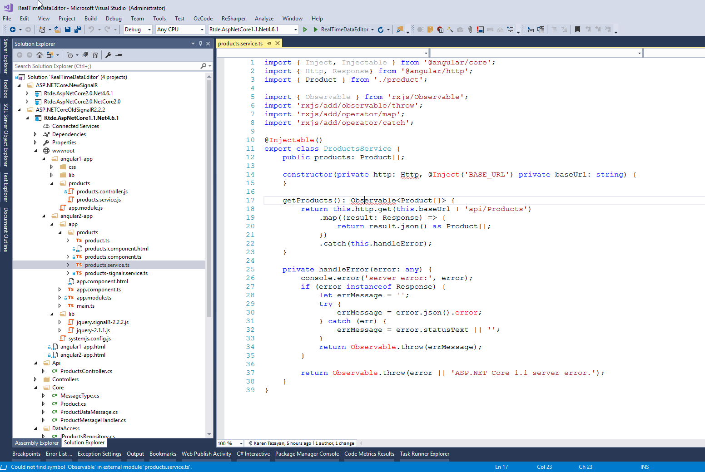
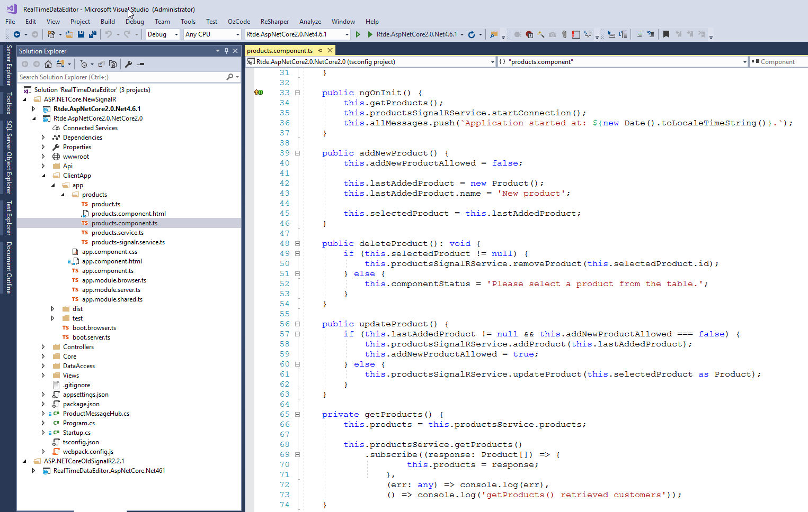

# The ASP.NET Core 2.0 and SignalR application sample, Real-Time Data Editing
## Requires
- Visual Studio 2017
## License
- MIT
## Technologies
- SignalR
- ASP.NET SignalR
- AngularJS
- ASP.NET Core
- Angular 2
- Angular 1
## Topics
- SignalR
- ASP.NET SignalR
- AngularJS
- ASP.NET Core
- Angular 2
- Angular 1
## Updated
- 03/22/2018
## Description

&nbsp;

<a href="https://onedrive.live.com/?id=736F580A25E940F5%21286387&cid=736F580A25E940F5" target="_blank">Use this link for the short video demo</a>.

&nbsp;

<h1>The project updated to use ASP.NET Core 2.0 RTM and Angualr 4.2 with Visual Studio 2017 (Version 15.3.5 or higher)</h1>
<h1>SignalR (alpha) for ASP.NET Core 2.0 is used. 
</h1>

<strong>Please see this MSDN article for the additional information.</strong>

&nbsp;

<strong>Also there is the ASP.NET Core project with SignalR 2.2.2 (The old version).</strong><strong> 
</strong>

<h1>Introduction</h1>

This example demonstrates how you can&nbsp;use Visual Studio 2017&nbsp;for build ASP.NET Core 1.x/2.x web application. For&nbsp;additional information about ASP.NET Core and Visual Studio 2017 see
<a href="http://www.asp.net/vnext/overview/aspnet-vnext">ASP.NET Future Release</a> (Getting Started with ASP.NET vNext and Visual Studio &quot;14&quot;).

<h1>Description</h1>

<em>Wherein editing is done in real time. That is, users can instantly see the changes implemented by others. It is completely based on and meets the OWIN specification (Open Web Server Interface for. NET). This application created
 with using Visual Studio <em>2017</em> as ASP.NET Core application and uses SignalR and Angular 1/Angular 2 libraries. As far as the platform is related it uses Microsoft .NET Framework 4.6.x or .NET Core 2.0. It is designed to showcase the latest technology
 designed for building modern web applications. In this case, each component of the application is managed by users. This puts great flexibility and freedom of action.</em>

<h1>Building the Sample</h1>

<strong>There are special requirements and instructions for building the sample.</strong>

<strong>1. Download source code. </strong>

<strong>2. Install the <a href="https://www.microsoft.com/net/core#windowsvs2017" target="_blank">
latest version of .NET Core 2.0 SDK</a> (Visual Studio 2017 RTW Version 15.3.5 or newer).</strong>

<strong>&nbsp;</strong>

<strong>3. Open project by Visual Studio 2017 and run it.</strong>

&nbsp;

C#

Edit|Remove

csharp
<pre class="hidden">using System;
using System.Threading.Tasks;
using Microsoft.AspNetCore.Builder;
using Microsoft.AspNetCore.Hosting;
using Microsoft.AspNetCore.Http;
using Microsoft.AspNetCore.SpaServices.Webpack;
using Microsoft.Extensions.Configuration;
using Microsoft.Extensions.DependencyInjection;

namespace RealTimeDataEditor
{
    public class Startup
    {
        public Startup(IConfiguration configuration)
        {
            Configuration = configuration;
        }

        public IConfiguration Configuration { get; }

        // This method gets called by the runtime. Use this method to add services to the container.
        public void ConfigureServices(IServiceCollection services)
        {
            services.AddSignalR();
            services.AddMvc();
        }

        // This method gets called by the runtime. Use this method to configure the HTTP request pipeline.
        public void Configure(IApplicationBuilder app, IHostingEnvironment env)
        {
            app.UseSignalR(routes =&gt;
            {
                routes.MapHub&lt;ProductMessageHub&gt;(&quot;ProductMessageHub&quot;);
            });

            if (env.IsDevelopment())
            {
                app.UseDeveloperExceptionPage();
                app.UseWebpackDevMiddleware(new WebpackDevMiddlewareOptions
                {
                    HotModuleReplacement = true
                });
            }
            else
            {
                app.UseExceptionHandler(&quot;/Home/Error&quot;);
            }

            app.UseStaticFiles();

            app.UseMvc(routes =&gt;
            {
                routes.MapRoute(
                    name: &quot;default&quot;,
                    template: &quot;{controller=Home}/{action=Index}/{id?}&quot;);

                routes.MapSpaFallbackRoute(
                    name: &quot;spa-fallback&quot;,
                    defaults: new { controller = &quot;Home&quot;, action = &quot;Index&quot; });
            });
        }
    }
}
</pre>

<pre class="csharp">using&nbsp;System;&nbsp;
using&nbsp;System.Threading.Tasks;&nbsp;
using&nbsp;Microsoft.AspNetCore.Builder;&nbsp;
using&nbsp;Microsoft.AspNetCore.Hosting;&nbsp;
using&nbsp;Microsoft.AspNetCore.Http;&nbsp;
using&nbsp;Microsoft.AspNetCore.SpaServices.Webpack;&nbsp;
using&nbsp;Microsoft.Extensions.Configuration;&nbsp;
using&nbsp;Microsoft.Extensions.DependencyInjection;&nbsp;
&nbsp;
namespace&nbsp;RealTimeDataEditor&nbsp;
{&nbsp;
&nbsp;&nbsp;&nbsp;&nbsp;public&nbsp;class&nbsp;Startup&nbsp;
&nbsp;&nbsp;&nbsp;&nbsp;{&nbsp;
&nbsp;&nbsp;&nbsp;&nbsp;&nbsp;&nbsp;&nbsp;&nbsp;public&nbsp;Startup(IConfiguration&nbsp;configuration)&nbsp;
&nbsp;&nbsp;&nbsp;&nbsp;&nbsp;&nbsp;&nbsp;&nbsp;{&nbsp;
&nbsp;&nbsp;&nbsp;&nbsp;&nbsp;&nbsp;&nbsp;&nbsp;&nbsp;&nbsp;&nbsp;&nbsp;Configuration&nbsp;=&nbsp;configuration;&nbsp;
&nbsp;&nbsp;&nbsp;&nbsp;&nbsp;&nbsp;&nbsp;&nbsp;}&nbsp;
&nbsp;
&nbsp;&nbsp;&nbsp;&nbsp;&nbsp;&nbsp;&nbsp;&nbsp;public&nbsp;IConfiguration&nbsp;Configuration&nbsp;{&nbsp;get;&nbsp;}&nbsp;
&nbsp;
&nbsp;&nbsp;&nbsp;&nbsp;&nbsp;&nbsp;&nbsp;&nbsp;//&nbsp;This&nbsp;method&nbsp;gets&nbsp;called&nbsp;by&nbsp;the&nbsp;runtime.&nbsp;Use&nbsp;this&nbsp;method&nbsp;to&nbsp;add&nbsp;services&nbsp;to&nbsp;the&nbsp;container.&nbsp;
&nbsp;&nbsp;&nbsp;&nbsp;&nbsp;&nbsp;&nbsp;&nbsp;public&nbsp;void&nbsp;ConfigureServices(IServiceCollection&nbsp;services)&nbsp;
&nbsp;&nbsp;&nbsp;&nbsp;&nbsp;&nbsp;&nbsp;&nbsp;{&nbsp;
&nbsp;&nbsp;&nbsp;&nbsp;&nbsp;&nbsp;&nbsp;&nbsp;&nbsp;&nbsp;&nbsp;&nbsp;services.AddSignalR();&nbsp;
&nbsp;&nbsp;&nbsp;&nbsp;&nbsp;&nbsp;&nbsp;&nbsp;&nbsp;&nbsp;&nbsp;&nbsp;services.AddMvc();&nbsp;
&nbsp;&nbsp;&nbsp;&nbsp;&nbsp;&nbsp;&nbsp;&nbsp;}&nbsp;
&nbsp;
&nbsp;&nbsp;&nbsp;&nbsp;&nbsp;&nbsp;&nbsp;&nbsp;//&nbsp;This&nbsp;method&nbsp;gets&nbsp;called&nbsp;by&nbsp;the&nbsp;runtime.&nbsp;Use&nbsp;this&nbsp;method&nbsp;to&nbsp;configure&nbsp;the&nbsp;HTTP&nbsp;request&nbsp;pipeline.&nbsp;
&nbsp;&nbsp;&nbsp;&nbsp;&nbsp;&nbsp;&nbsp;&nbsp;public&nbsp;void&nbsp;Configure(IApplicationBuilder&nbsp;app,&nbsp;IHostingEnvironment&nbsp;env)&nbsp;
&nbsp;&nbsp;&nbsp;&nbsp;&nbsp;&nbsp;&nbsp;&nbsp;{&nbsp;
&nbsp;&nbsp;&nbsp;&nbsp;&nbsp;&nbsp;&nbsp;&nbsp;&nbsp;&nbsp;&nbsp;&nbsp;app.UseSignalR(routes&nbsp;=&gt;&nbsp;
&nbsp;&nbsp;&nbsp;&nbsp;&nbsp;&nbsp;&nbsp;&nbsp;&nbsp;&nbsp;&nbsp;&nbsp;{&nbsp;
&nbsp;&nbsp;&nbsp;&nbsp;&nbsp;&nbsp;&nbsp;&nbsp;&nbsp;&nbsp;&nbsp;&nbsp;&nbsp;&nbsp;&nbsp;&nbsp;routes.MapHub&lt;ProductMessageHub&gt;(&quot;ProductMessageHub&quot;);&nbsp;
&nbsp;&nbsp;&nbsp;&nbsp;&nbsp;&nbsp;&nbsp;&nbsp;&nbsp;&nbsp;&nbsp;&nbsp;});&nbsp;
&nbsp;
&nbsp;&nbsp;&nbsp;&nbsp;&nbsp;&nbsp;&nbsp;&nbsp;&nbsp;&nbsp;&nbsp;&nbsp;if&nbsp;(env.IsDevelopment())&nbsp;
&nbsp;&nbsp;&nbsp;&nbsp;&nbsp;&nbsp;&nbsp;&nbsp;&nbsp;&nbsp;&nbsp;&nbsp;{&nbsp;
&nbsp;&nbsp;&nbsp;&nbsp;&nbsp;&nbsp;&nbsp;&nbsp;&nbsp;&nbsp;&nbsp;&nbsp;&nbsp;&nbsp;&nbsp;&nbsp;app.UseDeveloperExceptionPage();&nbsp;
&nbsp;&nbsp;&nbsp;&nbsp;&nbsp;&nbsp;&nbsp;&nbsp;&nbsp;&nbsp;&nbsp;&nbsp;&nbsp;&nbsp;&nbsp;&nbsp;app.UseWebpackDevMiddleware(new&nbsp;WebpackDevMiddlewareOptions&nbsp;
&nbsp;&nbsp;&nbsp;&nbsp;&nbsp;&nbsp;&nbsp;&nbsp;&nbsp;&nbsp;&nbsp;&nbsp;&nbsp;&nbsp;&nbsp;&nbsp;{&nbsp;
&nbsp;&nbsp;&nbsp;&nbsp;&nbsp;&nbsp;&nbsp;&nbsp;&nbsp;&nbsp;&nbsp;&nbsp;&nbsp;&nbsp;&nbsp;&nbsp;&nbsp;&nbsp;&nbsp;&nbsp;HotModuleReplacement&nbsp;=&nbsp;true&nbsp;
&nbsp;&nbsp;&nbsp;&nbsp;&nbsp;&nbsp;&nbsp;&nbsp;&nbsp;&nbsp;&nbsp;&nbsp;&nbsp;&nbsp;&nbsp;&nbsp;});&nbsp;
&nbsp;&nbsp;&nbsp;&nbsp;&nbsp;&nbsp;&nbsp;&nbsp;&nbsp;&nbsp;&nbsp;&nbsp;}&nbsp;
&nbsp;&nbsp;&nbsp;&nbsp;&nbsp;&nbsp;&nbsp;&nbsp;&nbsp;&nbsp;&nbsp;&nbsp;else&nbsp;
&nbsp;&nbsp;&nbsp;&nbsp;&nbsp;&nbsp;&nbsp;&nbsp;&nbsp;&nbsp;&nbsp;&nbsp;{&nbsp;
&nbsp;&nbsp;&nbsp;&nbsp;&nbsp;&nbsp;&nbsp;&nbsp;&nbsp;&nbsp;&nbsp;&nbsp;&nbsp;&nbsp;&nbsp;&nbsp;app.UseExceptionHandler(&quot;/Home/Error&quot;);&nbsp;
&nbsp;&nbsp;&nbsp;&nbsp;&nbsp;&nbsp;&nbsp;&nbsp;&nbsp;&nbsp;&nbsp;&nbsp;}&nbsp;
&nbsp;
&nbsp;&nbsp;&nbsp;&nbsp;&nbsp;&nbsp;&nbsp;&nbsp;&nbsp;&nbsp;&nbsp;&nbsp;app.UseStaticFiles();&nbsp;
&nbsp;
&nbsp;&nbsp;&nbsp;&nbsp;&nbsp;&nbsp;&nbsp;&nbsp;&nbsp;&nbsp;&nbsp;&nbsp;app.UseMvc(routes&nbsp;=&gt;&nbsp;
&nbsp;&nbsp;&nbsp;&nbsp;&nbsp;&nbsp;&nbsp;&nbsp;&nbsp;&nbsp;&nbsp;&nbsp;{&nbsp;
&nbsp;&nbsp;&nbsp;&nbsp;&nbsp;&nbsp;&nbsp;&nbsp;&nbsp;&nbsp;&nbsp;&nbsp;&nbsp;&nbsp;&nbsp;&nbsp;routes.MapRoute(&nbsp;
&nbsp;&nbsp;&nbsp;&nbsp;&nbsp;&nbsp;&nbsp;&nbsp;&nbsp;&nbsp;&nbsp;&nbsp;&nbsp;&nbsp;&nbsp;&nbsp;&nbsp;&nbsp;&nbsp;&nbsp;name:&nbsp;&quot;default&quot;,&nbsp;
&nbsp;&nbsp;&nbsp;&nbsp;&nbsp;&nbsp;&nbsp;&nbsp;&nbsp;&nbsp;&nbsp;&nbsp;&nbsp;&nbsp;&nbsp;&nbsp;&nbsp;&nbsp;&nbsp;&nbsp;template:&nbsp;&quot;{controller=Home}/{action=Index}/{id?}&quot;);&nbsp;
&nbsp;
&nbsp;&nbsp;&nbsp;&nbsp;&nbsp;&nbsp;&nbsp;&nbsp;&nbsp;&nbsp;&nbsp;&nbsp;&nbsp;&nbsp;&nbsp;&nbsp;routes.MapSpaFallbackRoute(&nbsp;
&nbsp;&nbsp;&nbsp;&nbsp;&nbsp;&nbsp;&nbsp;&nbsp;&nbsp;&nbsp;&nbsp;&nbsp;&nbsp;&nbsp;&nbsp;&nbsp;&nbsp;&nbsp;&nbsp;&nbsp;name:&nbsp;&quot;spa-fallback&quot;,&nbsp;
&nbsp;&nbsp;&nbsp;&nbsp;&nbsp;&nbsp;&nbsp;&nbsp;&nbsp;&nbsp;&nbsp;&nbsp;&nbsp;&nbsp;&nbsp;&nbsp;&nbsp;&nbsp;&nbsp;&nbsp;defaults:&nbsp;new&nbsp;{&nbsp;controller&nbsp;=&nbsp;&quot;Home&quot;,&nbsp;action&nbsp;=&nbsp;&quot;Index&quot;&nbsp;});&nbsp;
&nbsp;&nbsp;&nbsp;&nbsp;&nbsp;&nbsp;&nbsp;&nbsp;&nbsp;&nbsp;&nbsp;&nbsp;});&nbsp;
&nbsp;&nbsp;&nbsp;&nbsp;&nbsp;&nbsp;&nbsp;&nbsp;}&nbsp;
&nbsp;&nbsp;&nbsp;&nbsp;}&nbsp;
}&nbsp;
</pre>

&nbsp;

<h1>More Information</h1>

<em>For more information on Real Time Data Editor, see... 
</em>

