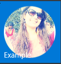
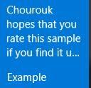

# Tile notifications in Universal app (UWP) Windows 10
## Requires
- Visual Studio 2015
## License
- MIT
## Technologies
- C#
- XAML
- universal windows app
- Windows 10
## Topics
- Live Tile Notification
- universal app
- Windows 10
- Universal Windows Platform
## Updated
- 01/05/2016
## Description

<h1>Introduction</h1>

<em>This sample shows how to send a tile notification to your primary tile in Windows 10 using adaptive tile templates.
<strong>&nbsp;</strong><em>&nbsp;</em></em>

<h1>Building the Sample</h1>

You will need to run this sample on visual Studio 2015 which runs on Windows 10. 

Description

Similar to toast notifications,&nbsp;Live tiles in Windows 10&nbsp;, you now have the flexibility to visualize a tile. Previously this required selecting a tile template from the
<a href="https://msdn.microsoft.com/en-us/library/windows/apps/hh761491.aspx">tile template catalog</a> for prior versions of Windows. The adaptive nature of Live Tiles allows you to group content, so Windows can automatically adjust the amount of information
 shown on the Live Tile to the current device&rsquo;s screen.

As an example, a social&nbsp;app such facebook&nbsp;that displays&nbsp;notifications on the Live Tile might display one notification on the Live Tile on a small screen phone.

In Windows 10, tile payloads are defined using adaptive tile templates, which allow you to create a custom visual layout for your notification. . We recommend using
<a href="https://github.com/WindowsNotifications/NotificationsExtensions/wiki" target="_blank">
NotificationsExtensions</a> (the NuGet package we told you about) to generate these notification payloads, but alternatively you can go the &quot;Vanilla&quot; route and construct the XML by hand.<strong>&nbsp;</strong><em></em>

C#

Edit|Remove

csharp
<pre class="hidden"> TileContent content = new TileContent()
            {
                Visual = new TileVisual()
                {
                    Branding = TileBranding.Name,

                    TileSmall = new TileBinding()
                    {
                        Content = smallContent
                    },

                    TileMedium = new TileBinding()
                    {
                        Content = mediumContent
                    },

                    TileWide = new TileBinding()
                    {
                        Content = wideContent
                    },

                    TileLarge = new TileBinding()
                    {
                        Branding = TileBranding.NameAndLogo,
                        DisplayName = &quot;DX Team&quot;,
                        Content = largeContent
                    }
                }
            };</pre>

<pre class="csharp">&nbsp;TileContent&nbsp;content&nbsp;=&nbsp;new&nbsp;TileContent()&nbsp;
&nbsp;&nbsp;&nbsp;&nbsp;&nbsp;&nbsp;&nbsp;&nbsp;&nbsp;&nbsp;&nbsp;&nbsp;{&nbsp;
&nbsp;&nbsp;&nbsp;&nbsp;&nbsp;&nbsp;&nbsp;&nbsp;&nbsp;&nbsp;&nbsp;&nbsp;&nbsp;&nbsp;&nbsp;&nbsp;Visual&nbsp;=&nbsp;new&nbsp;TileVisual()&nbsp;
&nbsp;&nbsp;&nbsp;&nbsp;&nbsp;&nbsp;&nbsp;&nbsp;&nbsp;&nbsp;&nbsp;&nbsp;&nbsp;&nbsp;&nbsp;&nbsp;{&nbsp;
&nbsp;&nbsp;&nbsp;&nbsp;&nbsp;&nbsp;&nbsp;&nbsp;&nbsp;&nbsp;&nbsp;&nbsp;&nbsp;&nbsp;&nbsp;&nbsp;&nbsp;&nbsp;&nbsp;&nbsp;Branding&nbsp;=&nbsp;TileBranding.Name,&nbsp;
&nbsp;
&nbsp;&nbsp;&nbsp;&nbsp;&nbsp;&nbsp;&nbsp;&nbsp;&nbsp;&nbsp;&nbsp;&nbsp;&nbsp;&nbsp;&nbsp;&nbsp;&nbsp;&nbsp;&nbsp;&nbsp;TileSmall&nbsp;=&nbsp;new&nbsp;TileBinding()&nbsp;
&nbsp;&nbsp;&nbsp;&nbsp;&nbsp;&nbsp;&nbsp;&nbsp;&nbsp;&nbsp;&nbsp;&nbsp;&nbsp;&nbsp;&nbsp;&nbsp;&nbsp;&nbsp;&nbsp;&nbsp;{&nbsp;
&nbsp;&nbsp;&nbsp;&nbsp;&nbsp;&nbsp;&nbsp;&nbsp;&nbsp;&nbsp;&nbsp;&nbsp;&nbsp;&nbsp;&nbsp;&nbsp;&nbsp;&nbsp;&nbsp;&nbsp;&nbsp;&nbsp;&nbsp;&nbsp;Content&nbsp;=&nbsp;smallContent&nbsp;
&nbsp;&nbsp;&nbsp;&nbsp;&nbsp;&nbsp;&nbsp;&nbsp;&nbsp;&nbsp;&nbsp;&nbsp;&nbsp;&nbsp;&nbsp;&nbsp;&nbsp;&nbsp;&nbsp;&nbsp;},&nbsp;
&nbsp;
&nbsp;&nbsp;&nbsp;&nbsp;&nbsp;&nbsp;&nbsp;&nbsp;&nbsp;&nbsp;&nbsp;&nbsp;&nbsp;&nbsp;&nbsp;&nbsp;&nbsp;&nbsp;&nbsp;&nbsp;TileMedium&nbsp;=&nbsp;new&nbsp;TileBinding()&nbsp;
&nbsp;&nbsp;&nbsp;&nbsp;&nbsp;&nbsp;&nbsp;&nbsp;&nbsp;&nbsp;&nbsp;&nbsp;&nbsp;&nbsp;&nbsp;&nbsp;&nbsp;&nbsp;&nbsp;&nbsp;{&nbsp;
&nbsp;&nbsp;&nbsp;&nbsp;&nbsp;&nbsp;&nbsp;&nbsp;&nbsp;&nbsp;&nbsp;&nbsp;&nbsp;&nbsp;&nbsp;&nbsp;&nbsp;&nbsp;&nbsp;&nbsp;&nbsp;&nbsp;&nbsp;&nbsp;Content&nbsp;=&nbsp;mediumContent&nbsp;
&nbsp;&nbsp;&nbsp;&nbsp;&nbsp;&nbsp;&nbsp;&nbsp;&nbsp;&nbsp;&nbsp;&nbsp;&nbsp;&nbsp;&nbsp;&nbsp;&nbsp;&nbsp;&nbsp;&nbsp;},&nbsp;
&nbsp;
&nbsp;&nbsp;&nbsp;&nbsp;&nbsp;&nbsp;&nbsp;&nbsp;&nbsp;&nbsp;&nbsp;&nbsp;&nbsp;&nbsp;&nbsp;&nbsp;&nbsp;&nbsp;&nbsp;&nbsp;TileWide&nbsp;=&nbsp;new&nbsp;TileBinding()&nbsp;
&nbsp;&nbsp;&nbsp;&nbsp;&nbsp;&nbsp;&nbsp;&nbsp;&nbsp;&nbsp;&nbsp;&nbsp;&nbsp;&nbsp;&nbsp;&nbsp;&nbsp;&nbsp;&nbsp;&nbsp;{&nbsp;
&nbsp;&nbsp;&nbsp;&nbsp;&nbsp;&nbsp;&nbsp;&nbsp;&nbsp;&nbsp;&nbsp;&nbsp;&nbsp;&nbsp;&nbsp;&nbsp;&nbsp;&nbsp;&nbsp;&nbsp;&nbsp;&nbsp;&nbsp;&nbsp;Content&nbsp;=&nbsp;wideContent&nbsp;
&nbsp;&nbsp;&nbsp;&nbsp;&nbsp;&nbsp;&nbsp;&nbsp;&nbsp;&nbsp;&nbsp;&nbsp;&nbsp;&nbsp;&nbsp;&nbsp;&nbsp;&nbsp;&nbsp;&nbsp;},&nbsp;
&nbsp;
&nbsp;&nbsp;&nbsp;&nbsp;&nbsp;&nbsp;&nbsp;&nbsp;&nbsp;&nbsp;&nbsp;&nbsp;&nbsp;&nbsp;&nbsp;&nbsp;&nbsp;&nbsp;&nbsp;&nbsp;TileLarge&nbsp;=&nbsp;new&nbsp;TileBinding()&nbsp;
&nbsp;&nbsp;&nbsp;&nbsp;&nbsp;&nbsp;&nbsp;&nbsp;&nbsp;&nbsp;&nbsp;&nbsp;&nbsp;&nbsp;&nbsp;&nbsp;&nbsp;&nbsp;&nbsp;&nbsp;{&nbsp;
&nbsp;&nbsp;&nbsp;&nbsp;&nbsp;&nbsp;&nbsp;&nbsp;&nbsp;&nbsp;&nbsp;&nbsp;&nbsp;&nbsp;&nbsp;&nbsp;&nbsp;&nbsp;&nbsp;&nbsp;&nbsp;&nbsp;&nbsp;&nbsp;Branding&nbsp;=&nbsp;TileBranding.NameAndLogo,&nbsp;
&nbsp;&nbsp;&nbsp;&nbsp;&nbsp;&nbsp;&nbsp;&nbsp;&nbsp;&nbsp;&nbsp;&nbsp;&nbsp;&nbsp;&nbsp;&nbsp;&nbsp;&nbsp;&nbsp;&nbsp;&nbsp;&nbsp;&nbsp;&nbsp;DisplayName&nbsp;=&nbsp;&quot;DX&nbsp;Team&quot;,&nbsp;
&nbsp;&nbsp;&nbsp;&nbsp;&nbsp;&nbsp;&nbsp;&nbsp;&nbsp;&nbsp;&nbsp;&nbsp;&nbsp;&nbsp;&nbsp;&nbsp;&nbsp;&nbsp;&nbsp;&nbsp;&nbsp;&nbsp;&nbsp;&nbsp;Content&nbsp;=&nbsp;largeContent&nbsp;
&nbsp;&nbsp;&nbsp;&nbsp;&nbsp;&nbsp;&nbsp;&nbsp;&nbsp;&nbsp;&nbsp;&nbsp;&nbsp;&nbsp;&nbsp;&nbsp;&nbsp;&nbsp;&nbsp;&nbsp;}&nbsp;
&nbsp;&nbsp;&nbsp;&nbsp;&nbsp;&nbsp;&nbsp;&nbsp;&nbsp;&nbsp;&nbsp;&nbsp;&nbsp;&nbsp;&nbsp;&nbsp;}&nbsp;
&nbsp;&nbsp;&nbsp;&nbsp;&nbsp;&nbsp;&nbsp;&nbsp;&nbsp;&nbsp;&nbsp;&nbsp;};</pre>

&nbsp;

C#

Edit|Remove

csharp
<pre class="hidden"> private void ButtonCirclePeek_Click(object sender, RoutedEventArgs e)
        {
            UpdateMedium(new TileBindingContentAdaptive()
            {
                PeekImage = new TilePeekImage()
                {
                    Source = new TileImageSource(&quot;https://z-1-scontent.xx.fbcdn.net/hphotos-xft1/v/t1.0-9/11403002_940729265987495_1202353898144621920_n.jpg?oh=9f5714fa5bc9babb1e0702646b21c0f0&amp;oe=5745BE22&quot;),

                    Crop = TileImageCrop.Circle
                },

                Children =
                {
                    new TileText()
                    {
                        Text = &quot;Chourouk hopes that you rate this sample if you find it useful. :)&quot;,
                        Wrap = true
                    }
                }
            });
        }</pre>

<pre class="csharp">&nbsp;private&nbsp;void&nbsp;ButtonCirclePeek_Click(object&nbsp;sender,&nbsp;RoutedEventArgs&nbsp;e)&nbsp;
&nbsp;&nbsp;&nbsp;&nbsp;&nbsp;&nbsp;&nbsp;&nbsp;{&nbsp;
&nbsp;&nbsp;&nbsp;&nbsp;&nbsp;&nbsp;&nbsp;&nbsp;&nbsp;&nbsp;&nbsp;&nbsp;UpdateMedium(new&nbsp;TileBindingContentAdaptive()&nbsp;
&nbsp;&nbsp;&nbsp;&nbsp;&nbsp;&nbsp;&nbsp;&nbsp;&nbsp;&nbsp;&nbsp;&nbsp;{&nbsp;
&nbsp;&nbsp;&nbsp;&nbsp;&nbsp;&nbsp;&nbsp;&nbsp;&nbsp;&nbsp;&nbsp;&nbsp;&nbsp;&nbsp;&nbsp;&nbsp;PeekImage&nbsp;=&nbsp;new&nbsp;TilePeekImage()&nbsp;
&nbsp;&nbsp;&nbsp;&nbsp;&nbsp;&nbsp;&nbsp;&nbsp;&nbsp;&nbsp;&nbsp;&nbsp;&nbsp;&nbsp;&nbsp;&nbsp;{&nbsp;
&nbsp;&nbsp;&nbsp;&nbsp;&nbsp;&nbsp;&nbsp;&nbsp;&nbsp;&nbsp;&nbsp;&nbsp;&nbsp;&nbsp;&nbsp;&nbsp;&nbsp;&nbsp;&nbsp;&nbsp;Source&nbsp;=&nbsp;new&nbsp;TileImageSource(&quot;https://z-1-scontent.xx.fbcdn.net/hphotos-xft1/v/t1.0-9/11403002_940729265987495_1202353898144621920_n.jpg?oh=9f5714fa5bc9babb1e0702646b21c0f0&amp;oe=5745BE22&quot;),&nbsp;
&nbsp;
&nbsp;&nbsp;&nbsp;&nbsp;&nbsp;&nbsp;&nbsp;&nbsp;&nbsp;&nbsp;&nbsp;&nbsp;&nbsp;&nbsp;&nbsp;&nbsp;&nbsp;&nbsp;&nbsp;&nbsp;Crop&nbsp;=&nbsp;TileImageCrop.Circle&nbsp;
&nbsp;&nbsp;&nbsp;&nbsp;&nbsp;&nbsp;&nbsp;&nbsp;&nbsp;&nbsp;&nbsp;&nbsp;&nbsp;&nbsp;&nbsp;&nbsp;},&nbsp;
&nbsp;
&nbsp;&nbsp;&nbsp;&nbsp;&nbsp;&nbsp;&nbsp;&nbsp;&nbsp;&nbsp;&nbsp;&nbsp;&nbsp;&nbsp;&nbsp;&nbsp;Children&nbsp;=&nbsp;
&nbsp;&nbsp;&nbsp;&nbsp;&nbsp;&nbsp;&nbsp;&nbsp;&nbsp;&nbsp;&nbsp;&nbsp;&nbsp;&nbsp;&nbsp;&nbsp;{&nbsp;
&nbsp;&nbsp;&nbsp;&nbsp;&nbsp;&nbsp;&nbsp;&nbsp;&nbsp;&nbsp;&nbsp;&nbsp;&nbsp;&nbsp;&nbsp;&nbsp;&nbsp;&nbsp;&nbsp;&nbsp;new&nbsp;TileText()&nbsp;
&nbsp;&nbsp;&nbsp;&nbsp;&nbsp;&nbsp;&nbsp;&nbsp;&nbsp;&nbsp;&nbsp;&nbsp;&nbsp;&nbsp;&nbsp;&nbsp;&nbsp;&nbsp;&nbsp;&nbsp;{&nbsp;
&nbsp;&nbsp;&nbsp;&nbsp;&nbsp;&nbsp;&nbsp;&nbsp;&nbsp;&nbsp;&nbsp;&nbsp;&nbsp;&nbsp;&nbsp;&nbsp;&nbsp;&nbsp;&nbsp;&nbsp;&nbsp;&nbsp;&nbsp;&nbsp;Text&nbsp;=&nbsp;&quot;Chourouk&nbsp;hopes&nbsp;that&nbsp;you&nbsp;rate&nbsp;this&nbsp;sample&nbsp;if&nbsp;you&nbsp;find&nbsp;it&nbsp;useful.&nbsp;:)&quot;,&nbsp;
&nbsp;&nbsp;&nbsp;&nbsp;&nbsp;&nbsp;&nbsp;&nbsp;&nbsp;&nbsp;&nbsp;&nbsp;&nbsp;&nbsp;&nbsp;&nbsp;&nbsp;&nbsp;&nbsp;&nbsp;&nbsp;&nbsp;&nbsp;&nbsp;Wrap&nbsp;=&nbsp;true&nbsp;
&nbsp;&nbsp;&nbsp;&nbsp;&nbsp;&nbsp;&nbsp;&nbsp;&nbsp;&nbsp;&nbsp;&nbsp;&nbsp;&nbsp;&nbsp;&nbsp;&nbsp;&nbsp;&nbsp;&nbsp;}&nbsp;
&nbsp;&nbsp;&nbsp;&nbsp;&nbsp;&nbsp;&nbsp;&nbsp;&nbsp;&nbsp;&nbsp;&nbsp;&nbsp;&nbsp;&nbsp;&nbsp;}&nbsp;
&nbsp;&nbsp;&nbsp;&nbsp;&nbsp;&nbsp;&nbsp;&nbsp;&nbsp;&nbsp;&nbsp;&nbsp;});&nbsp;
&nbsp;&nbsp;&nbsp;&nbsp;&nbsp;&nbsp;&nbsp;&nbsp;}</pre>

&nbsp;

The above notification content will look like the following design that we have created...

&nbsp;&nbsp;&nbsp;&nbsp; &nbsp;

&nbsp;

<h1>Source Code Files</h1>
<ul>
<li><em>source code&nbsp;MainPage.xaml</em> </li></ul>
<h1>More Information</h1>

<em>See the <a href="http://blogs.msdn.com/b/tiles_and_toasts/archive/2015/06/30/adaptive-tile-templates-schema-and-documentation.aspx" target="_blank">
adaptive documentation</a> to learn more about what's possible with adaptive.</em>

<em><em>Feel free to contact me on Twitter @CHJ_GeekGirl for any question about this and visit my blog for more code sample :<a href="http://www.hjaiejchourouk.com/">&nbsp;http://hjaiejchourouk.com/</a></em><strong></strong><em></em> 
</em>

