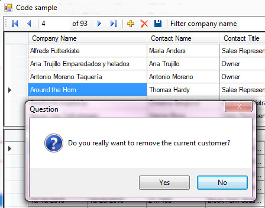
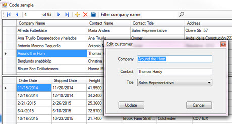
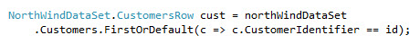
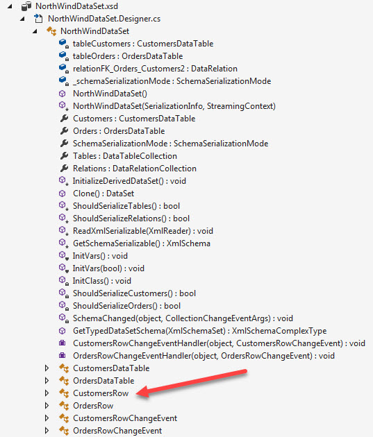
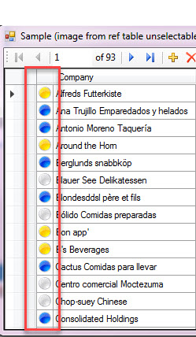
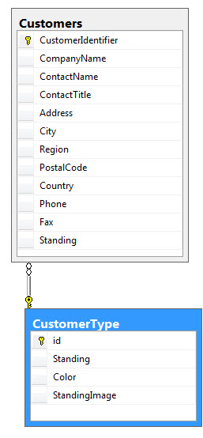
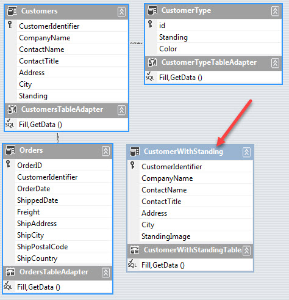
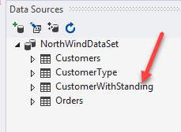
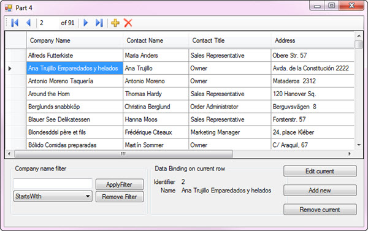

# Tips and tricks for TableAdapter you always wanted to know (C#)
## Requires
- Visual Studio 2015
## License
- MIT
## Technologies
- C#
- SQL Server
- DataSet
- TableAdapter
## Topics
- Data Binding
- Data Access
- DataGridView
- Master/Detail
- TableAdapter
- data relations
## Updated
- 12/10/2017
## Description

<h1>Introduction</h1>

This code sample deals with TableAdapters and DataSets.&nbsp; If you never worked with them before here is an overview from Microsoft.

TableAdapters are designer-generated components that connect to a database, run queries or stored procedures, and fill their DataTable with the returned data. TableAdapters also send updated data from your application back to
 the database. You can run as many queries as you want on a TableAdapter as long as they return data that conforms to the schema of the table with which the TableAdapter is associated. The following diagram shows how TableAdapters interact with databases and
 other objects in memory.

Using generated components as per above is simply one way to communicate with databases. Other methods include manage data providers and Entity Framework.

Many novice developers seem to prefer using TableAdapters I believe because they appear to be less work than using managed data providers or Entity Framework (also, a developer may be using Microsoft Access database which Entity
 Framework does not support). At first glance they are great, you use Visual Studio data wizards to generate components and then drag data objects to a form which in turn places controls onto the form which are data bound to these controls such as DataGridView
 and/or TextBox, ComboBox controls and so forth. But as we get more complex they can be harder to work with if the developer never learns fully about this way of working with data. So let&rsquo;s dig in to a few things that I want to focus on.

&nbsp;

<h1>Building the Sample</h1>

Before running the sample, you need to add the database to your SQL-Server instance, I've included the script under the DataScripts folder.&nbsp; In app.config, change the connection string property, Data Source from KARENS-PC
 to the name of your SQL-Server or to SQLEXPRESS.

Description

One of the first things is after you drag items from the Data Source window onto a form you notice there is a BindingNavigator which have buttons for add/edit/delete operations. Check out
<a href="https://docs.microsoft.com/en-us/dotnet/framework/winforms/controls/bindingnavigator-control-overview-windows-forms">
BindingNavigator overview</a> (include an image).

Once the form is showing at runtime, you&rsquo;ve selected a record in a DataGridView which is setup to work with a BindingNavigator you press the delete button what happens is the current record is removed but not saved back
 to the database until you press the save button next to the delete button. Suppose the user pressed the delete by mistake, the only recourse is to close the app as there are no un-dues.

A better way to handle a delete operation is to override the default action. This is done by selecting the BindingNavigator, select properties, find Items, select DeleteItem, there is a dropdown, select none.

Next, double click the delete button in the BindingNavigator to create an event. Added code to ask the user to confirm the removal. Below is code from the included project.

&nbsp;

C#

Edit|Remove

csharp

<pre class="js">private&nbsp;void&nbsp;bindingNavigatorDeleteItem_Click(object&nbsp;sender,&nbsp;EventArgs&nbsp;e)&nbsp;
{&nbsp;
&nbsp;&nbsp;&nbsp;&nbsp;if&nbsp;(KarenDialogs.Question(&quot;Do&nbsp;you&nbsp;really&nbsp;want&nbsp;to&nbsp;remove&nbsp;the&nbsp;current&nbsp;customer?&quot;))&nbsp;
&nbsp;&nbsp;&nbsp;&nbsp;{&nbsp;
&nbsp;&nbsp;&nbsp;&nbsp;&nbsp;&nbsp;&nbsp;&nbsp;customersBindingSource.RemoveCurrent();&nbsp;
&nbsp;&nbsp;&nbsp;&nbsp;}&nbsp;
}</pre>

It looks like this (you could also place the company name in the dialog) and note the default button is &quot;No&quot;.

 

.

In the included code sample (which is a master-details sample) I do the same with the save button, override it and add my own code to save both master and details data.

C#

Edit|Remove

csharp

<pre class="csharp">private&nbsp;void&nbsp;customersBindingNavigatorSaveItem_Click_1(object&nbsp;sender,&nbsp;EventArgs&nbsp;e)&nbsp;
{&nbsp;
&nbsp;&nbsp;&nbsp;&nbsp;if&nbsp;(KarenDialogs.Question(&quot;Save&nbsp;changes&nbsp;back&nbsp;to&nbsp;database?&quot;))&nbsp;
&nbsp;&nbsp;&nbsp;&nbsp;{&nbsp;
&nbsp;&nbsp;&nbsp;&nbsp;&nbsp;&nbsp;&nbsp;&nbsp;this.Validate();&nbsp;
&nbsp;&nbsp;&nbsp;&nbsp;&nbsp;&nbsp;&nbsp;&nbsp;this.customersBindingSource.EndEdit();&nbsp;
&nbsp;
&nbsp;&nbsp;&nbsp;&nbsp;&nbsp;&nbsp;&nbsp;&nbsp;/*&nbsp;
&nbsp;&nbsp;&nbsp;&nbsp;&nbsp;&nbsp;&nbsp;&nbsp;&nbsp;&nbsp;&nbsp;&nbsp;*&nbsp;Manually&nbsp;added&nbsp;
&nbsp;&nbsp;&nbsp;&nbsp;&nbsp;&nbsp;&nbsp;&nbsp;&nbsp;&nbsp;&nbsp;&nbsp;*/&nbsp;
&nbsp;&nbsp;&nbsp;&nbsp;&nbsp;&nbsp;&nbsp;&nbsp;this.ordersBindingSource.EndEdit();&nbsp;
&nbsp;
&nbsp;&nbsp;&nbsp;&nbsp;&nbsp;&nbsp;&nbsp;&nbsp;this.tableAdapterManager.UpdateAll(this.northWindDataSet);&nbsp;
&nbsp;&nbsp;&nbsp;&nbsp;}&nbsp;
}</pre>

Then added a label, TextBox and button to the BindingNavigator to show we can add functionality (the hardest part is finding an proper image for the button).&nbsp;

Here is a super simple filter which I'm sure you can write a better one :-) I kept it simple so it would be easy to follow.

.

 

C#

Edit|Remove

csharp

<pre class="csharp">private&nbsp;void&nbsp;searchByCompanyName_Click(object&nbsp;sender,&nbsp;EventArgs&nbsp;e)&nbsp;
{&nbsp;
&nbsp;&nbsp;&nbsp;&nbsp;if&nbsp;(!string.IsNullOrWhiteSpace(companyNameSearchToolStripTextBox1.Text))&nbsp;
&nbsp;&nbsp;&nbsp;&nbsp;{&nbsp;
&nbsp;&nbsp;&nbsp;&nbsp;&nbsp;&nbsp;&nbsp;&nbsp;customersBindingSource.Filter&nbsp;=&nbsp;&nbsp;
&nbsp;&nbsp;&nbsp;&nbsp;&nbsp;&nbsp;&nbsp;&nbsp;$&quot;CompanyName&nbsp;LIKE&nbsp;'{companyNameSearchToolStripTextBox1.Text.Replace(&quot;'&quot;,&quot;''&quot;)}%'&quot;;&nbsp;
&nbsp;&nbsp;&nbsp;&nbsp;}&nbsp;
&nbsp;&nbsp;&nbsp;&nbsp;else&nbsp;
&nbsp;&nbsp;&nbsp;&nbsp;{&nbsp;
&nbsp;&nbsp;&nbsp;&nbsp;&nbsp;&nbsp;&nbsp;&nbsp;customersBindingSource.Filter&nbsp;=&nbsp;&quot;&quot;;&nbsp;
&nbsp;&nbsp;&nbsp;&nbsp;}&nbsp;&nbsp;&nbsp;&nbsp;&nbsp;&nbsp;&nbsp;&nbsp;&nbsp;&nbsp;&nbsp;&nbsp;&nbsp;
}</pre>

Before going any farther with thoughts on improving how we code with TableAdapters/BindingSource/DataSet...

<h1 class="endscriptcode">How to create a master detail</h1>

<ol>
<li>Add your master and detail tables via the data source window (<a href="https://msdn.microsoft.com/en-us/library/tzedkwye.aspx">the following</a> explains doing one table, repeat for the second table)
</li><li>Drag tables to the form, the master first which will create a BindingNavigator while the details will not, we really can add our own if needed and wire it up. I would first place a splitter control on the form and drag the
 tables into the splitter (as done in the attached code sample). </li><li>In the following code sample which is taken from the code sample, the TableAdapter.Fill lines were generated when dropping the tables on the form while the lines below I added. They setup the relationship between the master
 and detail tables. Note, you should first set the relations in the database using SQL command or in SQL-Server Management Studio.
</li></ol>

C#

Edit|Remove

csharp

<pre class="js">this.ordersTableAdapter.Fill(this.northWindDataSet.Orders);&nbsp;
this.customersTableAdapter.Fill(this.northWindDataSet.Customers);&nbsp;
&nbsp;
/*&nbsp;
&nbsp;&nbsp;&nbsp;&nbsp;*&nbsp;Manually&nbsp;added,&nbsp;next&nbsp;two&nbsp;lines&nbsp;so&nbsp;we&nbsp;have&nbsp;the&nbsp;master&nbsp;and&nbsp;details&nbsp;
&nbsp;&nbsp;&nbsp;&nbsp;*&nbsp;working&nbsp;together.&nbsp;
&nbsp;&nbsp;&nbsp;&nbsp;*/&nbsp;
this.ordersBindingSource.DataSource&nbsp;=&nbsp;customersBindingSource;&nbsp;
ordersBindingSource.DataMember&nbsp;=&nbsp;northWindDataSet.Relations[0].RelationName;</pre>

After the above we have details DataGridView showing data for the current row in the master DataGridView.&nbsp;

.

Since the column headers in both DataGridView controls are taken from generated code you should change the HeaderText for each column in the DataGridView properties or as I did (and here I had decent
 field names) split up names e.g. FirstName column turns into First Name.

C#

Edit|Remove

csharp

<pre class="js">/*&nbsp;
&nbsp;&nbsp;&nbsp;&nbsp;*&nbsp;Split&nbsp;Header&nbsp;text&nbsp;by&nbsp;upper-case&nbsp;characters&nbsp;in&nbsp;the&nbsp;master&nbsp;DataGridView&nbsp;
&nbsp;&nbsp;&nbsp;&nbsp;*/&nbsp;
foreach&nbsp;(DataGridViewColumn&nbsp;col&nbsp;in&nbsp;customersDataGridView.Columns)&nbsp;
{&nbsp;
&nbsp;&nbsp;&nbsp;&nbsp;col.HeaderText&nbsp;=&nbsp;System.Text&nbsp;
&nbsp;&nbsp;&nbsp;&nbsp;&nbsp;&nbsp;&nbsp;&nbsp;.RegularExpressions&nbsp;
&nbsp;&nbsp;&nbsp;&nbsp;&nbsp;&nbsp;&nbsp;&nbsp;.Regex.Replace(&nbsp;
&nbsp;&nbsp;&nbsp;&nbsp;&nbsp;&nbsp;&nbsp;&nbsp;col.HeaderText,&nbsp;&quot;([a-z])([A-Z])&quot;,&nbsp;&quot;$1&nbsp;$2&quot;);&nbsp;
}</pre>

The same was done for the details DataGridView.&nbsp;

<h1 class="endscriptcode">Get current row data</h1>

We can get to the current row via casting the BindingSource.Current to a DataRowView then access the Row (DataRow) property then finally Field&lt;T&gt;.

C#

Edit|Remove

csharp

<pre class="js">if&nbsp;(customersBindingSource.Current&nbsp;!=&nbsp;null)&nbsp;
{&nbsp;
&nbsp;&nbsp;&nbsp;&nbsp;var&nbsp;row&nbsp;=&nbsp;((DataRowView)customersBindingSource.Current).Row;&nbsp;
&nbsp;&nbsp;&nbsp;&nbsp;MessageBox.Show(row.Field&lt;string&gt;(&quot;CompanyName&quot;));&nbsp;
}</pre>

<h1 class="endscriptcode">Changing row data</h1>

By default we can edit in place in the DataGridView but suppose the database was poorly designed (and this database is). For example, here one field is ContactTitle. There is no reference table so if
 the user typed in shop owner and that is not valid you have to either validate it or how valid selections in a DataGridViewComboBox column (I have samples for this,
<a href="https://code.msdn.microsoft.com/Working-with-data-in-a-e24664d9">here is one</a>)&nbsp;or perhaps a modal window can be used to provide validation. Rather than show the code you can see it in the attached sample, here is a screenshot.

 

 

Note that I used a strong typed class that was generated by the data wizard to pass data to the modal form.

The standard documentation show locating a entity (in this case a customer) via

C#

Edit|Remove

csharp

<pre class="js">northWindDataSet&nbsp;
&nbsp;&nbsp;&nbsp;&nbsp;.Customers&nbsp;
&nbsp;&nbsp;&nbsp;&nbsp;.FindByCustomerIdentifier(x)</pre>

Where x in this case is the primary key to locate. In most cases you will not have that identifier but instead will need to get it from the current row in a DataGridView. The best way to get at the
 current row is through the BindingSource component e.g.

C#

Edit|Remove

csharp

<pre class="js">var&nbsp;id&nbsp;=&nbsp;((DataRowView)customersBindingSource.Current)&nbsp;
&nbsp;&nbsp;&nbsp;&nbsp;.Row.Field&lt;int&gt;(&quot;CustomerIdentifier&quot;);</pre>

From here (using the above code) we can get at a strong typed class instance, CustomerRow.

C#

Edit|Remove

csharp

<pre class="js">NorthWindDataSet.CustomersRow&nbsp;cust&nbsp;=&nbsp;northWindDataSet&nbsp;
&nbsp;&nbsp;&nbsp;&nbsp;.Customers.FirstOrDefault(c&nbsp;=&gt;&nbsp;c.CustomerIdentifier&nbsp;==&nbsp;id);</pre>

A good example of the last two code snippets in use is in the key down event in the code sample.&nbsp;

.

 

In the image below you can see what was generated (which includes CustomersRow)

.

 

 

<h1 class="endscriptcode">Using images rather than text</h1>

<em>First off the following was added after the initial publishing, seemed this would be a benefit to include</em>.

Suppose there is limited space to display information where a image can convey a meaning that takes up less space than text e.g. in the following screenshot the image signifies customer standing where gold (well perhaps yellow)
 signifies a very good customer, silver is a platinum customer and blue is a regular customer.

&nbsp;

How I managed the above, added a reference table.

Created three records to CustomerType, set text (thinking the data could be used in other places besides a DataGridView) then added the images via SQL.

&nbsp;

SQL

Edit|Remove

mysql

<pre class="mysql">UPDATE&nbsp;&nbsp;CustomerType&nbsp;
SET&nbsp;&nbsp;&nbsp;&nbsp;&nbsp;StandingImage&nbsp;=&nbsp;(&nbsp;SELECT&nbsp;&nbsp;&nbsp;&nbsp;*&nbsp;
&nbsp;&nbsp;&nbsp;&nbsp;&nbsp;&nbsp;&nbsp;&nbsp;&nbsp;&nbsp;&nbsp;&nbsp;&nbsp;&nbsp;&nbsp;&nbsp;&nbsp;&nbsp;&nbsp;&nbsp;&nbsp;&nbsp;&nbsp;&nbsp;&nbsp;&nbsp;FROM&nbsp;&nbsp;&nbsp;&nbsp;&nbsp;&nbsp;&nbsp;
&nbsp;&nbsp;&nbsp;&nbsp;&nbsp;&nbsp;&nbsp;&nbsp;&nbsp;&nbsp;&nbsp;&nbsp;&nbsp;&nbsp;&nbsp;&nbsp;&nbsp;&nbsp;&nbsp;&nbsp;&nbsp;&nbsp;&nbsp;&nbsp;&nbsp;&nbsp;OPENROWSET(BULK&nbsp;N'C:\Circles\circle_Gold.jpg',&nbsp;
&nbsp;&nbsp;&nbsp;&nbsp;&nbsp;&nbsp;&nbsp;&nbsp;&nbsp;&nbsp;&nbsp;&nbsp;&nbsp;&nbsp;&nbsp;&nbsp;&nbsp;&nbsp;&nbsp;&nbsp;&nbsp;&nbsp;&nbsp;&nbsp;&nbsp;&nbsp;&nbsp;&nbsp;&nbsp;&nbsp;&nbsp;&nbsp;&nbsp;&nbsp;&nbsp;&nbsp;&nbsp;SINGLE_BLOB)&nbsp;CategoryImage&nbsp;
&nbsp;&nbsp;&nbsp;&nbsp;&nbsp;&nbsp;&nbsp;&nbsp;&nbsp;&nbsp;&nbsp;&nbsp;&nbsp;&nbsp;&nbsp;&nbsp;&nbsp;&nbsp;&nbsp;&nbsp;&nbsp;&nbsp;&nbsp;&nbsp;)&nbsp;
WHERE&nbsp;&nbsp;&nbsp;id&nbsp;=&nbsp;1;&nbsp;
UPDATE&nbsp;&nbsp;CustomerType&nbsp;
SET&nbsp;&nbsp;&nbsp;&nbsp;&nbsp;StandingImage&nbsp;=&nbsp;(&nbsp;SELECT&nbsp;&nbsp;&nbsp;&nbsp;*&nbsp;
&nbsp;&nbsp;&nbsp;&nbsp;&nbsp;&nbsp;&nbsp;&nbsp;&nbsp;&nbsp;&nbsp;&nbsp;&nbsp;&nbsp;&nbsp;&nbsp;&nbsp;&nbsp;&nbsp;&nbsp;&nbsp;&nbsp;&nbsp;&nbsp;&nbsp;&nbsp;FROM&nbsp;&nbsp;&nbsp;&nbsp;&nbsp;&nbsp;&nbsp;
&nbsp;&nbsp;&nbsp;&nbsp;&nbsp;&nbsp;&nbsp;&nbsp;&nbsp;&nbsp;&nbsp;&nbsp;&nbsp;&nbsp;&nbsp;&nbsp;&nbsp;&nbsp;&nbsp;&nbsp;&nbsp;&nbsp;&nbsp;&nbsp;&nbsp;&nbsp;OPENROWSET(BULK&nbsp;N'C:\Circles\circle_grey.jpg',&nbsp;
&nbsp;&nbsp;&nbsp;&nbsp;&nbsp;&nbsp;&nbsp;&nbsp;&nbsp;&nbsp;&nbsp;&nbsp;&nbsp;&nbsp;&nbsp;&nbsp;&nbsp;&nbsp;&nbsp;&nbsp;&nbsp;&nbsp;&nbsp;&nbsp;&nbsp;&nbsp;&nbsp;&nbsp;&nbsp;&nbsp;&nbsp;&nbsp;&nbsp;&nbsp;&nbsp;&nbsp;&nbsp;SINGLE_BLOB)&nbsp;CategoryImage&nbsp;
&nbsp;&nbsp;&nbsp;&nbsp;&nbsp;&nbsp;&nbsp;&nbsp;&nbsp;&nbsp;&nbsp;&nbsp;&nbsp;&nbsp;&nbsp;&nbsp;&nbsp;&nbsp;&nbsp;&nbsp;&nbsp;&nbsp;&nbsp;&nbsp;)&nbsp;
WHERE&nbsp;&nbsp;&nbsp;id&nbsp;=&nbsp;2;&nbsp;
UPDATE&nbsp;&nbsp;CustomerType&nbsp;
SET&nbsp;&nbsp;&nbsp;&nbsp;&nbsp;StandingImage&nbsp;=&nbsp;(&nbsp;SELECT&nbsp;&nbsp;&nbsp;&nbsp;*&nbsp;
&nbsp;&nbsp;&nbsp;&nbsp;&nbsp;&nbsp;&nbsp;&nbsp;&nbsp;&nbsp;&nbsp;&nbsp;&nbsp;&nbsp;&nbsp;&nbsp;&nbsp;&nbsp;&nbsp;&nbsp;&nbsp;&nbsp;&nbsp;&nbsp;&nbsp;&nbsp;FROM&nbsp;&nbsp;&nbsp;&nbsp;&nbsp;&nbsp;&nbsp;
&nbsp;&nbsp;&nbsp;&nbsp;&nbsp;&nbsp;&nbsp;&nbsp;&nbsp;&nbsp;&nbsp;&nbsp;&nbsp;&nbsp;&nbsp;&nbsp;&nbsp;&nbsp;&nbsp;&nbsp;&nbsp;&nbsp;&nbsp;&nbsp;&nbsp;&nbsp;OPENROWSET(BULK&nbsp;N'C:\Circles\circle_blue.jpg',&nbsp;
&nbsp;&nbsp;&nbsp;&nbsp;&nbsp;&nbsp;&nbsp;&nbsp;&nbsp;&nbsp;&nbsp;&nbsp;&nbsp;&nbsp;&nbsp;&nbsp;&nbsp;&nbsp;&nbsp;&nbsp;&nbsp;&nbsp;&nbsp;&nbsp;&nbsp;&nbsp;&nbsp;&nbsp;&nbsp;&nbsp;&nbsp;&nbsp;&nbsp;&nbsp;&nbsp;&nbsp;&nbsp;SINGLE_BLOB)&nbsp;CategoryImage&nbsp;
&nbsp;&nbsp;&nbsp;&nbsp;&nbsp;&nbsp;&nbsp;&nbsp;&nbsp;&nbsp;&nbsp;&nbsp;&nbsp;&nbsp;&nbsp;&nbsp;&nbsp;&nbsp;&nbsp;&nbsp;&nbsp;&nbsp;&nbsp;&nbsp;)&nbsp;
WHERE&nbsp;&nbsp;&nbsp;id&nbsp;=&nbsp;3;</pre>

In SQL Server Management Studio created a query that would be used in the code sample.

SQL

Edit|Remove

mysql

<pre class="mysql">SELECT&nbsp;&nbsp;Customers.CustomerIdentifier&nbsp;,&nbsp;
&nbsp;&nbsp;&nbsp;&nbsp;&nbsp;&nbsp;&nbsp;&nbsp;Customers.CompanyName&nbsp;,&nbsp;
&nbsp;&nbsp;&nbsp;&nbsp;&nbsp;&nbsp;&nbsp;&nbsp;Customers.ContactName&nbsp;,&nbsp;
&nbsp;&nbsp;&nbsp;&nbsp;&nbsp;&nbsp;&nbsp;&nbsp;Customers.ContactTitle&nbsp;,&nbsp;
&nbsp;&nbsp;&nbsp;&nbsp;&nbsp;&nbsp;&nbsp;&nbsp;[Address]&nbsp;,&nbsp;
&nbsp;&nbsp;&nbsp;&nbsp;&nbsp;&nbsp;&nbsp;&nbsp;Customers.City&nbsp;,&nbsp;
&nbsp;&nbsp;&nbsp;&nbsp;&nbsp;&nbsp;&nbsp;&nbsp;CustomerType.StandingImage&nbsp;
FROM&nbsp;&nbsp;&nbsp;&nbsp;Customers&nbsp;
&nbsp;&nbsp;&nbsp;&nbsp;&nbsp;&nbsp;&nbsp;&nbsp;INNER&nbsp;JOIN&nbsp;CustomerType&nbsp;ON&nbsp;Customers.Standing&nbsp;=&nbsp;CustomerType.id;</pre>

Validated the above query then in the .xsd designer file in our project added a new TableAdapter&nbsp;

&nbsp;

&nbsp;

 

Added another form to our project, dragged CustomerWithStanding onto the form. From here I setup the HeaderText for the DataGridView in the designer unlike how the first form's DataGridView was done via code.

Now as it stands, the image is selectable so the following code is used to disallow the standings column from being selected.

&nbsp;

C#

Edit|Remove

csharp

<pre class="csharp">private&nbsp;void&nbsp;CustomerWithStandingDataGridView_SelectionChanged(object&nbsp;sender,&nbsp;EventArgs&nbsp;e)&nbsp;
{&nbsp;
&nbsp;&nbsp;&nbsp;&nbsp;if&nbsp;(customerWithStandingDataGridView.Columns[customerWithStandingDataGridView.CurrentCell.ColumnIndex].Name&nbsp;==&nbsp;&quot;standingsImageColumn&quot;)&nbsp;
&nbsp;&nbsp;&nbsp;&nbsp;&nbsp;&nbsp;&nbsp;&nbsp;customerWithStandingDataGridView.CurrentCell.Selected&nbsp;=&nbsp;false;&nbsp;
}</pre>

Using a language extension method (located in DataGridViewExtensions class)&nbsp;&nbsp;

C#

Edit|Remove

csharp

<pre class="csharp">customerWithStandingDataGridView.ExpandColumns();</pre>

&nbsp;Since the SELECT used for the above uses a reference table save is not enabled but add, edit and remove are enabled. So I enabled save, added a click event and placed a MessageBox within indicating
 the fact there is no save, did this for the CRUD buttons also. If you wanted to perform a save you need to setup the update not based on the current SELECT as it does not a) contain the image we display b) as mentioned above we used a reference table. I will
 add another code sample later to show how to implement a save.

&nbsp;

<h1 class="endscriptcode">Dealing with errors</h1>

You can check for errors via DataSet.HasErrors e.g.

C#

Edit|Remove

csharp

<pre class="js">///&nbsp;&lt;summary&gt;&nbsp;
///&nbsp;If&nbsp;you&nbsp;need&nbsp;to&nbsp;check&nbsp;for&nbsp;errors&nbsp;prior&nbsp;to&nbsp;saving.&nbsp;This&nbsp;method&nbsp;is&nbsp;
///&nbsp;currently&nbsp;incomplete&nbsp;in&nbsp;that&nbsp;all&nbsp;it&nbsp;does&nbsp;is&nbsp;check&nbsp;for&nbsp;errors&nbsp;for&nbsp;
///&nbsp;each&nbsp;row&nbsp;in&nbsp;the&nbsp;data&nbsp;set.&nbsp;Note&nbsp;the&nbsp;commented&nbsp;lines,&nbsp;they&nbsp;provide&nbsp;
///&nbsp;access&nbsp;to&nbsp;the&nbsp;errors&nbsp;so&nbsp;you&nbsp;can&nbsp;decide&nbsp;how&nbsp;to&nbsp;handle&nbsp;them.&nbsp;
///&nbsp;&lt;/summary&gt;&nbsp;
private&nbsp;bool&nbsp;FindErrors()&nbsp;
{&nbsp;
&nbsp;&nbsp;&nbsp;&nbsp;int&nbsp;errorCount&nbsp;=&nbsp;0;&nbsp;
&nbsp;&nbsp;&nbsp;&nbsp;if&nbsp;(northWindDataSet.HasErrors)&nbsp;
&nbsp;&nbsp;&nbsp;&nbsp;{&nbsp;
&nbsp;&nbsp;&nbsp;&nbsp;&nbsp;&nbsp;&nbsp;&nbsp;foreach&nbsp;(DataTable&nbsp;table&nbsp;in&nbsp;northWindDataSet.Tables)&nbsp;
&nbsp;&nbsp;&nbsp;&nbsp;&nbsp;&nbsp;&nbsp;&nbsp;{&nbsp;
&nbsp;&nbsp;&nbsp;&nbsp;&nbsp;&nbsp;&nbsp;&nbsp;&nbsp;&nbsp;&nbsp;&nbsp;if&nbsp;(table.HasErrors)&nbsp;
&nbsp;&nbsp;&nbsp;&nbsp;&nbsp;&nbsp;&nbsp;&nbsp;&nbsp;&nbsp;&nbsp;&nbsp;{&nbsp;
&nbsp;&nbsp;&nbsp;&nbsp;&nbsp;&nbsp;&nbsp;&nbsp;&nbsp;&nbsp;&nbsp;&nbsp;&nbsp;&nbsp;&nbsp;&nbsp;foreach&nbsp;(DataRow&nbsp;row&nbsp;in&nbsp;table.Rows)&nbsp;
&nbsp;&nbsp;&nbsp;&nbsp;&nbsp;&nbsp;&nbsp;&nbsp;&nbsp;&nbsp;&nbsp;&nbsp;&nbsp;&nbsp;&nbsp;&nbsp;{&nbsp;
&nbsp;&nbsp;&nbsp;&nbsp;&nbsp;&nbsp;&nbsp;&nbsp;&nbsp;&nbsp;&nbsp;&nbsp;&nbsp;&nbsp;&nbsp;&nbsp;&nbsp;&nbsp;&nbsp;&nbsp;if&nbsp;(row.HasErrors)&nbsp;
&nbsp;&nbsp;&nbsp;&nbsp;&nbsp;&nbsp;&nbsp;&nbsp;&nbsp;&nbsp;&nbsp;&nbsp;&nbsp;&nbsp;&nbsp;&nbsp;&nbsp;&nbsp;&nbsp;&nbsp;{&nbsp;
&nbsp;&nbsp;&nbsp;&nbsp;&nbsp;&nbsp;&nbsp;&nbsp;&nbsp;&nbsp;&nbsp;&nbsp;&nbsp;&nbsp;&nbsp;&nbsp;&nbsp;&nbsp;&nbsp;&nbsp;&nbsp;&nbsp;&nbsp;&nbsp;//&nbsp;Process&nbsp;error&nbsp;here.&nbsp;
&nbsp;&nbsp;&nbsp;&nbsp;&nbsp;&nbsp;&nbsp;&nbsp;&nbsp;&nbsp;&nbsp;&nbsp;&nbsp;&nbsp;&nbsp;&nbsp;&nbsp;&nbsp;&nbsp;&nbsp;&nbsp;&nbsp;&nbsp;&nbsp;//row.RowError&nbsp;
&nbsp;&nbsp;&nbsp;&nbsp;&nbsp;&nbsp;&nbsp;&nbsp;&nbsp;&nbsp;&nbsp;&nbsp;&nbsp;&nbsp;&nbsp;&nbsp;&nbsp;&nbsp;&nbsp;&nbsp;&nbsp;&nbsp;&nbsp;&nbsp;//row.GetColumnError&nbsp;
&nbsp;&nbsp;&nbsp;&nbsp;&nbsp;&nbsp;&nbsp;&nbsp;&nbsp;&nbsp;&nbsp;&nbsp;&nbsp;&nbsp;&nbsp;&nbsp;&nbsp;&nbsp;&nbsp;&nbsp;&nbsp;&nbsp;&nbsp;&nbsp;//row.GetColumnsInError&nbsp;&nbsp;&nbsp;&nbsp;&nbsp;&nbsp;&nbsp;&nbsp;&nbsp;&nbsp;&nbsp;&nbsp;&nbsp;&nbsp;&nbsp;&nbsp;&nbsp;&nbsp;&nbsp;&nbsp;&nbsp;&nbsp;&nbsp;&nbsp;&nbsp;&nbsp;&nbsp;&nbsp;&nbsp;&nbsp;&nbsp;&nbsp;&nbsp;
&nbsp;
&nbsp;&nbsp;&nbsp;&nbsp;&nbsp;&nbsp;&nbsp;&nbsp;&nbsp;&nbsp;&nbsp;&nbsp;&nbsp;&nbsp;&nbsp;&nbsp;&nbsp;&nbsp;&nbsp;&nbsp;&nbsp;&nbsp;&nbsp;&nbsp;errorCount&nbsp;&#43;=&nbsp;1;&nbsp;
&nbsp;&nbsp;&nbsp;&nbsp;&nbsp;&nbsp;&nbsp;&nbsp;&nbsp;&nbsp;&nbsp;&nbsp;&nbsp;&nbsp;&nbsp;&nbsp;&nbsp;&nbsp;&nbsp;&nbsp;}&nbsp;
&nbsp;&nbsp;&nbsp;&nbsp;&nbsp;&nbsp;&nbsp;&nbsp;&nbsp;&nbsp;&nbsp;&nbsp;&nbsp;&nbsp;&nbsp;&nbsp;}&nbsp;
&nbsp;&nbsp;&nbsp;&nbsp;&nbsp;&nbsp;&nbsp;&nbsp;&nbsp;&nbsp;&nbsp;&nbsp;}&nbsp;
&nbsp;&nbsp;&nbsp;&nbsp;&nbsp;&nbsp;&nbsp;&nbsp;}&nbsp;
&nbsp;&nbsp;&nbsp;&nbsp;}</pre>

&nbsp;

In the code sample above all that is done is to see if there are error yet it would be prudent to find out what the errors are via the properties available which are commented out. You could use an error provider component to set up error messages for instance
 so that the user can correct the errors. Rather than providing an exact way to deal with them as each developer will have their own idea on this I leave it to the reader to implement this.

 

<h1 class="endscriptcode">Validating data in DataSets</h1>

This is covered in the following
<a href="https://msdn.microsoft.com/en-us/library/kx9x2fsb.aspx?f=255&MSPPError=-2147217396">
MSDN documentation</a>. In the MSDN documentation there is mention of working with DataTable events, if you would like to explore these events then check out
<a href="https://code.msdn.microsoft.com/Get-changes-for-a-11413e32">my MSDN code sample</a> for DataTable events which shows how to (and this might seem easy at first) access deleted row information.

<h1 class="endscriptcode">Next steps</h1>

All of the above the code resides in the project and forms within the project. Next step is to learn how to separate your data layer from the presentation layer (the forms) which may include if you
 elect too is to create the data layer in another (class) project. For this go to the following
<a href="https://msdn.microsoft.com/en-us/library/bb384587.aspx">web page</a> which complete covers this.

<h1 class="endscriptcode">What can go wrong?</h1>

The most common thing I see on the forums is a developer decides to change the database schema e.g. add or remove columns in one or more tables. While doing so when they regenerate the strong type classes
 they get compile errors that can range from one or more items not recognized to forms not opening.

.

To assist with this the best advise is prior to making any of the above changes is to fully backup the project. Backing up the project (and in some cases the solution) can be as simple as copying the
 entire project folder or using a source control application or service such as Microsoft Team Foundation server which for small teams is cheap compared to taking your chances without any backup or copying the project folder.

<h1 class="endscriptcode">Other directions</h1>

Using managed data providers. Here you code everything which at first may seem like a lot of work yet you are in complete control.

.

Using Entity Framework, Entity Framework 6 allows you to create a database and table then create strong typed classes from these items. Accessing and changing data is a tad less than using a mangaged
 data provider and once you have worked with Entity Framework fro a while most developer will never go back to TableAdapters or managed data providers. What you should go next is move up to the latest version of Entity Framework which does not provide a visual
 canvas (as does Entity Framework 6) to work from yet after working with this you'll see the benefits to working with Entity Framework.

.

If you have read this far I assume you are a desktop developer so take a look at my code sample for Entity Framework for Windows forms to get a handle on Entity Framework for desktop applications, see
 if this is for you or not.

.

<a href="https://code.msdn.microsoft.com/Entity-Framework-in-764fa5ba?redir=0">Entity Framework in Windows forms</a>.

.

 

 

 

 

&nbsp;

&nbsp;

 

 

 

 

