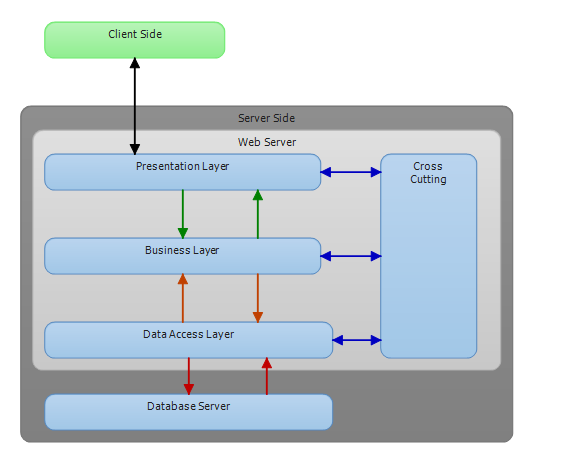
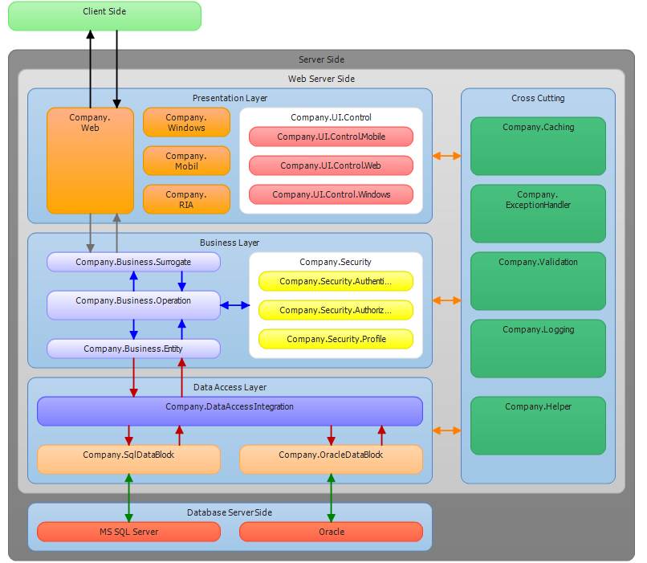

# Traditional N-tier Architecture Application
## Requires
- Visual Studio 2012
## License
- MS-LPL
## Technologies
- C#
- ASP.NET
- .NET Framework
- Web Form
- Web
- C# Language
- .NET Framwork
- ASP.NET Code Sample Downloads
- Visual Studio 2012
- .NET 2.0
- .NET Development
- Developer utility
## Topics
- Software Architecture
- Enterprise projects
- N-tier application
- Multi layer application
- Traditional Layered Application
- Enterprise Application in C#
- Enterprise application template
- Software Design
## Updated
- 09/02/2013
## Description

<h1>Introduction</h1>

<em>This project provider enterprise project template who want to do advanced and enterprise level projects.İt is sample n-tier .net application template.</em>

<h1>Diagrams</h1>

Diagram 0 : Servers (Web Server , Application Server , Database Server)

<em></em>

Diagram 1 : Base Logical Layers (Presentation Layer ,&nbsp;Business Layer ,&nbsp;Data Access Layer ,&nbsp;Cross-Cutting Layer )

<em></em>

Diagram 3 : More details -view of whole project

<em></em>

Diagram 4 : View in architecture explorer of project

<em> 
</em>

&nbsp;

Description

<ul>
<li><strong>Physical tiers</strong><em> of project is&nbsp;web server , application server , database server (namely servers)</em>&nbsp; &nbsp; &nbsp; &nbsp; &nbsp; &nbsp;
</li></ul>
<ul>
<li><strong>Logical layers</strong> of project is &nbsp;too much.I'll&nbsp;list up for all of them
</li></ul>

<strong>Presentation Layer</strong>

<strong>Company.Web</strong><strong>&nbsp;</strong>

<strong>Company.Mobile</strong>

<strong>&nbsp;Company.Windows</strong>

<strong>Company.RIA</strong>

<strong>Company.UI.Control</strong>

<strong><strong>Company.UI.Control.Mobile</strong></strong>

<strong><strong><strong>Company.UI.Control.Web</strong></strong></strong>

<strong><strong><strong><strong>Company.UI.Control.Windows</strong></strong></strong></strong>

<strong><strong>Business Layer&nbsp;</strong></strong>

<strong><strong>Company.Business.Entity</strong></strong>

<strong><strong>Company.Business.Operation</strong></strong>

<strong><strong>Company.Business.Surrogate</strong></strong>

<strong><strong>Company.Security.Authentication</strong></strong>

<strong><strong>Company.Security.Authorization</strong></strong>

<strong><strong>Company.Security.Profile</strong></strong>

<strong><strong><strong>Data Access Layer</strong></strong></strong>

<strong><strong><strong><strong>Cross-Cutting Layer</strong></strong></strong></strong>

<strong><strong><strong><strong>Company.Caching</strong></strong></strong></strong>

<strong><strong><strong><strong>Company.ExceptionManager</strong></strong></strong></strong>

<strong><strong><strong><strong>Company.Helper</strong></strong></strong></strong>

<strong><strong><strong><strong>Company.Loging</strong></strong></strong></strong>

<strong><strong><strong><strong>Company.Validation</strong></strong></strong></strong>

<h1>More Information</h1>

<em>get clone using VisualStudio 2012 with git source control in the bitbucket repository.You can see repository address and git address in the below</em>

Repository :&nbsp;<a href="https://github.com/yemrekeskin/TraditionalLayeredArchitecture">https://github.com/yemrekeskin/TraditionalLayeredArchitecture</a>

Git :&nbsp;https://github.com/yemrekeskin/TraditionalLayeredArchitecture.git

