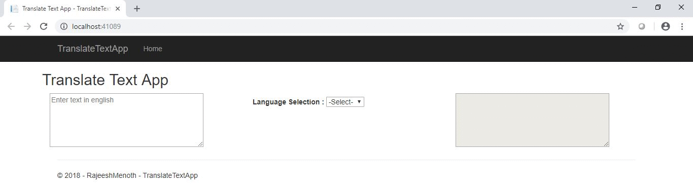

# Translate Text into multiple languages using Asp.Net Core & Csharp
## Requires
- Visual Studio 2017
## License
- MIT
## Technologies
- C#
- Microsoft Azure
- Javascript
- ASP.NET Web API
- AI
- ASP.NET Core
- Cognitive Services
- Microsoft Cognitive Services
- Language API
## Topics
- C#
- Microsoft Azure
- Javascript
- ASP.NET Web API
- AI
- ASP.NET Core
- Cognitive Services
- Microsoft Cognitive Services
- Language API
## Updated
- 09/30/2018
## Description

<h1>Introduction</h1>

In this article, we are going to learn how to translate text into multiple languages using one of the important Cognitive Services API called Microsoft Translate Text API ( One of the API in Language API ). It's a simple&nbsp;cloud-based
 machine translation service and obviously we can test through simple Rest API call. Microsoft is using a new standard for high-quality AI-powered machine translations known as&nbsp;Neural Machine Translation (NMT).

<h1>Interface</h1>

The &quot;ITranslateText&quot; contains one signature for translating text content based on the given input. So we have injected this interface in the ASP.NET Core &quot;Startup.cs&quot; class as a &quot;AddTransient&quot;.

<h1>

C#

Edit|Remove

csharp
<pre class="hidden">using System.Threading.Tasks;

namespace TranslateTextApp.Business_Layer.Interface
{
    interface ITranslateText
    {
        Task&lt;string&gt; Translate(string uri, string text, string key);
    }
}
</pre>

<pre class="csharp">using&nbsp;System.Threading.Tasks;&nbsp;
&nbsp;
namespace&nbsp;TranslateTextApp.Business_Layer.Interface&nbsp;
{&nbsp;
&nbsp;&nbsp;&nbsp;&nbsp;interface&nbsp;ITranslateText&nbsp;
&nbsp;&nbsp;&nbsp;&nbsp;{&nbsp;
&nbsp;&nbsp;&nbsp;&nbsp;&nbsp;&nbsp;&nbsp;&nbsp;Task&lt;string&gt;&nbsp;Translate(string&nbsp;uri,&nbsp;string&nbsp;text,&nbsp;string&nbsp;key);&nbsp;
&nbsp;&nbsp;&nbsp;&nbsp;}&nbsp;
}&nbsp;
</pre>

Translator Text API Service</h1>

We can add the valid Translator Text API Subscription Key into the following code.

<h1>

C#

Edit|Remove

csharp
<pre class="hidden">using Newtonsoft.Json;
using System;
using System.Net.Http;
using System.Text;
using System.Threading.Tasks;
using TranslateTextApp.Business_Layer.Interface;

namespace TranslateTextApp.Business_Layer
{
    public class TranslateTextService : ITranslateText
    {
        /// &lt;summary&gt;
        /// Translate the given text in to selected language.
        /// &lt;/summary&gt;
        /// &lt;param name=&quot;uri&quot;&gt;Request uri&lt;/param&gt;
        /// &lt;param name=&quot;text&quot;&gt;The text is given for translation&lt;/param&gt;
        /// &lt;param name=&quot;key&quot;&gt;Subscription key&lt;/param&gt;
        /// &lt;returns&gt;&lt;/returns&gt;
        public async Task&lt;string&gt; Translate(string uri, string text, string key)
        {
            System.Object[] body = new System.Object[] { new { Text = text } };
            var requestBody = JsonConvert.SerializeObject(body);
            
            using (var client = new HttpClient())
            using (var request = new HttpRequestMessage())
            {
                request.Method = HttpMethod.Post;
                request.RequestUri = new Uri(uri);
                request.Content = new StringContent(requestBody, Encoding.UTF8, &quot;application/json&quot;);
                request.Headers.Add(&quot;Ocp-Apim-Subscription-Key&quot;, key);

                var response = await client.SendAsync(request);
                var responseBody = await response.Content.ReadAsStringAsync();
                dynamic result = JsonConvert.SerializeObject(JsonConvert.DeserializeObject(responseBody), Formatting.Indented);
                
                return result;
            }
        }
    }
}
</pre>

<pre class="js">using&nbsp;Newtonsoft.Json;&nbsp;
using&nbsp;System;&nbsp;
using&nbsp;System.Net.Http;&nbsp;
using&nbsp;System.Text;&nbsp;
using&nbsp;System.Threading.Tasks;&nbsp;
using&nbsp;TranslateTextApp.Business_Layer.Interface;&nbsp;
&nbsp;
namespace&nbsp;TranslateTextApp.Business_Layer&nbsp;
{&nbsp;
&nbsp;&nbsp;&nbsp;&nbsp;public&nbsp;class&nbsp;TranslateTextService&nbsp;:&nbsp;ITranslateText&nbsp;
&nbsp;&nbsp;&nbsp;&nbsp;{///&nbsp;&lt;summary&gt;///&nbsp;Translate&nbsp;the&nbsp;given&nbsp;text&nbsp;in&nbsp;to&nbsp;selected&nbsp;language.///&nbsp;&lt;/summary&gt;///&nbsp;&lt;param&nbsp;name=&quot;uri&quot;&gt;Request&nbsp;uri&lt;/param&gt;///&nbsp;&lt;param&nbsp;name=&quot;text&quot;&gt;The&nbsp;text&nbsp;is&nbsp;given&nbsp;for&nbsp;translation&lt;/param&gt;///&nbsp;&lt;param&nbsp;name=&quot;key&quot;&gt;Subscription&nbsp;key&lt;/param&gt;///&nbsp;&lt;returns&gt;&lt;/returns&gt;&nbsp;
&nbsp;&nbsp;&nbsp;&nbsp;&nbsp;&nbsp;&nbsp;&nbsp;public&nbsp;async&nbsp;Task&lt;string&gt;&nbsp;Translate(string&nbsp;uri,&nbsp;string&nbsp;text,&nbsp;string&nbsp;key)&nbsp;
&nbsp;&nbsp;&nbsp;&nbsp;&nbsp;&nbsp;&nbsp;&nbsp;{&nbsp;
&nbsp;&nbsp;&nbsp;&nbsp;&nbsp;&nbsp;&nbsp;&nbsp;&nbsp;&nbsp;&nbsp;&nbsp;System.Object[]&nbsp;body&nbsp;=&nbsp;new&nbsp;System.Object[]&nbsp;{new{&nbsp;Text&nbsp;=&nbsp;text&nbsp;}};&nbsp;
&nbsp;&nbsp;&nbsp;&nbsp;&nbsp;&nbsp;&nbsp;&nbsp;&nbsp;&nbsp;&nbsp;&nbsp;var&nbsp;requestBody&nbsp;=&nbsp;JsonConvert.SerializeObject(body);&nbsp;
&nbsp;&nbsp;&nbsp;&nbsp;&nbsp;&nbsp;&nbsp;&nbsp;&nbsp;&nbsp;&nbsp;&nbsp;&nbsp;
&nbsp;&nbsp;&nbsp;&nbsp;&nbsp;&nbsp;&nbsp;&nbsp;&nbsp;&nbsp;&nbsp;&nbsp;using&nbsp;(var&nbsp;client&nbsp;=&nbsp;new&nbsp;HttpClient())&nbsp;
&nbsp;&nbsp;&nbsp;&nbsp;&nbsp;&nbsp;&nbsp;&nbsp;&nbsp;&nbsp;&nbsp;&nbsp;using&nbsp;(var&nbsp;request&nbsp;=&nbsp;new&nbsp;HttpRequestMessage())&nbsp;
&nbsp;&nbsp;&nbsp;&nbsp;&nbsp;&nbsp;&nbsp;&nbsp;&nbsp;&nbsp;&nbsp;&nbsp;{&nbsp;
&nbsp;&nbsp;&nbsp;&nbsp;&nbsp;&nbsp;&nbsp;&nbsp;&nbsp;&nbsp;&nbsp;&nbsp;&nbsp;&nbsp;&nbsp;&nbsp;request.Method&nbsp;=&nbsp;HttpMethod.Post;&nbsp;
&nbsp;&nbsp;&nbsp;&nbsp;&nbsp;&nbsp;&nbsp;&nbsp;&nbsp;&nbsp;&nbsp;&nbsp;&nbsp;&nbsp;&nbsp;&nbsp;request.RequestUri&nbsp;=&nbsp;new&nbsp;Uri(uri);&nbsp;
&nbsp;&nbsp;&nbsp;&nbsp;&nbsp;&nbsp;&nbsp;&nbsp;&nbsp;&nbsp;&nbsp;&nbsp;&nbsp;&nbsp;&nbsp;&nbsp;request.Content&nbsp;=&nbsp;new&nbsp;StringContent(requestBody,&nbsp;Encoding.UTF8,&nbsp;&quot;application/json&quot;);&nbsp;
&nbsp;&nbsp;&nbsp;&nbsp;&nbsp;&nbsp;&nbsp;&nbsp;&nbsp;&nbsp;&nbsp;&nbsp;&nbsp;&nbsp;&nbsp;&nbsp;request.Headers.Add(&quot;Ocp-Apim-Subscription-Key&quot;,&nbsp;key);&nbsp;
&nbsp;
&nbsp;&nbsp;&nbsp;&nbsp;&nbsp;&nbsp;&nbsp;&nbsp;&nbsp;&nbsp;&nbsp;&nbsp;&nbsp;&nbsp;&nbsp;&nbsp;var&nbsp;response&nbsp;=&nbsp;await&nbsp;client.SendAsync(request);&nbsp;
&nbsp;&nbsp;&nbsp;&nbsp;&nbsp;&nbsp;&nbsp;&nbsp;&nbsp;&nbsp;&nbsp;&nbsp;&nbsp;&nbsp;&nbsp;&nbsp;var&nbsp;responseBody&nbsp;=&nbsp;await&nbsp;response.Content.ReadAsStringAsync();&nbsp;
&nbsp;&nbsp;&nbsp;&nbsp;&nbsp;&nbsp;&nbsp;&nbsp;&nbsp;&nbsp;&nbsp;&nbsp;&nbsp;&nbsp;&nbsp;&nbsp;dynamic&nbsp;result&nbsp;=&nbsp;JsonConvert.SerializeObject(JsonConvert.DeserializeObject(responseBody),&nbsp;Formatting.Indented);&nbsp;
&nbsp;&nbsp;&nbsp;&nbsp;&nbsp;&nbsp;&nbsp;&nbsp;&nbsp;&nbsp;&nbsp;&nbsp;&nbsp;&nbsp;&nbsp;&nbsp;&nbsp;
&nbsp;&nbsp;&nbsp;&nbsp;&nbsp;&nbsp;&nbsp;&nbsp;&nbsp;&nbsp;&nbsp;&nbsp;&nbsp;&nbsp;&nbsp;&nbsp;return&nbsp;result;&nbsp;
&nbsp;&nbsp;&nbsp;&nbsp;&nbsp;&nbsp;&nbsp;&nbsp;&nbsp;&nbsp;&nbsp;&nbsp;}}}}</pre>

</h1>
<h1>Output</h1>

The given text is translated into desired language listed in a drop-down list using Microsoft Translator API.

 

<h1>Reference</h1>
<h1>

<ul>
<li><strong><a title="Translator Text API Documentation" href="https://docs.microsoft.com/en-in/azure/cognitive-services/translator/" target="_blank">&nbsp;https://docs.microsoft.com/en-in/azure/cognitive-services/translator/</a></strong>
</li></ul>

Summary</h1>

From this article we have learned translate a text(typed in english) in to different languages as per the API documentation using one of the important Cognitive Services API ( Translator Text API is a part of Language API ).
 I hope this article is useful for all Azure Cognitive Services API beginners.

