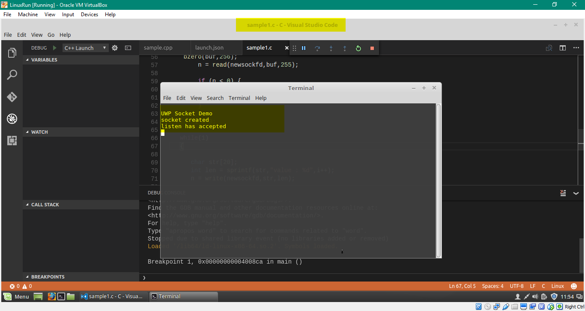
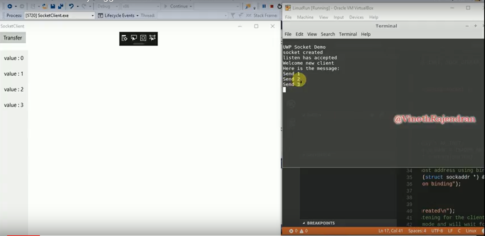

# UWP + Linux Socket communication & Handling communciation in the BackgroundTask
## Requires
- Visual Studio 2017
## License
- MS-LPL
## Technologies
- universal windows app
- Background task
- Stream socket
- SocketActivityConnectedStandbyAction
- SocketActivityTrigger
## Topics
- Background tasks
- Socket communication
## Updated
- 12/18/2016
## Description

<h1>Introduction</h1>

Quick Overview of Socket Communications in the BackgroundTask.

Why has it required?

When the GUI leaving in the foreground due to some synchro like app has suspended in the foreground, delegate this job to the background task, background Task will be handling the communication.<strong>&nbsp;</strong><em>&nbsp;</em>

<h1>Building the Sample</h1>

The server application is running in the Linux PC, the Client application is running on the Windows 10 PC.

Client

1.&nbsp;&nbsp;&nbsp;&nbsp; Windows 10

2.&nbsp;&nbsp;&nbsp;&nbsp; <strong>Visual studio 2017 RC With UWP tools</strong>

3.&nbsp;&nbsp;&nbsp;&nbsp; C#

4.&nbsp;&nbsp;&nbsp;&nbsp; UWP Toolkit

Server (Any Server)

1.&nbsp;&nbsp;&nbsp;&nbsp; Linux mint 18

2.&nbsp;&nbsp;&nbsp;&nbsp; <strong>Visual Studio Code IDE</strong>

3.&nbsp;&nbsp;&nbsp;&nbsp; C Programming

4.&nbsp;&nbsp;&nbsp;&nbsp; Oracle Virtual Box<strong>&nbsp;</strong><em>&nbsp;</em>

Description

Transfer the Socket Communications

Transfer the StreamSocket to the BackgroundTask, first, we have to Enable the transfer the ownership, to enable the use the&nbsp;<strong>EnableTransferOwnership</strong>&nbsp;API. To call this function in Server Side socket before the binding host
 address, In Client side call this function, before Connect to the server socket.&nbsp;

Transfer the socket: &nbsp;Based on the needs, call the TransferOwnerShip API to transfer the socket communication to the Background Task.(Socket Broker) , In this example OnSuspending event, we call the&nbsp;<strong>TransferOwnership</strong>&nbsp;API.

Concept of this sample

Using TCP protocol, Server sends the continues data to the client, the client will receive the data&rsquo;s display in GUI, Once Client App has suspended, BackgroundTask of the app receives the data&rsquo;s display as a ToastNotification.<strong>&nbsp;</strong><em>&nbsp;</em>

&nbsp;

More Info : <a title="UWP &#43; Linux Socket communication & Handling communciation in the BackgroundTask" href="http://social.technet.microsoft.com/wiki/contents/articles/36500.uwp-linux-socket-communication-handling-communciation-in-the-backgroundtask.aspx?wa=wsignin1.0" target="_blank">
http://social.technet.microsoft.com/wiki/contents/articles/36500.uwp-linux-socket-communication-handling-communciation-in-the-backgroundtask.aspx?wa=wsignin1.0</a>

&nbsp;

Server APP

Server code has written in the C lanuguage

&nbsp;

C&#43;&#43;

Edit|Remove

cplusplus

<pre class="cplusplus">#include&nbsp;&lt;unistd.h&gt;&nbsp;
#include&nbsp;&lt;stdio.h&gt;&nbsp;
#include&nbsp;&lt;stdlib.h&gt;&nbsp;
#include&nbsp;&lt;netdb.h&gt;&nbsp;
#include&nbsp;&lt;netinet/in.h&gt;&nbsp;
#include&nbsp;&lt;string.h&gt;&nbsp;
&nbsp;
int&nbsp;main()&nbsp;
{&nbsp;
&nbsp;&nbsp;&nbsp;&nbsp;printf(&quot;UWP&nbsp;Socket&nbsp;Demo\n&quot;);&nbsp;
&nbsp;
&nbsp;&nbsp;&nbsp;&nbsp;&nbsp;int&nbsp;sockfd,&nbsp;newsockfd,&nbsp;portno,&nbsp;clilen;&nbsp;
&nbsp;&nbsp;&nbsp;char&nbsp;buf[256];&nbsp;
&nbsp;&nbsp;&nbsp;struct&nbsp;sockaddr_in&nbsp;serv_addr,&nbsp;cli_addr;&nbsp;
&nbsp;&nbsp;&nbsp;int&nbsp;&nbsp;n;&nbsp;
&nbsp;&nbsp;&nbsp;&nbsp;&nbsp;
&nbsp;&nbsp;&nbsp;&nbsp;sockfd&nbsp;=&nbsp;socket(AF_INET,&nbsp;SOCK_STREAM,&nbsp;0);&nbsp;
&nbsp;&nbsp;&nbsp;&nbsp;
&nbsp;&nbsp;&nbsp;if&nbsp;(sockfd&nbsp;&lt;&nbsp;0)&nbsp;
&nbsp;&nbsp;&nbsp;&nbsp;{&nbsp;
&nbsp;&nbsp;&nbsp;&nbsp;&nbsp;&nbsp;perror(&quot;socket&nbsp;created&nbsp;error&quot;);&nbsp;
&nbsp;&nbsp;&nbsp;&nbsp;&nbsp;&nbsp;exit(1);&nbsp;
&nbsp;&nbsp;&nbsp;}&nbsp;
&nbsp;
&nbsp;&nbsp;&nbsp;bzero((char&nbsp;*)&nbsp;&amp;serv_addr,&nbsp;sizeof(serv_addr));&nbsp;
&nbsp;&nbsp;&nbsp;portno&nbsp;=&nbsp;6000;&nbsp;
&nbsp;&nbsp;&nbsp;&nbsp;
&nbsp;&nbsp;&nbsp;serv_addr.sin_family&nbsp;=&nbsp;AF_INET;&nbsp;
&nbsp;&nbsp;&nbsp;serv_addr.sin_addr.s_addr&nbsp;=&nbsp;INADDR_ANY;&nbsp;
&nbsp;&nbsp;&nbsp;serv_addr.sin_port&nbsp;=&nbsp;htons(portno);&nbsp;
&nbsp;&nbsp;&nbsp;&nbsp;
&nbsp;&nbsp;&nbsp;&nbsp;if&nbsp;(bind(sockfd,&nbsp;(struct&nbsp;sockaddr&nbsp;*)&nbsp;&amp;serv_addr,&nbsp;sizeof(serv_addr))&nbsp;&lt;&nbsp;0)&nbsp;{&nbsp;
&nbsp;&nbsp;&nbsp;&nbsp;&nbsp;&nbsp;perror(&quot;ERROR&nbsp;on&nbsp;binding&quot;);&nbsp;
&nbsp;&nbsp;&nbsp;&nbsp;&nbsp;&nbsp;exit(1);&nbsp;
&nbsp;&nbsp;&nbsp;}&nbsp;
&nbsp;
&nbsp;&nbsp;&nbsp;&nbsp;printf(&quot;socket&nbsp;created\n&quot;);&nbsp;
&nbsp;&nbsp;&nbsp;&nbsp;&nbsp;
&nbsp;&nbsp;&nbsp;&nbsp;
&nbsp;&nbsp;&nbsp;listen(sockfd,5);&nbsp;
&nbsp;&nbsp;&nbsp;clilen&nbsp;=&nbsp;sizeof(cli_addr);&nbsp;
&nbsp;&nbsp;&nbsp;&nbsp;
&nbsp;&nbsp;&nbsp;printf(&quot;listen&nbsp;has&nbsp;accepted\n&quot;);&nbsp;
&nbsp;
&nbsp;&nbsp;&nbsp;&nbsp;&nbsp;
&nbsp;&nbsp;&nbsp;newsockfd&nbsp;=&nbsp;accept(sockfd,(struct&nbsp;sockaddr&nbsp;*)&amp;cli_addr,&nbsp;&amp;clilen);&nbsp;
&nbsp;&nbsp;&nbsp;&nbsp;&nbsp;
&nbsp;&nbsp;&nbsp;if&nbsp;(newsockfd&nbsp;&lt;&nbsp;0)&nbsp;{&nbsp;
&nbsp;&nbsp;&nbsp;&nbsp;&nbsp;&nbsp;perror(&quot;ERROR&nbsp;on&nbsp;accept&quot;);&nbsp;
&nbsp;&nbsp;&nbsp;&nbsp;&nbsp;&nbsp;exit(1);&nbsp;
&nbsp;&nbsp;&nbsp;}&nbsp;
&nbsp;&nbsp;&nbsp;&nbsp;
&nbsp;&nbsp;&nbsp;printf(&quot;Welcome&nbsp;new&nbsp;client\n&quot;);&nbsp;
&nbsp;&nbsp;&nbsp;&nbsp;
&nbsp;&nbsp;&nbsp;printf(&quot;Here&nbsp;is&nbsp;the&nbsp;message:&nbsp;%s\n&quot;,buf);&nbsp;
&nbsp;&nbsp;&nbsp;&nbsp;bzero(buf,256);&nbsp;
&nbsp;&nbsp;&nbsp;&nbsp;&nbsp;&nbsp;&nbsp;&nbsp;n&nbsp;=&nbsp;read(newsockfd,buf,255);&nbsp;
&nbsp;&nbsp;&nbsp;&nbsp;&nbsp;&nbsp;&nbsp;&nbsp;&nbsp;
&nbsp;&nbsp;&nbsp;&nbsp;&nbsp;&nbsp;&nbsp;&nbsp;if&nbsp;(n&nbsp;&lt;&nbsp;0)&nbsp;{&nbsp;
&nbsp;&nbsp;&nbsp;&nbsp;&nbsp;&nbsp;&nbsp;&nbsp;&nbsp;&nbsp;&nbsp;&nbsp;perror(&quot;ERROR&nbsp;reading&nbsp;from&nbsp;socket&quot;);&nbsp;
&nbsp;&nbsp;&nbsp;&nbsp;&nbsp;&nbsp;&nbsp;&nbsp;&nbsp;&nbsp;&nbsp;&nbsp;exit(1);&nbsp;
&nbsp;&nbsp;&nbsp;&nbsp;&nbsp;&nbsp;&nbsp;&nbsp;}&nbsp;
&nbsp;&nbsp;&nbsp;&nbsp;
&nbsp;&nbsp;&nbsp;int&nbsp;i&nbsp;=&nbsp;0;&nbsp;
&nbsp;&nbsp;&nbsp;&nbsp;
&nbsp;&nbsp;&nbsp;while(1)&nbsp;
&nbsp;&nbsp;&nbsp;{&nbsp;
&nbsp;&nbsp;&nbsp;&nbsp;&nbsp;
&nbsp;&nbsp;&nbsp;&nbsp;&nbsp;&nbsp;char&nbsp;str[20];&nbsp;
&nbsp;&nbsp;&nbsp;&nbsp;&nbsp;&nbsp;int&nbsp;len&nbsp;=&nbsp;sprintf(str,&quot;value&nbsp;:&nbsp;%d&quot;,i&#43;&#43;);&nbsp;
&nbsp;&nbsp;&nbsp;&nbsp;&nbsp;&nbsp;n&nbsp;=&nbsp;write(newsockfd,str,len);&nbsp;
&nbsp;&nbsp;&nbsp;&nbsp;&nbsp;&nbsp;&nbsp;
&nbsp;&nbsp;&nbsp;&nbsp;&nbsp;&nbsp;if&nbsp;(n&nbsp;&lt;&nbsp;0)&nbsp;{&nbsp;
&nbsp;&nbsp;&nbsp;&nbsp;&nbsp;&nbsp;&nbsp;&nbsp;&nbsp;&nbsp;perror(&quot;Send&nbsp;Failed!!!\n&quot;);&nbsp;
&nbsp;&nbsp;&nbsp;&nbsp;&nbsp;&nbsp;&nbsp;&nbsp;&nbsp;&nbsp;exit(1);&nbsp;
&nbsp;&nbsp;&nbsp;&nbsp;&nbsp;&nbsp;}&nbsp;
&nbsp;&nbsp;&nbsp;&nbsp;&nbsp;&nbsp;sleep(10);&nbsp;
&nbsp;
&nbsp;&nbsp;&nbsp;&nbsp;&nbsp;&nbsp;printf(&quot;Send&nbsp;%d&nbsp;\n&quot;,i);&nbsp;
&nbsp;&nbsp;&nbsp;}&nbsp;
&nbsp;&nbsp;&nbsp;&nbsp;return&nbsp;0;&nbsp;
}</pre>

&nbsp;

&nbsp;

&nbsp;

&nbsp;

&nbsp;

UWP Client App

&nbsp;

