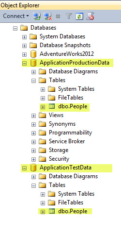
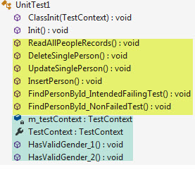
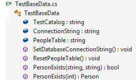
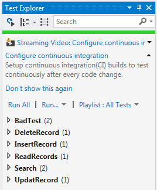

# Unit testing SQL-Server data operations with C#
## Requires
- Visual Studio 2015
## License
- MIT
## Technologies
- C#
- SQL Server
- Unit Test
## Topics
- SQL Server
- Data Access
- Unit Testing
## Updated
- 11/26/2017
## Description

<h1>Description</h1>

This code sample will provide a method to unit test backend database operations, adding records, updating records and removal of records using SQL-Server database table.

I&rsquo;ve been on various developer forums where developers have issues with their data operations and in most cases are not only dealing with the data operations but also how information is passed to the data operations
 via controls such as TextBox, ListBox, DataGridView, ComboBox etc along with not writing SQL operations properly e.g. not using parameters. The code samples for unit test provided here are not concerned with user interface aspect of an application, only the
 backend operations that one would pass information from the front-end to the back-end (then there is always the layer in between if used, business logic and validation which I have not done here, just the actual data operations).

<strong>What is Unit Testing?</strong>

The objective of Unit Testing is to isolate a section of code and verify its correctness. In procedural programming a unit may be an individual function or procedure.

The goal of Unit Testing is to isolate each part of the program and show that the individual parts are correct. Unit Testing is usually performed by the developer. Once a developer has tested in many teams there is a testing
 team who will run their test e.g. our test team using Visual Studio test suite.

<strong>Why do Unit Testing? Why it is important?</strong>

Sometimes software developers attempt to save time by doing minimal unit testing. This is a myth because skimping on unit testing leads to higher Defect fixing costs during System Testing, Integration Testing and even
 Beta Testing after the application is completed. Proper unit testing done during the development stage saves both time and money in the end.

A good deal of developers will mock data using a mocking framework while our team will mock up data then insert data into our database, run test then restore the environment back to how it was prior to the unit test. We
 have another team that creates what we call sliced which isolate data into a private enviroment which also allows a developer to change the date/time meaning if we want to test something in the past we have a property &quot;Run Date&quot; which we can set to a specific
 date e.g. enter 0 for today, enter say -7d to place the date back seven days etc.&nbsp;

Doing a Google search on <a title="Runs a Google search" href="https://www.google.com/search?ei=6uQaWpqfCuuB0wKGobGgDw&q=c%23&#43;unit&#43;test&#43;mock&#43;database&oq=C%23&#43;unit&#43;test&#43;mocking&gs_l=psy-ab.3.1.0j0i22i30k1l9.23538.29457.0.33517.24.21.2.1.1.0.184.1684.20j1.21.0....0...1c.1.64.psy-ab..0.24.1703...35i39k1j0i67k1j0i131k1j0i20i264k1j0i20i263k1.0.f_fEVpIrZoE">
C# unit test mocking database</a> will produce a lot of choices if you want to mock data.

<strong>Working with the code samples provided here</strong>.

In SQL-Server Management Studio I created a database named ApplicationProductionData then mirrored it with ApplicationTestData.

Then used RedGate data generator to create several thousand records in ApplicationProductionData. In the TestInitialize method in the unit test class run a reset method shown below.

&nbsp;

C#

Edit|Remove

csharp

<pre class="csharp">public&nbsp;void&nbsp;ResetPeopleTable()&nbsp;
{&nbsp;
&nbsp;&nbsp;&nbsp;&nbsp;using&nbsp;(SqlConnection&nbsp;cn&nbsp;=&nbsp;new&nbsp;SqlConnection&nbsp;{&nbsp;ConnectionString&nbsp;=&nbsp;ConnectionString&nbsp;})&nbsp;
&nbsp;&nbsp;&nbsp;&nbsp;{&nbsp;
&nbsp;&nbsp;&nbsp;&nbsp;&nbsp;&nbsp;&nbsp;&nbsp;using&nbsp;(SqlCommand&nbsp;cmd&nbsp;=&nbsp;new&nbsp;SqlCommand&nbsp;{&nbsp;Connection&nbsp;=&nbsp;cn&nbsp;})&nbsp;
&nbsp;&nbsp;&nbsp;&nbsp;&nbsp;&nbsp;&nbsp;&nbsp;{&nbsp;
&nbsp;
&nbsp;&nbsp;&nbsp;&nbsp;&nbsp;&nbsp;&nbsp;&nbsp;&nbsp;&nbsp;&nbsp;&nbsp;/*&nbsp;
&nbsp;&nbsp;&nbsp;&nbsp;&nbsp;&nbsp;&nbsp;&nbsp;&nbsp;&nbsp;&nbsp;&nbsp;&nbsp;&nbsp;&nbsp;&nbsp;*&nbsp;There&nbsp;are&nbsp;two&nbsp;statements&nbsp;separated&nbsp;with&nbsp;a&nbsp;semi-colon.&nbsp;First&nbsp;truncation&nbsp;then&nbsp;population.&nbsp;
&nbsp;&nbsp;&nbsp;&nbsp;&nbsp;&nbsp;&nbsp;&nbsp;&nbsp;&nbsp;&nbsp;&nbsp;&nbsp;&nbsp;&nbsp;&nbsp;*/&nbsp;
&nbsp;&nbsp;&nbsp;&nbsp;&nbsp;&nbsp;&nbsp;&nbsp;&nbsp;&nbsp;&nbsp;&nbsp;cmd.CommandText&nbsp;=&nbsp;&quot;TRUNCATE&nbsp;TABLE&nbsp;ApplicationTestData.dbo.People;&quot;&nbsp;&#43;&nbsp;
&nbsp;&nbsp;&nbsp;&nbsp;&nbsp;&nbsp;&nbsp;&nbsp;&nbsp;&nbsp;&nbsp;&nbsp;&nbsp;&nbsp;&nbsp;&nbsp;&nbsp;&nbsp;&nbsp;&nbsp;&nbsp;&nbsp;&nbsp;&nbsp;&nbsp;&nbsp;&nbsp;&nbsp;&nbsp;&nbsp;&nbsp;&nbsp;&quot;INSERT&nbsp;INTO&nbsp;ApplicationTestData.dbo.People&nbsp;&quot;&nbsp;&#43;&nbsp;&nbsp;
&nbsp;&nbsp;&nbsp;&nbsp;&nbsp;&nbsp;&nbsp;&nbsp;&nbsp;&nbsp;&nbsp;&nbsp;&nbsp;&nbsp;&nbsp;&nbsp;&nbsp;&nbsp;&nbsp;&nbsp;&nbsp;&nbsp;&nbsp;&nbsp;&nbsp;&nbsp;&nbsp;&nbsp;&nbsp;&nbsp;&nbsp;&nbsp;&quot;(&nbsp;FirstName&nbsp;,&nbsp;LastName&nbsp;,&nbsp;Gender&nbsp;,&nbsp;BirthDay&nbsp;)&nbsp;&quot;&nbsp;&#43;&nbsp;&nbsp;
&nbsp;&nbsp;&nbsp;&nbsp;&nbsp;&nbsp;&nbsp;&nbsp;&nbsp;&nbsp;&nbsp;&nbsp;&nbsp;&nbsp;&nbsp;&nbsp;&nbsp;&nbsp;&nbsp;&nbsp;&nbsp;&nbsp;&nbsp;&nbsp;&nbsp;&nbsp;&nbsp;&nbsp;&nbsp;&nbsp;&nbsp;&nbsp;&quot;SELECT&nbsp;FirstName&nbsp;,&nbsp;LastName&nbsp;,&nbsp;Gender&nbsp;,&nbsp;BirthDay&nbsp;&quot;&nbsp;&#43;&nbsp;
&nbsp;&nbsp;&nbsp;&nbsp;&nbsp;&nbsp;&nbsp;&nbsp;&nbsp;&nbsp;&nbsp;&nbsp;&nbsp;&nbsp;&nbsp;&nbsp;&nbsp;&nbsp;&nbsp;&nbsp;&nbsp;&nbsp;&nbsp;&nbsp;&nbsp;&nbsp;&nbsp;&nbsp;&nbsp;&nbsp;&nbsp;&nbsp;&quot;FROM&nbsp;&nbsp;ApplicationProductionData.dbo.People&quot;;&nbsp;
&nbsp;
&nbsp;&nbsp;&nbsp;&nbsp;&nbsp;&nbsp;&nbsp;&nbsp;&nbsp;&nbsp;&nbsp;&nbsp;cn.Open();&nbsp;
&nbsp;&nbsp;&nbsp;&nbsp;&nbsp;&nbsp;&nbsp;&nbsp;&nbsp;&nbsp;&nbsp;&nbsp;cmd.ExecuteNonQuery();&nbsp;
&nbsp;
&nbsp;&nbsp;&nbsp;&nbsp;&nbsp;&nbsp;&nbsp;&nbsp;}&nbsp;
&nbsp;&nbsp;&nbsp;&nbsp;}&nbsp;
}</pre>

&nbsp;

&nbsp;

The reset method runs for each test. When running this is SSMS&nbsp; (SQL-Server Management Studio) execution time was 00:00:00 while I didn't measure time in the C# code it's super quick, not noticable at all.

The test consist of CRUD operations e.g. from the backend data operations class (which is a separate class project from the unit test used by our dummy application).

 

Our unit test where yellow are valid working test and the light blue are examples of test that should never had been written (see comments in code).

I have a test base which the unit test inherits.

These methods are used in the unit test to access the Operations class in the Backend project along with assisting with test validation.

When writing the unit test I added traits so that in test explorer we can segment test e.g.

Any ways what is presented here is but one way to look at using unit test. As you find your way consider looking at TDD (Test Driven Development) where you write test first, create classes from the unit test (Visual Studio allows
 us to do this). TDD is a tough one to do at first and many will discard it for conventional ways of coding. Point in fact, I posted a thread on a Microsoft forum where the only reponses where (do you think people here know what a unit test is?) and another
 person replied with links to learning unit testing, no other replies which indicate that I was right that there is not a big interest with some groups of developers as they simply write code with zero planning like many did in the older days of coding.

Today if you are looking to be a professional developer you need to be proficient with all aspects of testing be it C#, JavaScript, database etc to land a well paying position.

<h1>Configuring to run the test.</h1>

Run the script&nbsp;Create_ApplicationProductionDatabaseAndData.sql in the backend class project to create an populate ApplicationProduction database, People table and populate the People table.

Create on the same server a database named ApplicationTestData. Then run CreatePeopleTable.sql in the backend class project in the database ApplicationTestData.

Special note: I used a NuGet package <a href="https://github.com/jamesfoster/DeepEqual">
DeepEual</a> for comparing objects in several unit test where what's on the web did not suit my needs. Depending on how things are configured on your version of Visual Studio the package may be auto-restored or you may have to restore it yourself.

Build the solution.

Open Test Explorer. Select all test or any one test. Examine the test methods to see what I did.

If you are using MS-Acces see

<a href="https://code.msdn.microsoft.com/Unit-testing-data-55b60694?redir=0">Unit testing data operations with Access database in C#</a>. In this code sample I had to deal with copying a application database to the test project
 rather than reset the table in SQL-Server as there is no &quot;Copy to Output directory&quot; so I rolled my own.

I also have one to mirror the C# MS-Access <a href="https://code.msdn.microsoft.com/Unit-testing-data-a7d06269?redir=0">
unit test here</a>.

From here explore, research on the web and form you own way to unit test based on what has been presented here and found on the web.

