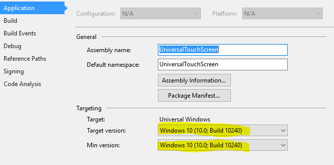
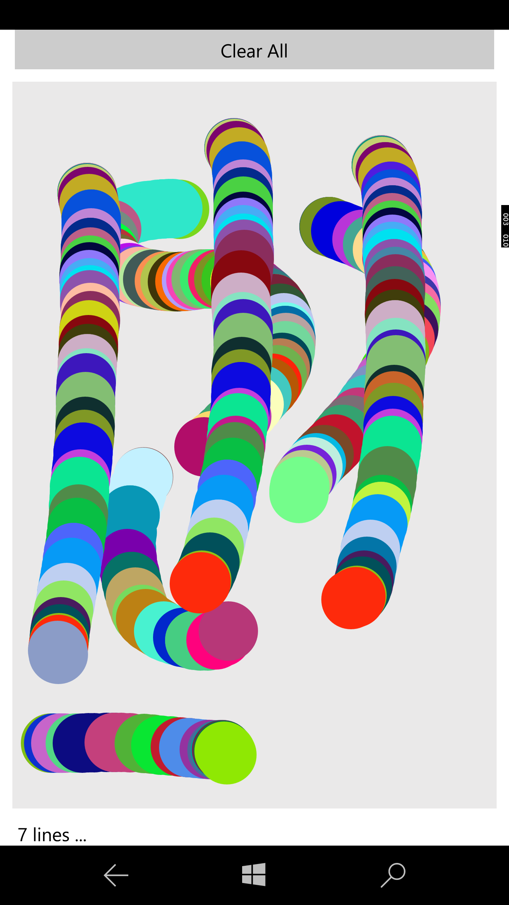
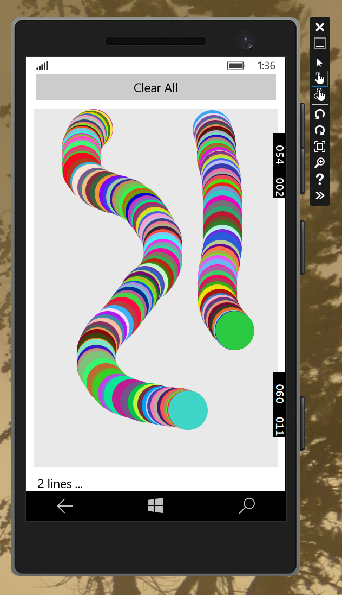
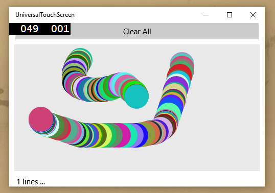

# Universal Touch Screen (Universal Windows C# ) - Multi Touch Drawing ...
## Requires
- Visual Studio 2015
## License
- MIT
## Technologies
- universal windows app
- UWP
- windows phone 10
- multi-touch track-pad
- pen
## Topics
- C# Language Features
- universal windows app
- UWP
- windows phone 10
- multi-touch track-pad
- Lumia 950
## Updated
- 11/28/2017
## Description

<h1>Introduction</h1>

Just in case,&nbsp;project works with SDK 10.0.10240

&nbsp;&nbsp;

&nbsp;

If you have a problem with upload to WP (ask PIN) ... see&nbsp;link <a href="http://stackoverflow.com/questions/34114265/visual-studio-pin-is-required-to-establish-a-connection">
http://stackoverflow.com/questions/34114265/visual-studio-pin-is-required-to-establish-a-connection</a>

<em>Universal Windows App - Windows Phone/Store Application. Multi-touch screen example. GetIntermediatePoints, PointerDeviceType, PointerPointProperties. Show how to draw many lines with fingers. How to use the stylus, tap, mouse. Multiple input points
 (fingertips). &nbsp; How to use PointerPoint class ...&nbsp; 
 
</em>

<h1>Building the Sample</h1>

<em>Bring project, choose architecture X86, x64, ARM deploy and RUN/Debug</em>

Description

<em>Simple Application which shows how to use multiple fingertips to draw multiple lines ...</em>

<em>Below screenshot from Lumia 950XL</em>

&nbsp;

For use properties pressure please comment out (in code) line

pressure&nbsp;=&nbsp;1;

&nbsp;

<em> 
</em>

<em>&nbsp;</em>

Screenshot's device emulator &nbsp;(using the mouse) ...

This windows store application (Local PC)

&nbsp;

In this example you find an answer how to use&nbsp;PointerPointProperties class,&nbsp;GetIntermediatePoints,&nbsp;It demonstrates how to using touch, mouse, and pen features. The application is written in C# and it designed
 for Windows 10 devices.&nbsp;

The biggest advantages of touch interactions are the ability to use multiple input points (fingertips) at the same time.

Application support Stylus Interaction (pressure propeties).

Using Touch, Mouse, and Pen...

&nbsp;

C#XAML

Edit|Remove

csharpxaml
<pre class="hidden">using System;
using System.Collections.Generic;
using System.IO;
using System.Linq;
using System.Runtime.InteropServices.WindowsRuntime;
using System.Windows.Input;

using Windows.UI;
using Windows.UI.Popups;

using Windows.Foundation;
using Windows.Foundation.Collections;
using Windows.UI.Xaml;
using Windows.UI.Xaml.Controls;
using Windows.UI.Xaml.Controls.Primitives;
using Windows.UI.Xaml.Data;
using Windows.UI.Xaml.Input;
using Windows.UI.Xaml.Media;
using Windows.UI.Xaml.Navigation;

using Windows.UI.Xaml.Shapes;
using Windows.Devices.Input;

namespace UniversalTouchScreen
{
    // Thanks ProfessorWeb.ru site - &gt; http://professorweb.ru/my/windows8/rt-ext/level1/1_4.php   (please use Google Translate)
    public sealed partial class MainPage : Page
    {
        public MainPage()
        {
            this.InitializeComponent();
        }

        private SortedSet&lt;uint&gt; setId = new SortedSet&lt;uint&gt;();

        private void gridPad_PointerMoved(object sender, PointerRoutedEventArgs e)
        {
            IList&lt;Windows.UI.Input.PointerPoint&gt; IlistPointer = e.GetIntermediatePoints(gridPad);
            int intPointerCount = IlistPointer.Count();

            byte[] rgb = new byte[3];
            (new Random()).NextBytes(rgb);
            Color color = Color.FromArgb(255, rgb[0], rgb[1], rgb[2]);

            var blnIsMouse = e.Pointer.PointerDeviceType == PointerDeviceType.Mouse;

            //Pointer saved in reversed mode ...
            for (int i = intPointerCount - 1; i &gt;= 0; i--)
            {
                Windows.UI.Input.PointerPoint pointer = IlistPointer[i];

                // User PointerId for identify sequence (line) - if needed
                setId.Add(pointer.PointerId); // Add to Set - Set Automatically does not include duplicate Id ... 

                Point point = pointer.Position;

                // Prevent adding ellipse if mouse over grid and not left pressed ...
                if (blnIsMouse &amp;&amp; !pointer.Properties.IsLeftButtonPressed) continue; 
                
                //Properties -  https://msdn.microsoft.com/en-us/library/windows.ui.input.pointerpointproperties.aspx
                //if your devise has stylus ...
                float pressure = pointer.Properties.Pressure;

                // 48 just randomly chosen value...
                // value pressure always 0.5 if not pen (stylus) ...

                // Pay attention about simulator - pressure will be very small 
                 pressure = 1; // use for simulate

                double w = 48.0 * pressure;
                double h = 48.0 * pressure;

                if (point.X &lt; w / 2.0 || point.X &gt; gridPad.ActualWidth - w / 2)
                {
                    continue;  // add ellipse only on grid
                }

                if (point.Y &lt; h / 2.0 || point.Y &gt; gridPad.ActualHeight - h / 2)
                {
                    continue; // add ellipse only on grid
                }

                var tr = new TranslateTransform();
                tr.X = point.X - gridPad.ActualWidth / 2.0;
                tr.Y = point.Y - gridPad.ActualHeight / 2.0;

                Ellipse el = new Ellipse()
                {
                    Width = w,
                    Height = h,
                    Fill = new SolidColorBrush(color),
                    RenderTransform = tr,
                    Visibility = Visibility.Visible
                };

                gridPad.Children.Add(el);

            }

            txtInfo.Text = &quot; &quot; &#43; setId.Count().ToString() &#43; &quot; lines ...&quot;;

            // base.OnPointerMoved(e); //You can see differences if uncomment this line
        }

        private void btnClearAll_Click(object sender, RoutedEventArgs e)
        {
            while (gridPad.Children.Count != 0) // because below removed only first occurrence
            {
                foreach (UIElement uie in gridPad.Children)
                {
                    gridPad.Children.Remove(uie);
                }
            }

            setId = new SortedSet&lt;uint&gt;();
            txtInfo.Text = &quot;0 - lines ...&quot;;

        }

    }
}

//GestureRecognizer class - &gt; https://msdn.microsoft.com/library/windows/apps/br241937
//Some interesting idea   - &gt; https://software.intel.com/en-us/articles/mixing-stylus-and-touch-input-on-windows-8
</pre>
<pre class="hidden">&lt;Page
    x:Class=&quot;UniversalTouchScreen.MainPage&quot;
    xmlns=&quot;http://schemas.microsoft.com/winfx/2006/xaml/presentation&quot;
    xmlns:x=&quot;http://schemas.microsoft.com/winfx/2006/xaml&quot;
    xmlns:local=&quot;using:UniversalTouchScreen&quot;
    xmlns:d=&quot;http://schemas.microsoft.com/expression/blend/2008&quot;
    xmlns:mc=&quot;http://schemas.openxmlformats.org/markup-compatibility/2006&quot;
    mc:Ignorable=&quot;d&quot;  &gt;

    &lt;Grid Background=&quot;{ThemeResource ApplicationPageBackgroundThemeBrush}&quot;&gt;
        &lt;Grid.ColumnDefinitions&gt;
            &lt;ColumnDefinition /&gt;
            &lt;ColumnDefinition /&gt;
        &lt;/Grid.ColumnDefinitions&gt;
        &lt;Grid.RowDefinitions&gt;
            &lt;RowDefinition Height=&quot;Auto&quot;/&gt;
            &lt;RowDefinition Height=&quot;*&quot;/&gt;
            &lt;RowDefinition Height=&quot;Auto&quot;/&gt;
            &lt;RowDefinition Height=&quot;Auto&quot;/&gt;
        &lt;/Grid.RowDefinitions&gt;

        &lt;Button x:Name=&quot;btnClearAll&quot;  Margin=&quot;12,0&quot; Grid.Row=&quot;0&quot; Grid.ColumnSpan=&quot;2&quot; VerticalAlignment=&quot;Top&quot; HorizontalAlignment=&quot;Stretch&quot; Content=&quot;Clear All&quot; Click=&quot;btnClearAll_Click&quot;  /&gt;
       
        &lt;Grid
            Name=&quot;gridPad&quot; Grid.ColumnSpan=&quot;2&quot; Grid.Row=&quot;1&quot; Margin=&quot;10&quot; Background=&quot;#FFEAE9E9&quot;  PointerMoved=&quot;gridPad_PointerMoved&quot; /&gt;
        &lt;TextBlock x:Name=&quot;txtInfo&quot; Text=&quot;MultiTouch &quot;  Margin=&quot;10,0,12,0&quot; Grid.Row=&quot;2&quot; Grid.ColumnSpan=&quot;2&quot; /&gt;

    &lt;/Grid&gt;
&lt;/Page&gt;
</pre>

<pre class="csharp">using&nbsp;System;&nbsp;
using&nbsp;System.Collections.Generic;&nbsp;
using&nbsp;System.IO;&nbsp;
using&nbsp;System.Linq;&nbsp;
using&nbsp;System.Runtime.InteropServices.WindowsRuntime;&nbsp;
using&nbsp;System.Windows.Input;&nbsp;
&nbsp;
using&nbsp;Windows.UI;&nbsp;
using&nbsp;Windows.UI.Popups;&nbsp;
&nbsp;
using&nbsp;Windows.Foundation;&nbsp;
using&nbsp;Windows.Foundation.Collections;&nbsp;
using&nbsp;Windows.UI.Xaml;&nbsp;
using&nbsp;Windows.UI.Xaml.Controls;&nbsp;
using&nbsp;Windows.UI.Xaml.Controls.Primitives;&nbsp;
using&nbsp;Windows.UI.Xaml.Data;&nbsp;
using&nbsp;Windows.UI.Xaml.Input;&nbsp;
using&nbsp;Windows.UI.Xaml.Media;&nbsp;
using&nbsp;Windows.UI.Xaml.Navigation;&nbsp;
&nbsp;
using&nbsp;Windows.UI.Xaml.Shapes;&nbsp;
using&nbsp;Windows.Devices.Input;&nbsp;
&nbsp;
namespace&nbsp;UniversalTouchScreen&nbsp;
{&nbsp;
&nbsp;&nbsp;&nbsp;&nbsp;//&nbsp;Thanks&nbsp;ProfessorWeb.ru&nbsp;site&nbsp;-&nbsp;&gt;&nbsp;http://professorweb.ru/my/windows8/rt-ext/level1/1_4.php&nbsp;&nbsp;&nbsp;(please&nbsp;use&nbsp;Google&nbsp;Translate)&nbsp;
&nbsp;&nbsp;&nbsp;&nbsp;public&nbsp;sealed&nbsp;partial&nbsp;class&nbsp;MainPage&nbsp;:&nbsp;Page&nbsp;
&nbsp;&nbsp;&nbsp;&nbsp;{&nbsp;
&nbsp;&nbsp;&nbsp;&nbsp;&nbsp;&nbsp;&nbsp;&nbsp;public&nbsp;MainPage()&nbsp;
&nbsp;&nbsp;&nbsp;&nbsp;&nbsp;&nbsp;&nbsp;&nbsp;{&nbsp;
&nbsp;&nbsp;&nbsp;&nbsp;&nbsp;&nbsp;&nbsp;&nbsp;&nbsp;&nbsp;&nbsp;&nbsp;this.InitializeComponent();&nbsp;
&nbsp;&nbsp;&nbsp;&nbsp;&nbsp;&nbsp;&nbsp;&nbsp;}&nbsp;
&nbsp;
&nbsp;&nbsp;&nbsp;&nbsp;&nbsp;&nbsp;&nbsp;&nbsp;private&nbsp;SortedSet&lt;uint&gt;&nbsp;setId&nbsp;=&nbsp;new&nbsp;SortedSet&lt;uint&gt;();&nbsp;
&nbsp;
&nbsp;&nbsp;&nbsp;&nbsp;&nbsp;&nbsp;&nbsp;&nbsp;private&nbsp;void&nbsp;gridPad_PointerMoved(object&nbsp;sender,&nbsp;PointerRoutedEventArgs&nbsp;e)&nbsp;
&nbsp;&nbsp;&nbsp;&nbsp;&nbsp;&nbsp;&nbsp;&nbsp;{&nbsp;
&nbsp;&nbsp;&nbsp;&nbsp;&nbsp;&nbsp;&nbsp;&nbsp;&nbsp;&nbsp;&nbsp;&nbsp;IList&lt;Windows.UI.Input.PointerPoint&gt;&nbsp;IlistPointer&nbsp;=&nbsp;e.GetIntermediatePoints(gridPad);&nbsp;
&nbsp;&nbsp;&nbsp;&nbsp;&nbsp;&nbsp;&nbsp;&nbsp;&nbsp;&nbsp;&nbsp;&nbsp;int&nbsp;intPointerCount&nbsp;=&nbsp;IlistPointer.Count();&nbsp;
&nbsp;
&nbsp;&nbsp;&nbsp;&nbsp;&nbsp;&nbsp;&nbsp;&nbsp;&nbsp;&nbsp;&nbsp;&nbsp;byte[]&nbsp;rgb&nbsp;=&nbsp;new&nbsp;byte[3];&nbsp;
&nbsp;&nbsp;&nbsp;&nbsp;&nbsp;&nbsp;&nbsp;&nbsp;&nbsp;&nbsp;&nbsp;&nbsp;(new&nbsp;Random()).NextBytes(rgb);&nbsp;
&nbsp;&nbsp;&nbsp;&nbsp;&nbsp;&nbsp;&nbsp;&nbsp;&nbsp;&nbsp;&nbsp;&nbsp;Color&nbsp;color&nbsp;=&nbsp;Color.FromArgb(255,&nbsp;rgb[0],&nbsp;rgb[1],&nbsp;rgb[2]);&nbsp;
&nbsp;
&nbsp;&nbsp;&nbsp;&nbsp;&nbsp;&nbsp;&nbsp;&nbsp;&nbsp;&nbsp;&nbsp;&nbsp;var&nbsp;blnIsMouse&nbsp;=&nbsp;e.Pointer.PointerDeviceType&nbsp;==&nbsp;PointerDeviceType.Mouse;&nbsp;
&nbsp;
&nbsp;&nbsp;&nbsp;&nbsp;&nbsp;&nbsp;&nbsp;&nbsp;&nbsp;&nbsp;&nbsp;&nbsp;//Pointer&nbsp;saved&nbsp;in&nbsp;reversed&nbsp;mode&nbsp;...&nbsp;
&nbsp;&nbsp;&nbsp;&nbsp;&nbsp;&nbsp;&nbsp;&nbsp;&nbsp;&nbsp;&nbsp;&nbsp;for&nbsp;(int&nbsp;i&nbsp;=&nbsp;intPointerCount&nbsp;-&nbsp;1;&nbsp;i&nbsp;&gt;=&nbsp;0;&nbsp;i--)&nbsp;
&nbsp;&nbsp;&nbsp;&nbsp;&nbsp;&nbsp;&nbsp;&nbsp;&nbsp;&nbsp;&nbsp;&nbsp;{&nbsp;
&nbsp;&nbsp;&nbsp;&nbsp;&nbsp;&nbsp;&nbsp;&nbsp;&nbsp;&nbsp;&nbsp;&nbsp;&nbsp;&nbsp;&nbsp;&nbsp;Windows.UI.Input.PointerPoint&nbsp;pointer&nbsp;=&nbsp;IlistPointer[i];&nbsp;
&nbsp;
&nbsp;&nbsp;&nbsp;&nbsp;&nbsp;&nbsp;&nbsp;&nbsp;&nbsp;&nbsp;&nbsp;&nbsp;&nbsp;&nbsp;&nbsp;&nbsp;//&nbsp;User&nbsp;PointerId&nbsp;for&nbsp;identify&nbsp;sequence&nbsp;(line)&nbsp;-&nbsp;if&nbsp;needed&nbsp;
&nbsp;&nbsp;&nbsp;&nbsp;&nbsp;&nbsp;&nbsp;&nbsp;&nbsp;&nbsp;&nbsp;&nbsp;&nbsp;&nbsp;&nbsp;&nbsp;setId.Add(pointer.PointerId);&nbsp;//&nbsp;Add&nbsp;to&nbsp;Set&nbsp;-&nbsp;Set&nbsp;Automatically&nbsp;does&nbsp;not&nbsp;include&nbsp;duplicate&nbsp;Id&nbsp;...&nbsp;&nbsp;
&nbsp;
&nbsp;&nbsp;&nbsp;&nbsp;&nbsp;&nbsp;&nbsp;&nbsp;&nbsp;&nbsp;&nbsp;&nbsp;&nbsp;&nbsp;&nbsp;&nbsp;Point&nbsp;point&nbsp;=&nbsp;pointer.Position;&nbsp;
&nbsp;
&nbsp;&nbsp;&nbsp;&nbsp;&nbsp;&nbsp;&nbsp;&nbsp;&nbsp;&nbsp;&nbsp;&nbsp;&nbsp;&nbsp;&nbsp;&nbsp;//&nbsp;Prevent&nbsp;adding&nbsp;ellipse&nbsp;if&nbsp;mouse&nbsp;over&nbsp;grid&nbsp;and&nbsp;not&nbsp;left&nbsp;pressed&nbsp;...&nbsp;
&nbsp;&nbsp;&nbsp;&nbsp;&nbsp;&nbsp;&nbsp;&nbsp;&nbsp;&nbsp;&nbsp;&nbsp;&nbsp;&nbsp;&nbsp;&nbsp;if&nbsp;(blnIsMouse&nbsp;&amp;&amp;&nbsp;!pointer.Properties.IsLeftButtonPressed)&nbsp;continue;&nbsp;&nbsp;
&nbsp;&nbsp;&nbsp;&nbsp;&nbsp;&nbsp;&nbsp;&nbsp;&nbsp;&nbsp;&nbsp;&nbsp;&nbsp;&nbsp;&nbsp;&nbsp;&nbsp;
&nbsp;&nbsp;&nbsp;&nbsp;&nbsp;&nbsp;&nbsp;&nbsp;&nbsp;&nbsp;&nbsp;&nbsp;&nbsp;&nbsp;&nbsp;&nbsp;//Properties&nbsp;-&nbsp;&nbsp;https://msdn.microsoft.com/en-us/library/windows.ui.input.pointerpointproperties.aspx&nbsp;
&nbsp;&nbsp;&nbsp;&nbsp;&nbsp;&nbsp;&nbsp;&nbsp;&nbsp;&nbsp;&nbsp;&nbsp;&nbsp;&nbsp;&nbsp;&nbsp;//if&nbsp;your&nbsp;devise&nbsp;has&nbsp;stylus&nbsp;...&nbsp;
&nbsp;&nbsp;&nbsp;&nbsp;&nbsp;&nbsp;&nbsp;&nbsp;&nbsp;&nbsp;&nbsp;&nbsp;&nbsp;&nbsp;&nbsp;&nbsp;float&nbsp;pressure&nbsp;=&nbsp;pointer.Properties.Pressure;&nbsp;
&nbsp;
&nbsp;&nbsp;&nbsp;&nbsp;&nbsp;&nbsp;&nbsp;&nbsp;&nbsp;&nbsp;&nbsp;&nbsp;&nbsp;&nbsp;&nbsp;&nbsp;//&nbsp;48&nbsp;just&nbsp;randomly&nbsp;chosen&nbsp;value...&nbsp;
&nbsp;&nbsp;&nbsp;&nbsp;&nbsp;&nbsp;&nbsp;&nbsp;&nbsp;&nbsp;&nbsp;&nbsp;&nbsp;&nbsp;&nbsp;&nbsp;//&nbsp;value&nbsp;pressure&nbsp;always&nbsp;0.5&nbsp;if&nbsp;not&nbsp;pen&nbsp;(stylus)&nbsp;...&nbsp;
&nbsp;
&nbsp;
&nbsp;&nbsp;&nbsp;&nbsp;&nbsp;&nbsp;&nbsp;&nbsp;&nbsp;&nbsp;&nbsp;&nbsp;&nbsp;&nbsp;&nbsp;&nbsp;//&nbsp;Pay&nbsp;attention&nbsp;about&nbsp;simulator&nbsp;-&nbsp;pressure&nbsp;will&nbsp;be&nbsp;very&nbsp;small&nbsp;&nbsp;
&nbsp;&nbsp;&nbsp;&nbsp;&nbsp;&nbsp;&nbsp;&nbsp;&nbsp;&nbsp;&nbsp;&nbsp;&nbsp;&nbsp;&nbsp;&nbsp;&nbsp;pressure&nbsp;=&nbsp;1;&nbsp;//&nbsp;use&nbsp;for&nbsp;simulate&nbsp;
&nbsp;
&nbsp;&nbsp;&nbsp;&nbsp;&nbsp;&nbsp;&nbsp;&nbsp;&nbsp;&nbsp;&nbsp;&nbsp;&nbsp;&nbsp;&nbsp;&nbsp;double&nbsp;w&nbsp;=&nbsp;48.0&nbsp;*&nbsp;pressure;&nbsp;
&nbsp;&nbsp;&nbsp;&nbsp;&nbsp;&nbsp;&nbsp;&nbsp;&nbsp;&nbsp;&nbsp;&nbsp;&nbsp;&nbsp;&nbsp;&nbsp;double&nbsp;h&nbsp;=&nbsp;48.0&nbsp;*&nbsp;pressure;&nbsp;
&nbsp;
&nbsp;&nbsp;&nbsp;&nbsp;&nbsp;&nbsp;&nbsp;&nbsp;&nbsp;&nbsp;&nbsp;&nbsp;&nbsp;&nbsp;&nbsp;&nbsp;if&nbsp;(point.X&nbsp;&lt;&nbsp;w&nbsp;/&nbsp;2.0&nbsp;||&nbsp;point.X&nbsp;&gt;&nbsp;gridPad.ActualWidth&nbsp;-&nbsp;w&nbsp;/&nbsp;2)&nbsp;
&nbsp;&nbsp;&nbsp;&nbsp;&nbsp;&nbsp;&nbsp;&nbsp;&nbsp;&nbsp;&nbsp;&nbsp;&nbsp;&nbsp;&nbsp;&nbsp;{&nbsp;
&nbsp;&nbsp;&nbsp;&nbsp;&nbsp;&nbsp;&nbsp;&nbsp;&nbsp;&nbsp;&nbsp;&nbsp;&nbsp;&nbsp;&nbsp;&nbsp;&nbsp;&nbsp;&nbsp;&nbsp;continue;&nbsp;&nbsp;//&nbsp;add&nbsp;ellipse&nbsp;only&nbsp;on&nbsp;grid&nbsp;
&nbsp;&nbsp;&nbsp;&nbsp;&nbsp;&nbsp;&nbsp;&nbsp;&nbsp;&nbsp;&nbsp;&nbsp;&nbsp;&nbsp;&nbsp;&nbsp;}&nbsp;
&nbsp;
&nbsp;&nbsp;&nbsp;&nbsp;&nbsp;&nbsp;&nbsp;&nbsp;&nbsp;&nbsp;&nbsp;&nbsp;&nbsp;&nbsp;&nbsp;&nbsp;if&nbsp;(point.Y&nbsp;&lt;&nbsp;h&nbsp;/&nbsp;2.0&nbsp;||&nbsp;point.Y&nbsp;&gt;&nbsp;gridPad.ActualHeight&nbsp;-&nbsp;h&nbsp;/&nbsp;2)&nbsp;
&nbsp;&nbsp;&nbsp;&nbsp;&nbsp;&nbsp;&nbsp;&nbsp;&nbsp;&nbsp;&nbsp;&nbsp;&nbsp;&nbsp;&nbsp;&nbsp;{&nbsp;
&nbsp;&nbsp;&nbsp;&nbsp;&nbsp;&nbsp;&nbsp;&nbsp;&nbsp;&nbsp;&nbsp;&nbsp;&nbsp;&nbsp;&nbsp;&nbsp;&nbsp;&nbsp;&nbsp;&nbsp;continue;&nbsp;//&nbsp;add&nbsp;ellipse&nbsp;only&nbsp;on&nbsp;grid&nbsp;
&nbsp;&nbsp;&nbsp;&nbsp;&nbsp;&nbsp;&nbsp;&nbsp;&nbsp;&nbsp;&nbsp;&nbsp;&nbsp;&nbsp;&nbsp;&nbsp;}&nbsp;
&nbsp;
&nbsp;&nbsp;&nbsp;&nbsp;&nbsp;&nbsp;&nbsp;&nbsp;&nbsp;&nbsp;&nbsp;&nbsp;&nbsp;&nbsp;&nbsp;&nbsp;var&nbsp;tr&nbsp;=&nbsp;new&nbsp;TranslateTransform();&nbsp;
&nbsp;&nbsp;&nbsp;&nbsp;&nbsp;&nbsp;&nbsp;&nbsp;&nbsp;&nbsp;&nbsp;&nbsp;&nbsp;&nbsp;&nbsp;&nbsp;tr.X&nbsp;=&nbsp;point.X&nbsp;-&nbsp;gridPad.ActualWidth&nbsp;/&nbsp;2.0;&nbsp;
&nbsp;&nbsp;&nbsp;&nbsp;&nbsp;&nbsp;&nbsp;&nbsp;&nbsp;&nbsp;&nbsp;&nbsp;&nbsp;&nbsp;&nbsp;&nbsp;tr.Y&nbsp;=&nbsp;point.Y&nbsp;-&nbsp;gridPad.ActualHeight&nbsp;/&nbsp;2.0;&nbsp;
&nbsp;
&nbsp;&nbsp;&nbsp;&nbsp;&nbsp;&nbsp;&nbsp;&nbsp;&nbsp;&nbsp;&nbsp;&nbsp;&nbsp;&nbsp;&nbsp;&nbsp;Ellipse&nbsp;el&nbsp;=&nbsp;new&nbsp;Ellipse()&nbsp;
&nbsp;&nbsp;&nbsp;&nbsp;&nbsp;&nbsp;&nbsp;&nbsp;&nbsp;&nbsp;&nbsp;&nbsp;&nbsp;&nbsp;&nbsp;&nbsp;{&nbsp;
&nbsp;&nbsp;&nbsp;&nbsp;&nbsp;&nbsp;&nbsp;&nbsp;&nbsp;&nbsp;&nbsp;&nbsp;&nbsp;&nbsp;&nbsp;&nbsp;&nbsp;&nbsp;&nbsp;&nbsp;Width&nbsp;=&nbsp;w,&nbsp;
&nbsp;&nbsp;&nbsp;&nbsp;&nbsp;&nbsp;&nbsp;&nbsp;&nbsp;&nbsp;&nbsp;&nbsp;&nbsp;&nbsp;&nbsp;&nbsp;&nbsp;&nbsp;&nbsp;&nbsp;Height&nbsp;=&nbsp;h,&nbsp;
&nbsp;&nbsp;&nbsp;&nbsp;&nbsp;&nbsp;&nbsp;&nbsp;&nbsp;&nbsp;&nbsp;&nbsp;&nbsp;&nbsp;&nbsp;&nbsp;&nbsp;&nbsp;&nbsp;&nbsp;Fill&nbsp;=&nbsp;new&nbsp;SolidColorBrush(color),&nbsp;
&nbsp;&nbsp;&nbsp;&nbsp;&nbsp;&nbsp;&nbsp;&nbsp;&nbsp;&nbsp;&nbsp;&nbsp;&nbsp;&nbsp;&nbsp;&nbsp;&nbsp;&nbsp;&nbsp;&nbsp;RenderTransform&nbsp;=&nbsp;tr,&nbsp;
&nbsp;&nbsp;&nbsp;&nbsp;&nbsp;&nbsp;&nbsp;&nbsp;&nbsp;&nbsp;&nbsp;&nbsp;&nbsp;&nbsp;&nbsp;&nbsp;&nbsp;&nbsp;&nbsp;&nbsp;Visibility&nbsp;=&nbsp;Visibility.Visible&nbsp;
&nbsp;&nbsp;&nbsp;&nbsp;&nbsp;&nbsp;&nbsp;&nbsp;&nbsp;&nbsp;&nbsp;&nbsp;&nbsp;&nbsp;&nbsp;&nbsp;};&nbsp;
&nbsp;
&nbsp;&nbsp;&nbsp;&nbsp;&nbsp;&nbsp;&nbsp;&nbsp;&nbsp;&nbsp;&nbsp;&nbsp;&nbsp;&nbsp;&nbsp;&nbsp;gridPad.Children.Add(el);&nbsp;
&nbsp;
&nbsp;&nbsp;&nbsp;&nbsp;&nbsp;&nbsp;&nbsp;&nbsp;&nbsp;&nbsp;&nbsp;&nbsp;}&nbsp;
&nbsp;
&nbsp;&nbsp;&nbsp;&nbsp;&nbsp;&nbsp;&nbsp;&nbsp;&nbsp;&nbsp;&nbsp;&nbsp;txtInfo.Text&nbsp;=&nbsp;&quot;&nbsp;&quot;&nbsp;&#43;&nbsp;setId.Count().ToString()&nbsp;&#43;&nbsp;&quot;&nbsp;lines&nbsp;...&quot;;&nbsp;
&nbsp;
&nbsp;&nbsp;&nbsp;&nbsp;&nbsp;&nbsp;&nbsp;&nbsp;&nbsp;&nbsp;&nbsp;&nbsp;//&nbsp;base.OnPointerMoved(e);&nbsp;//You&nbsp;can&nbsp;see&nbsp;differences&nbsp;if&nbsp;uncomment&nbsp;this&nbsp;line&nbsp;
&nbsp;&nbsp;&nbsp;&nbsp;&nbsp;&nbsp;&nbsp;&nbsp;}&nbsp;
&nbsp;
&nbsp;&nbsp;&nbsp;&nbsp;&nbsp;&nbsp;&nbsp;&nbsp;private&nbsp;void&nbsp;btnClearAll_Click(object&nbsp;sender,&nbsp;RoutedEventArgs&nbsp;e)&nbsp;
&nbsp;&nbsp;&nbsp;&nbsp;&nbsp;&nbsp;&nbsp;&nbsp;{&nbsp;
&nbsp;&nbsp;&nbsp;&nbsp;&nbsp;&nbsp;&nbsp;&nbsp;&nbsp;&nbsp;&nbsp;&nbsp;while&nbsp;(gridPad.Children.Count&nbsp;!=&nbsp;0)&nbsp;//&nbsp;because&nbsp;below&nbsp;removed&nbsp;only&nbsp;first&nbsp;occurrence&nbsp;
&nbsp;&nbsp;&nbsp;&nbsp;&nbsp;&nbsp;&nbsp;&nbsp;&nbsp;&nbsp;&nbsp;&nbsp;{&nbsp;
&nbsp;&nbsp;&nbsp;&nbsp;&nbsp;&nbsp;&nbsp;&nbsp;&nbsp;&nbsp;&nbsp;&nbsp;&nbsp;&nbsp;&nbsp;&nbsp;foreach&nbsp;(UIElement&nbsp;uie&nbsp;in&nbsp;gridPad.Children)&nbsp;
&nbsp;&nbsp;&nbsp;&nbsp;&nbsp;&nbsp;&nbsp;&nbsp;&nbsp;&nbsp;&nbsp;&nbsp;&nbsp;&nbsp;&nbsp;&nbsp;{&nbsp;
&nbsp;&nbsp;&nbsp;&nbsp;&nbsp;&nbsp;&nbsp;&nbsp;&nbsp;&nbsp;&nbsp;&nbsp;&nbsp;&nbsp;&nbsp;&nbsp;&nbsp;&nbsp;&nbsp;&nbsp;gridPad.Children.Remove(uie);&nbsp;
&nbsp;&nbsp;&nbsp;&nbsp;&nbsp;&nbsp;&nbsp;&nbsp;&nbsp;&nbsp;&nbsp;&nbsp;&nbsp;&nbsp;&nbsp;&nbsp;}&nbsp;
&nbsp;&nbsp;&nbsp;&nbsp;&nbsp;&nbsp;&nbsp;&nbsp;&nbsp;&nbsp;&nbsp;&nbsp;}&nbsp;
&nbsp;
&nbsp;&nbsp;&nbsp;&nbsp;&nbsp;&nbsp;&nbsp;&nbsp;&nbsp;&nbsp;&nbsp;&nbsp;setId&nbsp;=&nbsp;new&nbsp;SortedSet&lt;uint&gt;();&nbsp;
&nbsp;&nbsp;&nbsp;&nbsp;&nbsp;&nbsp;&nbsp;&nbsp;&nbsp;&nbsp;&nbsp;&nbsp;txtInfo.Text&nbsp;=&nbsp;&quot;0&nbsp;-&nbsp;lines&nbsp;...&quot;;&nbsp;
&nbsp;
&nbsp;&nbsp;&nbsp;&nbsp;&nbsp;&nbsp;&nbsp;&nbsp;}&nbsp;
&nbsp;
&nbsp;&nbsp;&nbsp;&nbsp;}&nbsp;
}&nbsp;
&nbsp;
//GestureRecognizer&nbsp;class&nbsp;-&nbsp;&gt;&nbsp;https://msdn.microsoft.com/library/windows/apps/br241937&nbsp;
//Some&nbsp;interesting&nbsp;idea&nbsp;&nbsp;&nbsp;-&nbsp;&gt;&nbsp;https://software.intel.com/en-us/articles/mixing-stylus-and-touch-input-on-windows-8&nbsp;
</pre>

<h1>More Information</h1>

Thanks ProfessorWeb.ru site - &gt; http://professorweb.ru/my/windows8/rt-ext/level1/1_4.php

<em>//GestureRecognizer class - &gt; https://msdn.microsoft.com/library/windows/apps/br241937</em>

<em>//Some interesting idea &nbsp; - &gt; https://software.intel.com/en-us/articles/mixing-stylus-and-touch-input-on-windows-8</em>

