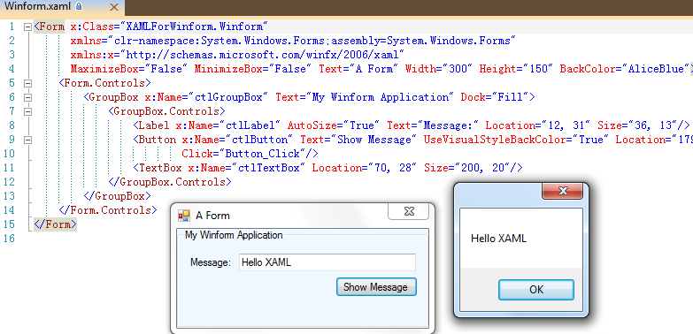

# Use XAML to design Winform Project GUI
## Requires
- Visual Studio 2010
## License
- Apache License, Version 2.0
## Technologies
- Windows Forms
- XAML
## Topics
- Windows Forms
- XAML
- Windows Forms Design
## Updated
- 09/12/2011
## Description

&nbsp;

Like the above screenshot, we can use XAML code to design the Winform Form, same as Silverlight Page&nbsp;and WPF Window.

Ok, this sample introduces how to use XAML code to design the Winform Forms.

We know, XAML code is used to map the CLR objects in the XML format code. So it can be used in all .Net projects to serialize the CLR objects, and deserialize the XAML to CLR objects. For WPF and Silverlight, Visual Studio IDE has the designer surppots them
 to show the content of the XAML real-time. But the XAML is not limited in designing the SL and WPF content. We can use it to design the Windows Forms project forms. Just deserialize the classes in the namespace
<a href="http://msdn.microsoft.com/en-us/library/system.windows.forms.aspx" target="_blank">
System.Windows.Forms</a>.

<h1>Steps:</h1>
<ul>
<li>Create an empty .Net solution, add the references to project:
<ul>
<li>PresentationCore </li><li>PresentationFramework </li><li>System.Windows.Forms </li><li>System.Xaml </li><li>System.Xml </li><li>WindowsBase </li></ul>
</li><li>Add an XAML file in the project, named &quot;Winform.xaml&quot;, a &quot;App.cs&quot; file and a &quot;Winform.cs&quot;. The first one is the Winform XAML code file, the second is the application class, and the last one is the partial class of the Winform class. Change the output type
 of the project properties&nbsp;to <strong>Windows Applciation.</strong> </li><li>Code your Application class as: </li></ul>

C#

Edit|Remove

csharp
<pre class="hidden">namespace XAMLForWinform
{
    static class App
    {
        [STAThread]
        static void Main()
        {
            Application.EnableVisualStyles();
            Application.SetCompatibleTextRenderingDefault(false);

            Winform form = new Winform();

            Application.Run(form);
        }
    }
}</pre>

<pre class="js">namespace&nbsp;XAMLForWinform&nbsp;
{&nbsp;
&nbsp;&nbsp;&nbsp;&nbsp;static&nbsp;class&nbsp;App&nbsp;
&nbsp;&nbsp;&nbsp;&nbsp;{&nbsp;
&nbsp;&nbsp;&nbsp;&nbsp;&nbsp;&nbsp;&nbsp;&nbsp;[STAThread]&nbsp;
&nbsp;&nbsp;&nbsp;&nbsp;&nbsp;&nbsp;&nbsp;&nbsp;static&nbsp;void&nbsp;Main()&nbsp;
&nbsp;&nbsp;&nbsp;&nbsp;&nbsp;&nbsp;&nbsp;&nbsp;{&nbsp;
&nbsp;&nbsp;&nbsp;&nbsp;&nbsp;&nbsp;&nbsp;&nbsp;&nbsp;&nbsp;&nbsp;&nbsp;Application.EnableVisualStyles();&nbsp;
&nbsp;&nbsp;&nbsp;&nbsp;&nbsp;&nbsp;&nbsp;&nbsp;&nbsp;&nbsp;&nbsp;&nbsp;Application.SetCompatibleTextRenderingDefault(false);&nbsp;
&nbsp;
&nbsp;&nbsp;&nbsp;&nbsp;&nbsp;&nbsp;&nbsp;&nbsp;&nbsp;&nbsp;&nbsp;&nbsp;Winform&nbsp;form&nbsp;=&nbsp;new&nbsp;Winform();&nbsp;
&nbsp;
&nbsp;&nbsp;&nbsp;&nbsp;&nbsp;&nbsp;&nbsp;&nbsp;&nbsp;&nbsp;&nbsp;&nbsp;Application.Run(form);&nbsp;
&nbsp;&nbsp;&nbsp;&nbsp;&nbsp;&nbsp;&nbsp;&nbsp;}&nbsp;
&nbsp;&nbsp;&nbsp;&nbsp;}&nbsp;
}</pre>

&nbsp;

<ul>
<li>Add the XML namespace mapping in the XAML file, map the System.Windows.Forms namespace into the XAML:
xmlns=&quot;clr-namespace:System.Windows.Forms;assembly=System.Windows.Forms&quot; design the Winform Form XAML as:
</li></ul>

XAML

Edit|Remove

xaml
<pre class="hidden">&lt;Form x:Class=&quot;XAMLForWinform.Winform&quot;
      xmlns=&quot;clr-namespace:System.Windows.Forms;assembly=System.Windows.Forms&quot;
      xmlns:x=&quot;http://schemas.microsoft.com/winfx/2006/xaml&quot;
      MaximizeBox=&quot;False&quot; MinimizeBox=&quot;False&quot; Text=&quot;A Form&quot; Width=&quot;300&quot; Height=&quot;150&quot; BackColor=&quot;AliceBlue&quot;&gt;
    &lt;Form.Controls&gt;
        &lt;GroupBox x:Name=&quot;ctlGroupBox&quot; Text=&quot;My Winform Application&quot; Dock=&quot;Fill&quot;&gt;
            &lt;GroupBox.Controls&gt;
                &lt;Label x:Name=&quot;ctlLabel&quot; AutoSize=&quot;True&quot; Text=&quot;Message:&quot; Location=&quot;12, 31&quot; Size=&quot;36, 13&quot;/&gt;
                &lt;Button x:Name=&quot;ctlButton&quot; Text=&quot;Show Message&quot; UseVisualStyleBackColor=&quot;True&quot; Location=&quot;179, 54&quot; Size=&quot;93, 23&quot;
                        Click=&quot;Button_Click&quot;/&gt;
                &lt;TextBox x:Name=&quot;ctlTextBox&quot; Location=&quot;70, 28&quot; Size=&quot;200, 20&quot;/&gt;
            &lt;/GroupBox.Controls&gt;
        &lt;/GroupBox&gt;
    &lt;/Form.Controls&gt;
&lt;/Form&gt;</pre>

<pre class="js">&lt;Form&nbsp;x:Class=&quot;XAMLForWinform.Winform&quot;&nbsp;
&nbsp;&nbsp;&nbsp;&nbsp;&nbsp;&nbsp;xmlns=&quot;clr-namespace:System.Windows.Forms;assembly=System.Windows.Forms&quot;&nbsp;
&nbsp;&nbsp;&nbsp;&nbsp;&nbsp;&nbsp;xmlns:x=&quot;http://schemas.microsoft.com/winfx/2006/xaml&quot;&nbsp;
&nbsp;&nbsp;&nbsp;&nbsp;&nbsp;&nbsp;MaximizeBox=&quot;False&quot;&nbsp;MinimizeBox=&quot;False&quot;&nbsp;Text=&quot;A&nbsp;Form&quot;&nbsp;Width=&quot;300&quot;&nbsp;Height=&quot;150&quot;&nbsp;BackColor=&quot;AliceBlue&quot;&gt;&nbsp;
&nbsp;&nbsp;&nbsp;&nbsp;&lt;Form.Controls&gt;&nbsp;
&nbsp;&nbsp;&nbsp;&nbsp;&nbsp;&nbsp;&nbsp;&nbsp;&lt;GroupBox&nbsp;x:Name=&quot;ctlGroupBox&quot;&nbsp;Text=&quot;My&nbsp;Winform&nbsp;Application&quot;&nbsp;Dock=&quot;Fill&quot;&gt;&nbsp;
&nbsp;&nbsp;&nbsp;&nbsp;&nbsp;&nbsp;&nbsp;&nbsp;&nbsp;&nbsp;&nbsp;&nbsp;&lt;GroupBox.Controls&gt;&nbsp;
&nbsp;&nbsp;&nbsp;&nbsp;&nbsp;&nbsp;&nbsp;&nbsp;&nbsp;&nbsp;&nbsp;&nbsp;&nbsp;&nbsp;&nbsp;&nbsp;&lt;Label&nbsp;x:Name=&quot;ctlLabel&quot;&nbsp;AutoSize=&quot;True&quot;&nbsp;Text=&quot;Message:&quot;&nbsp;Location=&quot;12,&nbsp;31&quot;&nbsp;Size=&quot;36,&nbsp;13&quot;/&gt;&nbsp;
&nbsp;&nbsp;&nbsp;&nbsp;&nbsp;&nbsp;&nbsp;&nbsp;&nbsp;&nbsp;&nbsp;&nbsp;&nbsp;&nbsp;&nbsp;&nbsp;&lt;Button&nbsp;x:Name=&quot;ctlButton&quot;&nbsp;Text=&quot;Show&nbsp;Message&quot;&nbsp;UseVisualStyleBackColor=&quot;True&quot;&nbsp;Location=&quot;179,&nbsp;54&quot;&nbsp;Size=&quot;93,&nbsp;23&quot;&nbsp;
&nbsp;&nbsp;&nbsp;&nbsp;&nbsp;&nbsp;&nbsp;&nbsp;&nbsp;&nbsp;&nbsp;&nbsp;&nbsp;&nbsp;&nbsp;&nbsp;&nbsp;&nbsp;&nbsp;&nbsp;&nbsp;&nbsp;&nbsp;&nbsp;Click=&quot;Button_Click&quot;/&gt;&nbsp;
&nbsp;&nbsp;&nbsp;&nbsp;&nbsp;&nbsp;&nbsp;&nbsp;&nbsp;&nbsp;&nbsp;&nbsp;&nbsp;&nbsp;&nbsp;&nbsp;&lt;TextBox&nbsp;x:Name=&quot;ctlTextBox&quot;&nbsp;Location=&quot;70,&nbsp;28&quot;&nbsp;Size=&quot;200,&nbsp;20&quot;/&gt;&nbsp;
&nbsp;&nbsp;&nbsp;&nbsp;&nbsp;&nbsp;&nbsp;&nbsp;&nbsp;&nbsp;&nbsp;&nbsp;&lt;/GroupBox.Controls&gt;&nbsp;
&nbsp;&nbsp;&nbsp;&nbsp;&nbsp;&nbsp;&nbsp;&nbsp;&lt;/GroupBox&gt;&nbsp;
&nbsp;&nbsp;&nbsp;&nbsp;&lt;/Form.Controls&gt;&nbsp;
&lt;/Form&gt;</pre>

We know, the x:Class was used to specified the&nbsp;behind&nbsp;class. And VS will generate the hide for this XAML and the&nbsp;behind class. Please check it in the &quot;obj/&quot; folder. Such as my sample, VS generate the &quot;obj\x86\Debug\Winform.g.cs&quot;

C#

Edit|Remove

csharp
<pre class="hidden">......
        [System.Diagnostics.DebuggerNonUserCodeAttribute()]
        public void InitializeComponent() {
            if (_contentLoaded) {
                return;
            }
            _contentLoaded = true;
            System.Uri resourceLocater = new System.Uri(&quot;/XAMLForWinform;component/winform.xaml&quot;, System.UriKind.Relative);
            
            #line 1 &quot;..\..\..\Winform.xaml&quot;
            System.Windows.Application.LoadComponent(this, resourceLocater);
            
            #line default
            #line hidden
        }
......</pre>

<pre class="js">......&nbsp;
&nbsp;&nbsp;&nbsp;&nbsp;&nbsp;&nbsp;&nbsp;&nbsp;[System.Diagnostics.DebuggerNonUserCodeAttribute()]&nbsp;
&nbsp;&nbsp;&nbsp;&nbsp;&nbsp;&nbsp;&nbsp;&nbsp;public&nbsp;void&nbsp;InitializeComponent()&nbsp;{&nbsp;
&nbsp;&nbsp;&nbsp;&nbsp;&nbsp;&nbsp;&nbsp;&nbsp;&nbsp;&nbsp;&nbsp;&nbsp;if&nbsp;(_contentLoaded)&nbsp;{&nbsp;
&nbsp;&nbsp;&nbsp;&nbsp;&nbsp;&nbsp;&nbsp;&nbsp;&nbsp;&nbsp;&nbsp;&nbsp;&nbsp;&nbsp;&nbsp;&nbsp;return;&nbsp;
&nbsp;&nbsp;&nbsp;&nbsp;&nbsp;&nbsp;&nbsp;&nbsp;&nbsp;&nbsp;&nbsp;&nbsp;}&nbsp;
&nbsp;&nbsp;&nbsp;&nbsp;&nbsp;&nbsp;&nbsp;&nbsp;&nbsp;&nbsp;&nbsp;&nbsp;_contentLoaded&nbsp;=&nbsp;true;&nbsp;
&nbsp;&nbsp;&nbsp;&nbsp;&nbsp;&nbsp;&nbsp;&nbsp;&nbsp;&nbsp;&nbsp;&nbsp;System.Uri&nbsp;resourceLocater&nbsp;=&nbsp;new&nbsp;System.Uri(&quot;/XAMLForWinform;component/winform.xaml&quot;,&nbsp;System.UriKind.Relative);&nbsp;
&nbsp;&nbsp;&nbsp;&nbsp;&nbsp;&nbsp;&nbsp;&nbsp;&nbsp;&nbsp;&nbsp;&nbsp;&nbsp;
&nbsp;&nbsp;&nbsp;&nbsp;&nbsp;&nbsp;&nbsp;&nbsp;&nbsp;&nbsp;&nbsp;&nbsp;#line&nbsp;1&nbsp;&quot;..\..\..\Winform.xaml&quot;&nbsp;
&nbsp;&nbsp;&nbsp;&nbsp;&nbsp;&nbsp;&nbsp;&nbsp;&nbsp;&nbsp;&nbsp;&nbsp;System.Windows.Application.LoadComponent(this,&nbsp;resourceLocater);&nbsp;
&nbsp;&nbsp;&nbsp;&nbsp;&nbsp;&nbsp;&nbsp;&nbsp;&nbsp;&nbsp;&nbsp;&nbsp;&nbsp;
&nbsp;&nbsp;&nbsp;&nbsp;&nbsp;&nbsp;&nbsp;&nbsp;&nbsp;&nbsp;&nbsp;&nbsp;#line&nbsp;default&nbsp;
&nbsp;&nbsp;&nbsp;&nbsp;&nbsp;&nbsp;&nbsp;&nbsp;&nbsp;&nbsp;&nbsp;&nbsp;#line&nbsp;hidden&nbsp;
&nbsp;&nbsp;&nbsp;&nbsp;&nbsp;&nbsp;&nbsp;&nbsp;}&nbsp;
......</pre>

&nbsp;

<ul>
<li>

&nbsp;You will find, we could specify the event handler in the XAML for Winform Controls&nbsp;also, and use the x:Name as the control name in XAML, same with it in the WPF/SL designer. So please add the event handler in the partial
 class:

</li></ul>

C#

Edit|Remove

csharp
<pre class="hidden">        private void Button_Click(object sender, EventArgs e)
        {
            MessageBox.Show(ctlTextBox.Text);
        }</pre>

<pre class="js">&nbsp;&nbsp;&nbsp;&nbsp;&nbsp;&nbsp;&nbsp;&nbsp;private&nbsp;void&nbsp;Button_Click(object&nbsp;sender,&nbsp;EventArgs&nbsp;e)&nbsp;
&nbsp;&nbsp;&nbsp;&nbsp;&nbsp;&nbsp;&nbsp;&nbsp;{&nbsp;
&nbsp;&nbsp;&nbsp;&nbsp;&nbsp;&nbsp;&nbsp;&nbsp;&nbsp;&nbsp;&nbsp;&nbsp;MessageBox.Show(ctlTextBox.Text);&nbsp;
&nbsp;&nbsp;&nbsp;&nbsp;&nbsp;&nbsp;&nbsp;&nbsp;}</pre>

&nbsp;

<h1 class="endscriptcode">Comment</h1>

XAML code for Winform project is not recommend, since VS does not implement its designer, and it is hard to control the position, size of the control in the form. Hope there is a good designer for this scenario in the future.

