# User Management And Authorization Using ASP.NET Core Identity
## Requires
- Visual Studio 2015
## License
- MIT
## Technologies
- ASP.NET Core
- Entity Framework Core 1.0
- ASP.NET Core MVC
- ASP.NET Core Identity API
## Topics
- Authentication
- Authorization
- User Account Management
- bulit-in/custom password/user info validation
## Updated
- 01/16/2017
## Description

<h1>Introduction</h1>

This sample shows how to create a user account administration tool, and perform authentication and authorization using ASP.NET Core Identity API.

<ol>
<li>Configure a web application for ASP.NET Identity API and EF Core
</li><li>Create a user database in the project folder AppData
</li><li>Seed the database to create a SuperAdmin account
</li><li>Validate passwords and other user info&nbsp; using built-in validation
</li><li>Implement custom password validation and custom user validation
</li><li>Create custom identity error messages for built-in validation
</li><li>Implement CRUD user accounts( Remember to validate password before hashing it)
</li><li>Authenticate users </li><li>Create, delete and manage roles </li><li>Authorize users with roles </li><li>Handle unauthorized situations </li><li>Apply custom user properties </li><li>Perform claim-based authorization through policies
</li><li>Implement custom policy requirements </li><li>Perform resource-based authorization through policies
</li></ol>

&nbsp;

<h1><strong>Prerequisites:</strong></h1>
<ol>
<li>Visual Studio 2015 Update 3 </li><li>.Net Core 1.0.1 </li><li>EF Core 1.1.0 </li></ol>
<h1>Running the Sample</h1>

Step 1: Create the database using NuGet Package Manager Console&nbsp;

Step 2: A SuperAdmin account is seeded the first time you run it. Log in as a SuperAdmin (Password: Secret0107$)

Note: please <strong>clear all the cookies</strong> of the browser before this step

<em>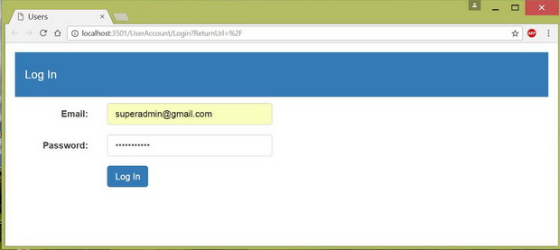</em>

Step 3: Go to Users and change the password since it is hardcoded: authorized by role

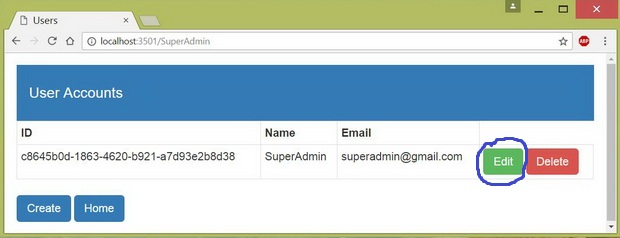

Step 4: Create users: authorized by role

Password validation messages pop up if the password is &ldquo;joe&rdquo;

User info validation messages pop up if the password is valid

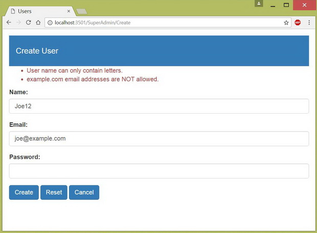

A valid user account is created.

Let&rsquo;s create more users.

Step 5: Create and assign roles: authorized by role

Go back to &ldquo;Home&rdquo; and go to &ldquo;Roles&rdquo;

Let&rsquo;s create two roles: Customers and Staff

<em>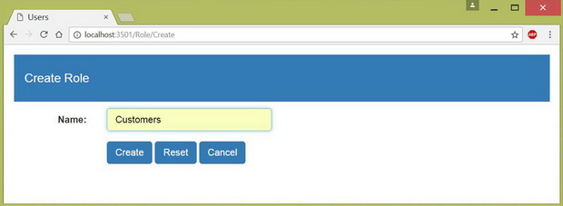</em>

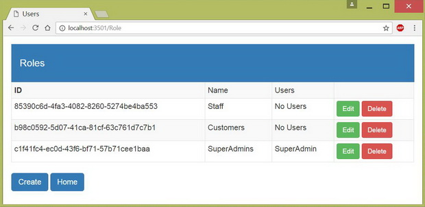

Assign roles

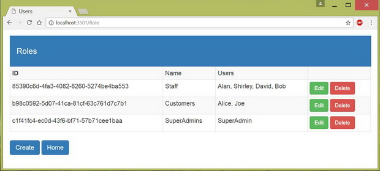

Step 6: This SuperAdmin account has access to &ldquo;Not in New Zealand&rdquo;: authorized by custom policy

Go back to &ldquo;Home&rdquo; and go to &ldquo;Claims&rdquo;. As we can see, SuperAdmin is not in New Zealand.

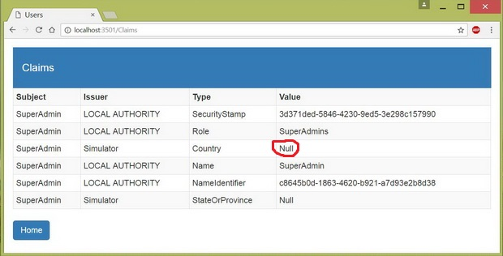

Step 7: Log out and log in as Joe

Step 8: Assign custom user properties

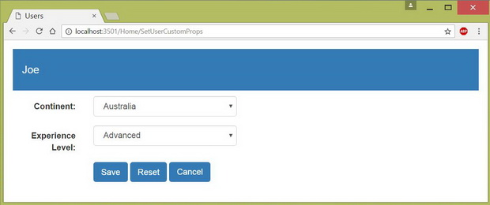

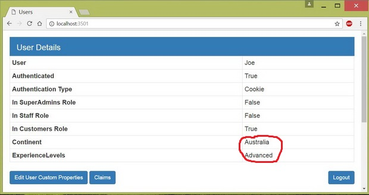

Step 9: Joe has access to &ldquo;NZL customers&rdquo;: authorized by role and claim

As you can see in the second image of step 8, Joe is in Customers role. According to the image below, he is in New Zealand.&nbsp;

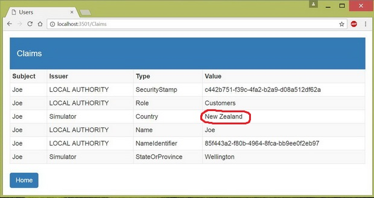

So he has access to &ldquo;NZL Customers&rdquo;

Step 10: Log out and log in as Bob

Step 11: Bob has access to &ldquo;Schedule&rdquo;, and can edit the schedule of Sales department: authorized by role and resource.

Bob is in Staff role. He is also the assistant of Sales department (hard-coded). So he has full access to the schedule of Sales department. But he cannot edit the schedule of Finance department.&nbsp;

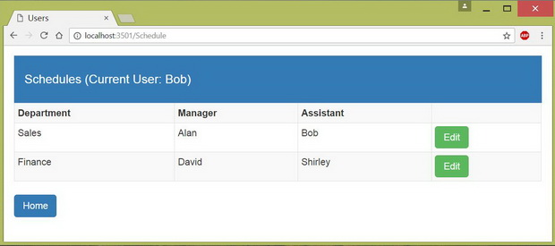

He can also access to &ldquo;Not in NZL&rdquo;.

Step 12: Try unauthorized cases

<em>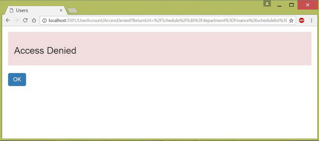 
</em>

&nbsp;

Sample Code

&nbsp;

C#

Edit|Remove

csharp
<pre class="hidden">namespace UserManagement.Controllers
{
    [Authorize]
    public class UserAccountController : Controller
    {
        private UserManager&lt;User&gt; userManager;
        private SignInManager&lt;User&gt; signInManager;

        public UserAccountController(UserManager&lt;User&gt; userMgr, SignInManager&lt;User&gt; signInMgr)
        {
            userManager = userMgr;
            signInManager = signInMgr;
        }

        [AllowAnonymous]
        public IActionResult Login(string returnUrl)
        {
            ViewBag.returnUrl = returnUrl;
            return View();
        }

        [HttpPost]
        [AllowAnonymous]
        [ValidateAntiForgeryToken]
        public async Task&lt;IActionResult&gt; Login(LoginVm login, string returnUrl)
        {
            if (ModelState.IsValid)
            {
                User user = await userManager.FindByEmailAsync(login.Email);

                if (user != null)
                {
                    // Cancel existing session
                    await signInManager.SignOutAsync();

                    // Perform the authentication
                    Microsoft.AspNetCore.Identity.SignInResult result = 
                        await signInManager.PasswordSignInAsync(user, login.Password, false, false);

                    if (result.Succeeded)
                    {
                        return Redirect(returnUrl ?? &quot;/&quot;);
                    }
                }
                else // user is null
                {
                    ModelState.AddModelError(nameof(LoginVm.Email), &quot;Invalid user or password&quot;);
                }
            }

            return View(login); // user is null or fail authentication (result.Succeeded = false)
        }

        [Authorize]
        public async Task&lt;IActionResult&gt; Logout()
        {
            await signInManager.SignOutAsync();

            return RedirectToAction(&quot;Index&quot;, &quot;Home&quot;);
        }

        [AllowAnonymous]
        public IActionResult AccessDenied()  // Fired when a user cannot access an action
        {
            return View();
        }
    }
}
</pre>

<pre class="csharp">namespace&nbsp;UserManagement.Controllers&nbsp;
{&nbsp;
&nbsp;&nbsp;&nbsp;&nbsp;[Authorize]&nbsp;
&nbsp;&nbsp;&nbsp;&nbsp;public&nbsp;class&nbsp;UserAccountController&nbsp;:&nbsp;Controller&nbsp;
&nbsp;&nbsp;&nbsp;&nbsp;{&nbsp;
&nbsp;&nbsp;&nbsp;&nbsp;&nbsp;&nbsp;&nbsp;&nbsp;private&nbsp;UserManager&lt;User&gt;&nbsp;userManager;&nbsp;
&nbsp;&nbsp;&nbsp;&nbsp;&nbsp;&nbsp;&nbsp;&nbsp;private&nbsp;SignInManager&lt;User&gt;&nbsp;signInManager;&nbsp;
&nbsp;
&nbsp;&nbsp;&nbsp;&nbsp;&nbsp;&nbsp;&nbsp;&nbsp;public&nbsp;UserAccountController(UserManager&lt;User&gt;&nbsp;userMgr,&nbsp;SignInManager&lt;User&gt;&nbsp;signInMgr)&nbsp;
&nbsp;&nbsp;&nbsp;&nbsp;&nbsp;&nbsp;&nbsp;&nbsp;{&nbsp;
&nbsp;&nbsp;&nbsp;&nbsp;&nbsp;&nbsp;&nbsp;&nbsp;&nbsp;&nbsp;&nbsp;&nbsp;userManager&nbsp;=&nbsp;userMgr;&nbsp;
&nbsp;&nbsp;&nbsp;&nbsp;&nbsp;&nbsp;&nbsp;&nbsp;&nbsp;&nbsp;&nbsp;&nbsp;signInManager&nbsp;=&nbsp;signInMgr;&nbsp;
&nbsp;&nbsp;&nbsp;&nbsp;&nbsp;&nbsp;&nbsp;&nbsp;}&nbsp;
&nbsp;
&nbsp;&nbsp;&nbsp;&nbsp;&nbsp;&nbsp;&nbsp;&nbsp;[AllowAnonymous]&nbsp;
&nbsp;&nbsp;&nbsp;&nbsp;&nbsp;&nbsp;&nbsp;&nbsp;public&nbsp;IActionResult&nbsp;Login(string&nbsp;returnUrl)&nbsp;
&nbsp;&nbsp;&nbsp;&nbsp;&nbsp;&nbsp;&nbsp;&nbsp;{&nbsp;
&nbsp;&nbsp;&nbsp;&nbsp;&nbsp;&nbsp;&nbsp;&nbsp;&nbsp;&nbsp;&nbsp;&nbsp;ViewBag.returnUrl&nbsp;=&nbsp;returnUrl;&nbsp;
&nbsp;&nbsp;&nbsp;&nbsp;&nbsp;&nbsp;&nbsp;&nbsp;&nbsp;&nbsp;&nbsp;&nbsp;return&nbsp;View();&nbsp;
&nbsp;&nbsp;&nbsp;&nbsp;&nbsp;&nbsp;&nbsp;&nbsp;}&nbsp;
&nbsp;
&nbsp;&nbsp;&nbsp;&nbsp;&nbsp;&nbsp;&nbsp;&nbsp;[HttpPost]&nbsp;
&nbsp;&nbsp;&nbsp;&nbsp;&nbsp;&nbsp;&nbsp;&nbsp;[AllowAnonymous]&nbsp;
&nbsp;&nbsp;&nbsp;&nbsp;&nbsp;&nbsp;&nbsp;&nbsp;[ValidateAntiForgeryToken]&nbsp;
&nbsp;&nbsp;&nbsp;&nbsp;&nbsp;&nbsp;&nbsp;&nbsp;public&nbsp;async&nbsp;Task&lt;IActionResult&gt;&nbsp;Login(LoginVm&nbsp;login,&nbsp;string&nbsp;returnUrl)&nbsp;
&nbsp;&nbsp;&nbsp;&nbsp;&nbsp;&nbsp;&nbsp;&nbsp;{&nbsp;
&nbsp;&nbsp;&nbsp;&nbsp;&nbsp;&nbsp;&nbsp;&nbsp;&nbsp;&nbsp;&nbsp;&nbsp;if&nbsp;(ModelState.IsValid)&nbsp;
&nbsp;&nbsp;&nbsp;&nbsp;&nbsp;&nbsp;&nbsp;&nbsp;&nbsp;&nbsp;&nbsp;&nbsp;{&nbsp;
&nbsp;&nbsp;&nbsp;&nbsp;&nbsp;&nbsp;&nbsp;&nbsp;&nbsp;&nbsp;&nbsp;&nbsp;&nbsp;&nbsp;&nbsp;&nbsp;User&nbsp;user&nbsp;=&nbsp;await&nbsp;userManager.FindByEmailAsync(login.Email);&nbsp;
&nbsp;
&nbsp;&nbsp;&nbsp;&nbsp;&nbsp;&nbsp;&nbsp;&nbsp;&nbsp;&nbsp;&nbsp;&nbsp;&nbsp;&nbsp;&nbsp;&nbsp;if&nbsp;(user&nbsp;!=&nbsp;null)&nbsp;
&nbsp;&nbsp;&nbsp;&nbsp;&nbsp;&nbsp;&nbsp;&nbsp;&nbsp;&nbsp;&nbsp;&nbsp;&nbsp;&nbsp;&nbsp;&nbsp;{&nbsp;
&nbsp;&nbsp;&nbsp;&nbsp;&nbsp;&nbsp;&nbsp;&nbsp;&nbsp;&nbsp;&nbsp;&nbsp;&nbsp;&nbsp;&nbsp;&nbsp;&nbsp;&nbsp;&nbsp;&nbsp;//&nbsp;Cancel&nbsp;existing&nbsp;session&nbsp;
&nbsp;&nbsp;&nbsp;&nbsp;&nbsp;&nbsp;&nbsp;&nbsp;&nbsp;&nbsp;&nbsp;&nbsp;&nbsp;&nbsp;&nbsp;&nbsp;&nbsp;&nbsp;&nbsp;&nbsp;await&nbsp;signInManager.SignOutAsync();&nbsp;
&nbsp;
&nbsp;&nbsp;&nbsp;&nbsp;&nbsp;&nbsp;&nbsp;&nbsp;&nbsp;&nbsp;&nbsp;&nbsp;&nbsp;&nbsp;&nbsp;&nbsp;&nbsp;&nbsp;&nbsp;&nbsp;//&nbsp;Perform&nbsp;the&nbsp;authentication&nbsp;
&nbsp;&nbsp;&nbsp;&nbsp;&nbsp;&nbsp;&nbsp;&nbsp;&nbsp;&nbsp;&nbsp;&nbsp;&nbsp;&nbsp;&nbsp;&nbsp;&nbsp;&nbsp;&nbsp;&nbsp;Microsoft.AspNetCore.Identity.SignInResult&nbsp;result&nbsp;=&nbsp;&nbsp;
&nbsp;&nbsp;&nbsp;&nbsp;&nbsp;&nbsp;&nbsp;&nbsp;&nbsp;&nbsp;&nbsp;&nbsp;&nbsp;&nbsp;&nbsp;&nbsp;&nbsp;&nbsp;&nbsp;&nbsp;&nbsp;&nbsp;&nbsp;&nbsp;await&nbsp;signInManager.PasswordSignInAsync(user,&nbsp;login.Password,&nbsp;false,&nbsp;false);&nbsp;
&nbsp;
&nbsp;&nbsp;&nbsp;&nbsp;&nbsp;&nbsp;&nbsp;&nbsp;&nbsp;&nbsp;&nbsp;&nbsp;&nbsp;&nbsp;&nbsp;&nbsp;&nbsp;&nbsp;&nbsp;&nbsp;if&nbsp;(result.Succeeded)&nbsp;
&nbsp;&nbsp;&nbsp;&nbsp;&nbsp;&nbsp;&nbsp;&nbsp;&nbsp;&nbsp;&nbsp;&nbsp;&nbsp;&nbsp;&nbsp;&nbsp;&nbsp;&nbsp;&nbsp;&nbsp;{&nbsp;
&nbsp;&nbsp;&nbsp;&nbsp;&nbsp;&nbsp;&nbsp;&nbsp;&nbsp;&nbsp;&nbsp;&nbsp;&nbsp;&nbsp;&nbsp;&nbsp;&nbsp;&nbsp;&nbsp;&nbsp;&nbsp;&nbsp;&nbsp;&nbsp;return&nbsp;Redirect(returnUrl&nbsp;??&nbsp;&quot;/&quot;);&nbsp;
&nbsp;&nbsp;&nbsp;&nbsp;&nbsp;&nbsp;&nbsp;&nbsp;&nbsp;&nbsp;&nbsp;&nbsp;&nbsp;&nbsp;&nbsp;&nbsp;&nbsp;&nbsp;&nbsp;&nbsp;}&nbsp;
&nbsp;&nbsp;&nbsp;&nbsp;&nbsp;&nbsp;&nbsp;&nbsp;&nbsp;&nbsp;&nbsp;&nbsp;&nbsp;&nbsp;&nbsp;&nbsp;}&nbsp;
&nbsp;&nbsp;&nbsp;&nbsp;&nbsp;&nbsp;&nbsp;&nbsp;&nbsp;&nbsp;&nbsp;&nbsp;&nbsp;&nbsp;&nbsp;&nbsp;else&nbsp;//&nbsp;user&nbsp;is&nbsp;null&nbsp;
&nbsp;&nbsp;&nbsp;&nbsp;&nbsp;&nbsp;&nbsp;&nbsp;&nbsp;&nbsp;&nbsp;&nbsp;&nbsp;&nbsp;&nbsp;&nbsp;{&nbsp;
&nbsp;&nbsp;&nbsp;&nbsp;&nbsp;&nbsp;&nbsp;&nbsp;&nbsp;&nbsp;&nbsp;&nbsp;&nbsp;&nbsp;&nbsp;&nbsp;&nbsp;&nbsp;&nbsp;&nbsp;ModelState.AddModelError(nameof(LoginVm.Email),&nbsp;&quot;Invalid&nbsp;user&nbsp;or&nbsp;password&quot;);&nbsp;
&nbsp;&nbsp;&nbsp;&nbsp;&nbsp;&nbsp;&nbsp;&nbsp;&nbsp;&nbsp;&nbsp;&nbsp;&nbsp;&nbsp;&nbsp;&nbsp;}&nbsp;
&nbsp;&nbsp;&nbsp;&nbsp;&nbsp;&nbsp;&nbsp;&nbsp;&nbsp;&nbsp;&nbsp;&nbsp;}&nbsp;
&nbsp;
&nbsp;&nbsp;&nbsp;&nbsp;&nbsp;&nbsp;&nbsp;&nbsp;&nbsp;&nbsp;&nbsp;&nbsp;return&nbsp;View(login);&nbsp;//&nbsp;user&nbsp;is&nbsp;null&nbsp;or&nbsp;fail&nbsp;authentication&nbsp;(result.Succeeded&nbsp;=&nbsp;false)&nbsp;
&nbsp;&nbsp;&nbsp;&nbsp;&nbsp;&nbsp;&nbsp;&nbsp;}&nbsp;
&nbsp;
&nbsp;&nbsp;&nbsp;&nbsp;&nbsp;&nbsp;&nbsp;&nbsp;[Authorize]&nbsp;
&nbsp;&nbsp;&nbsp;&nbsp;&nbsp;&nbsp;&nbsp;&nbsp;public&nbsp;async&nbsp;Task&lt;IActionResult&gt;&nbsp;Logout()&nbsp;
&nbsp;&nbsp;&nbsp;&nbsp;&nbsp;&nbsp;&nbsp;&nbsp;{&nbsp;
&nbsp;&nbsp;&nbsp;&nbsp;&nbsp;&nbsp;&nbsp;&nbsp;&nbsp;&nbsp;&nbsp;&nbsp;await&nbsp;signInManager.SignOutAsync();&nbsp;
&nbsp;
&nbsp;&nbsp;&nbsp;&nbsp;&nbsp;&nbsp;&nbsp;&nbsp;&nbsp;&nbsp;&nbsp;&nbsp;return&nbsp;RedirectToAction(&quot;Index&quot;,&nbsp;&quot;Home&quot;);&nbsp;
&nbsp;&nbsp;&nbsp;&nbsp;&nbsp;&nbsp;&nbsp;&nbsp;}&nbsp;
&nbsp;
&nbsp;&nbsp;&nbsp;&nbsp;&nbsp;&nbsp;&nbsp;&nbsp;[AllowAnonymous]&nbsp;
&nbsp;&nbsp;&nbsp;&nbsp;&nbsp;&nbsp;&nbsp;&nbsp;public&nbsp;IActionResult&nbsp;AccessDenied()&nbsp;&nbsp;//&nbsp;Fired&nbsp;when&nbsp;a&nbsp;user&nbsp;cannot&nbsp;access&nbsp;an&nbsp;action&nbsp;
&nbsp;&nbsp;&nbsp;&nbsp;&nbsp;&nbsp;&nbsp;&nbsp;{&nbsp;
&nbsp;&nbsp;&nbsp;&nbsp;&nbsp;&nbsp;&nbsp;&nbsp;&nbsp;&nbsp;&nbsp;&nbsp;return&nbsp;View();&nbsp;
&nbsp;&nbsp;&nbsp;&nbsp;&nbsp;&nbsp;&nbsp;&nbsp;}&nbsp;
&nbsp;&nbsp;&nbsp;&nbsp;}&nbsp;
}&nbsp;
</pre>

&nbsp;

