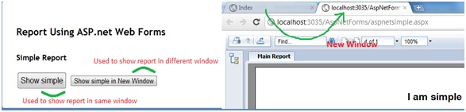

# Using Crystal Report in ASP.net MVC and creating generic report viewer
## Requires
- Visual Studio 2010
## License
- MS-LPL
## Technologies
- ASP.NET MVC 3
- Crystal Report
## Topics
- Using Crystal Report in ASP.net MVC
## Updated
- 01/17/2012
## Description

<h1>Introduction</h1>

<em>A sample VS 2010 project which will show how to use crystal report from ASP.net MVC project. This also shows how to create a generic/ common report viewer for showing crystal report. 
</em>

<h1>Prerequisite</h1>

<em>To build and run this sample, you must have Visual Studio 2010 SP1, ASP.net MVC 3 and Crystal Report 13.0.2000.0.</em>

Description

This project illustrates the following topics: 
1. Showing crystal report using ASP.net web forms in MVC. 
&nbsp;A. In same window 
&nbsp;B. In different window 
2. Showing crystal report from Controller/action (by generating PDF on fly). 
&nbsp;A. In same window 
&nbsp;B. In different window 
3. Creating Generic/Common report viewer 
&nbsp;A. Create Generic Report Viewer Form for showing crystal report through asp.net (*.aspx) page 
&nbsp; i. In same window 
&nbsp; ii. In different window 
&nbsp;B. Create Generic Report Controller class for showing crystal report by pdf on fly. 
&nbsp; i. In same window 
&nbsp;ii. In different window

 
Fig: Showing simple report from ASP.net MVC3 Project

Fig: Showing Crystal Report from ASP.net MVC Project with generic report viewer form

<h1>Source Code Files</h1>

&gt;CR_With_MVC : This is Solution 
&gt;AspNetForms : Here we putted aspx pages 
&gt;&gt;&nbsp;aspnetgeneric.aspx : This aspx page is used for showing simple report 
&gt;&gt;&nbsp;aspnetsimple.aspx : This aspx page is used for showing common report which consist of data 
&gt;Content : holds css file 
&gt;Controllers : holds controller classes 
&gt;&gt;FromMvcController.cs: This controller is used for showing report from MVC 
&gt;&gt;GenericReportViewerController.cs : This is generic/Common controller used fro showing report on pdf 
&gt;&gt;UsingWebFormController.cs : This is used for showing crystal report using aspx page 
&gt;Models : holds entity classes 
&gt;&gt;&nbsp;Student.cs 
&gt;Rpts: Holds Crystal Reports 
&gt;&gt;generic.rpt  
&gt;&gt;simple.rpt 
&gt;Scripts : Holds script files 
&gt;Views : Holds Views 
&gt;&gt;FromMvc 
&gt;&gt;&gt;&nbsp;Index.cshtml 
&gt;&gt;UsingWebForm 
&gt;&gt;&gt;Index.cshtml

<h1>More Information</h1>

<em>Please visit <a href="http://hasibulhaque.com/?p=244">http://hasibulhaque.com/?p=244</a>&nbsp;Here i have described all the steps.</em>

&nbsp;

<h1><em><em>&nbsp;</em></em>&nbsp;</h1>
