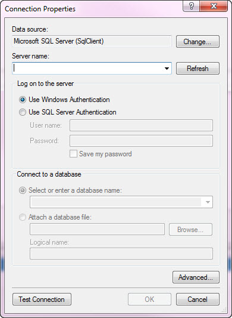
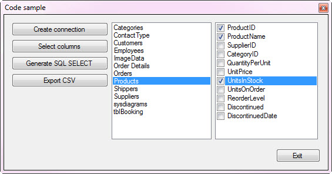
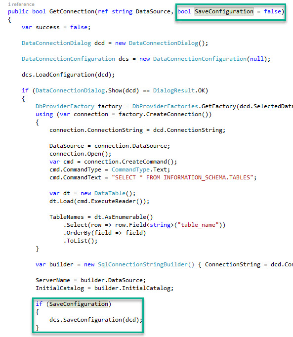

# Using Microsoft Visual Studio Connection Dialog at runtime
## Requires
- Visual Studio 2015
## License
- MIT
## Technologies
- C#
- SQL
- SQL Server
- Windows Forms
- Data Access
- Microsoft Visual Studio Connection Dialog
## Topics
- SQL Server
- Data Access
- Microsoft Visual Studio Connection Dialog
## Updated
- 03/12/2017
## Description

<h1>Description</h1>

In Visual Studio when a developer wants to create strong typed classes for database tables either for the conventional TableAdapter or Entity Framework there is a place in the process where a dialog is displayed as shown below.
 I will show you how to do this at runtime and a bit more.

&nbsp;

This code sample will show you the basics of using this dialog by working with the source code. In the next screenshot I have modified the source code so that any time SQL-Server data provider is used and it's my login I get
 a context menu item that allows me to auto fill the Server Name.

That is cool but we will now take advantage of this dialog so that (in this code sample) can create a SQL SELECT statement or create a CSV file for a table.

To&nbsp;demonstrate this I created a simple windows forms project with the following interface to select a server, select a table, select columns. After making these selections pressing &quot;Generate SQL SELECT&quot; you get the following
 in the second image below.

From Generate SQL SELECT (this logic can start you on other ideas with this simple example)

&nbsp;

Pressing &quot;Export CSV&quot; takes the SQL SELECT statement and passes it off to a process which uses
<a href="https://msdn.microsoft.com/en-us/library/ms162773.aspx?f=255&MSPPError=-2147217396">
SQLCMD.EXE</a>. My Exporter class takes information obtained from the Connection Dialog and selections done in the form to create a CSV file.

&nbsp;

C#

Edit|Remove

csharp

<pre class="js">using&nbsp;System;&nbsp;
using&nbsp;<a class="libraryLink" href="https://msdn.microsoft.com/en-US/library/System.Diagnostics.aspx" target="_blank" title="Auto generated link to System.Diagnostics">System.Diagnostics</a>;&nbsp;
using&nbsp;<a class="libraryLink" href="https://msdn.microsoft.com/en-US/library/System.Linq.aspx" target="_blank" title="Auto generated link to System.Linq">System.Linq</a>;&nbsp;
&nbsp;
namespace&nbsp;WindowsFormsApplication1_cs&nbsp;
{&nbsp;
&nbsp;&nbsp;&nbsp;&nbsp;public&nbsp;class&nbsp;Exporter&nbsp;
&nbsp;&nbsp;&nbsp;&nbsp;{&nbsp;
&nbsp;&nbsp;&nbsp;&nbsp;&nbsp;&nbsp;&nbsp;&nbsp;public&nbsp;void&nbsp;ToCsv(string&nbsp;ServerName,&nbsp;string&nbsp;DatabaseName,&nbsp;string&nbsp;SelectStatement,&nbsp;string&nbsp;FileName)&nbsp;
&nbsp;&nbsp;&nbsp;&nbsp;&nbsp;&nbsp;&nbsp;&nbsp;{&nbsp;
&nbsp;&nbsp;&nbsp;&nbsp;&nbsp;&nbsp;&nbsp;&nbsp;&nbsp;&nbsp;&nbsp;&nbsp;string&nbsp;DoubleQuote&nbsp;=&nbsp;((char)(34)).ToString();&nbsp;
&nbsp;&nbsp;&nbsp;&nbsp;&nbsp;&nbsp;&nbsp;&nbsp;&nbsp;&nbsp;&nbsp;&nbsp;string&nbsp;QueryToExceute&nbsp;=&nbsp;DoubleQuote&nbsp;&#43;&nbsp;SelectStatement&nbsp;&#43;&nbsp;DoubleQuote;&nbsp;
&nbsp;&nbsp;&nbsp;&nbsp;&nbsp;&nbsp;&nbsp;&nbsp;&nbsp;&nbsp;&nbsp;&nbsp;string&nbsp;ExportFileName&nbsp;=&nbsp;DoubleQuote&nbsp;&#43;&nbsp;FileName&nbsp;&#43;&nbsp;DoubleQuote;&nbsp;
&nbsp;
&nbsp;&nbsp;&nbsp;&nbsp;&nbsp;&nbsp;&nbsp;&nbsp;&nbsp;&nbsp;&nbsp;&nbsp;var&nbsp;Process&nbsp;=&nbsp;new&nbsp;Process();&nbsp;
&nbsp;&nbsp;&nbsp;&nbsp;&nbsp;&nbsp;&nbsp;&nbsp;&nbsp;&nbsp;&nbsp;&nbsp;&nbsp;
&nbsp;&nbsp;&nbsp;&nbsp;&nbsp;&nbsp;&nbsp;&nbsp;&nbsp;&nbsp;&nbsp;&nbsp;Process.StartInfo.UseShellExecute&nbsp;=&nbsp;false;&nbsp;
&nbsp;&nbsp;&nbsp;&nbsp;&nbsp;&nbsp;&nbsp;&nbsp;&nbsp;&nbsp;&nbsp;&nbsp;Process.StartInfo.RedirectStandardOutput&nbsp;=&nbsp;true;&nbsp;
&nbsp;&nbsp;&nbsp;&nbsp;&nbsp;&nbsp;&nbsp;&nbsp;&nbsp;&nbsp;&nbsp;&nbsp;Process.StartInfo.RedirectStandardError&nbsp;=&nbsp;true;&nbsp;
&nbsp;&nbsp;&nbsp;&nbsp;&nbsp;&nbsp;&nbsp;&nbsp;&nbsp;&nbsp;&nbsp;&nbsp;Process.StartInfo.CreateNoWindow&nbsp;=&nbsp;true;&nbsp;
&nbsp;&nbsp;&nbsp;&nbsp;&nbsp;&nbsp;&nbsp;&nbsp;&nbsp;&nbsp;&nbsp;&nbsp;Process.StartInfo.FileName&nbsp;=&nbsp;&quot;SQLCMD.EXE&quot;;&nbsp;
&nbsp;&nbsp;&nbsp;&nbsp;&nbsp;&nbsp;&nbsp;&nbsp;&nbsp;&nbsp;&nbsp;&nbsp;Process.StartInfo.Arguments&nbsp;=&nbsp;&quot;-S&nbsp;&quot;&nbsp;&#43;&nbsp;ServerName&nbsp;&#43;&nbsp;&quot;&nbsp;-d&nbsp;&quot;&nbsp;&#43;&nbsp;DatabaseName&nbsp;&#43;&nbsp;&quot;&nbsp;-E&nbsp;-Q&nbsp;&quot;&nbsp;&#43;&nbsp;&nbsp;
&nbsp;&nbsp;&nbsp;&nbsp;&nbsp;&nbsp;&nbsp;&nbsp;&nbsp;&nbsp;&nbsp;&nbsp;&nbsp;&nbsp;&nbsp;&nbsp;QueryToExceute&nbsp;&#43;&nbsp;&quot;&nbsp;-o&nbsp;&quot;&nbsp;&#43;&nbsp;ExportFileName&nbsp;&#43;&nbsp;&quot;&nbsp;&nbsp;-h-1&nbsp;-s\&quot;,\&quot;&nbsp;-w&nbsp;700&quot;;&nbsp;
&nbsp;&nbsp;&nbsp;&nbsp;&nbsp;&nbsp;&nbsp;&nbsp;&nbsp;&nbsp;&nbsp;&nbsp;Console.WriteLine($&quot;SQLCMD.EXE&nbsp;{Process.StartInfo.Arguments}&quot;);&nbsp;
&nbsp;&nbsp;&nbsp;&nbsp;&nbsp;&nbsp;&nbsp;&nbsp;&nbsp;&nbsp;&nbsp;&nbsp;Process.Start();&nbsp;
&nbsp;&nbsp;&nbsp;&nbsp;&nbsp;&nbsp;&nbsp;&nbsp;&nbsp;&nbsp;&nbsp;&nbsp;Process.WaitForExit();&nbsp;
&nbsp;
&nbsp;&nbsp;&nbsp;&nbsp;&nbsp;&nbsp;&nbsp;&nbsp;&nbsp;&nbsp;&nbsp;&nbsp;if&nbsp;(<a class="libraryLink" href="https://msdn.microsoft.com/en-US/library/System.IO.File.Exists.aspx" target="_blank" title="Auto generated link to System.IO.File.Exists">System.IO.File.Exists</a>(FileName))&nbsp;
&nbsp;&nbsp;&nbsp;&nbsp;&nbsp;&nbsp;&nbsp;&nbsp;&nbsp;&nbsp;&nbsp;&nbsp;{&nbsp;
&nbsp;&nbsp;&nbsp;&nbsp;&nbsp;&nbsp;&nbsp;&nbsp;&nbsp;&nbsp;&nbsp;&nbsp;&nbsp;&nbsp;&nbsp;&nbsp;var&nbsp;contents&nbsp;=&nbsp;<a class="libraryLink" href="https://msdn.microsoft.com/en-US/library/System.IO.File.ReadAllLines.aspx" target="_blank" title="Auto generated link to System.IO.File.ReadAllLines">System.IO.File.ReadAllLines</a>(FileName)&nbsp;
&nbsp;&nbsp;&nbsp;&nbsp;&nbsp;&nbsp;&nbsp;&nbsp;&nbsp;&nbsp;&nbsp;&nbsp;&nbsp;&nbsp;&nbsp;&nbsp;&nbsp;&nbsp;&nbsp;&nbsp;.Where(line&nbsp;=&gt;&nbsp;!line.ToLower().Contains(&quot;rows&nbsp;affected&quot;)&nbsp;&amp;&amp;&nbsp;!string.IsNullOrWhiteSpace(line)).ToArray();&nbsp;
&nbsp;&nbsp;&nbsp;&nbsp;&nbsp;&nbsp;&nbsp;&nbsp;&nbsp;&nbsp;&nbsp;&nbsp;&nbsp;&nbsp;&nbsp;&nbsp;<a class="libraryLink" href="https://msdn.microsoft.com/en-US/library/System.IO.File.WriteAllLines.aspx" target="_blank" title="Auto generated link to System.IO.File.WriteAllLines">System.IO.File.WriteAllLines</a>(FileName,&nbsp;contents);&nbsp;
&nbsp;&nbsp;&nbsp;&nbsp;&nbsp;&nbsp;&nbsp;&nbsp;&nbsp;&nbsp;&nbsp;&nbsp;}&nbsp;
&nbsp;&nbsp;&nbsp;&nbsp;&nbsp;&nbsp;&nbsp;&nbsp;}&nbsp;
&nbsp;&nbsp;&nbsp;&nbsp;}&nbsp;
}&nbsp;
</pre>

The command for SQLCMD in this case is

SQLCMD.EXE -S KARENS-PC -d NorthWindAzure -E -Q &quot;SELECT [ProductID],[ProductName],[UnitsInStock] FROM Products&quot; -o &quot;C:\Data\test.csv&quot; &nbsp;-h-1 -s&quot;,&quot; -w 700

Partial contents of the file generate

<h1 class="endscriptcode">How to use in your project</h1>

Looking at the Visual Studio solution, the highlighted in yellow get compiled. Unload the projects in grey.

Open your Visual Studio solution, add a reference to the DLL created in the solution above and now you can use them.

The project WindowsFormsApplication1_cs shows how to use the dialog and also how to do exporting.

<h1 class="endscriptcode">IMPORTANT</h1>

Things to watch out for concerning
<a href="https://msdn.microsoft.com/en-us/library/ms162773.aspx?f=255&MSPPError=-2147217396">
SQLCMD.EXE</a>, if you attempt to create a export file and get error messages the common reason is that there is an authenication issue which you need to figure out the login and security which is outside the scope of this code sample.

Note in Operations class, GetConnection that the optional parameter SaveConfiguration is false, setting it to true will create a xml file names DataConnections.xml which save the last data provider
 used and will be the default each time until you change it.

The two things the connection dialog is good for is when writing code in development and also for when a user at runtime needs to select an alternate server. Needless to say there are many possibilities
 here.

<h1 class="endscriptcode">Copyrights</h1>

As I did not create the classes for the Connection Dialog they are copyrighted to Microsoft as each class has a copyright notice within.

