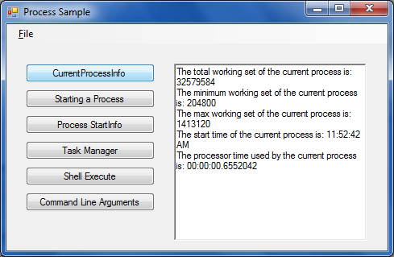

# Using the .NET Process Class
## Requires
- Visual Studio 2010
## License
- Custom
## Technologies
- Windows Forms
- .NET Framework 4.0
## Topics
- Command Line Arguments
- Generics
- Process Events
- Modules
- StringBuilder
## Updated
- 06/07/2011
## Description

<h1>Introduction</h1>

The Process class is used to perform a variety of tasks such as commandline processing and listing information about currently running processes.

<h1>Building the Sample</h1>

Press F5

<h1>Description</h1>

The Process class is used to perform the following tasks:

<ul>
<li>

Run an application with and without command-line arguments by using the Start method.

</li><li>

List all the running applications by using the GetProcesses method.

</li><li>

List the loaded modules by using the Modules property.

</li><li>

Retrieve information about the running application by using the GetCurrentProcess method.

</li></ul>

The sample also demonstrates some programming techniques with the StringBuilder and generic List&lt;(Of
&lt;(T&gt;)&gt;) classes.

<h1>Screenshot</h1>

<h1>Sample Code<em></em></h1>

Visual Basic

Edit|Remove

vb
<pre class="hidden">    Private Sub CurrentProcessInfo_Click(ByVal sender As System.Object, ByVal e As System.EventArgs) Handles btnCurrentProcessInfo.Click
        ' Shows how to retrieve information about the current Process.
        Dim curProc As Process = Process.GetCurrentProcess()

        Dim description As String = &quot;The total working set of the current process is: &quot; &#43; _
                curProc.WorkingSet64.ToString() &#43; vbCrLf

        description &#43;= &quot;The minimum working set of the current process is: &quot; &#43; _
                curProc.MinWorkingSet.ToString() &#43; vbCrLf

        description &#43;= &quot;The max working set of the current process is: &quot; &#43; _
                curProc.MaxWorkingSet.ToString() &#43; vbCrLf

        description &#43;= &quot;The start time of the current process is: &quot; &#43; _
                curProc.StartTime.ToLongTimeString() &#43; vbCrLf

        description &#43;= &quot;The processor time used by the current process is: &quot; &#43; _
        curProc.TotalProcessorTime.ToString() &#43; vbCrLf

        DisplayText.Text = description
    End Sub</pre>

<pre id="codePreview" class="vb">&nbsp;&nbsp;&nbsp;&nbsp;Private&nbsp;Sub&nbsp;CurrentProcessInfo_Click(ByVal&nbsp;sender&nbsp;As&nbsp;System.Object,&nbsp;ByVal&nbsp;e&nbsp;As&nbsp;System.EventArgs)&nbsp;Handles&nbsp;btnCurrentProcessInfo.Click&nbsp;
&nbsp;&nbsp;&nbsp;&nbsp;&nbsp;&nbsp;&nbsp;&nbsp;'&nbsp;Shows&nbsp;how&nbsp;to&nbsp;retrieve&nbsp;information&nbsp;about&nbsp;the&nbsp;current&nbsp;Process.&nbsp;
&nbsp;&nbsp;&nbsp;&nbsp;&nbsp;&nbsp;&nbsp;&nbsp;Dim&nbsp;curProc&nbsp;As&nbsp;Process&nbsp;=&nbsp;Process.GetCurrentProcess()&nbsp;
&nbsp;
&nbsp;&nbsp;&nbsp;&nbsp;&nbsp;&nbsp;&nbsp;&nbsp;Dim&nbsp;description&nbsp;As&nbsp;String&nbsp;=&nbsp;&quot;The&nbsp;total&nbsp;working&nbsp;set&nbsp;of&nbsp;the&nbsp;current&nbsp;process&nbsp;is:&nbsp;&quot;&nbsp;&#43;&nbsp;_&nbsp;
&nbsp;&nbsp;&nbsp;&nbsp;&nbsp;&nbsp;&nbsp;&nbsp;&nbsp;&nbsp;&nbsp;&nbsp;&nbsp;&nbsp;&nbsp;&nbsp;curProc.WorkingSet64.ToString()&nbsp;&#43;&nbsp;vbCrLf&nbsp;
&nbsp;
&nbsp;&nbsp;&nbsp;&nbsp;&nbsp;&nbsp;&nbsp;&nbsp;description&nbsp;&#43;=&nbsp;&quot;The&nbsp;minimum&nbsp;working&nbsp;set&nbsp;of&nbsp;the&nbsp;current&nbsp;process&nbsp;is:&nbsp;&quot;&nbsp;&#43;&nbsp;_&nbsp;
&nbsp;&nbsp;&nbsp;&nbsp;&nbsp;&nbsp;&nbsp;&nbsp;&nbsp;&nbsp;&nbsp;&nbsp;&nbsp;&nbsp;&nbsp;&nbsp;curProc.MinWorkingSet.ToString()&nbsp;&#43;&nbsp;vbCrLf&nbsp;
&nbsp;
&nbsp;&nbsp;&nbsp;&nbsp;&nbsp;&nbsp;&nbsp;&nbsp;description&nbsp;&#43;=&nbsp;&quot;The&nbsp;max&nbsp;working&nbsp;set&nbsp;of&nbsp;the&nbsp;current&nbsp;process&nbsp;is:&nbsp;&quot;&nbsp;&#43;&nbsp;_&nbsp;
&nbsp;&nbsp;&nbsp;&nbsp;&nbsp;&nbsp;&nbsp;&nbsp;&nbsp;&nbsp;&nbsp;&nbsp;&nbsp;&nbsp;&nbsp;&nbsp;curProc.MaxWorkingSet.ToString()&nbsp;&#43;&nbsp;vbCrLf&nbsp;
&nbsp;
&nbsp;&nbsp;&nbsp;&nbsp;&nbsp;&nbsp;&nbsp;&nbsp;description&nbsp;&#43;=&nbsp;&quot;The&nbsp;start&nbsp;time&nbsp;of&nbsp;the&nbsp;current&nbsp;process&nbsp;is:&nbsp;&quot;&nbsp;&#43;&nbsp;_&nbsp;
&nbsp;&nbsp;&nbsp;&nbsp;&nbsp;&nbsp;&nbsp;&nbsp;&nbsp;&nbsp;&nbsp;&nbsp;&nbsp;&nbsp;&nbsp;&nbsp;curProc.StartTime.ToLongTimeString()&nbsp;&#43;&nbsp;vbCrLf&nbsp;
&nbsp;
&nbsp;&nbsp;&nbsp;&nbsp;&nbsp;&nbsp;&nbsp;&nbsp;description&nbsp;&#43;=&nbsp;&quot;The&nbsp;processor&nbsp;time&nbsp;used&nbsp;by&nbsp;the&nbsp;current&nbsp;process&nbsp;is:&nbsp;&quot;&nbsp;&#43;&nbsp;_&nbsp;
&nbsp;&nbsp;&nbsp;&nbsp;&nbsp;&nbsp;&nbsp;&nbsp;curProc.TotalProcessorTime.ToString()&nbsp;&#43;&nbsp;vbCrLf&nbsp;
&nbsp;
&nbsp;&nbsp;&nbsp;&nbsp;&nbsp;&nbsp;&nbsp;&nbsp;DisplayText.Text&nbsp;=&nbsp;description&nbsp;
&nbsp;&nbsp;&nbsp;&nbsp;End&nbsp;Sub</pre>

<h1>Source Code Files</h1>
<ul>
<li><a class="browseFile" href="sourcecode?fileId=23125&pathId=1853820986">MainForm.Designer.vb</a>
</li><li><a class="browseFile" href="sourcecode?fileId=23125&pathId=520100027">MainForm.vb</a>
</li><li><a class="browseFile" href="sourcecode?fileId=23125&pathId=734643353">ModulesDisplay.Designer.vb</a>
</li><li><a class="browseFile" href="sourcecode?fileId=23125&pathId=1060836758">ModulesDisplay.vb</a>
</li><li><a class="browseFile" href="sourcecode?fileId=23125&pathId=1770018561">TaskManager.Designer.vb</a>
</li><li><a class="browseFile" href="sourcecode?fileId=23125&pathId=397761980">TaskManager.vb</a>
</li></ul>
<h1>More Information</h1>

For more information on the Process Class: <a href="http://msdn.microsoft.com/en-us/library/system.diagnostics.process.aspx" target="_blank">
http://msdn.microsoft.com/en-us/library/system.diagnostics.process.aspx</a>

