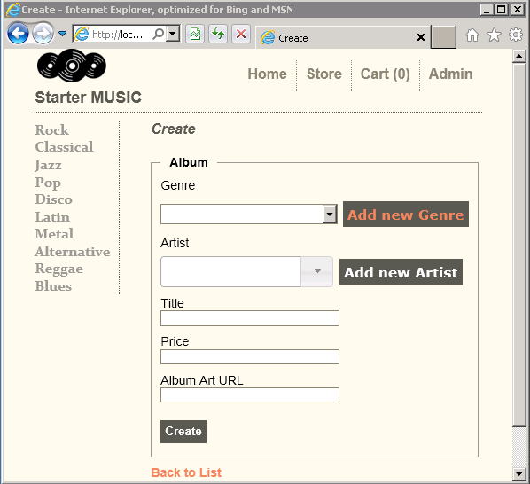

# Using the DropDownList and ListBox with ASP.NET MVC
## Requires
- Visual Studio 2010
## License
- Apache License, Version 2.0
## Technologies
- ASP.NET MVC
- ASP.NET MVC 3
- ASP.NET MVC 4
## Topics
- ASP.NET MVC
## Updated
- 01/27/2012
## Description

<h1>Intro to the DropDownList helper</h1>

This tutorial will teach you the basics of working with <a href="http://msdn.microsoft.com/en-us/library/dd492948.aspx">
DropDownList </a>&nbsp;and <a href="http://msdn.microsoft.com/en-us/library/system.web.mvc.html.selectextensions.listbox.aspx">
ListBox </a>helper in a ASP.NET MVC Web application. The complete tutorial can be found
<a href="http://www.asp.net/mvc/tutorials/javascript/working-with-the-dropdownlist-box-and-jquery/using-the-dropdownlist-helper-with-aspnet-mvc" target="_blank">
here</a>.

<h1>What You'll Build</h1>

You'll create action methods and views that use the <a href="http://msdn.microsoft.com/en-us/library/system.web.mvc.html.selectextensions.dropdownlist.aspx">
DropDownList</a> helper to select a category. You will also use <strong>jQuery</strong> to add an insert category dialog that can be used when the a new category (such as genre or artist) is needed. Below is a screenshot of the Create view showing links to
 add a new genre and add a new artist.&nbsp;&nbsp;

&nbsp;

Press CTRL&#43;F5 to run the application and click the <strong>Test</strong> link, which takes you to the
<code>Test </code>view of the Home controller.&nbsp;

Select the <strong>Select Movie Category (Simple)</strong> link.&nbsp; A Movie Type Select list is diplayed, with Comedy the selected value.

Right click in the browser and select view source. The HTML for the page is displayed. The code below shows the HTML for the select element.

<pre>&lt;form action=&quot;/Home/CategoryChosen&quot; method=&quot;get&quot;&gt;
	&lt;fieldset&gt;Movie Type &lt;select id=&quot;MovieType&quot; name=&quot;MovieType&quot;&gt;
	&lt;option value=&quot;&quot;&gt;&lt;/option&gt;
	&lt;option value=&quot;0&quot;&gt;Action&lt;/option&gt;
	&lt;option value=&quot;1&quot;&gt;Drama&lt;/option&gt;
	&lt;option selected=&quot;selected&quot; value=&quot;2&quot;&gt;Comedy&lt;/option&gt;
	&lt;option value=&quot;3&quot;&gt;Science Fiction&lt;/option&gt;
	&lt;/select&gt;
	&lt;p&gt;&lt;input type=&quot;submit&quot; value=&quot;Submit&quot; /&gt; &lt;/p&gt;
	&lt;/fieldset&gt;
&lt;/form&gt;</pre>

You can see that each item in the select list has a value (0 for Action, 1  
for Drama, 2 for Comedy and 3 for Science Fiction) and a display name (Action,  
Drama, Comedy and Science Fiction). The code above is standard HTML for a select  
list. 
Change the select list to Drama and hit the <strong>Submit</strong> button.&nbsp; The URL in
 
the browser is http://localhost:2468/Home/CategoryChosen?MovieType=1&nbsp; and  
the page displays You Selected: 1.

 

&nbsp;

<h1>More Information</h1>

<em>For more information on using the DropDownList, see </em>

