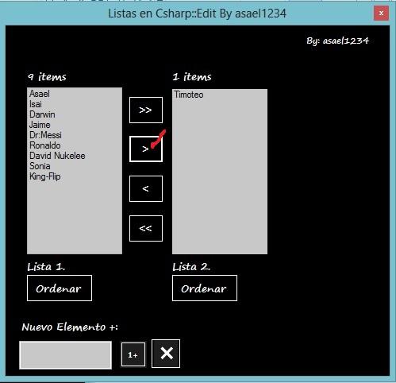
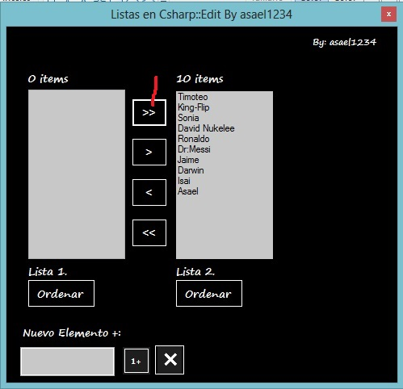

# Uso de 2 ListBox en C#
## Requires
- Visual Studio 2012
## License
- Apache License, Version 2.0
## Technologies
- C#
- C# Language
- ListBoxes
## Topics
- Controls
- Sorting
- Language Samples
- list data
## Updated
- 08/28/2014
## Description

<h1>Introduction</h1>

<em>Esta vez les muestro uno de los cientos de uso que se pueden hacer con la herramienta de Visual studio &quot;ListBox&quot;</em>

Description

<em>En este ejemplo se muestra:</em>

<em>Como Agregar un Items a un listBox.</em>

<em>Como Agragar un Items de un ListBox a otro ListBox.</em>

<em>Como Ordenar Los items de un ListBox.</em>

<em>Como eliminar un items de ListBox.</em>

<strong>Para llenar un listbox este seria una forma.</strong>

*******************************

ListaIzq.Items.Add(&quot;Asael&quot;);&nbsp; &nbsp; &nbsp; &nbsp; &nbsp; &nbsp;

ListaIzq.Items.Add(&quot;Isai&quot;);&nbsp; &nbsp; &nbsp; &nbsp; &nbsp; &nbsp;

ListaIzq.Items.Add(&quot;Darwin&quot;);&nbsp; &nbsp; &nbsp; &nbsp; &nbsp; &nbsp;

ListaIzq.Items.Add(&quot;Jaime&quot;);&nbsp; &nbsp; &nbsp; &nbsp; &nbsp; &nbsp;

ListaIzq.Items.Add(&quot;Timoteo&quot;);&nbsp; &nbsp; &nbsp; &nbsp; &nbsp; &nbsp;

ListaIzq.Items.Add(&quot;Dr:Messi&quot;);&nbsp; &nbsp; &nbsp; &nbsp; &nbsp; &nbsp;

ListaIzq.Items.Add(&quot;Ronaldo&quot;);&nbsp; &nbsp; &nbsp; &nbsp; &nbsp; &nbsp;

ListaIzq.Items.Add(&quot;David Nukelee&quot;);&nbsp; &nbsp; &nbsp; &nbsp; &nbsp; &nbsp;

ListaIzq.Items.Add(&quot;Sonia&quot;);&nbsp; &nbsp; &nbsp; &nbsp; &nbsp; &nbsp;

ListaIzq.Items.Add(&quot;King-Flip&quot;);

*******************************

Este ListBox cuenta con 10 items.

<strong>Para agregar un items en modo ejecusion.</strong>

<strong>&nbsp;if (txtNuevoElem.Text.Trim().Length != 0)//Si nos es vacio guerda&nbsp; &nbsp; &nbsp; &nbsp; &nbsp; &nbsp;
</strong>

<strong>{&nbsp; &nbsp; &nbsp; &nbsp; &nbsp; &nbsp; &nbsp; &nbsp;</strong>

<strong>ListaIzq.Items.Add(txtNuevoElem.Text.Trim());//Agrega el contenido del textbox a la lista izquirda&nbsp; &nbsp; &nbsp; &nbsp; &nbsp; &nbsp; &nbsp; &nbsp; txtNuevoElem.Clear();//Limpia el textbox&nbsp; &nbsp; &nbsp; &nbsp;
 &nbsp; &nbsp; &nbsp; &nbsp;</strong>

<strong>txtNuevoElem.Focus();//Posiciona el cusrsor en el textbox :xd...&nbsp; &nbsp; &nbsp; &nbsp; &nbsp; &nbsp; &nbsp; &nbsp;</strong>

<strong>itemsIzq();//Actuliza los items contados 
&nbsp; &nbsp; &nbsp; &nbsp; &nbsp; &nbsp; </strong>

<strong>}&nbsp; &nbsp; &nbsp; &nbsp; &nbsp; &nbsp;
</strong>

<strong>else&nbsp; &nbsp; &nbsp; &nbsp; &nbsp; &nbsp;</strong>

<strong>{&nbsp; &nbsp; &nbsp; &nbsp; &nbsp; &nbsp; &nbsp; &nbsp;
</strong>

<strong>MessageBox.Show(&quot;Debe Ingresar algo...Xd&quot;,&quot;Aviso!&quot;);//Te mostrara este mensaje si no digitastes nada en el textbox,,,&nbsp; &nbsp; &nbsp; &nbsp; &nbsp; &nbsp; &nbsp; &nbsp;</strong>

<strong>txtNuevoElem.Focus();//Posiciona el cusrsor en el textbox :xd...&nbsp; &nbsp; &nbsp; &nbsp; &nbsp; &nbsp;
</strong>

<strong>}</strong>

&nbsp;

<strong>**********************************************************</strong>

<strong>Mas ADELANTE TODO EL CODIGO</strong>

&nbsp;

<em> 
</em>

<em>&nbsp;</em>

&nbsp;

C#

Editar script|Remove

csharp
<pre class="hidden">ng System;
using System.Collections.Generic;
using System.ComponentModel;
using System.Data;
using System.Drawing;
using System.Linq;
using System.Text;
using System.Threading.Tasks;
using System.Windows.Forms;

namespace Listas_En_Csharp
{
    public partial class FormularioPrincipal : Form
    {
        public FormularioPrincipal()
        {
            InitializeComponent();
        }

        private void Form1_Load(object sender, EventArgs e)
        {
            ListaIzq.Items.Add(&quot;Asael&quot;);
            ListaIzq.Items.Add(&quot;Isai&quot;);
            ListaIzq.Items.Add(&quot;Darwin&quot;);
            ListaIzq.Items.Add(&quot;Jaime&quot;);
            ListaIzq.Items.Add(&quot;Timoteo&quot;);
            ListaIzq.Items.Add(&quot;Dr:Messi&quot;);
            ListaIzq.Items.Add(&quot;Ronaldo&quot;);
            ListaIzq.Items.Add(&quot;David Nukelee&quot;);
            ListaIzq.Items.Add(&quot;Sonia&quot;);
            ListaIzq.Items.Add(&quot;King-Flip&quot;);
            itemsIzq();
            itemsDer();
        }
        private void itemsIzq()//Contamos los items de la lista isq
        {
            lblitemsIzq.Text = ListaIzq.Items.Count.ToString()&#43;&quot; items&quot;;
        }
        private void itemsDer()//Contamos los items de la lista Der
        {
            lblitemsDer.Text = ListaDer.Items.Count.ToString() &#43; &quot; items&quot;;
            
        }

        private void botonAgregar_Click(object sender, EventArgs e)
        {
            //A;adimos un nuevo elemento a la lista izq.
            if (txtNuevoElem.Text.Trim().Length != 0)//Si nos es vacio guerda
            {
                ListaIzq.Items.Add(txtNuevoElem.Text.Trim());//Agrega el contenido del textbox a la lista izquirda
                txtNuevoElem.Clear();//Limpia el textbox
                txtNuevoElem.Focus();//Posiciona el cusrsor en el textbox :xd...
                itemsIzq();//Actuliza los items contados

            }
            else
            {
                MessageBox.Show(&quot;Debe Ingresar algo...Xd&quot;,&quot;Aviso!&quot;);//Te mostrara este mensaje si no digitastes nada en el textbox,,,
                txtNuevoElem.Focus();//Posiciona el cusrsor en el textbox :xd...
            }
        }

        private void DerTodos_Click(object sender, EventArgs e)
        {
            PasarTodoDerecha();            
        }
        private void IzqTodos_Click(object sender, EventArgs e)
        {
            PasarTodoIzquierda();
        }
        private void PasarTodoDerecha()
        {
            if (ListaIzq.Items.Count &gt; 0)
            {
                while (ListaIzq.Items.Count &gt; 0)
                {
                    ListaIzq.SelectedIndex = ListaIzq.Items.Count - 1;
                    ListaDer.Items.Add(ListaIzq.SelectedItem);
                    ListaIzq.Items.RemoveAt(ListaIzq.SelectedIndex);
                }
                itemsIzq();
                itemsDer();
            }
            else
            {
                MessageBox.Show(&quot;No hay items que pasar... &quot;,&quot;Aviso!&quot;);
            }
        
        }
        private void PasarTodoIzquierda()
        {
            
            if (ListaDer.Items.Count &gt; 0)
            {
                while (ListaDer.Items.Count &gt; 0)
                {
                    ListaDer.SelectedIndex = ListaDer.Items.Count - 1;
                    ListaIzq.Items.Add(ListaDer.SelectedItem);
                    ListaDer.Items.RemoveAt(ListaDer.SelectedIndex);
                }
                itemsIzq();
                itemsDer();

            }
            else
            {
                MessageBox.Show(&quot;No hay items que pasar... &quot;, &quot;Aviso!&quot;);
            }
        }

        private void DerUno_Click(object sender, EventArgs e)
        {
            if (ListaIzq.SelectedIndex &gt;-1)
            {
                ListaDer.Items.Add(ListaIzq.SelectedItem);
                ListaIzq.Items.RemoveAt(ListaIzq.SelectedIndex);
                itemsIzq();
                itemsDer();
            }
            else
            {
                MessageBox.Show(&quot;Seleccione un Items de la lista1 a pasar a la lista2&quot;, &quot;Aviso!&quot;);
            }
        }

        private void IzqUno_Click(object sender, EventArgs e)
        {

            if (ListaDer.SelectedIndex &gt; -1)
            {
                ListaIzq.Items.Add(ListaDer.SelectedItem);
                ListaDer.Items.RemoveAt(ListaDer.SelectedIndex);
                itemsIzq();
                itemsDer();
            }
            else
            {
                MessageBox.Show(&quot;Seleccione un Items de la lista1 a pasar a la lista2&quot;, &quot;Aviso!&quot;);
            }

        }

        private void btonOrdenar_Click(object sender, EventArgs e)
        {
            if (ListaDer.Items.Count &gt; 0)
            {
                ListaDer.Sorted = true;
            }
            else
            {
                MessageBox.Show(&quot;No hay items para ordenar Lista2&quot;,&quot;Aviso!&quot;);
            }
        }

        private void label4_Click(object sender, EventArgs e)
        {
            
        }

        private void btonOrdenar0_Click(object sender, EventArgs e)
        {
            if (ListaIzq.Items.Count &gt; 0)
            {
                ListaIzq.Sorted = true;
            }
            else
            {
                MessageBox.Show(&quot;No hay items para ordenar Lista2&quot;, &quot;Aviso!&quot;);
            }
        }
        private void BotonBorar_Click(object sender, EventArgs e)
        {
            if (ListaIzq.SelectedIndex != -1)
            {
                DialogResult opcion = MessageBox.Show(&quot;Esta Seguro de Eliminar a:\n&quot; &#43; ListaIzq.SelectedItem.ToString(), &quot;Aviso!&quot;, MessageBoxButtons.YesNo,
                    MessageBoxIcon.Question);
                if (opcion == DialogResult.Yes)
                {
                    ListaIzq.Items.RemoveAt(ListaIzq.SelectedIndex);
                    itemsIzq();
                }
            }
            else
            {
                MessageBox.Show(&quot;Debe Seleccionar un Elemento a Eliminar&quot;,&quot;Aviso!&quot;);
            }
        }

        
       

        }
    

    }</pre>

<pre class="csharp">ng&nbsp;System;&nbsp;
using&nbsp;System.Collections.Generic;&nbsp;
using&nbsp;System.ComponentModel;&nbsp;
using&nbsp;System.Data;&nbsp;
using&nbsp;System.Drawing;&nbsp;
using&nbsp;System.Linq;&nbsp;
using&nbsp;System.Text;&nbsp;
using&nbsp;System.Threading.Tasks;&nbsp;
using&nbsp;System.Windows.Forms;&nbsp;
&nbsp;
namespace&nbsp;Listas_En_Csharp&nbsp;
{&nbsp;
&nbsp;&nbsp;&nbsp;&nbsp;public&nbsp;partial&nbsp;class&nbsp;FormularioPrincipal&nbsp;:&nbsp;Form&nbsp;
&nbsp;&nbsp;&nbsp;&nbsp;{&nbsp;
&nbsp;&nbsp;&nbsp;&nbsp;&nbsp;&nbsp;&nbsp;&nbsp;public&nbsp;FormularioPrincipal()&nbsp;
&nbsp;&nbsp;&nbsp;&nbsp;&nbsp;&nbsp;&nbsp;&nbsp;{&nbsp;
&nbsp;&nbsp;&nbsp;&nbsp;&nbsp;&nbsp;&nbsp;&nbsp;&nbsp;&nbsp;&nbsp;&nbsp;InitializeComponent();&nbsp;
&nbsp;&nbsp;&nbsp;&nbsp;&nbsp;&nbsp;&nbsp;&nbsp;}&nbsp;
&nbsp;
&nbsp;&nbsp;&nbsp;&nbsp;&nbsp;&nbsp;&nbsp;&nbsp;private&nbsp;void&nbsp;Form1_Load(object&nbsp;sender,&nbsp;EventArgs&nbsp;e)&nbsp;
&nbsp;&nbsp;&nbsp;&nbsp;&nbsp;&nbsp;&nbsp;&nbsp;{&nbsp;
&nbsp;&nbsp;&nbsp;&nbsp;&nbsp;&nbsp;&nbsp;&nbsp;&nbsp;&nbsp;&nbsp;&nbsp;ListaIzq.Items.Add(&quot;Asael&quot;);&nbsp;
&nbsp;&nbsp;&nbsp;&nbsp;&nbsp;&nbsp;&nbsp;&nbsp;&nbsp;&nbsp;&nbsp;&nbsp;ListaIzq.Items.Add(&quot;Isai&quot;);&nbsp;
&nbsp;&nbsp;&nbsp;&nbsp;&nbsp;&nbsp;&nbsp;&nbsp;&nbsp;&nbsp;&nbsp;&nbsp;ListaIzq.Items.Add(&quot;Darwin&quot;);&nbsp;
&nbsp;&nbsp;&nbsp;&nbsp;&nbsp;&nbsp;&nbsp;&nbsp;&nbsp;&nbsp;&nbsp;&nbsp;ListaIzq.Items.Add(&quot;Jaime&quot;);&nbsp;
&nbsp;&nbsp;&nbsp;&nbsp;&nbsp;&nbsp;&nbsp;&nbsp;&nbsp;&nbsp;&nbsp;&nbsp;ListaIzq.Items.Add(&quot;Timoteo&quot;);&nbsp;
&nbsp;&nbsp;&nbsp;&nbsp;&nbsp;&nbsp;&nbsp;&nbsp;&nbsp;&nbsp;&nbsp;&nbsp;ListaIzq.Items.Add(&quot;Dr:Messi&quot;);&nbsp;
&nbsp;&nbsp;&nbsp;&nbsp;&nbsp;&nbsp;&nbsp;&nbsp;&nbsp;&nbsp;&nbsp;&nbsp;ListaIzq.Items.Add(&quot;Ronaldo&quot;);&nbsp;
&nbsp;&nbsp;&nbsp;&nbsp;&nbsp;&nbsp;&nbsp;&nbsp;&nbsp;&nbsp;&nbsp;&nbsp;ListaIzq.Items.Add(&quot;David&nbsp;Nukelee&quot;);&nbsp;
&nbsp;&nbsp;&nbsp;&nbsp;&nbsp;&nbsp;&nbsp;&nbsp;&nbsp;&nbsp;&nbsp;&nbsp;ListaIzq.Items.Add(&quot;Sonia&quot;);&nbsp;
&nbsp;&nbsp;&nbsp;&nbsp;&nbsp;&nbsp;&nbsp;&nbsp;&nbsp;&nbsp;&nbsp;&nbsp;ListaIzq.Items.Add(&quot;King-Flip&quot;);&nbsp;
&nbsp;&nbsp;&nbsp;&nbsp;&nbsp;&nbsp;&nbsp;&nbsp;&nbsp;&nbsp;&nbsp;&nbsp;itemsIzq();&nbsp;
&nbsp;&nbsp;&nbsp;&nbsp;&nbsp;&nbsp;&nbsp;&nbsp;&nbsp;&nbsp;&nbsp;&nbsp;itemsDer();&nbsp;
&nbsp;&nbsp;&nbsp;&nbsp;&nbsp;&nbsp;&nbsp;&nbsp;}&nbsp;
&nbsp;&nbsp;&nbsp;&nbsp;&nbsp;&nbsp;&nbsp;&nbsp;private&nbsp;void&nbsp;itemsIzq()//Contamos&nbsp;los&nbsp;items&nbsp;de&nbsp;la&nbsp;lista&nbsp;isq&nbsp;
&nbsp;&nbsp;&nbsp;&nbsp;&nbsp;&nbsp;&nbsp;&nbsp;{&nbsp;
&nbsp;&nbsp;&nbsp;&nbsp;&nbsp;&nbsp;&nbsp;&nbsp;&nbsp;&nbsp;&nbsp;&nbsp;lblitemsIzq.Text&nbsp;=&nbsp;ListaIzq.Items.Count.ToString()&#43;&quot;&nbsp;items&quot;;&nbsp;
&nbsp;&nbsp;&nbsp;&nbsp;&nbsp;&nbsp;&nbsp;&nbsp;}&nbsp;
&nbsp;&nbsp;&nbsp;&nbsp;&nbsp;&nbsp;&nbsp;&nbsp;private&nbsp;void&nbsp;itemsDer()//Contamos&nbsp;los&nbsp;items&nbsp;de&nbsp;la&nbsp;lista&nbsp;Der&nbsp;
&nbsp;&nbsp;&nbsp;&nbsp;&nbsp;&nbsp;&nbsp;&nbsp;{&nbsp;
&nbsp;&nbsp;&nbsp;&nbsp;&nbsp;&nbsp;&nbsp;&nbsp;&nbsp;&nbsp;&nbsp;&nbsp;lblitemsDer.Text&nbsp;=&nbsp;ListaDer.Items.Count.ToString()&nbsp;&#43;&nbsp;&quot;&nbsp;items&quot;;&nbsp;
&nbsp;&nbsp;&nbsp;&nbsp;&nbsp;&nbsp;&nbsp;&nbsp;&nbsp;&nbsp;&nbsp;&nbsp;&nbsp;
&nbsp;&nbsp;&nbsp;&nbsp;&nbsp;&nbsp;&nbsp;&nbsp;}&nbsp;
&nbsp;
&nbsp;&nbsp;&nbsp;&nbsp;&nbsp;&nbsp;&nbsp;&nbsp;private&nbsp;void&nbsp;botonAgregar_Click(object&nbsp;sender,&nbsp;EventArgs&nbsp;e)&nbsp;
&nbsp;&nbsp;&nbsp;&nbsp;&nbsp;&nbsp;&nbsp;&nbsp;{&nbsp;
&nbsp;&nbsp;&nbsp;&nbsp;&nbsp;&nbsp;&nbsp;&nbsp;&nbsp;&nbsp;&nbsp;&nbsp;//A;adimos&nbsp;un&nbsp;nuevo&nbsp;elemento&nbsp;a&nbsp;la&nbsp;lista&nbsp;izq.&nbsp;
&nbsp;&nbsp;&nbsp;&nbsp;&nbsp;&nbsp;&nbsp;&nbsp;&nbsp;&nbsp;&nbsp;&nbsp;if&nbsp;(txtNuevoElem.Text.Trim().Length&nbsp;!=&nbsp;0)//Si&nbsp;nos&nbsp;es&nbsp;vacio&nbsp;guerda&nbsp;
&nbsp;&nbsp;&nbsp;&nbsp;&nbsp;&nbsp;&nbsp;&nbsp;&nbsp;&nbsp;&nbsp;&nbsp;{&nbsp;
&nbsp;&nbsp;&nbsp;&nbsp;&nbsp;&nbsp;&nbsp;&nbsp;&nbsp;&nbsp;&nbsp;&nbsp;&nbsp;&nbsp;&nbsp;&nbsp;ListaIzq.Items.Add(txtNuevoElem.Text.Trim());//Agrega&nbsp;el&nbsp;contenido&nbsp;del&nbsp;textbox&nbsp;a&nbsp;la&nbsp;lista&nbsp;izquirda&nbsp;
&nbsp;&nbsp;&nbsp;&nbsp;&nbsp;&nbsp;&nbsp;&nbsp;&nbsp;&nbsp;&nbsp;&nbsp;&nbsp;&nbsp;&nbsp;&nbsp;txtNuevoElem.Clear();//Limpia&nbsp;el&nbsp;textbox&nbsp;
&nbsp;&nbsp;&nbsp;&nbsp;&nbsp;&nbsp;&nbsp;&nbsp;&nbsp;&nbsp;&nbsp;&nbsp;&nbsp;&nbsp;&nbsp;&nbsp;txtNuevoElem.Focus();//Posiciona&nbsp;el&nbsp;cusrsor&nbsp;en&nbsp;el&nbsp;textbox&nbsp;:xd...&nbsp;
&nbsp;&nbsp;&nbsp;&nbsp;&nbsp;&nbsp;&nbsp;&nbsp;&nbsp;&nbsp;&nbsp;&nbsp;&nbsp;&nbsp;&nbsp;&nbsp;itemsIzq();//Actuliza&nbsp;los&nbsp;items&nbsp;contados&nbsp;
&nbsp;
&nbsp;&nbsp;&nbsp;&nbsp;&nbsp;&nbsp;&nbsp;&nbsp;&nbsp;&nbsp;&nbsp;&nbsp;}&nbsp;
&nbsp;&nbsp;&nbsp;&nbsp;&nbsp;&nbsp;&nbsp;&nbsp;&nbsp;&nbsp;&nbsp;&nbsp;else&nbsp;
&nbsp;&nbsp;&nbsp;&nbsp;&nbsp;&nbsp;&nbsp;&nbsp;&nbsp;&nbsp;&nbsp;&nbsp;{&nbsp;
&nbsp;&nbsp;&nbsp;&nbsp;&nbsp;&nbsp;&nbsp;&nbsp;&nbsp;&nbsp;&nbsp;&nbsp;&nbsp;&nbsp;&nbsp;&nbsp;MessageBox.Show(&quot;Debe&nbsp;Ingresar&nbsp;algo...Xd&quot;,&quot;Aviso!&quot;);//Te&nbsp;mostrara&nbsp;este&nbsp;mensaje&nbsp;si&nbsp;no&nbsp;digitastes&nbsp;nada&nbsp;en&nbsp;el&nbsp;textbox,,,&nbsp;
&nbsp;&nbsp;&nbsp;&nbsp;&nbsp;&nbsp;&nbsp;&nbsp;&nbsp;&nbsp;&nbsp;&nbsp;&nbsp;&nbsp;&nbsp;&nbsp;txtNuevoElem.Focus();//Posiciona&nbsp;el&nbsp;cusrsor&nbsp;en&nbsp;el&nbsp;textbox&nbsp;:xd...&nbsp;
&nbsp;&nbsp;&nbsp;&nbsp;&nbsp;&nbsp;&nbsp;&nbsp;&nbsp;&nbsp;&nbsp;&nbsp;}&nbsp;
&nbsp;&nbsp;&nbsp;&nbsp;&nbsp;&nbsp;&nbsp;&nbsp;}&nbsp;
&nbsp;
&nbsp;&nbsp;&nbsp;&nbsp;&nbsp;&nbsp;&nbsp;&nbsp;private&nbsp;void&nbsp;DerTodos_Click(object&nbsp;sender,&nbsp;EventArgs&nbsp;e)&nbsp;
&nbsp;&nbsp;&nbsp;&nbsp;&nbsp;&nbsp;&nbsp;&nbsp;{&nbsp;
&nbsp;&nbsp;&nbsp;&nbsp;&nbsp;&nbsp;&nbsp;&nbsp;&nbsp;&nbsp;&nbsp;&nbsp;PasarTodoDerecha();&nbsp;&nbsp;&nbsp;&nbsp;&nbsp;&nbsp;&nbsp;&nbsp;&nbsp;&nbsp;&nbsp;&nbsp;&nbsp;
&nbsp;&nbsp;&nbsp;&nbsp;&nbsp;&nbsp;&nbsp;&nbsp;}&nbsp;
&nbsp;&nbsp;&nbsp;&nbsp;&nbsp;&nbsp;&nbsp;&nbsp;private&nbsp;void&nbsp;IzqTodos_Click(object&nbsp;sender,&nbsp;EventArgs&nbsp;e)&nbsp;
&nbsp;&nbsp;&nbsp;&nbsp;&nbsp;&nbsp;&nbsp;&nbsp;{&nbsp;
&nbsp;&nbsp;&nbsp;&nbsp;&nbsp;&nbsp;&nbsp;&nbsp;&nbsp;&nbsp;&nbsp;&nbsp;PasarTodoIzquierda();&nbsp;
&nbsp;&nbsp;&nbsp;&nbsp;&nbsp;&nbsp;&nbsp;&nbsp;}&nbsp;
&nbsp;&nbsp;&nbsp;&nbsp;&nbsp;&nbsp;&nbsp;&nbsp;private&nbsp;void&nbsp;PasarTodoDerecha()&nbsp;
&nbsp;&nbsp;&nbsp;&nbsp;&nbsp;&nbsp;&nbsp;&nbsp;{&nbsp;
&nbsp;&nbsp;&nbsp;&nbsp;&nbsp;&nbsp;&nbsp;&nbsp;&nbsp;&nbsp;&nbsp;&nbsp;if&nbsp;(ListaIzq.Items.Count&nbsp;&gt;&nbsp;0)&nbsp;
&nbsp;&nbsp;&nbsp;&nbsp;&nbsp;&nbsp;&nbsp;&nbsp;&nbsp;&nbsp;&nbsp;&nbsp;{&nbsp;
&nbsp;&nbsp;&nbsp;&nbsp;&nbsp;&nbsp;&nbsp;&nbsp;&nbsp;&nbsp;&nbsp;&nbsp;&nbsp;&nbsp;&nbsp;&nbsp;while&nbsp;(ListaIzq.Items.Count&nbsp;&gt;&nbsp;0)&nbsp;
&nbsp;&nbsp;&nbsp;&nbsp;&nbsp;&nbsp;&nbsp;&nbsp;&nbsp;&nbsp;&nbsp;&nbsp;&nbsp;&nbsp;&nbsp;&nbsp;{&nbsp;
&nbsp;&nbsp;&nbsp;&nbsp;&nbsp;&nbsp;&nbsp;&nbsp;&nbsp;&nbsp;&nbsp;&nbsp;&nbsp;&nbsp;&nbsp;&nbsp;&nbsp;&nbsp;&nbsp;&nbsp;ListaIzq.SelectedIndex&nbsp;=&nbsp;ListaIzq.Items.Count&nbsp;-&nbsp;1;&nbsp;
&nbsp;&nbsp;&nbsp;&nbsp;&nbsp;&nbsp;&nbsp;&nbsp;&nbsp;&nbsp;&nbsp;&nbsp;&nbsp;&nbsp;&nbsp;&nbsp;&nbsp;&nbsp;&nbsp;&nbsp;ListaDer.Items.Add(ListaIzq.SelectedItem);&nbsp;
&nbsp;&nbsp;&nbsp;&nbsp;&nbsp;&nbsp;&nbsp;&nbsp;&nbsp;&nbsp;&nbsp;&nbsp;&nbsp;&nbsp;&nbsp;&nbsp;&nbsp;&nbsp;&nbsp;&nbsp;ListaIzq.Items.RemoveAt(ListaIzq.SelectedIndex);&nbsp;
&nbsp;&nbsp;&nbsp;&nbsp;&nbsp;&nbsp;&nbsp;&nbsp;&nbsp;&nbsp;&nbsp;&nbsp;&nbsp;&nbsp;&nbsp;&nbsp;}&nbsp;
&nbsp;&nbsp;&nbsp;&nbsp;&nbsp;&nbsp;&nbsp;&nbsp;&nbsp;&nbsp;&nbsp;&nbsp;&nbsp;&nbsp;&nbsp;&nbsp;itemsIzq();&nbsp;
&nbsp;&nbsp;&nbsp;&nbsp;&nbsp;&nbsp;&nbsp;&nbsp;&nbsp;&nbsp;&nbsp;&nbsp;&nbsp;&nbsp;&nbsp;&nbsp;itemsDer();&nbsp;
&nbsp;&nbsp;&nbsp;&nbsp;&nbsp;&nbsp;&nbsp;&nbsp;&nbsp;&nbsp;&nbsp;&nbsp;}&nbsp;
&nbsp;&nbsp;&nbsp;&nbsp;&nbsp;&nbsp;&nbsp;&nbsp;&nbsp;&nbsp;&nbsp;&nbsp;else&nbsp;
&nbsp;&nbsp;&nbsp;&nbsp;&nbsp;&nbsp;&nbsp;&nbsp;&nbsp;&nbsp;&nbsp;&nbsp;{&nbsp;
&nbsp;&nbsp;&nbsp;&nbsp;&nbsp;&nbsp;&nbsp;&nbsp;&nbsp;&nbsp;&nbsp;&nbsp;&nbsp;&nbsp;&nbsp;&nbsp;MessageBox.Show(&quot;No&nbsp;hay&nbsp;items&nbsp;que&nbsp;pasar...&nbsp;&quot;,&quot;Aviso!&quot;);&nbsp;
&nbsp;&nbsp;&nbsp;&nbsp;&nbsp;&nbsp;&nbsp;&nbsp;&nbsp;&nbsp;&nbsp;&nbsp;}&nbsp;
&nbsp;&nbsp;&nbsp;&nbsp;&nbsp;&nbsp;&nbsp;&nbsp;&nbsp;
&nbsp;&nbsp;&nbsp;&nbsp;&nbsp;&nbsp;&nbsp;&nbsp;}&nbsp;
&nbsp;&nbsp;&nbsp;&nbsp;&nbsp;&nbsp;&nbsp;&nbsp;private&nbsp;void&nbsp;PasarTodoIzquierda()&nbsp;
&nbsp;&nbsp;&nbsp;&nbsp;&nbsp;&nbsp;&nbsp;&nbsp;{&nbsp;
&nbsp;&nbsp;&nbsp;&nbsp;&nbsp;&nbsp;&nbsp;&nbsp;&nbsp;&nbsp;&nbsp;&nbsp;&nbsp;
&nbsp;&nbsp;&nbsp;&nbsp;&nbsp;&nbsp;&nbsp;&nbsp;&nbsp;&nbsp;&nbsp;&nbsp;if&nbsp;(ListaDer.Items.Count&nbsp;&gt;&nbsp;0)&nbsp;
&nbsp;&nbsp;&nbsp;&nbsp;&nbsp;&nbsp;&nbsp;&nbsp;&nbsp;&nbsp;&nbsp;&nbsp;{&nbsp;
&nbsp;&nbsp;&nbsp;&nbsp;&nbsp;&nbsp;&nbsp;&nbsp;&nbsp;&nbsp;&nbsp;&nbsp;&nbsp;&nbsp;&nbsp;&nbsp;while&nbsp;(ListaDer.Items.Count&nbsp;&gt;&nbsp;0)&nbsp;
&nbsp;&nbsp;&nbsp;&nbsp;&nbsp;&nbsp;&nbsp;&nbsp;&nbsp;&nbsp;&nbsp;&nbsp;&nbsp;&nbsp;&nbsp;&nbsp;{&nbsp;
&nbsp;&nbsp;&nbsp;&nbsp;&nbsp;&nbsp;&nbsp;&nbsp;&nbsp;&nbsp;&nbsp;&nbsp;&nbsp;&nbsp;&nbsp;&nbsp;&nbsp;&nbsp;&nbsp;&nbsp;ListaDer.SelectedIndex&nbsp;=&nbsp;ListaDer.Items.Count&nbsp;-&nbsp;1;&nbsp;
&nbsp;&nbsp;&nbsp;&nbsp;&nbsp;&nbsp;&nbsp;&nbsp;&nbsp;&nbsp;&nbsp;&nbsp;&nbsp;&nbsp;&nbsp;&nbsp;&nbsp;&nbsp;&nbsp;&nbsp;ListaIzq.Items.Add(ListaDer.SelectedItem);&nbsp;
&nbsp;&nbsp;&nbsp;&nbsp;&nbsp;&nbsp;&nbsp;&nbsp;&nbsp;&nbsp;&nbsp;&nbsp;&nbsp;&nbsp;&nbsp;&nbsp;&nbsp;&nbsp;&nbsp;&nbsp;ListaDer.Items.RemoveAt(ListaDer.SelectedIndex);&nbsp;
&nbsp;&nbsp;&nbsp;&nbsp;&nbsp;&nbsp;&nbsp;&nbsp;&nbsp;&nbsp;&nbsp;&nbsp;&nbsp;&nbsp;&nbsp;&nbsp;}&nbsp;
&nbsp;&nbsp;&nbsp;&nbsp;&nbsp;&nbsp;&nbsp;&nbsp;&nbsp;&nbsp;&nbsp;&nbsp;&nbsp;&nbsp;&nbsp;&nbsp;itemsIzq();&nbsp;
&nbsp;&nbsp;&nbsp;&nbsp;&nbsp;&nbsp;&nbsp;&nbsp;&nbsp;&nbsp;&nbsp;&nbsp;&nbsp;&nbsp;&nbsp;&nbsp;itemsDer();&nbsp;
&nbsp;
&nbsp;&nbsp;&nbsp;&nbsp;&nbsp;&nbsp;&nbsp;&nbsp;&nbsp;&nbsp;&nbsp;&nbsp;}&nbsp;
&nbsp;&nbsp;&nbsp;&nbsp;&nbsp;&nbsp;&nbsp;&nbsp;&nbsp;&nbsp;&nbsp;&nbsp;else&nbsp;
&nbsp;&nbsp;&nbsp;&nbsp;&nbsp;&nbsp;&nbsp;&nbsp;&nbsp;&nbsp;&nbsp;&nbsp;{&nbsp;
&nbsp;&nbsp;&nbsp;&nbsp;&nbsp;&nbsp;&nbsp;&nbsp;&nbsp;&nbsp;&nbsp;&nbsp;&nbsp;&nbsp;&nbsp;&nbsp;MessageBox.Show(&quot;No&nbsp;hay&nbsp;items&nbsp;que&nbsp;pasar...&nbsp;&quot;,&nbsp;&quot;Aviso!&quot;);&nbsp;
&nbsp;&nbsp;&nbsp;&nbsp;&nbsp;&nbsp;&nbsp;&nbsp;&nbsp;&nbsp;&nbsp;&nbsp;}&nbsp;
&nbsp;&nbsp;&nbsp;&nbsp;&nbsp;&nbsp;&nbsp;&nbsp;}&nbsp;
&nbsp;
&nbsp;&nbsp;&nbsp;&nbsp;&nbsp;&nbsp;&nbsp;&nbsp;private&nbsp;void&nbsp;DerUno_Click(object&nbsp;sender,&nbsp;EventArgs&nbsp;e)&nbsp;
&nbsp;&nbsp;&nbsp;&nbsp;&nbsp;&nbsp;&nbsp;&nbsp;{&nbsp;
&nbsp;&nbsp;&nbsp;&nbsp;&nbsp;&nbsp;&nbsp;&nbsp;&nbsp;&nbsp;&nbsp;&nbsp;if&nbsp;(ListaIzq.SelectedIndex&nbsp;&gt;-1)&nbsp;
&nbsp;&nbsp;&nbsp;&nbsp;&nbsp;&nbsp;&nbsp;&nbsp;&nbsp;&nbsp;&nbsp;&nbsp;{&nbsp;
&nbsp;&nbsp;&nbsp;&nbsp;&nbsp;&nbsp;&nbsp;&nbsp;&nbsp;&nbsp;&nbsp;&nbsp;&nbsp;&nbsp;&nbsp;&nbsp;ListaDer.Items.Add(ListaIzq.SelectedItem);&nbsp;
&nbsp;&nbsp;&nbsp;&nbsp;&nbsp;&nbsp;&nbsp;&nbsp;&nbsp;&nbsp;&nbsp;&nbsp;&nbsp;&nbsp;&nbsp;&nbsp;ListaIzq.Items.RemoveAt(ListaIzq.SelectedIndex);&nbsp;
&nbsp;&nbsp;&nbsp;&nbsp;&nbsp;&nbsp;&nbsp;&nbsp;&nbsp;&nbsp;&nbsp;&nbsp;&nbsp;&nbsp;&nbsp;&nbsp;itemsIzq();&nbsp;
&nbsp;&nbsp;&nbsp;&nbsp;&nbsp;&nbsp;&nbsp;&nbsp;&nbsp;&nbsp;&nbsp;&nbsp;&nbsp;&nbsp;&nbsp;&nbsp;itemsDer();&nbsp;
&nbsp;&nbsp;&nbsp;&nbsp;&nbsp;&nbsp;&nbsp;&nbsp;&nbsp;&nbsp;&nbsp;&nbsp;}&nbsp;
&nbsp;&nbsp;&nbsp;&nbsp;&nbsp;&nbsp;&nbsp;&nbsp;&nbsp;&nbsp;&nbsp;&nbsp;else&nbsp;
&nbsp;&nbsp;&nbsp;&nbsp;&nbsp;&nbsp;&nbsp;&nbsp;&nbsp;&nbsp;&nbsp;&nbsp;{&nbsp;
&nbsp;&nbsp;&nbsp;&nbsp;&nbsp;&nbsp;&nbsp;&nbsp;&nbsp;&nbsp;&nbsp;&nbsp;&nbsp;&nbsp;&nbsp;&nbsp;MessageBox.Show(&quot;Seleccione&nbsp;un&nbsp;Items&nbsp;de&nbsp;la&nbsp;lista1&nbsp;a&nbsp;pasar&nbsp;a&nbsp;la&nbsp;lista2&quot;,&nbsp;&quot;Aviso!&quot;);&nbsp;
&nbsp;&nbsp;&nbsp;&nbsp;&nbsp;&nbsp;&nbsp;&nbsp;&nbsp;&nbsp;&nbsp;&nbsp;}&nbsp;
&nbsp;&nbsp;&nbsp;&nbsp;&nbsp;&nbsp;&nbsp;&nbsp;}&nbsp;
&nbsp;
&nbsp;&nbsp;&nbsp;&nbsp;&nbsp;&nbsp;&nbsp;&nbsp;private&nbsp;void&nbsp;IzqUno_Click(object&nbsp;sender,&nbsp;EventArgs&nbsp;e)&nbsp;
&nbsp;&nbsp;&nbsp;&nbsp;&nbsp;&nbsp;&nbsp;&nbsp;{&nbsp;
&nbsp;
&nbsp;&nbsp;&nbsp;&nbsp;&nbsp;&nbsp;&nbsp;&nbsp;&nbsp;&nbsp;&nbsp;&nbsp;if&nbsp;(ListaDer.SelectedIndex&nbsp;&gt;&nbsp;-1)&nbsp;
&nbsp;&nbsp;&nbsp;&nbsp;&nbsp;&nbsp;&nbsp;&nbsp;&nbsp;&nbsp;&nbsp;&nbsp;{&nbsp;
&nbsp;&nbsp;&nbsp;&nbsp;&nbsp;&nbsp;&nbsp;&nbsp;&nbsp;&nbsp;&nbsp;&nbsp;&nbsp;&nbsp;&nbsp;&nbsp;ListaIzq.Items.Add(ListaDer.SelectedItem);&nbsp;
&nbsp;&nbsp;&nbsp;&nbsp;&nbsp;&nbsp;&nbsp;&nbsp;&nbsp;&nbsp;&nbsp;&nbsp;&nbsp;&nbsp;&nbsp;&nbsp;ListaDer.Items.RemoveAt(ListaDer.SelectedIndex);&nbsp;
&nbsp;&nbsp;&nbsp;&nbsp;&nbsp;&nbsp;&nbsp;&nbsp;&nbsp;&nbsp;&nbsp;&nbsp;&nbsp;&nbsp;&nbsp;&nbsp;itemsIzq();&nbsp;
&nbsp;&nbsp;&nbsp;&nbsp;&nbsp;&nbsp;&nbsp;&nbsp;&nbsp;&nbsp;&nbsp;&nbsp;&nbsp;&nbsp;&nbsp;&nbsp;itemsDer();&nbsp;
&nbsp;&nbsp;&nbsp;&nbsp;&nbsp;&nbsp;&nbsp;&nbsp;&nbsp;&nbsp;&nbsp;&nbsp;}&nbsp;
&nbsp;&nbsp;&nbsp;&nbsp;&nbsp;&nbsp;&nbsp;&nbsp;&nbsp;&nbsp;&nbsp;&nbsp;else&nbsp;
&nbsp;&nbsp;&nbsp;&nbsp;&nbsp;&nbsp;&nbsp;&nbsp;&nbsp;&nbsp;&nbsp;&nbsp;{&nbsp;
&nbsp;&nbsp;&nbsp;&nbsp;&nbsp;&nbsp;&nbsp;&nbsp;&nbsp;&nbsp;&nbsp;&nbsp;&nbsp;&nbsp;&nbsp;&nbsp;MessageBox.Show(&quot;Seleccione&nbsp;un&nbsp;Items&nbsp;de&nbsp;la&nbsp;lista1&nbsp;a&nbsp;pasar&nbsp;a&nbsp;la&nbsp;lista2&quot;,&nbsp;&quot;Aviso!&quot;);&nbsp;
&nbsp;&nbsp;&nbsp;&nbsp;&nbsp;&nbsp;&nbsp;&nbsp;&nbsp;&nbsp;&nbsp;&nbsp;}&nbsp;
&nbsp;
&nbsp;&nbsp;&nbsp;&nbsp;&nbsp;&nbsp;&nbsp;&nbsp;}&nbsp;
&nbsp;
&nbsp;
&nbsp;&nbsp;&nbsp;&nbsp;&nbsp;&nbsp;&nbsp;&nbsp;private&nbsp;void&nbsp;btonOrdenar_Click(object&nbsp;sender,&nbsp;EventArgs&nbsp;e)&nbsp;
&nbsp;&nbsp;&nbsp;&nbsp;&nbsp;&nbsp;&nbsp;&nbsp;{&nbsp;
&nbsp;&nbsp;&nbsp;&nbsp;&nbsp;&nbsp;&nbsp;&nbsp;&nbsp;&nbsp;&nbsp;&nbsp;if&nbsp;(ListaDer.Items.Count&nbsp;&gt;&nbsp;0)&nbsp;
&nbsp;&nbsp;&nbsp;&nbsp;&nbsp;&nbsp;&nbsp;&nbsp;&nbsp;&nbsp;&nbsp;&nbsp;{&nbsp;
&nbsp;&nbsp;&nbsp;&nbsp;&nbsp;&nbsp;&nbsp;&nbsp;&nbsp;&nbsp;&nbsp;&nbsp;&nbsp;&nbsp;&nbsp;&nbsp;ListaDer.Sorted&nbsp;=&nbsp;true;&nbsp;
&nbsp;&nbsp;&nbsp;&nbsp;&nbsp;&nbsp;&nbsp;&nbsp;&nbsp;&nbsp;&nbsp;&nbsp;}&nbsp;
&nbsp;&nbsp;&nbsp;&nbsp;&nbsp;&nbsp;&nbsp;&nbsp;&nbsp;&nbsp;&nbsp;&nbsp;else&nbsp;
&nbsp;&nbsp;&nbsp;&nbsp;&nbsp;&nbsp;&nbsp;&nbsp;&nbsp;&nbsp;&nbsp;&nbsp;{&nbsp;
&nbsp;&nbsp;&nbsp;&nbsp;&nbsp;&nbsp;&nbsp;&nbsp;&nbsp;&nbsp;&nbsp;&nbsp;&nbsp;&nbsp;&nbsp;&nbsp;MessageBox.Show(&quot;No&nbsp;hay&nbsp;items&nbsp;para&nbsp;ordenar&nbsp;Lista2&quot;,&quot;Aviso!&quot;);&nbsp;
&nbsp;&nbsp;&nbsp;&nbsp;&nbsp;&nbsp;&nbsp;&nbsp;&nbsp;&nbsp;&nbsp;&nbsp;}&nbsp;
&nbsp;&nbsp;&nbsp;&nbsp;&nbsp;&nbsp;&nbsp;&nbsp;}&nbsp;
&nbsp;
&nbsp;&nbsp;&nbsp;&nbsp;&nbsp;&nbsp;&nbsp;&nbsp;private&nbsp;void&nbsp;label4_Click(object&nbsp;sender,&nbsp;EventArgs&nbsp;e)&nbsp;
&nbsp;&nbsp;&nbsp;&nbsp;&nbsp;&nbsp;&nbsp;&nbsp;{&nbsp;
&nbsp;&nbsp;&nbsp;&nbsp;&nbsp;&nbsp;&nbsp;&nbsp;&nbsp;&nbsp;&nbsp;&nbsp;&nbsp;
&nbsp;&nbsp;&nbsp;&nbsp;&nbsp;&nbsp;&nbsp;&nbsp;}&nbsp;
&nbsp;
&nbsp;&nbsp;&nbsp;&nbsp;&nbsp;&nbsp;&nbsp;&nbsp;private&nbsp;void&nbsp;btonOrdenar0_Click(object&nbsp;sender,&nbsp;EventArgs&nbsp;e)&nbsp;
&nbsp;&nbsp;&nbsp;&nbsp;&nbsp;&nbsp;&nbsp;&nbsp;{&nbsp;
&nbsp;&nbsp;&nbsp;&nbsp;&nbsp;&nbsp;&nbsp;&nbsp;&nbsp;&nbsp;&nbsp;&nbsp;if&nbsp;(ListaIzq.Items.Count&nbsp;&gt;&nbsp;0)&nbsp;
&nbsp;&nbsp;&nbsp;&nbsp;&nbsp;&nbsp;&nbsp;&nbsp;&nbsp;&nbsp;&nbsp;&nbsp;{&nbsp;
&nbsp;&nbsp;&nbsp;&nbsp;&nbsp;&nbsp;&nbsp;&nbsp;&nbsp;&nbsp;&nbsp;&nbsp;&nbsp;&nbsp;&nbsp;&nbsp;ListaIzq.Sorted&nbsp;=&nbsp;true;&nbsp;
&nbsp;&nbsp;&nbsp;&nbsp;&nbsp;&nbsp;&nbsp;&nbsp;&nbsp;&nbsp;&nbsp;&nbsp;}&nbsp;
&nbsp;&nbsp;&nbsp;&nbsp;&nbsp;&nbsp;&nbsp;&nbsp;&nbsp;&nbsp;&nbsp;&nbsp;else&nbsp;
&nbsp;&nbsp;&nbsp;&nbsp;&nbsp;&nbsp;&nbsp;&nbsp;&nbsp;&nbsp;&nbsp;&nbsp;{&nbsp;
&nbsp;&nbsp;&nbsp;&nbsp;&nbsp;&nbsp;&nbsp;&nbsp;&nbsp;&nbsp;&nbsp;&nbsp;&nbsp;&nbsp;&nbsp;&nbsp;MessageBox.Show(&quot;No&nbsp;hay&nbsp;items&nbsp;para&nbsp;ordenar&nbsp;Lista2&quot;,&nbsp;&quot;Aviso!&quot;);&nbsp;
&nbsp;&nbsp;&nbsp;&nbsp;&nbsp;&nbsp;&nbsp;&nbsp;&nbsp;&nbsp;&nbsp;&nbsp;}&nbsp;
&nbsp;&nbsp;&nbsp;&nbsp;&nbsp;&nbsp;&nbsp;&nbsp;}&nbsp;
&nbsp;&nbsp;&nbsp;&nbsp;&nbsp;&nbsp;&nbsp;&nbsp;private&nbsp;void&nbsp;BotonBorar_Click(object&nbsp;sender,&nbsp;EventArgs&nbsp;e)&nbsp;
&nbsp;&nbsp;&nbsp;&nbsp;&nbsp;&nbsp;&nbsp;&nbsp;{&nbsp;
&nbsp;&nbsp;&nbsp;&nbsp;&nbsp;&nbsp;&nbsp;&nbsp;&nbsp;&nbsp;&nbsp;&nbsp;if&nbsp;(ListaIzq.SelectedIndex&nbsp;!=&nbsp;-1)&nbsp;
&nbsp;&nbsp;&nbsp;&nbsp;&nbsp;&nbsp;&nbsp;&nbsp;&nbsp;&nbsp;&nbsp;&nbsp;{&nbsp;
&nbsp;&nbsp;&nbsp;&nbsp;&nbsp;&nbsp;&nbsp;&nbsp;&nbsp;&nbsp;&nbsp;&nbsp;&nbsp;&nbsp;&nbsp;&nbsp;DialogResult&nbsp;opcion&nbsp;=&nbsp;MessageBox.Show(&quot;Esta&nbsp;Seguro&nbsp;de&nbsp;Eliminar&nbsp;a:\n&quot;&nbsp;&#43;&nbsp;ListaIzq.SelectedItem.ToString(),&nbsp;&quot;Aviso!&quot;,&nbsp;MessageBoxButtons.YesNo,&nbsp;
&nbsp;&nbsp;&nbsp;&nbsp;&nbsp;&nbsp;&nbsp;&nbsp;&nbsp;&nbsp;&nbsp;&nbsp;&nbsp;&nbsp;&nbsp;&nbsp;&nbsp;&nbsp;&nbsp;&nbsp;MessageBoxIcon.Question);&nbsp;
&nbsp;&nbsp;&nbsp;&nbsp;&nbsp;&nbsp;&nbsp;&nbsp;&nbsp;&nbsp;&nbsp;&nbsp;&nbsp;&nbsp;&nbsp;&nbsp;if&nbsp;(opcion&nbsp;==&nbsp;DialogResult.Yes)&nbsp;
&nbsp;&nbsp;&nbsp;&nbsp;&nbsp;&nbsp;&nbsp;&nbsp;&nbsp;&nbsp;&nbsp;&nbsp;&nbsp;&nbsp;&nbsp;&nbsp;{&nbsp;
&nbsp;&nbsp;&nbsp;&nbsp;&nbsp;&nbsp;&nbsp;&nbsp;&nbsp;&nbsp;&nbsp;&nbsp;&nbsp;&nbsp;&nbsp;&nbsp;&nbsp;&nbsp;&nbsp;&nbsp;ListaIzq.Items.RemoveAt(ListaIzq.SelectedIndex);&nbsp;
&nbsp;&nbsp;&nbsp;&nbsp;&nbsp;&nbsp;&nbsp;&nbsp;&nbsp;&nbsp;&nbsp;&nbsp;&nbsp;&nbsp;&nbsp;&nbsp;&nbsp;&nbsp;&nbsp;&nbsp;itemsIzq();&nbsp;
&nbsp;&nbsp;&nbsp;&nbsp;&nbsp;&nbsp;&nbsp;&nbsp;&nbsp;&nbsp;&nbsp;&nbsp;&nbsp;&nbsp;&nbsp;&nbsp;}&nbsp;
&nbsp;&nbsp;&nbsp;&nbsp;&nbsp;&nbsp;&nbsp;&nbsp;&nbsp;&nbsp;&nbsp;&nbsp;}&nbsp;
&nbsp;&nbsp;&nbsp;&nbsp;&nbsp;&nbsp;&nbsp;&nbsp;&nbsp;&nbsp;&nbsp;&nbsp;else&nbsp;
&nbsp;&nbsp;&nbsp;&nbsp;&nbsp;&nbsp;&nbsp;&nbsp;&nbsp;&nbsp;&nbsp;&nbsp;{&nbsp;
&nbsp;&nbsp;&nbsp;&nbsp;&nbsp;&nbsp;&nbsp;&nbsp;&nbsp;&nbsp;&nbsp;&nbsp;&nbsp;&nbsp;&nbsp;&nbsp;MessageBox.Show(&quot;Debe&nbsp;Seleccionar&nbsp;un&nbsp;Elemento&nbsp;a&nbsp;Eliminar&quot;,&quot;Aviso!&quot;);&nbsp;
&nbsp;&nbsp;&nbsp;&nbsp;&nbsp;&nbsp;&nbsp;&nbsp;&nbsp;&nbsp;&nbsp;&nbsp;}&nbsp;
&nbsp;&nbsp;&nbsp;&nbsp;&nbsp;&nbsp;&nbsp;&nbsp;}&nbsp;
&nbsp;
&nbsp;
&nbsp;&nbsp;&nbsp;&nbsp;&nbsp;&nbsp;&nbsp;&nbsp;&nbsp;
&nbsp;&nbsp;&nbsp;&nbsp;&nbsp;&nbsp;&nbsp;&nbsp;
&nbsp;
&nbsp;
&nbsp;
&nbsp;&nbsp;&nbsp;&nbsp;&nbsp;&nbsp;&nbsp;&nbsp;}&nbsp;
&nbsp;&nbsp;&nbsp;&nbsp;&nbsp;
&nbsp;
&nbsp;
&nbsp;&nbsp;&nbsp;&nbsp;}</pre>

<h1>Agregando un Items.</h1>

&nbsp;

&nbsp;

Agregando todos los Items.

<ul>
</ul>
