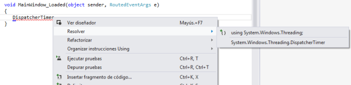
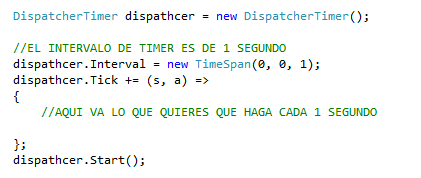
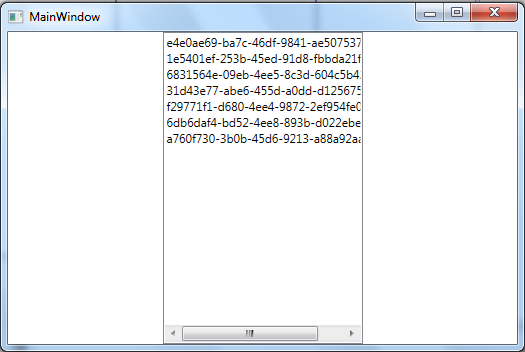

# Utilizando Timer en WPF
## Requires
- Visual Studio 2012
## License
- Apache License, Version 2.0
## Technologies
- WPF
- XAML
- C# Language
- WPF Data Binding
- WPF Silverlight XAML
## Topics
- XAML
- WPF Data Binding
- Timer
## Updated
- 10/31/2014
## Description

<h1>Introducci&oacute;n</h1>

Aveces tenemos la costumbre de utilizar Timers para, peri&oacute;dicamente, revisar el valor de alguna variable que pudo haber cambiado, o quiz&aacute; cambiar los valores de alguna variable. Sin embargo a la hora de utilizar WPF nos topamos que no existe
 el control de Timer como lo existe en Windows Forms.

Sin embargo, dejando a un lado el concepto de que Windows Forms ya es obsoleto, vamos a explicar como utilizar un temporizador program&aacute;ticamente en WPF. Y para ello vamos a utilizar toda la riqueza del enlace de datos como de en lenguaje de marcas
 XAML.

&nbsp;

<h1>Construyendo la aplicaci&oacute;n</h1>

Los primero que tenemos que hacer es abrir un nuevo proyecto de WPF en nuestro visual studio

Una vez abierto, no vamos al codebehind y escribimos en el evento Load de la pagina un nuevo objeto de la clase
<a title="DisptacherTimer msdn" href="http://msdn.microsoft.com/es-es/library/system.windows.threading.dispatchertimer(v=vs.110).aspx" target="_blank">
DispatcherTimer</a>. El cual tiene tres elementos principales.

<strong>1.- Intervalo (propiedad):</strong>

Obtiene o establece el per&iacute;odo de tiempo entre las indicaciones de temporizador.

&nbsp;&nbsp;

<strong>2.- Start() (metodo):</strong>

Inicia&nbsp;DispatcherTimer.

&nbsp;

<strong>3.- Stop() (metodo):</strong>

Detiene&nbsp;DispatcherTimer.

&nbsp;

<strong>4.-Tick (evento) :</strong>

Se produce cuando ha transcurrido el intervalo del temporizador.

&nbsp;

Cuando escribimos DispatcherTimer y no lo reconoce, le damos click derecho y resolvemos la libreria dando click en using System.Windows.Threading

&nbsp;

Y quedar&iacute;a de esta manera construido

&nbsp;

Y con esto ya puedes utilizar y manipulat el timer creado.

Yo voy a probarlo agregandole una coleccion de Guids cada ves que pase un segundo

C#

Editar script|Remove

csharp
<pre class="hidden">ObservableCollection&lt;string&gt; listaGuids = new ObservableCollection&lt;string&gt;();
            this.DataContext = listaGuids;
           
            //INSTANCIANDO EL TIMER CON LA CLASE DISPATCHERTIMER
            DispatcherTimer dispathcer = new DispatcherTimer();

            //EL INTERVALO DEL TIMER ES DE 0 HORAS,0 MINUTOS Y 1 SEGUNDO
            dispathcer.Interval = new TimeSpan(0, 0, 1);

            //EL EVENTO TICK SE SUBSCRIBE A UN CONTROLADOR DE EVENTOS UTILIZANDO LAMBDA
            dispathcer.Tick &#43;= (s, a) =&gt;
            {
                //AQUI VA LO QUE QUIERES QUE HAGA CADA 1 SEGUNDO
                listaGuids.Add(Guid.NewGuid().ToString());

            };
            dispathcer.Start();</pre>

<pre class="csharp">ObservableCollection&lt;string&gt;&nbsp;listaGuids&nbsp;=&nbsp;new&nbsp;ObservableCollection&lt;string&gt;();&nbsp;
&nbsp;&nbsp;&nbsp;&nbsp;&nbsp;&nbsp;&nbsp;&nbsp;&nbsp;&nbsp;&nbsp;&nbsp;this.DataContext&nbsp;=&nbsp;listaGuids;&nbsp;
&nbsp;&nbsp;&nbsp;&nbsp;&nbsp;&nbsp;&nbsp;&nbsp;&nbsp;&nbsp;&nbsp;&nbsp;
&nbsp;&nbsp;&nbsp;&nbsp;&nbsp;&nbsp;&nbsp;&nbsp;&nbsp;&nbsp;&nbsp;&nbsp;//INSTANCIANDO&nbsp;EL&nbsp;TIMER&nbsp;CON&nbsp;LA&nbsp;CLASE&nbsp;DISPATCHERTIMER&nbsp;
&nbsp;&nbsp;&nbsp;&nbsp;&nbsp;&nbsp;&nbsp;&nbsp;&nbsp;&nbsp;&nbsp;&nbsp;DispatcherTimer&nbsp;dispathcer&nbsp;=&nbsp;new&nbsp;DispatcherTimer();&nbsp;
&nbsp;
&nbsp;&nbsp;&nbsp;&nbsp;&nbsp;&nbsp;&nbsp;&nbsp;&nbsp;&nbsp;&nbsp;&nbsp;//EL&nbsp;INTERVALO&nbsp;DEL&nbsp;TIMER&nbsp;ES&nbsp;DE&nbsp;0&nbsp;HORAS,0&nbsp;MINUTOS&nbsp;Y&nbsp;1&nbsp;SEGUNDO&nbsp;
&nbsp;&nbsp;&nbsp;&nbsp;&nbsp;&nbsp;&nbsp;&nbsp;&nbsp;&nbsp;&nbsp;&nbsp;dispathcer.Interval&nbsp;=&nbsp;new&nbsp;TimeSpan(0,&nbsp;0,&nbsp;1);&nbsp;
&nbsp;
&nbsp;&nbsp;&nbsp;&nbsp;&nbsp;&nbsp;&nbsp;&nbsp;&nbsp;&nbsp;&nbsp;&nbsp;//EL&nbsp;EVENTO&nbsp;TICK&nbsp;SE&nbsp;SUBSCRIBE&nbsp;A&nbsp;UN&nbsp;CONTROLADOR&nbsp;DE&nbsp;EVENTOS&nbsp;UTILIZANDO&nbsp;LAMBDA&nbsp;
&nbsp;&nbsp;&nbsp;&nbsp;&nbsp;&nbsp;&nbsp;&nbsp;&nbsp;&nbsp;&nbsp;&nbsp;dispathcer.Tick&nbsp;&#43;=&nbsp;(s,&nbsp;a)&nbsp;=&gt;&nbsp;
&nbsp;&nbsp;&nbsp;&nbsp;&nbsp;&nbsp;&nbsp;&nbsp;&nbsp;&nbsp;&nbsp;&nbsp;{&nbsp;
&nbsp;&nbsp;&nbsp;&nbsp;&nbsp;&nbsp;&nbsp;&nbsp;&nbsp;&nbsp;&nbsp;&nbsp;&nbsp;&nbsp;&nbsp;&nbsp;//AQUI&nbsp;VA&nbsp;LO&nbsp;QUE&nbsp;QUIERES&nbsp;QUE&nbsp;HAGA&nbsp;CADA&nbsp;1&nbsp;SEGUNDO&nbsp;
&nbsp;&nbsp;&nbsp;&nbsp;&nbsp;&nbsp;&nbsp;&nbsp;&nbsp;&nbsp;&nbsp;&nbsp;&nbsp;&nbsp;&nbsp;&nbsp;listaGuids.Add(Guid.NewGuid().ToString());&nbsp;
&nbsp;
&nbsp;&nbsp;&nbsp;&nbsp;&nbsp;&nbsp;&nbsp;&nbsp;&nbsp;&nbsp;&nbsp;&nbsp;};&nbsp;
&nbsp;&nbsp;&nbsp;&nbsp;&nbsp;&nbsp;&nbsp;&nbsp;&nbsp;&nbsp;&nbsp;&nbsp;dispathcer.Start();</pre>

&nbsp;

Y en XAML agregar&iacute;a un listbox tomando como ItemsSource la colecci&oacute;n de cadena

XAML

Editar script|Remove

xaml
<pre class="hidden">&lt;Grid&gt;
        &lt;ListBox Width=&quot;200&quot; Height=&quot;auto&quot; ItemsSource=&quot;{Binding}&quot;/&gt;
    &lt;/Grid&gt;</pre>

<pre class="xaml">&lt;Grid&gt;&nbsp;
&nbsp;&nbsp;&nbsp;&nbsp;&nbsp;&nbsp;&nbsp;&nbsp;&lt;ListBox&nbsp;Width=&quot;200&quot;&nbsp;Height=&quot;auto&quot;&nbsp;ItemsSource=&quot;{Binding}&quot;/&gt;&nbsp;
&nbsp;&nbsp;&nbsp;&nbsp;&lt;/Grid&gt;</pre>

&nbsp;

 

 

&nbsp;

Resultado

Y quedar&iacute;a de estar manera en ejecuci&oacute;n

&nbsp;

