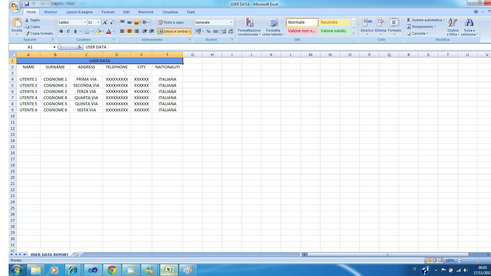

# Utilizzo della libreria ClosedXml per la creazione di file Excel
## Requires
- Visual Studio 2010
## License
- Apache License, Version 2.0
## Technologies
- C#
- Excel
- Windows Forms
- Visual Studio 2010
- Windows SDK
- .NET Framework 4
- .NET Framework
- Microsoft Office Excel 2007
- Visual Basic.NET
- VB.Net
- .NET Framework 4.0
- Excel 2007
- Open XML SDK 2.0
- Windows General
- C# Language
- WinForms
## Topics
- C#
- Excel
- Windows Forms
- Visual Basic .NET
- Visual basic
- VB.Net
- .NET 4
- ClosedXml
- OpenXml
## Updated
- 11/17/2012
## Description

<h1>Introduction</h1>

<em>Questo esempio dimostra come utilizzare la libreria ClosedXml.</em>

<h1>Building the Sample</h1>

<em>Per poter provare questo esempio occorre avere VisualStudio 2010 , oltre che le libreria ClosedXml.dll e OpenXml di microsoft installato sul proprio pc.</em>

Description

&nbsp;ClosedXml e un file con estensione .dll pensato per poter creare con estrema facilit&agrave; dei file Excel con pochi e semplici passaggi. Potete trovare tutta la documentazione e scaricare ClosedXml da Codeplex , il link e disponibile qui di seguito
<a href="http://closedxml.codeplex.com/">http://closedxml.codeplex.com/</a>&nbsp;.&nbsp;Con ClosedXml si&nbsp;possono creare file Excel 2007 e versione 2010 , tener conto che per poter utilizzare ClosedXml abbiamo anche bisogno di installare OpenXml di Microsoft
 disponibile per il Download qui di seguito <a href="http://www.microsoft.com/en-us/download/details.aspx?id=5124">
http://www.microsoft.com/en-us/download/details.aspx?id=5124</a>.In questo esempio vi &egrave; un DataBase creato per semplicit&agrave; con SqlCompact , dove e possibile inserire i dati in una tabella chiamata UserData in modo poi da poterli visualizzare in
 anteprima mediante un DataGrid e un form dedicato.Allafine sar&agrave; possibile salvare e visualizzare il risultato mediante un file excel visibile in figura successiva.Qui di seguito riporto anche il codice utilizzato.

Visual BasicC#

Modifica script|Remove

vbcsharp

<pre class="vb">'FrmClodedXmlSample&nbsp;
Public&nbsp;Class&nbsp;FrmClosedXmlSample&nbsp;
&nbsp;
&nbsp;&nbsp;&nbsp;&nbsp;'I&nbsp;declare&nbsp;a&nbsp;variable&nbsp;of&nbsp;type&nbsp;bool,&nbsp;this&nbsp;variable&nbsp;is&nbsp;handled&nbsp;when&nbsp;the&nbsp;user&nbsp;&nbsp;
&nbsp;&nbsp;&nbsp;&nbsp;'select&nbsp;a&nbsp;row&nbsp;in&nbsp;the&nbsp;DataGrid&nbsp;control&nbsp;to&nbsp;allow&nbsp;you&nbsp;to&nbsp;erase&nbsp;and&nbsp;edit&nbsp;data&nbsp;
&nbsp;&nbsp;&nbsp;&nbsp;Dim&nbsp;_checkifrowisselected&nbsp;As&nbsp;Boolean&nbsp;
&nbsp;
&nbsp;&nbsp;&nbsp;&nbsp;'FrmClosedXmlSampleLoad&nbsp;event&nbsp;
&nbsp;&nbsp;&nbsp;&nbsp;Private&nbsp;Sub&nbsp;FrmClosedXmlSampleLoad(sender&nbsp;As&nbsp;System.Object,&nbsp;e&nbsp;As&nbsp;EventArgs)&nbsp;Handles&nbsp;MyBase.Load&nbsp;
&nbsp;&nbsp;&nbsp;&nbsp;&nbsp;&nbsp;&nbsp;&nbsp;'This&nbsp;method&nbsp;loads&nbsp;the&nbsp;data&nbsp;into&nbsp;the&nbsp;control&nbsp;using&nbsp;the&nbsp;TableAdapter's&nbsp;Fill&nbsp;method,&nbsp;&nbsp;&nbsp;
&nbsp;&nbsp;&nbsp;&nbsp;&nbsp;&nbsp;&nbsp;&nbsp;'and&nbsp;then&nbsp;the&nbsp;DataGridView&nbsp;control&nbsp;is&nbsp;enhanced&nbsp;with&nbsp;the&nbsp;original&nbsp;data&nbsp;using&nbsp;the&nbsp;DataSource&nbsp;property&nbsp;
&nbsp;&nbsp;&nbsp;&nbsp;&nbsp;&nbsp;&nbsp;&nbsp;LoadDataGrid()&nbsp;
&nbsp;&nbsp;&nbsp;&nbsp;End&nbsp;Sub&nbsp;
&nbsp;
&nbsp;&nbsp;&nbsp;&nbsp;'LoadDataGrid&nbsp;Method&nbsp;
&nbsp;&nbsp;&nbsp;&nbsp;Private&nbsp;Sub&nbsp;LoadDataGrid()&nbsp;
&nbsp;&nbsp;&nbsp;&nbsp;&nbsp;&nbsp;&nbsp;&nbsp;'Load&nbsp;the&nbsp;data&nbsp;into&nbsp;the&nbsp;control&nbsp;TableAdapter&nbsp;
&nbsp;&nbsp;&nbsp;&nbsp;&nbsp;&nbsp;&nbsp;&nbsp;USERDATATableAdapter.Fill(UserDataSet.USERDATA)&nbsp;
&nbsp;&nbsp;&nbsp;&nbsp;&nbsp;&nbsp;&nbsp;&nbsp;'Load&nbsp;data&nbsp;with&nbsp;the&nbsp;DataGrid&nbsp;control&nbsp;
&nbsp;&nbsp;&nbsp;&nbsp;&nbsp;&nbsp;&nbsp;&nbsp;dgvUserData.DataSource&nbsp;=&nbsp;USERDATABindingSource&nbsp;
&nbsp;&nbsp;&nbsp;&nbsp;End&nbsp;Sub&nbsp;
&nbsp;
&nbsp;&nbsp;&nbsp;&nbsp;'BtnEsciClick&nbsp;event&nbsp;
&nbsp;&nbsp;&nbsp;&nbsp;Private&nbsp;Sub&nbsp;BtnEsciClick(sender&nbsp;As&nbsp;System.Object,&nbsp;e&nbsp;As&nbsp;EventArgs)&nbsp;Handles&nbsp;btnEsci.Click&nbsp;
&nbsp;&nbsp;&nbsp;&nbsp;&nbsp;&nbsp;&nbsp;&nbsp;'Close&nbsp;application&nbsp;
&nbsp;&nbsp;&nbsp;&nbsp;&nbsp;&nbsp;&nbsp;&nbsp;Close()&nbsp;
&nbsp;&nbsp;&nbsp;&nbsp;End&nbsp;Sub&nbsp;
&nbsp;
&nbsp;&nbsp;&nbsp;&nbsp;'BtnNewClick&nbsp;Event&nbsp;
&nbsp;&nbsp;&nbsp;&nbsp;Private&nbsp;Sub&nbsp;BtnNuovoClick(sender&nbsp;As&nbsp;System.Object,&nbsp;e&nbsp;As&nbsp;EventArgs)&nbsp;Handles&nbsp;btnNuovo.Click&nbsp;
&nbsp;&nbsp;&nbsp;&nbsp;&nbsp;&nbsp;&nbsp;&nbsp;'Insert&nbsp;this&nbsp;method&nbsp;does&nbsp;nothing&nbsp;but&nbsp;make&nbsp;the&nbsp;exploitation&nbsp;of&nbsp;fields&nbsp;of&nbsp;DataTable&nbsp;after&nbsp;inserting&nbsp;a&nbsp;new&nbsp;record&nbsp;into&nbsp;the&nbsp;table&nbsp;UserData&nbsp;
&nbsp;&nbsp;&nbsp;&nbsp;&nbsp;&nbsp;&nbsp;&nbsp;USERDATATableAdapter.Insert(txtName.Text.ToUpper(),&nbsp;txtSurname.Text.ToUpper(),&nbsp;txtAddress.Text.ToUpper(),&nbsp;txtTelephoneNumber.Text.ToUpper(),&nbsp;
&nbsp;&nbsp;&nbsp;&nbsp;&nbsp;&nbsp;&nbsp;&nbsp;&nbsp;&nbsp;&nbsp;&nbsp;&nbsp;&nbsp;&nbsp;&nbsp;&nbsp;&nbsp;&nbsp;&nbsp;&nbsp;&nbsp;&nbsp;&nbsp;&nbsp;&nbsp;&nbsp;&nbsp;&nbsp;&nbsp;&nbsp;&nbsp;&nbsp;&nbsp;&nbsp;&nbsp;txtCity.Text.ToUpper(),&nbsp;txtNationality.Text.ToUpper())&nbsp;
&nbsp;
&nbsp;&nbsp;&nbsp;&nbsp;&nbsp;&nbsp;&nbsp;&nbsp;'This&nbsp;method&nbsp;loads&nbsp;the&nbsp;data&nbsp;into&nbsp;the&nbsp;control&nbsp;using&nbsp;the&nbsp;TableAdapter's&nbsp;Fill&nbsp;method,&nbsp;&nbsp;&nbsp;
&nbsp;&nbsp;&nbsp;&nbsp;&nbsp;&nbsp;&nbsp;&nbsp;'and&nbsp;then&nbsp;the&nbsp;DataGridView&nbsp;control&nbsp;is&nbsp;enhanced&nbsp;with&nbsp;the&nbsp;original&nbsp;data&nbsp;using&nbsp;the&nbsp;DataSource&nbsp;property&nbsp;
&nbsp;&nbsp;&nbsp;&nbsp;&nbsp;&nbsp;&nbsp;&nbsp;LoadDataGrid()&nbsp;
&nbsp;&nbsp;&nbsp;&nbsp;End&nbsp;Sub&nbsp;
&nbsp;
&nbsp;&nbsp;&nbsp;&nbsp;'BtnDeleteClick&nbsp;Event&nbsp;
&nbsp;&nbsp;&nbsp;&nbsp;Private&nbsp;Sub&nbsp;BtnEliminaClick(sender&nbsp;As&nbsp;System.Object,&nbsp;e&nbsp;As&nbsp;EventArgs)&nbsp;Handles&nbsp;btnElimina.Click&nbsp;
&nbsp;&nbsp;&nbsp;&nbsp;&nbsp;&nbsp;&nbsp;&nbsp;'If&nbsp;not&nbsp;_checkifrowisselected&nbsp;equals&nbsp;false&nbsp;
&nbsp;&nbsp;&nbsp;&nbsp;&nbsp;&nbsp;&nbsp;&nbsp;If&nbsp;Not&nbsp;_checkifrowisselected.Equals(False)&nbsp;Then&nbsp;
&nbsp;&nbsp;&nbsp;&nbsp;&nbsp;&nbsp;&nbsp;&nbsp;&nbsp;&nbsp;&nbsp;&nbsp;'check&nbsp;if&nbsp;current&nbsp;row&nbsp;is&nbsp;not&nbsp;null&nbsp;
&nbsp;&nbsp;&nbsp;&nbsp;&nbsp;&nbsp;&nbsp;&nbsp;&nbsp;&nbsp;&nbsp;&nbsp;If&nbsp;dgvUserData.CurrentRow&nbsp;Is&nbsp;Nothing&nbsp;Then&nbsp;
&nbsp;&nbsp;&nbsp;&nbsp;&nbsp;&nbsp;&nbsp;&nbsp;&nbsp;&nbsp;&nbsp;&nbsp;&nbsp;&nbsp;&nbsp;&nbsp;Return&nbsp;
&nbsp;&nbsp;&nbsp;&nbsp;&nbsp;&nbsp;&nbsp;&nbsp;&nbsp;&nbsp;&nbsp;&nbsp;End&nbsp;If&nbsp;
&nbsp;
&nbsp;&nbsp;&nbsp;&nbsp;&nbsp;&nbsp;&nbsp;&nbsp;&nbsp;&nbsp;&nbsp;&nbsp;'Delete&nbsp;this&nbsp;method&nbsp;does&nbsp;is&nbsp;erase&nbsp;the&nbsp;fields&nbsp;in&nbsp;the&nbsp;UserData&nbsp;table,&nbsp;execute&nbsp;the&nbsp;passing&nbsp;as&nbsp;argument&nbsp;the&nbsp;number&nbsp;of&nbsp;records&nbsp;that&nbsp;we&nbsp;select&nbsp;using&nbsp;the&nbsp;DataGridView&nbsp;control,&nbsp;&nbsp;
&nbsp;&nbsp;&nbsp;&nbsp;&nbsp;&nbsp;&nbsp;&nbsp;&nbsp;&nbsp;&nbsp;&nbsp;'before&nbsp;removal&nbsp;of&nbsp;the&nbsp;record,&nbsp;it&nbsp;checks&nbsp;to&nbsp;see&nbsp;if&nbsp;the&nbsp;user&nbsp;has&nbsp;selected&nbsp;or&nbsp;least&nbsp;one&nbsp;row&nbsp;of&nbsp;the&nbsp;DataGridView&nbsp;control&nbsp;
&nbsp;&nbsp;&nbsp;&nbsp;&nbsp;&nbsp;&nbsp;&nbsp;&nbsp;&nbsp;&nbsp;&nbsp;USERDATATableAdapter.Delete(Integer.Parse(dgvUserData.CurrentRow.Cells(0).Value.ToString()))&nbsp;
&nbsp;
&nbsp;&nbsp;&nbsp;&nbsp;&nbsp;&nbsp;&nbsp;&nbsp;&nbsp;&nbsp;&nbsp;&nbsp;'This&nbsp;method&nbsp;loads&nbsp;the&nbsp;data&nbsp;into&nbsp;the&nbsp;control&nbsp;using&nbsp;the&nbsp;TableAdapter's&nbsp;Fill&nbsp;method,&nbsp;&nbsp;
&nbsp;&nbsp;&nbsp;&nbsp;&nbsp;&nbsp;&nbsp;&nbsp;&nbsp;&nbsp;&nbsp;&nbsp;'and&nbsp;then&nbsp;the&nbsp;DataGridView&nbsp;control&nbsp;is&nbsp;enhanced&nbsp;with&nbsp;the&nbsp;original&nbsp;data&nbsp;using&nbsp;the&nbsp;DataSource&nbsp;property&nbsp;
&nbsp;&nbsp;&nbsp;&nbsp;&nbsp;&nbsp;&nbsp;&nbsp;&nbsp;&nbsp;&nbsp;&nbsp;LoadDataGrid()&nbsp;
&nbsp;
&nbsp;&nbsp;&nbsp;&nbsp;&nbsp;&nbsp;&nbsp;&nbsp;&nbsp;&nbsp;&nbsp;&nbsp;'set&nbsp;to&nbsp;false&nbsp;variable&nbsp;
&nbsp;&nbsp;&nbsp;&nbsp;&nbsp;&nbsp;&nbsp;&nbsp;&nbsp;&nbsp;&nbsp;&nbsp;_checkifrowisselected&nbsp;=&nbsp;False&nbsp;
&nbsp;&nbsp;&nbsp;&nbsp;&nbsp;&nbsp;&nbsp;&nbsp;Else&nbsp;
&nbsp;&nbsp;&nbsp;&nbsp;&nbsp;&nbsp;&nbsp;&nbsp;&nbsp;&nbsp;&nbsp;&nbsp;'Visualize&nbsp;message&nbsp;to&nbsp;user&nbsp;
&nbsp;&nbsp;&nbsp;&nbsp;&nbsp;&nbsp;&nbsp;&nbsp;&nbsp;&nbsp;&nbsp;&nbsp;MessageBox.Show(My.Resources.FrmClosedXmlSample_BtnDeleteClick_Select_one_row)&nbsp;
&nbsp;&nbsp;&nbsp;&nbsp;&nbsp;&nbsp;&nbsp;&nbsp;End&nbsp;If&nbsp;
&nbsp;&nbsp;&nbsp;&nbsp;End&nbsp;Sub&nbsp;
&nbsp;
&nbsp;&nbsp;&nbsp;&nbsp;'BtnUpdate&nbsp;Event&nbsp;
&nbsp;&nbsp;&nbsp;&nbsp;Private&nbsp;Sub&nbsp;BtnModificaClick(sender&nbsp;As&nbsp;System.Object,&nbsp;e&nbsp;As&nbsp;EventArgs)&nbsp;Handles&nbsp;btnModifica.Click&nbsp;
&nbsp;&nbsp;&nbsp;&nbsp;&nbsp;&nbsp;&nbsp;&nbsp;'If&nbsp;not&nbsp;_checkifrowisselected&nbsp;equals&nbsp;false&nbsp;
&nbsp;&nbsp;&nbsp;&nbsp;&nbsp;&nbsp;&nbsp;&nbsp;If&nbsp;Not&nbsp;_checkifrowisselected.Equals(False)&nbsp;Then&nbsp;
&nbsp;&nbsp;&nbsp;&nbsp;&nbsp;&nbsp;&nbsp;&nbsp;&nbsp;&nbsp;&nbsp;&nbsp;'Check&nbsp;if&nbsp;currentrow&nbsp;of&nbsp;DataGric&nbsp;is&nbsp;not&nbsp;null&nbsp;
&nbsp;&nbsp;&nbsp;&nbsp;&nbsp;&nbsp;&nbsp;&nbsp;&nbsp;&nbsp;&nbsp;&nbsp;If&nbsp;dgvUserData.CurrentRow&nbsp;Is&nbsp;Nothing&nbsp;Then&nbsp;
&nbsp;&nbsp;&nbsp;&nbsp;&nbsp;&nbsp;&nbsp;&nbsp;&nbsp;&nbsp;&nbsp;&nbsp;&nbsp;&nbsp;&nbsp;&nbsp;Return&nbsp;
&nbsp;&nbsp;&nbsp;&nbsp;&nbsp;&nbsp;&nbsp;&nbsp;&nbsp;&nbsp;&nbsp;&nbsp;End&nbsp;If&nbsp;
&nbsp;
&nbsp;&nbsp;&nbsp;&nbsp;&nbsp;&nbsp;&nbsp;&nbsp;&nbsp;&nbsp;&nbsp;&nbsp;USERDATATableAdapter.Update(txtName.Text.ToUpper(),&nbsp;txtSurname.Text.ToUpper(),&nbsp;txtAddress.Text.ToUpper(),&nbsp;txtTelephoneNumber.Text.ToUpper(),&nbsp;txtCity.Text.ToUpper(),&nbsp;txtNationality.Text.ToUpper(),&nbsp;_&nbsp;
&nbsp;&nbsp;&nbsp;&nbsp;&nbsp;&nbsp;&nbsp;&nbsp;&nbsp;&nbsp;&nbsp;&nbsp;&nbsp;Integer.Parse(dgvUserData.CurrentRow.Cells(0).Value.ToString()))&nbsp;
&nbsp;
&nbsp;&nbsp;&nbsp;&nbsp;&nbsp;&nbsp;&nbsp;&nbsp;&nbsp;&nbsp;&nbsp;&nbsp;'This&nbsp;method&nbsp;loads&nbsp;the&nbsp;data&nbsp;into&nbsp;the&nbsp;control&nbsp;using&nbsp;the&nbsp;TableAdapter's&nbsp;Fill&nbsp;method,&nbsp;&nbsp;
&nbsp;&nbsp;&nbsp;&nbsp;&nbsp;&nbsp;&nbsp;&nbsp;&nbsp;&nbsp;&nbsp;&nbsp;'and&nbsp;then&nbsp;the&nbsp;DataGridView&nbsp;control&nbsp;is&nbsp;enhanced&nbsp;with&nbsp;the&nbsp;original&nbsp;data&nbsp;using&nbsp;the&nbsp;DataSource&nbsp;property&nbsp;
&nbsp;&nbsp;&nbsp;&nbsp;&nbsp;&nbsp;&nbsp;&nbsp;&nbsp;&nbsp;&nbsp;&nbsp;LoadDataGrid()&nbsp;
&nbsp;
&nbsp;&nbsp;&nbsp;&nbsp;&nbsp;&nbsp;&nbsp;&nbsp;&nbsp;&nbsp;&nbsp;&nbsp;'set&nbsp;to&nbsp;false&nbsp;variable&nbsp;
&nbsp;&nbsp;&nbsp;&nbsp;&nbsp;&nbsp;&nbsp;&nbsp;&nbsp;&nbsp;&nbsp;&nbsp;_checkifrowisselected&nbsp;=&nbsp;False&nbsp;
&nbsp;&nbsp;&nbsp;&nbsp;&nbsp;&nbsp;&nbsp;&nbsp;Else&nbsp;
&nbsp;&nbsp;&nbsp;&nbsp;&nbsp;&nbsp;&nbsp;&nbsp;&nbsp;&nbsp;&nbsp;&nbsp;'Visualize&nbsp;message&nbsp;to&nbsp;user&nbsp;
&nbsp;&nbsp;&nbsp;&nbsp;&nbsp;&nbsp;&nbsp;&nbsp;&nbsp;&nbsp;&nbsp;&nbsp;MessageBox.Show(My.Resources.FrmClosedXmlSample_BtnDeleteClick_Select_one_row)&nbsp;
&nbsp;&nbsp;&nbsp;&nbsp;&nbsp;&nbsp;&nbsp;&nbsp;End&nbsp;If&nbsp;
&nbsp;&nbsp;&nbsp;&nbsp;End&nbsp;Sub&nbsp;
&nbsp;
&nbsp;&nbsp;&nbsp;&nbsp;'BtnReportClick&nbsp;Event&nbsp;
&nbsp;&nbsp;&nbsp;&nbsp;Private&nbsp;Sub&nbsp;BtnReportClick(sender&nbsp;As&nbsp;System.Object,&nbsp;e&nbsp;As&nbsp;EventArgs)&nbsp;Handles&nbsp;btnReport.Click&nbsp;
&nbsp;&nbsp;&nbsp;&nbsp;&nbsp;&nbsp;&nbsp;&nbsp;'I&nbsp;declare&nbsp;a&nbsp;new&nbsp;instance&nbsp;of&nbsp;the&nbsp;Form&nbsp;Frmeport&nbsp;
&nbsp;&nbsp;&nbsp;&nbsp;&nbsp;&nbsp;&nbsp;&nbsp;Dim&nbsp;frm&nbsp;=&nbsp;New&nbsp;FrmReport&nbsp;
&nbsp;&nbsp;&nbsp;&nbsp;&nbsp;&nbsp;&nbsp;&nbsp;'Pass&nbsp;data&nbsp;form&nbsp;dgvUserData&nbsp;to&nbsp;Datagrin&nbsp;in&nbsp;FrmReport&nbsp;
&nbsp;&nbsp;&nbsp;&nbsp;&nbsp;&nbsp;&nbsp;&nbsp;frm.FrmReport(dgvUserData)&nbsp;
&nbsp;&nbsp;&nbsp;&nbsp;&nbsp;&nbsp;&nbsp;&nbsp;'I'm&nbsp;seeing&nbsp;the&nbsp;Forms&nbsp;user&nbsp;
&nbsp;&nbsp;&nbsp;&nbsp;&nbsp;&nbsp;&nbsp;&nbsp;frm.Show()&nbsp;
&nbsp;&nbsp;&nbsp;&nbsp;End&nbsp;Sub&nbsp;
&nbsp;
&nbsp;&nbsp;&nbsp;&nbsp;'BtnFindClick&nbsp;Event&nbsp;
&nbsp;&nbsp;&nbsp;&nbsp;Private&nbsp;Sub&nbsp;BtnFindClick(sender&nbsp;As&nbsp;System.Object,&nbsp;e&nbsp;As&nbsp;EventArgs)&nbsp;Handles&nbsp;btnFind.Click&nbsp;
&nbsp;&nbsp;&nbsp;&nbsp;&nbsp;&nbsp;&nbsp;&nbsp;'I&nbsp;get&nbsp;the&nbsp;currently&nbsp;selected&nbsp;text&nbsp;to&nbsp;the&nbsp;ComboBox&nbsp;control*/&nbsp;
&nbsp;&nbsp;&nbsp;&nbsp;&nbsp;&nbsp;&nbsp;&nbsp;Dim&nbsp;selecteditems&nbsp;=&nbsp;cbxFind.Text&nbsp;
&nbsp;
&nbsp;&nbsp;&nbsp;&nbsp;&nbsp;&nbsp;&nbsp;&nbsp;'Executing&nbsp;the&nbsp;control&nbsp;of&nbsp;the&nbsp;variable&nbsp;SelectedItems&nbsp;with&nbsp;a&nbsp;Switch&nbsp;construct&nbsp;
&nbsp;&nbsp;&nbsp;&nbsp;&nbsp;&nbsp;&nbsp;&nbsp;Select&nbsp;Case&nbsp;selecteditems&nbsp;
&nbsp;&nbsp;&nbsp;&nbsp;&nbsp;&nbsp;&nbsp;&nbsp;&nbsp;&nbsp;&nbsp;&nbsp;'if&nbsp;equals&nbsp;&quot;NAME&quot;&nbsp;
&nbsp;&nbsp;&nbsp;&nbsp;&nbsp;&nbsp;&nbsp;&nbsp;&nbsp;&nbsp;&nbsp;&nbsp;Case&nbsp;&quot;NAME&quot;&nbsp;
&nbsp;&nbsp;&nbsp;&nbsp;&nbsp;&nbsp;&nbsp;&nbsp;&nbsp;&nbsp;&nbsp;&nbsp;&nbsp;&nbsp;&nbsp;&nbsp;'I&nbsp;run&nbsp;a&nbsp;query&nbsp;LinqToDataSet&nbsp;with&nbsp;extension&nbsp;method&nbsp;and&nbsp;recover&nbsp;all&nbsp;data&nbsp;from&nbsp;the&nbsp;UserData&nbsp;table&nbsp;and&nbsp;visualize&nbsp;the&nbsp;DataGrid&nbsp;control&nbsp;
&nbsp;&nbsp;&nbsp;&nbsp;&nbsp;&nbsp;&nbsp;&nbsp;&nbsp;&nbsp;&nbsp;&nbsp;&nbsp;&nbsp;&nbsp;&nbsp;Dim&nbsp;queryname&nbsp;=&nbsp;UserDataSet.USERDATA.Where(Function(f)&nbsp;f.NAME.StartsWith(txtName.Text.ToUpper)).Select(Function(f)&nbsp;New&nbsp;With&nbsp;{f.NAME&nbsp;_&nbsp;
&nbsp;&nbsp;&nbsp;&nbsp;&nbsp;&nbsp;&nbsp;&nbsp;&nbsp;&nbsp;&nbsp;&nbsp;&nbsp;&nbsp;&nbsp;&nbsp;&nbsp;&nbsp;&nbsp;&nbsp;&nbsp;&nbsp;&nbsp;&nbsp;&nbsp;&nbsp;&nbsp;&nbsp;&nbsp;&nbsp;&nbsp;&nbsp;,&nbsp;f.SURNAME,&nbsp;f.ADDRESS,&nbsp;f.TELEPHONE,&nbsp;f.CITY,&nbsp;f.NATIONALITI})&nbsp;
&nbsp;&nbsp;&nbsp;&nbsp;&nbsp;&nbsp;&nbsp;&nbsp;&nbsp;&nbsp;&nbsp;&nbsp;&nbsp;&nbsp;&nbsp;&nbsp;dgvUserData.DataSource&nbsp;=&nbsp;queryname.ToArray&nbsp;
&nbsp;
&nbsp;&nbsp;&nbsp;&nbsp;&nbsp;&nbsp;&nbsp;&nbsp;&nbsp;&nbsp;&nbsp;&nbsp;&nbsp;&nbsp;&nbsp;&nbsp;'if&nbsp;eqUals&nbsp;&quot;CITY&quot;&nbsp;
&nbsp;&nbsp;&nbsp;&nbsp;&nbsp;&nbsp;&nbsp;&nbsp;&nbsp;&nbsp;&nbsp;&nbsp;Case&nbsp;&quot;CITY&quot;&nbsp;
&nbsp;&nbsp;&nbsp;&nbsp;&nbsp;&nbsp;&nbsp;&nbsp;&nbsp;&nbsp;&nbsp;&nbsp;&nbsp;&nbsp;&nbsp;&nbsp;'I&nbsp;run&nbsp;a&nbsp;query&nbsp;LinqToDataSet&nbsp;with&nbsp;extension&nbsp;method&nbsp;and&nbsp;recover&nbsp;all&nbsp;data&nbsp;from&nbsp;the&nbsp;UserData&nbsp;table&nbsp;and&nbsp;visualize&nbsp;the&nbsp;DataGrid&nbsp;control&nbsp;
&nbsp;&nbsp;&nbsp;&nbsp;&nbsp;&nbsp;&nbsp;&nbsp;&nbsp;&nbsp;&nbsp;&nbsp;&nbsp;&nbsp;&nbsp;&nbsp;Dim&nbsp;querycity&nbsp;=&nbsp;UserDataSet.USERDATA.Where(Function(f)&nbsp;f.NAME.StartsWith(txtCity.Text.ToUpper)).Select(Function(f)&nbsp;New&nbsp;With&nbsp;{f.NAME&nbsp;_&nbsp;
&nbsp;&nbsp;&nbsp;&nbsp;&nbsp;&nbsp;&nbsp;&nbsp;&nbsp;&nbsp;&nbsp;&nbsp;&nbsp;&nbsp;&nbsp;&nbsp;&nbsp;&nbsp;&nbsp;&nbsp;&nbsp;&nbsp;&nbsp;&nbsp;&nbsp;&nbsp;&nbsp;&nbsp;&nbsp;&nbsp;&nbsp;&nbsp;,&nbsp;f.SURNAME,&nbsp;f.ADDRESS,&nbsp;f.TELEPHONE,&nbsp;f.CITY,&nbsp;f.NATIONALITI})&nbsp;
&nbsp;&nbsp;&nbsp;&nbsp;&nbsp;&nbsp;&nbsp;&nbsp;&nbsp;&nbsp;&nbsp;&nbsp;&nbsp;&nbsp;&nbsp;&nbsp;dgvUserData.DataSource&nbsp;=&nbsp;querycity.ToArray&nbsp;
&nbsp;
&nbsp;&nbsp;&nbsp;&nbsp;&nbsp;&nbsp;&nbsp;&nbsp;&nbsp;&nbsp;&nbsp;&nbsp;&nbsp;&nbsp;&nbsp;&nbsp;'if&nbsp;eqUals&nbsp;&quot;NATIONALITY&quot;&nbsp;
&nbsp;&nbsp;&nbsp;&nbsp;&nbsp;&nbsp;&nbsp;&nbsp;&nbsp;&nbsp;&nbsp;&nbsp;Case&nbsp;&quot;NATIONALITY&quot;&nbsp;
&nbsp;&nbsp;&nbsp;&nbsp;&nbsp;&nbsp;&nbsp;&nbsp;&nbsp;&nbsp;&nbsp;&nbsp;&nbsp;&nbsp;&nbsp;&nbsp;'I&nbsp;run&nbsp;a&nbsp;query&nbsp;LinqToDataSet&nbsp;with&nbsp;extension&nbsp;method&nbsp;and&nbsp;recover&nbsp;all&nbsp;data&nbsp;from&nbsp;the&nbsp;UserData&nbsp;table&nbsp;and&nbsp;visualize&nbsp;the&nbsp;DataGrid&nbsp;control&nbsp;
&nbsp;&nbsp;&nbsp;&nbsp;&nbsp;&nbsp;&nbsp;&nbsp;&nbsp;&nbsp;&nbsp;&nbsp;&nbsp;&nbsp;&nbsp;&nbsp;Dim&nbsp;querynationality&nbsp;=&nbsp;UserDataSet.USERDATA.Where(Function(f)&nbsp;f.NAME.StartsWith(txtNationality.Text.ToUpper)).Select(Function(f)&nbsp;New&nbsp;With&nbsp;{f.NAME&nbsp;_&nbsp;
&nbsp;&nbsp;&nbsp;&nbsp;&nbsp;&nbsp;&nbsp;&nbsp;&nbsp;&nbsp;&nbsp;&nbsp;&nbsp;&nbsp;&nbsp;&nbsp;,&nbsp;f.SURNAME,&nbsp;f.ADDRESS,&nbsp;f.TELEPHONE,&nbsp;f.CITY,&nbsp;f.NATIONALITI})&nbsp;
&nbsp;&nbsp;&nbsp;&nbsp;&nbsp;&nbsp;&nbsp;&nbsp;&nbsp;&nbsp;&nbsp;&nbsp;&nbsp;&nbsp;&nbsp;&nbsp;dgvUserData.DataSource&nbsp;=&nbsp;querynationality.ToArray&nbsp;
&nbsp;&nbsp;&nbsp;&nbsp;&nbsp;&nbsp;&nbsp;&nbsp;End&nbsp;Select&nbsp;
&nbsp;
&nbsp;&nbsp;&nbsp;&nbsp;End&nbsp;Sub&nbsp;
&nbsp;
&nbsp;&nbsp;&nbsp;&nbsp;'CbxFindSelectedIndexChanged&nbsp;event&nbsp;
&nbsp;&nbsp;&nbsp;&nbsp;Private&nbsp;Sub&nbsp;CbxFindSelectedIndexChanged(sender&nbsp;As&nbsp;System.Object,&nbsp;e&nbsp;As&nbsp;EventArgs)&nbsp;Handles&nbsp;cbxFind.SelectedIndexChanged&nbsp;
&nbsp;&nbsp;&nbsp;&nbsp;&nbsp;&nbsp;&nbsp;&nbsp;'I&nbsp;get&nbsp;the&nbsp;currently&nbsp;selected&nbsp;text&nbsp;to&nbsp;the&nbsp;ComboBox&nbsp;control*/&nbsp;
&nbsp;&nbsp;&nbsp;&nbsp;&nbsp;&nbsp;&nbsp;&nbsp;Dim&nbsp;selecteditems&nbsp;=&nbsp;cbxFind.Text&nbsp;
&nbsp;
&nbsp;&nbsp;&nbsp;&nbsp;&nbsp;&nbsp;&nbsp;&nbsp;'Using&nbsp;a&nbsp;query&nbsp;LinqToObjects&nbsp;reimposed&nbsp;the&nbsp;Enabled&nbsp;property&nbsp;to&nbsp;true&nbsp;for&nbsp;all&nbsp;the&nbsp;text&nbsp;boxes&nbsp;on&nbsp;the&nbsp;form&nbsp;
&nbsp;&nbsp;&nbsp;&nbsp;&nbsp;&nbsp;&nbsp;&nbsp;For&nbsp;Each&nbsp;c&nbsp;In&nbsp;Controls.OfType(Of&nbsp;TextBox)()&nbsp;
&nbsp;&nbsp;&nbsp;&nbsp;&nbsp;&nbsp;&nbsp;&nbsp;&nbsp;&nbsp;&nbsp;&nbsp;c.Enabled&nbsp;=&nbsp;True&nbsp;
&nbsp;&nbsp;&nbsp;&nbsp;&nbsp;&nbsp;&nbsp;&nbsp;Next&nbsp;
&nbsp;
&nbsp;&nbsp;&nbsp;&nbsp;&nbsp;&nbsp;&nbsp;&nbsp;'Executing&nbsp;the&nbsp;control&nbsp;of&nbsp;the&nbsp;variable&nbsp;SelectedItems&nbsp;with&nbsp;a&nbsp;Switch&nbsp;construct&nbsp;
&nbsp;&nbsp;&nbsp;&nbsp;&nbsp;&nbsp;&nbsp;&nbsp;Select&nbsp;Case&nbsp;selecteditems&nbsp;
&nbsp;&nbsp;&nbsp;&nbsp;&nbsp;&nbsp;&nbsp;&nbsp;&nbsp;&nbsp;&nbsp;&nbsp;'if&nbsp;equals&nbsp;&quot;NAME&quot;&nbsp;
&nbsp;&nbsp;&nbsp;&nbsp;&nbsp;&nbsp;&nbsp;&nbsp;&nbsp;&nbsp;&nbsp;&nbsp;Case&nbsp;&quot;NAME&quot;&nbsp;
&nbsp;&nbsp;&nbsp;&nbsp;&nbsp;&nbsp;&nbsp;&nbsp;&nbsp;&nbsp;&nbsp;&nbsp;&nbsp;&nbsp;&nbsp;&nbsp;'I&nbsp;run&nbsp;a&nbsp;query&nbsp;linq&nbsp;to&nbsp;objects&nbsp;and&nbsp;imposed&nbsp;enable&nbsp;the&nbsp;property&nbsp;if&nbsp;different&nbsp;from&nbsp;the&nbsp;text&nbsp;box&nbsp;specified&nbsp;
&nbsp;&nbsp;&nbsp;&nbsp;&nbsp;&nbsp;&nbsp;&nbsp;&nbsp;&nbsp;&nbsp;&nbsp;&nbsp;&nbsp;&nbsp;&nbsp;For&nbsp;Each&nbsp;c&nbsp;In&nbsp;From&nbsp;c1&nbsp;In&nbsp;Controls.OfType(Of&nbsp;TextBox)()&nbsp;Where&nbsp;Not&nbsp;c1.Name.Equals(txtName.Name)&nbsp;
&nbsp;&nbsp;&nbsp;&nbsp;&nbsp;&nbsp;&nbsp;&nbsp;&nbsp;&nbsp;&nbsp;&nbsp;&nbsp;&nbsp;&nbsp;&nbsp;&nbsp;&nbsp;&nbsp;&nbsp;c.Enabled&nbsp;=&nbsp;False&nbsp;
&nbsp;&nbsp;&nbsp;&nbsp;&nbsp;&nbsp;&nbsp;&nbsp;&nbsp;&nbsp;&nbsp;&nbsp;&nbsp;&nbsp;&nbsp;&nbsp;Next&nbsp;
&nbsp;
&nbsp;&nbsp;&nbsp;&nbsp;&nbsp;&nbsp;&nbsp;&nbsp;&nbsp;&nbsp;&nbsp;&nbsp;&nbsp;&nbsp;&nbsp;&nbsp;'if&nbsp;equals&nbsp;&quot;SURNAME&quot;&nbsp;
&nbsp;&nbsp;&nbsp;&nbsp;&nbsp;&nbsp;&nbsp;&nbsp;&nbsp;&nbsp;&nbsp;&nbsp;Case&nbsp;&quot;SURNAME&quot;&nbsp;
&nbsp;&nbsp;&nbsp;&nbsp;&nbsp;&nbsp;&nbsp;&nbsp;&nbsp;&nbsp;&nbsp;&nbsp;&nbsp;&nbsp;&nbsp;&nbsp;'I&nbsp;run&nbsp;a&nbsp;query&nbsp;linq&nbsp;to&nbsp;objects&nbsp;and&nbsp;imposed&nbsp;enable&nbsp;the&nbsp;property&nbsp;if&nbsp;different&nbsp;from&nbsp;the&nbsp;text&nbsp;box&nbsp;specified&nbsp;
&nbsp;&nbsp;&nbsp;&nbsp;&nbsp;&nbsp;&nbsp;&nbsp;&nbsp;&nbsp;&nbsp;&nbsp;&nbsp;&nbsp;&nbsp;&nbsp;For&nbsp;Each&nbsp;c&nbsp;In&nbsp;From&nbsp;c1&nbsp;In&nbsp;Controls.OfType(Of&nbsp;TextBox)()&nbsp;Where&nbsp;Not&nbsp;c1.Name.Equals(txtSurname.Name)&nbsp;
&nbsp;&nbsp;&nbsp;&nbsp;&nbsp;&nbsp;&nbsp;&nbsp;&nbsp;&nbsp;&nbsp;&nbsp;&nbsp;&nbsp;&nbsp;&nbsp;&nbsp;&nbsp;&nbsp;&nbsp;c.Enabled&nbsp;=&nbsp;False&nbsp;
&nbsp;&nbsp;&nbsp;&nbsp;&nbsp;&nbsp;&nbsp;&nbsp;&nbsp;&nbsp;&nbsp;&nbsp;&nbsp;&nbsp;&nbsp;&nbsp;Next&nbsp;
&nbsp;
&nbsp;&nbsp;&nbsp;&nbsp;&nbsp;&nbsp;&nbsp;&nbsp;&nbsp;&nbsp;&nbsp;&nbsp;&nbsp;&nbsp;&nbsp;&nbsp;'if&nbsp;equals&nbsp;&quot;ADDRESS&quot;&nbsp;
&nbsp;&nbsp;&nbsp;&nbsp;&nbsp;&nbsp;&nbsp;&nbsp;&nbsp;&nbsp;&nbsp;&nbsp;Case&nbsp;&quot;ADDRESS&quot;&nbsp;
&nbsp;&nbsp;&nbsp;&nbsp;&nbsp;&nbsp;&nbsp;&nbsp;&nbsp;&nbsp;&nbsp;&nbsp;&nbsp;&nbsp;&nbsp;&nbsp;'I&nbsp;run&nbsp;a&nbsp;query&nbsp;linq&nbsp;to&nbsp;objects&nbsp;and&nbsp;imposed&nbsp;enable&nbsp;the&nbsp;property&nbsp;if&nbsp;different&nbsp;from&nbsp;the&nbsp;text&nbsp;box&nbsp;specified&nbsp;
&nbsp;&nbsp;&nbsp;&nbsp;&nbsp;&nbsp;&nbsp;&nbsp;&nbsp;&nbsp;&nbsp;&nbsp;&nbsp;&nbsp;&nbsp;&nbsp;For&nbsp;Each&nbsp;c&nbsp;In&nbsp;From&nbsp;c1&nbsp;In&nbsp;Controls.OfType(Of&nbsp;TextBox)()&nbsp;Where&nbsp;Not&nbsp;c1.Name.Equals(txtAddress.Name)&nbsp;
&nbsp;&nbsp;&nbsp;&nbsp;&nbsp;&nbsp;&nbsp;&nbsp;&nbsp;&nbsp;&nbsp;&nbsp;&nbsp;&nbsp;&nbsp;&nbsp;&nbsp;&nbsp;&nbsp;&nbsp;c.Enabled&nbsp;=&nbsp;False&nbsp;
&nbsp;&nbsp;&nbsp;&nbsp;&nbsp;&nbsp;&nbsp;&nbsp;&nbsp;&nbsp;&nbsp;&nbsp;&nbsp;&nbsp;&nbsp;&nbsp;Next&nbsp;
&nbsp;
&nbsp;&nbsp;&nbsp;&nbsp;&nbsp;&nbsp;&nbsp;&nbsp;&nbsp;&nbsp;&nbsp;&nbsp;&nbsp;&nbsp;&nbsp;&nbsp;'if&nbsp;equals&nbsp;&quot;TELEPHONE&quot;&nbsp;
&nbsp;&nbsp;&nbsp;&nbsp;&nbsp;&nbsp;&nbsp;&nbsp;&nbsp;&nbsp;&nbsp;&nbsp;Case&nbsp;&quot;TELEPHONENUMBER&quot;&nbsp;
&nbsp;&nbsp;&nbsp;&nbsp;&nbsp;&nbsp;&nbsp;&nbsp;&nbsp;&nbsp;&nbsp;&nbsp;&nbsp;&nbsp;&nbsp;&nbsp;'I&nbsp;run&nbsp;a&nbsp;query&nbsp;linq&nbsp;to&nbsp;objects&nbsp;and&nbsp;imposed&nbsp;enable&nbsp;the&nbsp;property&nbsp;if&nbsp;different&nbsp;from&nbsp;the&nbsp;text&nbsp;box&nbsp;specified&nbsp;
&nbsp;&nbsp;&nbsp;&nbsp;&nbsp;&nbsp;&nbsp;&nbsp;&nbsp;&nbsp;&nbsp;&nbsp;&nbsp;&nbsp;&nbsp;&nbsp;For&nbsp;Each&nbsp;c&nbsp;In&nbsp;From&nbsp;c1&nbsp;In&nbsp;Controls.OfType(Of&nbsp;TextBox)()&nbsp;Where&nbsp;Not&nbsp;c1.Name.Equals(txtTelephoneNumber.Name)&nbsp;
&nbsp;&nbsp;&nbsp;&nbsp;&nbsp;&nbsp;&nbsp;&nbsp;&nbsp;&nbsp;&nbsp;&nbsp;&nbsp;&nbsp;&nbsp;&nbsp;&nbsp;&nbsp;&nbsp;&nbsp;c.Enabled&nbsp;=&nbsp;False&nbsp;
&nbsp;&nbsp;&nbsp;&nbsp;&nbsp;&nbsp;&nbsp;&nbsp;&nbsp;&nbsp;&nbsp;&nbsp;&nbsp;&nbsp;&nbsp;&nbsp;Next&nbsp;
&nbsp;
&nbsp;&nbsp;&nbsp;&nbsp;&nbsp;&nbsp;&nbsp;&nbsp;&nbsp;&nbsp;&nbsp;&nbsp;&nbsp;&nbsp;&nbsp;&nbsp;'if&nbsp;eqUals&nbsp;&quot;CITY&quot;&nbsp;
&nbsp;&nbsp;&nbsp;&nbsp;&nbsp;&nbsp;&nbsp;&nbsp;&nbsp;&nbsp;&nbsp;&nbsp;Case&nbsp;&quot;CITY&quot;&nbsp;
&nbsp;&nbsp;&nbsp;&nbsp;&nbsp;&nbsp;&nbsp;&nbsp;&nbsp;&nbsp;&nbsp;&nbsp;&nbsp;&nbsp;&nbsp;&nbsp;'I&nbsp;run&nbsp;a&nbsp;query&nbsp;linq&nbsp;to&nbsp;objects&nbsp;and&nbsp;imposed&nbsp;enable&nbsp;the&nbsp;property&nbsp;if&nbsp;different&nbsp;from&nbsp;the&nbsp;text&nbsp;box&nbsp;specified&nbsp;
&nbsp;&nbsp;&nbsp;&nbsp;&nbsp;&nbsp;&nbsp;&nbsp;&nbsp;&nbsp;&nbsp;&nbsp;&nbsp;&nbsp;&nbsp;&nbsp;For&nbsp;Each&nbsp;c&nbsp;In&nbsp;From&nbsp;c1&nbsp;In&nbsp;Controls.OfType(Of&nbsp;TextBox)()&nbsp;Where&nbsp;Not&nbsp;c1.Name.Equals(txtCity.Name)&nbsp;
&nbsp;&nbsp;&nbsp;&nbsp;&nbsp;&nbsp;&nbsp;&nbsp;&nbsp;&nbsp;&nbsp;&nbsp;&nbsp;&nbsp;&nbsp;&nbsp;&nbsp;&nbsp;&nbsp;&nbsp;c.Enabled&nbsp;=&nbsp;False&nbsp;
&nbsp;&nbsp;&nbsp;&nbsp;&nbsp;&nbsp;&nbsp;&nbsp;&nbsp;&nbsp;&nbsp;&nbsp;&nbsp;&nbsp;&nbsp;&nbsp;Next&nbsp;
&nbsp;&nbsp;&nbsp;&nbsp;&nbsp;&nbsp;&nbsp;&nbsp;&nbsp;&nbsp;&nbsp;&nbsp;&nbsp;&nbsp;&nbsp;&nbsp;'if&nbsp;eqUals&nbsp;&quot;NATIONALITY&quot;&nbsp;
&nbsp;&nbsp;&nbsp;&nbsp;&nbsp;&nbsp;&nbsp;&nbsp;&nbsp;&nbsp;&nbsp;&nbsp;Case&nbsp;&quot;NATIONALITY&quot;&nbsp;
&nbsp;&nbsp;&nbsp;&nbsp;&nbsp;&nbsp;&nbsp;&nbsp;&nbsp;&nbsp;&nbsp;&nbsp;&nbsp;&nbsp;&nbsp;&nbsp;'I&nbsp;run&nbsp;a&nbsp;query&nbsp;linq&nbsp;to&nbsp;objects&nbsp;and&nbsp;imposed&nbsp;enable&nbsp;the&nbsp;property&nbsp;if&nbsp;different&nbsp;from&nbsp;the&nbsp;text&nbsp;box&nbsp;specified&nbsp;
&nbsp;&nbsp;&nbsp;&nbsp;&nbsp;&nbsp;&nbsp;&nbsp;&nbsp;&nbsp;&nbsp;&nbsp;&nbsp;&nbsp;&nbsp;&nbsp;For&nbsp;Each&nbsp;c&nbsp;In&nbsp;From&nbsp;c1&nbsp;In&nbsp;Controls.OfType(Of&nbsp;TextBox)()&nbsp;Where&nbsp;Not&nbsp;c1.Name.Equals(txtNationality.Name)&nbsp;
&nbsp;&nbsp;&nbsp;&nbsp;&nbsp;&nbsp;&nbsp;&nbsp;&nbsp;&nbsp;&nbsp;&nbsp;&nbsp;&nbsp;&nbsp;&nbsp;&nbsp;&nbsp;&nbsp;&nbsp;c.Enabled&nbsp;=&nbsp;False&nbsp;
&nbsp;&nbsp;&nbsp;&nbsp;&nbsp;&nbsp;&nbsp;&nbsp;&nbsp;&nbsp;&nbsp;&nbsp;&nbsp;&nbsp;&nbsp;&nbsp;Next&nbsp;
&nbsp;&nbsp;&nbsp;&nbsp;&nbsp;&nbsp;&nbsp;&nbsp;End&nbsp;Select&nbsp;
&nbsp;
&nbsp;&nbsp;&nbsp;&nbsp;End&nbsp;Sub&nbsp;
End&nbsp;Class</pre>

Questa era la parte di codice per l'interazione con i dati , quindi solo L'insert , il Delete e Update, di seguito tutto il codice per creare un file excel.

Visual BasicC#

Modifica script|Remove

vbcsharp

<pre class="vb">'dll&nbsp;netFramework&nbsp;
Imports&nbsp;System.Globalization&nbsp;
Imports&nbsp;ClosedXML.Excel&nbsp;
&nbsp;
'FrmReport&nbsp;Class&nbsp;
Public&nbsp;Class&nbsp;FrmReport&nbsp;
&nbsp;
&nbsp;&nbsp;&nbsp;&nbsp;'Sub&nbsp;FrmReport&nbsp;
&nbsp;&nbsp;&nbsp;&nbsp;Public&nbsp;Sub&nbsp;FrmReport(ByVal&nbsp;datareport&nbsp;As&nbsp;DataGridView)&nbsp;
&nbsp;&nbsp;&nbsp;&nbsp;&nbsp;&nbsp;&nbsp;&nbsp;'Enhanced&nbsp;the&nbsp;value&nbsp;control&nbsp;DataGrid&nbsp;using&nbsp;the&nbsp;property&nbsp;DataReport&nbsp;
&nbsp;&nbsp;&nbsp;&nbsp;&nbsp;&nbsp;&nbsp;&nbsp;dgvReport.DataSource&nbsp;=&nbsp;datareport.DataSource&nbsp;
&nbsp;&nbsp;&nbsp;&nbsp;End&nbsp;Sub&nbsp;
&nbsp;
&nbsp;&nbsp;&nbsp;&nbsp;'BtnExitClick&nbsp;event&nbsp;
&nbsp;&nbsp;&nbsp;&nbsp;Private&nbsp;Sub&nbsp;BtnExitClick(sender&nbsp;As&nbsp;System.Object,&nbsp;e&nbsp;As&nbsp;EventArgs)&nbsp;Handles&nbsp;btnExit.Click&nbsp;
&nbsp;&nbsp;&nbsp;&nbsp;&nbsp;&nbsp;&nbsp;&nbsp;'Close&nbsp;actual&nbsp;Form&nbsp;
&nbsp;&nbsp;&nbsp;&nbsp;&nbsp;&nbsp;&nbsp;&nbsp;Close()&nbsp;
&nbsp;&nbsp;&nbsp;&nbsp;End&nbsp;Sub&nbsp;
&nbsp;
&nbsp;&nbsp;&nbsp;&nbsp;'BtnExportToExcelClick&nbsp;event&nbsp;
&nbsp;&nbsp;&nbsp;&nbsp;Private&nbsp;Sub&nbsp;BtnExportToExcelClick(sender&nbsp;As&nbsp;System.Object,&nbsp;e&nbsp;As&nbsp;EventArgs)&nbsp;Handles&nbsp;btnExportToExcel.Click&nbsp;
&nbsp;&nbsp;&nbsp;&nbsp;&nbsp;&nbsp;&nbsp;&nbsp;'If&nbsp;the&nbsp;DataGrid&nbsp;control&nbsp;does&nbsp;not&nbsp;contain&nbsp;any&nbsp;column&nbsp;
&nbsp;&nbsp;&nbsp;&nbsp;&nbsp;&nbsp;&nbsp;&nbsp;If&nbsp;dgvReport.Columns.Count.Equals(0)&nbsp;Then&nbsp;
&nbsp;&nbsp;&nbsp;&nbsp;&nbsp;&nbsp;&nbsp;&nbsp;&nbsp;&nbsp;&nbsp;&nbsp;'I&nbsp;get&nbsp;a&nbsp;message&nbsp;to&nbsp;the&nbsp;user&nbsp;
&nbsp;&nbsp;&nbsp;&nbsp;&nbsp;&nbsp;&nbsp;&nbsp;&nbsp;&nbsp;&nbsp;&nbsp;MessageBox.Show(My.Resources.FrmReport_BtnSalvaInExcelClick_Nessuna_riga_da_salvare,&nbsp;Application.ProductName.ToString(CultureInfo.InvariantCulture))&nbsp;
&nbsp;&nbsp;&nbsp;&nbsp;&nbsp;&nbsp;&nbsp;&nbsp;&nbsp;&nbsp;&nbsp;&nbsp;Return&nbsp;
&nbsp;&nbsp;&nbsp;&nbsp;&nbsp;&nbsp;&nbsp;&nbsp;End&nbsp;If&nbsp;
&nbsp;
&nbsp;&nbsp;&nbsp;&nbsp;&nbsp;&nbsp;&nbsp;&nbsp;'Imposed&nbsp;on&nbsp;the&nbsp;size&nbsp;of&nbsp;the&nbsp;file&nbsp;to&nbsp;be&nbsp;saved&nbsp;for&nbsp;the&nbsp;SaveFileDialog&nbsp;component,&nbsp;&nbsp;
&nbsp;&nbsp;&nbsp;&nbsp;&nbsp;&nbsp;&nbsp;&nbsp;'the&nbsp;format&nbsp;and&nbsp;saved&nbsp;in&nbsp;the&nbsp;application's&nbsp;resources.&nbsp;
&nbsp;&nbsp;&nbsp;&nbsp;&nbsp;&nbsp;&nbsp;&nbsp;sfDialog.Filter&nbsp;=&nbsp;My.Resources.FileXlsx&nbsp;
&nbsp;
&nbsp;&nbsp;&nbsp;&nbsp;&nbsp;&nbsp;&nbsp;&nbsp;'Given&nbsp;the&nbsp;name&nbsp;of&nbsp;the&nbsp;excel&nbsp;file&nbsp;that&nbsp;will&nbsp;be&nbsp;generated.&nbsp;
&nbsp;&nbsp;&nbsp;&nbsp;&nbsp;&nbsp;&nbsp;&nbsp;sfDialog.FileName&nbsp;=&nbsp;&quot;USER&nbsp;DATA&quot;&nbsp;
&nbsp;
&nbsp;&nbsp;&nbsp;&nbsp;&nbsp;&nbsp;&nbsp;&nbsp;'Here,&nbsp;however,&nbsp;we&nbsp;create&nbsp;a&nbsp;new&nbsp;worksheet&nbsp;excel&nbsp;
&nbsp;&nbsp;&nbsp;&nbsp;&nbsp;&nbsp;&nbsp;&nbsp;Dim&nbsp;workbook&nbsp;=&nbsp;New&nbsp;XLWorkbook()&nbsp;
&nbsp;
&nbsp;&nbsp;&nbsp;&nbsp;&nbsp;&nbsp;&nbsp;&nbsp;'On&nbsp;the&nbsp;worksheet,&nbsp;create&nbsp;the&nbsp;worksheet&nbsp;in&nbsp;another&nbsp;sheet&nbsp;named&nbsp;user&nbsp;reports,&nbsp;&nbsp;
&nbsp;&nbsp;&nbsp;&nbsp;&nbsp;&nbsp;&nbsp;&nbsp;'this&nbsp;leaflet&nbsp;will&nbsp;be&nbsp;included&nbsp;in&nbsp;the&nbsp;excel&nbsp;file&nbsp;which&nbsp;will&nbsp;then&nbsp;be&nbsp;generated.&nbsp;
&nbsp;&nbsp;&nbsp;&nbsp;&nbsp;&nbsp;&nbsp;&nbsp;Dim&nbsp;worksheet&nbsp;=&nbsp;workbook.Worksheets.Add(&quot;USER&nbsp;DATA&nbsp;REPORT&quot;)&nbsp;
&nbsp;
&nbsp;&nbsp;&nbsp;&nbsp;&nbsp;&nbsp;&nbsp;&nbsp;'I&nbsp;create&nbsp;variables&nbsp;as&nbsp;there&nbsp;are&nbsp;columns&nbsp;of&nbsp;excel&nbsp;file&nbsp;to&nbsp;be&nbsp;created,&nbsp;&nbsp;
&nbsp;&nbsp;&nbsp;&nbsp;&nbsp;&nbsp;&nbsp;&nbsp;'in&nbsp;this&nbsp;case&nbsp;6&nbsp;and&nbsp;the&nbsp;imposed&nbsp;with&nbsp;a&nbsp;default&nbsp;value&nbsp;
&nbsp;&nbsp;&nbsp;&nbsp;&nbsp;&nbsp;&nbsp;&nbsp;Dim&nbsp;cellA&nbsp;=&nbsp;&quot;A&quot;&nbsp;
&nbsp;&nbsp;&nbsp;&nbsp;&nbsp;&nbsp;&nbsp;&nbsp;Dim&nbsp;cellB&nbsp;=&nbsp;&quot;B&quot;&nbsp;
&nbsp;&nbsp;&nbsp;&nbsp;&nbsp;&nbsp;&nbsp;&nbsp;Dim&nbsp;cellC&nbsp;=&nbsp;&quot;C&quot;&nbsp;
&nbsp;&nbsp;&nbsp;&nbsp;&nbsp;&nbsp;&nbsp;&nbsp;Dim&nbsp;cellD&nbsp;=&nbsp;&quot;D&quot;&nbsp;
&nbsp;&nbsp;&nbsp;&nbsp;&nbsp;&nbsp;&nbsp;&nbsp;Dim&nbsp;cellE&nbsp;=&nbsp;&quot;E&quot;&nbsp;
&nbsp;&nbsp;&nbsp;&nbsp;&nbsp;&nbsp;&nbsp;&nbsp;Dim&nbsp;cellF&nbsp;=&nbsp;&quot;F&quot;&nbsp;
&nbsp;
&nbsp;&nbsp;&nbsp;&nbsp;&nbsp;&nbsp;&nbsp;&nbsp;'This&nbsp;variable&nbsp;is&nbsp;used&nbsp;for&nbsp;the&nbsp;process&nbsp;of&nbsp;writing&nbsp;the&nbsp;various&nbsp;sections&nbsp;of&nbsp;the&nbsp;paper,&nbsp;the&nbsp;header,&nbsp;&nbsp;
&nbsp;&nbsp;&nbsp;&nbsp;&nbsp;&nbsp;&nbsp;&nbsp;'the&nbsp;name&nbsp;of&nbsp;the&nbsp;columns&nbsp;to&nbsp;end&nbsp;up&nbsp;with&nbsp;the&nbsp;values&nbsp;​​of&nbsp;the&nbsp;DataGrid&nbsp;control&nbsp;
&nbsp;&nbsp;&nbsp;&nbsp;&nbsp;&nbsp;&nbsp;&nbsp;Dim&nbsp;indexcell&nbsp;=&nbsp;0&nbsp;
&nbsp;
&nbsp;&nbsp;&nbsp;&nbsp;&nbsp;&nbsp;&nbsp;&nbsp;'In&nbsp;this&nbsp;loop&nbsp;we&nbsp;perform&nbsp;the&nbsp;control&nbsp;of&nbsp;the&nbsp;variable&nbsp;index&nbsp;and&nbsp;it&nbsp;will&nbsp;create&nbsp;the&nbsp;header&nbsp;of&nbsp;the&nbsp;sheet,&nbsp;&nbsp;
&nbsp;&nbsp;&nbsp;&nbsp;&nbsp;&nbsp;&nbsp;&nbsp;'a&nbsp;title&nbsp;and&nbsp;the&nbsp;formatting&nbsp;of&nbsp;cells&nbsp;on&nbsp;the&nbsp;alignment&nbsp;of&nbsp;the&nbsp;title&nbsp;text&nbsp;
&nbsp;&nbsp;&nbsp;&nbsp;&nbsp;&nbsp;&nbsp;&nbsp;For&nbsp;riga&nbsp;=&nbsp;0&nbsp;To&nbsp;3&nbsp;
&nbsp;&nbsp;&nbsp;&nbsp;&nbsp;&nbsp;&nbsp;&nbsp;&nbsp;&nbsp;&nbsp;&nbsp;'In&nbsp;this&nbsp;loop&nbsp;are&nbsp;enclosed&nbsp;in&nbsp;stages&nbsp;to&nbsp;the&nbsp;header&nbsp;in&nbsp;the&nbsp;title,&nbsp;the&nbsp;cell&nbsp;formatting&nbsp;and&nbsp;the&nbsp;column&nbsp;headings&nbsp;
&nbsp;&nbsp;&nbsp;&nbsp;&nbsp;&nbsp;&nbsp;&nbsp;&nbsp;&nbsp;&nbsp;&nbsp;indexcell&nbsp;&#43;=&nbsp;1&nbsp;
&nbsp;
&nbsp;&nbsp;&nbsp;&nbsp;&nbsp;&nbsp;&nbsp;&nbsp;&nbsp;&nbsp;&nbsp;&nbsp;'If&nbsp;index&nbsp;equals&nbsp;1&nbsp;
&nbsp;&nbsp;&nbsp;&nbsp;&nbsp;&nbsp;&nbsp;&nbsp;&nbsp;&nbsp;&nbsp;&nbsp;If&nbsp;indexcell.Equals(1)&nbsp;Then&nbsp;
&nbsp;&nbsp;&nbsp;&nbsp;&nbsp;&nbsp;&nbsp;&nbsp;&nbsp;&nbsp;&nbsp;&nbsp;&nbsp;&nbsp;&nbsp;&nbsp;'Allowance&nbsp;for&nbsp;cells&nbsp;and&nbsp;and&nbsp;the&nbsp;numerical&nbsp;value&nbsp;given&nbsp;by&nbsp;the&nbsp;variable&nbsp;i&nbsp;and&nbsp;indexcell&nbsp;
&nbsp;&nbsp;&nbsp;&nbsp;&nbsp;&nbsp;&nbsp;&nbsp;&nbsp;&nbsp;&nbsp;&nbsp;&nbsp;&nbsp;&nbsp;&nbsp;cellA&nbsp;&#43;=&nbsp;indexcell.ToString(CultureInfo.InvariantCulture)&nbsp;
&nbsp;&nbsp;&nbsp;&nbsp;&nbsp;&nbsp;&nbsp;&nbsp;&nbsp;&nbsp;&nbsp;&nbsp;&nbsp;&nbsp;&nbsp;&nbsp;cellF&nbsp;&#43;=&nbsp;indexcell.ToString(CultureInfo.InvariantCulture)&nbsp;
&nbsp;
&nbsp;&nbsp;&nbsp;&nbsp;&nbsp;&nbsp;&nbsp;&nbsp;&nbsp;&nbsp;&nbsp;&nbsp;&nbsp;&nbsp;&nbsp;&nbsp;'The&nbsp;Merge&nbsp;method&nbsp;allows&nbsp;to&nbsp;combine&nbsp;two&nbsp;or&nbsp;more&nbsp;cells,&nbsp;in&nbsp;this&nbsp;case&nbsp;we&nbsp;combine&nbsp;the&nbsp;cells&nbsp;from&nbsp;a&nbsp;to&nbsp;f&nbsp;
&nbsp;&nbsp;&nbsp;&nbsp;&nbsp;&nbsp;&nbsp;&nbsp;&nbsp;&nbsp;&nbsp;&nbsp;&nbsp;&nbsp;&nbsp;&nbsp;worksheet.Range(cellA&nbsp;&#43;&nbsp;&quot;:&quot;&nbsp;&#43;&nbsp;cellF).Merge()&nbsp;
&nbsp;
&nbsp;&nbsp;&nbsp;&nbsp;&nbsp;&nbsp;&nbsp;&nbsp;&nbsp;&nbsp;&nbsp;&nbsp;&nbsp;&nbsp;&nbsp;&nbsp;'Assign&nbsp;a&nbsp;value&nbsp;to&nbsp;the&nbsp;cell,&nbsp;so&nbsp;that&nbsp;it&nbsp;can&nbsp;fill&nbsp;the&nbsp;contents&nbsp;of&nbsp;the&nbsp;cells&nbsp;to&nbsp;f&nbsp;
&nbsp;&nbsp;&nbsp;&nbsp;&nbsp;&nbsp;&nbsp;&nbsp;&nbsp;&nbsp;&nbsp;&nbsp;&nbsp;&nbsp;&nbsp;&nbsp;worksheet.Cell(cellA).Value&nbsp;=&nbsp;&quot;USER&nbsp;DATA&quot;&nbsp;
&nbsp;
&nbsp;&nbsp;&nbsp;&nbsp;&nbsp;&nbsp;&nbsp;&nbsp;&nbsp;&nbsp;&nbsp;&nbsp;&nbsp;&nbsp;&nbsp;&nbsp;'Check&nbsp;by&nbsp;enumeration&nbsp;XLAlignmentHorizontalValues​​,&nbsp;the&nbsp;alignment&nbsp;of&nbsp;text&nbsp;within&nbsp;the&nbsp;cell&nbsp;to&nbsp;be&nbsp;shown&nbsp;at&nbsp;the&nbsp;center&nbsp;
&nbsp;&nbsp;&nbsp;&nbsp;&nbsp;&nbsp;&nbsp;&nbsp;&nbsp;&nbsp;&nbsp;&nbsp;&nbsp;&nbsp;&nbsp;&nbsp;worksheet.Cell(cellA).Style.Alignment.Horizontal&nbsp;=&nbsp;XLAlignmentHorizontalValues.Center&nbsp;
&nbsp;&nbsp;&nbsp;&nbsp;&nbsp;&nbsp;&nbsp;&nbsp;&nbsp;&nbsp;&nbsp;&nbsp;&nbsp;&nbsp;&nbsp;&nbsp;worksheet.Cell(cellA).Style.Fill.BackgroundColor&nbsp;=&nbsp;XLColor.CornflowerBlue&nbsp;
&nbsp;
&nbsp;&nbsp;&nbsp;&nbsp;&nbsp;&nbsp;&nbsp;&nbsp;&nbsp;&nbsp;&nbsp;&nbsp;&nbsp;&nbsp;&nbsp;&nbsp;'default&nbsp;value&nbsp;for&nbsp;cell&nbsp;a&nbsp;and&nbsp;f&nbsp;
&nbsp;&nbsp;&nbsp;&nbsp;&nbsp;&nbsp;&nbsp;&nbsp;&nbsp;&nbsp;&nbsp;&nbsp;&nbsp;&nbsp;&nbsp;&nbsp;cellA&nbsp;=&nbsp;&quot;A&quot;&nbsp;
&nbsp;&nbsp;&nbsp;&nbsp;&nbsp;&nbsp;&nbsp;&nbsp;&nbsp;&nbsp;&nbsp;&nbsp;&nbsp;&nbsp;&nbsp;&nbsp;cellF&nbsp;=&nbsp;&quot;F&quot;&nbsp;
&nbsp;&nbsp;&nbsp;&nbsp;&nbsp;&nbsp;&nbsp;&nbsp;&nbsp;&nbsp;&nbsp;&nbsp;End&nbsp;If&nbsp;
&nbsp;
&nbsp;&nbsp;&nbsp;&nbsp;&nbsp;&nbsp;&nbsp;&nbsp;&nbsp;&nbsp;&nbsp;&nbsp;'If&nbsp;index&nbsp;equals&nbsp;2&nbsp;
&nbsp;&nbsp;&nbsp;&nbsp;&nbsp;&nbsp;&nbsp;&nbsp;&nbsp;&nbsp;&nbsp;&nbsp;If&nbsp;indexcell.Equals(2)&nbsp;Then&nbsp;
&nbsp;&nbsp;&nbsp;&nbsp;&nbsp;&nbsp;&nbsp;&nbsp;&nbsp;&nbsp;&nbsp;&nbsp;&nbsp;&nbsp;&nbsp;&nbsp;'Allowance&nbsp;for&nbsp;cells&nbsp;and&nbsp;and&nbsp;the&nbsp;numerical&nbsp;value&nbsp;given&nbsp;by&nbsp;the&nbsp;variable&nbsp;i&nbsp;and&nbsp;indexcell&nbsp;
&nbsp;&nbsp;&nbsp;&nbsp;&nbsp;&nbsp;&nbsp;&nbsp;&nbsp;&nbsp;&nbsp;&nbsp;&nbsp;&nbsp;&nbsp;&nbsp;cellA&nbsp;&#43;=&nbsp;indexcell.ToString(CultureInfo.InvariantCulture)&nbsp;
&nbsp;&nbsp;&nbsp;&nbsp;&nbsp;&nbsp;&nbsp;&nbsp;&nbsp;&nbsp;&nbsp;&nbsp;&nbsp;&nbsp;&nbsp;&nbsp;cellB&nbsp;&#43;=&nbsp;indexcell.ToString(CultureInfo.InvariantCulture)&nbsp;
&nbsp;&nbsp;&nbsp;&nbsp;&nbsp;&nbsp;&nbsp;&nbsp;&nbsp;&nbsp;&nbsp;&nbsp;&nbsp;&nbsp;&nbsp;&nbsp;cellC&nbsp;&#43;=&nbsp;indexcell.ToString(CultureInfo.InvariantCulture)&nbsp;
&nbsp;&nbsp;&nbsp;&nbsp;&nbsp;&nbsp;&nbsp;&nbsp;&nbsp;&nbsp;&nbsp;&nbsp;&nbsp;&nbsp;&nbsp;&nbsp;cellD&nbsp;&#43;=&nbsp;indexcell.ToString(CultureInfo.InvariantCulture)&nbsp;
&nbsp;&nbsp;&nbsp;&nbsp;&nbsp;&nbsp;&nbsp;&nbsp;&nbsp;&nbsp;&nbsp;&nbsp;&nbsp;&nbsp;&nbsp;&nbsp;cellE&nbsp;&#43;=&nbsp;indexcell.ToString(CultureInfo.InvariantCulture)&nbsp;
&nbsp;&nbsp;&nbsp;&nbsp;&nbsp;&nbsp;&nbsp;&nbsp;&nbsp;&nbsp;&nbsp;&nbsp;&nbsp;&nbsp;&nbsp;&nbsp;cellF&nbsp;&#43;=&nbsp;indexcell.ToString(CultureInfo.InvariantCulture)&nbsp;
&nbsp;
&nbsp;&nbsp;&nbsp;&nbsp;&nbsp;&nbsp;&nbsp;&nbsp;&nbsp;&nbsp;&nbsp;&nbsp;&nbsp;&nbsp;&nbsp;&nbsp;'Here,&nbsp;however,&nbsp;we&nbsp;assign&nbsp;the&nbsp;cell&nbsp;to&nbsp;the&nbsp;cell&nbsp;f&nbsp;the&nbsp;name&nbsp;of&nbsp;the&nbsp;columns&nbsp;of&nbsp;the&nbsp;DataGrid&nbsp;control&nbsp;by&nbsp;property&nbsp;Value&nbsp;
&nbsp;&nbsp;&nbsp;&nbsp;&nbsp;&nbsp;&nbsp;&nbsp;&nbsp;&nbsp;&nbsp;&nbsp;&nbsp;&nbsp;&nbsp;&nbsp;worksheet.Cell(cellA).Value&nbsp;=&nbsp;dgvReport.Columns(1).Name&nbsp;
&nbsp;&nbsp;&nbsp;&nbsp;&nbsp;&nbsp;&nbsp;&nbsp;&nbsp;&nbsp;&nbsp;&nbsp;&nbsp;&nbsp;&nbsp;&nbsp;worksheet.Cell(cellB).Value&nbsp;=&nbsp;dgvReport.Columns(2).Name&nbsp;
&nbsp;&nbsp;&nbsp;&nbsp;&nbsp;&nbsp;&nbsp;&nbsp;&nbsp;&nbsp;&nbsp;&nbsp;&nbsp;&nbsp;&nbsp;&nbsp;worksheet.Cell(cellC).Value&nbsp;=&nbsp;dgvReport.Columns(3).Name&nbsp;
&nbsp;&nbsp;&nbsp;&nbsp;&nbsp;&nbsp;&nbsp;&nbsp;&nbsp;&nbsp;&nbsp;&nbsp;&nbsp;&nbsp;&nbsp;&nbsp;worksheet.Cell(cellD).Value&nbsp;=&nbsp;dgvReport.Columns(4).Name&nbsp;
&nbsp;&nbsp;&nbsp;&nbsp;&nbsp;&nbsp;&nbsp;&nbsp;&nbsp;&nbsp;&nbsp;&nbsp;&nbsp;&nbsp;&nbsp;&nbsp;worksheet.Cell(cellE).Value&nbsp;=&nbsp;dgvReport.Columns(5).Name&nbsp;
&nbsp;&nbsp;&nbsp;&nbsp;&nbsp;&nbsp;&nbsp;&nbsp;&nbsp;&nbsp;&nbsp;&nbsp;&nbsp;&nbsp;&nbsp;&nbsp;worksheet.Cell(cellF).Value&nbsp;=&nbsp;dgvReport.Columns(6).Name&nbsp;
&nbsp;
&nbsp;&nbsp;&nbsp;&nbsp;&nbsp;&nbsp;&nbsp;&nbsp;&nbsp;&nbsp;&nbsp;&nbsp;&nbsp;&nbsp;&nbsp;&nbsp;'Check&nbsp;by&nbsp;enumeration&nbsp;XLAlignmentHorizontalValues​​,&nbsp;the&nbsp;alignment&nbsp;of&nbsp;text&nbsp;within&nbsp;the&nbsp;cell&nbsp;to&nbsp;be&nbsp;shown&nbsp;at&nbsp;the&nbsp;center&nbsp;
&nbsp;&nbsp;&nbsp;&nbsp;&nbsp;&nbsp;&nbsp;&nbsp;&nbsp;&nbsp;&nbsp;&nbsp;&nbsp;&nbsp;&nbsp;&nbsp;worksheet.Cell(cellA).Style.Alignment.Horizontal&nbsp;=&nbsp;XLAlignmentHorizontalValues.Center&nbsp;
&nbsp;&nbsp;&nbsp;&nbsp;&nbsp;&nbsp;&nbsp;&nbsp;&nbsp;&nbsp;&nbsp;&nbsp;&nbsp;&nbsp;&nbsp;&nbsp;worksheet.Cell(cellB).Style.Alignment.Horizontal&nbsp;=&nbsp;XLAlignmentHorizontalValues.Center&nbsp;
&nbsp;&nbsp;&nbsp;&nbsp;&nbsp;&nbsp;&nbsp;&nbsp;&nbsp;&nbsp;&nbsp;&nbsp;&nbsp;&nbsp;&nbsp;&nbsp;worksheet.Cell(cellC).Style.Alignment.Horizontal&nbsp;=&nbsp;XLAlignmentHorizontalValues.Center&nbsp;
&nbsp;&nbsp;&nbsp;&nbsp;&nbsp;&nbsp;&nbsp;&nbsp;&nbsp;&nbsp;&nbsp;&nbsp;&nbsp;&nbsp;&nbsp;&nbsp;worksheet.Cell(cellD).Style.Alignment.Horizontal&nbsp;=&nbsp;XLAlignmentHorizontalValues.Center&nbsp;
&nbsp;&nbsp;&nbsp;&nbsp;&nbsp;&nbsp;&nbsp;&nbsp;&nbsp;&nbsp;&nbsp;&nbsp;&nbsp;&nbsp;&nbsp;&nbsp;worksheet.Cell(cellE).Style.Alignment.Horizontal&nbsp;=&nbsp;XLAlignmentHorizontalValues.Center&nbsp;
&nbsp;&nbsp;&nbsp;&nbsp;&nbsp;&nbsp;&nbsp;&nbsp;&nbsp;&nbsp;&nbsp;&nbsp;&nbsp;&nbsp;&nbsp;&nbsp;worksheet.Cell(cellF).Style.Alignment.Horizontal&nbsp;=&nbsp;XLAlignmentHorizontalValues.Center&nbsp;
&nbsp;
&nbsp;&nbsp;&nbsp;&nbsp;&nbsp;&nbsp;&nbsp;&nbsp;&nbsp;&nbsp;&nbsp;&nbsp;&nbsp;&nbsp;&nbsp;&nbsp;'default&nbsp;value&nbsp;for&nbsp;cell&nbsp;from&nbsp;a&nbsp;to&nbsp;f&nbsp;
&nbsp;&nbsp;&nbsp;&nbsp;&nbsp;&nbsp;&nbsp;&nbsp;&nbsp;&nbsp;&nbsp;&nbsp;&nbsp;&nbsp;&nbsp;&nbsp;cellA&nbsp;=&nbsp;&quot;A&quot;&nbsp;
&nbsp;&nbsp;&nbsp;&nbsp;&nbsp;&nbsp;&nbsp;&nbsp;&nbsp;&nbsp;&nbsp;&nbsp;&nbsp;&nbsp;&nbsp;&nbsp;cellB&nbsp;=&nbsp;&quot;B&quot;&nbsp;
&nbsp;&nbsp;&nbsp;&nbsp;&nbsp;&nbsp;&nbsp;&nbsp;&nbsp;&nbsp;&nbsp;&nbsp;&nbsp;&nbsp;&nbsp;&nbsp;cellC&nbsp;=&nbsp;&quot;C&quot;&nbsp;
&nbsp;&nbsp;&nbsp;&nbsp;&nbsp;&nbsp;&nbsp;&nbsp;&nbsp;&nbsp;&nbsp;&nbsp;&nbsp;&nbsp;&nbsp;&nbsp;cellD&nbsp;=&nbsp;&quot;D&quot;&nbsp;
&nbsp;&nbsp;&nbsp;&nbsp;&nbsp;&nbsp;&nbsp;&nbsp;&nbsp;&nbsp;&nbsp;&nbsp;&nbsp;&nbsp;&nbsp;&nbsp;cellE&nbsp;=&nbsp;&quot;E&quot;&nbsp;
&nbsp;&nbsp;&nbsp;&nbsp;&nbsp;&nbsp;&nbsp;&nbsp;&nbsp;&nbsp;&nbsp;&nbsp;&nbsp;&nbsp;&nbsp;&nbsp;cellF&nbsp;=&nbsp;&quot;F&quot;&nbsp;
&nbsp;&nbsp;&nbsp;&nbsp;&nbsp;&nbsp;&nbsp;&nbsp;&nbsp;&nbsp;&nbsp;&nbsp;End&nbsp;If&nbsp;
&nbsp;&nbsp;&nbsp;&nbsp;&nbsp;&nbsp;&nbsp;&nbsp;Next&nbsp;
&nbsp;
&nbsp;&nbsp;&nbsp;&nbsp;&nbsp;&nbsp;&nbsp;&nbsp;'In&nbsp;this&nbsp;loop&nbsp;will&nbsp;perform&nbsp;the&nbsp;control&nbsp;of&nbsp;the&nbsp;variable&nbsp;index&nbsp;and&nbsp;prodceder&agrave;&nbsp;to&nbsp;the&nbsp;writing&nbsp;of&nbsp;the&nbsp;values&nbsp;​​contained&nbsp;in&nbsp;&nbsp;
&nbsp;&nbsp;&nbsp;&nbsp;&nbsp;&nbsp;&nbsp;&nbsp;'the&nbsp;DataGrid&nbsp;on&nbsp;the&nbsp;variables&nbsp;from&nbsp;cell&nbsp;to&nbsp;celfl,&nbsp;so&nbsp;pore&nbsp;actually&nbsp;write&nbsp;on&nbsp;the&nbsp;cells&nbsp;of&nbsp;the&nbsp;sheet&nbsp;excel&nbsp;
&nbsp;&nbsp;&nbsp;&nbsp;&nbsp;&nbsp;&nbsp;&nbsp;For&nbsp;riga&nbsp;=&nbsp;0&nbsp;To&nbsp;dgvReport.Rows.Count&nbsp;-&nbsp;1&nbsp;
&nbsp;&nbsp;&nbsp;&nbsp;&nbsp;&nbsp;&nbsp;&nbsp;&nbsp;&nbsp;&nbsp;&nbsp;'If&nbsp;index&nbsp;equals&nbsp;3&nbsp;
&nbsp;&nbsp;&nbsp;&nbsp;&nbsp;&nbsp;&nbsp;&nbsp;&nbsp;&nbsp;&nbsp;&nbsp;If&nbsp;indexcell&nbsp;&gt;&nbsp;3&nbsp;Then&nbsp;
&nbsp;&nbsp;&nbsp;&nbsp;&nbsp;&nbsp;&nbsp;&nbsp;&nbsp;&nbsp;&nbsp;&nbsp;&nbsp;&nbsp;&nbsp;&nbsp;'Allowance&nbsp;for&nbsp;cells&nbsp;and&nbsp;and&nbsp;the&nbsp;numerical&nbsp;value&nbsp;given&nbsp;by&nbsp;the&nbsp;variable&nbsp;i&nbsp;and&nbsp;indexcell&nbsp;
&nbsp;&nbsp;&nbsp;&nbsp;&nbsp;&nbsp;&nbsp;&nbsp;&nbsp;&nbsp;&nbsp;&nbsp;&nbsp;&nbsp;&nbsp;&nbsp;cellA&nbsp;&#43;=&nbsp;indexcell.ToString(CultureInfo.InvariantCulture)&nbsp;
&nbsp;&nbsp;&nbsp;&nbsp;&nbsp;&nbsp;&nbsp;&nbsp;&nbsp;&nbsp;&nbsp;&nbsp;&nbsp;&nbsp;&nbsp;&nbsp;cellB&nbsp;&#43;=&nbsp;indexcell.ToString(CultureInfo.InvariantCulture)&nbsp;
&nbsp;&nbsp;&nbsp;&nbsp;&nbsp;&nbsp;&nbsp;&nbsp;&nbsp;&nbsp;&nbsp;&nbsp;&nbsp;&nbsp;&nbsp;&nbsp;cellC&nbsp;&#43;=&nbsp;indexcell.ToString(CultureInfo.InvariantCulture)&nbsp;
&nbsp;&nbsp;&nbsp;&nbsp;&nbsp;&nbsp;&nbsp;&nbsp;&nbsp;&nbsp;&nbsp;&nbsp;&nbsp;&nbsp;&nbsp;&nbsp;cellD&nbsp;&#43;=&nbsp;indexcell.ToString(CultureInfo.InvariantCulture)&nbsp;
&nbsp;&nbsp;&nbsp;&nbsp;&nbsp;&nbsp;&nbsp;&nbsp;&nbsp;&nbsp;&nbsp;&nbsp;&nbsp;&nbsp;&nbsp;&nbsp;cellE&nbsp;&#43;=&nbsp;indexcell.ToString(CultureInfo.InvariantCulture)&nbsp;
&nbsp;&nbsp;&nbsp;&nbsp;&nbsp;&nbsp;&nbsp;&nbsp;&nbsp;&nbsp;&nbsp;&nbsp;&nbsp;&nbsp;&nbsp;&nbsp;cellF&nbsp;&#43;=&nbsp;indexcell.ToString(CultureInfo.InvariantCulture)&nbsp;
&nbsp;
&nbsp;&nbsp;&nbsp;&nbsp;&nbsp;&nbsp;&nbsp;&nbsp;&nbsp;&nbsp;&nbsp;&nbsp;&nbsp;&nbsp;&nbsp;&nbsp;'Here&nbsp;instead&nbsp;we&nbsp;assign&nbsp;from&nbsp;cell&nbsp;to&nbsp;cell&nbsp;f&nbsp;the&nbsp;value&nbsp;of&nbsp;each&nbsp;row&nbsp;in&nbsp;the&nbsp;DataGrid&nbsp;control&nbsp;and&nbsp;always&nbsp;through&nbsp;their&nbsp;Value&nbsp;property&nbsp;
&nbsp;&nbsp;&nbsp;&nbsp;&nbsp;&nbsp;&nbsp;&nbsp;&nbsp;&nbsp;&nbsp;&nbsp;&nbsp;&nbsp;&nbsp;&nbsp;worksheet.Cell(cellA).Value&nbsp;=&nbsp;dgvReport.Rows(riga).Cells(1).Value&nbsp;
&nbsp;&nbsp;&nbsp;&nbsp;&nbsp;&nbsp;&nbsp;&nbsp;&nbsp;&nbsp;&nbsp;&nbsp;&nbsp;&nbsp;&nbsp;&nbsp;worksheet.Cell(cellB).Value&nbsp;=&nbsp;dgvReport.Rows(riga).Cells(2).Value&nbsp;
&nbsp;&nbsp;&nbsp;&nbsp;&nbsp;&nbsp;&nbsp;&nbsp;&nbsp;&nbsp;&nbsp;&nbsp;&nbsp;&nbsp;&nbsp;&nbsp;worksheet.Cell(cellC).Value&nbsp;=&nbsp;dgvReport.Rows(riga).Cells(3).Value&nbsp;
&nbsp;&nbsp;&nbsp;&nbsp;&nbsp;&nbsp;&nbsp;&nbsp;&nbsp;&nbsp;&nbsp;&nbsp;&nbsp;&nbsp;&nbsp;&nbsp;worksheet.Cell(cellD).Value&nbsp;=&nbsp;dgvReport.Rows(riga).Cells(4).Value&nbsp;
&nbsp;&nbsp;&nbsp;&nbsp;&nbsp;&nbsp;&nbsp;&nbsp;&nbsp;&nbsp;&nbsp;&nbsp;&nbsp;&nbsp;&nbsp;&nbsp;worksheet.Cell(cellE).Value&nbsp;=&nbsp;dgvReport.Rows(riga).Cells(5).Value&nbsp;
&nbsp;&nbsp;&nbsp;&nbsp;&nbsp;&nbsp;&nbsp;&nbsp;&nbsp;&nbsp;&nbsp;&nbsp;&nbsp;&nbsp;&nbsp;&nbsp;worksheet.Cell(cellF).Value&nbsp;=&nbsp;dgvReport.Rows(riga).Cells(6).Value&nbsp;
&nbsp;
&nbsp;&nbsp;&nbsp;&nbsp;&nbsp;&nbsp;&nbsp;&nbsp;&nbsp;&nbsp;&nbsp;&nbsp;&nbsp;&nbsp;&nbsp;&nbsp;'Check&nbsp;by&nbsp;enumeration&nbsp;XLAlignmentHorizontalValues​​,&nbsp;the&nbsp;alignment&nbsp;of&nbsp;text&nbsp;within&nbsp;the&nbsp;cell&nbsp;to&nbsp;be&nbsp;shown&nbsp;at&nbsp;the&nbsp;center&nbsp;
&nbsp;&nbsp;&nbsp;&nbsp;&nbsp;&nbsp;&nbsp;&nbsp;&nbsp;&nbsp;&nbsp;&nbsp;&nbsp;&nbsp;&nbsp;&nbsp;worksheet.Cell(cellA).Style.Alignment.Horizontal&nbsp;=&nbsp;XLAlignmentHorizontalValues.Center&nbsp;
&nbsp;&nbsp;&nbsp;&nbsp;&nbsp;&nbsp;&nbsp;&nbsp;&nbsp;&nbsp;&nbsp;&nbsp;&nbsp;&nbsp;&nbsp;&nbsp;worksheet.Cell(cellB).Style.Alignment.Horizontal&nbsp;=&nbsp;XLAlignmentHorizontalValues.Center&nbsp;
&nbsp;&nbsp;&nbsp;&nbsp;&nbsp;&nbsp;&nbsp;&nbsp;&nbsp;&nbsp;&nbsp;&nbsp;&nbsp;&nbsp;&nbsp;&nbsp;worksheet.Cell(cellC).Style.Alignment.Horizontal&nbsp;=&nbsp;XLAlignmentHorizontalValues.Center&nbsp;
&nbsp;&nbsp;&nbsp;&nbsp;&nbsp;&nbsp;&nbsp;&nbsp;&nbsp;&nbsp;&nbsp;&nbsp;&nbsp;&nbsp;&nbsp;&nbsp;worksheet.Cell(cellD).Style.Alignment.Horizontal&nbsp;=&nbsp;XLAlignmentHorizontalValues.Center&nbsp;
&nbsp;&nbsp;&nbsp;&nbsp;&nbsp;&nbsp;&nbsp;&nbsp;&nbsp;&nbsp;&nbsp;&nbsp;&nbsp;&nbsp;&nbsp;&nbsp;worksheet.Cell(cellE).Style.Alignment.Horizontal&nbsp;=&nbsp;XLAlignmentHorizontalValues.Center&nbsp;
&nbsp;&nbsp;&nbsp;&nbsp;&nbsp;&nbsp;&nbsp;&nbsp;&nbsp;&nbsp;&nbsp;&nbsp;&nbsp;&nbsp;&nbsp;&nbsp;worksheet.Cell(cellF).Style.Alignment.Horizontal&nbsp;=&nbsp;XLAlignmentHorizontalValues.Center&nbsp;
&nbsp;
&nbsp;&nbsp;&nbsp;&nbsp;&nbsp;&nbsp;&nbsp;&nbsp;&nbsp;&nbsp;&nbsp;&nbsp;&nbsp;&nbsp;&nbsp;&nbsp;'This&nbsp;method&nbsp;allows&nbsp;to&nbsp;adapt&nbsp;the&nbsp;text&nbsp;within&nbsp;the&nbsp;cells&nbsp;so&nbsp;that&nbsp;it&nbsp;is&nbsp;well&nbsp;centered&nbsp;and&nbsp;adapted&nbsp;to&nbsp;their&nbsp;inner&nbsp;
&nbsp;&nbsp;&nbsp;&nbsp;&nbsp;&nbsp;&nbsp;&nbsp;&nbsp;&nbsp;&nbsp;&nbsp;&nbsp;&nbsp;&nbsp;&nbsp;worksheet.Columns().AdjustToContents()&nbsp;
&nbsp;
&nbsp;&nbsp;&nbsp;&nbsp;&nbsp;&nbsp;&nbsp;&nbsp;&nbsp;&nbsp;&nbsp;&nbsp;&nbsp;&nbsp;&nbsp;&nbsp;'default&nbsp;value&nbsp;for&nbsp;cell&nbsp;from&nbsp;a&nbsp;to&nbsp;f&nbsp;
&nbsp;&nbsp;&nbsp;&nbsp;&nbsp;&nbsp;&nbsp;&nbsp;&nbsp;&nbsp;&nbsp;&nbsp;&nbsp;&nbsp;&nbsp;&nbsp;cellA&nbsp;=&nbsp;&quot;A&quot;&nbsp;
&nbsp;&nbsp;&nbsp;&nbsp;&nbsp;&nbsp;&nbsp;&nbsp;&nbsp;&nbsp;&nbsp;&nbsp;&nbsp;&nbsp;&nbsp;&nbsp;cellB&nbsp;=&nbsp;&quot;B&quot;&nbsp;
&nbsp;&nbsp;&nbsp;&nbsp;&nbsp;&nbsp;&nbsp;&nbsp;&nbsp;&nbsp;&nbsp;&nbsp;&nbsp;&nbsp;&nbsp;&nbsp;cellC&nbsp;=&nbsp;&quot;C&quot;&nbsp;
&nbsp;&nbsp;&nbsp;&nbsp;&nbsp;&nbsp;&nbsp;&nbsp;&nbsp;&nbsp;&nbsp;&nbsp;&nbsp;&nbsp;&nbsp;&nbsp;cellD&nbsp;=&nbsp;&quot;D&quot;&nbsp;
&nbsp;&nbsp;&nbsp;&nbsp;&nbsp;&nbsp;&nbsp;&nbsp;&nbsp;&nbsp;&nbsp;&nbsp;&nbsp;&nbsp;&nbsp;&nbsp;cellE&nbsp;=&nbsp;&quot;E&quot;&nbsp;
&nbsp;&nbsp;&nbsp;&nbsp;&nbsp;&nbsp;&nbsp;&nbsp;&nbsp;&nbsp;&nbsp;&nbsp;&nbsp;&nbsp;&nbsp;&nbsp;cellF&nbsp;=&nbsp;&quot;F&quot;&nbsp;
&nbsp;&nbsp;&nbsp;&nbsp;&nbsp;&nbsp;&nbsp;&nbsp;&nbsp;&nbsp;&nbsp;&nbsp;End&nbsp;If&nbsp;
&nbsp;
&nbsp;&nbsp;&nbsp;&nbsp;&nbsp;&nbsp;&nbsp;&nbsp;&nbsp;&nbsp;&nbsp;&nbsp;'increase&nbsp;the&nbsp;value&nbsp;of&nbsp;the&nbsp;variable&nbsp;indexcell&nbsp;
&nbsp;&nbsp;&nbsp;&nbsp;&nbsp;&nbsp;&nbsp;&nbsp;&nbsp;&nbsp;&nbsp;&nbsp;indexcell&nbsp;&#43;=&nbsp;1&nbsp;
&nbsp;&nbsp;&nbsp;&nbsp;&nbsp;&nbsp;&nbsp;&nbsp;Next&nbsp;
&nbsp;
&nbsp;&nbsp;&nbsp;&nbsp;&nbsp;&nbsp;&nbsp;&nbsp;'Here&nbsp;we&nbsp;give&nbsp;the&nbsp;user&nbsp;the&nbsp;possibility&nbsp;scegiere&nbsp;where&nbsp;to&nbsp;save&nbsp;the&nbsp;file&nbsp;which&nbsp;will&nbsp;then&nbsp;be&nbsp;generated&nbsp;using&nbsp;the&nbsp;SaveFileDialog&nbsp;
&nbsp;&nbsp;&nbsp;&nbsp;&nbsp;&nbsp;&nbsp;&nbsp;If&nbsp;sfDialog.ShowDialog().Equals(DialogResult.OK)&nbsp;Then&nbsp;
&nbsp;&nbsp;&nbsp;&nbsp;&nbsp;&nbsp;&nbsp;&nbsp;&nbsp;&nbsp;&nbsp;&nbsp;'This&nbsp;method&nbsp;will&nbsp;save&nbsp;the&nbsp;file&nbsp;in&nbsp;xlsx&nbsp;excel&nbsp;where&nbsp;the&nbsp;user&nbsp;decide&nbsp;this&nbsp;&nbsp;
&nbsp;&nbsp;&nbsp;&nbsp;&nbsp;&nbsp;&nbsp;&nbsp;&nbsp;&nbsp;&nbsp;&nbsp;'by&nbsp;the&nbsp;argument&nbsp;required&nbsp;by&nbsp;that&nbsp;method&nbsp;where&nbsp;we&nbsp;spend&nbsp;the&nbsp;path&nbsp;of&nbsp;destination&nbsp;
&nbsp;&nbsp;&nbsp;&nbsp;&nbsp;&nbsp;&nbsp;&nbsp;&nbsp;&nbsp;&nbsp;&nbsp;workbook.SaveAs(sfDialog.FileName)&nbsp;
&nbsp;&nbsp;&nbsp;&nbsp;&nbsp;&nbsp;&nbsp;&nbsp;End&nbsp;If&nbsp;
&nbsp;&nbsp;&nbsp;&nbsp;End&nbsp;Sub&nbsp;
End&nbsp;Class&nbsp;
</pre>

&nbsp;

Per un risultato finale del nostro file excel cos&igrave; strutturato.

<em><em>&nbsp;</em></em>

&nbsp;

<h1>More Information</h1>

<em>&nbsp;</em>

&nbsp;

&nbsp;

<em>

Questo articolo&nbsp;e stato creato&nbsp;dalla collaborazione da parte di Piero Sbressa e Carmelo La Monica.Potete contattarli ai seguenti riferimenti.

Piero Sbressa

<a href="mailto:pierosbressa@crystalweb.it">pierosbressa@crystalweb.it</a>

<a href="http://www.crystalweb.it/">www.crystalweb.it</a>
 
&nbsp;

&nbsp;

Carmelo La Monica

&nbsp;

<a href="http://community.visual-basic.it/carmelolamonica/default.aspx">http://community.visual-basic.it/carmelolamonica/default.aspx</a>

</em>

