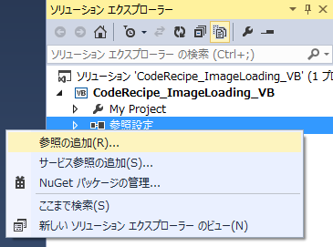

# VB: 画像ファイルの読み込みと変更、保存
## License
- Apache License, Version 2.0
## Technologies
- Visual Studio 2013
## Topics
- 逆引きサンプル コード
- ファイル・ディレクトリ操作
## Updated
- 12/18/2014
## Description

執筆者: <a href="http://msdn.microsoft.com/ja-jp/gg585574#ikehara" target="_blank">
インフラジスティックス・ジャパン株式会社 池原 大然</a>

動作確認環境: Visual Studio 2013、.NET Framework 4.5.2、Windows 8.1 Enterprise 64 bit

<a href="http://msdn.microsoft.com/ja-jp/library/system.drawing.image.aspx" target="_blank">System.Drawing.Image</a> クラス、あるいは Image クラスを継承した
<a href="http://msdn.microsoft.com/ja-jp/library/system.drawing.bitmap.aspx" target="_blank">
Bitmap</a> クラスを利用することで画像ファイルの作成やロード、変更、保存を行うことができます。既存の画像ファイルを Bitmap クラスで読み取る場合にはコンストラクタにてファイル名を指定します。Bitmap クラスでサポートしている形式は、BMP、GIF、EXIF、JPG、PNG、TIFF などになります。

なお、コンソールアプリケーションは初期状態でSystem.Drawing.dll アセンブリがプロジェクトで参照されていないため、[ソリューション エクスプローラ] から [参照の追加] を実行し、アセンブリを予めプロジェクトに追加しておく必要があります。

Bitmap クラスでは読み込んだ画像オブジェクトに対し、<a href="http://msdn.microsoft.com/ja-jp/library/system.drawing.bitmap.setpixel.aspx" target="_blank">SetPixel</a> メソッドを使用することで画像オブジェクトの特定のピクセルを変更することができます。

例として、&rdquo;C:\Images\sample.jpg&rdquo; という画像ファイルを読み込み、ピクセルを変更させた後、&rdquo;C:\Images\sampleNew.jpg&rdquo; と新しい画像ファイルを保存するコードは下記のようになります。

&nbsp;

Visual Basic

スクリプトの編集|Remove

vb

<pre class="js">Imports&nbsp;System.Drawing&nbsp;
&nbsp;
Module&nbsp;Module1&nbsp;
&nbsp;&nbsp;&nbsp;&nbsp;Sub&nbsp;Main()&nbsp;
&nbsp;&nbsp;&nbsp;&nbsp;&nbsp;&nbsp;&nbsp;&nbsp;Dim&nbsp;oFileName&nbsp;As&nbsp;String&nbsp;=&nbsp;&quot;C:\Images\sample.jpg&quot;&nbsp;
&nbsp;&nbsp;&nbsp;&nbsp;&nbsp;&nbsp;&nbsp;&nbsp;Dim&nbsp;nFileName&nbsp;As&nbsp;String&nbsp;=&nbsp;&quot;C:\Images\sampleNew.jpg&quot;&nbsp;
&nbsp;
&nbsp;&nbsp;&nbsp;&nbsp;&nbsp;&nbsp;&nbsp;&nbsp;Using&nbsp;oImage&nbsp;As&nbsp;Bitmap&nbsp;=&nbsp;New&nbsp;Bitmap(oFileName)&nbsp;
&nbsp;&nbsp;&nbsp;&nbsp;&nbsp;&nbsp;&nbsp;&nbsp;&nbsp;&nbsp;&nbsp;&nbsp;For&nbsp;i&nbsp;As&nbsp;Integer&nbsp;=&nbsp;0&nbsp;To&nbsp;oImage.Width&nbsp;-&nbsp;1&nbsp;Step&nbsp;2&nbsp;
&nbsp;&nbsp;&nbsp;&nbsp;&nbsp;&nbsp;&nbsp;&nbsp;&nbsp;&nbsp;&nbsp;&nbsp;&nbsp;&nbsp;&nbsp;&nbsp;For&nbsp;j&nbsp;As&nbsp;Integer&nbsp;=&nbsp;0&nbsp;To&nbsp;oImage.Height&nbsp;-&nbsp;1&nbsp;Step&nbsp;2&nbsp;
&nbsp;&nbsp;&nbsp;&nbsp;&nbsp;&nbsp;&nbsp;&nbsp;&nbsp;&nbsp;&nbsp;&nbsp;&nbsp;&nbsp;&nbsp;&nbsp;&nbsp;&nbsp;&nbsp;&nbsp;oImage.SetPixel(i,&nbsp;j,&nbsp;Color.Blue)&nbsp;
&nbsp;&nbsp;&nbsp;&nbsp;&nbsp;&nbsp;&nbsp;&nbsp;&nbsp;&nbsp;&nbsp;&nbsp;&nbsp;&nbsp;&nbsp;&nbsp;Next&nbsp;
&nbsp;&nbsp;&nbsp;&nbsp;&nbsp;&nbsp;&nbsp;&nbsp;&nbsp;&nbsp;&nbsp;&nbsp;Next&nbsp;
&nbsp;&nbsp;&nbsp;&nbsp;&nbsp;&nbsp;&nbsp;&nbsp;&nbsp;&nbsp;&nbsp;&nbsp;oImage.Save(nFileName)&nbsp;
&nbsp;&nbsp;&nbsp;&nbsp;&nbsp;&nbsp;&nbsp;&nbsp;End&nbsp;Using&nbsp;
&nbsp;&nbsp;&nbsp;&nbsp;&nbsp;&nbsp;&nbsp;&nbsp;<a class="libraryLink" href="https://msdn.microsoft.com/ja-JP/library/System.Diagnostics.Process.Start.aspx" target="_blank" title="Auto generated link to System.Diagnostics.Process.Start">System.Diagnostics.Process.Start</a>(nFileName)&nbsp;
&nbsp;&nbsp;&nbsp;&nbsp;End&nbsp;Sub&nbsp;
End&nbsp;Module&nbsp;
</pre>

上記のサンプルコードでは <a href="http://msdn.microsoft.com/ja-jp/library/system.drawing.bitmap.save.aspx" target="_blank">
Save</a> メソッドを使用し保存するファイル名を指定しています。

また、画像オブジェクトに関する処理を終えたあとは、画像オブジェクト インスタンスを<a href="http://msdn.microsoft.com/ja-jp/library/8th8381z.aspx" target="_blank"> Dispose</a> し、リソースを解放する必要があることについても注意してくさい。今回は Using ステートメントの使用により、自動的にこの処理が行われるように設定しています。

最後にすべての作業が終了した後に保存するファイルの拡張子に関連付けられたアプリケーションが起動するよう、<a class="libraryLink" href="https://msdn.microsoft.com/ja-JP/library/System.Diagnostics.Process.Start.aspx" target="_blank" title="Auto generated link to System.Diagnostics.Process.Start">System.Diagnostics.Process.Start</a> メソッドを実行しています。

<h2>関連リンク</h2>
<ul>
<li><a href="http://msdn.microsoft.com/ja-jp/library/k7e7b2kd.aspx" target="_blank">Image クラス</a>
</li><li><a href="http://msdn.microsoft.com/ja-jp/library/4e7y164x.aspx" target="_blank">Bitmap クラス</a>
</li></ul>

＝＝＝＝＝＝＝＝＝＝＝＝＝＝＝＝＝＝＝＝＝＝＝＝＝＝＝＝＝＝＝＝＝＝＝＝＝＝＝＝＝＝＝＝＝＝＝＝＝＝＝＝＝＝＝＝＝＝＝＝＝＝＝＝＝＝＝＝＝＝＝＝＝＝＝＝＝＝＝＝＝＝＝＝＝＝＝＝＝＝＝＝＝＝＝＝＝＝＝＝＝＝＝＝＝＝＝＝＝＝＝＝＝＝＝＝＝＝＝＝＝＝＝＝＝＝＝＝＝＝＝＝＝＝＝＝＝＝＝＝＝＝＝＝＝＝＝＝＝＝＝＝＝＝＝＝＝＝＝＝＝＝＝＝＝＝＝＝＝＝＝＝＝＝＝＝＝＝＝＝＝＝＝＝＝＝＝＝＝＝＝＝＝＝＝＝＝＝＝＝＝＝＝＝＝＝＝＝＝＝＝＝＝＝＝＝＝＝＝＝＝＝＝＝＝＝＝

